# 一：HelloWorld实战

```dart
// 导入Flutter框架中的基础Material组件库
import 'package:flutter/material.dart';
// Dart语言的入口函数，程序从这里开始执行
void main() {
  // 运行MyApp组件，并将其设置为根组件
  runApp(MyApp());
}
// MyApp类继承自StatelessWidget，表示这个组件是无状态的
class MyApp extends StatelessWidget {
  // 重写StatelessWidget的build方法
  @override
  Widget build(BuildContext context) {
    // 返回一个MaterialApp组件，它是使用Material Design设计风格的应用程序的根组件
    return MaterialApp(
      // 应用程序的标题，这个标题在某些平台可能会显示在任务管理器中
      title: 'Welcome to Flutter',
      // 应用程序的首页
      home: Scaffold(
        // AppBar是应用栏组件，通常包含标题和一些操作按钮
        appBar: AppBar(
          // 应用栏的标题
          title: Text("Welcome to Flutter"),
        ),
        // Scaffold的body属性定义了屏幕的主要内容
        body: Center(
          // Center组件将其子组件居中显示
          child: Text(
            // 显示的文本内容
            "Hello World 修改一切吧！！",
            // 文本样式可以在这里定义，例如字体大小、颜色等
            // 在这个例子中没有定义样式，所以会使用默认样式
          ),
        ),
      ),
    );
  }
}
```
这段代码创建了一个简单的Flutter应用程序，其中包含一个应用栏和一个居中的文本。以下是每个部分的详细解释：
- `import 'package:flutter/material.dart';`：导入Flutter框架中的Material组件库，这是构建Material Design风格应用的基础。
- `void main() { runApp(MyApp()); }`：这是Dart语言的入口函数，程序从这里开始执行。`runApp()`函数接收一个`Widget`作为参数，并将其设置为应用的根组件。
- `class MyApp extends StatelessWidget`：定义了一个名为`MyApp`的类，它继承自`StatelessWidget`。`StatelessWidget`是无状态组件，它的状态不会发生变化。
- `@override`：表示下面的方法是重写了父类的方法。
- `Widget build(BuildContext context)`：这是`StatelessWidget`类中的一个方法，用于构建组件的UI。`BuildContext`是构建组件的上下文环境。
- `return MaterialApp(...);`：返回一个`MaterialApp`组件，它是Material Design风格应用的根组件。
- `title: 'Welcome to Flutter'`：设置应用程序的标题，这个标题在某些平台上可能会显示在任务管理器中。
- `home: Scaffold(...)`：设置应用程序的首页，`Scaffold`提供了一个布局的脚手架，包括应用栏、抽屉、浮动按钮等。
- `appBar: AppBar(...)`：定义了一个应用栏，通常包含标题和一些操作按钮。
- `title: Text("Welcome to Flutter")`：设置应用栏的标题。
- `body: Center(...)`：设置Scaffold的body属性，即屏幕的主要内容。`Center`组件将其子组件居中显示。
- `child: Text("Hello World 修改一切吧！！")`：在屏幕中心显示一段文本。`Text`组件用于显示文本内容。

# 二：组件的认知

## 1.Text组件认知

```dart
import 'package:flutter/material.dart';

void main(){
  runApp(MyApp());
}

class MyApp extends StatelessWidget{
  @override
  Widget build(BuildContext context){
    return MaterialApp(
      title: 'TEXT widget',
      home: Scaffold(
        body:Center(
          child:Text("我很喜欢前端技术，并且愿意为此奋斗一生,我希望可以开发更多的应用",textAlign: TextAlign.center,
          maxLines: 1,overflow: TextOverflow.ellipsis,
          style: TextStyle(
            fontSize: 25.0,
            color: Color.fromARGB(255, 255, 125, 125),
            decoration: TextDecoration.underline,
            decorationStyle: TextDecorationStyle.solid

          ),)
        )
      )
    );
  }
}
```

## 2.Container组件认知

### 2.1Container基础+内嵌Text

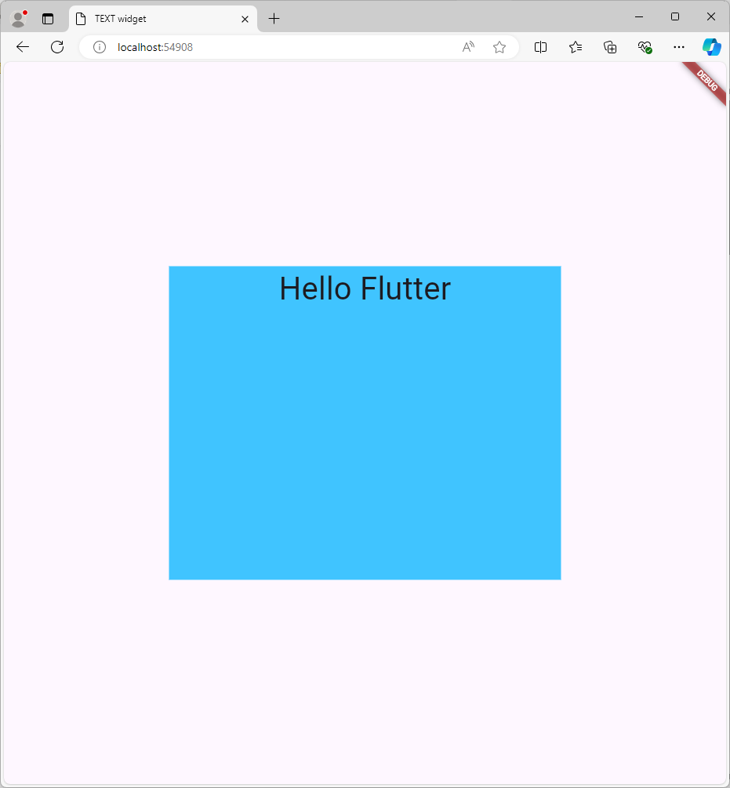

```dart
import 'package:flutter/material.dart';

void main(){
  runApp(MyApp());
}

class MyApp extends StatelessWidget{
  @override
  Widget build(BuildContext context){
    return MaterialApp(
      title: 'TEXT widget',
      home: Scaffold(
        body:Center(
          child:Container(
            child:new Text('Hello Flutter',
            style: TextStyle(fontSize: 40.0)),
            alignment: Alignment.topCenter, 
              //alignment是Container内部组件的对齐方式，并非是Container的对齐方式.
              //可以是Alignment.bottomLeft/Alignment.TopCenter等组合
          width: 500.0,//注意要有小数点后的0
            height: 400.0,
            color: Colors.lightBlueAccent,
          )
        )
      )
    );
  }
}
```

### 2.2Container基础+内外边距+渐变色调+边框

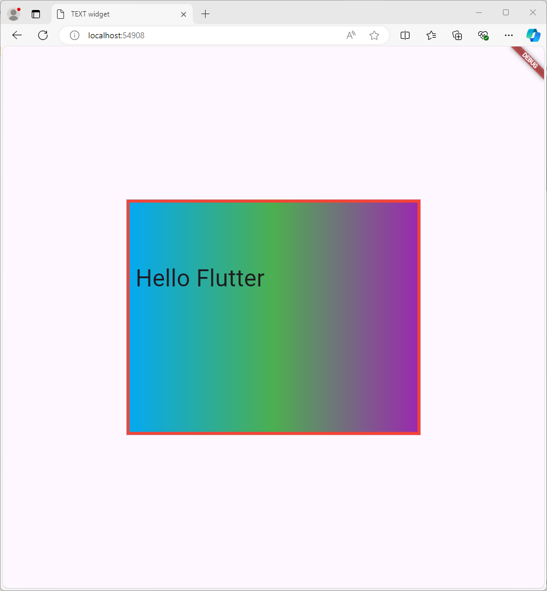

```dart
import 'package:flutter/material.dart';

void main() {
  runApp(MyApp());
}

class MyApp extends StatelessWidget {
  @override
  Widget build(BuildContext context) {
    return MaterialApp(
      title: 'TEXT widget', // 应用程序的标题
      home: Scaffold(
        body: Center(
          // 居中显示子组件
          child: Container(
            // 容器组件
            child: new Text(
              'Hello Flutter', // 显示的文本内容
              style: TextStyle(fontSize: 40.0), // 文本样式，设置字体大小
            ),
            alignment: Alignment.topLeft, // 容器内部组件的对齐方式，这里是顶部左对齐
            width: 500.0, // 容器的宽度
            height: 400.0, // 容器的高度

            padding: const EdgeInsets.fromLTRB(10.0, 100.0, 0.0, 0.0), // 容器的内边距，分别设置左、上、右、下
            margin: const EdgeInsets.all(10.0), // 容器的外边距，所有方向都是10.0

            decoration: new BoxDecoration(
              // 容器的装饰，可以设置背景、边框等
              gradient: const LinearGradient(
                // 背景渐变色，从浅蓝色到绿色再到紫色
                colors: [Colors.lightBlue, Colors.green, Colors.purple],
              ),
              border: Border.all(
                width: 5.0, // 边框宽度
                color: Colors.red, // 边框颜色
              ),
            ),
          ),
        ),
      ),
    );
  }
}

```

## 3.Container+Image+Fit+BlendMode

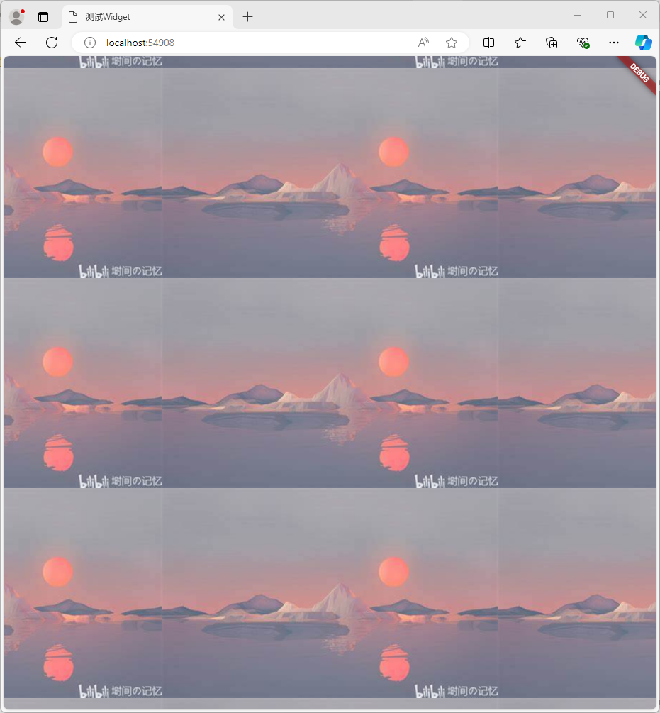

```dart
import 'package:flutter/material.dart';

void main() {
  runApp(MyApp());
}

class MyApp extends StatelessWidget {
  @override
  Widget build(BuildContext context){
    return MaterialApp(
      title: "测试Widget",
      home: Scaffold(
        body:Center(
          child: Container(
            child: new Image.network("https://tse1-mm.cn.bing.net/th/id/OIP-C.v2cIO6AKKrTr8gWoVK9YhQHaEo?rs=1&pid=ImgDetMain",
              repeat: ImageRepeat.repeat,),
            //fit属性：容器和图片之间的关系
            //BoxFit.contain:尽量保持比例，但是维持原图
            //BoxFit.fill：容器优先,图片无所谓了
            //BoxFit.fitWidth:横向要铺满容器,但是纵向可以裁切
            //BoxFit.fitHeigt:与上方相同
            //BoxFit.cover:图片不会变形，但是可能会裁切
            //BoxFit.scaleDown:原图片大小不能变-没什么用

            //color与colorBlendMode
            //BlendMode.darken 使用color来给原图片做透明的染色覆盖
            //如果没有BlendMode,color将直接覆盖图片,有了BlendMode起码还能看到点原图

            //repeat:
            // ImageRepeat.repeat属性可以让图片在整个container里面重复铺满
            // ImageRepeat.repeatY属性在竖直方向上尽可能铺满容器，在水平方向不变
            // ImageRepeat.repeatX属性在水平方向上尽可能铺满容器，在纵向方向不变。
            width: 3000,//容器宽度
            height: 2000,//容器高度
            color: Colors.purple,

          ),

        )
      )
    );
  }
}

```

## 4.ListView组件

### 4.1简单介绍

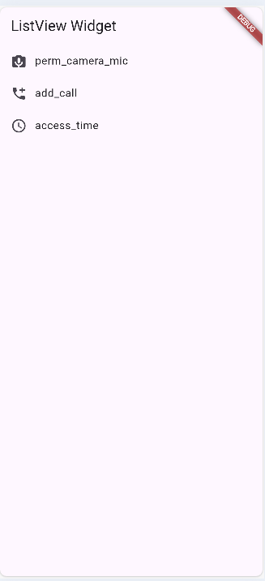

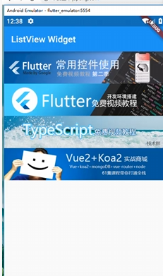

```dart
import 'package:flutter/material.dart';

void main() {
  runApp(MyApp());
}

class MyApp extends StatelessWidget {
  @override
  Widget build(BuildContext context) {
    return MaterialApp(
        title: "Test Flutter demo",
        home: Scaffold(
            appBar: new AppBar(
              title: new Text("ListView Widget"),
            ),
            body: new ListView(children: <Widget>[
              new ListTile(
                leading: new Icon(Icons.perm_camera_mic),
                title: new Text('perm_camera_mic'),
              ),new ListTile(
                leading: new Icon(Icons.add_call),
                title: new Text('add_call'),
              ),new ListTile(
                leading: new Icon(Icons.access_time),
                title: new Text('access_time'),
              )
            ])));
  }
}

```

### 4.2通过scrollDirection设置list排列的方向

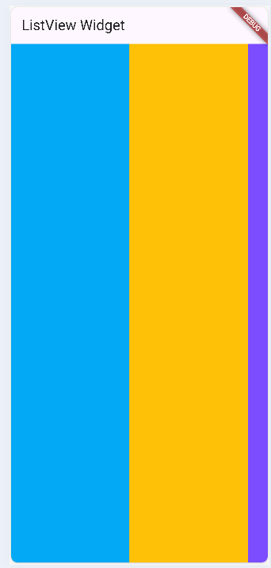

```dart
import 'package:flutter/material.dart';

void main() {
  runApp(MyApp());
}

class MyApp extends StatelessWidget {
  @override
  Widget build(BuildContext context) {
    return MaterialApp(
        title: "Test Flutter demo",
        home: Scaffold(
            appBar: new AppBar(
              title: new Text("ListView Widget"),
            ),
            body: new ListView(
              scrollDirection: Axis.horizontal,//vertical就是竖直方向从上到下排列了
              children: <Widget>[
                new Container(
                  width: 180.0,
                  color: Colors.lightBlue,
                ),
                new Container(
                  width: 180.0,
                  color: Colors.amber,
                ),
                new Container(
                  width: 180.0,
                  color: Colors.deepPurpleAccent,
                )
              ],
            )));
  }
}

```

### 4.3动态列表

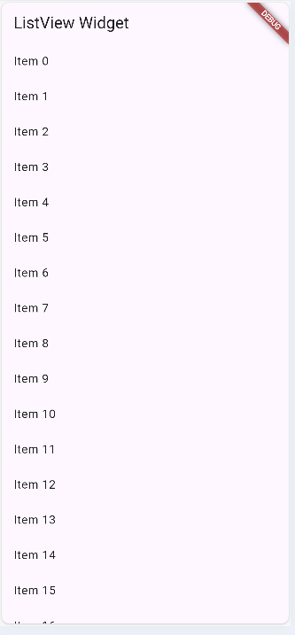

> 在Dart语言中，构造函数用于创建类的新实例。使用`null safety`特性，Dart引入了可空类型和非空类型的概念，以确保变量在使用前被正确初始化。下面，我将通过您提供的代码示例来解释Dart中的构造函数，特别是如何使用`null safety`语法。
> ```dart
> MyApp({Key? key, required this.items}) : super(key: key);
> ```
> 这是一个使用命名构造函数的例子，并且应用了`null safety`特性。以下是代码中各个部分的解释：
> - `MyApp`：这是类的名称。
> - `{Key? key, required this.items}`：这是构造函数的命名参数列表。命名参数用花括号`{}`包裹，并且每个参数都有一个名字。
>   - `Key? key`：`Key`是Flutter框架中的一个类，用于标识Widget。`?`表示`key`参数是可空的（nullable），这意味着它可以是`Key`类型的实例，也可以是`null`。
>   - `required this.items`：`required`关键字表示`items`参数是必须的，调用构造函数时必须提供这个参数。`this.items`是参数的语法糖，表示将传递给构造函数的`items`参数赋值给类的实例变量`items`。
> - `super(key: key)`：在构造函数体之前，使用冒号`:`和`super`关键字调用父类的构造函数。在这里，它将`key`参数传递给父类的构造函数。在Flutter中，几乎所有的Widget都继承自`Widget`类，而`Widget`类的构造函数可以接收一个`key`参数。
> 以下是Dart中构造函数的几个要点：
> 1. **默认构造函数**：如果没有显式定义构造函数，Dart会提供一个默认的无参数构造函数。
> 2. **命名构造函数**：可以使用类名后跟一个点和方法名来定义命名构造函数，例如`MyApp.namedConstructor()`。
> 3. **初始化列表**：在构造函数体执行之前，可以使用初始化列表来设置实例变量的值，例如：`MyApp(this.items) : super(key: key)`。
> 4. **重定向构造函数**：一个构造函数可以调用同一个类中的另一个构造函数，例如：`MyApp() : this._internal()`。
> 5. **常量构造函数**：如果你的类生成的对象永远不会改变，你可以使用`const`关键字定义一个常量构造函数。
> 6. **工厂构造函数**：使用`factory`关键字定义的构造函数不总是创建类的新实例，它可能返回一个缓存实例或者子类的实例。
> 以下是使用`null safety`语法的构造函数示例：
> ```dart
> class MyApp extends StatelessWidget {
>   final List<String> items; // 假设items是一个非空字符串列表
>   // 命名构造函数，使用null safety
>   MyApp({Key? key, required this.items}) : super(key: key);
>   @override
>   Widget build(BuildContext context) {
>     // 构建方法实现...
>   }
> }
> ```
> 在这个例子中，`MyApp`类有一个名为`items`的实例变量，它是必须的（`required`），并且不能为`null`。构造函数允许`key`参数为`null`（`Key? key`），但是它不是必须的（`required`关键字没有使用）。当创建`MyApp`的实例时，必须提供一个非空的`items`列表。

```dart

import 'package:flutter/material.dart';

// 应用程序的入口点
void main() {
  // 使用 MyApp 启动应用，并传入一个生成的字符串列表
  runApp(MyApp(
    items: List<String>.generate(1000, (i) => "Item $i"),
  ));
}

// MyApp 类是一个 StatelessWidget，它表示我们的应用程序
class MyApp extends StatelessWidget {
  final List<String> items; // 声明一个字符串列表，存储项目名称

  // 构造函数，接收一个可选的 key 和必填的 items 列表
  MyApp({Key? key, required this.items}) : super(key: key); // 使用 null safety 语法

  @override
  Widget build(BuildContext context) {
    // build 方法构建 UI
    return MaterialApp(
      title: "Test Flutter demo", // 应用名称
      home: Scaffold(
        appBar: AppBar(
          title: Text("ListView Widget"), // 应用栏标题
        ),
        body: ListView.builder(
          itemCount: items.length, // 列表项的数量
          itemBuilder: (context, index) {
            // itemBuilder 回调函数，用于构建每一项
            return ListTile(
              title: Text('${items[index]}'), // 显示每一项的文本
            );
          },
        ),
      ),
    );
  }
}

```

## 5.GridView：模拟手机相册

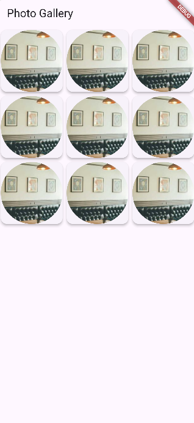

```dart
import 'package:flutter/material.dart';

// 应用程序的入口点
void main() {
  runApp(MyApp()); // 启动应用，运行 MyApp 组件
}

// MyApp 类是一个 StatelessWidget，表示我们的应用程序
class MyApp extends StatelessWidget {
  @override
  Widget build(BuildContext context) {
    return MaterialApp(
      title: 'Photo Gallery', // 应用程序的标题
      home: Scaffold(
        appBar: AppBar(
          title: Text('Photo Gallery'), // 应用栏的标题
        ),
        body: PhotoGrid(), // 主体内容使用 PhotoGrid 组件
      ),
    );
  }
}

// 创建一个 PhotoGrid 组件来显示网格列表
class PhotoGrid extends StatelessWidget {
  // 模拟的图片列表（可以替换为实际的图片路径或 URL）
  final List<String> images = [
    'https://picsum.photos/200/300', // 示例图片 URL
    'https://picsum.photos/200/300',
    'https://picsum.photos/200/300',
    'https://picsum.photos/200/300',
    'https://picsum.photos/200/300',
    'https://picsum.photos/200/300',
    'https://picsum.photos/200/300',
    'https://picsum.photos/200/300',
    'https://picsum.photos/200/300',
  ];

  @override
  Widget build(BuildContext context) {
    return GridView.builder(
      gridDelegate: SliverGridDelegateWithFixedCrossAxisCount(
        crossAxisCount: 3, // 每行显示 3 列
        childAspectRatio: 1, // 设置每个子项的宽高比为 1，即正方形
      ),
      itemCount: images.length, // 网格中项目的数量
      itemBuilder: (context, index) {
        return Card(
          elevation: 4, // 设置卡片的阴影效果
          child: ClipOval( // 将图片裁剪成圆形
            child: Image.network(
              images[index], // 从网络加载指定索引的图片
              fit: BoxFit.cover, // 图片填充方式，保持图片宽高比并覆盖整个区域
            ),
          ),
        );
      },
    );
  }
}

```

## 6.布局设计

### 6.1 RowWidget的详细分析

当然可以！下面是一个简单的 Flutter `Row` 组件的实例代码，其中包含了一些常见的子组件，展示了如何使用 `Row` 来水平排列这些组件。

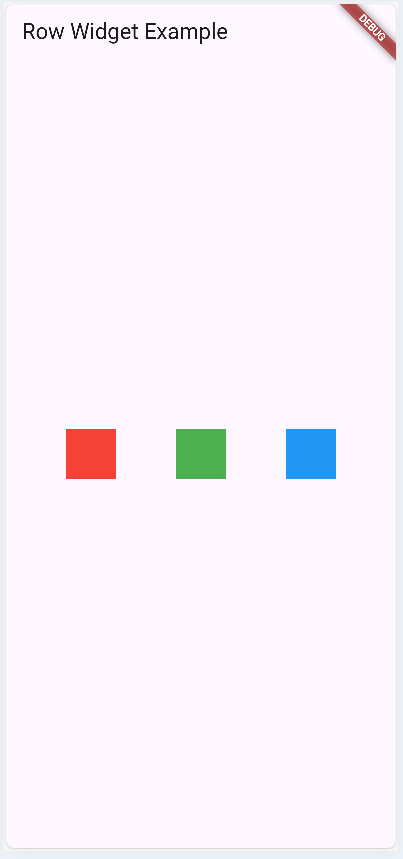

```dart
import 'package:flutter/material.dart';

// 应用程序的入口点
void main() {
  runApp(MyApp());
}

// MyApp 类是一个 StatelessWidget，表示我们的应用程序
class MyApp extends StatelessWidget {
  @override
  Widget build(BuildContext context) {
    return MaterialApp(
      title: 'Row Widget Example', // 应用程序的标题
      home: Scaffold(
        appBar: AppBar(
          title: Text('Row Widget Example'), // 应用栏的标题
        ),
        body: Center(
          child: Row(
            mainAxisAlignment: MainAxisAlignment.spaceEvenly, // 子组件之间的间隔均匀分配
            children: <Widget>[
              // 第一个子组件：红色方块
              Container(
                width: 50,
                height: 50,
                color: Colors.red,
              ),
              // 第二个子组件：绿色方块
              Container(
                width: 50,
                height: 50,
                color: Colors.green,
              ),
              // 第三个子组件：蓝色方块
              Container(
                width: 50,
                height: 50,
                color: Colors.blue,
              ),
            ],
          ),
        ),
      ),
    );
  }
}
```

**代码说明：**

1. **导入 Flutter 的 Material 库**：
   
   ```dart
   import 'package:flutter/material.dart';
   ```
   - 导入 Flutter 提供的 Material Design 组件库。
   
2. **main() 函数**：
   ```dart
   void main() {
     runApp(MyApp());
   ```
   - `main()` 是 Dart 程序的入口点。`runApp()` 方法将 `MyApp` 组件作为根组件启动应用。

3. **MyApp 类**：
   ```dart
   class MyApp extends StatelessWidget {
   ```
   - `MyApp` 继承自 `StatelessWidget`，表示该组件是静态的，不会随着状态的变化而重新构建。

4. **MaterialApp 组件**：
   ```dart
   return MaterialApp(
     title: 'Row Widget Example',
   ```
   - `MaterialApp` 是应用的根组件，提供基本的配置。

5. **Scaffold 组件**：
   ```dart
   home: Scaffold(
     appBar: AppBar(
       title: Text('Row Widget Example'),
     ),
   ```
   - `Scaffold` 提供了一个基本的页面布局结构，包括应用栏和主体内容。

6. **Row 组件**：
   ```dart
   Row(
     mainAxisAlignment: MainAxisAlignment.spaceEvenly,
   ```
   - `Row` 组件用于水平排列其子组件。
   - `mainAxisAlignment: MainAxisAlignment.spaceEvenly` 表示子组件将均匀分布在主轴上（水平）。

7. **Container 组件**：
   ```dart
   Container(
     width: 50,
     height: 50,
     color: Colors.red,
   ```
   - `Container` 是一个通用的容器，用于包装子组件，并可以设置宽、高、颜色等属性。在这个例子中创建了三个不同颜色的方块。

**运行效果**

当你运行这个代码时，会在屏幕中央看到一个水平排列的红色、绿色和蓝色的方块，且它们之间的间隔均匀分布。

如果你有其他问题或需要更多示例，随时告诉我！

### 6.2ColumnWidget的详细分析

`Column` 是 Flutter 中一个非常重要的布局组件，用于在垂直方向上排列多个子组件。下面是对 `Column` 组件的详细分析，包括其基本用法、属性以及常见的应用场景。

#### 基本结构

```dart
import 'package:flutter/material.dart';

void main() {
  runApp(MyApp());
}

class MyApp extends StatelessWidget {
  @override
  Widget build(BuildContext context) {
    return MaterialApp(
      home: Scaffold(
        appBar: AppBar(
          title: Text('Column Widget Example'),
        ),
        body: Column(
          mainAxisAlignment: MainAxisAlignment.center,
          crossAxisAlignment: CrossAxisAlignment.start,
          children: <Widget>[
            Text('Item 1', style: TextStyle(fontSize: 24)),
            Text('Item 2', style: TextStyle(fontSize: 24)),
            Text('Item 3', style: TextStyle(fontSize: 24)),
          ],
        ),
      ),
    );
  }
}
```

#### 主要属性

1. **children**:
   - `children` 属性接收一个 `List<Widget>`，其中包含了要在列中显示的所有子组件。
   
2. **mainAxisAlignment**:
   - 控制主轴（纵轴）上的对齐方式。可选值有：
     - `MainAxisAlignment.start`: 在顶部对齐。
     - `MainAxisAlignment.end`: 在底部对齐。
     - `MainAxisAlignment.center`: 居中对齐。
     - `MainAxisAlignment.spaceBetween`: 子组件在主轴上均匀分布，首尾填充。
     - `MainAxisAlignment.spaceAround`: 子组件之间的空间均匀分配。

3. **crossAxisAlignment**:
   - 控制交叉轴（横轴）上的对齐方式。可选值有：
     - `CrossAxisAlignment.start`: 在左侧对齐（对于从左到右的布局）。
     - `CrossAxisAlignment.end`: 在右侧对齐。
     - `CrossAxisAlignment.center`: 居中对齐。
     - `CrossAxisAlignment.stretch`: 拉伸到最大宽度。

4. **mainAxisSize**:
   - 控制 `Column` 的高度。可选值有：
     - `MainAxisSize.max`: 占据所有可用的垂直空间（默认值）。
     - `MainAxisSize.min`: 仅占据子组件所需的最小空间。

#### 使用场景

- **表单布局**: 在创建垂直排列的表单控件时，例如输入框和按钮。
- **列表展示**: 用于展示一系列垂直排列的文本或图片。
- **界面分组**: 将相关的组件组合在一起，例如标题和内容。

#### 示例应用

以下是一个更复杂的示例，展示了如何使用 `Column` 进行布局：

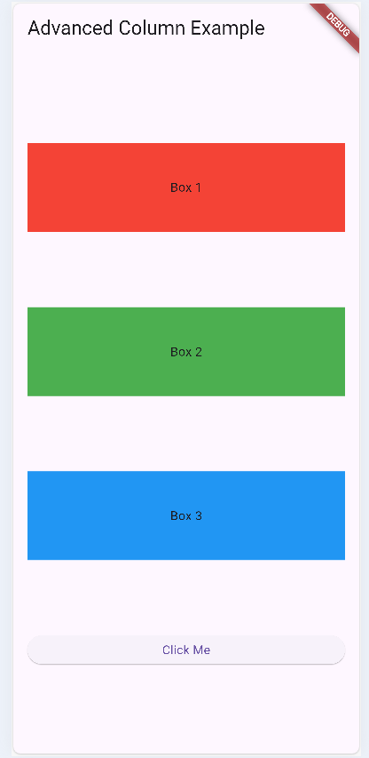

```dart
import 'package:flutter/material.dart';

// 应用程序的入口点
void main() {
  runApp(MyApp()); // 启动 MyApp 作为根组件
}

// 定义 MyApp 类，继承自 StatelessWidget
class MyApp extends StatelessWidget {
  @override
  Widget build(BuildContext context) {
    return MaterialApp(
      // 创建一个 Material 风格的应用程序
      home: Scaffold(
        // Scaffold 是一个提供基本视觉布局结构的组件
        appBar: AppBar(
          title: Text('Advanced Column Example'), // 设置应用栏的标题
        ),
        body: Padding(
          // 使用 Padding 组件给子组件添加内边距
          padding: const EdgeInsets.all(16.0), // 设置内边距为 16 像素
          child: Column(
            // 使用 Column 组件，子组件按垂直方向排列
            mainAxisAlignment: MainAxisAlignment.spaceEvenly, // 子组件之间的间距均匀分配
            crossAxisAlignment: CrossAxisAlignment.stretch, // 子组件在交叉轴上拉伸以填充可用空间
            children: <Widget>[
              Container(
                height: 100, // 设置高度为 100 像素
                color: Colors.red, // 背景颜色为红色
                child: Center(
                  // 将文本居中显示
                  child: Text('Box 1'), // 第一个盒子的文本
                ),
              ),
              Container(
                height: 100,
                color: Colors.green, // 背景颜色为绿色
                child: Center(
                  child: Text('Box 2'), // 第二个盒子的文本
                ),
              ),
              Container(
                height: 100,
                color: Colors.blue, // 背景颜色为蓝色
                child: Center(
                  child: Text('Box 3'), // 第三个盒子的文本
                ),
              ),
              ElevatedButton(
                // 创建一个提升的按钮
                onPressed: () {
                  // 点击按钮时的回调函数
                },
                child: Text('Click Me'), // 按钮上的文本
              ),
            ],
          ),
        ),
      ),
    );
  }
}

```

#### 注意事项

1. **溢出问题**: 如果 `Column` 中的子组件总高度超过屏幕高度，可能会导致溢出错误。可以使用 `SingleChildScrollView` 来解决这一问题。

2. **性能考虑**: 在涉及大量子组件时，可以考虑使用 `ListView` 代替 `Column`，以提高性能。

通过以上分析，你应该能够更好地理解和使用 `Column` 组件。如果你有更多问题或想了解具体的应用实例，请随时告诉我！

### 6.3StackWidget的分析

`Stack` 是 Flutter 中一个非常有用的布局小部件，它允许子小部件在同一位置叠加，并且可以通过控制每个子小部件的 `alignment` 和 `fit` 属性来调整它们的布局。下面是关于 `Stack` 的一些详细知识，以及一个复杂的例子供你学习。

#### Stack Widget 详解

1. **基本概念**:
   - `Stack` 小部件允许在其上层叠放多个子小部件。
   - 每个子小部件可以根据其在栈中的顺序进行定位，最后添加的子小部件会在最上面。

2. **属性**:
   - `alignment`: 控制子小部件的对齐方式，默认为 `Alignment.topLeft`。
   - `fit`: 决定子小部件的大小，常用值包括 `StackFit.loose`、`StackFit.expand` 和 `StackFit.passthrough`。
   - `overflow`: 控制如何处理超出 Stack 边界的子小部件（如 `Overflow.visible`、`Overflow.clip`）。

3. **使用场景**:
   - 可以用来实现重叠效果，例如创建卡片、图像叠加等。

#### 复杂示例

下面是一个使用 `Stack` 的复杂示例，其中我们将创建一个用户资料卡片，上面有头像、用户名、描述和一个背景图像。

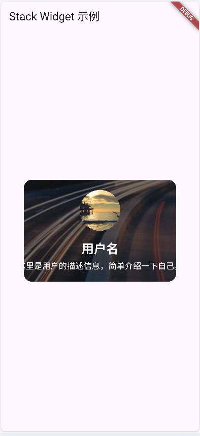

```dart
import 'package:flutter/material.dart';

void main() {
  runApp(MyApp()); // 运行我们的 MyApp
}

class MyApp extends StatelessWidget {
  @override
  Widget build(BuildContext context) {
    return MaterialApp(
      // 创建 MaterialApp，是 Flutter 应用的根组件
      home: Scaffold(
        // 使用 Scaffold 提供基本的页面结构
        appBar: AppBar(title: Text('Stack Widget 示例')), // 应用的顶部应用栏
        body: Center(
          // 在屏幕中心放置内容
          child: ProfileCard(), // 显示我们自定义的 ProfileCard 小部件
        ),
      ),
    );
  }
}

class ProfileCard extends StatelessWidget {
  @override
  Widget build(BuildContext context) {
    return Stack(
      alignment: Alignment.center, // 设置子小部件的对齐方式为居中
      children: [
        // 背景图像
        Container(
          width: 300, // 容器宽度
          height: 200, // 容器高度
          decoration: BoxDecoration(
            image: DecorationImage(
              image: NetworkImage('https://picsum.photos/200/300'), // 从网络加载背景图像
              fit: BoxFit.cover, // 图像适应容器
            ),
            borderRadius: BorderRadius.circular(16), // 圆角效果
          ),
        ),
        // 半透明黑色遮罩
        Container(
          width: 300, // 与背景容器相同的宽度
          height: 200, // 与背景容器相同的高度
          decoration: BoxDecoration(
            color: Colors.black.withOpacity(0.5), // 黑色并设置透明度
            borderRadius: BorderRadius.circular(16), // 圆角效果
          ),
        ),
        // 头像
        Positioned(
          top: 20, // 头像距离顶部的距离
          child: CircleAvatar(
            radius: 40, // 头像半径
            backgroundImage: NetworkImage('https://picsum.photos/200/301'), // 从网络加载头像
          ),
        ),
        // 用户名
        Positioned(
          bottom: 50, // 用户名距离底部的距离
          child: Text(
            '用户名', // 显示的文本
            style: TextStyle(
              color: Colors.white, // 字体颜色为白色
              fontSize: 24, // 字体大小
              fontWeight: FontWeight.bold, // 加粗字体
            ),
          ),
        ),
        // 描述
        Positioned(
          bottom: 20, // 描述距离底部的距离
          child: Text(
            '这里是用户的描述信息，简单介绍一下自己。', // 显示的文本
            style: TextStyle(
              color: Colors.white, // 字体颜色为白色
              fontSize: 16, // 字体大小
            ),
            textAlign: TextAlign.center, // 文本居中对齐
          ),
        ),
      ],
    );
  }
}

```

#### 代码解析

1. **`Stack` 布局**:
   - 我们定义了一个 `Stack`，其中包含多个子小部件：背景图、遮罩、头像、用户名和描述。

2. **背景图**:
   - 使用 `Container` 和 `DecorationImage` 来显示背景图像。

3. **遮罩**:
   - 在背景图之上添加一个半透明的黑色 `Container`，以增强文本的可读性。

4. **头像**:
   - 使用 `Positioned` 来定位头像，确保它出现在顶部中间位置。

5. **文本**:
   - 再次使用 `Positioned` 来控制用户名和描述的位置，使它们在卡片底部可见。

### 6.4Positioned组件-隶属于Stack

当然可以！下面我将详细介绍 `Positioned` 组件，并给出一个比较复杂的实现案例供你学习。

`Positioned` 组件简介

`Positioned` 组件用于在 `Stack` 小部件中精确定位子小部件。通过设置 `top`、`bottom`、`left` 和 `right` 属性，可以控制子小部件相对于其父 `Stack` 组件的位置。`Positioned` 只能用于 `Stack` 的子级，允许更加灵活和自由的布局。

#### 属性说明

- `top`: 控制子小部件距离 Stack 顶部的距离。
- `bottom`: 控制子小部件距离 Stack 底部的距离。
- `left`: 控制子小部件距离 Stack 左边的距离。
- `right`: 控制子小部件距离 Stack 右边的距离。
- `width`: 设置子小部件的宽度。
- `height`: 设置子小部件的高度。

#### 示例代码

下面是一个较复杂的示例，展示如何使用 `Positioned` 组件创建一个带有多个层次的用户资料卡，包括头像、用户名、描述和社交媒体图标。

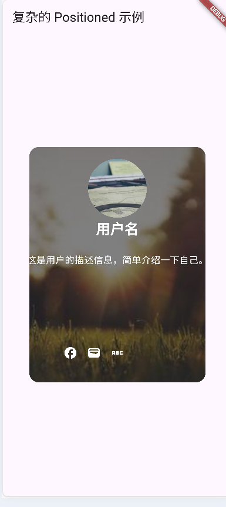

```dart
import 'package:flutter/material.dart';

void main() {
  runApp(MyApp()); // 启动应用
}

class MyApp extends StatelessWidget {
  @override
  Widget build(BuildContext context) {
    return MaterialApp(
      home: Scaffold(
        appBar: AppBar(title: Text('复杂的 Positioned 示例')),
        body: Center(child: UserProfileCard()), // 中心显示用户资料卡
      ),
    );
  }
}

class UserProfileCard extends StatelessWidget {
  @override
  Widget build(BuildContext context) {
    return Stack(
      alignment: Alignment.center, // 居中对齐
      children: [
        // 背景
        Container(
          width: 300,
          height: 400,
          decoration: BoxDecoration(
            image: DecorationImage(
              image: NetworkImage('https://picsum.photos/200/301'), // 背景图
              fit: BoxFit.cover,
            ),
            borderRadius: BorderRadius.circular(16), // 圆角
          ),
        ),
        // 半透明遮罩层
        Container(
          width: 300,
          height: 400,
          decoration: BoxDecoration(
            color: Colors.black.withOpacity(0.5), // 半透明黑色
            borderRadius: BorderRadius.circular(16),
          ),
        ),
        // 头像
        Positioned(
          top: 20,
          child: CircleAvatar(
            radius: 50,
            backgroundImage: NetworkImage('https://picsum.photos/200/302'), // 头像图
          ),
        ),
        // 用户名
        Positioned(
          top: 120,
          child: Text(
            '用户名',
            style: TextStyle(
              color: Colors.white,
              fontSize: 24,
              fontWeight: FontWeight.bold,
            ),
          ),
        ),
        // 用户描述
        Positioned(
          top: 180,
          child: Container(
            padding: EdgeInsets.symmetric(horizontal: 10),
            child: Text(
              '这是用户的描述信息，简单介绍一下自己。',
              style: TextStyle(
                color: Colors.white,
                fontSize: 16,

              ),

            ),
          ),
        ),
        // 社交媒体图标
        Positioned(
          bottom: 30,
          left: 50,
          child: Row(
            children: [
              IconButton(
                icon: Icon(Icons.facebook, color: Colors.white),
                onPressed: () {
                  // Facebook 按钮点击事件
                },
              ),
              IconButton(
                icon: Icon(Icons.wallet, color: Colors.white),
                onPressed: () {
                  // Twitter 按钮点击事件
                },
              ),
              IconButton(
                icon: Icon(Icons.abc_sharp, color: Colors.white),
                onPressed: () {
                  // Instagram 按钮点击事件
                },
              ),
            ],
          ),
        ),
      ],
    );
  }
}
```

#### 代码详解

1. **主函数**：
   - `void main() { runApp(MyApp()); }`：应用的入口，通过 `runApp` 启动 `MyApp`。

2. **MyApp 类**：
   - 创建一个 `MaterialApp` 包裹整个应用，包含一个 `Scaffold` 组件。

3. **UserProfileCard 类**：
   - 使用 `Stack` 组件来叠加多个子组件，形成复杂的用户资料卡。

4. **背景容器**：
   - 使用 `Container` 和 `BoxDecoration` 来设置背景图像和圆角效果。

5. **遮罩层**：
   - 再次使用 `Container`，设置半透明的黑色遮罩，增强文本的可读性。

6. **头像**：
   - 使用 `Positioned` 定位头像，使用 `CircleAvatar` 显示用户头像。

7. **用户名和描述**：
   - 使用 `Text` 显示用户的名称和描述，采用 `Positioned` 进行定位。

8. **社交媒体图标**：
   - 使用 `Row` 组件在底部横向排列社交媒体图标，利用 `IconButton` 提供交互功能。

#### 学习要点

- 理解 `Positioned` 如何在 `Stack` 中定制组件位置。
- 学会组合使用 `Container`、`BoxDecoration`、`Text`、`IconButton` 等组件来构建复杂的 UI。
- 通过调整各个组件的 `top`、`bottom`、`left` 和 `right` 属性来实现所需的布局效果。

如果你还有其他问题或需要更多示例，请随时问我！

### 6.5CardWidget设计

#### `Card` 组件简介

在 Flutter 中，`Card` 是一个用于展示信息的材料设计组件。它通常用于显示相关内容的集合，比如图像、文本和操作按钮。`Card` 提供了一种简单的方式来创建具有阴影和圆角的容器，使其在视觉上更具吸引力。

主要属性

- `child`: 要放置在 `Card` 内部的子组件，可以是任何 Widget。
- `elevation`: 卡片的阴影深度，控制卡片的高度和浮动效果（默认为 1.0）。
- `shape`: 设置卡片的形状，可以使用 `RoundedRectangleBorder`、`CircleBorder` 等。
- `color`: 设置卡片的背景颜色。

#### 示例代码

下面是一个复杂的 `Card` 示例，展示一个用户评论卡片，包括头像、用户名、评论内容和一个操作按钮。我们将利用 `Card` 组件来创建一个更丰富的用户界面。

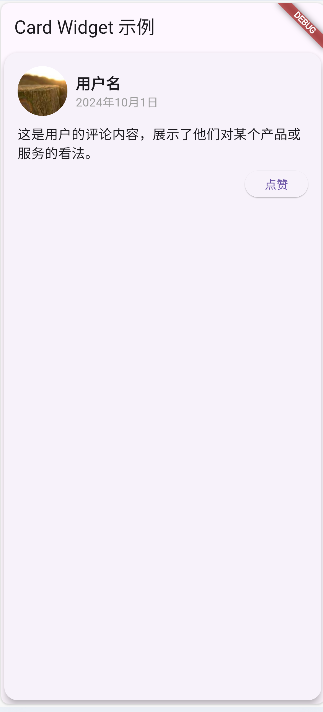

```dart
import 'package:flutter/material.dart';

void main() {
  runApp(MyApp());
}

class MyApp extends StatelessWidget {
  @override
  Widget build(BuildContext context) {
    return MaterialApp(
      title: 'Card Widget 示例',
      home: Scaffold(
        appBar: AppBar(
          title: Text('Card Widget 示例'),
        ),
        body: Center(child: CommentCard()),
      ),
    );
  }
}

class CommentCard extends StatelessWidget {
  @override
  Widget build(BuildContext context) {
    return Card(
      elevation: 8, // 设置阴影
      shape: RoundedRectangleBorder(
        borderRadius: BorderRadius.circular(16), // 圆角
      ),
      child: Padding(
        padding: const EdgeInsets.all(16.0),
        child: Column(
          crossAxisAlignment: CrossAxisAlignment.start, // 左对齐
          children: [
            Row(
              children: [
                CircleAvatar(
                  radius: 30,
                  backgroundImage: NetworkImage('https://picsum.photos/200/302'), // 用户头像
                ),
                SizedBox(width: 10), // 间距
                Column(
                  crossAxisAlignment: CrossAxisAlignment.start, // 左对齐
                  children: [
                    Text(
                      '用户名',
                      style: TextStyle(fontWeight: FontWeight.bold, fontSize: 18),
                    ),
                    Text(
                      '2024年10月1日',
                      style: TextStyle(color: Colors.grey),
                    ),
                  ],
                ),
              ],
            ),
            SizedBox(height: 10), // 间距
            Text(
              '这是用户的评论内容，展示了他们对某个产品或服务的看法。',
              style: TextStyle(fontSize: 16),
            ),
            SizedBox(height: 10), // 间距
            Row(
              mainAxisAlignment: MainAxisAlignment.end, // 右对齐
              children: [
                ElevatedButton(
                  onPressed: () {
                    // 操作按钮点击事件
                    ScaffoldMessenger.of(context).showSnackBar(
                      SnackBar(content: Text('已点赞！')),
                    );
                  },
                  child: Text('点赞'),
                ),
              ],
            ),
          ],
        ),
      ),
    );
  }
}
```

#### 代码详解

1. **主函数**：
   - `void main() { runApp(MyApp()); }`：启动应用，主入口。

2. **MyApp 类**：
   - 包含一个 `MaterialApp` 和 `Scaffold`，提供基本的页面结构。

3. **CommentCard 类**：
   - 使用 `Card` 组件来创建一个用户评论的UI。

4. **Card 属性**：
   - `elevation`: 设置为 `8`，使卡片具有明显的阴影效果。
   - `shape`: 使用 `RoundedRectangleBorder` 将卡片的角设置为圆角，增加视觉美感。

5. **Padding**：
   - 用于为卡片内部内容添加边距，使内容不与边缘贴合。

6. **Column 布局**：
   - 使用 `Column` 垂直排列子组件，从而形成用户信息和评论的布局。

7. **Row 布局**：
   - 上方的 `Row` 用于并排显示头像和用户名/日期，头像使用 `CircleAvatar` 显示。

8. **评论内容**：
   - 使用 `Text` 显示用户的评论内容，并设置不同大小的字体。

9. **操作按钮**：
   - 使用 `ElevatedButton` 创建一个“点赞”按钮，点击后通过 `SnackBar` 显示反馈。

#### 学习要点

- 理解 `Card` 组件的基本用法及其属性配置。
- 学会使用 `Padding`、`Row`、`Column` 组合布局。
- 了解如何使用 `CircleAvatar` 显示头像以及如何设置图片源。
- 通过 `ElevatedButton` 实现交互功能，并利用 `SnackBar` 提供用户反馈。

如果你还有其他问题或需要进一步的示例，请随时告诉我！

## 7.父子组件跳转

在 Flutter 中，导航是用户界面设计的重要部分，它允许用户在应用的不同页面之间切换。父子页面的跳转与返回主要依赖于 `Navigator` 类，同时 `BuildContext` 在这个过程中扮演着重要的角色。

### 1. Context 的意义

- **上下文**：每个 Widget 都有一个 `BuildContext`，它包含了该 Widget 在 Widget 树中的位置，以及它的父级和祖先信息。
- **获取信息**：通过 `BuildContext`，你可以访问主题、媒体查询、路由等信息。
- **导航**：在使用 `Navigator` 进行页面跳转时，需要传递 `BuildContext`，以便 Navigator 知道从哪个位置推送新的页面。

### 2. Navigator 的基本用法

- **push**：用于将新页面推入路由栈。
- **pop**：用于返回到上一个页面，通常会移除当前页面。
- **pushReplacement**：替换当前页面，而不是将其推入栈。

### 3. 示例代码

下面是一个复杂的 Flutter 应用示例，演示如何使用 Navigator 在父子页面间进行跳转和返回。

#### 示例代码结构

- **主页面**（HomePage）：包含两个按钮，用于导航到子页面。
- **子页面**（DetailPage）：展示详细信息，并有返回按钮。

```dart
import 'package:flutter/material.dart';

void main() {
  // 应用程序的入口点，runApp() 方法启动整个 Flutter 应用
  runApp(MyApp());
}

class MyApp extends StatelessWidget {
  @override
  Widget build(BuildContext context) {
    // 构建 MaterialApp，应用程序的根组件
    return MaterialApp(
      title: 'Flutter Navigation Demo', // 应用的标题
      theme: ThemeData(primarySwatch: Colors.blue), // 设置主题颜色
      home: HomePage(), // 指定首页为 HomePage
    );
  }
}

class HomePage extends StatelessWidget {
  @override
  Widget build(BuildContext context) {
    // 构建主页面的 UI
    return Scaffold(
      appBar: AppBar(
        title: Text('主页面'), // 设置 AppBar 的标题
      ),
      body: Center(
        child: Column(
          mainAxisAlignment: MainAxisAlignment.center, // 垂直居中对齐
          children: [
            // 第一个按钮，跳转到子页面1
            ElevatedButton(
              onPressed: () {
                Navigator.push(
                  context,
                  MaterialPageRoute(
                    builder: (context) => DetailPage(title: '子页面 1', message: '这是子页面 1 的内容'),
                  ),
                );
              },
              child: Text('跳转到子页面 1'), // 按钮文本
            ),
            // 第二个按钮，跳转到子页面2
            ElevatedButton(
              onPressed: () {
                Navigator.push(
                  context,
                  MaterialPageRoute(
                    builder: (context) => DetailPage(title: '子页面 2', message: '这是子页面 2 的内容'),
                  ),
                );
              },
              child: Text('跳转到子页面 2'), // 按钮文本
            ),
          ],
        ),
      ),
    );
  }
}

class DetailPage extends StatelessWidget {
  final String title; // 页面标题
  final String message; // 页面内容

  // 构造函数，使用 required 关键字确保参数不能为空
  DetailPage({required this.title, required this.message});

  @override
  Widget build(BuildContext context) {
    // 构建子页面的 UI
    return Scaffold(
      appBar: AppBar(
        title: Text(title), // 设置 AppBar 的标题为传入的标题
        leading: IconButton(//在 Flutter 中，leading 是 AppBar 的一个属性，用于设置在 AppBar 左侧的组件。通常用来放置一个图标或者按钮，比如返回按钮
          icon: Icon(Icons.arrow_back), // 返回按钮图标
          onPressed: () {
            Navigator.pop(context); // 点击时返回上一个页面
          },
        ),
      ),
      body: Center(
        child: Column(
          mainAxisAlignment: MainAxisAlignment.center, // 垂直居中对齐
          children: [
            Text(
              message, // 显示传入的内容
              style: TextStyle(fontSize: 24), // 设置字体大小
              textAlign: TextAlign.center, // 文本居中
            ),
            SizedBox(height: 20), // 添加垂直间距
            ElevatedButton(
              onPressed: () {
                // 点击此按钮将替换当前页面为 AnotherPage
                Navigator.pushReplacement(
                  context,
                  MaterialPageRoute(
                    builder: (context) => AnotherPage(),
                  ),
                );
              },
              child: Text('替换为另一个页面'), // 按钮文本
            ),
          ],
        ),
      ),
    );
  }
}

class AnotherPage extends StatelessWidget {
  @override
  Widget build(BuildContext context) {
    // 构建另一个页面的 UI
    return Scaffold(
      appBar: AppBar(
        title: Text('另一个页面'), // 设置 AppBar 的标题
      ),
      body: Center(
        child: ElevatedButton(
          onPressed: () {
            Navigator.pop(context); // 返回到前一个页面
          },
          child: Text('返回'), // 按钮文本
        ),
      ),
    );
  }
}

```

### 代码详解

1. **主函数**：
   - `void main() { runApp(MyApp()); }`: 启动应用。

2. **MyApp 类**：
   - 使用 `MaterialApp` 设置主题和首页。

3. **HomePage 类**：
   - 包含两个按钮，每个按钮用于导航到不同的子页面。
   - `Navigator.push()` 方法将新的页面添加到路由栈中。

4. **DetailPage 类**：
   - 接受标题和消息作为参数。
   - 在 AppBar 中提供返回按钮，点击后调用 `Navigator.pop(context)` 返回上一个页面。
   - 提供替换按钮，将当前页面替换为 `AnotherPage`。

5. **AnotherPage 类**：
   - 只有一个返回按钮，可以返回到 `DetailPage`。

### 学习要点

- 理解 `BuildContext` 的作用，特别是在导航过程中。
- 学会使用 `Navigator.push` 和 `Navigator.pop` 进行页面跳转与返回。
- 了解如何在页面间传递数据（如标题和消息）。
- 学会使用 `Navigator.pushReplacement` 来替换当前页面。

