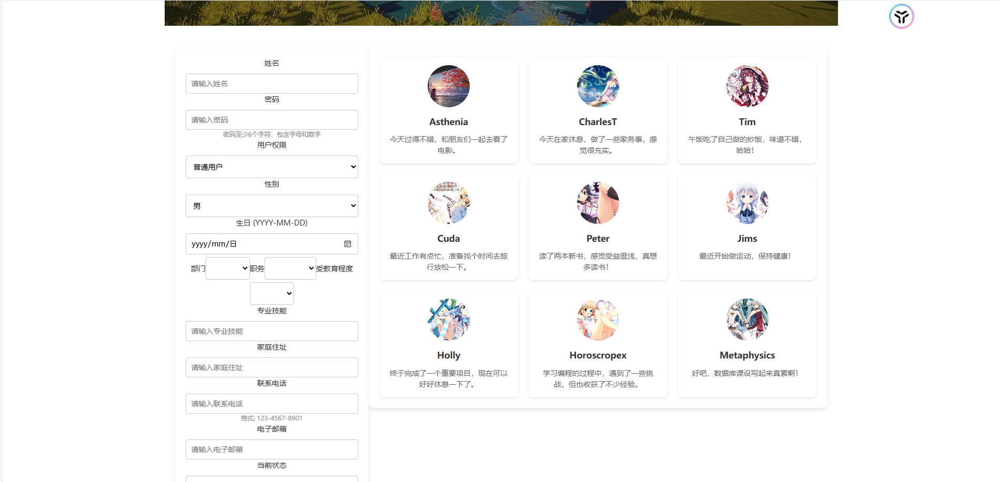

# 0.项目一览图

## 0.1:项目主页

## 0.2:员工留言板

## 0.3员工注册页面

## 0.4员工登录页面

## 0.5:员工页面

## 0.6:管理员页面

# 1:项目细节UI

## 1.1:根据"authority"字段判定是否可以访问[用户入口]和[管理入口]

## 1.2:使用V-if+模态框：在不改变页面路由的情况下展示以浮动框展示表格内容	

# 2.前后端技术选型

| 前端部分   | 后端部分          |
| ---------- | ----------------- |
| Vue.js 3.5 | Springboot 3.0.2  |
| Axios      | MybatisPlus 3.5.5 |
| Vue-router |                   |
|            |                   |
|            |                   |
|            |                   |
|            |                   |
|            |                   |
|            |                   |

# 3.图例分析

# 4.开发流程

0.前后端建立工程文档，分版本记录迭代内容。

1.确定大致的业务方向

2.开始后端工程

A.数据库表设计：字段,外键,表关系

B.后端技术栈选择：SpringBoot,Mybatis-plus

C.撰写后端开发文档,注明后端项目的依赖版本,测试各依赖是否能协同工作,避免在代码开发完成后发现依赖存在问题,在更换依赖时影响已开发的成果

D.设计业务接口：根据数据库的表结构以及业务方向，将业务功能分块成不同的组，譬如Admin,User,Discuss三个组。代表管理员相关的API，用户相关的API，博客相关的API。

E.在分组后，在不同的分组内采取RestFul风格补充具体接口。譬如/Admin/employee/list

F.根据数据库表结构实现EntityPOJO类

G.根据前端发送的请求体，确定Request和Response的POJO类

H.根据Entity，完成DTOPOJO类。

I.先干Mapper层,再干Service接口,再写ServiceImpl.再让Controller调Service

J.一个分组的API写完，使用API测试平台立刻请求接口的可用性。有问题赶紧改。改完之后这部分标注后端完成，等着写前端项目用

3.开始前端工程

A.大致画产品图，草图确定整个UI的布局，导航栏的排布。开始撰写前端工程文档。

B.Vue3项目初始化，配置vite.config.js,实现前端跨域，为axios请求做准备

C.根据业务需求画Vue组件

D.设计Vue-router权限，给不同组件不同的跳转权限

E.每个组件设计axios发包，测试是否能正常和后端通讯，拿到返回json后，处理json，渲染到界面中。

F.美化UI布局。