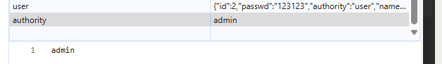

# 1.技术选型与环境变量

## 1.1技术选型

|      依赖名称      | 版本号 |
| :----------------: | :----: |
|        vue         | 3.5.12 |
|     vue-router     | 4.0.13 |
| @vitejs/plugin-vue | 5.1.4  |
|        vite        | 5.4.10 |
|    arco-design     |        |
|       axios        |        |
|                    |        |
|                    |        |
|                    |        |

## 1.2.前后端的跨域问题

在vite.config.js中

```js
import { defineConfig } from 'vite';
import vue from '@vitejs/plugin-vue'; // 导入 Vue 插件

// https://vite.dev/config/
export default defineConfig({
  plugins: [vue()], // 在 plugins 数组中添加 vue 插件
  server: {
    proxy: {
      // 配置代理，将前端请求的接口路径代理到后端的 localhost:8080 上
      '/Admin': {
        target: 'http://localhost:8080/Admin', // 后端服务的地址
        changeOrigin: true, // 是否改变请求头中的Origin字段
        rewrite: (path) => path.replace(/^\/Admin/, ''), // 重写路径，去掉前缀
      },
      '/User': {
        target: 'http://localhost:8080/User', // 后端服务的地址
        changeOrigin: true, // 是否改变请求头中的Origin字段
        rewrite: (path) => path.replace(/^\/User/, ''), // 重写路径，去掉前缀
      }
    }
  }
});

```

因为我们的前端是localhost:5173；但是后端是localhost:8080

当我们在前端通过axios进行发包的时候,前面的`IP+端口`和后端的`IP+端口`是不一致的

因此我们需要配置proxy,让前端的`localhost:5173/Admin`等价于后端的`localhost:8080/Admin`

其次关于rewrite:

> ### 举个例子
>
> 假设你的前端请求路径是 `/Admin/api/login`，并且你配置了以下代理：
>
> ```
> jsCopy Code'/Admin': {
>   target: 'http://localhost:8080/Admin',
>   rewrite: (path) => path.replace(/^\/Admin/, '')
> }
> ```
>
> 1. 前端发送请求：
>    - 请求：`/Admin/api/login`
> 2. 代理生效后：
>    - 请求路径通过 `rewrite` 被重写为：`/api/login`
> 3. 请求被转发到目标服务器：
>    - 请求被转发到 `http://localhost:8080/api/login`。
>
> 通过这种方式，前端可以使用 `/Admin` 或 `/User` 前缀来区分不同的功能模块，而后端可以按照统一的 API 结构处理这些请求，避免了前端和后端之间路径不一致的问题。

我们这里用rewrite,然后再target中加上这个rewrite去掉的状态，其实结果是不变的。

我们是为了展示rewrite的功能才这样写的

> ### `changeOrigin` 的作用
>
> - **`changeOrigin: true`**：请求的 `Origin` 字段会被修改为目标服务器的地址（即 `target` 的域名）。
> - **`changeOrigin: false`（默认值）**：请求的 `Origin` 字段保持不变，即保持原始请求的来源。
>
> ### 为什么要使用 `changeOrigin`？
>
> 在开发过程中，尤其是进行跨域请求时，浏览器会验证请求的 `Origin` 字段，确保它与目标服务器的跨域策略一致。比如，当你从 `http://localhost:3000` 向 `http://api.example.com` 发送请求时，目标服务器可能会检查请求头中的 `Origin` 字段，看它是否匹配服务器允许的来源。如果不匹配，服务器可能会拒绝这个请求。
>
> 当你使用代理时，`changeOrigin: true` 会把请求的 `Origin` 改成代理目标的地址，从而绕过这种跨域问题，模拟直接从目标服务器发起的请求，避免服务器因为跨域问题拒绝请求。
>
> ### 示例
>
> 假设你正在开发一个前端应用，运行在 `http://localhost:3000`，并且想要通过代理请求后端服务器，后端服务器的 URL 是 `http://api.example.com`。
>
> #### 不使用 `changeOrigin`
>
> 在这种情况下，前端请求头中的 `Origin` 会是 `http://localhost:3000`，后端服务器收到请求时会看到这个 `Origin` 字段。如果后端没有允许 `localhost:3000` 作为合法来源，浏览器会阻止请求。
>
> #### 使用 `changeOrigin: true`
>
> 如果你在代理配置中启用了 `changeOrigin: true`，代理服务器会将请求的 `Origin` 修改为目标服务器的地址 `http://api.example.com`，这就模拟了请求是直接从 `http://api.example.com` 发出的，后端服务器会接受这个请求，避免了跨域问题。

# 2.权限设计

# 3.路由设计

## 3.1路由分类设计

## 3.2路由守卫+axios接收后端值+权限判断

- 业务流程：

  - 登录界面发送登录请求
  - 登录成功后，后端发送登录用户的全部数据作为一个json
  - 我们拆分json中的字段->找到"authority"字段,用来表明登录成功后的身份
  - 将authority字段中的值去掉括号->例如本来是"admin",要处理成admin
  - 设置localstorage中的isLoggedIn字段为true,表明已经登录成功
  - 在vue-router中的router.beforeEach中进行路由权限判断

- 代码实现

- ```js
  router.beforeEach((to, from, next) => {
      const isAuthenticated = localStorage.getItem('isLoggedIn') === 'true';
      const userAuthority = localStorage.getItem('authority');
  
      if (to.meta.requiresAuth && !isAuthenticated) {
          console.log("用户未登录，重新跳转登录页面");
          next('/Login');
      } else if (to.meta.role) {
          // 检查用户角色是否满足路由权限要求
          if (userAuthority) {
              // 如果存在角色值，判断角色是否匹配
              if (userAuthority === to.meta.role) {
                  next();  // 用户角色符合要求，放行
              } else {
                  console.log("用户权限不足，重新跳转首页页面");
                  next('/');  // 用户权限不足，跳转到首页
              }
          } else {
              console.log("用户角色未设置，跳转到登录页面");
              next('/Login');  // 如果没有角色，跳转到登录页
          }
      } else {
          next(); // 不需要权限的页面，直接放行
      }
  });
  ```

- 路由的权限规定：

  - ```js
     {
            path: '/AdminOperation',
            component: () => import('/src/pages/Operation/AdminOperation.vue'),  // 管理操作页
            meta: { requiresAuth: true, role: 'admin' }  // 只有管理员可以访问
        },
        {
            path: '/PersonOperation',
            component: () => import('/src/pages/Operation/PersonOperation.vue'),  // 员工操作页
            meta: { requiresAuth: true, role: 'user' }  // 只有员工可以访问
        },
        {
            path: '/SelfInformation',
            component: () => import('/src/pages/Self/SelfInformation.vue'),  // 个人信息页
            meta: { requiresAuth: true }  // 需要认证的页面
        }
    ```

  - 路由的权限：是通过meta设置的。首先是`requiresAuth:true`接着就是`role:'user'` 特别注意：这里的单引号user对应的是localstroage中的无引号的user.这一点我排查了很久才解决

    

# 4.界面设计

## 4.1公用组件

| 组件名     | 组件路由（公用无路由） | 组件地址                                 | 组件功能               |
| ---------- | ---------------------- | ---------------------------------------- | ---------------------- |
| 左侧导航栏 | '/Navigation'          | '/src/components/Column/Navigation.vue'  | 实现多级栏目的跳转     |
| 上方信息栏 | '/Information'         | '/src/components/Column/Information.vue' | 查看用户信息           |
| 右侧悬浮框 | '/Flex'                | '/src/components/Tips/Flex.vue'          | 提供公告信息和宣传信息 |
|            |                        |                                          |                        |
|            |                        |                                          |                        |
|            |                        |                                          |                        |
|            |                        |                                          |                        |
|            |                        |                                          |                        |
|            |                        |                                          |                        |

## 4.2页面组件

| 欢迎页     | '/Main'            | '/src/pages/MainPage/Main.vue'             | 实现用户的欢迎     |
| ---------- | ------------------ | ------------------------------------------ | ------------------ |
| 组件名     | 组件路由           | 组件地址                                   | 组件功能           |
| 注册页     | '/Register'        | '/src/pages/LoginAndRegister/Register.vue' | 实现用户的注册     |
| 登录页     | '/Login'           | '/src/pages/LoginAndRegister/Login.vue'    | 实现用户的登录     |
| 管理操作页 | '/AdminOperation'  | '/src/pages/Operation/AdminOperation.vue'  | 管理员的操作页面   |
| 员工操作页 | '/PersonOperation' | '/src/pages/Operation/PersonOperation.vue' | 员工的操作页面     |
| 个人信息页 | '/SelfInformation' | '/src/pages/Self/SelfInformation.vue'      | 个人信息的查看页面 |
|            |                    |                                            |                    |
|            |                    |                                            |                    |
|            |                    |                                            |                    |
|            |                    |                                            |                    |

```java
app.component('Information',Information)
app.component('Navigation',Navigation)
app.component('Flex',Flex)
```

# 5.BUG分析

## 5.1：后端传回authority,前端的路由守卫无法获取这个值,导致权限校验失败

解决策略：

后端传回的值

```json
{
    "id": 2,
    "passwd": "123123",
    "authority": "user",
    "name": "测试者",
    "sex": "M",
    "birthday": "2024-11-10",
    "department": "技术部",
    "job": "技术员",
    "eduLevel": "大专",
    "specialty": "计算机",
    "address": "湖科大",
    "tel": "137-6206-4648",
    "email": "3123123@qq.com",
    "state": "T",
    "remark": "测试信息"
}
```

- 每一个值都是双引号包裹的
- 默认是将整个对象存到localstorage里面的

我们的需求：

1. localstroage存在键值对[authority]-[admin]
2. 去掉引号

```js
        Object.keys(response.data).forEach(key => {
          // 将对象转换为字符串，并将双引号替换为单引号
          const dataWithSingleQuotes = JSON.stringify(response.data[key])
              .replace(/"/g, "'");

          // 将替换后的数据存储到 localStorage
          localStorage.setItem(key, dataWithSingleQuotes);
        });

// 设置登录标志
        localStorage.setItem('isLoggedIn', 'true');

// 如果有其他需要存储的内容，例如 authority
        const authorityWithSingleQuotes = JSON.stringify(response.data.authority)
            .replace(/"/g, "");

        localStorage.setItem('authority', authorityWithSingleQuotes);
```



上述是处理之后的结果。

但是默认情况拿到的是"admin"

因此在vue-router的校验中就会出问题

## 5.2路由守卫配置不当导致无限循环->Main页面无法被加载

> 你遇到的这个问题，是由于在 Vue 路由守卫中出现了 **无限重定向** 的情况。具体来说，`/Register` 页面会被重定向到 `/Main` 页面，然后 `/Main` 页面又根据你的守卫逻辑进行再次重定向，导致了无限循环。
>
> ### 问题分析
>
> 在你的 `beforeEach` 导航守卫中，当用户没有登录时，目标是跳转到 `/Main`（假设 `/Main` 页面是公共页面或者首页）。而根据你代码的逻辑，`/Main` 页面可能也被认为是需要身份验证的页面，这会导致 `beforeEach` 守卫再次触发，并重定向回 `/Main`，从而导致无限循环。
>
> ### 具体问题
>
> ```js
> if (to.meta.requiresAuth && !isAuthenticated) {
>     console.log("用户未登录，重新跳转登录页面");
>     next('/Main'); // 如果没有登录，跳转到首页（/Main）
> }
> ```
>
> 如果你在 `/Main` 页面上设置了 `meta.requiresAuth = true`，那么当用户未登录时，就会被重定向到 `/Main` 页面，但由于 `/Main` 需要身份验证，这将导致再次触发 `beforeEach` 守卫，进而再次重定向到 `/Main`，形成一个无限循环。
>
> ### 解决方案
>
> 要解决这个问题，你需要添加一些逻辑来避免这种重定向循环。通常可以通过以下几个方法来处理：
>
> #### 1. **避免对目标页面的重定向**
>
> 在进行重定向之前，你需要确保目标页面不是当前页面，避免发生重复的重定向。
>
> ```js
> router.beforeEach((to, from, next) => {
>     const isAuthenticated = localStorage.getItem('isLoggedIn') === 'true';
>     const userAuthority = localStorage.getItem('authority');
> 
>     // 检查是否已经在目标页面，避免重复跳转
>     if (to.path === from.path) {
>         return next();  // 如果目标路径和当前路径相同，则直接放行
>     }
> 
>     if (to.meta.requiresAuth && !isAuthenticated) {
>         console.log("用户未登录，重新跳转登录页面");
>         next('/Main');  // 用户未登录，跳转到首页
>     } else if (to.meta.role) {
>         // 检查用户角色是否满足路由权限要求
>         if (userAuthority) {
>             if (userAuthority === to.meta.role) {
>                 next();  // 用户角色符合要求，放行
>             } else {
>                 console.log("用户权限不足，重新跳转首页页面");
>                 alert("用户权限不足，请您先登录");
>                 next('/Main');  // 用户权限不足，跳转到首页
>             }
>         } else {
>             console.log("用户角色未设置，跳转到登录页面");
>             next('/Login');  // 如果没有角色，跳转到登录页
>         }
>     } else {
>         next(); // 不需要权限的页面，直接放行
>     }
> });
> ```
>
> #### 2. **防止多次重定向到相同页面**
>
> 如果用户已经在 `/Main` 页面，不应该再跳转到 `/Main`，即避免 `next('/Main')` 被执行多次。
>
> 你可以在代码中添加类似的逻辑，在重定向之前检查当前的路由路径：
>
> ```js
> if (to.path === '/Register' && isAuthenticated) {
>     // 如果用户已经登录了，避免重定向到 /Register
>     return next('/Main');
> } else if (to.path === '/Main' && !isAuthenticated) {
>     // 如果用户未登录，避免重定向到 /Main
>     return next('/Register');
> }
> ```
>
> #### 3. **解决登录后的重定向问题**
>
> 在你的代码中，如果用户已经登录（`isAuthenticated` 为 `true`），但仍然在尝试访问一个需要身份验证的页面时，应该直接放行。如果用户已经登录了，且访问的是 `/Register` 页面（一般注册页面应该是未登录状态下才访问的），可以直接重定向到 `/Main`，避免无意义的跳转。
>
> ```js
> if (to.path === '/Register' && isAuthenticated) {
>     return next('/Main');  // 如果已登录，直接跳转到首页（/Main）
> }
> ```
>
> #### 4. **使用 `next(false)` 退出当前导航**
>
> 如果你在路由守卫中检测到某些情况（例如用户已经在正确的页面），可以使用 `next(false)` 来停止当前的导航，防止重定向发生。
>
> ```js
> router.beforeEach((to, from, next) => {
>     const isAuthenticated = localStorage.getItem('isLoggedIn') === 'true';
>     const userAuthority = localStorage.getItem('authority');
> 
>     if (to.path === '/Main' && !isAuthenticated) {
>         // 未登录时跳转到 /Main，不需要再次跳转
>         return next('/Login');
>     }
> 
>     if (to.meta.requiresAuth && !isAuthenticated) {
>         console.log("用户未登录，重新跳转登录页面");
>         next('/Main');  // 如果没有登录，跳转到首页（/Main）
>     } else if (to.meta.role) {
>         // 检查用户角色是否满足路由权限要求
>         if (userAuthority) {
>             if (userAuthority === to.meta.role) {
>                 next();  // 用户角色符合要求，放行
>             } else {
>                 console.log("用户权限不足，重新跳转首页页面");
>                 alert("用户权限不足，请您先登录");
>                 next('/Main');  // 用户权限不足，跳转到首页
>             }
>         } else {
>             console.log("用户角色未设置，跳转到登录页面");
>             next('/Login');  // 如果没有角色，跳转到登录页
>         }
>     } else {
>         next(); // 不需要权限的页面，直接放行
>     }
> });
> ```
>
> ### 总结
>
> 通过上述修改，主要是避免重复的重定向，并且确保在已经到达目标页面时，不会再进行重定向，避免了无限循环的问题。你还需要确保登录状态和权限校验的逻辑不会造成重复的重定向。

## 5.3.路由无异常,组件已注册.跳转到组件页面为何不加载<template>但是Js却能工作？

是因为我们的跳转+展示是依赖于<router-view></router-view>的。

而<router-view></router-view>需要你在本组件中对需要跳转的页面使用<router-link>

而我先前是：仅仅在main.js中注册了组件,在router.js中注册了路由，缺少了在App组件中对该组件的<router-link>

从而导致了失败