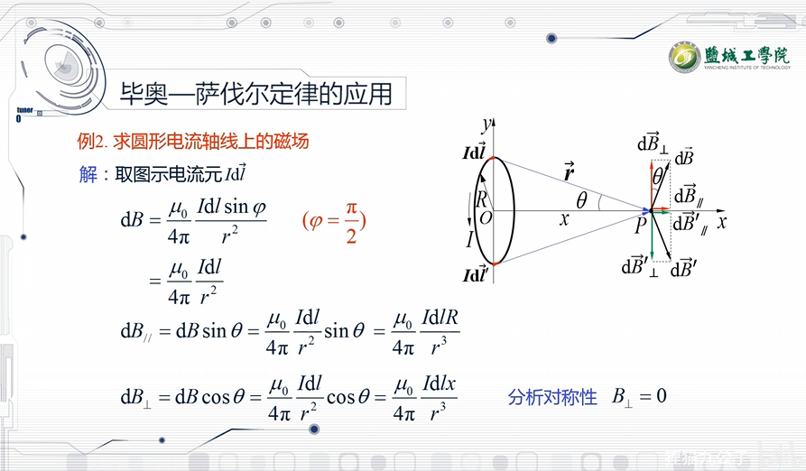

# 1.光学

## A.波动光学

### A.1光的干涉

$$
光程计算： \triangle=n*r\\
这里的n是折射率，空气中的折射率默认为1，但是你得当心题设条件不在空气中 r是实际的图中路程,切记是路程而非位移。\\
光程差计算：\delta = n_2r_2-n_1r_1\\
\\
光的能量表达：\\
E_1=A_1cos(wt+\phi_1)\\
E_2=A_2cos(wt+\phi_2)\\
其中的\phi表示相位\\
\\
相位差计算:\\
\triangle\phi=\frac{2π}{\lambda}(n_2r_2-n_1r_1)+(\phi_1-\phi_2)\\
这一块你切记，出题老师一般不为难你，所以两光源是同\phi的。可以省去后面的\phi减法\\
于是有特异化的：\\
\triangle\phi=\frac{2π}{\lambda}(n_2r_2-n_1r_1)==k*\delta \\
这里有k=\frac{2π}{\lambda}
$$

#### A.1.1分波面干涉

##### A.1.1.1杨氏双缝干涉(必会)

##### A.1.1.2菲涅尔双面镜(简单看看)

##### A.1.1.3劳埃德镜(简单看看)

#### A.1.2分振幅干涉

##### A.1.2.1等倾干涉(必会)

##### A.1.2.2等厚干涉(牛顿环)(必会)

#### A.1.3迈克尔逊干涉仪

### A.2光的衍射

#### A.2.1菲涅尔圆孔衍射

#### A.2.2夫琅禾费单缝衍射

#### A.2.3光栅衍射

### A.3光的偏振

#### A.3.1偏振光

#### A.3.2偏振条件

#### A.3.3偏振光的检验

#### A.3.4偏振光的干涉

## B.几何光学

### B.1.几何光学的基本实验定律

### B.2.光的反射,折射计算

### B.3.光学仪器的基本原理

# 2.静电场

$$
% 恒稳磁场的公式
B = \frac{\Phi}{A}\\

% 例题
已知一个半径为 r 的圆形区域，磁通量 \Phi 为 5 \times 10^{-4} \, \text{Wb}，求该区域的磁感应强度 B。\\

B = \frac{\Phi}{\pi r^2} = \frac{5 \times 10^{-4}}{\pi r^2}\\

% 电容的公式
C = \frac{Q}{V}\\

% 例题
已知一个平行板电容器的电荷量 Q 随时间 t 变化的关系为 Q = t^2 + 2t，电压 V 与时间 t 的关系为 V = 3t，求电容 C 关于时间 t 的导数。\\

C = \frac{Q}{V} = \frac{t^2 + 2t}{3t}\\

\frac{dC}{dt} = \frac{3t^2 - 6t}{9t^2} = \frac{1}{3t} - \frac{2}{3t^2}\\
$$

# 3.磁场

$$
B=\int_LdB=\int_L\frac{μ}{4π}\frac{Idlsina}{r^2}
$$

