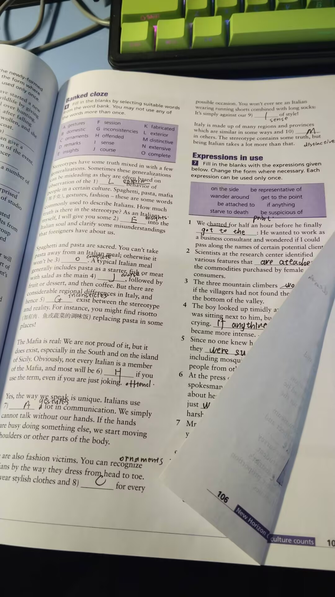
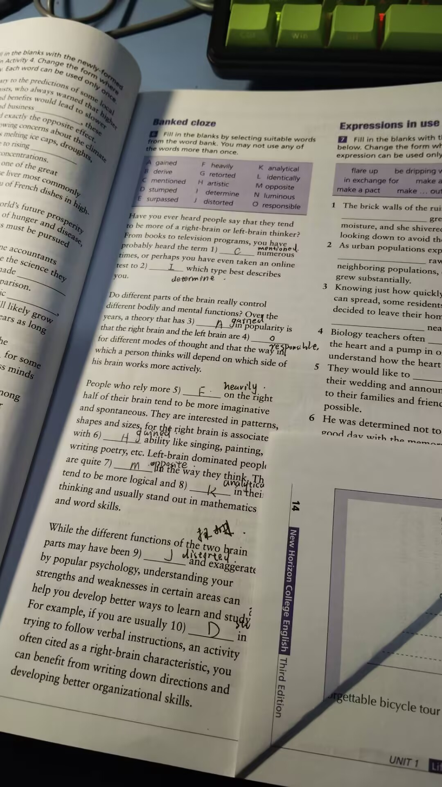
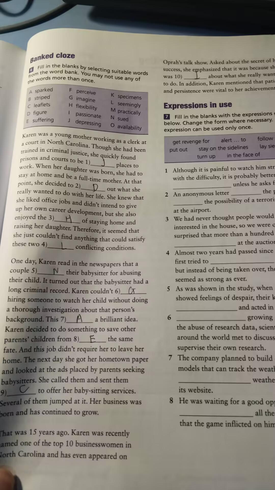

# 1.翻译复习

1. **汉语：** 近年来，社会的发展和就业形势的变化对大学生提出了更高的要求。  
   **英语：** In recent years, the development of society and changes in the employment situation have placed higher demands on college students.

2. **汉语：** 越来越多的大学生不再局限于书本知识的学习，他们开始走出“象牙塔”，利用业余时间积极投身于社会实践活动。  
   **英语：** More and more college students are no longer limited to learning from textbooks. They are beginning to step out of the 'ivory tower' and actively participate in social practice activities during their spare time.

3. **汉语：** 通过社会实践活动，大学生可以更多地了解社会，增强社会责任感，提高分析问题和解决问题的能力。  
   **英语：** Through social practice activities, college students can gain a better understanding of society, enhance their sense of social responsibility, and improve their ability to analyze and solve problems.

4. **汉语：** 同时，参加社会实践活动还可以帮助学生认识到自身的不足，明确未来努力的方向。  
   **英语：** At the same time, participating in social practice activities can help students recognize their own shortcomings and clarify the direction of their future efforts.

5. **汉语：** 所有这些都将为他们积累社会阅历和工作经验，为未来的就业或创业打下良好的基础。  
   **英语：** All of these will help them **accumulate** social experience and work experience, **laying** a good foundation for future employment or **entrepreneurship**.

1. **汉语：** 中华文明曾对世界文明产生过重大影响。  
   **英语：** Chinese civilization has had a significant impact on world civilization.

2. **汉语：** 近年来，随着我国经济的发展和国际地位的提升，历史悠久的中国文化正引起世界新的关注。  
   **英语：** In recent years, with the development of China's economy and the rise of its international status, the long-standing Chinese culture is attracting new global attention.

3. **汉语：** 越来越多的中国元素为当今世界时尚、文学、影视作品等提供了创作灵感，成为热门题材。  
   **英语：** More and more Chinese elements are providing creative inspiration for global fashion, literature, film, and television works, becoming popular themes.

4. **汉语：** 这一现象表明，世界需要中国文化。  
   **英语：** This phenomenon **indicates** that the world needs **Chinese culture.**

5. **汉语：** 在这种背景下，我国决定实施文化“走出去”的战略，以加强中国与世界其他各国的文化交流。  
   **英语：** Against this backdrop, China has decided to implement the "going global" strategy for culture to strengthen cultural exchanges between China and other countries around the world.

6. **汉语：** 经过数年的努力，这项工程已经取得了很大成绩。  
   **英语：** After years of efforts, this initiative has achieved significant results.

7. **汉语：** 文化“走出去”大力推动了我国文化产业的发展，正成为提升我国国家形象和综合实力的有效途径。  
   **英语：** The "going global" of culture has greatly promoted the development of China's cultural industry and is becoming an effective way to enhance China's national image and comprehensive strength.

1. **汉语：** 中庸思想（Doctrine of the Mean）是儒家思想的核心内容。 Confucius
   **英语：** The Doctrine of the Mean is the core content of Confucian thought.
2. **汉语：** 孔子所谓的“中”不是指“折中”，而是指在认识和处理客观事物时的一种“适度”和“恰如其分”的方法。
   **英语：** Confucius's concept of "zhong" does not mean "compromise," but rather a method of "moderation" and "appropriateness" in understanding and dealing with objective things.
3. **汉语：** 孔子主张不仅要把这种思想作为一种认识和处理事物的方法来看待，而且还应该通过自身修养和锻炼，把它融入自己的日常行为当中，使之成为一种美德。
   **英语：** Confucius advocated not only viewing this thought as a method of understanding and dealing with things but also integrating it into one's daily behavior through self-cultivation and practice, making it a virtue.
4. **汉语：** 中庸思想是儒家思想的核心，也是中国传统文化的重要组成部分。
   **英语：** The Doctrine of the Mean is the core of Confucian thought and an important part of traditional Chinese culture.
5. **汉语：** 从它形成到现在，一直为民族精神的构建、民族智慧的传播、民族文化的发展发挥着不可估量的作用。
   **英语：** Since its formation, it has played an immeasurable role in the construction of national spirit, the spread of national wisdom, and the development of national culture.

# 2.听力：

1. It is China's leading online streaming site with various business - **中国领先在线流媒体网站，业务多样**
2. LeTV has required a large market share in North America - **乐视在北美占据大市场份额**
3. Searching for life on stars closest to the Earth - **寻找地球附近星球上的生命**
4. Some of the chief space researchers support it - **主要太空研究人员支持**
5. iPhone SE - **iPhone SE**
6. iPhone SE is much larger than iPhone 5 and 5s - **iPhone SE 比 iPhone 5 和 5s 大**
7. California - **加利福尼亚**
8. To hear more about the speaker's ideas - **了解更多演讲者想法**
9. He feels it doesn't make a difference - **他觉得没区别**
10. The way the government supports businesses - **政府支持企业的方式**
11. Attend the upcoming debate - **参加即将到来的辩论**
12. Why people can see things - **人们为何能看见东西**
13. People can't see things without light - **没有光，人们看不见东西**
14. The light shines on things, and lights them up - **光照亮物体**
15. Neither of them convinced the other - **双方未能说服对方**
16. The formation and force of tornadoes - **龙卷风的形成和力量**
17. They do not have a complete understanding of tornadoes - **对龙卷风理解不完全**
18. They create differences in air pressure inside and outside the house - **造成房屋内外气压差**
19. **A helper of honey lovers - 蜂蜜爱好者的助手**
20. **Because it's hidden high in the trees - 因隐藏在树高处**
21. **The way it gets its food** - **获取食物的方式**
22. Offer summer work to a local teenager - **为本地青少年提供夏季工作**
23. Nearly twenty years - **接近二十年**
24. Getting a clear perspective of various education systems - **了解各种教育系统的观点**
25. Giving back to the neighboring community - **回馈邻近社区**

1. Increased risk of cancer development - **增加患癌风险**
2. 65 degrees Celsius and above - **65摄氏度及以上**
3. To reduce serious air pollution in the area - **减少该地区的严重空气污染**
4. The first Sunday of each month - **每月的第一个星期日**
5. The sales situation of Apple Watch since its launch - **Apple Watch自发布以来的销售情况**
6. Smart watch market will boom in the near future - **智能手表市场将在不久的将来蓬勃发展**
7. Apple made no comments on the IDC reports - **苹果对IDC报告未作评论**
8. Signing up for voluntary work - **报名参加志愿工作**
9. Handing out food - **分发食物**
10. On Friday - **在星期五**
11. Because he wants to make sure that things run smoothly - **因为他希望确保事情顺利进行**
12. Mary's problems with pre-registering for classes online and possible solutions - **玛丽在线预注册课程的问题及可能的解决方案**
13. Because there were too many people trying to do the same thing - **因为太多人试图做同样的事情**
14. She should get the professor's approval to take the course she wanted - **她应获得教授批准以选修她想要的课程**
15. He is not worried about it - **他并不担心**
16. Because she made a large sum of money with shares - **因为她通过股票赚了一大笔钱**
17. She took him to a charity hospital - **她带他去了一家慈善医院**
18. Hatty Green preferred money to anything else - **哈蒂·格林更喜欢钱而不是其他任何东西**
19. Isolated - **孤立的**
20. Math and reading skills - **数学和阅读技能**
21. Improving her academic performance - **提高她的学业成绩**
22. How camels survive in the desert - **骆驼如何在沙漠中生存**
23. That they store water in their humps - **它们在驼峰中储存水**
24. It is difficult to find - **很难找到**
25. Drinking too much water - **喝太多水**

# 3.选词填空

