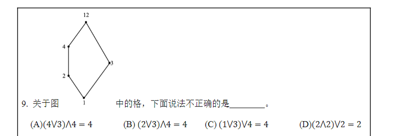
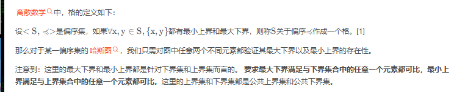
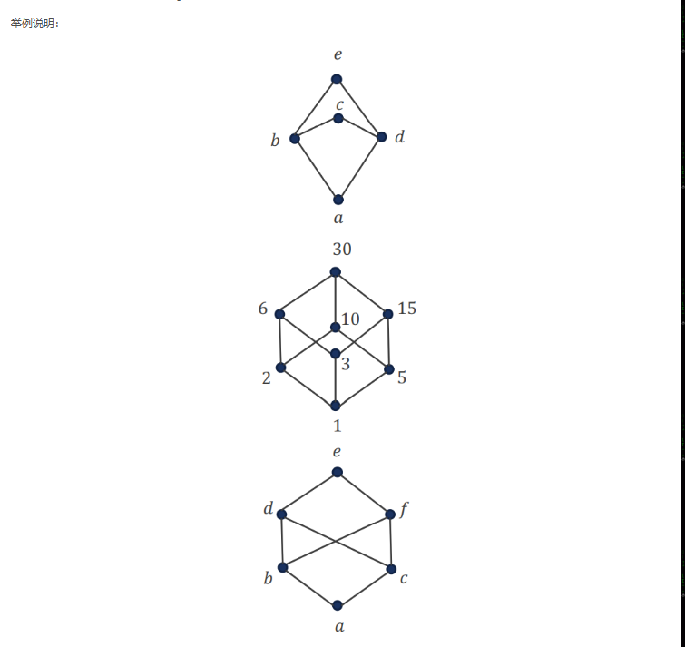
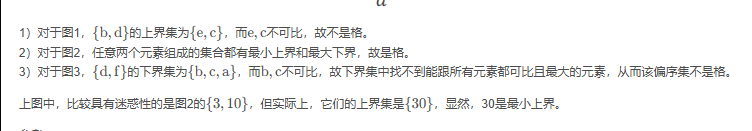

# 1.Homogeneous recurrence relations

> 本视频知识点基于《离散数学结构》3.5节

> 齐次递归关系：描述一个序列每一个项如何由前面的项线性的表示出来，而且不依赖常数项与外部输入

$$
a_n=c_1a_{n-1}+c_2a_{n-2}+...+c_ka_{n-k}\\
a_n是序列的第n项\\
c_1,c_2,c_k是系数\\
递推关系没有常数项或外部项（即没有独立项），这是齐次性的一部分。\\
这种关系通常适用于线性递推关系，意思是每一项都是其前面若干项的线性组合。
$$

**E.G:**
$$
二阶齐次递推关系：\\
a_n=3a_{n-1}-2a_{n-2}\\
三阶齐次递推关系:\\
a_n=2a_{n-1}-3a_{n-2}+a_{n-3}
$$
**Solutions:**
$$
我们用上述的二阶齐次递推关系作为例子:\\
1.求解特征方程:\\
r^2-3r+2=0\\
求解该方程得到r1和r2\\
2.构造通解：\\
a_n=Ar_1^n+Br_2^n\\
其中A和B是常数：可以通过初始条件确定：\\
如果特征方程只有一个重根r，则上述解优化为：\\
a_n=(A+Bn)r^n
$$
**上题目：**
$$
a_n=2a_{n-1}-a_{n-2} 且初始条件为a_0=1,a_1=3\\
1.全部移动到左边\\
a_n-2a_{n-1}+a_{n-2}=0\\
2.构造特征方程:\\
r^2-2r+1=0\\
3解方程：\\
r1=r2=1:出现重根\\
a_n=(A+Bn)r^n=>a_=(A+Bn)^n\\
4.带入初始条件求值:\\
1=(A+0)=>A=1 \\
3=(1+B)^1 => B=2\\
现在有A=1 B=2 因此 a_n=(1+2n)^n
$$

# 2.置换

在离散数学中，置换（Permutation）是指一个集合的元素的排列或重新排序。置换通常用于组合数学、群论等领域，尤其是在对称群的研究中有重要的应用。

### 1. 置换的基本概念

设有一个集合 $$ S = \{1, 2, 3, \dots, n\} $$，一个置换 $$ $$\sigma $$$$ 就是集合 $$ S $$ 中元素的一个重排。可以将置换看作是集合 $$ S $$ 中每个元素到其他元素的映射。我们通常用排列的方式表示置换。

### 2. 置换的表示

- **排列表示法（Permutation Notation）**：一个置换 $$ $$\sigma $$$$ 可以通过一个 $$ n$$ \times$$ n $$ 的矩阵表示，矩阵中的第 $$ i $$ 行表示元素 $$ i $$ 在置换后的目标位置。

例如，集合 $$ S = \{1, 2, 3\} $$，一个置换 $$ $$\sigma $$$$ 可以表示为：

$$
\sigma = \begin{pmatrix}
1 & 2 & 3 \\
2 & 3 & 1
\end{pmatrix}
$$

这表示元素 1 被映射到 2，元素 2 被映射到 3，元素 3 被映射到 1。

- **循环表示法（Cycle Notation）**：通过元素的交换顺序来表示置换。如果一个置换将元素 1 映射到 2，元素 2 映射到 3，元素 3 映射到 1，可以表示为一个 3-cycle：

$$
\sigma = (1 \ 2 \ 3)
$$

### 3. 奇置换和偶置换

- **奇置换（Odd permutation）**：如果一个置换需要奇数次交换来实现，那么它是奇置换。
- **偶置换（Even permutation）**：如果一个置换需要偶数次交换来实现，那么它是偶置换。

置换的奇偶性是通过将置换分解成若干个交换（transpositions）来判定的。每个交换（transposition）交换两个元素的位置，属于一个**奇置换**。

#### 3.1 置换的奇偶性判断

- 若置换可以通过偶数次交换得到，则它是偶置换。
- 若置换可以通过奇数次交换得到，则它是奇置换。

### 4. 示例

#### 示例 1：偶置换

考虑集合 $$ S = \{1, 2, 3, 4\} $$ 上的置换：

$$
sigma = \begin{pmatrix}
1 & 2 &  \\
2 & 3 & 
\end{pmatrix}
$$
这是一个循环置换，也可以表示为 $$ (1 \ 2 \ 3 \ 4))$$。这个置换可以分解为两个交换：

$$
(1 \ 2)(2 \ 3)
$$
由于交换的次数是偶数次，所以这是一个**偶置换**。

#### 示例 2：奇置换

考虑置换：

$$
\tau = \begin{pmatrix}
1 & 2 & 3 & 4 \\
2 & 1 & 4 & 3
\end{pmatrix}
$$
这个置换表示 1 和 2 交换，3 和 4 交换。我们可以将它分解成两个交换操作：

$$
(1 \ 2)(3 \ 4)
$$

由于交换次数是**偶数次**，它是偶置换。

#### 示例 3：另一个奇置换

考虑置换：

$$
\sigma= (1 \ 2 \ 3)
$$
它表示将 1 映射到 2，2 映射到 3，3 映射到 1。这个置换的分解为以下两次交换：

$$
(1 \ 2)(1 \ 3)
$$
由于交换次数是奇数次，它是一个**奇置换**。

### 5. 置换的群结构

所有的置换可以构成一个群，称为**对称群**（Symmetric Group）。对称群中的元素是置换，群的运算是置换的合成。对称群的阶（元素个数）为 $$ n! $$，即集合中元素个数的阶乘。

### 6. 小结

- 置换是集合元素的一种重新排列。
- 置换可以表示为排列表示法或循环表示法。
- 置换有奇置换和偶置换之分，通过置换中交换次数的奇偶性来区分。

# 3.格

**合取：两个元素的最大公约数**

**析取运算：两个元素的最小公倍数**

### 代数格的基本概念

代数格（Algebraic Lattice）是一种满足某些代数条件的格。为了理解代数格，我们先需要复习一下“格”（Lattice）的基本定义。

#### 1. **格的定义（Lattice）**：
格是一种集合，配备了两个二元运算：**并运算（join）**和**交运算（meet）**。这两个运算满足如下条件：

- **结合律**：对于任意三个元素 $$ a, b, c $$ 在格中，
  $$
  (a \vee b) \vee c = a \vee (b \vee c)
  $$
  $$
  (a \wedge b) \wedge c = a \wedge (b \wedge c)
  $$

- **交换律**：对于任意两个元素 $$ a $$ 和 $$ b $$ 在格中，
  $$
  a \vee b = b \vee a
  $$
  $$
  a \wedge b = b \wedge a
  $$

- **吸收律**：对于任意三个元素 $$ a, b, c $$ 在格中，
  $$
  a \vee (a \wedge b) = a
  $$
  $$
  a \wedge (a \vee b) = a
  $$

一个格中的元素可以看作是一个集合，通常这些元素具有某种“顺序”关系，其中“并”操作对应集合的并集，“交”操作对应集合的交集。

#### 2. **代数格的定义（Algebraic Lattice）**：
代数格是指那些在某些情况下具有“上界”或“下界”的格结构。具体而言，代数格是满足某些特定条件的格，其中一个重要特性是每个元素都可以通过有限的操作（通常是通过上、下操作）生成或表示。

代数格的一个重要特性是它们总是具有**有限的下界**和**上界**，即每个元素都有一个与之相关的“最小上界”或“最大下界”。

### 代数格的性质

1. **完备性**：
   一个代数格是完备的（complete lattice），当且仅当它对任意子集都有上确界（supremum）和下确界（infimum）。在完备代数格中，每个子集都有一个最小上界（并）和最大下界（交）。

2. **有限性**：
   代数格通常要求每个元素可以通过有限的上、下操作来表示。这意味着对于每个元素，存在一些有限的子集合可以通过运算得出该元素。

3. **自同态（Homomorphism）**：
   代数格之间的映射通常是保结构的映射，即这些映射保持格的运算规则，类似于代数中的同态。

### 例题和应用

#### 例题 1：确定一个格是否是代数格

考虑一个包含4个元素的集合 $$ L = \{0, 1, 2, 3\} $$，并定义如下的“并”运算和“交”运算：

- 并运算： $$ \vee $$ 定义为 $$ \{0, 1, 2, 3\} $$ 上的最大元素 3。
- 交运算： $$ \wedge $$ 定义为 $$ \{0, 1, 2, 3\} $$ 上的最小元素 0。

请问这个集合 $$ L $$ 是否构成代数格？

**解答**：

- **结合律和交换律**：在 $$ L $$ 上，“并”和“交”运算都满足结合律和交换律，因为这些运算的结果与操作顺序无关。
  
- **吸收律**：我们需要验证对任意 $$ a, b \in L $$ 是否满足吸收律：
  - $$ a \vee (a \wedge b) = a $$ 和 $$ a \wedge (a \vee b) = a $$ 对于每一对元素都成立。
  
- **完备性**：由于每个子集的最小上界和最大下界都可以通过有限操作得到，故该格是完备的，满足代数格的条件。

因此，集合 $$ L $$ 构成一个代数格。

#### 例题 2：找出一个代数格的最小上界和最大下界

给定代数格 $$ L = \{0, 1, 2, 3\} $$，其中 $$ 0 $$ 是最小元素，$$ 3 $$ 是最大元素，定义如下的运算：
- $$ 1 \vee 2 = 3 $$
- $$ 1 \wedge 2 = 0 $$

求 $$ 1 \vee 2 $$ 和 $$ 1 \wedge 2 $$ 的最小上界和最大下界。

**解答**：

- 最小上界： $$ 1 \vee 2 = 3 $$ 是 $$ 1 $$ 和 $$ 2 $$ 的最小上界。
- 最大下界： $$ 1 \wedge 2 = 0 $$ 是 $$ 1 $$ 和 $$ 2 $$ 的最大下界。

#### 例题 3：代数格中的同态映射

考虑两个代数格 $$ L_1 = \{0, 1, 2, 3\} $$ 和 $$ L_2 = \{0, 1, 2\} $$，并且给定一个映射 $$ f: L_1 \to L_2 $$：
- $$ f(0) = 0 $$
- $$ f(1) = 1 $$
- $$ f(2) = 2 $$
- $$ f(3) = 2 $$

证明 $$ f $$ 是一个代数格同态映射。

**解答**：
为了验证 $$ f $$ 是一个代数格同态映射，需要检查它是否保持“并”运算和“交”运算：
- 对于任意的 $$ a, b \in L_1 $$，需要验证 $$ f(a \vee b) = f(a) \vee f(b) $$ 和 $$ f(a \wedge b) = f(a) \wedge f(b) $$ 是否成立。
- 检查每一对元素，验证映射 $$ f $$ 是否保留格运算规则。

#### 总结

代数格是包含有限上界和下界的格结构，具有丰富的代数性质。在学习过程中，你可以通过具体的运算和构造示例来深入理解代数格的定义和应用。

# 4.偏序格的判定

