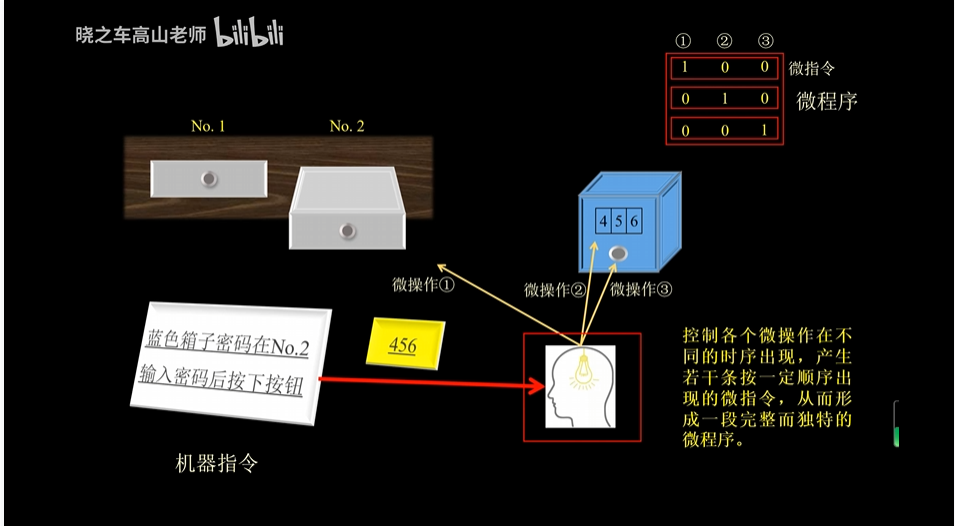
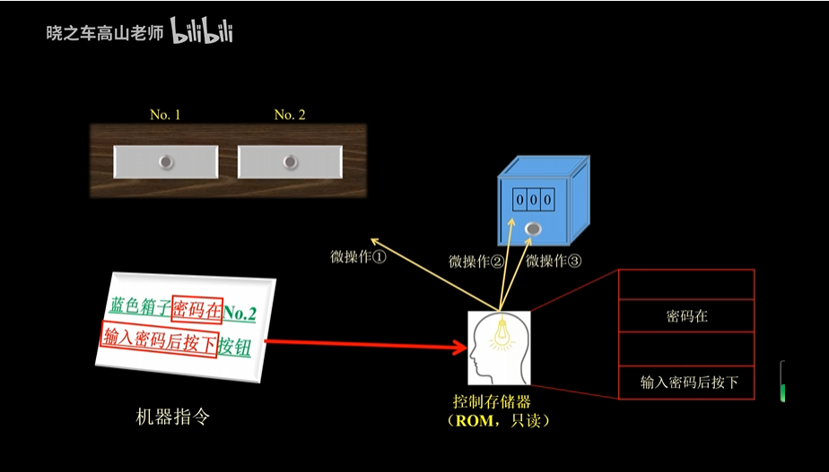
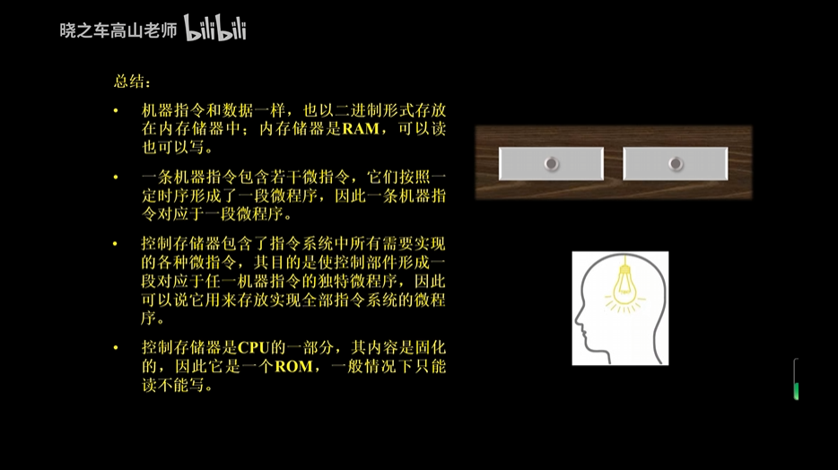
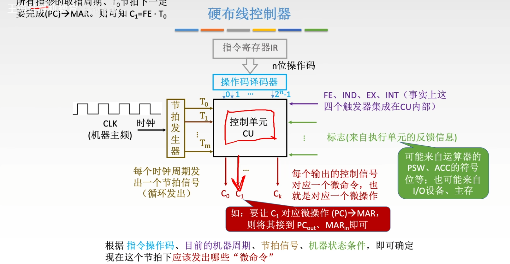
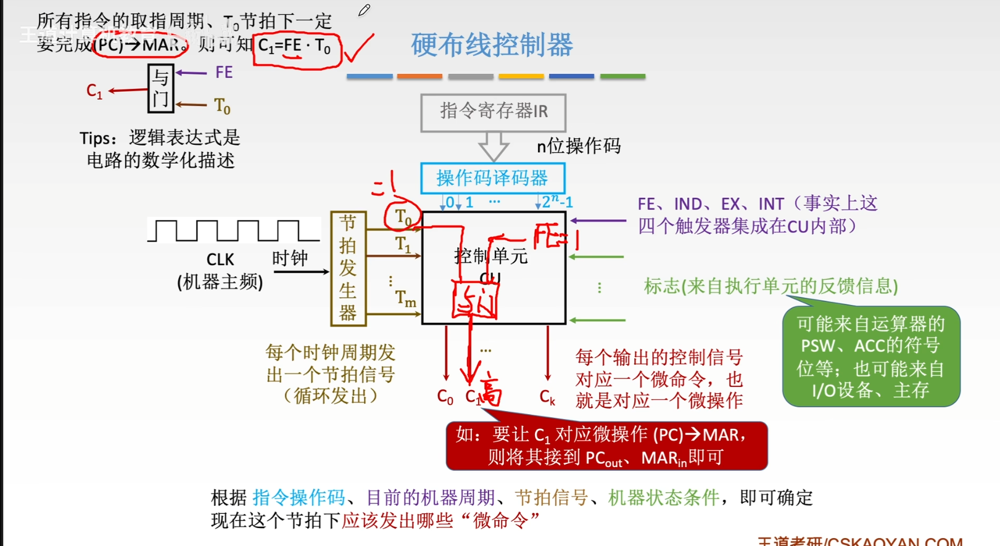
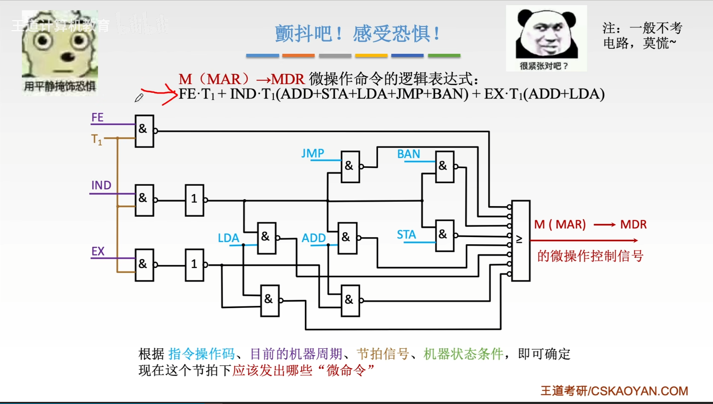

1.浮点数的**基数是隐含的**，**精度由尾数位数决定**，**表示范围由阶码位数决定**，要进行**规格化**

2.水平型微指令：**全水平型**、**字段译码型**、**混合型**

> 这里展示的是：**水平型微指令**
>
> 机器指令就是纸条，纸条提到的【打开No2】【输入密码】【按下按钮】是三个微操作，而执行三者的指令被称为微指令。微指令是由0和1组合构成的。若干个微指令构成了微程序。微程序和机器指令是同级的。**这里的三行微指令构成的微程序就和纸条这个机器指令等价。**
>
> 而机器指令想要被识别成微程序，拆分成微指令并执行，需要一个"大脑"，这个大脑能做翻译。这个大脑只能读取，不能写入。因此是ROM，也叫控制存储器。是写定在CPU中的
>
> 
>
> 
>
> 
>
> 
>
> 
>
> 

3.使用cache提高系统性能原理：使用Cache可以提高计算机运行速度这是因为Cache缩短了CPU的等待时间；Cache的功能是提高CPU数据输入输出的速率；Cache容量小但速度快，内存速度较低但容量大，通过优化调度算法，系统的性能会大大改善，仿佛其存储系统容量与内存相当而访问速度近似Cache

4.冯诺依曼机特点：由**运算器、存储器、控制器、输入输出设备**组成；存储器以二进制形式存储指令数据；指令由操作码、地址码组成；存储程序并按地址顺序执行；以运算器为中心

5.浮点数运算过程：

(1)**零操作数检查** (2)**两操作数位置对齐** (3)**尾数相加减** (4)**结果规格化** (5**)溢出判断**

6.BCD码表示需要4位二进制码；ASCII码表示需要7位二进制码

7.主存储器性能指标：存储容量、存取时间、存取周期、存储器带宽

8.堆栈采用先进后出原理 分为存储器堆栈和寄存器堆栈

9.相联存储器按照内容访问，保存的是行地址表(存储单元某部分内容作为检索项，去检索该存储器，一致的内容再写入读出)

10.程序访问的局部性原理：在一段时间内，CPU所执行的程序和访问的数据大部分都在某一段地址范围内，而该段范围外的访问很少

11.水平型微指令：并发操作强、执行时间短；微指令字长但微程序短；难以掌握

   垂直型微指令：微指令字短但微程序长

12.标准冯诺依曼机采取的是串行处理

13.流水CPU组成：指令部件、指令队列、执行部件

14.流水线分类：指令流水线、算术流水线、处理机流水线

15.计算机软件：系统程序、应用程序

16.浮点加减的对阶：阶码较小的调整为与较大的相同

17.存储器要求：容量大、速度快、成本低  因此采用多级存储器体系结构

18.条件转移指令执行的依据是：标志寄存器

19.三种偏移寻址：(1)基址寻址：EA=(R)+A (2)变址寻址：EA=(X)+A (3)相对寻址：EA=(PC)+A

基址：可以扩大寻址能力  适用于频繁访问某一特定区域

变址：变址寄存器内容可以灵活变化，而地址保持不变  适用于需要快速访问某种结构

相对：允许指令位置变化仍能准确访问到预期地址  适用于跳转或分支指令

20.软硬件的等价性：大部分功能既能由软件完成，也能由硬件完成，逻辑上是等效的

21.使用虚拟存储器的主要目的是：扩大主存空间

22.逻辑移动时不考虑符号位，直接补0；算术移动补充符号位

23.全、组相联映射适合于小容量cache；直接相联映射适合于大容量cache

24.反映计算机基本功能的是：指令系统

25.不同寻址方式目的：缩短指令长度，扩大指令空间

26.cache和主存映射：由硬件直接完成

27.CPU功能：指令控制、操作控制、时间控制、数据加工

28.操作控制器：硬布线控制器(时序逻辑)、微程序控制器(存储逻辑)

29.总线结构对计算机影响：最大存储容量、指令系统、系统吞吐量

30.cache读写过程：CPU发出有效主存地址，经地址变换机构，得cache地址，查找块表，看待访信息是否在cache

·读：若在直接读取cache，否则访存，判断cache是否满；未满从主存中调入，若满则利用某种替换机制替换掉cache一些块

·写：不在，写进数据；若在，使用某种写策略写入cache

31.CPU访问cache和主存以字为单位；主存和cache信息交换以块为单位

32.计算机中时序信号最基本的体制：电位-脉冲制

33.编码表示法：相斥的微命令编在同一字段，相容的编在不同字段

34.计算机存储单元是指：存放一个完整机器字的所有存储元集合

35.寻址方式按操作数物理位置不同，多使用RR和RS型，前者更快

36.一个较为完善的指令系统至少应包含：数据传送、算术运算、逻辑运算、程序控制、输入输出等类型指令

37.单地址指令为了完成两个数的运算，除了地址码的操作数外，还需隐含寻址

38.双端口存储器之所以能高速读取，原因是有两套独立读写电路

39.流水线中造成控制相关的原因是执行条件转移指令而引起

40.cache替换策略：最不常使用(访问一次计数器+1)、近期最少使用(访问一次清零，其它+1)、随机替换(速度比前两个快)

41.CISC：指令系统庞大复杂、指令数目格式多且字长不固定、寻址方式多种、访存不受限制、指令执行时间相差很大、大都采用微程序控制器
RISC：指令长度固定且格式少、寻址种类少、使用较多寄存器以减少访存、流水线和优化编译技术、以组合逻辑控制为主

**总线**

1.总线定义：系统内各部件进行信息传送的公共通路

2.按内容分：**数据总线、地址总线、控制总线**

  按部件分：**系统总线、内部总线、I/O总线**

3.典型标准总线：ISA、EISA、PCI

4.通用接口：按总线标准设计的接口

**5.总线带宽=数据量/传输时间**

6.(1)单总线结构：所有部件全在一条总线上

·优点：**部件之间直接通信；系统易于扩充**

·缺点：总线负担重；如有慢速设备，延迟较大

  (2)双总线结构：CPU和主存之间增加**一条高速存储总线**

·优点：保持了单总线的优点；减轻了总线工作负担，提高了CPU效率

·缺点：增加了硬件成本

  **(3)三总线结构：增加通道，在通道与适配器之间新增IO总线**

·优点：设置通道，对外设统一管理，分担了CPU工作；提高了CPU效率、外设速度

·缺点：硬件成本进一步增加

**7.现代总线：与结构、CPU、技术无关**

分类：数据传送总线、仲裁总线、中断和同步总线、公用线

8.PCI总线系统中提出了桥的概念

PCI总线是在CPU和系统总线之间新增的总线

**北桥(主桥)：连接CPU和PCI总线**

南桥：标准总线桥：连接PCI和其他IO总线  PCI桥：连接PCI总线

9.信息传送方式：**串行、并行、分时**(串行：脉冲；并行：电位；分时：总线复用，即数据地址都在一条总线上传输)

10.适配器必有两个接口：**一个连接系统总线(并行)，一个连接外设(串、并行)**

11.总线仲裁：**集中式(中央仲裁器)**、分**布式(多个仲裁器竞争使用)**

12.**总线操作只能有一个主方，但可以有多个从方**

13.集中式：链式查询、计数器定时查询、独立请求

链式：菊花链连接部件；与总线控制器距离有关

·优点：判优容易，增删设备容易

·缺点：对电路故障敏感，优先级固定
计数器：由计数值决定(新增计数器、设备地址信号线)

·特点：优先权控制灵活，对电路故障不敏感

独立请求：中央仲裁器内部排队逻辑决定(每个设备均有独立请求响应信号线)

·特点：响应最快，优先级控制灵活

14.分布式：**以优先级仲裁策略为基础，不需要中央仲裁器，由分仲裁器竞争**

每个潜在主模块均有自己的仲裁器和唯一仲裁号，每次与仲裁总线号码比较，若小于总线号码，则不响应，获胜者仲裁号留在仲裁总线上

15.总线定时：**同步定时、异步定时**

同步定时：统一的时钟信号(模块速度差异大、时钟信号受干扰时劣势明显)

异步定时：应答方式和互锁机制(总线周期长度可变但增加了总线复杂性与成本)

IO系统

1.外设信息交换方式：**程序查询方式、程序中断方式、DMA方式、通道方式、外围处理机方式**

程序查询方式：CPU和IO设备串行工作能够同步，硬件结构简单

程序中断方式：随机出现的服务，一旦提出要求立即执行，节省CPU时间

DMA方式：**由硬件支撑**，解放CPU，传输速率很高

通道方式：**外设统一管理**，得到CPU权力下放，大大提高CPU工作效率

外围处理机方式：通道方式进一步发展，基本独立于主机

2.设备编址：统一编址、独立编址  前者占主存空间，后者不占

3.程序查询方式过程：CPU通过地址选中某设备接口、向接口发送命令字启动外设、设置当前忙状态、通过数据缓冲器传送数据(CPU与IO串行工作)

4.中断：CPU运行程序时，由系统内外部非预期事件或程序中预先安排好的指令性事件引起的，CPU暂停当前程序执行，转去服务程序进行，服务完毕再返回

5.能引起中断的事件称为中断源;中断是软硬件结合的方式

6.中断服务程序是事先设置好的

7.使用中断的原因：(1)解决速度问题，使CPU与IO并行工作 (2)对意外情况可以及时处理(3)及时响应外来信号请求

8.中断处理流程：

(1)CPU公操作时，检测中断请求信号

(2)中断响应：关中断、保护断点现场、判断中断源获取中断向量、转入中断服务

(3)中断服务：保护CPU现场、设备服务、恢复CPU现场、开中断

(4)中断返回

9.中断向量：中断服务子程序的入口地址；包括段地址和段内偏移地址，共4字节

响应中断时，将中断向量送入CS、IP寄存器，跟踪中断服务子程序

10.中断类型号(最先获取)×4→中断向量地址→中断向量→转入中断服务子程序

11.中断响应期间，要有中断屏蔽触发器，以屏蔽其他中断源

12.中断系统根据处理策略可分为：单级中断系统、多级中断系统(前者中断源同级且不允许嵌套，后者不同级且允许中断嵌套)

13.中断向量产生方式：向量中断、位移量中断(位移量+寄存器基地址)、向量地址转移(固定地址码)

14.PC系列机中断机制：

外部中断(不可屏蔽中断NMI、可屏蔽中断INTR)

异常中断(异常中断、指令中断)

·只有指令中断是可预期的，其它均突发随机；只有INTR中断CPU需要应答

15.DMA：完全依靠硬件控制

16.DMA过程：DMA预处理、DMA传送、结束处理
17.DMAC工作：接受外设的DMA请求并交给CPU、接管总线控制权、完成数据传送后交还总线使用权

18.DMA特点：无需CPU参与，在数据传送过程中将CPU解放，降低负担，提高整体效率

19.常用的DMA方式：停止CPU方式、周期挪用方式(适用于IO周期＞主存)、DMA与CPU交替使用方式(不需总线控制权的申请与归还，适用于CPU周期＞主存)

20.DMA控制器的组成：内存地址计数器、字计数器、DMA请求标识、控制\状态逻辑、中断机构

21.通道：专门负责数据输入输出的控制机制，CPU将传输控制的功能下放给通道，自己只负责数据处理

22.DMA和中断都是CPU与IO并行的，而程序查询则是串行