## 一：快速上手完成Docker镜像的创建

### 1.确定目标：

打包node环境与一个js文件（实现console.log("Docker镜像加载成功")）。


**为什么需要打包成docker镜像？**

我的本地没有安装Node.js环境。因此javascript文件无法被直接运行

```
node index.js
```


**解决方案：**

将index.js文件与node打包成一个镜像,直接部署镜像即可.


**注意问题：**node无法直接存在,需要依托操作系统,因此我们需要先构建linux的发行版,再于这个基础上构建node.最后打包我们的js文件.

### 2.js文件与Dockerfile文件的

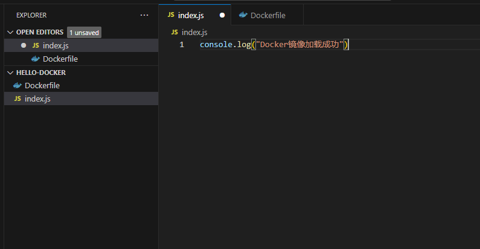

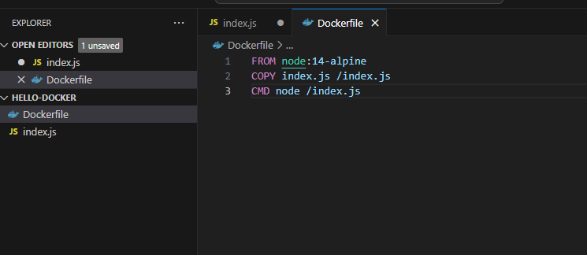

我们推荐使用Vscode打开并且进行编辑，将代码实现到以上形式

> 这里FROM的是基于alpine构建的Node.alpine是一个Linux发行版，相较于Ubuntu等镜像，体积非常小，适合快速部署。其体积只有几十MB左右

### 3.打包镜像

打开控制台输入

```sh
docker build -t hello-docker .
```

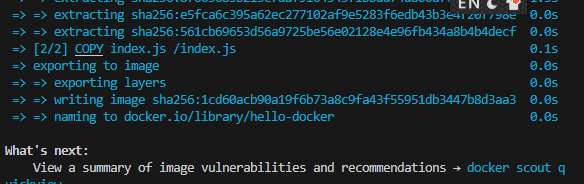

出现上图所示则打包成功

### 4.查询所有镜像

```
docker images
```

我们可以发现：刚刚被打包的镜像已经被出现在下方了

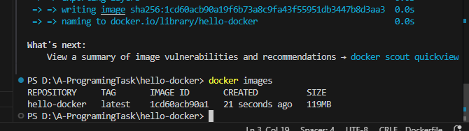

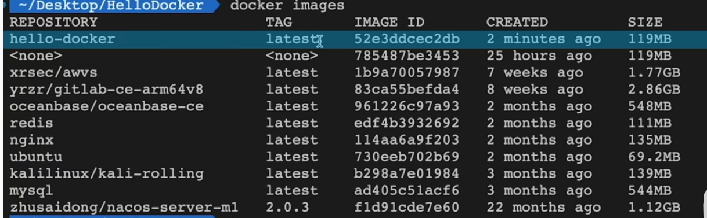

> TAG:可以自定义的版本。默认是最新，也可以自定义为 x.x.x的形式

### 5.运行镜像

```.sh
docker run 镜像名
```

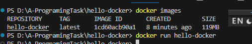

### 6.拉取镜像

```.sh
docker pull geekhour/hello-docker
```

在拉取之后 我们查看是否拉取成功

```
docker images //查看所有的镜像
```

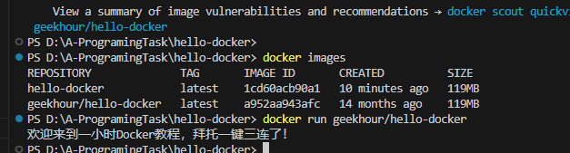

```
docker run geekhour/hello-docker
```

我们发现，镜像已经被成功的拉取并且执行了。这个操作是不是很像github的拉取操作呢？

## 二：关于DockerDesktop

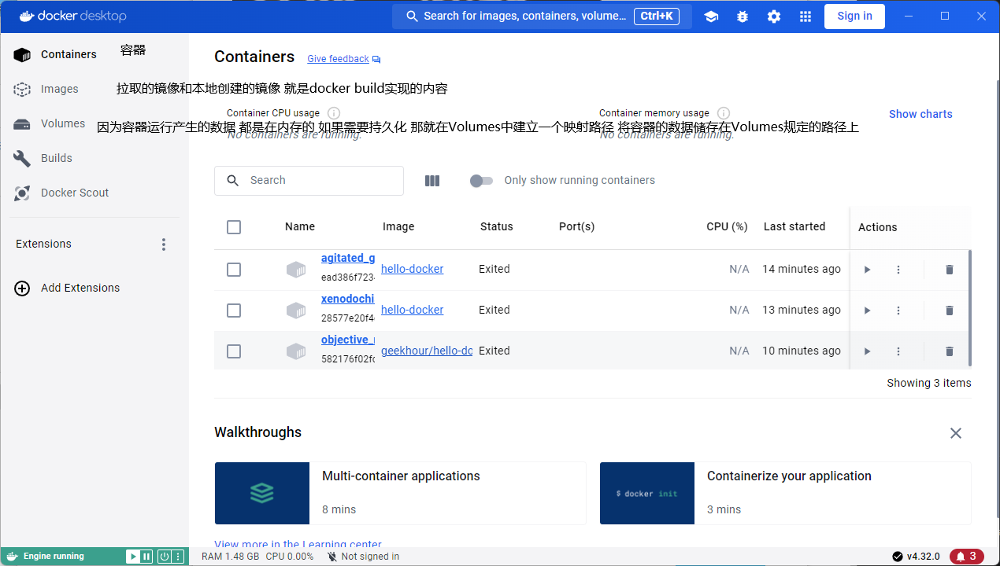

## 三：DockerCompose

一个网站会用到前端，后端，数据库。问题是：用到大量的中间件：例如Redis mysql MongoDB。在微服务项目中，会涉及到更多的外部组件。那如何同一对它们进行管理呢？

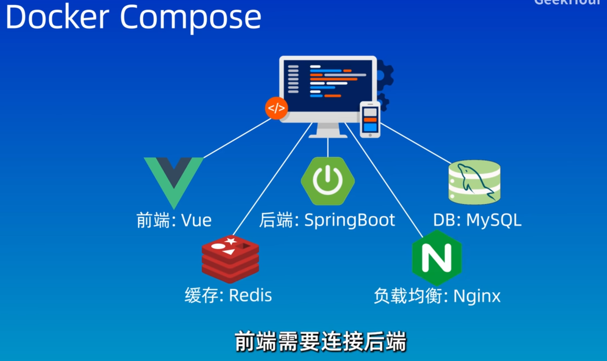

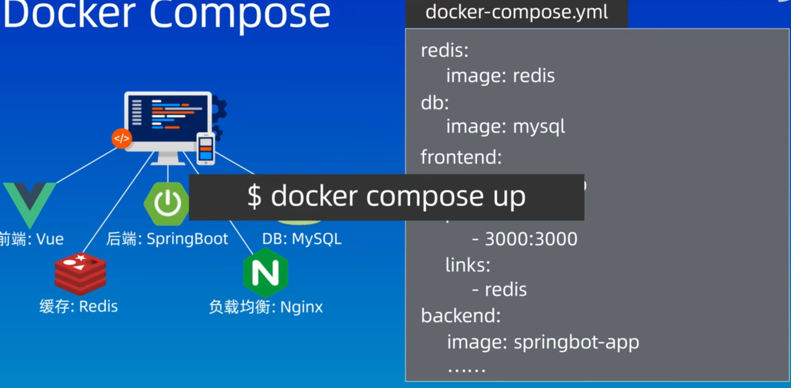

**下面看一个具体例子** 在有docker-compose.yml的目录下启动cmd

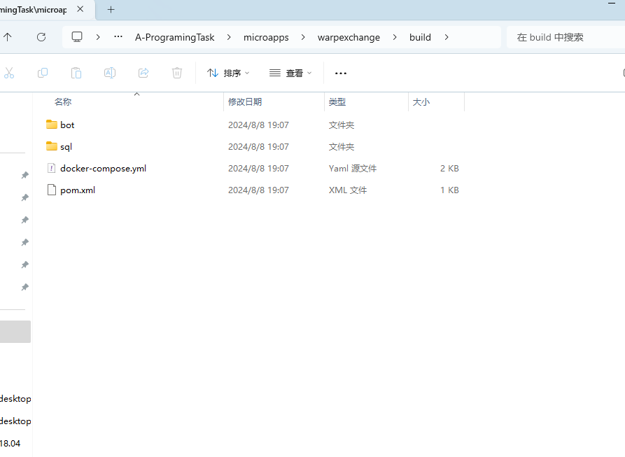

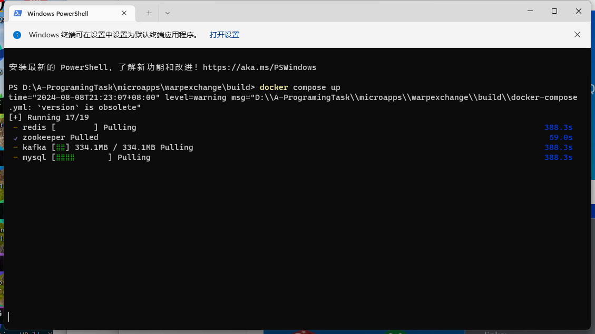

**即可在本地部署镜像了**