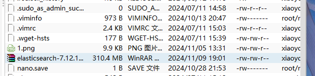

# 0.项目导向

本笔记旨在为数据库课设提供ElasticSearch的安装策略

选用的ElasticSearch版本为7.12.1-运行平台为Linux x86_64

# 1.项目的安装

1.因为我们还需要部署kibana容器，因此需要让es和kibana容器互联。这里先创建一个网络：

```sh
docker network create es-net
```

2.我们使用FinalShell将文件上传到Linux服务器



3.使用docker加载此镜像

```java
# 导入数据
docker load -i elasticsearch-7.12.1-linux-x86_64.tar.gz

```

4。设计好dockerfile

```java
docker run -d \
	--name elasticsearch-7.12.1-linux-x86_64.tar.gz \
    -e "ES_JAVA_OPTS=-Xms512m -Xmx512m" \
    -e "discovery.type=single-node" \
    -v es-data:/usr/share/elasticsearch/data \
    -v es-plugins:/usr/share/elasticsearch/plugins \
    --privileged \
    --network es-net \
    -p 9200:9200 \
    -p 9300:9300 \
elasticsearch:7.12.1
```

5.执行命令启动dockerfile