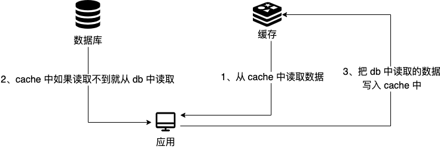
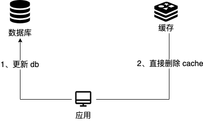
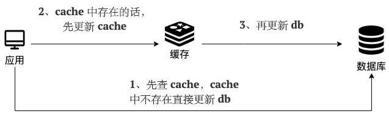
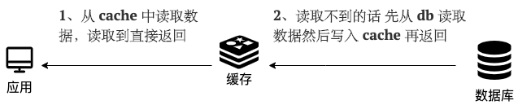

## 1.(Redis辅)**Cache Aside Pattern**

### A.为什么旁路缓存叫旁路？

"Cache Aside Pattern"（旁路缓存模式）之所以被称为“旁路”，是因为在这种模式中，数据的读取和写入并不是直接通过缓存进行的，而是**缓存**作为一个“旁路”或者说是**辅助的存储层**。以下是具体的解释：
1. **读取操作**：当应用需要读取数据时，首先会检查缓存中是否有该数据。如果有，则直接从缓存中读取（这就是“旁路”，因为绕过了原始数据源）；如果没有，则从数据库或其他数据源中读取数据，并将其放入缓存中，以便下次可以直接从缓存中读取。
2. **写入操作**：当应用需要写入数据时，它首先写入数据库或其他数据源，然后使缓存中的对应数据失效或者更新缓存中的数据。这里“旁路”体现在写入操作主要是针对数据库，缓存并不是写入的主要路径。
“旁路”这个名字强调了以下几点：
- **缓存不是主要的数据存储**：数据的主要存储是数据库，缓存只是用来提高读取性能的辅助手段。
- **读写操作的分离**：读取操作可能会使用缓存，而写入操作则会直接操作数据库，并通过一些机制（如失效策略）来保证缓存与数据库的数据一致性。
- **灵活性和解耦**：这种模式使得应用与缓存之间解耦，即使缓存系统出现问题，也不会影响到数据库的正常运作。
因此，“Cache Aside Pattern”这个名字很好地描述了这种模式的工作方式和它在整个数据存储体系中的位置。

### B.旁路缓存的读写分析

#### B.1:读

1. 先更新DB
2. 在DB更新完成后删除cache
3. 


#### B.2:写

1. 先从cache中读取数据,如果读取到则返回

2. 如果cache中读取不到数据,就从DB中取数据返回

3. 这个应用拿到取到的数据后,将数据储存到cache中

   

   

### C.旁路缓存的问题：

#### C.1:写操作中-写DB和删cache的顺序

问：为什么我一定要先更新DB,后删除cache呢？我偏偏想要先删除cache,后更新db的后果是什么呢？

如果你选择先删除缓存（cache），后更新数据库（DB），可能会遇到以下后果：
1. **数据不一致性**：如果在删除缓存和更新数据库之间的时间段内，有其他请求读取了该数据，由于缓存中已经没有数据，它会从数据库中读取旧数据，并将其放入缓存中。如果此时数据库更新尚未完成，那么缓存中的数据将会是过时的，导致后续的读取请求获取到不一致的数据。
2. **并发问题**：在高并发的场景下，可能会出现以下情况：
   - 线程A删除了缓存。
   - 线程B读取数据，发现缓存中没有，于是从数据库中读取了旧数据，并将其放入缓存。
   - 线程A完成了数据库的更新。
   - 这时，缓存中的数据是旧的，而数据库中的数据是新的，**导致数据不一致。**
3. **缓存雪崩**：如果大量的请求在缓存缺失后都尝试从数据库中加载数据并重建缓存，可能会导致数据库的压力激增，甚至可能导致数据库服务不可用，这种现象称为缓存雪崩。
4. **写操作性能下降**：先删除缓存可能会导致后续的读请求需要直接访问数据库，这会增加数据库的读取压力，尤其是在高并发场景下，这种压力会更加明显。
为什么通常推荐先更新数据库后删除缓存：
- **原子性**：数据库的操作通常具有原子性，可以确保数据的一致性。通过先更新数据库，可以保证即使缓存操作失败，数据库中的数据仍然是正确的。
- **延迟双删**：更新数据库后，可以通过延迟双删策略（即先删除缓存，然后延迟一段时间后再删除一次）来减少数据不一致性的窗口期。
- **缓存重建**：即使缓存被删除，也可以通过数据库中的最新数据来重建缓存，确保缓存中的数据是最新的。
总之，虽然技术上可以先删除缓存后更新数据库，但这种做法可能会导致数据一致性问题和其他并发问题，因此在设计系统时需要仔细考虑这些潜在的后果，并采取适当的策略来避免它们。
- **DB写入速度慢于Cache写入**：**让写入慢的先执行,可以减小数据不一致的概率。**

#### C.2:首次请求数据一定不在Cache中

1. **缓存预热（Cache Warm-up）**：
   - 在系统启动或者低峰时段，预先将常用的数据加载到缓存中。
   - 可以通过脚本或者后台任务定期执行数据预加载。
2. **懒加载（Lazy Loading）**：
   - 当数据不在缓存中时，按需从数据库加载，并将其存入缓存。
   - 可以设置合理的过期时间，以便数据在缓存中保持一段时间。
3. **写时加载（Write-Through Loading）**：
   - 当数据写入数据库时，同时更新缓存。
   - 这样可以确保下次读取时数据已经在缓存中。
4. **使用穿透缓存（Penetration Cache）**：
   - 对于那些首次请求一定不存在的数据，可以在缓存中存储一个特殊的标记（如空值或特定标识），表示数据不存在。
   - 这样可以避免每次请求都去查询数据库。

#### C.3写操作频繁会导致Cache中数据被频繁删除,会影响缓存命中率

**强一致性要求场景**：

在强一致性要求场景下，系统必须保证所有用户看到的数据都是最新和一致的。这通常意味着在写操作发生时，必须立即更新所有数据副本，包括缓存和数据库。

**应对措施：**

1. **写穿（Write-Through）缓存**：
   - 在更新数据库的同时更新缓存，确保缓存和数据库的数据始终保持一致。
   - 可以通过事务来保证数据库和缓存的更新要么都成功，要么都失败。
2. **分布式锁**：
   - 在更新数据时使用分布式锁来确保同一时间只有一个操作可以修改数据，避免并发问题。
3. **延迟双删**：
   - 在更新数据库后，立即删除缓存中的数据，然后延迟一段时间再次删除，确保在此期间不会有旧数据被重新加载到缓存中。
4. **缓存失效**：
   - 对于频繁更新的数据，可以选择不缓存或者缓存带有较短过期时间的数据。

**弱一致性要求场景**：

在弱一致性要求场景下，系统允许一定时间内数据的不一致性，只要最终数据能够达到一致即可。

**应对措施：**

1. **写回（Write-Back）缓存**：
   - 在更新数据时，先更新缓存，然后在缓存项被逐出时才将修改后的数据写入数据库。
   - 这种策略可以减少对数据库的直接写操作，提高性能。
2. **设置合理的过期时间**：
   - 对于频繁更新的数据，可以设置较长的过期时间，减少缓存项被频繁删除的情况。
3. **异步更新**：
   - 使用消息队列等机制异步更新数据库，减少对缓存的影响。
4. **乐观锁**：
   - 使用乐观锁来处理并发更新，只有在数据实际冲突时才进行处理。

以下是两种场景下的代码示例差异：

##### C.3.1强一致性场景：写穿缓存

```java
import java.util.concurrent.locks.Lock;
import java.util.concurrent.locks.ReentrantLock;

public class StrongConsistencyCache {
    private Lock lock = new ReentrantLock();
    private Map<String, Object> cache = new HashMap<>();
    private Database database = new Database(); // 假设这是数据库操作的类

    public void updateDataWithWriteThrough(String key, Object value) {
        lock.lock(); // 获取锁
        try {
            database.update(key, value); // 更新数据库
            cache.put(key, value); // 同时更新缓存
        } finally {
            lock.unlock(); // 释放锁
        }
    }
}

class Database {
    public void update(String key, Object value) {
        // 更新数据库逻辑
    }
}

```

##### C.3.2弱一致性场景-写回缓存

```java
import java.util.concurrent.BlockingQueue;
import java.util.concurrent.LinkedBlockingQueue;

public class WeakConsistencyCache {
    private Map<String, Object> cache = new HashMap<>();
    private BlockingQueue<UpdateTask> queue = new LinkedBlockingQueue<>(); // 更新队列
    private Database database = new Database(); // 假设这是数据库操作的类

    public void updateDataWithWriteBack(String key, Object value) {
        cache.put(key, value); // 更新缓存
        queue.offer(new UpdateTask(key, value)); // 将更新任务放入队列
    }

    public void processQueue() {
        while (true) {
            try {
                UpdateTask task = queue.take(); // 从队列中取出更新任务
                database.update(task.getKey(), task.getValue()); // 异步更新数据库
            } catch (InterruptedException e) {
                Thread.currentThread().interrupt();
            }
        }
    }
}

class UpdateTask {
    private String key;
    private Object value;

    public UpdateTask(String key, Object value) {
        this.key = key;
        this.value = value;
    }

    public String getKey() {
        return key;
    }

    public Object getValue() {
        return value;
    }
}

class Database {
    public void update(String key, Object value) {
        // 更新数据库逻辑
    }
}

```


## 2.（Redis主）Read/Write Through Pattern 缓存穿透

### A.简要介绍

Read/Write Through Pattern 中服务端把 cache 视为主要数据存储，从中读取数据并将数据写入其中。cache 服务负责将此数据读取和写入 db，从而减轻了应用程序的职责。

这种缓存读写策略小伙伴们应该也发现了在平时在开发过程中非常少见。抛去性能方面的影响，大概率是因为我们经常使用的分布式缓存 Redis 并没有提供 cache 将数据写入 db 的功能。

### B.缓存穿透的读写分析

#### B.1**写（Write Through）：**

- 先查 cache，cache 中不存在，直接更新 db。
- cache 中存在，则先更新 cache，然后 cache 服务自己更新 db（**同步更新 cache 和 db**）。




#### B.2**读(Read Through)：**

- 从 cache 中读取数据，读取到就直接返回 。
- 读取不到的话，先从 db 加载，写入到 cache 后返回响应。



**Read-Through Pattern 实际只是在 Cache-Aside Pattern 之上进行了封装。**在 Cache-Aside Pattern 下，发生读请求的时候，如果 cache 中不存在对应的数据，**是由客户端自己负责把数据写入 cache**，而 Read Through Pattern 则是 cache 服务自己来写入缓存的，这对客户端是透明的。

和 Cache Aside Pattern 一样， **Read-Through Pattern 也有首次请求数据一定不在 cache 的问题，对于热点数据可以提前放入缓存中。**


## 3.Write Behind Pattern 异步缓存写入

### A.是什么

Write Behind Pattern 和 Read/Write Through Pattern 很相似，两者都是由 **cache 服务来负责 cache 和 db 的读写**。

但是，两个又有很大的不同：**Read/Write Through 是同步更新 cache 和 db，而 Write Behind 则是只更新缓存，不直接更新 db，而是改为异步批量的方式来更新 db。**

很明显，这种方式对数据一致性带来了更大的挑战，**比如 cache 数据可能还没异步更新 db 的话，cache 服务可能就就挂掉了。**

这种策略在我们平时开发过程中也非常非常少见，但是不代表它的应用场景少，比如消息队列中消息的**异步写入磁盘**、MySQL 的 Innodb Buffer Pool 机制都用到了这种策略。

Write Behind Pattern 下 db 的写性能非常高，非常适合一些数据经常变化又对数据一致性要求没那么高的场景，比如浏览量、点赞量。

### B.读写分析

在分析写后模式（Write-Behind Pattern）的读写操作之前，我们先简要介绍一下这种模式。写后模式是一种缓存更新策略，其中数据的更新首先在缓存中进行，而实际的数据库更新则被延迟执行。这种模式可以减少对数据库的直接写操作，从而提高系统的性能。
以下是写后模式下的读写分析：

#### B.1写操作（Write）
1. **更新缓存**：当应用程序执行写操作时，首先更新缓存中的数据。
2. **记录操作**：将写操作记录到一个队列中（通常是持久化的），这个队列包含了所有待写入数据库的操作。
3. **异步写入数据库**：后台线程或者定时任务定期从队列中取出操作，并将这些操作批量写入数据库。
以下是写操作的步骤：
```java
public void writeData(String key, Object value) {
    cache.put(key, value); // 步骤1：更新缓存
    queue.offer(new UpdateTask(key, value)); // 步骤2：记录操作
}
```
#### B.2读操作（Read）

1. **检查缓存**：当应用程序执行读操作时，首先检查缓存中是否有最新的数据。
2. **缓存命中**：如果缓存中有数据，并且数据是最新的，则直接返回缓存中的数据。
3. **缓存未命中**：如果缓存中没有数据，或者数据不是最新的，则从数据库中读取数据，更新缓存，并返回数据。
以下是读操作的步骤：
```java
public Object readData(String key) {
    Object value = cache.get(key); // 步骤1：检查缓存
    if (value == null || isStale(key)) { // 步骤3：缓存未命中或数据陈旧
        value = database.read(key); // 从数据库读取数据
        cache.put(key, value); // 更新缓存
    }
    return value; // 步骤2：缓存命中，直接返回数据
}
```
#### B.3读写分析
- **写性能**：写后模式显著提高了写性能，**因为写操作不需要立即写入数据库**，而是先在缓存中进行，数据库的写入操作被延迟。
- **读性能**：读性能通常很高，因为大部分读取操作都能在缓存中找到数据。
- **数据一致性**：数据一致性可能会受到影响，因为在写操作和数据库更新之间存在延迟。如果系统崩溃，队列中的操作可能会丢失，导致缓存和数据库数据不一致。
- **持久性**：由于写操作不是立即写入数据库，因此如果系统发生故障，可能会丢失数据。
- **恢复**：系统需要有一种机制来处理故障恢复，确保队列中的操作能够重新执行，以维护数据的一致性。

### C.Read/Write Through Pattern和Write Behind Pattern的差异性分析

- **同步与异步**：读写穿透模式是同步更新缓存和数据库，而写后模式是异步更新数据库。
- **一致性**：读写穿透模式通常能保持更高的一致性，而写后模式可能会有一致性问题。
- **性能**：写后模式在写操作上通常有更好的性能，但可能会牺牲一些一致性。
- **复杂性**：写后模式比读写穿透模式更复杂，因为它需要处理更多的后台任务和潜在的一致性问题。

## 4.致谢：

图片来源JavaGUIDE