[toc]


# 一：Redis基础

## 1.Redis是什么

Redis是一种key-value结构的数据库。

| key  | value                              |
| ---- | ---------------------------------- |
| id   | 1001                               |
| name | 张三                               |
| age  | 21                                 |
| 1001 | {"id":1001,"name":"张三","age":21} |
|      |                                    |

这就是NoSql数据库

## 2.初识Redis

- 认识NoSQL

  - SQL:关系型数据库

  - NoSql:非关系型数据库：key-value/document(每个文件都是一个json)/graph(每个节点都是一个插入的内容)

  - S:(Structured结构化)有表的约束：比如用户表id name age三个字段，有Primarykey unique unsigned等约束，以及字段类型。我们插入的数据要符合表的约束，这种数据库就是结构化的.

  - Q:(Relational关联的)：SQL有外键约束不同的表，如果想修改子表的结构，数据库不允许破坏结构。而NoSql数据库不会帮你维护这种关系

  - L:(SQL查询)`select id,name,age from tb_user where id=1`在关系型数据库中sql语言结构通用，但是在不同的nosql数据库中。redis会用`get user:1` MongoDB会用 `db.users.find({_id:1})`,elasticsearch会用`GET http://localhost:9200/users/1`

  - 事务：关系型需要实现（ACID特性）Nosql无法全部满足ACID

  - | 键值类型  | Redis   |
    | --------- | ------- |
    | 文档类型  | MongoDB |
    | 列类型    | HBase   |
    | Graph类型 | Neo4j   |

    |          | SQL                                                 | NoSQL                                                      |
    | -------- | --------------------------------------------------- | ---------------------------------------------------------- |
    | 数据结构 | 结构化的                                            | 非结构化的                                                 |
    | 数据关联 | 关联的                                              | 无关联的                                                   |
    | 查询方式 | SQL查询                                             | 非SQL查询                                                  |
    | 事务特性 | ACID                                                | BASE                                                       |
    | 存储方式 | 磁盘                                                | 内存                                                       |
    | 扩展性   | 垂直(不考虑分布式 数据都存在本机)                   | 水平(哈希运算实现数据拆分 数据分配不同节点 分布式)         |
    | 使用场景 | 1.数据结构固定 2.相关业务对数据安全性和一致性要求高 | 1.数据结构不固定 2.对安全些和一致性要求不高 3.对性能要求高 |

    

- 认识Redis

  - Remote Dictionary Server 远程词典服务器。是基于内存的键值型NoSql数据库
  - 键值(key-value) value支持多种不同数据结构
  - 单线程：每个命令有原子性(命令执行单线程，网络连接多线程)
  - 低延迟，速度快（基于内存，IO多路复用，良好编码）
  - 支持数据持久化(数据存到硬盘里)
  - 支持主从集群，分片集群
  - 支持多语言客户端(Java/Python/C都可以操作redis)

- 安装Redis

  ```
  houor@redis:~$ sudo apt update
  houor@redis:~$ sudo apt upgrade
  houor@redis:~$ sudo apt install redis-server
  houor@redis:~$ redis-cli --version
  ```

## 3.Redis的数据结构

#### A.通用命令

Redis是一个key-value的数据库,key一般是String类型，但是value的类型多种多样

| String    | hello world          |
| --------- | -------------------- |
| Hash      | {name:"Jack",age:23} |
| List      | [A -> B -> C -> C]   |
| Set       | {A,B,C}              |
| SortedSet | {A:1,B:2,C:3}        |
| GEO       | {A:(120.3,30.5)}     |
| BitMap    | 0110110101110101011  |
| HyperLog  | 0110110101110101011  |

```
help @generic //查询所有 我们看到一个指令不熟悉用法 就help 指令名
help keys//查询keys的解析
keys * //查询所有的key 生产环境不要用->Redis单线程->会阻塞服务
keys a*//查询所有以A开头的Key 

help del //查询del解析
del name //删除key为name

mset k1 v1 k2 v2 k3 v3//在redis中插入三个键值对 分别是k1 k2 k3
del k1 k2 k3 k4//但是返回值是3 因为只有三个键存在 所以只删除存在的key

exists k1//检测k1是否存在
exists k1 k2 k3//检测k1 k2 k3是否存在

expire age 20//给key（是对一个已经创建的Key）设置有效期 有效期到期该key会被自动删除 例如短信验证码 单位为秒
ttl age //查询某个key的剩余有效期 -1为永久有效 -2为key已经删除
```


#### B.String类型

Redis中最简单的储存类型

其value是字符串，根据字符串格式不同，分为三类

- string:普通字符串
- int:整数类型：可以自增和自减
- float：浮点类型：可以做自增和自减

不管是哪种格式，底层都是 **字节数组**储存，编码方式不同。字符串最大空间不超过512m

| KEY   | VALUE       |
| ----- | ----------- |
| msg   | hello world |
| num   | 10          |
| score | 92.5        |

```
SET：添加或者修改已经存在的一个String类型键值对
set name '喜羊羊'
GET:根据key获取String类型的value
get name
MSET:批量添加多个String类型的键值对
mset k1 v1 k2 v2 k3 v3
MGET:根据多个key和获取多个String类型的value
MGET k1 k2 k3
INCR:令key对应的value+1,前提是其value为Integer编码
incr count 
INCRBY:令整型的key自增并且指定步长
incrby count 2
INCRBYFLOAT:令浮点数自增并且指定步长
incrbyfloat countf 2.0
SETNX:添加一个String类型键值对 前提key不存在， 否则不执行
setnx valid 'valid'
SETEX:添加一个String类型键值对 并且指定有效期
setex ex 500 100 //后面的参数分别是：键 有效时间 值

```


#### C.Key的层级格式

Redis中，没有类似Mysql的Table概念，如何区别不同的类型的key呢？

储存用户和商品信息到redis，有一个用户id是1 一个商品id也是1

> Redis的key允许有多个单词形成层级结构，多个单词用:隔开

`项目名：业务名：类型：id`

我们项目叫proName,有user和product两种不同类型的数据，可以定义key

- user相关的key: proName:user:1
- product相关的key: proName:product:1

| KEY               | VALUE                                 |
| ----------------- | ------------------------------------- |
| proName:user:1    | {"id":1,"name":"Jack","age":21}       |
| proName:product:1 | {"id":1,"name":"小米11","price":4999} |

#### D.Hash类型

Hash类型，也叫散列，其value是一个无序字典，类似Java中的HashMap结构

| Key            | field | value |
| -------------- | ----- | ----- |
| proName:user:1 | name  | Jack  |
|                | age   | 21    |
| proName:user:2 | name  | Rose  |
|                | age   | 18    |

String结构将对象序列化为json字符串后存储，当需求修改对象某个字段时不方便

Hash结构可以将对象中的每个字段独立存储，可以针对单个字段做crud

```
hset key field value:针对key的field赋值为value:
hset proName:user:1 name 'Jack'
hset proName:user:1 age 21

hget key field:针对某个key去取值
hget proName:user:1 name
hget proName:user:1 age 21

hmset:针对键k 给字段f赋值v hmset k  f1 v1 k2 v2 f3 v3
hmset proName:user3 name Tom age 20

hmget 批量获取多个hash类型key的field hmget key f1 f2 f3
hmget proName:user3 name age

hgetall:获取一个hash类型的key中的所有值
hgetall proName:user3 

Hkeys key:获取一个hash类型的key中所有的field
hkeys proName:user3

Hvals key:获取一个hash类型的的key所有的value
hvals proName:user3 

hincrby:让一个hash类型key的字段值自增并且指定步长
hincrby proName:user3 age 3

hsetnx ：添加一个hash类型的key 的field值,前提是该filed不存在,否则不执行
hsetnx proName:user3 address london
```

#### E.List类型

> Redis中的List类型与Java中的LinkedList类似，看做是双向链表结构。支持正向检索，也支持反向检索

- 有序
- 元素可以重复
- 插删快 查询慢

```
lpush key element 向列表左边插入一个或者多个元素
lpush testage 18

lpop key:移除并且返回列表左侧第一个元素，如果没有就返回nil
lpop testage

rpush key element 向列表右边插入一个或者多个元素
rpop key 移除并且返回列表右侧第一个元素

lrange key star end
lpush agegroup 16 17 18 19 20 21
lrange agegroup 1 6 

blpop brpop 与lpop和rpop类似 只是在没有元素时等待指定时间 而非直接返回nil
blpop agegroup
brpop agegroup


```

- 如何用List结构模拟一个栈
  - 入口和出口在同一边
- 如何用List结构模拟一个队列
  - 入口和出口在不同边
- 如何用List结构模拟阻塞队列
  - 入口出口不在同一边
  - 出队列采用blpop或者brpop

#### F.Set类型

> Redis中的Set结构与java中的HashSet类似，可以看成value为null的HashMap,因为其也是hash表，因此具备和HashSet类似的特征

- 无序
- 元素不可重复
- 查找快
- **支持交集，并集，差集查询。**
  - 在社交性应用中普遍使用

```
Set集合常见命令：

SADD key member:向set中添加一个或多个元素
sadd set1 apple banana cherry
sadd set2 banana cherry date

SREM key member:移除set中的指定元素
srem set1 apple
srem set2 banana

SCARD key:返回set中元素的个数
scard set1

SIsMember key member:判断元素是否存在于set中
SisMember set1 apple

Smembers 获取set中所有元素
smembers set1

SInter key1 key2 求key1和key2的交集
sInter set1 set2

SDiFF key1 key2 求key1和key2的差集
sDiff set1 set2
```

**场景题：**

- 张三的好友：李四，王五，赵六

- 李四的好友：王五，麻子，二狗

  - 计算张三的好友数量
  - 计算张三和李四的共同好友
  - 查询哪些人是张三的好友，不是李四的好友
  - 查询张三和李四好友总共有哪些人
  - 判断李四是否为张三的好友
  - 判断张三是否是李四的好友
  - 在张三的好友列表中移除李四

  ```
  sadd zhangsan '李四' '王五' '赵六'
  sadd lisi '王五' '麻子' '二狗'
  
  scard zhangsan
  
  sinter zhangsan lisi
  
  sdiff zhangsan lisi
  
  smembers lisi
  smembers zhangsan
  
  sismember zhangsan '李四'
  sismember lisi '张三'
  
  srem zhangsan '李四'
  ```

#### G.SortedSet类型

> Redis的SortedSet是一个可排序的set集合，与Java的TreeSet相似，但底层数据结构差别很大。SortedSet每一个元素都有score属性，可以基于score进行排序。底层是用跳表实现的(SkipList)

- 可排序
- 元素不重复
- 查询速度快

所以我们用SortedSet可排序特性实现排行榜功能

注意：这里的key可以理解成sql中的表


注意：**rank**和**score**不一样

```
ZADD key score member:添加一个或者多个元素到sortedset 如果存在就更新score值
zadd user 1 Tom
zadd user 2 Bob
zadd user 3 Peter
zadd age 1 1
zadd ss1 1 test1 2 test2 3 test3 4 test4
zadd ss2 5 test5 6 test6 7 test7 8 test8

ZREM key member 删除sorted set中一个指定元素
zrem user Tom

zscore key member 获取sorted set中指定元素的score值
zscore user Tom

zrank key member 获取指定元素的排名
zrank user Tom


zcard key 统计key这个sortedset中元素的个数
zcard user


zcount key min max 统计score在某个范围内所有元素的个数
zcount user 1 3


zincrby key number member 对key的member对象自增
zincrby hash 2 1


zrange key min max:按照score排序后 获取指定排名范围内的元素
zrange user 1 4


Zrangebyscore key min max 按照score排序后 获取指定score范围内的元素
zrangebyscore user 1 4


ZDIFF差集
zdiff ss1 ss2
Zinter交集
zinter ss1 ss2
Zunion并集。
zunion ss1 ss2
```


# 二：Redis的Java客户端

## 1.Jedis

### A.引入依赖

```xml
<dependency>
	<groupId>redis.clients</groupId>
    <artifactId>jedis</artifactId>
    <version>3.7.0</version>
</dependency>
```

### B.建立连接

```java
private Jedis jedis
@BeforeEach//单元测试类
void setUp(){
    //建立连接
    jedis = new Jedis("192.168.150.101",6379);//虚拟机ip与端口号
    //设置密码
    jedis.auth("123321");
    //选择库
    jedis.select(0);
}
```

### C.测试Jedis

```java
@Test
void testString(){
    //插入数据 方法名称就是redis命令名称
    String result = jedis.set("name","张三");
    System.out.println("Result="+result);
    //获取数据
    String name = jedis.get("name");
    System.out.println("name="+name);
}
```

### D.释放资源

```java
@AfterEach
void tearDown(){
    if(jedis!=null){
        jedis.close();
    }
}
```

## 2.Jedis连接池

Jedis对象本身线程不安全，频繁创建和销毁连接存在性能损耗。因此推荐使用Jedis连接池替代Jedis的直接连接方式

```java
public class JedisConnectFactory{
    private static final JedisPool jedisPool;
    static{
        JedisPoolConfig jedisPoolConfig = new JedisPoolConfig();
        
        //最大连接
        jedisPoolConfig.setMaxTotal(8);
        //最大空闲连接
        jedisPoolConfig.setMaxIdle(8);
        //最小空闲连接
        jedisPoolConfig.setMinIdle(0);
        //设置最长等待时间
        jedisPoolConfig.setMaxWaitMillis(200);
        jedisPool = new JedisPool(jedisPoolConfig,"192.168.150.101",6379,1000,"123321");
    }
    //获取Jedis对象
    public static Jedis getJedis(){
        return jedisPool.getResource;
    }
}
```

## 3.SpringDataRedis

SpringData是Spring中数据操纵的模块，包含对各种数据库的集成。对Redis操作的模块，就叫SpringDataRedis.

- 提供了对不同客户端的整合：Lettuce与Jedis
- 提供了RedisTemplate统一API来操作Redis
- 支持Redis的发布订阅模型
- 支持Redis哨兵与Redis集群
- 支持基于Lettuce的响应式编程
- 支持基于JDK,JSON,字符串,Spring对象的数据序列化与反序列化
- 支持基于Redis的JDKCollection的实现

### A.redisTemplate

| API                         | 返回值类型      | 说明                  |
| --------------------------- | --------------- | --------------------- |
| redisTemplate.opsForValue() | ValueOperations | 操作String类型数据    |
| redisTemplate.opsForHash()  | HashOperations  | 操作Hash类型数据      |
| redisTemplate.opsForList()  | ListOperations  | 操作List类型数据      |
| redisTemplate.opsForSet()   | SetOperations   | 操作Set类型数据       |
| redisTemplate.opsForZSet()  | ZSetOperations  | 操作SortedSet类型数据 |
| redisTemplate               |                 | 通用命令              |

**依赖导入**

```xml
<!--Redis依赖-->
<dependency>
	<groupId>org.springframework.boot</groupId>
    <artifactId>spring-boot-starter-redis</artifactId>
</dependency>
<!--连接池依赖-->
<dependency>
	<groupId>org.apache.commons</groupId>
    <aritifactId>commons.pool2</aritifactId>
</dependency>
```

**配置文件**(application.properties)

```xml
# 服务器ip
spring.redis.host=192.168.11.128
# 端口
spring.redis.port=6379
# 第一个数据库存储
spring.redis.database=0
# 最大活跃数
spring.redis.jedis.pool.max-active=20
# 最大空闲数
spring.redis.jedis.pool.max-idle=10
# 最小空闲数
spring.redis.jedis.pool.min-idle=5
```

**注入redisTemplate**

```java
@Autowired
private RedisTemplate redisTemplate;
```

**编写测试**

```java
@SpringbootTest
public class RedisTest{
    @Autowired
    private RedisTemplate redisTemplate;
    @Test
    void testString(){
        //插入一条String类型数据
        redisTemplate.opsForValue.set("name","李四");
        Object name = redisTemplate.opsForValue().get("name");
        Systen.out.println("name"+name);
    }
}
```

### B.redisSerializer

或许，你在redis中发现从本地储存到redis中的value为`"\xac\xed\x00\x05t\x00\aagetest"`似乎有一些乱码！我们引入序列化工具

> 实际上：redisTemplate 可以接收任意Object作为值写入Redis，但是会在写入前将Object序列化为字节形式，默认是采用JDK序列化，因此会形成`"\xac\xed\x00\x05t\x00\aagetest"`
>
> 存在缺点：
>
> - 可读性差
> - 内存占用大
>
> 解决策略：
>
> - 不使用JDK的默认序列化方式，我们要重写序列化方式

**自定义RedisTemplate序列化方式**

```java
@Configuration
public class RedisConfig {
    @Bean
    public RedisTemplate<String, Object> redisTemplate(RedisConnectionFactory redisConnectionFactory) {
      //创建RedisTemplate对象
        RedisTemplate<String,Object> redisTemplate = new RedisTemplate<>();
      //设置连接工厂
        redisTemplate.setConnectionFactory(redisConnectionFactory);

      //设置Json序列化工具
        GenericJackson2JsonRedisSerializer jackson2JsonRedisSerializer = new GenericJackson2JsonRedisSerializer();
      //设置key的序列化
        redisTemplate.setKeySerializer(RedisSerializer.string());
      //设置value的序列化
        redisTemplate.setValueSerializer(jackson2JsonRedisSerializer);
        redisTemplate.setHashKeySerializer(jackson2JsonRedisSerializer);
        return redisTemplate;
    }

}
```

### C.StringRedisTemplate

JSON序列化可以满足一定需求，但是存在问题，例如：

```json
{
    "@class":"com.heima.redis.pojo.User",
    "name":"测试id",
    "age":21
}
```

为了在反序列化时知道对象类型，json序列化器会将类的class类型写入json结果，存入Redis，会带来额外内存开销

> 为了节省内存空间，我们并不会使用json序列化器来处理value
>
> 而是统一使用String序列化器，要求只能存储String类型的key和value。当需求存储java对象，手动完成序列化与反序列化

流程：pojo类 ->手动序列化 成json 然后redisTemplate.opsForValue().set("user",jsonStr)

然后从redis拿 redisTemplate.opsForValue().get("user")然后得到json,之后把json反序列化为字节码中的javaben类

javabean类例子：

```java
public class User{
    private String name;
    private Integer age;
}
```

jsonstr例子：

```json
{
    name:"Jack",
    age:21
}
```

Spring默认提供了一个StringRedisTemplate类，它的key和value的序列化方式默认就是String方式。省去了我们自定义RedisTemplate的过程：

```java
@Autowired
private StringRedisTemplate stringRedisTemplate;
//JSON工具
private static final ObjectMapper mapper = new ObjectMapper();
@Test
void testStringTemplate() throws JsonProcessingException{
    //准备对象
    User user = new User("测试id",19);
    //手动序列化
    String json = mapper.writeValueAsString(user);
    //写入一条数据到redis
    stringredisTemplate.opsForValue().set("user:200",json);
    //读取数据
    String val = stringRedisTemplate.opsForValue.get("user:200");
    //反序列化
    User user1 = mapper.readValue(val,User.class);
    System.out.println(user1);
}
```

```java
//哈希化
@Test
void testHash(){
    stringRedisTemplate.opsForHash().put("user:400","name","测试id");
    stringRedisTemplate.opsForHash().put("user:400","age","19");
    Map<Object,Object> entries = stringRedisTemplate.opsForHash().entries("user:400");
    System.out.println(entries);
}
```

# 三：Redis的企业应用

```

```


## 1.短信登录(Redis的存与取)

### A.导入黑马点评项目

### B.基于Session实现登录

#### B.1业务逻辑与概念扫盲

- 发送短信验证码
  - 开始
  - 提交手机号
  - 校验手机号
    - 符合：生成验证码
    - 不符合：提交手机号
  - 生成验证码
  - 保存验证码在**Session**
  - 发送验证码
- 短信验证码登录，注册
  - 提交手机号与验证码
  - 校验验证码：
    - 符合：根据手机号查询用户
    - 不符合：提交手机号与验证码
  - 根据手机号查询用户信息
  - 用户是否存在
    - 存在->保存用户到Session
    - 不存在->创建新的用户,填入手机号等信息，填入数据库
  - 保存用户到Session
- 校验登录状态
  - 请求并携带Cookie
  - 从Session中获取用户
  - 判断用户是否存在
    - 存在：保存用户到**ThreadLocal**并**放行**
    - 不存在：拦截

> Session基于Cookie,每一个Session都有一个SessionID保存在浏览器的cookie中
>
> ### 1. 基于Session实现登录的案例
> 以下是一个简化的基于Session的登录流程案例，使用伪代码表示：
> ```python
> # 用户提交登录表单
> POST /login
> # 请求包含用户名和密码
> {
>   "username": "user123",
>   "password": "password123"
> }
> # 服务器端处理登录请求
> def handle_login_request(request):
>     username = request.POST['username']
>     password = request.POST['password']
>     
>     # 验证用户名和密码（这里应该查询数据库并使用加密验证）
>     if authenticate_user(username, password):
>         # 创建一个新的会话
>         session_id = create_session(username)
>         
>         # 设置Session ID到Cookie中
>         response = set_cookie("session_id", session_id)
>         
>         # 登录成功，返回响应
>         return response_with_status_code(200, "Login successful")
>     else:
>         # 登录失败，返回错误信息
>         return response_with_status_code(401, "Invalid credentials")
> # 用户验证函数（伪代码）
> def authenticate_user(username, password):
>     # 这里应该是数据库查询和密码加密验证的过程
>     return True
> # 创建会话函数（伪代码）
> def create_session(username):
>     session_id = generate_unique_session_id()
>     session_data = {
>         "user_id": get_user_id_by_username(username),
>         "username": username,
>         "last_login": get_current_time()
>     }
>     store_session(session_id, session_data)
>     return session_id
> # 存储会话函数（伪代码）
> def store_session(session_id, session_data):
>     # 这里将会话数据存储到服务器的内存、数据库或分布式缓存中
>     pass
> # 生成唯一会话ID函数（伪代码）
> def generate_unique_session_id():
>     return "unique_session_id"
> # 设置Cookie函数（伪代码）
> def set_cookie(name, value):
>     response = create_response_object()
>     response.set_cookie(name, value)
>     return response
> ```
> ### 2. 具体的Session内容
> 假设用户登录成功，以下是一个具体的Session内容示例：
> ```json
> {
>   "session_id": "unique_session_id",
>   "data": {
>     "user_id": 123,
>     "username": "user123",
>     "last_login": "2023-12-01T12:00:00Z",
>     "is_authenticated": true
>   }
> }
> ```
> ### 3. Session存储在哪里
> 在这个案例中，Session可以存储在以下位置：
> - **服务器内存**：服务器为每个会话分配一块内存区域。
> - **数据库**：服务器将Session信息存储在数据库的会话表中。
> - **分布式缓存**：如Redis或Memcached，适用于需要横向扩展的分布式系统。
> ### 4. 返回给前端的内容
> 当用户登录成功后，服务器返回给前端的内容可能如下：
> - **HTTP响应状态码**：200 OK
> - **HTTP响应头**：包含Set-Cookie头，用于设置Session ID的Cookie
> - **HTTP响应体**：通常是一个JSON对象，包含登录成功的信息
> ```http
> HTTP/1.1 200 OK
> Set-Cookie: session_id=unique_session_id; Path=/; HttpOnly; Secure
> Content-Type: application/json
> {
>   "message": "Login successful",
>   "user": {
>     "username": "user123"
>   }
> }
> ```
> 客户端（通常是浏览器）会存储这个`session_id` Cookie，并在随后的请求中自动将其发送给服务器，以维持会话状态。


> ThreadLocal相关：
>
> 1. **线程安全**：ThreadLocal为每个线程提供了一个独立的变量副本，从而避免了多线程并发访问共享资源时的线程安全问题。在Web应用中，服务器通常为每个请求创建一个线程，通过ThreadLocal可以保证每个请求的用户信息是独立的。
> 2. **数据隔离**：由于ThreadLocal保证了变量的线程独立性，因此它可以确保每个线程（即每个用户请求）的数据不会互相干扰。这对于保持用户会话数据和状态是非常重要的。
> 3. **方便获取**：将用户信息存储在ThreadLocal中后，在任何地方都可以方便地获取到当前线程对应的用户信息，而不需要通过参数传递的方式，简化了代码逻辑。
> 4. **性能优化**：与全局变量相比，ThreadLocal减少了锁的使用，因为每个线程访问的是自己独立的变量副本，从而提高了系统的性能。
>
> 以下是具体的应用场景说明：
>
> - **用户会话管理**：当一个用户登录系统后，其登录信息（如用户ID、权限等）可以存储在ThreadLocal中。在随后的请求处理过程中，系统可以从ThreadLocal中直接读取这些信息，而不需要每次都去查询数据库或访问外部存储。
> - **事务管理**：在事务处理中，ThreadLocal可以用来存储事务的上下文信息，确保事务的连贯性和一致性。
> - **日志记录**：在记录日志时，ThreadLocal可以用来保存日志相关的上下文信息，如用户操作轨迹等。

#### B.2实现-发送短信验证码

1. 分析点击[发送验证码]后发出的请求

   ```
   RequestURL:http://localhost:8080/api/user/code?phone=13456789001
   RequestMethod:POST
   
   ```

   |          | 说明           |
   | -------- | -------------- |
   | 请求方式 | POST           |
   | 请求路径 | /user/code     |
   | 请求参数 | phone,电话号码 |
   | 返回值   | 无             |

2. 分析**UserController**节选验证码部分

   ```java
   //修改前
   @PostMapping("code")
   public Result sendCode(@RequestParam("phone")String phone,HttpSession session){
       //TODO 发送短信验证码并且保存验证码
       return Result.fail("功能未完成")
   }
   ```

   ```java
   //修改后
   @PostMapping("code")
   public Result sendCode(@RequestParam("phone")String phone,HttpSession session){
       //发送短信验证码并且保存验证码
       return userService.sendCode(phone,session)
   }
   ```

3. 实现**UserService**及其**实现类**

   ```java
   public interface IUserService extends IService<User>{
       Result sendCode(String phone,HttpSession session);
   }
   ```

   ```java
   public class UserServiceImpl extends ServiceImpl<UserMapper,User> implements IUserService{
       @Override
       public Result sendCode(String phone,HttpSession session){
           //1.校验手机号
           if(RegexUtils.isPhoneInvalid(phone)){
           //2.如果不符合，返回错误信息
               return Result.fail("手机号格式错误");
           }
           //3.符合，生成验证码(6位)
           String code = RandomUtil.randomNumbers(6);//
           //4.保存验证码到session
           session.setAttribute("code",code);
           //5.发送验证码
           log.debug("发送验证码成功,验证码:{}",code);
           //6.返回Ok
           return Resut.ok();//这里ok本质是我们重新封装的
       }
   }
   ```

#### B.3实现短信验证码登录和注册

经过B2.在前端点击发送验证码，可以在NetWork中观察到

```json
RequestPayLoad有Json 下面的code和phone都是我输入的内容
{
    code:"123321",
    phone:13456789001
}
```

|          | 说明                       |
| -------- | -------------------------- |
| 请求方式 | POST                       |
| 请求路径 | /user/login                |
| 请求参数 | phone:电话号码;code:验证码 |
| 返回值   | 无                         |

1. **UserController**中完善Login功能

   ```java
   //完善功能前
   @PostMapping("/login")
   public Result login(@RequestBody LoginFormDTO loginFormDTO,HttpSession session){
       //TODO 实现登录功能
       return Result.fail("功能未完成")；
   }
   ```

   ```java
   @Data
   public class LoginFormDTO{
       private String phone;
       private String code;
       private String password;//考虑密码登录情况
   }
   ```

   ```java
   //完善功能后
   @PostMapping("/login")
   public Result login(@RequestBody LoginFormDTO loginForm,HttpSession session){
       //实现登录功能
       return UserService.login(loginForm,session);
   }
   ```

2. **UserService**与其**实现类**

   ```java
   public interface IUserService extends IService<User>{
       
       Result sendCode(String phone,HttpSession session);
       
       Result login(LoginFormDTO loginForm,HttpSession session);
   }
   ```

   ```java
   @Override
   public Result login(LoginFormDTO loginForm,HttpSession session){
       //1.校验手机号
       String phone = loginForm.getPhone();
       if(RegexUtils.isPhoneInvalid(phone)){
           return Result.fail("手机号格式错误");
           //1.2：如果不一致返回错误信息
       }
       //2.校验验证码
       Object cacheCode = session.getAttribute("code");
       String code = loginForm.getCode();
       if(cacheCode==null||!cacheCode.toString().equals(code)){
           //3.不一致报错
           return Result.fail("验证码错误");
       }
       //4.一致，根据手机号查询用户
       User user = query().eq("phone",phone).one();
       //5.判断用户是否存在
       if(user==null){
               //6.不存在，创建新用户并且保存
           user = createUserWithPhone(phone);
       }
   
       //7.保存用户信息到session
       session.setAttribute("user",user);
       return Result.ok();
   }
   
   private User createUserWithPhone(String phone){
       //1.创建用户
       User user = new User();
       user.setPhone(phone);
       user.setNickName(USER_NICK_NAME_PREFIX+RandomUtil.randomString(10));
       save(user)
       return user;
   }
   ```

   > 在Java代码中，`save(user)`和`query()`这样的方法调用通常来自以下几种情况：
   > 1. **save(user)**:
   >
   >    - **来自继承的基类或接口**: 在很多框架中，比如MyBatis-Plus，存在一个通用的Service基类，其中包含了CRUD（创建、读取、更新、删除）操作的方法。`save(user)`可能是继承自这样的基类或实现了某个接口，其中定义了`save`方法。
   >    - **来自注入的服务**: 有可能`save`方法是某个服务类中的方法，该服务类被注入到当前类中，以便进行数据持久化操作。
   >    - **来自工具类**: 有时，这些方法可能来自于一个工具类，专门用于处理数据库操作。
   >    示例代码如下：
   >    ```java
   >    // 假设存在一个BaseService类
   >    public class UserService extends BaseService<User> {
   >        // ... 其他方法 ...
   >                   
   >        public boolean save(User user) {
   >            // 实现保存用户的逻辑
   >            return true;
   >        }
   >    }
   >    ```
   > 2. **query().eq("phone", phone).one()**:
   >    
   >    - **来自MyBatis-Plus等ORM框架**: MyBatis-Plus是一个MyBatis的增强工具，它提供了很多链式操作方法，例如`query()`通常是对`Mapper`接口方法的增强调用，用于构建查询条件。`eq`是等于（Equal）的缩写，用于添加等于条件，`one`表示查询并返回单个结果。
   >    - **来自自定义的查询工具**: 在某些情况下，`query()`可能是一个自定义的查询工具类或方法，它内部构建SQL语句或调用数据库API来执行查询。
   >    示例代码如下：
   >    ```java
   >    // 假设存在一个Query类用于构建查询
   >    public class Query {
   >        // 构建查询条件
   >        public Query eq(String column, Object value) {
   >            // 添加等于条件
   >            return this;
   >        }
   >                   
   >        // 执行查询并返回单个结果
   >        public User one() {
   >            // 实现查询逻辑
   >            return new User();
   >        }
   >    }
   >    ```
   >    下面是MyBatis-Plus中`query()`方法的一般用法：
   > ```java
   > // 假设UserMapper继承了BaseMapper接口
   > public interface UserMapper extends BaseMapper<User> {
   >     // ... 其他方法 ...
   > }
   > // 在服务层中，可以这样使用
   > @Service
   > public class UserService {
   >     @Autowired
   >     private UserMapper userMapper;
   >     public User queryUserByPhone(String phone) {
   >         QueryWrapper<User> queryWrapper = new QueryWrapper<>();
   >         queryWrapper.eq("phone", phone);
   >         return userMapper.selectOne(queryWrapper);
   >     }
   > }
   > ```
   > 在这个例子中，`QueryWrapper`是MyBatis-Plus提供的一个条件构造器，用于生成SQL的where条件，`selectOne`是MyBatis-Plus提供的方法，用于查询并返回单个结果。
   > 总之，`save(user)`和`query().eq("phone", phone).one()`是典型的数据持久化操作方法，它们通常来源于ORM框架提供的接口或自定义的数据库操作类。在具体实现中，需要查看该类是如何与数据库交互的，以及这些方法的具体实现细节。

#### B.4登录校验：

> 在B.3实现后，当验证码正确时，并且账号没有注册时候，会在数据库中注册新的账号。但是：我们的前台页面没有跳转，登录校验就是解决这个问题的

> 黑马点评服务，有若干个Controller,如果每一个Controller都做一次用户登录校验，那么冗余代码。我们在访问Controller前，加入拦截器。让所有请求经过拦截器后才能访问Controller。
>
> 但也带来问题：用户信息交互在拦截器，那我Controller拿不到Session，如何对传递数据到mapper去增删查改呢。
>
> 策略：拦截器会向不同的Controller发送ThreadLocal，ThreadLocal就储存了Session等信息

##### 1.拦截器：处于Utils包下

```java
public class LoginInterceptor implements HandlerInterceptor{
    // 在业务处理器处理请求之前被调用
    @Override
    public boolean preHandle(HttpServletRequest request, HttpServletResponse response, Object handler) throws Exception{
        //1.获取session
      HttpSession session = request.getSession();
        //2.获取在session中的用户
      Object user = session.getAttribute("user");
        //3.判断用户是否存在
        if(user==null){
        //4.不存在就拦截
            response.setStatus(401);
            return fasle;
        }

        //5.存在就保存信息到ThreadLocal中
        UserHolder.saveUser((User) user)
        //6.放行
        return true;
    }
    // 在业务处理器处理请求完成之后，生成视图之前执行
    @Override
    public void postHandle(HttpServletRequest request, HttpServletResponse response, Object handler, ModelAndView modelAndView)
      throws Exception{
        //不工作 在本项目中
    }
    // 在DispatcherServlet完全处理完请求之后被调用，可用于清理资源
    @Override
    public void afterCompletion(HttpServletRequest request, HttpServletResponse response, Object handler, Exception ex)
      throws Exception{
        //移除用户
        UserHolder.removeUser();
    }
}
```

##### 2.配置拦截器

**拦截器写好了，但是没有生效，因此需要配置拦截器**

```java
public class MvcConfig implements WebMvcConfigurer{
    @Override
    public void addInterceptors(InterceptorRegistery registry){
        registry.addInterceptor(new LoginInterceptor())
            .excludePathPatterns(
        	"/shop/**",
            "/voucher/**",
            "/shop-type/**",
            "/upload/**",
            "/blog/hot",
            "/user/code",//获取验证码的接口当然不能拦截
            "/user/login",//登录的接口拦截了，那怎么登录呢
            //上述为不应该被拦截的RESTful接口
        );
    }
}
```

> 从请求中提取 `sessionId` 并在 `HttpServletRequest` 中携带 `HttpSession` 的功能是由 Web 服务器（如 Apache Tomcat、Jetty、Undertow 等）和 Servlet 容器（通常是 Java Servlet API 的一部分）共同实现的。以下是这个过程的工作原理：
> 1. **会话创建**：
>    - 当用户首次访问一个需要跟踪会话的 Web 应用程序时，Web 服务器会创建一个新的 `HttpSession` 对象。
>    - 这个 `HttpSession` 对象会被分配一个唯一的标识符，称为 `sessionId`。
> 2. **发送 `sessionId` 到客户端**：
>    - 服务器会在 HTTP 响应中通过 `Set-Cookie` 头部将 `sessionId` 发送给客户端。
>    - 客户端（通常是浏览器）会存储这个 `sessionId`，并在后续的请求中通过 `Cookie` 头部将其发送回服务器。
> 3. **请求中的 `sessionId` 提取**：
>    - 当客户端发送请求时，Web 服务器会检查请求头中的 `Cookie` 字段，以查找与该会话关联的 `sessionId`。
>    - 如果找到了 `sessionId`，服务器会使用这个标识符在服务器的会话管理器中查找对应的 `HttpSession` 对象。
> 4. **绑定 `HttpSession` 到 `HttpServletRequest`**：
>    - 一旦找到 `HttpSession` 对象，服务器会将其绑定到 `HttpServletRequest` 对象上。
>    - 这样，Servlet 可以通过调用 `HttpServletRequest` 的 `getSession()` 方法来访问 `HttpSession`。
>    以下是这个过程的关键参与者：
> - **Web 服务器**：负责处理 HTTP 请求和响应，维护会话状态，以及发送和接收 `sessionId`。
> - **Servlet 容器**：实现了 Java Servlet API，提供了 `HttpServletRequest` 和 `HttpSession` 等接口，以及它们之间的交互逻辑。
> - **Servlet**：当请求到达时，Servlet 容器会调用 Servlet 的方法（如 `doGet`、`doPost` 等），并提供 `HttpServletRequest` 对象。
> 以下是代码示例中可能涉及的几个关键步骤：
> ```java
> // 服务器创建会话并设置sessionId
> HttpSession session = request.getSession();
> String sessionId = session.getId();
> // 服务器通过Set-Cookie发送sessionId到客户端
> response.addCookie(new Cookie("JSESSIONID", sessionId));
> // 客户端在后续请求中携带sessionId
> // 以下是请求头中可能包含的Cookie字段
> Cookie: JSESSIONID=sessionIDValue
> // 服务器从请求中提取sessionId，并在请求处理期间绑定HttpSession
> HttpSession session = request.getSession(); // 这会查找与sessionId关联的会话
> ```
> 总的来说，这个功能是由 Web 服务器和 Servlet 容器自动处理的，不需要开发者手动实现 `sessionId` 的发送和接收。开发者只需要通过 `HttpServletRequest` 的 API 来使用会话功能。

#### B.5实现对用户信息的隐藏

> 在B.4中，我们可以找到访问./me时的json包 很明显：此处暴露了用户的个人信息
>
> 后端返回给前端的内容：不必要包含密码等信息，如何做删去这些不必的内容呢？
>
> ```json
> {
>     createTime:"",
>     icons:"",
>     id:5,
>     nickName:"user_xxxxx",
>     password:"",
>     phone:"165489465",
>     updateTime:"2024-7-22-1"
> }
> ```

##### 1.分析无法实现隐藏的根源

在UserService的Login部分：

```
session.setAttribute("user",user);

```

我们将整个user都放入了session.而整个user中包含了密码，因此返回给前端结果包含了密码

##### 2.解决策略

因此需要设计一个部分对象避免返回敏感数据，仅仅返回基本数据。

```java
session.setAttribute("user",BeanUtil.copyProperties(user,UserDTO.class))
//BeanUtil.copyProperties是将前者的属性拷贝到后者的bean中取
//接下来需要将项目中其他返回user的部分，替换成UserDTO
    
```

```java
@Data
public class UserDTO{
    private Long id;
    private String nickName;
    private String icon;
    //发现了：这个bean里面没有密码等对象 因此我们用BeanUtil拷贝user过来，发现密码是没有对应字段的，自然无法拷贝，被保留的就是非敏感字段了
}
```

### C.集群的Session共享问题

**session共享问题：**多台Tomcat不**共享**session储存空间，当请求切换到不同Tomcat服务，会导致数据丢失的问题。

**最初解决策略：**让tomcat支持拷贝功能，让其他的Tomcat能够拷贝已存在数据的Tomcat中数据。**问题：存在延迟，因此不采用**

**衍生思考：**

- 新的方案要满足：
  - 数据共享
  - 内存存储
  - key-value结构

我们找到了版本答案——**Redis** 

- Redis优势
  - Redis是中间件，因此多台Tomcat可以访问我们的Redis集群，**解决数据共享问题**
  - Redis是基于内存存储的数据库，**解决内存存储问题**
  - Redis还是key-value结构的非关系型数据库，满足key-value需求

### D.基于Redis实现共享Session登录

#### D.1业务逻辑梳理

- 发送短信验证码

  - 开始
  - 提交手机号
  - 校验手机号
    - 符合：生成验证码
    - 不符合：提交手机号
  - 生成验证码
  - 保存验证码在:Redis：注意(phone:138797984 )
  - 发送验证码

  | key                | value |
  | ------------------ | ----- |
  | phone:138384111438 | 9527  |

  保存验证码步骤，不再将验证码存在Session中，而是存在Redis中，且key为 Phone:手机号 value为生成的验证码

  **验证码和手机号都应该是String类型**

- 短信验证码登录，注册
  - 提交手机号与验证码
  - 校验验证码：
    - 符合：根据手机号查询用户
    - 不符合：提交手机号与验证码
  - 根据手机号查询用户信息
  - 用户是否存在
    - 存在->保存用户到Redis（用户对象用hash类型->方便对 对象具体的值进行修改）
    - 不存在->创建新的用户,填入手机号等信息，填入Redis (要用随机token去给用户的字段赋值)，并且存到数据库，
  - 保存用户到Redis，返回token给客户端（为用token去给Redis对象中字段赋值做前提）

| KEY          | Value | Value |
| ------------ | ----- | ----- |
|              | field | value |
| heima:user:1 | name  | Jack  |
|              | age   | 21    |
| heima:user:2 | name  | Rose  |
|              | age   | 18    |


- 校验登录状态
  - 请求并携带Token(注意：不是Session)
  - 从Redis(用Token去取Redis中的值)中获取用户
  - 判断用户是否存在
    - 存在：保存用户到**ThreadLocal**并**放行**
    - 不存在：拦截

#### D.2实现-发送短信验证码

```java
public class UserServiceImpl extends ServiceImpl<UserMapper,User> implements IUserService{
    @Resource
    private StringRedisTemplate stringRedisTempalte; //我们要引入Redis替代Session,就得引入这个集成操作Redis的对象
    
    @Override
    public Result sendCode(String phone,HttpSession session){
        //1.校验手机号
        if(RegexUtils.isPhoneInvalid(phone)){
        //2.如果不符合，返回错误信息
            return Result.fail("手机号格式错误");
        }
        //3.符合，生成验证码(6位)
        String code = RandomUtil.randomNumbers(6);//
        //4.保存验证码到session
        /*session.setAttribute("code",code);*/
        //4.保存验证码到Redis
        stringRedisTemplate.opsForValue().set("login:code:"+phone,code,LOGIN_CODE_TTL,TimeUnit.MINUTES);
        /*注意 login:code是显示层级结构 
        2（LOGIN_CODE_TTL）是值 TimeUnit.MINUTES是单位 表示这个验证码在redis中的有效期为2分钟 类似于setex的命令 或 set key value ex 120 
        login:code:可以替换为LOGIN_CODE_KEY 前提是你定义RedisConstants*/
        
        //5.发送验证码
        log.debug("发送验证码成功,验证码:{}",code);
        //6.返回Ok
        return Resut.ok();//这里ok本质是我们重新封装的
    }
}
```

```java
public class RedisConstants{
    public static final String LOGIN_CODE_KEY="login:code:";
    public static final Long LOGIN_CODE_TTL = 2L;
    public static final Long LOGIN_USER_KEY ="login:token:";
    public static final Long LOGIN_USER_TTL = 30L;
}
```

#### D.3实现短信验证码登录和注册

```java
@Override
public Result login(LoginFormDTO loginForm,HttpSession session){
    //1.校验手机号
    String phone = loginForm.getPhone();
    if(RegexUtils.isPhoneInvalid(phone)){
        return Result.fail("手机号格式错误");
        //1.2：如果不一致返回错误信息
    }
   /*
    //2.校验验证码
    Object cacheCode = session.getAttribute("code");
    String code = loginForm.getCode();
   */
    //2.获取验证码
    String cacheCode=stringRedisTemplate.opsForValue().get(LOGIN_CODE_KEY+phone);
    
    if(cacheCode==null||!cacheCode.toString().equals(code)){
        //3.不一致报错
        return Result.fail("验证码错误");
    }
    //4.一致，根据手机号查询用户
    User user = query().eq("phone",phone).one();
    //5.判断用户是否存在
    if(user==null){
            //6.不存在，创建新用户并且保存
        user = createUserWithPhone(phone);
    }
    
    /*    //7.保存用户信息到session
    session.setAttribute("user",user);
    return Result.ok();*/
    //7.保存用户信息到Redis中
    //7.1:随机生成token,作为登录令牌
    String token = UUID.randomUUID().toString()(true);
    //7.2将User对象转化为Hash储存 注意 hash中都得是string
    UserDTO userDTO = BeanUtil.copyProperties(user,UserDTO.class)
     Map<String,Object> userMap = BeanUtil.beanToMap(user,new HashMap<>(),CopyOptions.create().
                                             .setIgnoreNullValue(true)
                                             .setFieldValueEditor((fildName,fieldValue)->fieldValue.toString()));//

    //7.3储存
    String tokenKey = "login:token:"+token;
    stringRedisTemplate.opsForHash().putAll(tokenKey,userMap);
    //7.4设置token有效期
    stringRedisTemplate.expire(tokenKey,30,TimeUnit.MINUTES);
    //8.返回token
    return Result.ok(token);
}

private User createUserWithPhone(String phone){
    //1.创建用户
    User user = new User();
    user.setPhone(phone);
    user.setNickName(USER_NICK_NAME_PREFIX+RandomUtil.randomString(10));
    save(user)
    return user;
}
```

> 关于7.3的分析：
>
> 在上述代码中，值是`userMap`对象，它是一个包含用户信息的`Map`。这个`Map`中包含了多个键值对，这些键值对代表用户的详细信息，例如用户名、电子邮件等。
> 当调用`stringRedisTemplate.opsForHash().putAll(tokenKey, userMap);`时，`userMap`中的所有键值对都会被存储在Redis中，对应于之前定义的`tokenKey`键。以下是`userMap`中可能包含的数据示例：
> ```java
> Map<String, Object> userMap = new HashMap<>();
> userMap.put("username", "exampleUser");
> userMap.put("email", "user@example.com");
> userMap.put("age", 30);
> userMap.put("role", "admin");
> ```
> 在这个例子中，`userMap`包含以下键值对：
> - `"username"`: `"exampleUser"`
> - `"email"`: `"user@example.com"`
> - `"age"`: `30`
> - `"role"`: `"admin"`
> 这些键值对将被存储在Redis中，与`tokenKey`关联。在Redis中，它们将存储为一个散列（hash）数据结构，其中`tokenKey`是散列的名称，而`userMap`中的键值对是散列的字段和值。
> 在Redis数据库中，这个散列看起来可能像这样：
> ```
> HGETALL "login:token:abc123"
> 1) "username"
> 2) "exampleUser"
> 3) "email"
> 4) "user@example.com"
> 5) "age"
> 6) 30
> 7) "role"
> 8) "admin"
> ```
> 这里，`HGETALL`命令用于获取与`tokenKey`关联的所有字段和值。

#### D.4登录校验

```java
public class LoginInterceptor implements HandlerInterceptor{
    private StringRedisTemplate stringRedisTemplate;
    
    // 在业务处理器处理请求之前被调用
    @Override
    public boolean preHandle(HttpServletRequest request, HttpServletResponse response, Object handler) throws Exception{
        /*
        //1.获取session
      HttpSession session = request.getSession();
      */
        //1.获取token
        String token = request.getHeader("authorization");
        if(StrUtil.isBlank(token)){
            response.setStatus(401);
            return false;
        }
        
        /*        //2.获取在session中的用户
      Object user = session.getAttribute("user");*/
        //2.基于Token获取Redis中的用户
        Map<Object,Object> userMap = stringRedisTemplate.opsForHash().entries(RedisConstants.LOGIN_USER_KEY+token);
        
        //3.判断用户是否存在
        if(user==null){
        //4.不存在就拦截
            response.setStatus(401);
            return fasle;
        }

       /* //5.存在就保存信息到ThreadLocal中
        UserHolder.saveUser((User) user)*/
        //5.将查询到的Hash数据转化为UserDTO中
        UserDTO userDTO = BeanUtil.fillBeanWithMap(userMap,new UserDTO(),false);
        
        //6.存在，保存用户信息到ThreadLocal
        UserHolder.saveUser(userDTO);
        //7.刷新token有效期
        stringRedisTemplate.expire(key,RedisConstants.LOGIN_USER_TTL,TimeUnit.MINUTES);
        
        
        //8.放行
        return true;
    }
    // 在业务处理器处理请求完成之后，生成视图之前执行
    @Override
    public void postHandle(HttpServletRequest request, HttpServletResponse response, Object handler, ModelAndView modelAndView)
      throws Exception{
        //不工作 在本项目中
    }
    // 在DispatcherServlet完全处理完请求之后被调用，可用于清理资源
    @Override
    public void afterCompletion(HttpServletRequest request, HttpServletResponse response, Object handler, Exception ex)
      throws Exception{
        //移除用户
        UserHolder.removeUser();
    }
}
```

#### D.5登录拦截器的优化(全局拦截器+登录拦截器)

**在拦截器中：**需要做登录校验的路径，并非拦截一切。那如果用户访问的是没有被拦截的页面，比如商品菜单页，那就无法触发4中的token刷新。

1. 获取token
2. 查询Redis的用户
   1. 不存在token，则拦截
   2. 存在token，则放行
3. 保存到ThreadLocal中
4. 刷新token有效期
5. 放行

所以我新加一个拦截器，现在我有两个拦截器，第一个拦截器拦截所有请求，第二个请求拦截需要登录的路径

```
第一个拦截器：
拦截：一切路径
1.获取token
2.查询Redis用户
3.保存到ThreadLocal
4.刷新Token有效期(就是为了刷新才添加了第一个拦截器)
5.放行

第二个拦截器：
拦截：需要登录的路径
1.查询ThreadLocal路径
2.不存在就拦截
3.存在就放行
```

```java

public class RefreshTokenInterceptor implements HandlerInterceptor {

    private StringRedisTemplate stringRedisTemplate;

    public RefreshTokenInterceptor(StringRedisTemplate stringRedisTemplate) {
        this.stringRedisTemplate = stringRedisTemplate;
    }
    @Override
    public boolean preHandle(HttpServletRequest request, HttpServletResponse response, Object handler) throws Exception {
        // 1.获取请求头中的token
        String token = request.getHeader("authorization");
        if (StrUtil.isBlank(token)) {
            return true;
        }

        // 2.基于TOKEN获取redis中的用户
        String key  = LOGIN_USER_KEY + token;
        Map<Object, Object> userMap = stringRedisTemplate.opsForHash().entries(key);
        // 3.判断用户是否存在
        if (userMap.isEmpty()) {
            return true;
        }

        // 用户存在，刷新时间，存入UserHolder
        UserDTO userDTO = BeanUtil.fillBeanWithMap(userMap, new UserDTO(), false);
        UserHolder.saveUser(userDTO);
        stringRedisTemplate.expire(key,LOGIN_USER_TTL, TimeUnit.MINUTES);
        return  true;
    }

    @Override
    public void afterCompletion(HttpServletRequest request, HttpServletResponse response, Object handler, Exception ex) throws Exception {
        // 移除用户
        UserHolder.removeUser();
    }
}

```

```java
public class LoginInterceptor implements HandlerInterceptor{
    // 在业务处理器处理请求之前被调用
    @Override
    public boolean preHandle(HttpServletRequest request, HttpServletResponse response, Object handler) throws Exception{
      //1.判断是否需要拦截(ThreadLocal中是否有用户)
        if(UserHolder.getUser()==null){
            //没有用户则拦截
            response.setStatus(401);
        }
        //有用户则放行
        return true
    }
    // 在业务处理器处理请求完成之后，生成视图之前执行
    @Override
    public void postHandle(HttpServletRequest request, HttpServletResponse response, Object handler, ModelAndView modelAndView)
      throws Exception{
        //不工作 在本项目中
    }
    // 在DispatcherServlet完全处理完请求之后被调用，可用于清理资源
    @Override
    public void afterCompletion(HttpServletRequest request, HttpServletResponse response, Object handler, Exception ex)
      throws Exception{
        //移除用户
        UserHolder.removeUser();
    }
}
```

```java
@Configuration
public class MvcConfig implements WebMvcConfigurer {
    @Resource
    StringRedisTemplate stringRedisTemplate;
    @Override
    public void addInterceptors(InterceptorRegistry registry) {
        // 登录拦截器
        registry.addInterceptor(new LoginInterceptor())
                .excludePathPatterns(
                        "/shop/**",
                        "/voucher/**",
                        "/shop-type/**",
                        "/upload/**",
                        "/blog/hot",
                        "/user/code",
                        "/user/login"
                ).order(1);
        // Redis刷新，order越小越先执行
        registry.addInterceptor(new RefreshTokenInterceptor(stringRedisTemplate)).order(0);
    }
}

```

## 2.商户查询缓存

### A.什么是缓存

**缓存**是数据交换的缓冲区，是储存数据的临时地方，读写性能高

- 浏览器缓存(html,css,js以及静态资源)
  - 应用层缓存(基于Tomcat)储存用户信息,此处可以用Redis实现
    - 数据库缓存(聚簇索引)
      - CPU多级缓存
      - 磁盘缓存
- 缓存的作用：
  - 降低**后端**负载
  - 提高读写效率，降低响应时间
- 缓存成本：
  - 数据一致性成本：如果mysql变化，但redis缓存的数据没变化。导致mysql和redis缓存的内容不一致
  - 代码维护
  - 运维成本

### B.添加Redis缓存

首先分析店铺：

```
Request URL=https://localhost:8080/api/shop/1 根据id查询数据
Request Method:GET
表明：本地服务从后端请求道了这个商铺信息
```

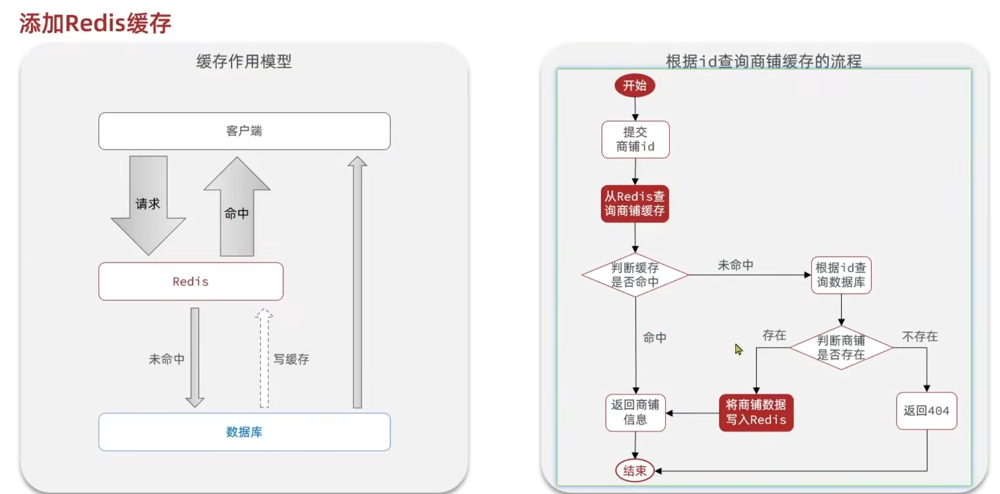

1. **ShopController**的**query**方法

   ```java
       @GetMapping("/{id}")
       public Result queryShopById(@PathVariable("id") Long id) {
           return shopService.queryShopById(id);
       }
   ```

2. ShopService接口与实现类

   ```java
   public interface IShopService extends IService<Shop> {
   
       Result queryShopById(Long id);
   
       Result updateShop(Shop shop);
   
       Result queryShopByType(Integer typeId, Integer current, Double x, Double y);
   }
   ```

   ```java
   @Service
   public class ShopServiceImpl extends ServiceImpl<ShopMapper, Shop> implements IShopService {
   
       @Resource
       private StringRedisTemplate stringRedisTemplate;
       @Resource
       private CacheClient cacheClient;
       @Override
       public Result queryShopById(Long id) {
           // 利用缓存空对象解决缓存穿透问题
           Shop shop = cacheClient
                   .queryWithPassThrough(CACHE_SHOP_KEY, id, Shop.class, this::getById, CACHE_SHOP_TTL, TimeUnit.MINUTES);
           // 利用互斥锁解决缓存击穿问题
           // Shop shop = cacheClient
           //         .queryWithMutex(CACHE_SHOP_KEY, id, Shop.class, this::getById, CACHE_SHOP_TTL, TimeUnit.MINUTES);
           // 利用逻辑过期解决缓存击穿问题
           // Shop shop = cacheClient
           //         .queryWithLogicalExpire(CACHE_SHOP_KEY, id, Shop.class, this::getById, 20L, TimeUnit.SECONDS);
           if (shop == null) {
               return Result.fail("店铺不存在！");
           }
           return Result.ok(shop);
       }
   }
   
   ```

   

### C.缓存更新策略

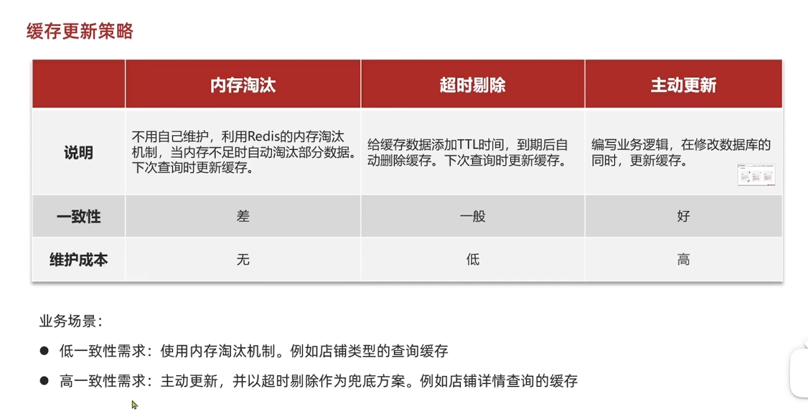

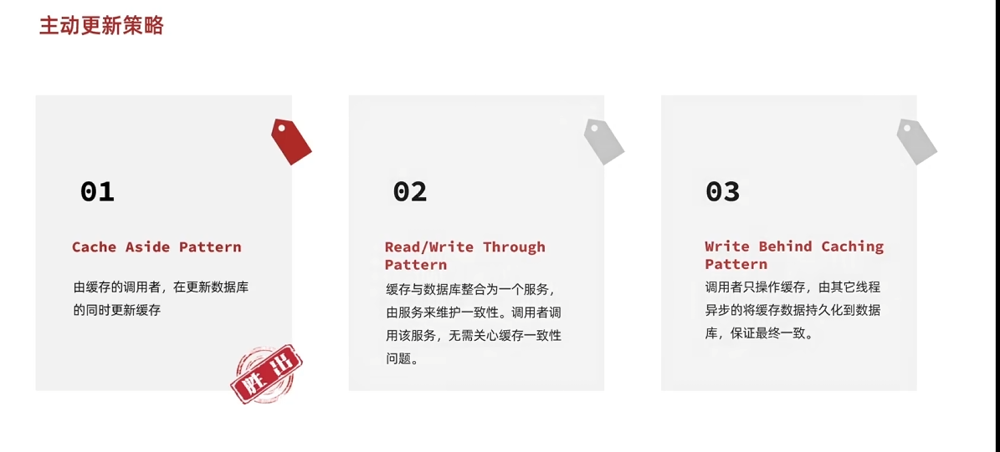

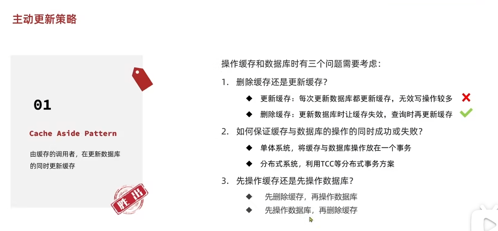

#### C.1先删缓存,再操作数据库-正常情况：

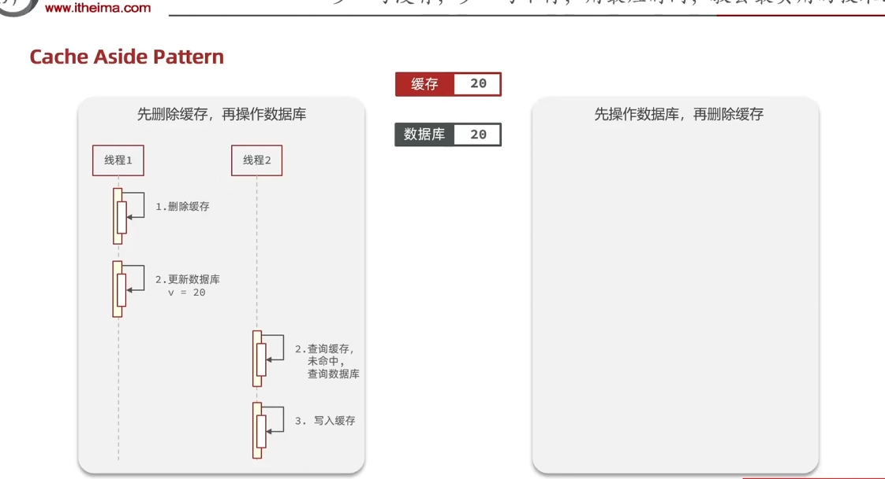

#### C.2先删缓存,再操作数据库-异常情况

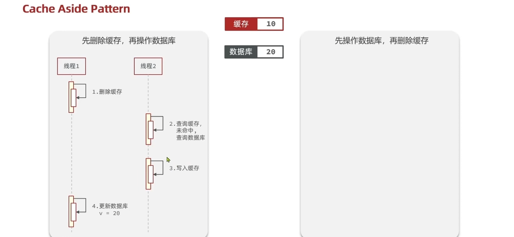

#### C.3先操作数据库,再删缓存-异常情况:在数据库更新前查找值,导致3.之后写入缓存的是更新之前的值

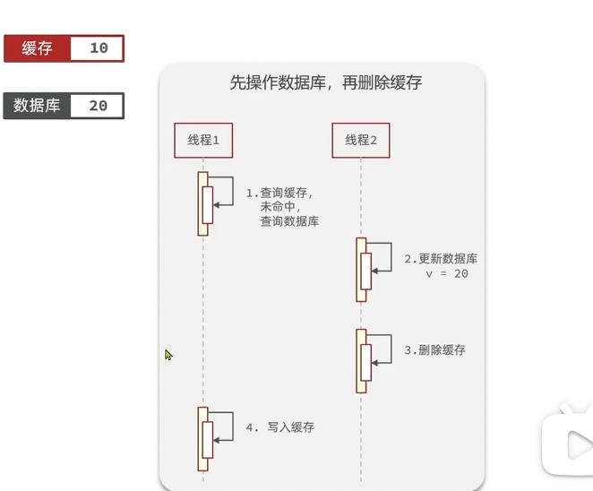

#### C.4总结：

缓存更新策略最佳实践方案：

1. 低一致性需求：使用Redis自带的内存淘汰策略
2. 高一致性需求：主动更新，并且用超时剔除作为兜底方案
   - 读操作：
     - 缓存命中直接返回
     - 缓存没命中就查数据库，并且写入缓存，设定超时时间
   - 写操作：
     - 先写数据库，然后再删缓存(原因详见c.1~3分析.因为先写数据库再删缓存,出现异常概率低)
     - 确保数据库与缓存操作的原子性

#### C.5给查询商铺的缓存添加超时剔除和主动更新策略(C的实战部分）

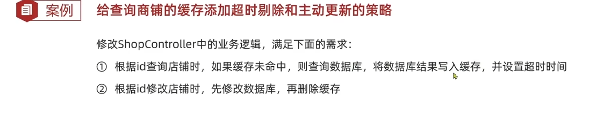

```java
 @Override
    public Result queryShopById(Long id) {

        // 利用缓存空对象解决缓存穿透问题
        Shop shop = cacheClient
                .queryWithPassThrough(CACHE_SHOP_KEY, id, Shop.class, this::getById, CACHE_SHOP_TTL, TimeUnit.MINUTES);
        if (shop == null) {
            return Result.fail("店铺不存在！");
        }

        return Result.ok(shop);
    }
```

```java
 // 根据指定的key查询缓存，并反序列化为指定类型，利用缓存空值的方式解决缓存穿透问题
    public <R,ID> R queryWithPassThrough(String keyPrefix, ID id, Class<R> type, Function<ID, R> dbFallback, Long time, TimeUnit unit){
        String key = keyPrefix + id;
        // 1.从redis查询商铺缓存
        String json = stringRedisTemplate.opsForValue().get(key);
        // 2.判断是否存在
        if (StrUtil.isNotBlank(json)) {
            // 3.存在，直接返回
            return JSONUtil.toBean(json, type);
        }
        // 判断命中的是否是空值
        if (json != null) {
            // 返回一个错误信息
            return null;
        }
        // 4.不存在，根据id查询数据库
        R r = dbFallback.apply(id);
        // 5.不存在，返回错误
        if (r == null) {
            // 将空值写入redis
            stringRedisTemplate.opsForValue().set(key, "", CACHE_NULL_TTL, TimeUnit.MINUTES);
            // 返回错误信息
            return null;
        }
        // 6.存在，写入redis
        this.set(key, r, time, unit);
        return r;
    }

```


### D.缓存穿透:

#### D.1概念分析

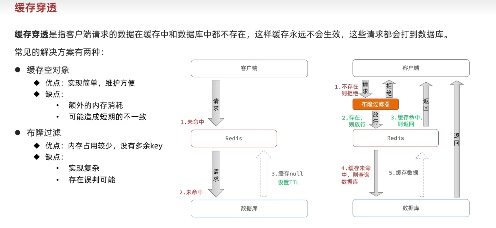

```
布隆过滤器（Bloom Filter）是一种空间效率极高的概率型数据结构，它用于测试一个元素是否属于集合。布隆过滤器的主要特点是它可能会错误地判断一个元素属于集合（假阳性），但绝不会错误地判断一个元素不属于集合（无假阴性）。
在Redis中，布隆过滤器可以避免缓存穿透的原因如下：
1. **缓存穿透定义**：缓存穿透是指查询一个根本不存在的数据，因为缓存中不存在该数据，请求会直接落到数据库上，这会给数据库带来很大压力，甚至可能导致数据库崩溃。
2. **预先检查**：布隆过滤器可以被用来预先检查一个元素是否可能存在于数据库中。当请求到来时，首先通过布隆过滤器判断，如果过滤器表明该元素肯定不存在，那么就可以直接返回，无需进一步查询数据库。
3. **减少数据库查询**：由于布隆过滤器可以非常快速地判断元素是否存在，因此可以大幅减少对数据库的不必要查询。即使布隆过滤器判断元素可能存在（包括假阳性情况），也只需要少量的数据库查询来确认。
4. **避免无效计算**：对于不存在的数据，通过布隆过滤器可以直接过滤掉这些请求，避免了缓存和数据库进行无效的计算和查询。
5. **资源节约**：布隆过滤器不需要存储元素本身，它仅使用位数组来表示集合，因此占用的空间非常小，这使得它在资源上非常高效。
6. **适用场景**：对于那些写入不频繁，读取频繁，且能够容忍一定误判的场景，布隆过滤器非常适合用来防止缓存穿透。
总之，布隆过滤器在Redis中的应用，通过牺牲一定的小概率误判来换取极高的空间效率和查询速度，有效地避免了缓存穿透问题，保护了数据库免受大量无效请求的冲击。

```

> Q:为什么不把布隆过滤器和缓存空对象一起用？
>
> A:你理解错误了布隆过滤器和Redis缓存以及数据库的关系
>
> 缓存空对象和布隆过滤器的工作原理分别如下：
> ### 缓存空对象
> 缓存空对象是为了解决缓存穿透问题，即当请求的数据在缓存和数据库中都不存在时，为了避免大量请求直接打到数据库上，可以在缓存中存储一个空对象或特殊标记，表示这个查询结果为空。
> - **空对象是否存到数据库**：通常情况下，空对象是不会被存入数据库的。数据库中存储的是实际的数据记录，而空对象只是在缓存层用于标记某个键（key）没有对应的值（value）。缓存空对象的目的是减少对数据库的无效查询，而不是作为数据记录的一部分。
> ### 布隆过滤器
> 布隆过滤器是一种空间效率极高的概率型数据结构，用于测试一个元素是否属于集合。它通过几个哈希函数将元素映射到位数组（bit array）上。
> - **数据来源**：布隆过滤器中的数据通常不是直接从缓存或数据库中取出的。它是一个独立的数据结构，用于快速检查某个元素是否可能存在于一个集合中。布隆过滤器中的数据是根据实际存储在数据库中的数据来初始化的，但它并不存储原始数据，而是存储元素的存在信息。因此，布隆过滤器中的数据可以看作是对数据库中数据的一种概率性索引或标记。
> 总结来说：
> - 缓存空对象是缓存层的一种优化手段，它不会存入数据库。
> - 布隆过滤器是基于数据库中数据构建的，但它不直接存储缓存中的数据或数据库中的原始数据，而是存储元素可能存在的概率信息。

#### D.2代码实现(无效查询缓存null)

```java
 // 根据指定的key查询缓存，并反序列化为指定类型，利用缓存空值的方式解决缓存穿透问题
    public <R,ID> R queryWithPassThrough(String keyPrefix, ID id, Class<R> type, Function<ID, R> dbFallback, Long time, TimeUnit unit){
        String key = keyPrefix + id;
        // 1.从redis查询商铺缓存
        String json = stringRedisTemplate.opsForValue().get(key);
        // 2.判断是否存在
        if (StrUtil.isNotBlank(json)) {
            // 3.存在，直接返回
            return JSONUtil.toBean(json, type);
        }
        // 判断命中的是否是空值
        if (json != null) {
            // 返回一个错误信息
            return null;
        }
        // 4.不存在，根据id查询数据库
        R r = dbFallback.apply(id);
        // 5.不存在，返回错误
        if (r == null) {
            // 将空值写入redis
            stringRedisTemplate.opsForValue().set(key, "", CACHE_NULL_TTL, TimeUnit.MINUTES);
            // 返回错误信息
            return null;
        }
        // 6.存在，写入redis
        this.set(key, r, time, unit);
        return r;
    }

```

#### D.3总结

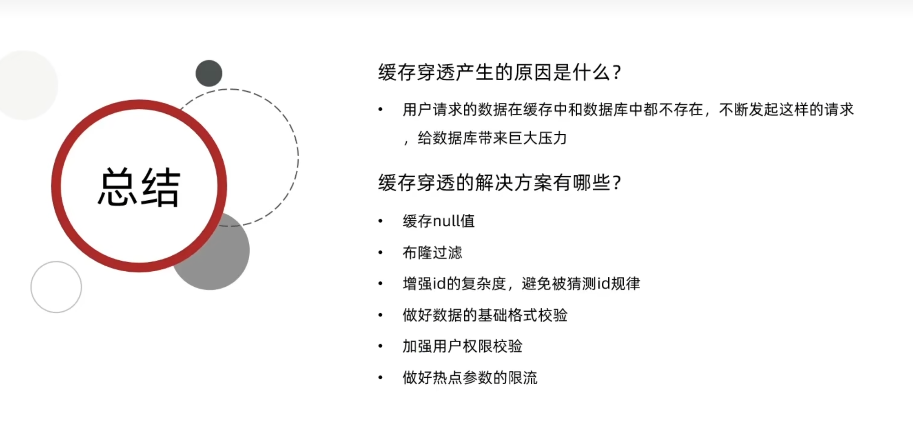

### E.缓存雪崩

#### E1.概念分析

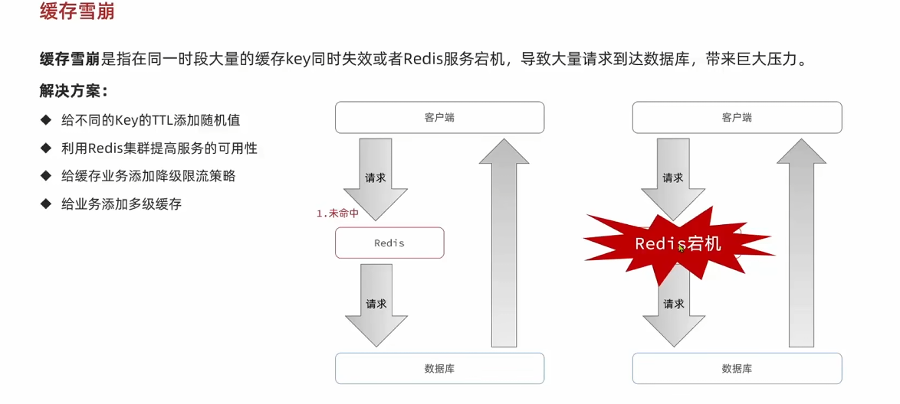

##### E.1给不同的key的TTL随机值

##### E.2利用Redis集群降低影响

##### E.3给缓存业务添加降级限流策略

##### E.4给业务添加多级缓存

### F.缓存击穿

#### F.1概念分析

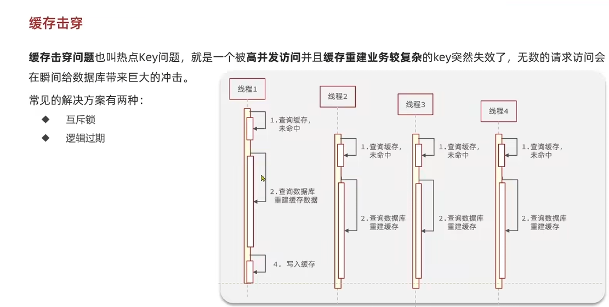

> 缓存穿透和缓存击穿是两种不同的缓存问题，它们在发生原因和应对策略上有所不同。
> ### 缓存穿透（Cache Penetration）
> **定义**：缓存穿透是指查询一个一定不存在的数据，由于缓存中不存在该数据，每次请求都会落到数据库上，从而可能压垮数据库。
> **原因**：
>
> - 用户恶意攻击，查询大量不存在的数据。
> - 应用程序错误，例如由于错误的数据处理逻辑导致查询不存在的数据。
> **应对策略**：
> 1. **缓存空对象**：将查询结果为空的数据也缓存起来，并设置较短的过期时间。这样，后续相同的查询请求会直接命中缓存，而不会访问数据库。
> 2. **布隆过滤器**：在访问缓存和数据库之前，使用布隆过滤器判断数据是否可能存在。如果布隆过滤器判断数据不存在，则直接返回，不进行后续的缓存和数据库查询。
> 3. **参数校验**：在查询之前对输入参数进行校验，过滤掉非法或不合理的请求。
> 4. **限流**：对查询请求进行限流，防止大量恶意请求压垮系统。
> ### 缓存击穿（Cache Breakdown）
> **定义**：缓存击穿是指一个热点数据在缓存中过期，而此时大量请求同时访问该数据，导致这些请求全部落到数据库上，从而可能压垮数据库。
> **原因**：
>
> - 热点数据过期。
> - 系统在高并发场景下对热点数据的访问。
> **应对策略**：
> 1. **设置热点数据永不过期**：对于热点数据，可以不设置过期时间，或者设置一个非常长的过期时间。
> 2. **互斥锁**：在缓存失效时，不是立即去数据库查询，而是先使用互斥锁，保证同一时间只有一个请求去数据库查询，其他请求等待锁释放后直接从缓存获取数据。
> 3. **双缓存策略**：设置主从两套缓存，主缓存失效时，先从从缓存中获取数据，同时异步更新主缓存。
> 4. **后台更新**：由后台定时任务定期更新缓存，避免缓存数据在高峰访问时段过期。
> ### 总结
> 缓存穿透和缓存击穿的区别主要在于请求的数据是否原本应该存在于缓存中。缓存穿透是查询不存在的数据，而缓存击穿是查询存在的数据，但数据在缓存中过期。应对策略也有所不同，但目的都是为了减少对数据库的直接访问，保护数据库不被大量请求压垮。

#### F.2解决方案概念

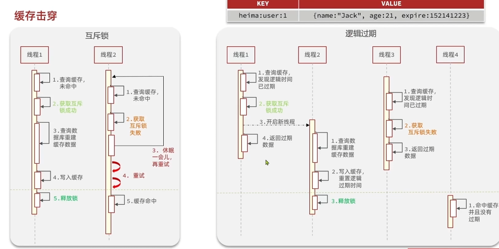

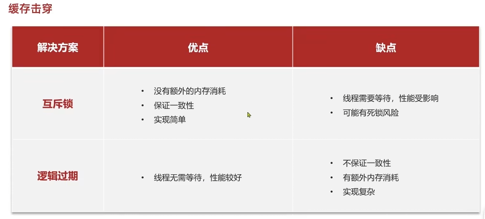

#### F.3基于互斥锁解决缓存击穿后的重建问题

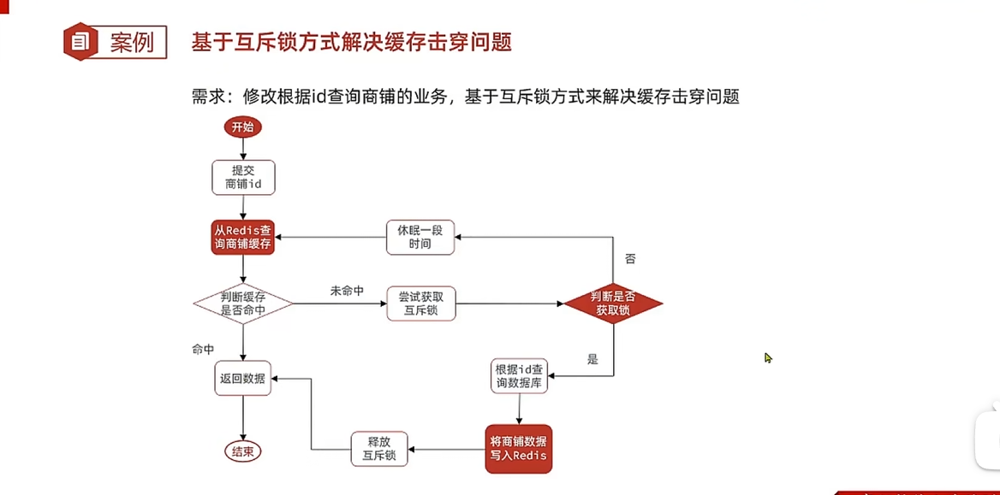

> setnx lock 1 ->返回1
>
> get lock ->返回1
>
> setnx lock 2->返回0
>
> setnx lock3 ->返回0
>
> 这就是典型的互斥锁，只有1得到了锁，在1释放锁之前，2和3都无法得到锁。锁是key 用户是value
>
> del lock 现在我们删掉了锁
>
> setnx lock 2->返回2 代表2得到了锁

```java
@Override
    public Result queryShopById(Long id) {

        // 利用互斥锁解决缓存击穿问题
    Shop shop = cacheClient
            .queryWithMutex(CACHE_SHOP_KEY, id, Shop.class, this::getById, CACHE_SHOP_TTL, TimeUnit.MINUTES);


        if (shop == null) {
            return Result.fail("店铺不存在！");
        }

        return Result.ok(shop);
    }
```

```java
// 根据指定的key查询缓存，并反序列化为指定类型，利用  锁  解决缓存击穿问题
    public <R, ID> R queryWithMutex(
            String keyPrefix, ID id, Class<R> type, Function<ID, R> dbFallback, Long time, TimeUnit unit) {
        String key = keyPrefix + id;
        // 1.从redis查询商铺缓存
        String shopJson = stringRedisTemplate.opsForValue().get(key);
        // 2.判断是否存在
        if (StrUtil.isNotBlank(shopJson)) {
            // 3.存在，直接返回
            return JSONUtil.toBean(shopJson, type);
        }
        // 判断命中的是否是空值
        if (shopJson != null) {
            // 返回一个错误信息
            return null;
        }

        // 4.实现缓存重建
        // 4.1.获取互斥锁
        String lockKey = LOCK_SHOP_KEY + id;
        R r = null;
        try {
            boolean isLock = tryLock(lockKey);
            // 4.2.判断是否获取成功
            if (!isLock) {
                // 4.3.获取锁失败，休眠并重试
                Thread.sleep(50);
                return queryWithMutex(keyPrefix, id, type, dbFallback, time, unit);
            }
            // 4.4.获取锁成功，根据id查询数据库
            r = dbFallback.apply(id);
            // 5.不存在，返回错误
            if (r == null) {
                // 将空值写入redis
                stringRedisTemplate.opsForValue().set(key, "", CACHE_NULL_TTL, TimeUnit.MINUTES);
                // 返回错误信息
                return null;
            }
            // 6.存在，写入redis
            this.set(key, r, time, unit);
        } catch (InterruptedException e) {
            throw new RuntimeException(e);
        }finally {
            // 7.释放锁
            unlock(lockKey);
        }
        // 8.返回
        return r;
    }
```

```java
private boolean tryLock(String key) {
        Boolean flag = stringRedisTemplate.opsForValue().setIfAbsent(key, "1", 10, TimeUnit.SECONDS);
        return BooleanUtil.isTrue(flag);
    }

    private void unlock(String key) {
        stringRedisTemplate.delete(key);
    }
```

> 在Java中，`::` 是方法引用运算符，它提供了一种引用方法的简便方式。具体到你给出的代码片段中，`this::getById` 是一个对当前对象（`this`）中的 `getById` 方法的引用。
> 这里是如何拆解这个表达式的：
>
> - `this`：指的是当前对象实例，即当前类的实例。
> - `::`：是方法引用运算符。
> - `getById`：是当前类中的一个方法。
> 所以，`this::getById` 整体意味着引用当前对象的 `getById` 方法。当这个方法引用在代码中被调用时，它等同于调用 `this.getById(...)` 方法。
> 在提供的代码片段中，这个方法引用作为参数传递给了 `.queryWithMutex` 方法，这表明 `.queryWithMutex` 可能期望一个方法作为参数，这个方法会在某些条件下被调用（比如当缓存中没有找到对应的 `id` 时）。
> 这是一个Lambda表达式的一个替代方式，当你要传递一个已经存在的方法而不是一个新的Lambda表达式时，使用方法引用可以使代码更加简洁明了。

#### F.4基于逻辑过期解决缓存击穿后的重建问题

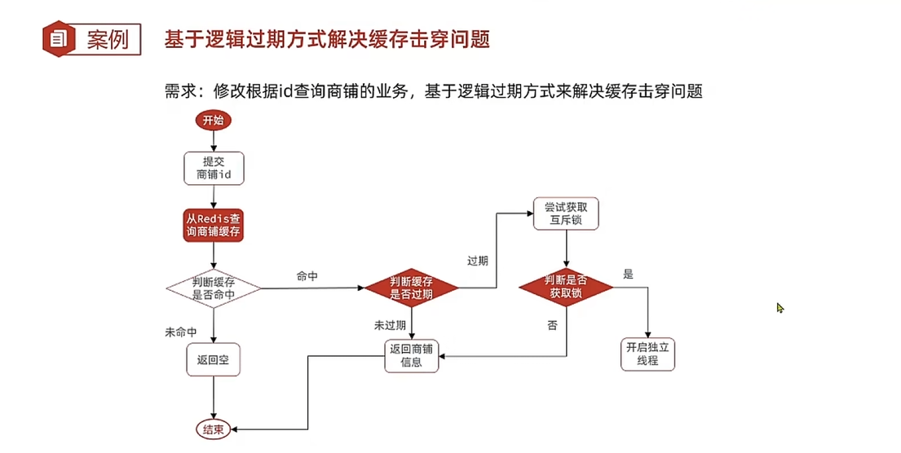

```java
@Override
    public Result queryShopById(Long id) {

        // 利用逻辑过期解决缓存击穿问题
         Shop shop = cacheClient
                 .queryWithLogicalExpire(CACHE_SHOP_KEY, id, Shop.class, this::getById, 20L, TimeUnit.SECONDS);

        if (shop == null) {
            return Result.fail("店铺不存在！");
        }

        return Result.ok(shop);
    }
```

```java
    // 根据指定的key查询缓存，并反序列化为指定类型，利用   逻辑过期   解决缓存击穿问题
    public <R, ID> R queryWithLogicalExpire(
            String keyPrefix, ID id, Class<R> type, Function<ID, R> dbFallback, Long time, TimeUnit unit) {
        String key = keyPrefix + id;
        // 1.从redis查询商铺缓存
        String json = stringRedisTemplate.opsForValue().get(key);
        // 2.判断是否存在
        if (StrUtil.isBlank(json)) {
            // 3.存在，直接返回
            return null;
        }
        // 4.命中，需要先把json反序列化为对象
        RedisData redisData = JSONUtil.toBean(json, RedisData.class);
        R r = JSONUtil.toBean((JSONObject) redisData.getData(), type);
        LocalDateTime expireTime = redisData.getExpireTime();
        // 5.判断是否过期
        if(expireTime.isAfter(LocalDateTime.now())) {
            // 5.1.未过期，直接返回店铺信息
            return r;
        }
        // 5.2.已过期，需要缓存重建
        // 6.缓存重建
        // 6.1.获取互斥锁
        String lockKey = LOCK_SHOP_KEY + id;
        boolean isLock = tryLock(lockKey);
        // 6.2.判断是否获取锁成功
        if (isLock){
            // 6.3.成功，开启独立线程，实现缓存重建
            CACHE_REBUILD_EXECUTOR.submit(() -> {
                try {
                    // 查询数据库
                    R newR = dbFallback.apply(id);
                    // 重建缓存
                    this.setWithLogicalExpire(key, newR, time, unit);
                } catch (Exception e) {
                    throw new RuntimeException(e);
                }finally {
                    // 释放锁
                    unlock(lockKey);
                }
            });
        }
        // 6.4.返回过期的商铺信息
        return r;
    }

```

```java
private boolean tryLock(String key) {
        Boolean flag = stringRedisTemplate.opsForValue().setIfAbsent(key, "1", 10, TimeUnit.SECONDS);
        return BooleanUtil.isTrue(flag);
    }

    private void unlock(String key) {
        stringRedisTemplate.delete(key);
    }
```


### G.缓存工具封装

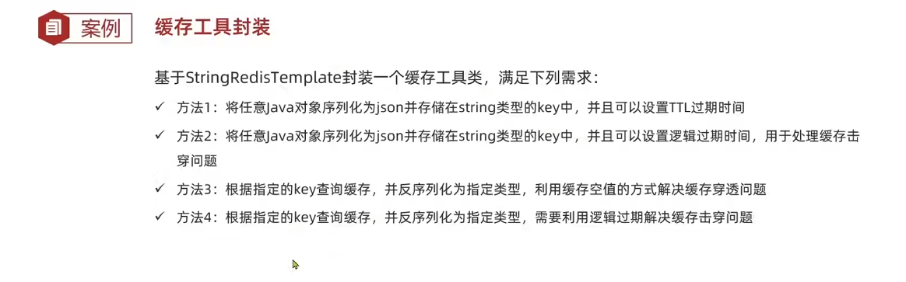

```java
package com.hmdp.utils;

import cn.hutool.core.util.BooleanUtil;
import cn.hutool.core.util.StrUtil;
import cn.hutool.json.JSONObject;
import cn.hutool.json.JSONUtil;
import lombok.extern.slf4j.Slf4j;
import org.springframework.beans.factory.annotation.Autowired;
import org.springframework.data.redis.core.StringRedisTemplate;
import org.springframework.stereotype.Component;

import java.time.LocalDateTime;
import java.util.concurrent.ExecutorService;
import java.util.concurrent.Executors;
import java.util.concurrent.TimeUnit;
import java.util.function.Function;

import static com.hmdp.utils.RedisConstants.CACHE_NULL_TTL;
import static com.hmdp.utils.RedisConstants.LOCK_SHOP_KEY;

@Slf4j
@Component
public class CacheClient {

    private final StringRedisTemplate stringRedisTemplate;

    private static final ExecutorService CACHE_REBUILD_EXECUTOR = Executors.newFixedThreadPool(10);

    public CacheClient(StringRedisTemplate stringRedisTemplate) {
        this.stringRedisTemplate = stringRedisTemplate;
    }


    // 普通的set方法，value转为json
    public void set(String key, Object value, Long time, TimeUnit unit) {
        stringRedisTemplate.opsForValue().set(key, JSONUtil.toJsonStr(value), time, unit);
    }


    //  将任意Java对象序列化为json并存储在string类型的key中，并且可以设置逻辑过期时间，用于处理缓存击穿问题
    public void setWithLogicalExpire(String key, Object value, Long time, TimeUnit unit) {
        // 设置逻辑过期
        RedisData redisData = new RedisData();
        redisData.setData(value);
        redisData.setExpireTime(LocalDateTime.now().plusSeconds(unit.toSeconds(time)));
        // 写入Redis
        stringRedisTemplate.opsForValue().set(key, JSONUtil.toJsonStr(redisData));
    }

    // 根据指定的key查询缓存，并反序列化为指定类型，利用缓存空值的方式解决缓存穿透问题
    public <R,ID> R queryWithPassThrough(String keyPrefix, ID id, Class<R> type, Function<ID, R> dbFallback, Long time, TimeUnit unit){
        String key = keyPrefix + id;
        // 1.从redis查询商铺缓存
        String json = stringRedisTemplate.opsForValue().get(key);
        // 2.判断是否存在
        if (StrUtil.isNotBlank(json)) {
            // 3.存在，直接返回
            return JSONUtil.toBean(json, type);
        }
        // 判断命中的是否是空值
        if (json != null) {
            // 返回一个错误信息
            return null;
        }

        // 4.不存在，根据id查询数据库
        R r = dbFallback.apply(id);
        // 5.不存在，返回错误
        if (r == null) {
            // 将空值写入redis
            stringRedisTemplate.opsForValue().set(key, "", CACHE_NULL_TTL, TimeUnit.MINUTES);
            // 返回错误信息
            return null;
        }
        // 6.存在，写入redis
        this.set(key, r, time, unit);
        return r;
    }


    // 根据指定的key查询缓存，并反序列化为指定类型，利用   逻辑过期   解决缓存击穿问题
    public <R, ID> R queryWithLogicalExpire(
            String keyPrefix, ID id, Class<R> type, Function<ID, R> dbFallback, Long time, TimeUnit unit) {
        String key = keyPrefix + id;
        // 1.从redis查询商铺缓存
        String json = stringRedisTemplate.opsForValue().get(key);
        // 2.判断是否存在
        if (StrUtil.isBlank(json)) {
            // 3.存在，直接返回
            return null;
        }
        // 4.命中，需要先把json反序列化为对象
        RedisData redisData = JSONUtil.toBean(json, RedisData.class);
        R r = JSONUtil.toBean((JSONObject) redisData.getData(), type);
        LocalDateTime expireTime = redisData.getExpireTime();
        // 5.判断是否过期
        if(expireTime.isAfter(LocalDateTime.now())) {
            // 5.1.未过期，直接返回店铺信息
            return r;
        }
        // 5.2.已过期，需要缓存重建
        // 6.缓存重建
        // 6.1.获取互斥锁
        String lockKey = LOCK_SHOP_KEY + id;
        boolean isLock = tryLock(lockKey);
        // 6.2.判断是否获取锁成功
        if (isLock){
            // 6.3.成功，开启独立线程，实现缓存重建
            CACHE_REBUILD_EXECUTOR.submit(() -> {
                try {
                    // 查询数据库
                    R newR = dbFallback.apply(id);
                    // 重建缓存
                    this.setWithLogicalExpire(key, newR, time, unit);
                } catch (Exception e) {
                    throw new RuntimeException(e);
                }finally {
                    // 释放锁
                    unlock(lockKey);
                }
            });
        }
        // 6.4.返回过期的商铺信息
        return r;
    }


    // 根据指定的key查询缓存，并反序列化为指定类型，利用  锁  解决缓存击穿问题
    public <R, ID> R queryWithMutex(
            String keyPrefix, ID id, Class<R> type, Function<ID, R> dbFallback, Long time, TimeUnit unit) {
        String key = keyPrefix + id;
        // 1.从redis查询商铺缓存
        String shopJson = stringRedisTemplate.opsForValue().get(key);
        // 2.判断是否存在
        if (StrUtil.isNotBlank(shopJson)) {
            // 3.存在，直接返回
            return JSONUtil.toBean(shopJson, type);
        }
        // 判断命中的是否是空值
        if (shopJson != null) {
            // 返回一个错误信息
            return null;
        }

        // 4.实现缓存重建
        // 4.1.获取互斥锁
        String lockKey = LOCK_SHOP_KEY + id;
        R r = null;
        try {
            boolean isLock = tryLock(lockKey);
            // 4.2.判断是否获取成功
            if (!isLock) {
                // 4.3.获取锁失败，休眠并重试
                Thread.sleep(50);
                return queryWithMutex(keyPrefix, id, type, dbFallback, time, unit);
            }
            // 4.4.获取锁成功，根据id查询数据库
            r = dbFallback.apply(id);
            // 5.不存在，返回错误
            if (r == null) {
                // 将空值写入redis
                stringRedisTemplate.opsForValue().set(key, "", CACHE_NULL_TTL, TimeUnit.MINUTES);
                // 返回错误信息
                return null;
            }
            // 6.存在，写入redis
            this.set(key, r, time, unit);
        } catch (InterruptedException e) {
            throw new RuntimeException(e);
        }finally {
            // 7.释放锁
            unlock(lockKey);
        }
        // 8.返回
        return r;
    }

    private boolean tryLock(String key) {
        Boolean flag = stringRedisTemplate.opsForValue().setIfAbsent(key, "1", 10, TimeUnit.SECONDS);
        return BooleanUtil.isTrue(flag);
    }

    private void unlock(String key) {
        stringRedisTemplate.delete(key);
    }

}
```

## 3.优惠卷秒杀

### A.全局唯一ID

#### A.1概念

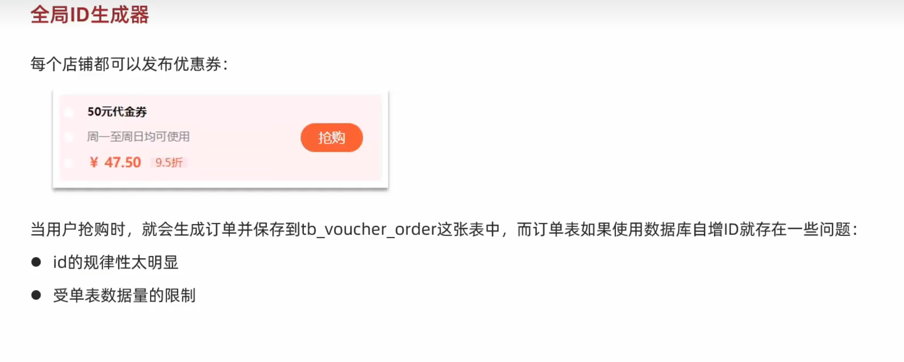

- **id规律性太明显：**你会给用户暴露其获得的优惠卷的id,比方说，两天同一时间。第一天编号是10，第二天编号是20.你可以发现：这个店铺一天卖了10单出去，这个数据我们不希望暴露给用户，所以得随机化id，让用户猜不到
- **单表数据量的限制：**百万访问的用户数据，会申请大量的优惠卷
- 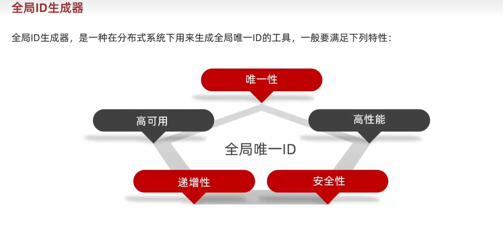

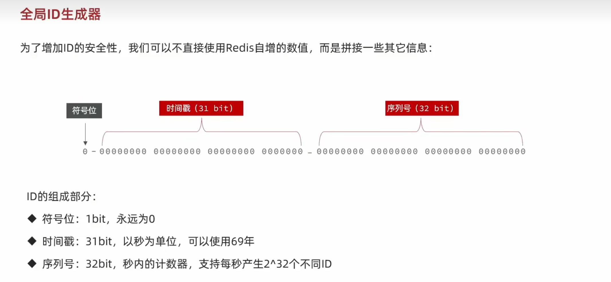

#### A.2Redis实现全局唯一ID

```java
@Component
public class RedisIdWorker {
    /**
     * 开始时间戳 2000-1-1
     */
    private static final long BEGIN_TIMESTAMP = 1640995200L;
    /**
     * 序列号的位数
     */
    private static final int COUNT_BITS = 32;

    @Resource
    private StringRedisTemplate stringRedisTemplate;


    public long nextId(String keyPrefix) {
        // 1.生成时间戳
        long newTime = LocalDateTime.now().toEpochSecond(ZoneOffset.UTC);
        long timeStamp = newTime - BEGIN_TIMESTAMP;

        // 2.生成序列号，使用redis的自增id
        // 2.1.获取当前日期，精确到天，可以很方便的统计到每年每天每月的订单量
        String date = LocalDateTime.now().format(DateTimeFormatter.ofPattern("yyyy:MM:dd"));
        // 2.2.自增长
        long count = stringRedisTemplate.opsForValue().increment("icr:" + keyPrefix + ":" + date);

        // 3.拼接并返回
        return timeStamp << 32 | count;

    }
}
```

> 在分析 `return timeStamp << 32 | count;` 这行代码之前，我们需要了解几个概念：
> 1. **位运算符**：
>    - `<<`：左移运算符，将左边的数值按位左移右边指定的位数。
>    - `|`：按位或运算符，对两个操作数的每一位执行按位或操作。
> 2. **时间戳（timeStamp）**：通常是一个表示自某个固定时间点（如Unix系统的1970年1月1日午夜）以来的秒数或毫秒数，通常是一个长整型（long）。
> 3. **计数（count）**：通常是一个整型（int）变量，表示某个操作的次数。
> 现在，我们来分析这行代码：
> - `timeStamp << 32`：将`timeStamp`左移32位。假设`timeStamp`是一个64位的长整型，这意味着我们将这个数值的高32位移动到低32位的位置，而原来的低32位将被移出，并被置为0。
> - `| count`：然后将左移后的`timeStamp`与`count`进行按位或操作。由于`timeStamp`已经左移了32位，其低32位现在是0，所以这个操作实际上是将`count`的值直接放置在结果的低32位上，而不影响`timeStamp`的高32位。
> 因此，这行代码的最终效果是创建了一个64位的数值，其中：
> - 高32位是原始`timeStamp`的低32位。
> - 低32位是`count`的值。
> 在Java中，这通常用于将两个32位的数值合并成一个64位的数值，以减少需要存储的变量数量或者在某些算法中作为一个高效的标记使用。
> 这里有几个注意事项：
> - 如果`timeStamp`的原始值超过32位，左移32位会导致信息丢失，因为只有低32位会被保留。
> - `count`应当保证在32位之内，否则在执行按位或操作时，超出32位的高位部分会被丢弃。
> - 在某些语言中，比如Java，`timeStamp`通常是一个`long`类型，而`count`是一个`int`类型，这样的操作是安全的，因为`int`在按位或操作时会被自动提升为`long`类型。
> 最终返回的值是一个64位的整型，它结合了时间戳和计数器的信息，可以用于需要同时记录时间顺序和操作次数的场景。

### B.优惠卷秒杀下单

#### B.1业务需求

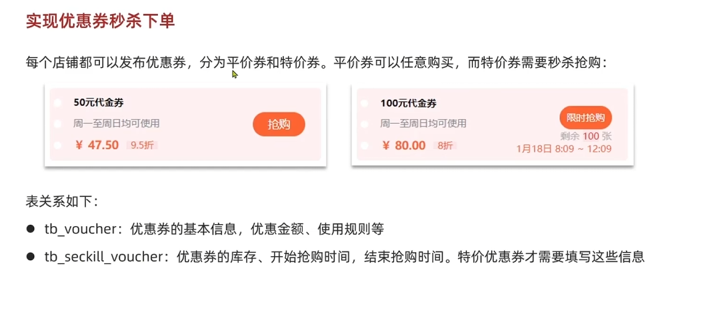

#### B.2代码实现

##### B.2.1Controller层

|          | 说明                        |
| -------- | --------------------------- |
| 请求方式 | POST                        |
| 请求路径 | /voucher-order/seckill/{id} |
| 请求参数 | id,优惠卷id1                |
| 返回值   | 订单id                      |


```java

@RestController
@RequestMapping("/voucher")
public class VoucherController {

    @Resource
    private IVoucherService voucherService;

    /**
     * 新增普通券
     * @param voucher 优惠券信息
     * @return 优惠券id
     */
    @PostMapping
    public Result addVoucher(@RequestBody Voucher voucher) {
        voucherService.save(voucher);
        return Result.ok(voucher.getId());
    }

    /**
     * 新增秒杀券
     * @param voucher 优惠券信息，包含秒杀信息
     * @return 优惠券id
     */
    @PostMapping("seckill")
    public Result addSeckillVoucher(@RequestBody Voucher voucher) {
        voucherService.addSeckillVoucher(voucher);
        return Result.ok(voucher.getId());
    }

    /**
     * 查询店铺的优惠券列表
     * @param shopId 店铺id
     * @return 优惠券列表
     */
    @GetMapping("/list/{shopId}")
    public Result queryVoucherOfShop(@PathVariable("shopId") Long shopId) {
       return voucherService.queryVoucherOfShop(shopId);
    }
}

```

##### B.2.2具体的service层

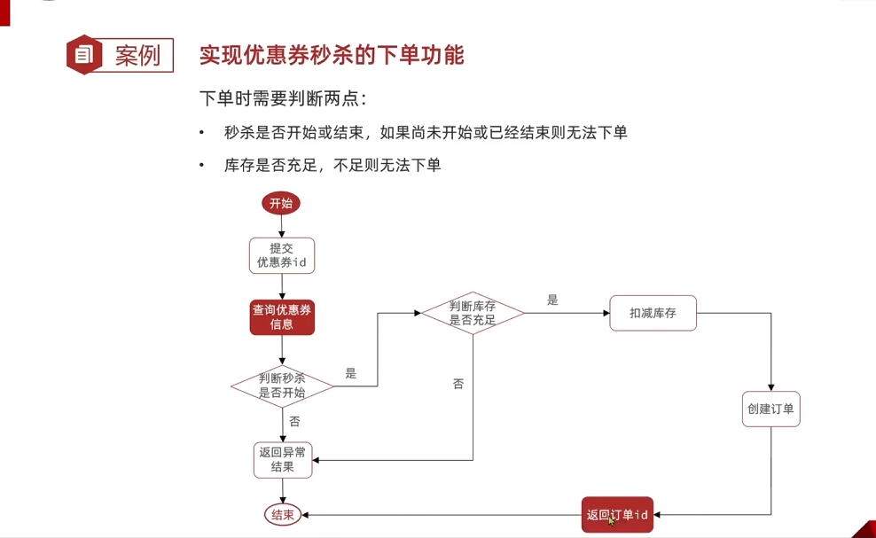

```java
    @Override
    public Result seckillVoucher(Long voucherId) throws InterruptedException {
        Long userId = UserHolder.getUser().getId();
        long orderId = redisIdWorker.nextId("order");
        System.out.println("orderId = " + orderId);
        Long result = stringRedisTemplate.execute(
                SECKILL_SCRIPT,
                Collections.emptyList(),
                voucherId.toString(), userId.toString(), String.valueOf(orderId)
        );
        int r = result.intValue();
        if (r != 0) {
            return Result.fail(r == 1 ? "库存不足" : "不能重复下单");
        }

//        VoucherOrder voucherOrder = new VoucherOrder();
//        voucherOrder.setId(orderId);
//        voucherOrder.setUserId(userId);
//        voucherOrder.setVoucherId(voucherId);

        //获取代理对象
        proxy = (IVoucherService) AopContext.currentProxy();

        return Result.ok(orderId);

    }
```

### C.超卖问题

#### C.1什么是超卖问题

> 为什么会有超卖问题：
>
> 传统单线程情况下，主线程查询库存，然后判断库存是否大于0，如果大于0则扣减。
>
> 但是高并发的情况下，存在多个线程。可能在AB两个线程交叉执行。

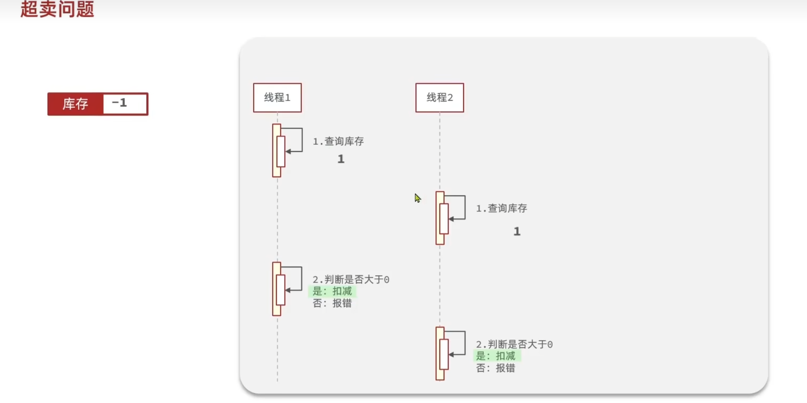

- 比方说：超卖问题。在线程1查询库存与判断库存是否大于0之间，线程2也查询库存。导致线程2查到了扣减前的库存。在线程1扣减之后，线程2也进行扣减。导致出现两次扣减。原本库存从1->0，现在库存从1到-1

#### C.2悲观锁与乐观锁思想

> 下面分别使用悲观锁和乐观锁来分析商品超卖问题，并提供具体的SQL例子。乐观锁将分别使用版本号机制和模拟CAS（Compare-And-Swap）操作两种表达形式。
> ### 悲观锁
> 悲观锁通过锁定资源来防止并发冲突。
> **SQL例子：**
> ```sql
> -- 开始事务
> START TRANSACTION;
> -- 查询商品库存，并锁定这条记录
> SELECT stock FROM products WHERE product_id = 1 FOR UPDATE;
> -- 假设我们要购买1件商品
> SET @quantity_to_buy = 1;
> -- 检查库存是否足够
> SET @current_stock = (SELECT stock FROM products WHERE product_id = 1);
> IF @current_stock >= @quantity_to_buy THEN
>     -- 更新库存
>     UPDATE products SET stock = stock - @quantity_to_buy WHERE product_id = 1;
>     -- 提交事务
>     COMMIT;
> ELSE
>     -- 库存不足，回滚事务
>     ROLLBACK;
> END IF;
> ```
> ### 乐观锁 - 使用版本号机制
> 乐观锁通过版本号机制来检测并发冲突。
> **SQL例子：**
> ```sql
> -- 假设每个商品记录有一个版本号字段version
> -- 开始事务
> START TRANSACTION;
> -- 读取商品库存和版本号
> SELECT stock, version FROM products WHERE product_id = 1;
> -- 假设我们要购买1件商品
> SET @quantity_to_buy = 1;
> SET @current_stock = (SELECT stock FROM products WHERE product_id = 1);
> SET @current_version = (SELECT version FROM products WHERE product_id = 1);
> IF @current_stock >= @quantity_to_buy THEN
>     -- 尝试更新库存，同时确保版本号没有变化
>     UPDATE products SET stock = stock - @quantity_to_buy, version = version + 1
>     WHERE product_id = 1 AND version = @current_version;
>     
>     -- 检查是否更新成功（即是否有行被更新）
>     IF ROW_COUNT() = 0 THEN
>         -- 版本号不匹配，说明有其他事务已经修改了库存，回滚事务
>         ROLLBACK;
>     ELSE
>         -- 更新成功，提交事务
>         COMMIT;
>     END IF;
> ELSE
>     -- 库存不足，回滚事务
>     ROLLBACK;
> END IF;
> ```
> ### 乐观锁 - 模拟CAS操作
> 乐观锁通过模拟CAS操作来检测并发冲突。
> **SQL例子：**
> ```sql
> -- 假设每个商品记录有一个版本号字段version
> -- 开始事务
> START TRANSACTION;
> -- 读取商品库存和版本号
> SELECT stock, version FROM products WHERE product_id = 1;
> -- 假设我们要购买1件商品
> SET @quantity_to_buy = 1;
> SET @current_stock = (SELECT stock FROM products WHERE product_id = 1);
> SET @current_version = (SELECT version FROM products WHERE product_id = 1);
> IF @current_stock >= @quantity_to_buy THEN
>     -- 尝试更新库存，同时确保版本号没有变化（模拟CAS操作）
>     UPDATE products SET stock = stock - @quantity_to_buy
>     WHERE product_id = 1 AND version = @current_version;
>     
>     -- 检查是否更新成功（即是否有行被更新）
>     IF ROW_COUNT() = 0 THEN
>         -- 版本号不匹配，说明有其他事务已经修改了库存，回滚事务
>         ROLLBACK;
>     ELSE
>         -- 更新成功，增加版本号
>         UPDATE products SET version = version + 1 WHERE product_id = 1;
>         -- 提交事务
>         COMMIT;
>     END IF;
> ELSE
>     -- 库存不足，回滚事务
>     ROLLBACK;
> END IF;
> ```
> 在模拟CAS的例子中，首先尝试更新库存，但不立即更新版本号。如果更新成功（即没有其他事务修改了记录），则增加版本号并提交事务。如果更新失败（即版本号不匹配），则回滚事务。
> 请注意，以上SQL代码可能需要根据具体的数据库系统进行调整，而且事务处理和错误处理可能需要更复杂的逻辑来确保系统的健壮性。

```
我们粗暴的理解：
悲观锁是在java代码里面加上syncronized和使用Lock 在sql代码里 for update
乐观锁是在Sql语句中加入where条件
```

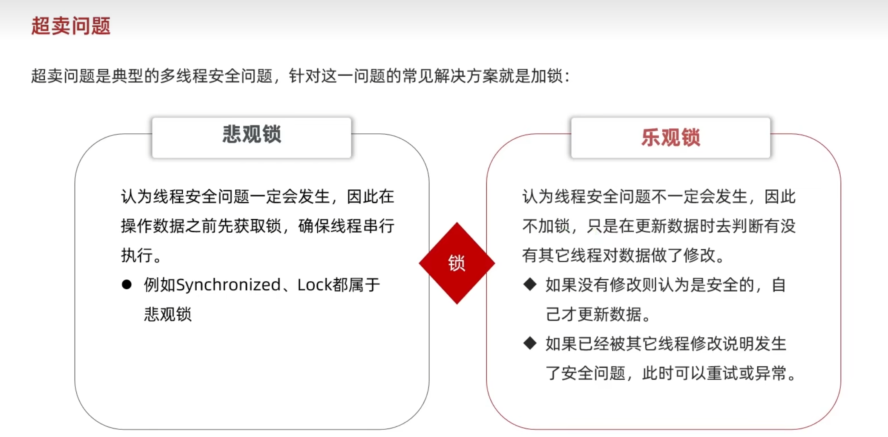

#### C.3乐观锁之版本号机制

我们规定：在线程1查询库存和版本号时候。stock和version都为1

```sql
UPDATE table_name
SET column1 = value1, version = version + 1
WHERE id = some_id AND version = current_version;
这就是典型的乐观锁之版本号机制例子 通过在sql语句中设置where条件 并且改变where条件中的值,例如版本号,来实现判断元素是否被修改过
```

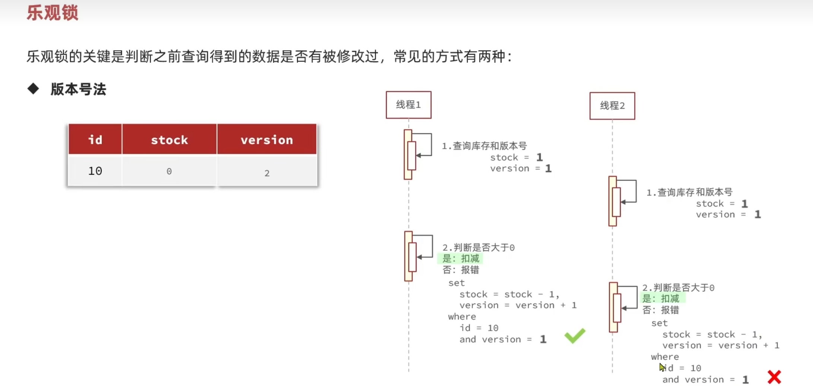

#### C.4乐观锁之CAS法

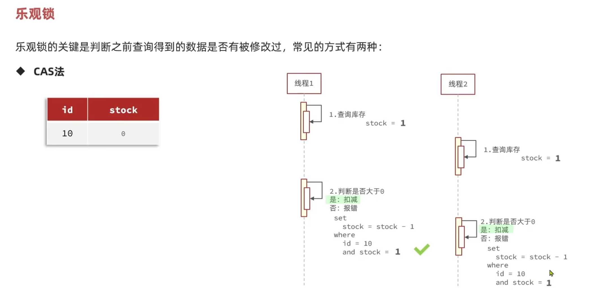

我们发现：CAS法没有版本号机制，我们用stock的数量来做条件判断

如果库存为1，方可减少。这样，即使线程2查询到了库存stock=1,但是在线程2查询后执行了线程1的扣减，扣减使得stpck为0.从而不符合where条件

### D.一人一单

#### D.1分析需求

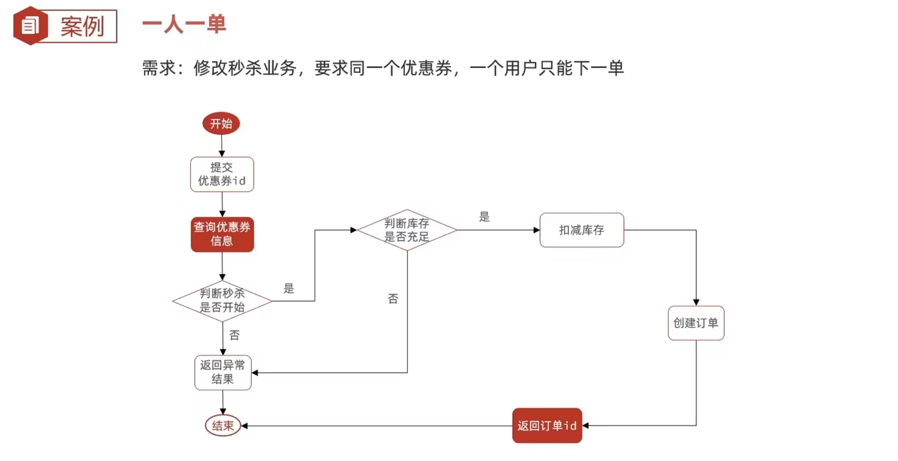

#### D.2代码实现

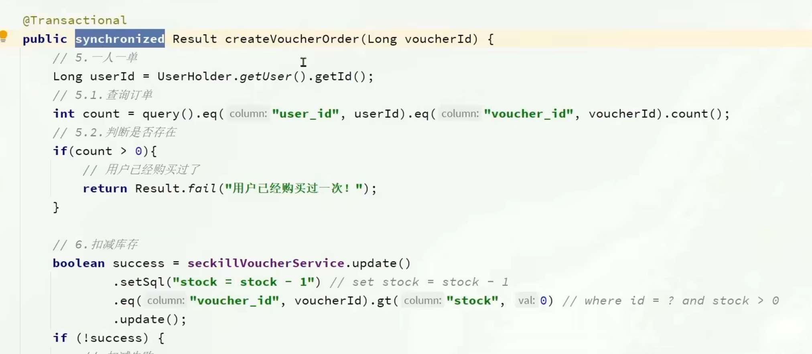

#### D.3集群模式导致的一人一单并发安全问题-发现在分布式环境下-需要分布式锁来替代原本的单个项目内代码的加锁

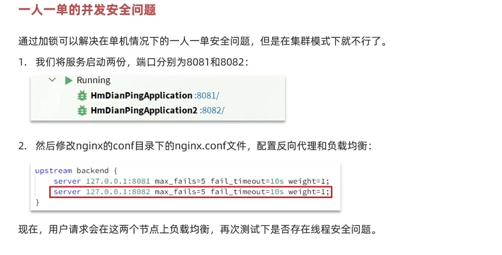

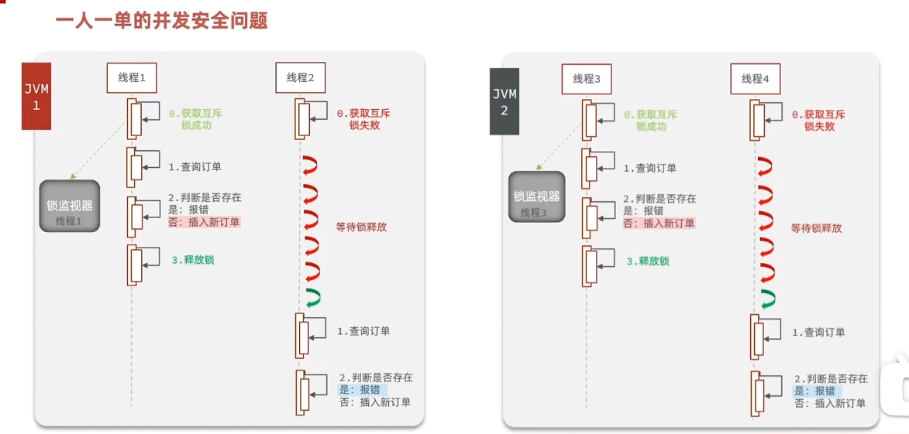

> ### 锁监视器（Lock Monitor）
> 锁监视器是一种同步机制，用于在多线程环境中控制对共享资源的访问。在Java中，锁监视器通常通过`synchronized`关键字或`java.util.concurrent.locks`包下的锁来实现。
> #### 知识点：
> 1. **基本概念**：
>    - **互斥**：同一时间只允许一个线程访问共享资源。
>    - **锁定**：线程在访问资源前必须获得锁，访问结束后释放锁。
> 2. **实现方式**：
>    - **内部锁（Intrinsic Lock）**：通过`synchronized`关键字实现。
>    - **显式锁（Explicit Lock）**：通过`Lock`接口及其实现类（如`ReentrantLock`）实现。
> 3. **特点**：
>    - **重入性**：线程可以重复获取已经持有的锁。
>    - **公平性**：可以选择是否按照请求锁的顺序来获取锁。
>    - **条件队列**：允许线程在某个条件下等待或被唤醒。
> #### 例子分析：
> 假设有一个简单的银行账户类，我们需要确保在多线程环境中，对账户余额的访问是线程安全的。
> ```java
> public class BankAccount {
>     private int balance;
>     public synchronized void deposit(int amount) {
>         balance += amount;
>     }
>     public synchronized void withdraw(int amount) {
>         if (balance >= amount) {
>             balance -= amount;
>         }
>     }
>     public synchronized int getBalance() {
>         return balance;
>     }
> }
> ```
> 在这个例子中，`deposit`、`withdraw`和`getBalance`方法都是同步的，意味着同一时间只有一个线程能够执行这些方法，从而保证了账户余额的一致性和安全性。
> ### 分布式锁（Distributed Lock）
> 分布式锁是一种跨不同计算节点的锁机制，用于在分布式系统中控制对共享资源的访问。
> #### 知识点：
> 1. **基本概念**：
>    - **跨节点**：锁的作用范围跨越不同的服务器或进程。
>    - **协调**：需要一个外部协调服务来管理锁的状态。
> 2. **实现方式**：
>    - **基于数据库**：利用数据库的唯一约束或事务来实现。
>    - **基于缓存**：如Redis、Memcached等，通过SETNX命令等原子操作实现。
>    - **基于ZooKeeper**：利用ZooKeeper的临时顺序节点和watch机制。
> 3. **特点**：
>    - **可靠性**：即使节点发生故障，也能保证锁的释放。
>    - **容错性**：系统可以处理部分节点的失败。
> #### 例子分析：
> 假设我们有一个分布式系统，多个服务实例可能会尝试同时更新同一个数据库记录，我们需要使用分布式锁来避免冲突。
> ```java
> public class DistributedLock {
>     private RedisLock redisLock;
>     public DistributedLock(RedisLock redisLock) {
>         this.redisLock = redisLock;
>     }
>     public void updateRecord(String key, String newValue) {
>         if (redisLock.lock(key)) {
>             try {
>                 // 更新数据库记录
>                 Database.updateRecord(key, newValue);
>             } finally {
>                 redisLock.unlock(key);
>             }
>         } else {
>             // 锁获取失败，可以重试或返回错误
>         }
>     }
> }
> ```
> 在这个例子中，我们使用Redis作为分布式锁的存储介质。`RedisLock`是一个假设的类，它提供了`lock`和`unlock`方法来获取和释放锁。在`updateRecord`方法中，我们首先尝试获取锁，如果成功，则执行更新操作，并在操作完成后释放锁。这样可以确保在分布式系统中，同一时间只有一个服务实例能够更新特定的记录。

### E.分布式锁

#### E.1分布式锁的基本原理

**（让多个jvm中的不同线程看到同一个锁监视器）**

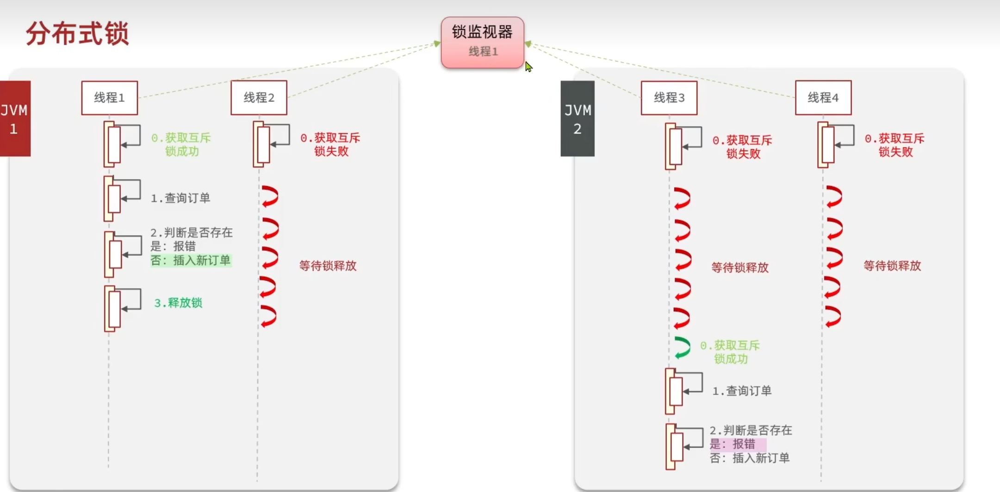

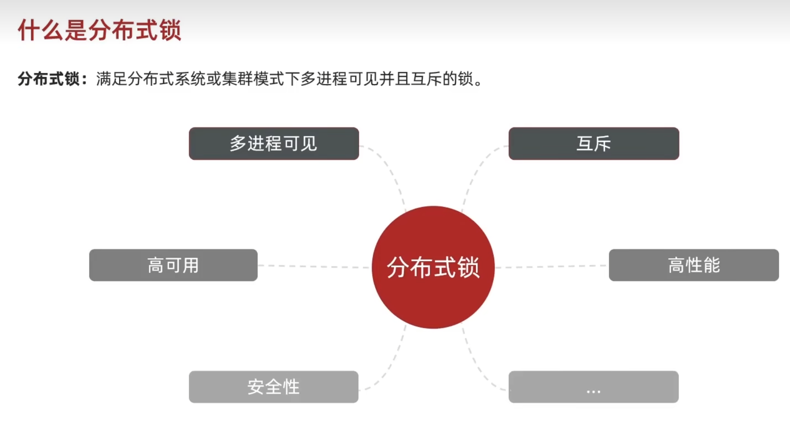

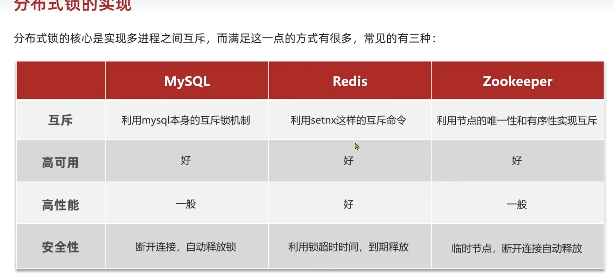

#### E.2Redis分布式锁实现思路：

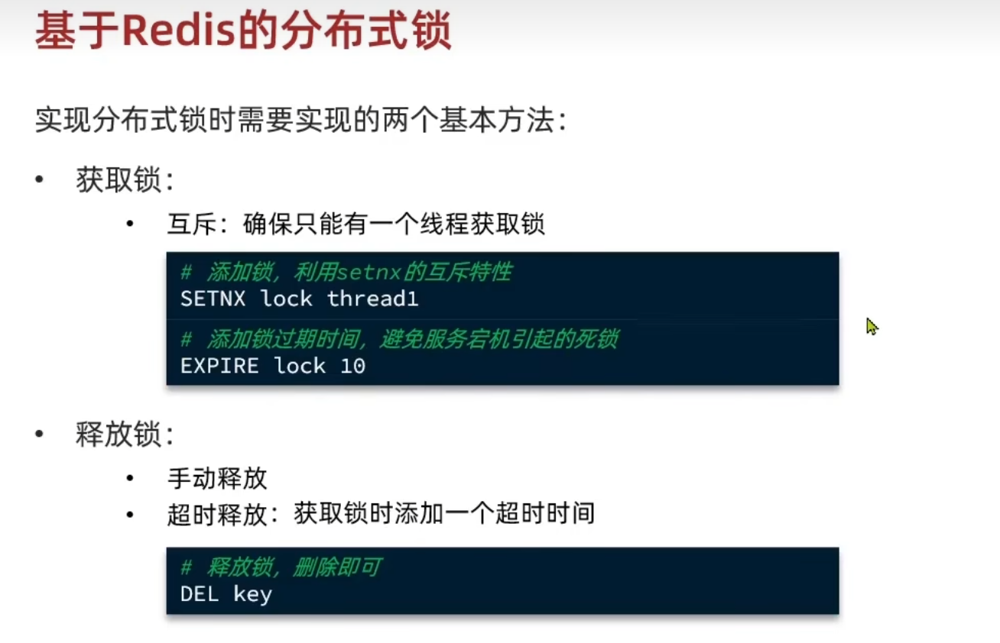

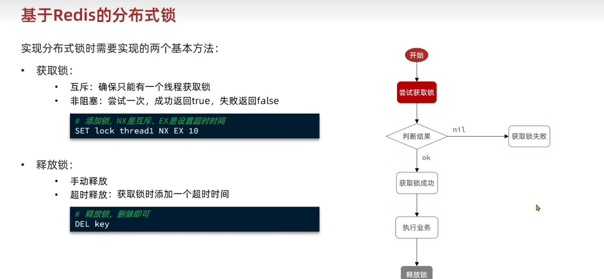

#### E.3实现Redis分布式锁版本1：

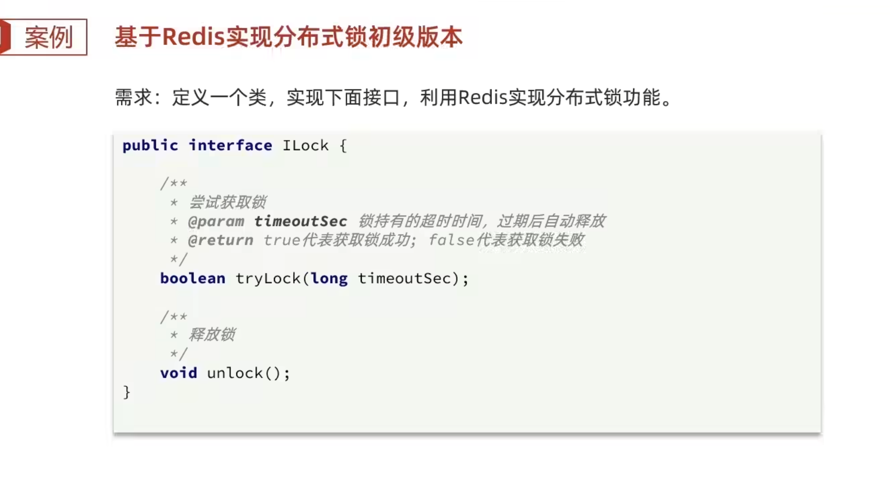

```java
public class SimpleRedisLock implements ILock{
    private String name;
    private StringRedisTemplate stringRedisTemplate;
    private static final String KEY_PREFIX = "lock";
    @Override
    //获取锁
    public boolean tryLock(long timeoutSec){
        //获取线程标识
        long threadID = Thread.currentThread().getId();
        //获取锁
        Boolean success = stringRedisTemplate.opsForValue().setIfAbsent(KEY_PREFIX+name,threadID+"",timeoutSec,TimeUnit.SECOND);
        return Boolean.TRUE.equals(success);//避免空指针问题
    }
    
    @Override
    //释放锁
    public void unlock(){
        stringRedisTemplate.delete(KEY_PREFIX+name);
    }
}
```

#### E.4Redis分布式锁的误删锁问题(业务阻塞造成超时释放锁)

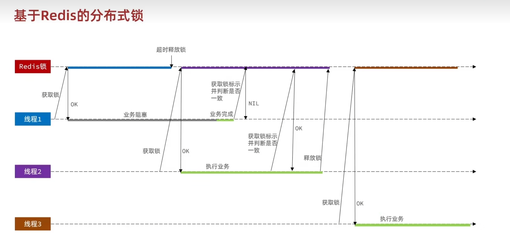

```
误删问题：
1.线程1获取锁
2.线程1业务阻塞，阻塞过程中redis锁因为超时而释放
3.线程2在分布式锁释放后拿到锁
4.线程2业务执行过程中,线程1还以为锁没有被释放(因为之前线程1在阻塞)导致线程1错误的释放了线程2的锁
5.看到线程2锁被释放,线程3拿到锁,线程3执行业务.....
误删问题的解决：
1.生成唯一锁标识：每次尝试获取锁，生成一个全局唯一标识(UUID)
2.原子性获取锁：使用Redis的SET命令,并且带上NX(仅锁不存在设置)和PX(设置锁过期时间)且锁的值要为UUID
3.原子性释放锁：释放锁时，使用LUA脚本在Redis服务器执行，确保检查和删除操作是原子性的。
```

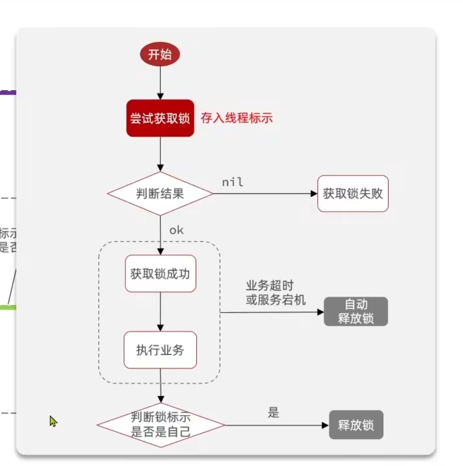

#### E.5解决Redis分布式锁的误删问题

```java
public class SimpleRedisLock implements ILock{
    private String name;
    private StringRedisTemplate stringRedisTemplate;
    private static final String KEY_PREFIX = "lock";
    @Override
    //获取锁
    public boolean tryLock(long timeoutSec){
        //获取线程标识
        long threadID = ID_PREFIX+Thread.currentThread().getId();
        //获取锁
        Boolean success = stringRedisTemplate.opsForValue().setIfAbsent(KEY_PREFIX+name,threadID+"",timeoutSec,TimeUnit.SECOND);
        return Boolean.TRUE.equals(success);//避免空指针问题
    }
    
    @Override
    //释放锁 -解决只看这里
    public void unlock(){
        //获取线程标识
String threadID = ID_PREFIX +Thread.currentThread().getID();
        //获取锁的uuid
        String id = stringRedisTemplate.opsForValue().get(KEY_PREFIX+name);
        //判断标识是否一致
        if(threadId.equals(id)){
            //释放锁
            stringRedisTemplate.delete(KEY_PREFIX+name);
        }
    }
}
```

#### E.6分布式锁的原子性问题

**原子性问题：**判断锁是否属于该线程是动作A 释放锁是动作B 如果动作A完成了 但是**线程阻塞** 导致动作B迟迟无法进行 就出现了分布式锁的原子性问题

> 在分布式系统中，锁是用来保证在多线程或多进程环境中，同一时刻只有一个线程或进程能够访问共享资源的机制。原子性问题指的是一个操作序列要么全部执行，要么全部不执行，不会出现部分执行的情况。在分布式锁的场景下，原子性问题尤为关键。
> 对于您提到的“判断锁是否属于该线程是动作A，释放锁是动作B”，这两个操作应当是原子的，即它们需要作为一个不可分割的操作来执行。如果动作A完成了，但是由于线程阻塞导致动作B无法进行，这就违反了原子性原则，可能会导致以下问题：
> 1. **死锁**：线程持有锁，但是由于阻塞未能释放，其他线程因此无法获取锁，导致系统部分功能阻塞。
> 2. **资源泄露**：锁未被释放，导致相关资源无法被其他线程或进程访问，降低了系统的资源利用率。
> 结合JVM的垃圾回收机制，我们可以从以下几个方面来分析这个问题：
> ### JVM垃圾回收与锁的关系
> 1. **对象生命周期**：
>    - 在Java中，锁通常是通过对象来实现的（例如，通过`synchronized`关键字或`ReentrantLock`类）。
>    - 当一个对象不再被任何存活线程引用时，它就成为了垃圾回收的候选对象。
>    - 如果一个线程因为阻塞未能释放锁，而这个锁是基于一个对象，那么这个对象将一直被线程引用，垃圾回收器无法回收它。
> 2. **线程阻塞**：
>    - 如果线程在持有锁的过程中被阻塞，比如等待IO操作，网络响应等，那么它持有的锁将不会释放。
>    - JVM的垃圾回收主要针对堆内存中的对象，而线程栈中的局部变量和锁信息不会直接影响垃圾回收。但是，如果线程栈中持有对象的引用，那么这个对象就不会被回收。
> ### 分析原子性问题
> 1. **线程阻塞与锁释放**：
>    - 如果线程在执行动作A之后阻塞，未能执行动作B，那么锁的释放操作将无法进行。
>    - JVM的垃圾回收器无法判断一个线程是否应该释放锁，这是程序的逻辑责任。
> 2. **解决方案**：
>    - 使用`try-finally`块确保锁一定会被释放，即使在发生异常或阻塞的情况下。
>    - ```java
>      Lock lock = ...;
>      try {
>          // 动作A：加锁操作
>          lock.lock();
>          // 执行临界区代码
>      } finally {
>          // 动作B：释放锁操作
>          lock.unlock();
>      }
>      ```
>    - 使用`java.util.concurrent`包下的锁，如`ReentrantLock`，它们提供了更加丰富的锁操作和更好的阻塞管理。
> 3. **垃圾回收考虑**：
>    - 确保不因为线程的长时间阻塞而影响垃圾回收。
>    - 合理设计对象的作用域和生命周期，避免不必要的长时间对象引用。
>    总之，分布式锁的原子性问题需要通过程序设计来确保操作的原子性，JVM的垃圾回收机制虽然不会直接导致原子性问题，但是程序的不当设计可能会导致资源无法被及时回收，从而影响系统的稳定性和性能。

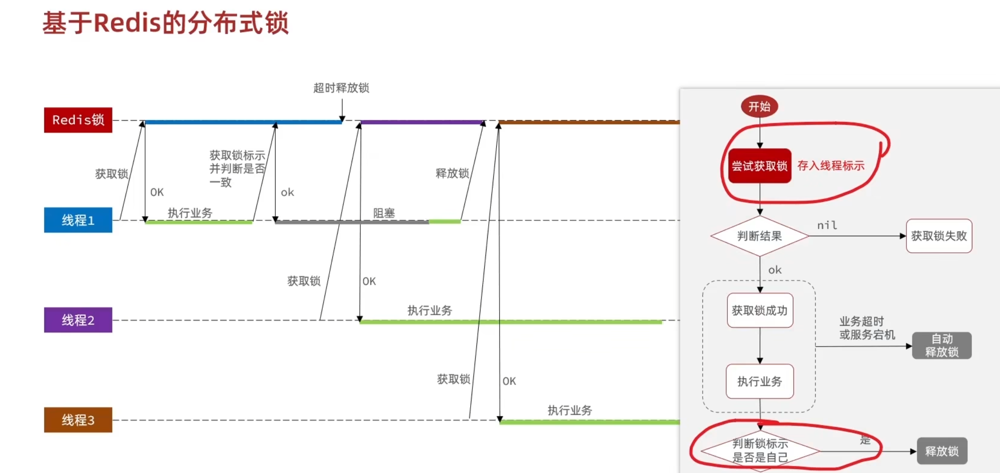

#### E.7LUA脚本解决多条命令原子性问题

> 看到操作原子性，就想到了事务。那如何在redis中实现事务呢？

##### E.7.1:LUA脚本到底是什么东西

###### A.Lua支持的数据类型

| 数据类型 | 描述                             |
| -------- | -------------------------------- |
| nil      | 无效值,条件表达式中的false       |
| boolean  | false和true两个返回值            |
| number   | 双精度类型的实浮点数             |
| function | c或者Lua语言编写的脚本           |
| userdata | 表示任意储存在变量中的C数据结构  |
| thread   | 线程                             |
| table    | 关联数组                         |
| string   | 字符串通过一串双引号和单引号围成 |

###### B.Lua变量

1. 变量使用前需要再代码中声明
2. 变量：全局变量，局部变量，表中的域
3. 默认变量都是全局变量，在语句块和函数里也是全局变量。除非用local显式声明为局部变量
4. 变量默认值均为nil

```lua
a = 5 --全局变量
local b = 5 --局部变量

function joke()
    c = 5 --全局变量
    local d = 6 --局部变量
end

joke()
print(c,d) ->5 nil

do
    local a = 6 --局部变量
    b=6 --对局部变量重新赋值
    print(a,b) --6 6
end

arr_Table = {'teste','tedad',1}
print(arr_Table)
```

###### C.流程控制与循环

```lua
while(true)
do
    print("循环永远进行 do和end构成循环体")
end
```

```lua
--[Lua中0是true的意思]
local a = 10
if a<10 then
    print("a小于10")
elseif a<20 then
    print('a<20 >=10')
else
    print("a大于等于20")
end;
```

```lua
local arr = {1,2,name='felord.cn'}
for i,v in ipairs(arr) do
    print("i="..i)
    print("v="..v)
end
```

###### D.在Redis中使用Lua脚本

```lua
eval luascript numskey key [key...] args [arg]
--EVAL 命令的关键字。
--------luascript Lua 脚本。
------numkeys 指定的Lua脚本需要处理键的数量，其实就是 key数组的长度。
----key 传递给Lua脚本零到多个键，空格隔开，在Lua 脚本中通过 KEYS[INDEX]来获取对应的--值，其中1 <= INDEX <= numkeys。
--arg是传递给脚本的零到多个附加参数，空格隔开，在Lua脚本中通过ARGV[INDEX]来获取对应的值，其中1 <= INDEX <= numkeys。
```

```lua
set hello world --ok
get hello -- hello
EVAL "return redis.call('GET',KEYS[1])" -- 1 hello world
```

> ### call函数和pcall函数
>
> 在上面的例子中我们通过`redis.call()`来执行了一个`SET`命令，其实我们也可以替换为`redis.pcall()`。它们唯一的区别就在于处理错误的方式，前者执行命令错误时会向调用者直接返回一个错误；而后者则会将错误包装为一个我们上面讲的`table`表格：
>
> ```bash
> 127.0.0.1:6379> EVAL "return redis.call('no_command')" 0
> (error) ERR Error running script (call to f_1e6efd00ab50dd564a9f13e5775e27b966c2141e): @user_script:1: @user_script: 1: Unknown Redis command called from Lua script
> 127.0.0.1:6379> EVAL "return redis.pcall('no_command')" 0
> (error) @user_script: 1: Unknown Redis command called from Lua script
> ```
>
> 这就像Java遇到一个异常，前者会直接抛出一个异常；后者会把异常处理成JSON返回。

##### E.7.2真实Redis案例

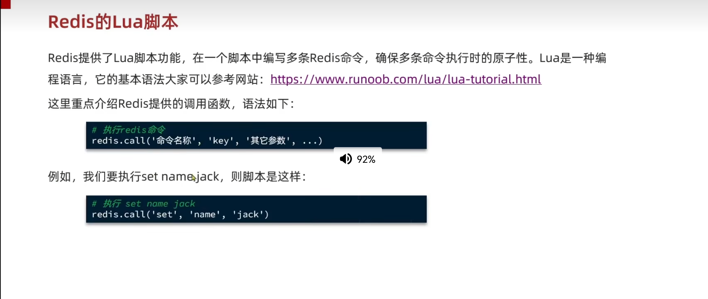

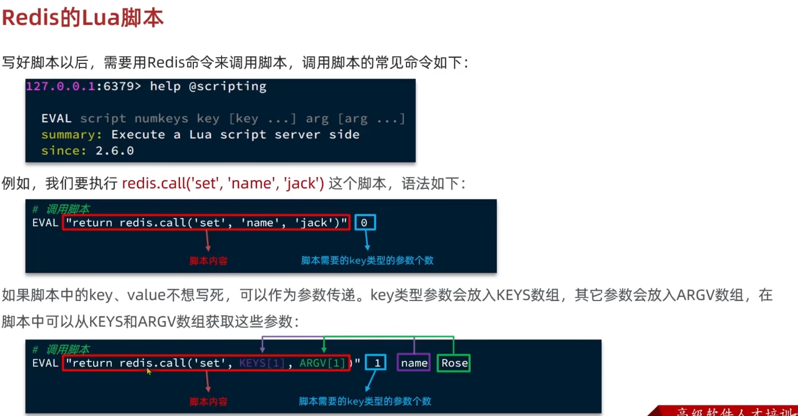

**如果用lua解决误删锁问题，如下表达**：

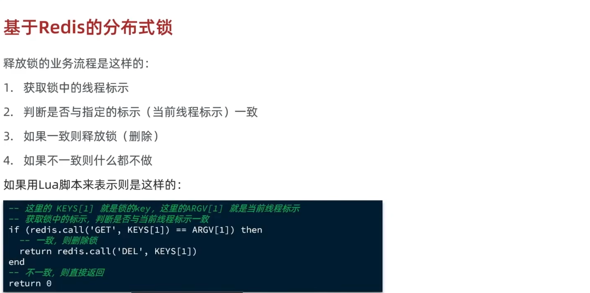

#### E.8Java调用LUA脚本改造分布式锁

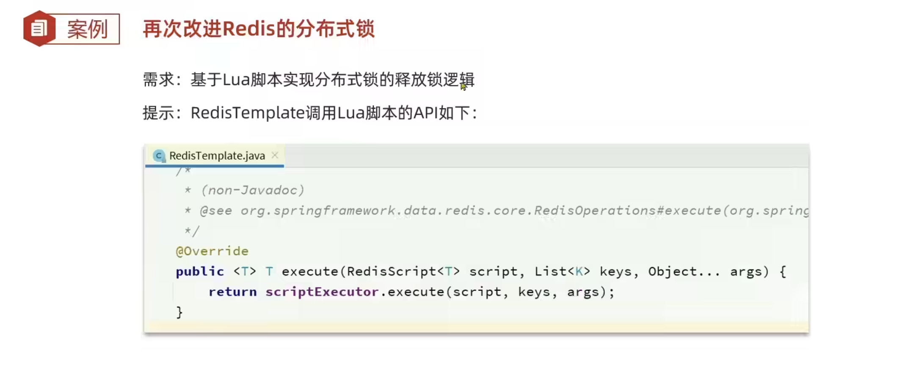

```java
    private static final DefaultRedisScript<Long> UNLOCK_SCRIPT;
    static {
        UNLOCK_SCRIPT = new DefaultRedisScript<>();
        UNLOCK_SCRIPT.setLocation(new ClassPathResource("unlock.lua"));
        UNLOCK_SCRIPT.setResultType(Long.class);
    }
/**
     * 使用lua脚本释放锁，不存在原子性问题
     */
    @Override
    public void unlock() {
        // 调用lua脚本
        stringRedisTemplate.execute(
                UNLOCK_SCRIPT,
                Collections.singletonList(KEY_PREFIX + lockName),
                ID_PREFIX + Thread.currentThread().getId());
    }
```

#### E.9Redisson功能介绍

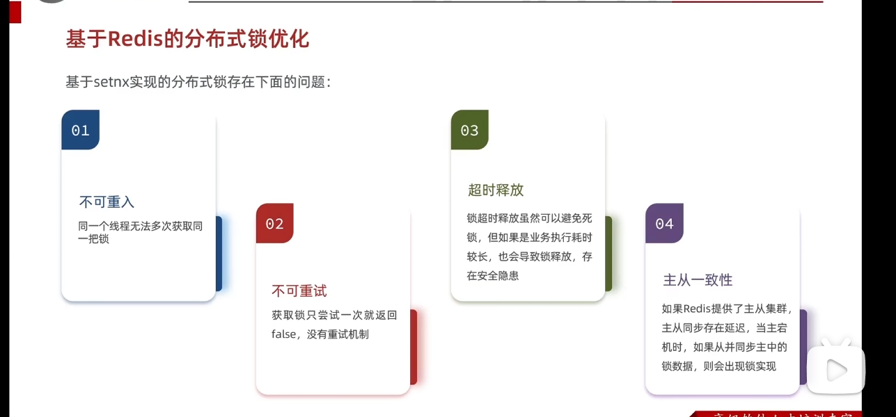

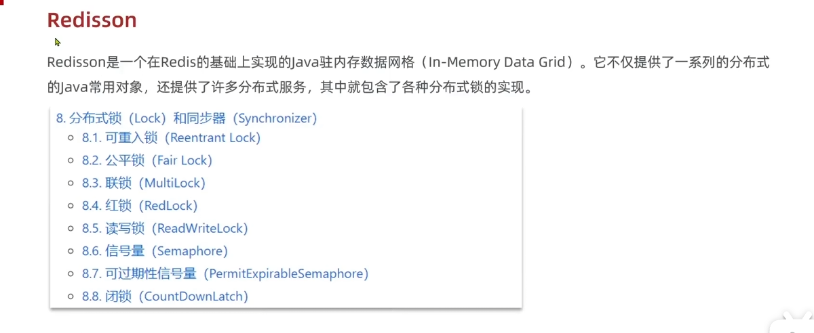

#### E.10Redisson快速入门

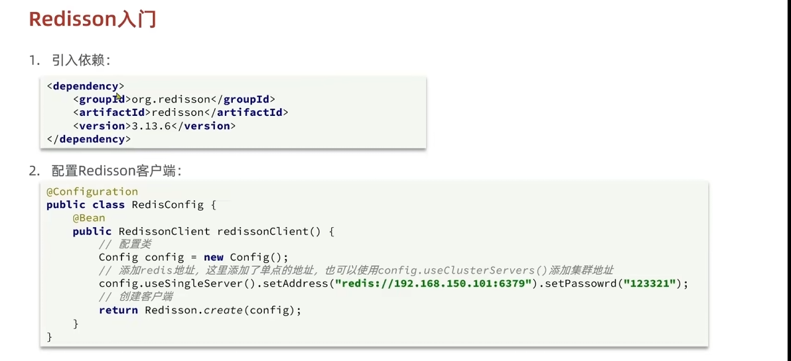

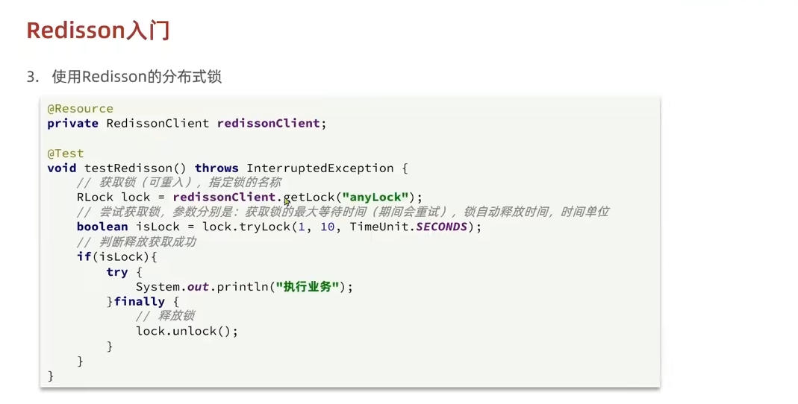

#### E.11Redisson的可重入原理(RedissonLock+trycatch的finally释放锁)

> 在Spring Boot中使用Redisson的可重入锁，我们可以编写一个服务方法，该方法包含一些业务逻辑，并确保在同一个线程中可以多次安全地调用该方法。以下是如何实现并体现业务逻辑可重入性的代码示例。
> ### 步骤 1: 添加Redisson依赖
> 确保在`pom.xml`中添加了Redisson的依赖。
> ```xml
> <!-- Maven dependency -->
> <dependency>
>     <groupId>org.redisson</groupId>
>     <artifactId>redisson</artifactId>
>     <version>3.16.6</version>
> </dependency>
> ```
> ### 步骤 2: 配置RedissonClient
> 在Spring Boot配置类中创建`RedissonClient`的Bean。
> ```java
> import org.redisson.Redisson;
> import org.redisson.api.RedissonClient;
> import org.redisson.config.Config;
> import org.springframework.context.annotation.Bean;
> import org.springframework.context.annotation.Configuration;
> @Configuration
> public class RedissonConfig {
>     @Bean
>     public RedissonClient redissonClient() {
>         Config config = new Config();
>         config.useSingleServer().setAddress("redis://127.0.0.1:6379");
>         return Redisson.create(config);
>     }
> }
> ```
> ### 步骤 3: 实现业务逻辑的可重入性
> 以下是一个服务类，它包含一个使用Redisson可重入锁的业务方法。
> ```java
> import org.redisson.api.RLock;
> import org.redisson.api.RedissonClient;
> import org.springframework.beans.factory.annotation.Autowired;
> import org.springframework.stereotype.Service;
> @Service
> public class BusinessService {
>     @Autowired
>     private RedissonClient redissonClient;
>     public void performBusinessLogicWithReentrantLock() {
>         RLock lock = redissonClient.getLock("businessLock");
>         try {
>             // 获取锁，可重入
>             lock.lock();
>             try {
>                 // 执行业务逻辑
>                 System.out.println("Performing business logic with lock");
>                 // 假设业务逻辑需要调用另一个方法，该方法也需要同样的锁
>                 performNestedBusinessLogic();
>             } finally {
>                 // 释放锁
>                 lock.unlock();
>             }
>         } catch (Exception e) {
>             // 处理异常
>         }
>     }
>     private void performNestedBusinessLogic() {
>         RLock lock = redissonClient.getLock("businessLock");
>         try {
>             // 由于锁是可重入的，同一个线程可以再次获取锁
>             lock.lock();
>             try {
>                 // 执行嵌套的业务逻辑
>                 System.out.println("Performing nested business logic with the same lock");
>             } finally {
>                 // 释放锁
>                 lock.unlock();
>             }
>         } catch (Exception e) {
>             // 处理异常
>         }
>     }
> }
> ```
> 在上述代码中，`performBusinessLogicWithReentrantLock` 方法首先获取一个名为 "businessLock" 的锁，然后执行一些业务逻辑。在业务逻辑中，它调用了 `performNestedBusinessLogic` 方法，该方法也需要获取同一个锁。由于Redisson的可重入锁特性，即使锁已经被当前线程持有，`performNestedBusinessLogic` 方法也能够成功获取锁，从而执行嵌套的业务逻辑。
> ### 总结
> 可重入锁（Reentrant Lock）通常是通过`try`-`catch`块中的`finally`子句来确保锁的释放的。这是Java中的一种常见模式，用于确保即使在发生异常的情况下，锁也能被正确释放，避免死锁的发生。
> 以下是一个使用Java内置的可重入锁`ReentrantLock`的示例，展示了这种模式：
>
> ```java
> import java.util.concurrent.locks.ReentrantLock;
> public class ReentrantLockExample {
>     private final ReentrantLock lock = new ReentrantLock();
>     public void doBusinessLogic() {
>         lock.lock(); // 获取锁
>         try {
>             // 执行业务逻辑
>         } finally {
>             lock.unlock(); // 在finally块中释放锁
>         }
>     }
> }
> ```
> 在这个例子中，`lock.lock()`用于获取锁，而`lock.unlock()`用于释放锁。将解锁操作放在`finally`块中，可以确保即使在执行业务逻辑时抛出异常，锁也会被释放。
> 同样的模式也适用于Redisson的可重入锁。以下是一个使用Redisson的`RLock`的示例：
> ```java
> import org.redisson.api.RLock;
> import org.redisson.api.RedissonClient;
> public class RedissonReentrantLockExample {
>     private final RedissonClient redissonClient;
>     public RedissonReentrantLockExample(RedissonClient redissonClient) {
>         this.redissonClient = redissonClient;
>     }
>     public void doBusinessLogic() {
>         RLock lock = redissonClient.getLock("myLock");
>         lock.lock(); // 获取锁
>         try {
>             // 执行业务逻辑
>         } finally {
>             lock.unlock(); // 在finally块中释放锁
>         }
>     }
> }
> ```
> 在上述Redisson的示例中，我们通过`redissonClient.getLock("myLock")`获取一个名为"myLock"的锁，然后通过`lock.lock()`来获取锁，并在`finally`块中通过`lock.unlock()`来释放锁。这种方式确保了即使在执行业务逻辑时发生异常，锁也会被正确释放。
> 总之，无论是在使用Java内置的`ReentrantLock`还是Redisson的`RLock`时，都应该在`finally`块中释放锁，以确保资源被正确地清理，避免潜在的死锁问题。

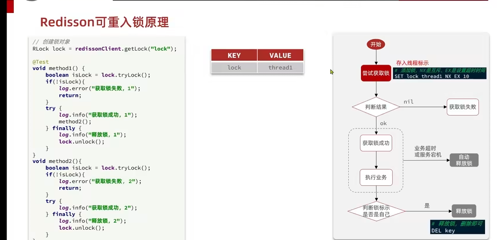

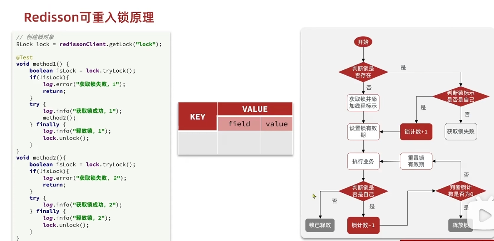

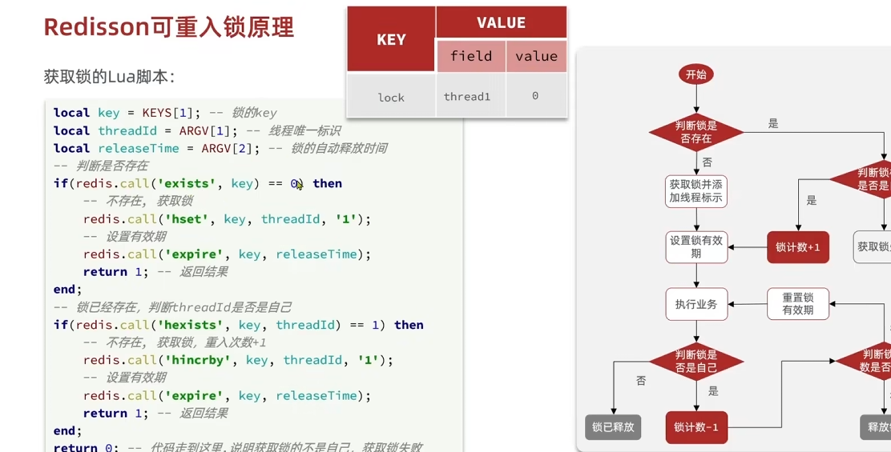

#### E.12Redisson的锁重试和WatchDog机制

> 在Spring Boot中引入Redisson，通常是通过添加Redisson的依赖和配置Redisson的配置文件来完成的。下面将分析Redisson的锁重试和WatchDog（看门狗）机制，并结合Spring Boot的使用场景。
> ### 锁重试机制
> Redisson的锁重试机制允许在尝试获取锁失败时，自动进行重试。这可以通过`tryLock`方法来实现，它有几个重载版本，允许你指定尝试获取锁的最大等待时间以及锁的自动释放时间。
> 在Spring Boot中，你可以在配置类中创建一个`RedissonClient`的Bean，并在需要的地方注入使用。
> 以下是如何在Spring Boot中配置RedissonClient并使用锁重试机制的示例：
> ```java
> import org.redisson.Redisson;
> import org.redisson.api.RedissonClient;
> import org.redisson.config.Config;
> import org.springframework.context.annotation.Bean;
> import org.springframework.context.annotation.Configuration;
> @Configuration
> public class RedissonConfig {
>     @Bean
>     public RedissonClient redissonClient() {
>         Config config = new Config();
>         // 配置Redis服务节点
>         config.useSingleServer().setAddress("redis://127.0.0.1:6379");
>         // 其他配置...
>         return Redisson.create(config);
>     }
> }
> // 使用锁重试机制
> import org.redisson.api.RLock;
> import org.springframework.beans.factory.annotation.Autowired;
> import org.springframework.stereotype.Service;
> @Service
> public class RedissonLockService {
>     @Autowired
>     private RedissonClient redissonClient;
>     public void doSomethingWithRetry() {
>         RLock lock = redissonClient.getLock("anyLock");
>         try {
>             // 尝试获取锁，最多等待100秒，锁定后自动解锁时间10秒
>             boolean isLocked = lock.tryLock(100, 10, TimeUnit.SECONDS);
>             if (isLocked) {
>                 try {
>                     // 执行业务逻辑
>                 } finally {
>                     // 释放锁
>                     lock.unlock();
>                 }
>             }
>         } catch (InterruptedException e) {
>             Thread.currentThread().interrupt();
>         }
>     }
> }
> ```
> ### WatchDog（看门狗）机制
> Redisson的WatchDog（看门狗）机制是一个自动延长锁租期的功能。当使用Redisson的`lock`方法获取锁时，如果锁没有在指定的租期内被释放，看门狗会自动延长锁的租期。
> 默认情况下，看门狗的续租周期是30秒（这个时间可以通过配置来修改）。当锁被持有且线程仍然在执行任务时，看门狗会每隔一段时间检查锁的存在，并在锁到期之前自动延长租期。
> 在Spring Boot中，看门狗机制是自动启用的，不需要额外的配置。以下是如何在Spring Boot中使用看门狗机制的示例：
> ```java
> @Service
> public class RedissonLockService {
>     @Autowired
>     private RedissonClient redissonClient;
>     public void doSomethingWithWatchdog() {
>         RLock lock = redissonClient.getLock("anyLock");
>         try {
>             // 获取锁，如果没有指定锁租期，则默认使用看门狗机制
>             lock.lock();
>             try {
>                 // 执行业务逻辑
>             } finally {
>                 // 释放锁，看门狗机制会停止续租
>                 lock.unlock();
>             }
>         } catch (Exception e) {
>             // 处理异常
>         }
>     }
> }
> ```
> 在这个例子中，`lock.lock()`会获取锁并启动看门狗机制。如果在执行业务逻辑期间锁没有释放，看门狗会自动续租，确保锁不会在任务完成之前过期。
> 总结来说，Redisson的锁重试机制和WatchDog机制提供了强大的锁管理功能，可以很好地集成到Spring Boot应用程序中，用于处理分布式环境下的同步问题。

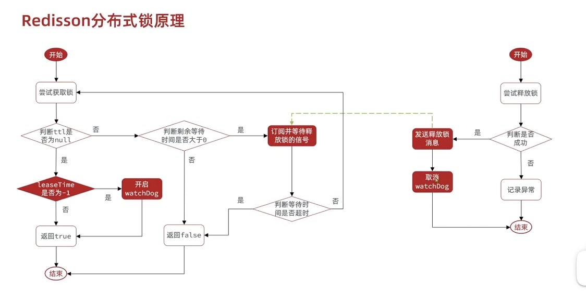

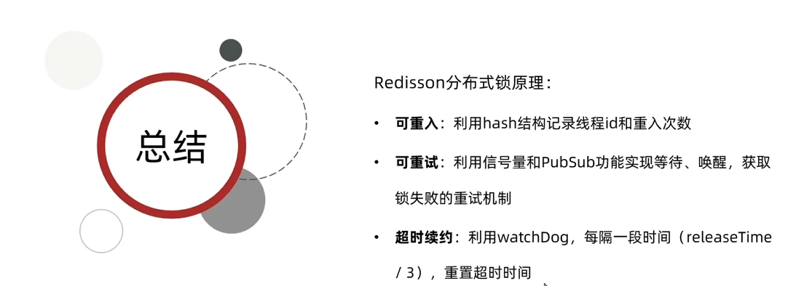

#### E.13Redisson的multiLock原理

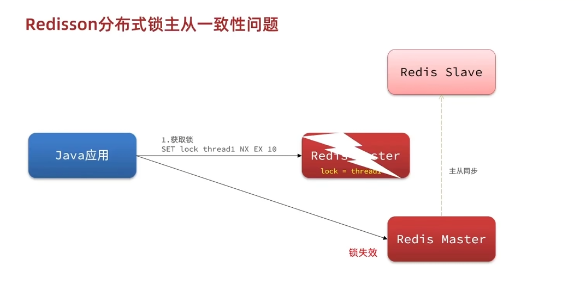

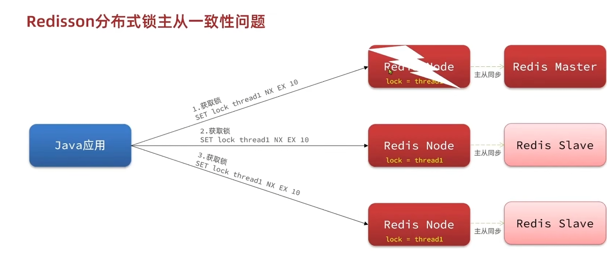

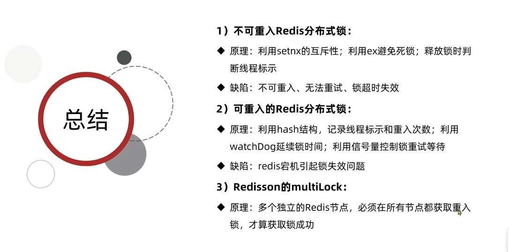

> 在Spring Boot中引入Redisson，你可以利用其提供的`RedissonMultiLock`来实现跨多个资源的分布式锁。`RedissonMultiLock`允许你将多个锁组合为一个逻辑锁，确保在所有指定的资源上都获得锁之后才执行临界区代码。
> 以下是如何在Spring Boot中配置Redisson并使用`RedissonMultiLock`的步骤：
> ### 步骤 1: 添加Redisson依赖
> 首先，你需要在你的`pom.xml`或`build.gradle`文件中添加Redisson的依赖。
> ```xml
> <!-- Maven dependency -->
> <dependency>
>     <groupId>org.redisson</groupId>
>     <artifactId>redisson</artifactId>
>     <version>3.16.6</version>
> </dependency>
> ```
> ### 步骤 2: 配置RedissonClient
> 在Spring Boot配置类中创建一个`RedissonClient`的Bean。
> ```java
> import org.redisson.Redisson;
> import org.redisson.api.RedissonClient;
> import org.redisson.config.Config;
> import org.springframework.context.annotation.Bean;
> import org.springframework.context.annotation.Configuration;
> @Configuration
> public class RedissonConfig {
>     @Bean
>     public RedissonClient redissonClient() {
>         Config config = new Config();
>         // 配置Redis服务节点
>         config.useSingleServer().setAddress("redis://127.0.0.1:6379");
>         // 可以添加更多节点
>         // config.useSingleServer().setAddress("redis://127.0.0.1:6380");
>         return Redisson.create(config);
>     }
> }
> ```
> ### 步骤 3: 使用RedissonMultiLock
> 在你的服务类中，你可以注入`RedissonClient`并使用它来创建`RedissonMultiLock`。
> ```java
> import org.redisson.api.RLock;
> import org.redisson.api.RedissonClient;
> import org.springframework.beans.factory.annotation.Autowired;
> import org.springframework.stereotype.Service;
> @Service
> public class MultiLockService {
>     @Autowired
>     private RedissonClient redissonClient;
>     public void doSomethingWithMultiLock() {
>         // 创建多个RLock对象
>         RLock lock1 = redissonClient.getLock("lock1");
>         RLock lock2 = redissonClient.getLock("lock2");
>         // 可以根据需要添加更多的锁
>         // 创建multiLock
>         RLock multiLock = redissonClient.getMultiLock(lock1, lock2);
>         try {
>             // 尝试获取multiLock，设置最大等待时间和自动解锁时间
>             boolean isLocked = multiLock.tryLock(5, 10, TimeUnit.SECONDS);
>             if (isLocked) {
>                 try {
>                     // 执行业务逻辑
>                 } finally {
>                     // 释放锁
>                     multiLock.unlock();
>                 }
>             }
>         } catch (InterruptedException e) {
>             // 当前线程在等待获取锁时被中断
>             Thread.currentThread().interrupt();
>         }
>     }
> }
> ```
> 在上述代码中，我们首先创建了两个`RLock`对象，然后使用`RedissonClient.getMultiLock`方法将它们组合成`RedissonMultiLock`。我们使用`tryLock`方法尝试获取锁，如果成功，则执行业务逻辑，并在执行完毕后释放锁。
> ### 分析RedissonMultiLock
> - **锁的获取**：`RedissonMultiLock`会尝试在所有指定的锁上获取锁。只有当所有锁都成功获取时，`RedissonMultiLock`才被视为获取成功。
> - **容错性**：由于`RedissonMultiLock`在多个资源上获取锁，即使某些Redis节点失败，只要大多数节点正常，锁仍然可以工作。
> - **锁的释放**：当释放`RedissonMultiLock`时，所有之前成功加锁的Redis节点上的锁都会被释放。
> - **锁的租约**：和单个`RLock`一样，`RedissonMultiLock`也有租约时间，以防止死锁。
> 通过这种方式，`RedissonMultiLock`在分布式系统中提供了更高级别的数据一致性和可靠性。


### F.Redis秒杀优化

#### F.1异步秒杀思路

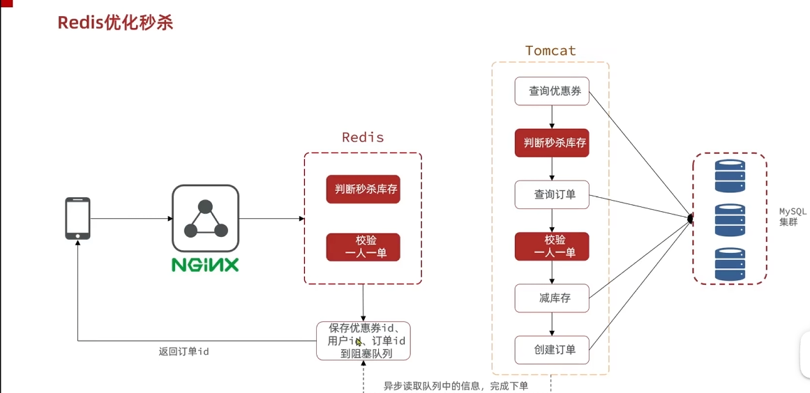

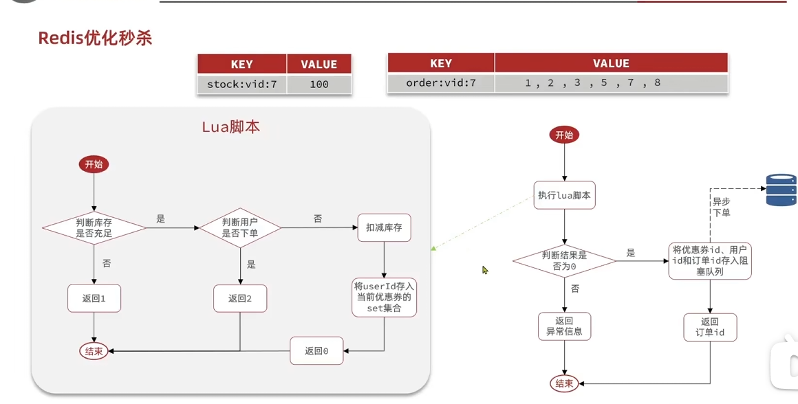

#### F.2基于Redis实现秒杀

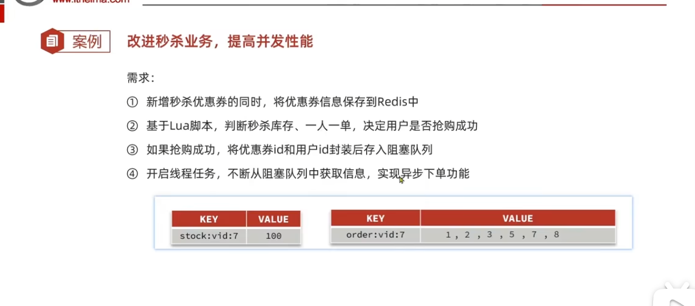

> 在Spring Boot项目中实现基于Redis的秒杀优惠券业务，可以按照以下步骤进行：
> ### 1. 添加依赖
> 在`pom.xml`中添加Spring Boot与Redis的依赖：
> ```xml
> <dependencies>
>     <!-- Spring Boot Redis -->
>     <dependency>
>         <groupId>org.springframework.boot</groupId>
>         <artifactId>spring-boot-starter-data-redis</artifactId>
>     </dependency>
>     <!-- 其他依赖，如Web、数据库等 -->
> </dependencies>
> ```
> ### 2. 配置Redis
> 在`application.properties`或`application.yml`中配置Redis：
> ```properties
> # application.properties
> spring.redis.host=localhost
> spring.redis.port=6379
> spring.redis.password= # 如果有密码的话
> ```
> ### 3. Redis配置类
> 创建Redis配置类，用于配置RedisTemplate等：
> ```java
> import org.springframework.context.annotation.Bean;
> import org.springframework.context.annotation.Configuration;
> import org.springframework.data.redis.connection.RedisConnectionFactory;
> import org.springframework.data.redis.core.RedisTemplate;
> import org.springframework.data.redis.serializer.GenericJackson2JsonRedisSerializer;
> import org.springframework.data.redis.serializer.StringRedisSerializer;
> @Configuration
> public class RedisConfig {
>     @Bean
>     public RedisTemplate<String, Object> redisTemplate(RedisConnectionFactory factory) {
>         RedisTemplate<String, Object> template = new RedisTemplate<>();
>         template.setConnectionFactory(factory);
>         template.setKeySerializer(new StringRedisSerializer());
>         template.setValueSerializer(new GenericJackson2JsonRedisSerializer());
>         template.setHashKeySerializer(new StringRedisSerializer());
>         template.setHashValueSerializer(new GenericJackson2JsonRedisSerializer());
>         return template;
>     }
> }
> ```
> ### 4. 秒杀服务
> 创建秒杀服务类，实现秒杀逻辑：
> ```java
> import org.springframework.beans.factory.annotation.Autowired;
> import org.springframework.data.redis.core.RedisTemplate;
> import org.springframework.stereotype.Service;
> @Service
> public class SeckillService {
>     @Autowired
>     private RedisTemplate<String, Object> redisTemplate;
>     // 秒杀方法
>     public boolean seckill(String couponId, String userId) {
>         // Lua脚本
>         String script = 
>             "if redis.call('get', KEYS[1]) >= tonumber(ARGV[1]) then " +
>             "   redis.call('decrby', KEYS[1], ARGV[1]) " +
>             "   return 1 " +
>             "else " +
>             "   return 0 " +
>             "end";
>         
>         // 参数
>         String key = "coupond_stock:" + couponId;
>         long quantity = 1;
>         // 执行Lua脚本
>         Long result = (Long) redisTemplate.execute((RedisCallback<Object>) connection -> {
>             return connection.eval(script.getBytes(), ReturnType.INTEGER, 1, key.getBytes(), String.valueOf(quantity).getBytes());
>         });
>         // 判断结果
>         if (result != null && result == 1) {
>             // 秒杀成功，将用户ID添加到已秒杀用户集合中
>             redisTemplate.opsForSet().add("coupond_users:" + couponId, userId);
>             return true;
>         } else {
>             // 秒杀失败
>             return false;
>         }
>     }
> }
> ```
> ### 5. 控制器
> 创建控制器类，提供秒杀接口：
> ```java
> import org.springframework.beans.factory.annotation.Autowired;
> import org.springframework.web.bind.annotation.GetMapping;
> import org.springframework.web.bind.annotation.RequestParam;
> import org.springframework.web.bind.annotation.RestController;
> @RestController
> public class SeckillController {
>     @Autowired
>     private SeckillService seckillService;
>     @GetMapping("/seckill")
>     public String seckill(@RequestParam String couponId, @RequestParam String userId) {
>         boolean success = seckillService.seckill(couponId, userId);
>         return success ? "秒杀成功" : "秒杀失败，库存不足";
>     }
> }
> ```
> ### 6. 异常处理
> 添加异常处理机制，处理可能的运行时异常：
> ```java
> import org.springframework.web.bind.annotation.ExceptionHandler;
> import org.springframework.web.bind.annotation.RestControllerAdvice;
> @RestControllerAdvice
> public class GlobalExceptionHandler {
>     @ExceptionHandler(Exception.class)
>     public String handleException(Exception e) {
>         // 日志记录异常信息
>         // 返回友好的错误信息
>         return "系统繁忙，请稍后再试";
>     }
> }
> ```
> ### 7. 测试
> 启动Spring Boot应用，并通过接口进行测试。
> 以上是基于Redis在Spring Boot项目中实现秒杀优惠券业务的一个简单示例。实际项目中可能需要考虑更多的异常处理、安全校验、性能优化等问题。

#### F.3基于阻塞队列实现秒杀

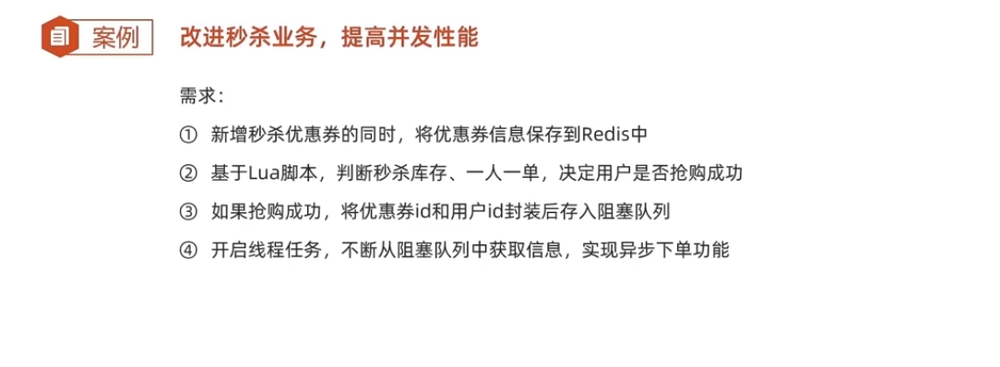

> 在Spring Boot项目中，使用阻塞队列实现秒杀优惠券业务可以有效地处理高并发请求，并且可以避免直接对数据库进行高频次的读写操作。以下是实现步骤：
> ### 1. 添加依赖
> 首先，确保Spring Boot项目中包含必要的依赖。
> ```xml
> <!-- Spring Boot Web Starter -->
> <dependency>
>     <groupId>org.springframework.boot</groupId>
>     <artifactId>spring-boot-starter-web</artifactId>
> </dependency>
> <!-- Spring Boot Data JPA Starter -->
> <dependency>
>     <groupId>org.springframework.boot</groupId>
>     <artifactId>spring-boot-starter-data-jpa</artifactId>
> </dependency>
> <!-- 数据库驱动，例如MySQL -->
> <dependency>
>     <groupId>mysql</groupId>
>     <artifactId>mysql-connector-java</artifactId>
>     <scope>runtime</scope>
> </dependency>
> ```
> ### 2. 数据库模型
> 定义优惠券的实体类和相应的Repository。
> ```java
> @Entity
> public class Coupon {
>     @Id
>     @GeneratedValue(strategy = GenerationType.IDENTITY)
>     private Long id;
>     private String couponCode;
>     private int stock; // 库存
>     // 省略getter和setter方法
> }
> public interface CouponRepository extends JpaRepository<Coupon, Long> {
>     // 可以添加自定义的查询方法
> }
> ```
> ### 3. 阻塞队列配置
> 定义一个阻塞队列，用于存储秒杀请求。
> ```java
> import org.springframework.context.annotation.Bean;
> import org.springframework.context.annotation.Configuration;
> import java.util.concurrent.ArrayBlockingQueue;
> import java.util.concurrent.BlockingQueue;
> @Configuration
> public class QueueConfig {
>     @Bean
>     public BlockingQueue<Coupon> seckillQueue() {
>         return new ArrayBlockingQueue<>(1000); // 假设队列大小为1000
>     }
> }
> ```
> ### 4. 秒杀服务
> 创建秒杀服务类，包含秒杀逻辑。
> ```java
> import org.springframework.beans.factory.annotation.Autowired;
> import org.springframework.stereotype.Service;
> import java.util.concurrent.BlockingQueue;
> @Service
> public class SeckillService {
>     @Autowired
>     private CouponRepository couponRepository;
>     @Autowired
>     private BlockingQueue<Coupon> seckillQueue;
>     // 秒杀方法，将请求放入队列
>     public boolean addToSeckillQueue(Long couponId) {
>         Coupon coupon = couponRepository.findById(couponId).orElse(null);
>         if (coupon != null && coupon.getStock() > 0) {
>             try {
>                 seckillQueue.put(coupon);
>                 return true;
>             } catch (InterruptedException e) {
>                 Thread.currentThread().interrupt();
>                 return false;
>             }
>         }
>         return false;
>     }
>     // 从队列中处理秒杀请求
>     public void processSeckillQueue() {
>         new Thread(() -> {
>             while (true) {
>                 try {
>                     Coupon coupon = seckillQueue.take();
>                     // 这里可以进行库存扣减逻辑，并更新数据库
>                     if (coupon.getStock() > 0) {
>                         coupon.setStock(coupon.getStock() - 1);
>                         couponRepository.save(coupon);
>                         // 这里可以记录用户秒杀成功的操作
>                     }
>                 } catch (InterruptedException e) {
>                     Thread.currentThread().interrupt();
>                     break;
>                 }
>             }
>         }).start();
>     }
> }
> ```
> ### 5. 控制器
> 创建控制器类，提供秒杀接口。
> ```java
> import org.springframework.beans.factory.annotation.Autowired;
> import org.springframework.web.bind.annotation.GetMapping;
> import org.springframework.web.bind.annotation.PathVariable;
> import org.springframework.web.bind.annotation.RestController;
> @RestController
> public class SeckillController {
>     @Autowired
>     private SeckillService seckillService;
>     @GetMapping("/seckill/{couponId}")
>     public String seckill(@PathVariable Long couponId) {
>         boolean success = seckillService.addToSeckillQueue(couponId);
>         return success ? "秒杀请求已加入队列" : "秒杀失败，库存不足或请求已满";
>     }
> }
> ```
> ### 6. 启动类
> 在启动类中调用处理秒杀队列的方法。
> ```java
> import org.springframework.beans.factory.annotation.Autowired;
> import org.springframework.boot.SpringApplication;
> import org.springframework.boot.autoconfigure.SpringBootApplication;
> @SpringBootApplication
> public class SeckillApplication {
>     public static void main(String[] args) {
>         SpringApplication.run(SeckillApplication.class, args);
>     }
>     @Autowired
>     private SeckillService seckillService;
>     // 启动时开启秒杀处理线程
>     public void run(String... args) throws Exception {
>         seckillService.processSeckillQueue();
>     }
> }
> ```
> 这样，当秒杀请求到达时，它们将被放入阻塞队列中，并由一个单独的线程进行处理。这个方法能够有效地减轻数据库的压力，并且能够处理一定程度的并发请求。当然，这个示例是简化的，实际应用中还需要考虑更多细节，如错误处理、事务管理、用户身份验证等。

### G.Redis消息队列实现异步秒杀

#### G.1认识消息队列

**1.RabbitMQ**

- **特色**：
  - 基于Erlang语言开发，性能稳定。
  - 支持多种消息协议，如AMQP、STOMP等。
  - 提供灵活的路由功能。
  - 有完善的文档和社区支持。
  - 支持消息的持久化、事务以及事务的回滚。
- **劣势**：
  - **集群模式**相对**复杂**。
  - 在**吞吐量方面不如**某些其他消息队列系统。

**2.Apache Kafka**

- **特色**：
  - **高吞吐量**，适用于大数据场景。
  - 支持分布式系统，可横向扩展。
  - 数据持久化，可通过保留策略来控制数据存储时间。
  - 支持流处理，与Apache Storm和Spark等集成良好。
- **劣势**：
  - 消息的**可靠性相对较低**（尤其是在高吞吐场景下）。
  - 管理和配置相对复杂。

**3.RocketMQ**

- **特色**：
  - **高性能、低延迟。**
  - 强大的消息堆积能力。
  - 社区由阿里巴巴支持，适用于大型分布式系统。
- **劣势**：
  - 相对于其他消息队列，RocketMQ的**社区较小。**
  - 文档和支持相对较少。

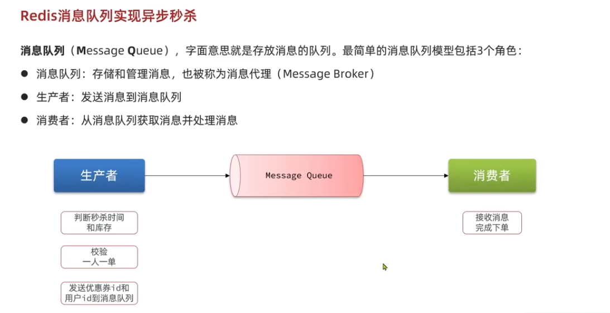

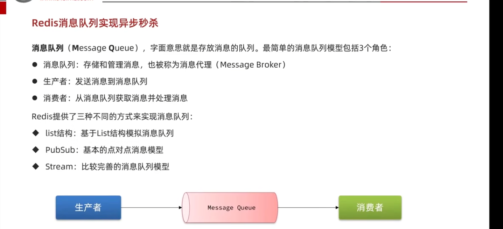

> 
>
> 在Spring Boot项目中，使用G.Redis（即基于Redis的分布式消息队列）实现秒杀优惠券业务，可以采用Redis的发布/订阅功能作为消息队列。以下是实现步骤：
>
> ### 1. 添加依赖
> 首先，确保Spring Boot项目中包含Redis的依赖。
> ```xml
> <!-- Spring Boot Redis Starter -->
> <dependency>
>     <groupId>org.springframework.boot</groupId>
>     <artifactId>spring-boot-starter-data-redis</artifactId>
> </dependency>
> <!-- Spring Boot Web Starter -->
> <dependency>
>     <groupId>org.springframework.boot</groupId>
>     <artifactId>spring-boot-starter-web</artifactId>
> </dependency>
> <!-- Spring Boot Data JPA Starter -->
> <dependency>
>     <groupId>org.springframework.boot</groupId>
>     <artifactId>spring-boot-starter-data-jpa</artifactId>
> </dependency>
> <!-- 数据库驱动，例如MySQL -->
> <dependency>
>     <groupId>mysql</groupId>
>     <artifactId>mysql-connector-java</artifactId>
>     <scope>runtime</scope>
> </dependency>
> ```
> ### 2. 配置Redis
> 在`application.properties`或`application.yml`中配置Redis。
> ```properties
> # application.properties
> spring.redis.host=localhost
> spring.redis.port=6379
> spring.redis.password= # 如果有密码的话
> ```
> ### 3. 数据库模型
> 定义优惠券的实体类和相应的Repository。
> ```java
> @Entity
> public class Coupon {
>     @Id
>     @GeneratedValue(strategy = GenerationType.IDENTITY)
>     private Long id;
>     private String couponCode;
>     private int stock; // 库存
>     // 省略getter和setter方法
> }
> public interface CouponRepository extends JpaRepository<Coupon, Long> {
>     // 可以添加自定义的查询方法
> }
> ```
> ### 4. Redis消息监听器
> 创建一个Redis消息监听器来处理消息队列中的秒杀请求。
> ```java
> import org.springframework.beans.factory.annotation.Autowired;
> import org.springframework.data.redis.connection.Message;
> import org.springframework.data.redis.connection.MessageListener;
> import org.springframework.data.redis.core.RedisTemplate;
> import org.springframework.stereotype.Service;
> import org.springframework.transaction.annotation.Transactional;
> 
> import javax.annotation.PostConstruct;
> 
> @Service
> public class RedisMessageListener implements MessageListener {
> 
>     @Autowired
>     private CouponRepository couponRepository;
> 
>     @Autowired
>     private RedisTemplate<String, String> redisTemplate;
> 
>     @Override
>     @Transactional
>     public void onMessage(Message message, byte[] pattern) {
>         try {
>             // 获取消息内容
>             String couponIdStr = new String(message.getBody());
>             Long couponId = Long.parseLong(couponIdStr);
> 
>             // 执行秒杀逻辑
>             Coupon coupon = couponRepository.findByIdForUpdate(couponId).orElse(null); // 使用行锁
>             if (coupon != null && coupon.getStock() > 0) {
>                 coupon.setStock(coupon.getStock() - 1);
>                 couponRepository.save(coupon);
>                 // 这里可以记录用户秒杀成功的操作
>             }
>         } catch (Exception e) {
>             // 日志记录异常信息
>             // 可以使用日志框架，例如：log.error("处理Redis消息时发生异常", e);
>         }
>     }
> 
>     // 如果需要初始化操作，可以在这里添加
>     @PostConstruct
>     public void init() {
>         // 初始化操作，例如设置Redis消息监听器等
>     }
> }
> 
> ```
> ### 5. Redis消息发布者
> 创建一个服务类，用于发布秒杀请求到Redis消息队列。
> ```java
> import org.springframework.beans.factory.annotation.Autowired;
> import org.springframework.data.redis.core.RedisTemplate;
> import org.springframework.stereotype.Service;
> @Service
> public class RedisMessagePublisher {
>     @Autowired
>     private RedisTemplate<String, String> redisTemplate;
>     public void publish(String channel, String message) {
>         redisTemplate.convertAndSend(channel, message);
>     }
> }
> ```
> ### 6. 配置Redis消息监听器容器
> 在配置类中设置Redis消息监听器容器。
> ```java
> import org.springframework.context.annotation.Bean;
> import org.springframework.context.annotation.Configuration;
> import org.springframework.data.redis.connection.RedisConnectionFactory;
> import org.springframework.data.redis.listener.ChannelTopic;
> import org.springframework.data.redis.listener.RedisMessageListenerContainer;
> import org.springframework.data.redis.listener.adapter.MessageListenerAdapter;
> @Configuration
> public class RedisConfig {
>     @Bean
>     RedisMessageListenerContainer container(RedisConnectionFactory connectionFactory,
>                                             MessageListenerAdapter listenerAdapter) {
>         RedisMessageListenerContainer container = new RedisMessageListenerContainer();
>         container.setConnectionFactory(connectionFactory);
>         container.addMessageListener(listenerAdapter, topic());
>         return container;
>     }
>     @Bean
>     MessageListenerAdapter listenerAdapter(RedisMessageListener redisMessageListener) {
>         return new MessageListenerAdapter(redisMessageListener);
>     }
>     @Bean
>     ChannelTopic topic() {
>         return new ChannelTopic("seckill");
>     }
> }
> ```
> ### 7. 控制器
> 创建控制器类，提供秒杀接口。
> ```java
> import org.springframework.beans.factory.annotation.Autowired;
> import org.springframework.web.bind.annotation.GetMapping;
> import org.springframework.web.bind.annotation.PathVariable;
> import org.springframework.web.bind.annotation.RestController;
> @RestController
> public class SeckillController {
>     @Autowired
>     private RedisMessagePublisher publisher;
>     @GetMapping("/seckill/{couponId}")
>     public String seckill(@PathVariable Long couponId) {
>         // 发布消息到Redis
>         publisher.publish("seckill", couponId.toString());
>         return "秒杀请求已发布";
>     }
> }
> ```
> ### 8. 测试
> 启动Spring Boot应用，并通过接口进行测试。
> 以上是基于

#### G.2基于List实现消息队列

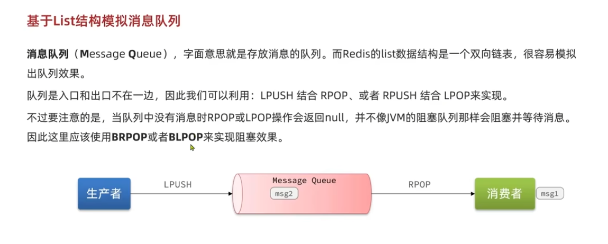

> 在Redis中，可以使用List结构来实现消息队列。以下是基于List结构的Redis消息队列的详细教程和Spring Boot项目代码案例。
> ### 教程
> #### 1. Redis List结构简介
> Redis List是一个双端链表结构，可以用来存储一系列字符串。它支持从头部或尾部添加元素，以及从头部或尾部删除元素。
> #### 2. 使用List结构实现消息队列
> - **生产者**：使用`LPUSH`或`RPUSH`命令将消息添加到List的头部或尾部。
> - **消费者**：使用`LPOP`或`RPOP`命令从List的头部或尾部取出消息。
> #### 3. 阻塞式消费
> 为了实现阻塞式的消息消费，可以使用`BLPOP`或`BRPOP`命令，这些命令在列表为空时会阻塞，直到有新元素可以弹出或者超时。
> ### Spring Boot项目代码案例
> #### 1. 添加依赖
> 在`pom.xml`中添加Spring Boot和Redis的依赖。
> ```xml
> <dependencies>
>     <dependency>
>         <groupId>org.springframework.boot</groupId>
>         <artifactId>spring-boot-starter</artifactId>
>     </dependency>
>     <dependency>
>         <groupId>org.springframework.boot</groupId>
>         <artifactId>spring-boot-starter-data-redis</artifactId>
>     </dependency>
> </dependencies>
> ```
> #### 2. 配置Redis
> 在`application.properties`或`application.yml`中配置Redis。
> ```properties
> # application.properties
> spring.redis.host=localhost
> spring.redis.port=6379
> ```
> #### 3. 实现生产者
> ```java
> import org.springframework.beans.factory.annotation.Autowired;
> import org.springframework.data.redis.core.RedisTemplate;
> import org.springframework.stereotype.Service;
> @Service
> public class RedisMessageProducer {
>     @Autowired
>     private RedisTemplate<String, String> redisTemplate;
>     public void sendMessage(String queueName, String message) {
>         redisTemplate.opsForList().rightPush(queueName, message);
>     }
> }
> ```
> #### 4. 实现消费者
> ```java
> import org.springframework.beans.factory.annotation.Autowired;
> import org.springframework.data.redis.connection.Message;
> import org.springframework.data.redis.connection.MessageListener;
> import org.springframework.data.redis.core.RedisTemplate;
> import org.springframework.stereotype.Service;
> @Service
> public class RedisMessageConsumer implements MessageListener {
>     @Autowired
>     private RedisTemplate<String, String> redisTemplate;
>     @Override
>     public void onMessage(Message message, byte[] pattern) {
>         // 这里只是打印消息，实际应用中可以根据业务逻辑处理消息
>         System.out.println("Received message: " + new String(message.getBody()));
>     }
>     public String receiveMessage(String queueName) {
>         return redisTemplate.opsForList().leftPop(queueName);
>     }
> }
> ```
> #### 5. 启动类
> ```java
> import org.springframework.boot.SpringApplication;
> import org.springframework.boot.autoconfigure.SpringBootApplication;
> import org.springframework.context.ApplicationContext;
> @SpringBootApplication
> public class RedisMessageQueueApplication {
>     public static void main(String[] args) {
>         ApplicationContext context = SpringApplication.run(RedisMessageQueueApplication.class, args);
>         RedisMessageProducer producer = context.getBean(RedisMessageProducer.class);
>         RedisMessageConsumer consumer = context.getBean(RedisMessageConsumer.class);
>         // 生产消息
>         producer.sendMessage("queue", "Hello, Redis Queue!");
>         // 消费消息
>         String message = consumer.receiveMessage("queue");
>         System.out.println("Consumed message: " + message);
>     }
> }
> ```
> 以上代码创建了一个简单的Spring Boot应用程序，其中包含一个生产者和一个消费者。生产者将消息推送到Redis List，消费者从List中取出消息。
> 请注意，这只是一个简单的例子，实际生产环境中需要考虑错误处理、消息持久化、消息确认等复杂情况。此外，如果需要实现更高级的消息队列特性，可能需要使用Redis的发布/订阅功能或者专业的消息队列中间件。

#### G.3PubSub实现消息队列

##### 3.1 Pub-Sub基本概念

- **主题（Topic）**：生产者发送消息的资源。
- **订阅（Subscription）**：消费者订阅主题以接收消息。
- **消息（Message）**：传输的数据和特性。
- **发布者（Publisher）**：发送消息的生产者。
- **订阅者（Subscriber）**：接收消息的消费者5。

##### 3.2 消息传递过程

1. **发布消息**：发布者向主题发送消息。
2. **系统存储**：系统将消息存储在主题中。
3. **消息转发**：系统将主题的消息转发到订阅中。
4. **消息推送**：Pub-Sub将消息推送给订阅者，或者订阅者拉取消息。
5. **消息确认**：订阅者收到消息后返回Ack确认信息。
6. **消息移除**：Pub-Sub移除已确认的消息。

```
常用命令：
subscribe channel-1 channel-2 --订阅命令
publish channel-1 hello --在channel-1这个频道中发布hello
unsubscribe channel-1 ——不再定义channel-1
```


按规则（Pattern）订阅频道

支持 `?` 和 `*` 占位符：

- `?`：代表一个字符。
- `*`：代表 0 个或多个字符。

例如：现在有三个新闻频道:


```
psubscribe *sport
消费端2，订阅所有新闻：
psubscribe news*
消费端3，订阅天气新闻：
psubscribe new-weather
生产者，向三个频道分别发布三条消息，对应的订阅者能收到消息：
publish news-sport kobe
publish news-music jaychou
publish news-weather sunny
```

###### 3.3.1RedisUtil.java发布类

```java
import lombok.extern.slf4j.Slf4j;
import org.springframework.beans.factory.annotation.Qualifier;
import org.springframework.data.redis.core.RedisTemplate;
import org.springframework.stereotype.Component;
import org.springframework.util.StringUtils;

import javax.annotation.Resource;
import java.util.Set;
import java.util.concurrent.TimeUnit;

/**
 * <p> @Title RedisUtil
 * <p> @Description Redis工具类
 *
 * @author ACGkaka
 * @date 2021/6/16 16:32
 */
@Slf4j
@Component
public class RedisUtil {

    @Qualifier("redisTemplate")
    @Resource
    private RedisTemplate<String, Object> redisTemplate;

    /**
     * 向频道发布消息
     * @param channel   频道
     * @param message   消息
     * @return true成功 false失败
     */
    public boolean publish(String channel, Object message) {
        if (!StringUtils.hasText(channel)) {
            return false;
        }
        try {
            redisTemplate.convertAndSend(channel, message);
            log.info("发送消息成功，channel:{}, message:{}", channel, message);
            return true;
        } catch (Exception e) {
            log.error("发送消息失败，channel:{}, message:{}", channel, message, e);
        }
        return false;
    }

}

```

###### 3.3.2MessageDTO.java 实体类

```java
package com.demo.redis.listener;

import lombok.AllArgsConstructor;
import lombok.Data;
import lombok.NoArgsConstructor;

import java.io.Serializable;
import java.time.LocalDateTime;

@Data
@NoArgsConstructor
@AllArgsConstructor
public class MessageDTO implements Serializable {

    /**
     * 消息标题
     */
    private String title;

    /**
     * 消息内容
     */
    private String content;

    /**
     * 消息内容
     */
    private LocalDateTime createTime;
}

```

###### 3.3.3发布测试

```
import com.demo.redis.listener.MessageDTO;
import com.demo.util.RedisUtil;
import org.junit.Test;
import org.junit.runner.RunWith;
import org.springframework.beans.factory.annotation.Autowired;
import org.springframework.boot.test.context.SpringBootTest;
import org.springframework.test.context.junit4.SpringRunner;

import java.time.LocalDateTime;

@RunWith(SpringRunner.class)
@SpringBootTest
public class SpringBootRedisApplicationTests {

    @Autowired
    private RedisUtil redisUtil;

    @Test
    public void test1() {
        // 订阅主题
        final String TOPIC_NAME_1 = "TEST_TOPIC_1";
        final String TOPIC_NAME_2 = "TEST_TOPIC_2";
        // 发布消息
        MessageDTO dto = new MessageDTO("测试标题", "测试内容", LocalDateTime.now());
        redisUtil.publish(TOPIC_NAME_1, dto);
    }
}

```

###### 3.3.4订阅实现方式：实现MessageListener接口

```java
import com.demo.redis.RedisCustomizeProperties;
import com.demo.redis.listener.RedisMessageListener;
import org.springframework.boot.context.properties.EnableConfigurationProperties;
import org.springframework.context.annotation.Bean;
import org.springframework.context.annotation.Configuration;
import org.springframework.data.redis.connection.RedisConnectionFactory;
import org.springframework.data.redis.core.RedisTemplate;
import org.springframework.data.redis.listener.PatternTopic;
import org.springframework.data.redis.listener.RedisMessageListenerContainer;
import org.springframework.data.redis.serializer.JdkSerializationRedisSerializer;
import org.springframework.data.redis.serializer.StringRedisSerializer;

import java.io.Serializable;

@Configuration
@EnableConfigurationProperties(RedisCustomizeProperties.class)
public class RedisConfig {

    /**
     * 配置RedisTemplate
     *
     * @param redisConnectionFactory 连接工厂
     * @return RedisTemplate
     */
    @Bean
    public RedisTemplate<String, Serializable> redisTemplate(RedisConnectionFactory redisConnectionFactory) {
        RedisTemplate<String, Serializable> redisTemplate = new RedisTemplate<>();
        //设置key的存储方式为字符串
        redisTemplate.setKeySerializer(new StringRedisSerializer());
        //设置为value的存储方式为JDK二进制序列化方式，还有jackson序列化方式（Jackson2JsonRedisSerialize）
        redisTemplate.setValueSerializer(new JdkSerializationRedisSerializer());
        //设置连接工厂
        redisTemplate.setConnectionFactory(redisConnectionFactory);
        return redisTemplate;
    }

    /**
     * Redis消息监听器容器（实现方式一）
     *
     * @param redisConnectionFactory    连接工厂
     * @param listener                  消息监听器
     * @return Redis消息监听容器
     */
    @Bean
    public RedisMessageListenerContainer container(RedisConnectionFactory redisConnectionFactory,
                                                   RedisMessageListener listener) {
        // 订阅主题
        final String TOPIC_NAME_1 = "TEST_TOPIC_1";
        final String TOPIC_NAME_2 = "TEST_TOPIC_2";
        RedisMessageListenerContainer container = new RedisMessageListenerContainer();
        // 设置连接工厂
        container.setConnectionFactory(redisConnectionFactory);
        // 订阅频道（可以添加多个）
        container.addMessageListener(listener, new PatternTopic(TOPIC_NAME_1));
        container.addMessageListener(listener, new PatternTopic((TOPIC_NAME_2)));

        return container;
    }
}

```

###### 3.3.5监听类

```java
package com.demo.redis.listener;

import lombok.extern.slf4j.Slf4j;
import org.springframework.beans.factory.annotation.Qualifier;
import org.springframework.data.redis.connection.Message;
import org.springframework.data.redis.connection.MessageListener;
import org.springframework.data.redis.core.RedisTemplate;
import org.springframework.stereotype.Component;

import javax.annotation.Resource;

@Slf4j
@Component
public class RedisMessageListener implements MessageListener {

    @Qualifier("redisTemplate")
    @Resource
    private RedisTemplate<String, Object> redisTemplate;

    @Override
    public void onMessage(Message message, byte[] pattern) {
        // 打印渠道
        log.info(">>>>>>>>>> 【INFO】订阅的channel：{}", new String(pattern));

        // 获取消息
        byte[] messageBody = message.getBody();
        // 序列化对象
        MessageDTO messageDTO = (MessageDTO) redisTemplate.getValueSerializer().deserialize(messageBody);

        // 打印消息
        log.info(">>>>>>>>>> 【INFO】收到的message：{}", messageDTO);
    }
}

```

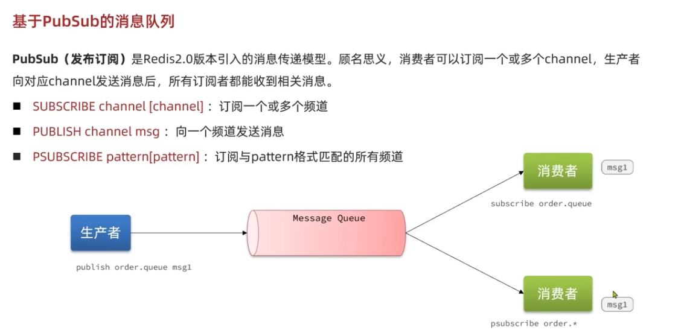

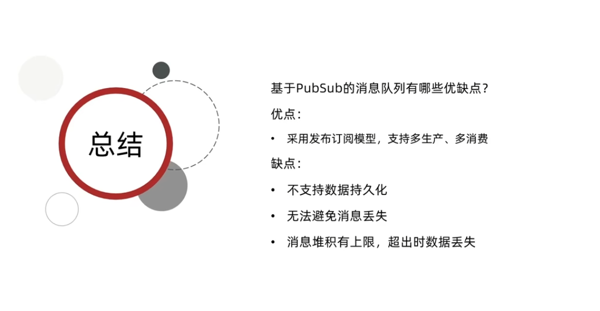

> 

#### G.4Stream的单消费模式

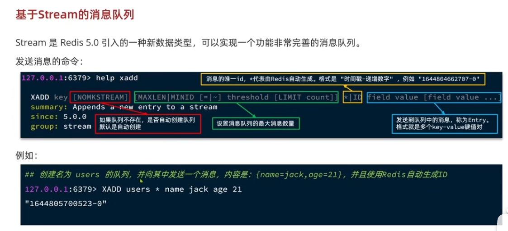


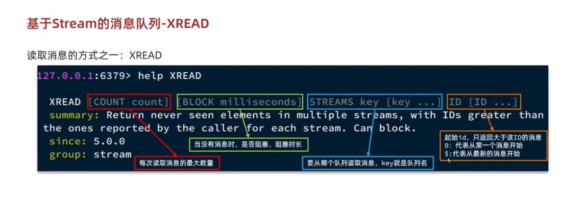

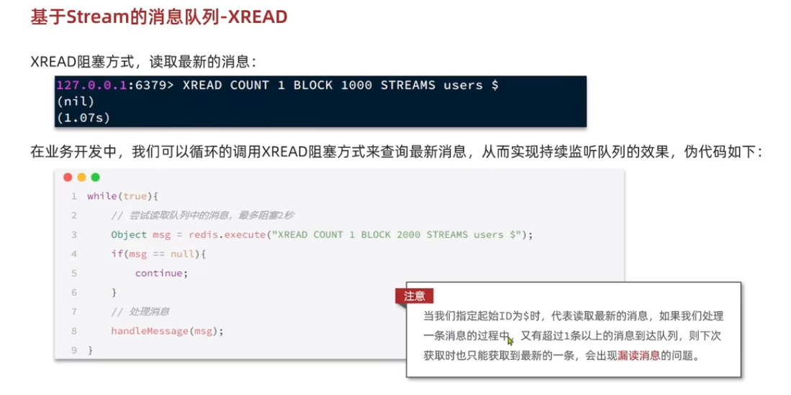

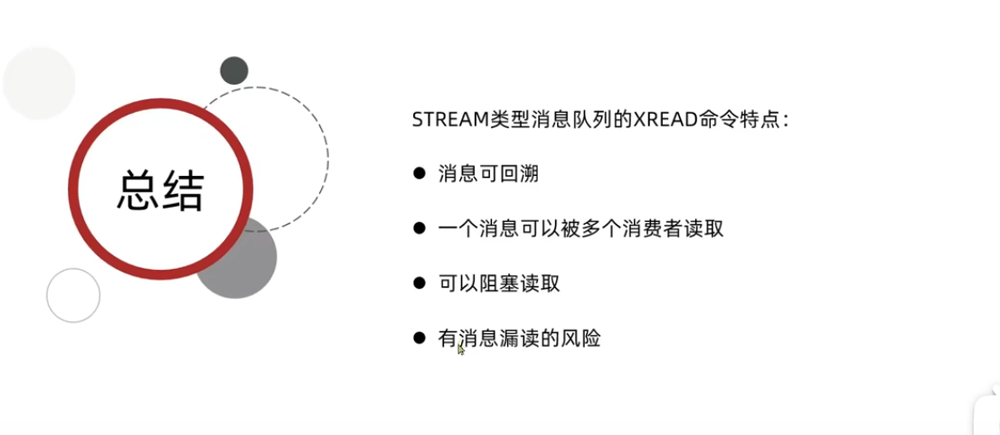

```java
Jedis jedis = new Jedis("localhost", 6379);

// 添加秒杀请求到Stream
Map<String, String> seckillRequest = new HashMap<>();
seckillRequest.put("id", "1");
seckillRequest.put("productId", "1001");
seckillRequest.put("userId", "10001");
jedis.xadd("seckill_requests", StreamEntryID.NEW_ENTRY, seckillRequest);

// 消费秒杀请求
List<EntryID> requestIds = jedis.xreadGroup("seckill_group", "consumer", StreamEntryID.LAST_ENTRY, 1, false);
for (EntryID requestId : requestIds) {
    Map<String, String> request = jedis.hgetAll(requestId.toString());
    System.out.println("Received seckill request: " + request);
    // 处理秒杀请求，如扣减库存等操作
    // 处理完成后，确认消息已处理
    jedis.xack("seckill_requests", "seckill_group", requestId);
}

```


#### G.5Stream的消费者组模式

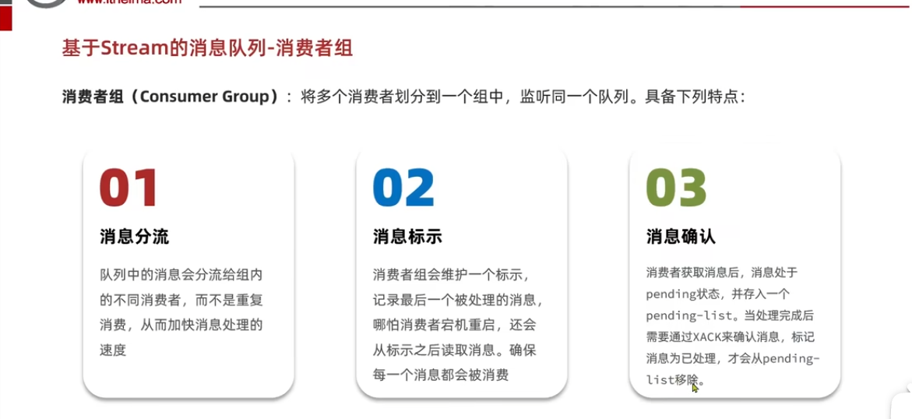

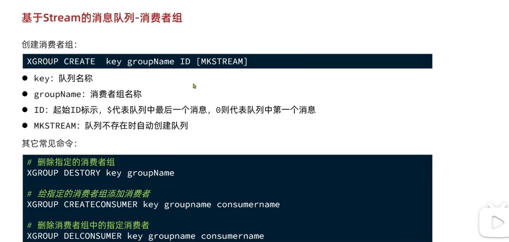

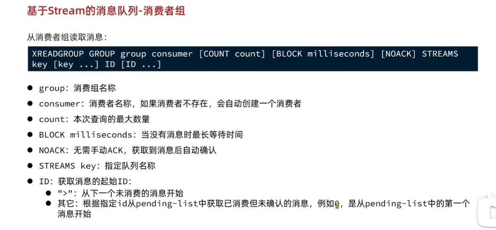

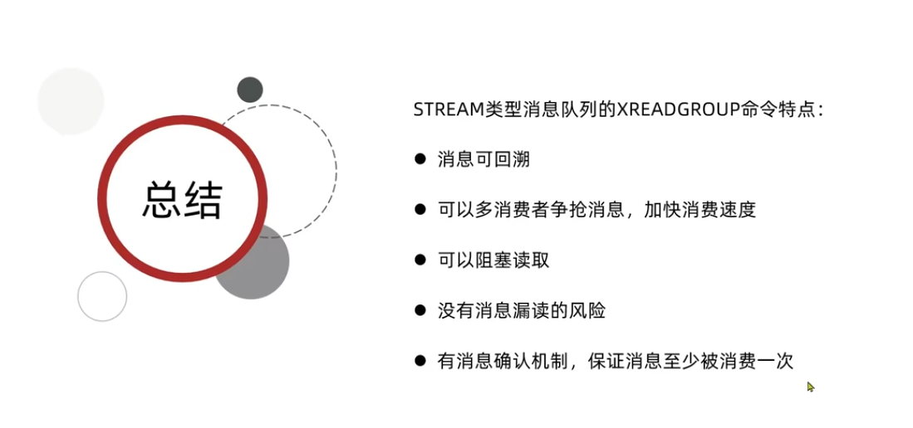

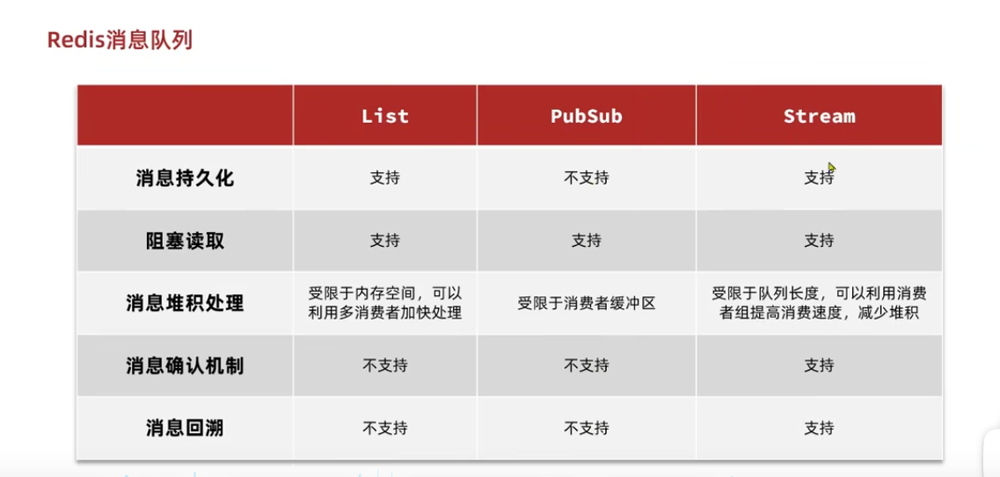

```java
Jedis jedis = new Jedis("localhost", 6379);

// 添加秒杀请求到Stream
Map<String, String> seckillRequest = new HashMap<>();
seckillRequest.put("id", "1");
seckillRequest.put("productId", "1001");
seckillRequest.put("userId", "10001");
jedis.xadd("seckill_requests", StreamEntryID.NEW_ENTRY, seckillRequest);

// 消费秒杀请求
List<EntryID> requestIds = jedis.xreadGroup("seckill_group", "consumer", StreamEntryID.LAST_ENTRY, 1, false);
for (EntryID requestId : requestIds) {
    Map<String, String> request = jedis.hgetAll(requestId.toString());
    System.out.println("Received seckill request: " + request);
    // 处理秒杀请求，如扣减库存等操作
    // 处理完成后，确认消息已处理
    jedis.xack("seckill_requests", "seckill_group", requestId);
}

```


## 4.达人探店

## 5.好友关注

## 6.附近的商户

## 7.用户签到

## 8.UV统计

## 9.Redis高级原理

### A.分布式缓存

单点Redis问题：

1. 内容丢失

2. 并发能力弱

3. 故障恢复问题

4. 储存能力问题：基于内存，单节点储存的数据量难以满足海量数据需求

   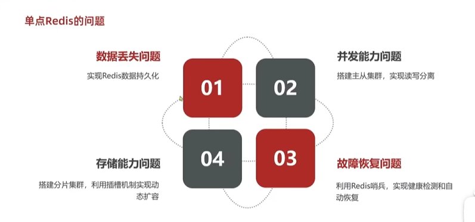

#### A.1Redis持久化-RDB演示

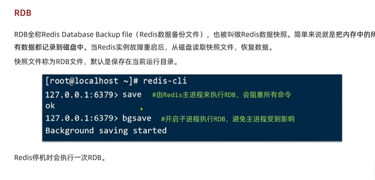

```cmd
redis-server redis-6.2.4/redis.conf //启动redis服务
redis-cli //与redis建立连接
set num 123 //设置Num这个Key的值为123
get num //查询成功为123
[Ctrl+C停机]
有日志显示：Saving the final RDB snapshot before exiting 
ll //在redis目录平级查询所有文件

dump.rdb//这就是rdb储存文件
redis-6.2.4//redis的文件夹

redis-cli //再次建立连接
get num //返回123 说明值被保存下来了
```

上面谈论的是主动停机，那如果是意外宕机呢？那么会考验自动备份，下面的redis.conf中就配置了自动备份的规则

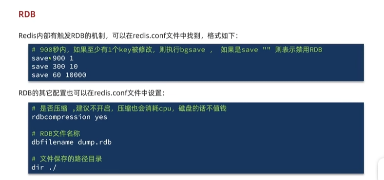

#### A.2Redis持久化-RDB的fork原理

1. Linux操作系统中，进程不能直接操作物理内存
2. 进程操作的是虚拟内存
3. 页表建立了物理内存与虚拟内存之间的映射
4. 主进程fork一个子进程，本质是复制了一份页表

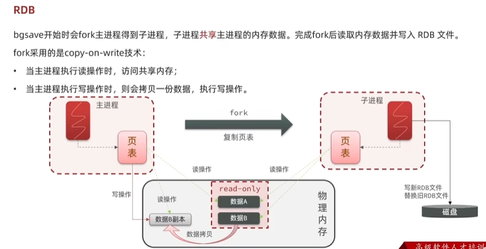

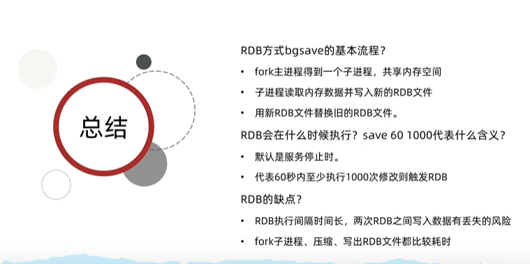

#### A.3Redis持久化-AOF演示

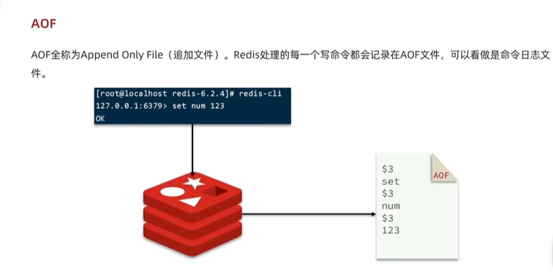

```cmd
set num 123
set test cehi
get num 
对应的AOF文件如下： $+数字 表示记录的该命令有多少个字符
$3
set
$3
num
$3
123

$3
set
$4
test
$4
cehi

$3
get
$3
num
```

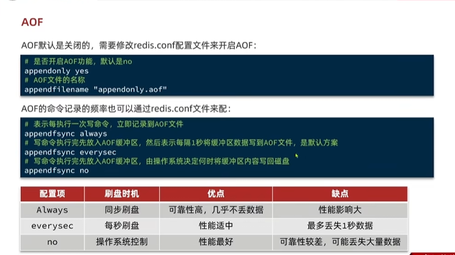

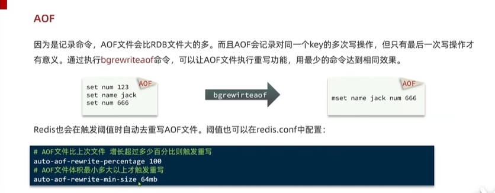

#### A.4Redis持久化-RDB和AOF的对比


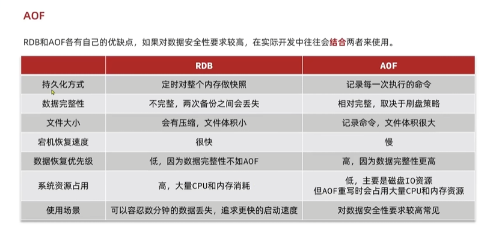


#### A.5Redis主从-主从集群结构

1. Redis是读多写少
2. 所以我们让写的节点比较少 读的节点比较多
3. 写数据的节点是主节点
4. 读数据的节点是从节点
5. 主从节点数据是同步的

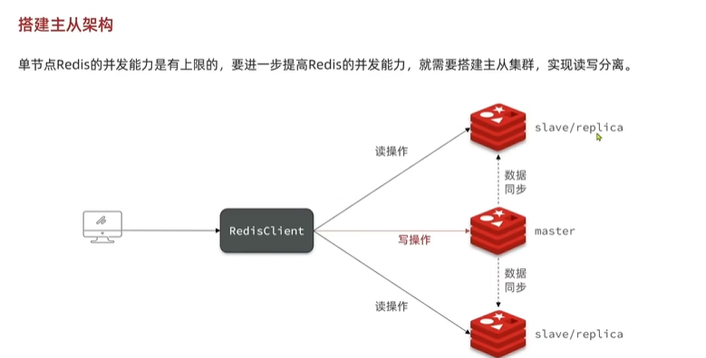

#### A.6Redis主从-搭建主从集群

想在同一台虚拟机开启3个实例，就必须准备三份不同的配置文件和目录。

##### 1)创建目录：创建三个文件夹 分别是7001 7002 7003

```cmd
#进入/tmp目录
cd /tmp
#创建目录
mkdir 7001 7002 7003


```

##### 2）恢复原始配置

```cmd
#修改redis-6.2.4/redis.conf文件，持久化改为默认的RDB模式 让AOF关闭

#开启RDB
save 3600 1
save 300 100
save 60 10000

#关闭AOF
appendonly no
```

##### 3)拷贝配置文件到每个目录

```cmd
#方法一：逐个拷贝
cp redis-6.2.4/redis.conf 7001
cp redis-6.2.4/redis.conf 7002
cp redis-6.2.4/redis.conf 7003
#方法二 管道模式
echo 7001 7002 7003 |xargs -t -n 1 cp redis-6.2.4/redis.conf
```

##### 4)修改每个实例的端口与工作目录

修改每个文件夹的配置文件，将端口分别修改为7001 7002 7003,将RDB文件保存位置改成自己所在目录

```sh
sed -i -e 's/6379/7001/g' 's/dir .\//dir \/tmp\/7001\//g' 7001/redis.conf
sed -i -e 's/6379/7002/g' -e 's/dir .\//dir \/tmp\/7002\//g' 7002/redis.conf
sed -i -e 's/6379/7003/g' -e 's/dir .\//dir \/tmp\/7003\//g' 7003/redis.conf
```

##### 5）修改每个实例的声明IP

```cmd
#redis实例的声明
replica-announce-ip 192.168.150.101
```

每个目录都需要改 我们一键完成修改

```cmd
sed -i 'la replica-announce-ip 192.168.150.101' 7001/redis.conf
sed -i 'la replica-announce-ip 192.168.150.101' 7002/redis.conf
sed -i 'la replica-announce-ip 192.168.150.101' 7003/redis.conf
#或者一键修改
printf '%s\n' 7001 7002 7003 |xargs -I{} -t sed -i 'la replica-announce-ip 192.168.150.101' {}/redis.conf
```

> 好的，让我们来详细解释这些命令以及它们的作用。
> ### 单独修改每个配置文件
> 首先，我们来看前三个命令：
> ```bash
> sed -i 'la replica-announce-ip 192.168.150.101' 7001/redis.conf
> sed -i 'la replica-announce-ip 192.168.150.101' 7002/redis.conf
> sed -i 'la replica-announce-ip 192.168.150.101' 7003/redis.conf
> ```
> 这些命令都做了相同的事情，只是针对不同的Redis配置文件。让我们分解一下每个命令的组成部分：
> - `sed`：流编辑器命令，用于对文本进行替换、删除、插入等操作。
> - `-i`：这个选项告诉sed直接修改源文件，而不是将修改后的内容输出到标准输出。
> - `'la replica-announce-ip 192.168.150.101'`：这是sed的表达式。`l`是sed的一个命令，表示列出文本行，`a`命令用于在指定的行后添加文本。这里表示在最后一行后添加`replica-announce-ip 192.168.150.101`。但是，这个命令实际上并不是标准的sed命令，通常我们使用`$a`来在文件的最后一行后添加文本。正确的命令应该是`$a replica-announce-ip 192.168.150.101`。
> - `7001/redis.conf`：这是要修改的文件路径。
> 每个命令的作用是在指定路径下的Redis配置文件的最后一行后添加`replica-announce-ip 192.168.150.101`。
> ### 一键修改多个配置文件
> 现在，我们来看最后一个命令：
> ```bash
> printf '%s\n' 7001 7002 7003 |xargs -I{} -t sed -i '$a replica-announce-ip 192.168.150.101' {}/redis.conf
> ```
> 这个命令使用了`printf`、管道`|`和`xargs`命令来实现批量操作。让我们分解一下：
> - `printf '%s\n' 7001 7002 7003`：`printf`命令用于格式化并打印数据。这里`%s`是一个格式占位符，代表字符串，`\n`是换行符。这个命令的作用是将7001、7002、7003每个数字后面都加上一个换行符，然后打印出来。
> - `|`：管道符号，用于将前一个命令的输出作为后一个命令的输入。
> - `xargs`：用于从标准输入构建和执行命令行参数。`-I{}`告诉xargs使用`{}`作为占位符，用于替换来自标准输入的每一行。
> - `-t`：这个选项告诉xargs在执行命令之前先打印出命令。
> - `sed -i '$a replica-announce-ip 192.168.150.101' {}/redis.conf`：这是xargs要执行的命令。`{}`会被xargs从标准输入读取的每一行（7001、7002、7003）替换。
> 整个命令的作用是将7001、7002、7003这三个目录下的`redis.conf`文件都修改，在文件的最后一行后添加`replica-announce-ip 192.168.150.101`。
> 请注意，上述命令中的`la`是错误的，应该使用`$a`来在文件的最后一行后添加文本。正确的命令应该是：
> ```bash
> printf '%s\n' 7001 7002 7003 |xargs -I{} -t sed -i '$a replica-announce-ip 192.168.150.101' {}/redis.conf
> ```
> 这个命令能够一次性修改三个配置文件，而不是分别对每个文件执行sed命令。

##### 6）设定主从关系

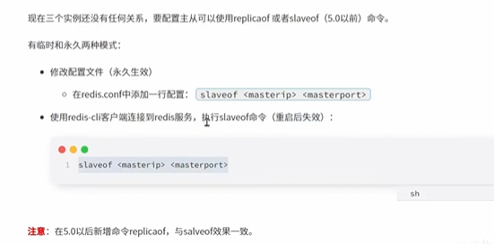

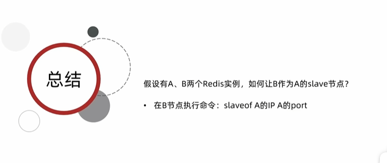

#### A.7Redis主从-主从的全量同步原理

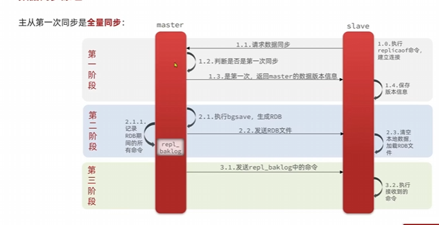

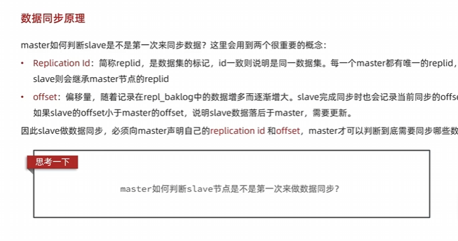

#### A.8Redis主从-增量同步原理

#### A.9Redis哨兵-哨兵作用与工作原理

#### A.10Redis哨兵-搭建哨兵集群

#### A.11RedisTemplate链接哨兵

#### A.12Redis分片集群-搭建分片集群

#### A.13Redis分布集群-散列插槽

#### A.14Redis分片集群-集群伸缩

#### A.15Redis分片集群-故障转移

#### A.16Redis分片集群-RedisTemplate访问分片集群

### B.Redis多级缓存

B.1什么是多级缓存

B.2JVM进程缓存-导入Demo数据

B.3JVM进程缓存-导入Demo工程

B.4JVM进程缓存初识-Caffeine

B.5JVM进程缓存初识-实现进程缓存

B.6Lua语法-初识Lua

B.7Lua语法-变量和循环

B.8Lua语法-函数和条件控制

B.9多级缓存-安装OpenResty

B.10多级缓存-OpenResty获取请求参数

B.11多级缓存-封装Http请求工具

B.12多级缓存-向Tomcat发送http请求

B.13多级缓存-根据商品id对tomcat集群负载均衡

B.14多级缓存-Redis缓存预热

B.15-多级缓存-查询Redis

B.16多级缓存-nginx本地缓存

B.17缓存同步-数据同步策略

B.18缓存同步-安装Canal

B.19缓存同步-监听canal实现缓存同步

B.20多级缓存的课程总结

### C.Redis最佳实践

C.1键值设计-如何设计优雅的key

C.2键值设计-BigKey问题

C.3键值设计-选择合适的数据结构

C.4批处理优化-pipeline和mset

C.5批处理优化-集群模式下的批处理问题

C.6服务端优化-持久化配置

C.7服务端优化-慢查询问题

C.8服务器优化-命令与安全配置

C.9服务器优化-内存安全和配置

C.10Redis优化-集群还是主从

### D.Redis数据结构

D.1动态字符串

D.2Dict

D.3Dict的渐进式rehash

D.4ZipList

D.5ZipList的连锁更新问题

D.6QuickList

D.7SkipList

D.8RedisObject

D.9五种数据类型-string

D.10五种数据类型-List

D.11五种数据类型-set

D.12五种数据类型-ZSet

D.13五种数据类型-hash

### E.Redis网络模型

E.1用户空间与内核空间

E.2阻塞IO

E.3非阻塞IO

E.4IO多路复用

E.5IO多路复用之select

E.6IO多路复用之poll

E.7IO多路复用之epoll

E.8epoll的ET和LT模式

E.9基于epoll的服务端流程

E.10信号驱动IO和异步IO

E.11Redis是单线程么，为什么用单线程

E.12Redis单线程与多线程网络模型变更

### F.Redis通信协议

F.1RESP协议

F.2基于Socket的自定义Redis客户端


### G.Redis内存回收

G.1过期Key处理

G.2内存淘汰策略 
