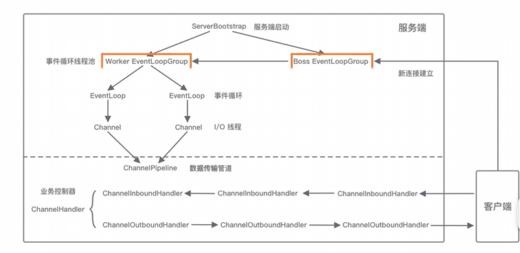
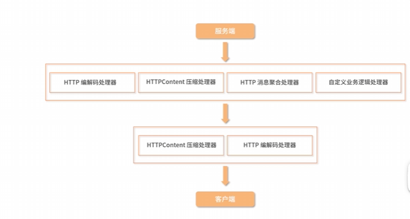

# 1.BootStrap



## A.EventLoopGroup与Bootstrap

- 单线程模式

  - ```java
    EventLoopGroup group = new NioEventLoopGroup(1);
    ServerBootstrap b = new ServerBootstrap();
    b.group(group);
    ```

    

- 多线程模式

  - ```java
    EventLoopGroup group = new NioEventLoopGroup();//区别在于NioEventLoopGroup不再唯一。默认是2倍的CPU核数的线程。这种是典型的IO密集型。因为CPU密集型会要求减少线程数来避免线程上下文切换导致的内存开销。当然，你也可以手动设定>1的值为group的线程数.EnventLoopGroup的核心是一个线程池。
    ServerBootstrap b = new ServerBootstrap();
    b.group(group);
    ```

    

- 主从多线程模式(大部分的Server的工作模式)

  - ```java
    EventLoopGroup bossGroup = new NioEventLoopGroup();
    EventLoopGroup workerGroup = new NioEventLoopGroup();
    ServerBootstrap b = new ServerBootstrap();
    b.group(bossGroup,workerGroup);
    ```

## B.设置Channel类型

- ```java
  b.channel(NioServerSocketChannel.class)//服务端通道注册
      
  ```

- ```java
  b.channel(NioSocketChannel.class)//客户端通道注册
  ```

  

## C.注册ChannelHandler

> Netty中可以通过ChannelPipeline去注册多个ChannelHandler,每个ChannelHandler各司其职，可以实现最大化的代码复用，充分体现Netty设计的优雅之处

```java
b.childChannel(new ChannelInitializer<SocketChannel>(){
    @Override
    public void initChannel(SocketChannel ch){
        ch.pipeline()//pipeLine用于Hanlder的排布：负责业务的处理
        .addLast("codec",new HttpServerCodec())//编码和解码处理器
        .addLast("compressor",new HttpContentCompressor())//消息压缩处理器
        .addLast("aggregator",new HttpObjectAggregator(65536))//消息聚合处理器
        .addLast("handler",new HttpServerHandler());//自定义处理器
    }
})
```



## D.设置Channel参数

```java
b.option(ChannelOption.SO_KEEPALIVE);
```

## E.端口绑定

```java
ChannelFuture f = b.bind().sync();
```

## F.HttpServer实现

```java
import io.netty.bootstrap.ServerBootstrap;
import io.netty.channel.Channel;
import io.netty.channel.ChannelHandlerContext;
import io.netty.channel.ChannelInboundHandlerAdapter;
import io.netty.channel.EventLoopGroup;
import io.netty.channel.nio.NioEventLoopGroup;
import io.netty.channel.socket.SocketChannel;
import io.netty.channel.socket.nio.NioServerSocketChannel;
import io.netty.handler.codec.http.DefaultFullHttpResponse;
import io.netty.handler.codec.http.HttpHeaderNames;
import io.netty.handler.codec.http.HttpMethod;
import io.netty.handler.codec.http.HttpRequest;
import io.netty.handler.codec.http.HttpResponseStatus;
import io.netty.handler.codec.http.HttpVersion;
import io.netty.handler.codec.http.QueryStringDecoder;
import io.netty.handler.codec.http.FullHttpRequest;
import io.netty.handler.codec.http.FullHttpResponse;
import io.netty.handler.codec.http.HttpHeaders;

import static io.netty.buffer.Unpooled.copiedBuffer;

public class NettyHttpServer {

    private static final int PORT = 8080;

    public static void main(String[] args) throws Exception {
        // EventLoopGroup 是 Netty 的多线程事件驱动模型
        EventLoopGroup bossGroup = new NioEventLoopGroup(1);  // 用于接收客户端连接
        EventLoopGroup workerGroup = new NioEventLoopGroup(); // 用于处理 I/O 操作

        try {
            ServerBootstrap serverBootstrap = new ServerBootstrap()
                    .group(bossGroup, workerGroup)
                    .channel(NioServerSocketChannel.class)
                    .childHandler(new HttpServerInitializer());

            Channel channel = serverBootstrap.bind(PORT).sync().channel();
            System.out.println("HTTP Server started at http://localhost:" + PORT);
            channel.closeFuture().sync();
        } finally {
            bossGroup.shutdownGracefully();
            workerGroup.shutdownGracefully();
        }
    }

    static class HttpServerInitializer extends io.netty.channel.ChannelInitializer<SocketChannel> {

        @Override
        protected void initChannel(SocketChannel ch) throws Exception {
            // 管道处理器
            ch.pipeline().addLast(
                    new io.netty.handler.codec.http.HttpServerCodec(),//HttpRequestDecoder+HttpResponseEncoder;
                    new io.netty.handler.codec.http.HttpObjectAggregator(65536),
                    new HttpServerHandler()
            );
        }
    }

    static class HttpServerHandler extends ChannelInboundHandlerAdapter {

        @Override
        public void channelReadComplete(ChannelHandlerContext ctx) throws Exception {
            ctx.flush();  // 刷新输出
        }

        @Override
        public void channelRead(ChannelHandlerContext ctx, Object msg) throws Exception {
            if (msg instanceof FullHttpRequest) {
                FullHttpRequest request = (FullHttpRequest) msg;
                HttpMethod method = request.method();

                // 处理 GET 请求
                if (method.equals(HttpMethod.GET)) {
                    QueryStringDecoder decoder = new QueryStringDecoder(request.uri());
                    String responseMessage = "Hello, Netty HTTP Server!";
                    if (decoder.parameters().containsKey("name")) {
                        responseMessage = "Hello, " + decoder.parameters().get("name").get(0) + "!";
                    }

                    FullHttpResponse response = new DefaultFullHttpResponse(
                            HttpVersion.HTTP_1_1,
                            HttpResponseStatus.OK,
                            copiedBuffer(responseMessage.getBytes())
                    );
                    response.headers().set(HttpHeaderNames.CONTENT_TYPE, "text/plain; charset=UTF-8");
                    response.headers().set(HttpHeaderNames.CONTENT_LENGTH, response.content().readableBytes());
                    ctx.writeAndFlush(response);
                }
            }
        }

        @Override
        public void exceptionCaught(ChannelHandlerContext ctx, Throwable cause) {
            cause.printStackTrace();
            ctx.close();
        }
    }
}

```

## G.HttpObjectAggregator的妙用

`HttpObjectAggregator` 是 Netty 中的一个处理器（handler），它的作用是将多个 HTTP 消息合并为一个完整的 HTTP 消息。

具体来说，当你使用 Netty 构建 HTTP 服务时，HTTP 请求或响应可能是分段传输的。即 HTTP 消息会被拆分成多个部分，通过网络传输。这通常发生在消息较大的时候，或者由于传输层的限制，消息不能一次性完全发送。

`HttpObjectAggregator` 的作用就是将这些分段的 HTTP 消息（包括请求或响应的头部和数据体）进行聚合，直到一个完整的 HTTP 消息到达。它会将所有接收到的 HTTP 内容（如头部和内容）拼接成一个完整的 `FullHttpRequest` 或 `FullHttpResponse` 对象。

### 主要功能

- **聚合多个消息片段**：比如当一个 HTTP 请求较大时，数据会分成多个 TCP 数据包发送过来，`HttpObjectAggregator` 会自动将它们拼接成一个完整的 `FullHttpRequest` 或 `FullHttpResponse`。
- **限制消息大小**：构造时，你可以设置最大消息大小（如 `65536` 字节），这就是你提到的数字 `65536`。如果聚合后的消息大小超过了这个限制，`HttpObjectAggregator` 会抛出 `TooLongFrameException`，避免内存溢出或 DoS 攻击。

### 代码示例

```java
ChannelPipeline pipeline = ch.pipeline();
pipeline.addLast(new HttpObjectAggregator(65536)); // 最大消息体大小为 64KB
```

### 使用场景

- **处理大请求或响应**：例如一个上传大文件的 HTTP 请求，可能需要将数据分段接收并拼接。
- **简化开发**：通过将多个 HTTP 消息片段聚合成一个完整的消息，开发者可以更方便地处理 HTTP 请求和响应，而不需要手动处理拆分的部分。

### 注意事项

- **性能开销**：聚合器会消耗额外的内存和 CPU 资源，因为它需要保存接收到的所有消息部分直到完整消息构建完成。
- **内存控制**：需要根据实际业务需求调整最大聚合大小，避免请求体过大导致的内存消耗或崩溃。

总之，`HttpObjectAggregator` 是处理 HTTP 消息片段并将其合并成一个完整消息的有用工具，在处理大文件上传/下载等场景时非常有帮助。

## H.HttpServerCodec的妙用

在 Netty 中，`HttpServerCodec` 是一个非常重要的编解码器，它将 HTTP 请求和响应从网络字节流与 Java 对象之间进行转换。具体来说，它负责将 **HTTP 请求/响应** 与 **`FullHttpRequest` / `FullHttpResponse`** 对象相互转换。

### 1. **编码（Encoder）**

Netty 在处理 HTTP 响应时使用编码过程。编码的作用是将 Java 对象（如 `FullHttpResponse`）转化为字节流（`ByteBuf`），以便能够通过网络发送给客户端。

在 `HttpServerCodec` 中，编码是通过 `HttpResponseEncoder` 完成的。

- **将 Java 对象编码为 HTTP 响应（字节流）**：

  - `FullHttpResponse` 是一种 Java 对象，它表示一个完整的 HTTP 响应。该对象包含了响应的头部（如 `Content-Type`, `Content-Length`）和响应体（即响应的内容）。
  - `HttpResponseEncoder` 会将 `FullHttpResponse` 对象编码成一个 HTTP 响应字节流。

  **过程**：

  1. Netty 首先从 `FullHttpResponse` 对象中获取响应的头部信息（如状态码、头部字段等）。
  2. 然后将响应体数据（`ByteBuf`）和头部信息转换成 HTTP 协议格式的字节流。
  3. 最后，将字节流发送到网络中。

- **示例**：
  假设有一个 `FullHttpResponse` 对象：

  ```java
  FullHttpResponse response = new DefaultFullHttpResponse(
      HttpVersion.HTTP_1_1,
      HttpResponseStatus.OK,
      copiedBuffer("Hello, Netty".getBytes())
  );
  response.headers().set(HttpHeaderNames.CONTENT_TYPE, "text/plain; charset=UTF-8");
  response.headers().set(HttpHeaderNames.CONTENT_LENGTH, response.content().readableBytes());
  ```

  `HttpResponseEncoder` 会把这个 `FullHttpResponse` 对象转换成 HTTP 格式的字节流，如下所示：

  ```
  HTTP/1.1 200 OK
  Content-Type: text/plain; charset=UTF-8
  Content-Length: 13
  
  Hello, Netty
  ```

### 2. **解码（Decoder）**

Netty 处理 HTTP 请求时，解码过程将 HTTP 请求的字节流转化为 `FullHttpRequest` 对象。这个过程通过 `HttpRequestDecoder` 实现。

- **将 HTTP 请求（字节流）解码为 Java 对象**：

  - 当客户端发送一个 HTTP 请求时，数据首先是以字节流的形式传输的。Netty 会通过 `HttpRequestDecoder` 将这些字节流解析为 `FullHttpRequest` 对象。
  - `FullHttpRequest` 是一个表示完整 HTTP 请求的 Java 对象，它包括请求头（如 HTTP 方法、URL、请求头字段等）和请求体。

- **解码过程**：

  1. `HttpRequestDecoder` 会首先解析 HTTP 请求的头部（如请求方法、URI、HTTP 版本等）。
  2. 然后，Netty 将请求体的字节数据（如 POST 数据、JSON 数据等）提取出来。
  3. 最后，构造 `FullHttpRequest` 对象并返回。

- **示例**：
  假设客户端发送了一个 HTTP GET 请求：

  ```
  GET /hello?name=Netty HTTP/1.1
  Host: localhost:8080
  ```

  `HttpRequestDecoder` 会将字节流转化为一个 `FullHttpRequest` 对象。`FullHttpRequest` 对象包含以下信息：

  - 请求方法：`GET`
  - 请求 URI：`/hello?name=Netty`
  - 请求头：`Host: localhost:8080`

  另外，`QueryStringDecoder` 会解析查询字符串（例如 `name=Netty`），方便后续的处理。

### 3. **Netty 中 `HttpServerCodec` 的作用**

`HttpServerCodec` 是一个组合编解码器，它本质上是将 `HttpRequestDecoder` 和 `HttpResponseEncoder` 组合在一起，提供一个同时处理请求和响应的解决方案。

- **解码：** `HttpRequestDecoder` 会把 HTTP 请求字节流解码为 `FullHttpRequest` 对象。
- **编码：** `HttpResponseEncoder` 会把 `FullHttpResponse` 对象编码为 HTTP 响应字节流。

这使得 `HttpServerCodec` 可以简化 HTTP 协议的处理，开发者只需要关注业务逻辑而不需要自己手动实现解码和编码的细节。

### 4. **示意图**

以下是简化的 HTTP 编解码流程：

```
  客户端请求  ==>  [字节流] ==>  HttpRequestDecoder  ==>  FullHttpRequest
      |                           |
      v                           v
  FullHttpResponse  ==>  HttpResponseEncoder  ==>  [字节流]  ==>  客户端响应
```

### 5. **编码和解码的细节**

#### **HTTP 请求解码**：

- **请求行（Request Line）**：包括 HTTP 方法（如 GET、POST 等），请求 URI，和 HTTP 版本。
- **请求头（Headers）**：包括如 `Content-Type`, `Host`, `Accept-Encoding` 等字段。
- **请求体（Body）**：一般用于 POST 请求，包含了用户上传的数据（如表单数据或 JSON）。

#### **HTTP 响应编码**：

- **状态行（Status Line）**：包括 HTTP 版本、状态码（如 200 OK, 404 Not Found 等）和状态描述。
- **响应头（Headers）**：包括如 `Content-Type`, `Content-Length`, `Date` 等字段。
- **响应体（Body）**：实际的响应数据，如 HTML 内容、JSON 数据或图片等。

### 总结

- `HttpServerCodec` 结合了 `HttpRequestDecoder` 和 `HttpResponseEncoder`，处理 HTTP 请求和响应的编解码。
- **解码**：HTTP 请求的字节流被解码成 `FullHttpRequest` 对象。
- **编码**：`FullHttpResponse` 对象被编码成 HTTP 响应字节流，发送到客户端。

Netty 的这种编解码机制非常高效，并且能够支持 HTTP 协议中的各种特性（如多部分请求、升级协议等）。


## I.自定义的HttpServerHandler

### 1. `channelReadComplete(ChannelHandlerContext ctx)`

```java
@Override
public void channelReadComplete(ChannelHandlerContext ctx) throws Exception {
    ctx.flush();  // 刷新输出
}
```

- **作用**：此方法在 `Channel` 完成一次读取操作时被调用，意味着 Netty 完成了从网络中读取数据。此时，你可以将数据刷新（write）到通道，以确保响应被发送回客户端。

- **`ctx.flush()`**：调用 `flush()` 会将之前写入的所有数据推送到下游的 `Channel` 中，确保数据尽快发送出去。在这个方法里，通常会在完成请求处理后调用 `flush()`，确保数据（比如 HTTP 响应）最终被送到客户端。

- **触发时机**：每当读取操作（`channelRead`）完成时，`channelReadComplete` 方法就会被触发。这对于完成响应的发送操作很重要，尤其是在你需要确保响应已经完整写入并发送给客户端时。

---

### 2. `channelRead(ChannelHandlerContext ctx, Object msg)`

```java
@Override
public void channelRead(ChannelHandlerContext ctx, Object msg) throws Exception {
    if (msg instanceof FullHttpRequest) {
        FullHttpRequest request = (FullHttpRequest) msg;
        HttpMethod method = request.method();

        // 处理 GET 请求
        if (method.equals(HttpMethod.GET)) {
            QueryStringDecoder decoder = new QueryStringDecoder(request.uri());
            String responseMessage = "Hello, Netty HTTP Server!";
            if (decoder.parameters().containsKey("name")) {
                responseMessage = "Hello, " + decoder.parameters().get("name").get(0) + "!";
            }

            FullHttpResponse response = new DefaultFullHttpResponse(
                    HttpVersion.HTTP_1_1,
                    HttpResponseStatus.OK,
                    copiedBuffer(responseMessage.getBytes())
            );
            response.headers().set(HttpHeaderNames.CONTENT_TYPE, "text/plain; charset=UTF-8");
            response.headers().set(HttpHeaderNames.CONTENT_LENGTH, response.content().readableBytes());
            ctx.writeAndFlush(response);
        }
    }
}
```

- **作用**：`channelRead` 方法是处理从客户端接收到的消息的主要逻辑。如果消息是一个完整的 HTTP 请求（`FullHttpRequest`），则会根据请求的内容生成相应的 HTTP 响应。

- **`msg instanceof FullHttpRequest`**：首先判断接收到的消息对象 `msg` 是否为 `FullHttpRequest`，即一个完整的 HTTP 请求。如果是，继续处理。

- **处理 HTTP 请求**：
  - `HttpMethod method = request.method();`：获取请求的 HTTP 方法（如 GET、POST 等）。
  - `if (method.equals(HttpMethod.GET)) { ... }`：判断请求方法是否为 GET。如果是 GET 请求，则继续处理该请求。

- **解析查询参数**：
  - `QueryStringDecoder decoder = new QueryStringDecoder(request.uri());`：使用 `QueryStringDecoder` 解析 URI 中的查询参数。该解码器能够将 URI 的查询部分（如 `?name=John`）转化为键值对（如 `name=John`）。
  - `decoder.parameters()` 返回一个映射（Map），其中包含了所有的查询参数。

- **生成响应**：
  - 默认情况下，响应的消息是 "Hello, Netty HTTP Server!"。
  - 如果查询参数中包含 `name`（如 `/?name=John`），则响应变为 `Hello, <name>`，例如 `Hello, John!`。

- **创建 HTTP 响应**：
  - `FullHttpResponse response = new DefaultFullHttpResponse(...);`：使用 `DefaultFullHttpResponse` 创建一个新的 HTTP 响应。响应的内容为 `responseMessage`。
  - `HttpVersion.HTTP_1_1`：指定 HTTP 版本为 1.1。
  - `HttpResponseStatus.OK`：指定响应状态码为 200 OK。
  - `copiedBuffer(responseMessage.getBytes())`：将响应消息的字节内容封装成 `ByteBuf`，供响应使用。

- **设置响应头**：
  - `response.headers().set(HttpHeaderNames.CONTENT_TYPE, "text/plain; charset=UTF-8");`：设置响应头，指定内容类型为纯文本，并使用 UTF-8 编码。
  - `response.headers().set(HttpHeaderNames.CONTENT_LENGTH, response.content().readableBytes());`：设置响应头中的 `Content-Length`，表示响应内容的长度。

- **发送响应**：
  - `ctx.writeAndFlush(response);`：将响应写入并刷新到通道，这会将响应数据发送给客户端。

### 3. `exceptionCaught(ChannelHandlerContext ctx, Throwable cause)`

```java
@Override
public void exceptionCaught(ChannelHandlerContext ctx, Throwable cause) {
    cause.printStackTrace();
    ctx.close();
}
```

- **作用**：当在处理过程中抛出异常时，该方法会被调用。`exceptionCaught` 是 Netty 提供的一个钩子方法，用于捕获异常并处理它。通常你会在这里进行日志记录，并做一些清理工作。

- **`cause.printStackTrace()`**：打印异常的堆栈信息。可以通过这种方式将异常输出到控制台，帮助调试。

- **`ctx.close()`**：关闭当前的连接。通常在发生严重错误时关闭连接，以避免后续操作继续失败。

---

### 总结

这段代码是一个处理 HTTP GET 请求的基础 HTTP 服务器处理器。它的主要逻辑是：

1. **接收 HTTP 请求**：通过 `channelRead` 方法处理入站的 HTTP 请求，并根据请求方法（如 GET）来决定响应的内容。
2. **解析请求**：如果请求 URI 中带有查询参数（如 `?name=John`），通过 `QueryStringDecoder` 解码参数并动态生成响应内容。
3. **生成和发送响应**：创建一个 `FullHttpResponse` 对象，并将其内容和响应头一起发送回客户端。
4. **异常处理**：通过 `exceptionCaught` 捕获并处理异常，确保在发生错误时关闭连接，避免资源泄漏。

这个处理器是一个基础的 HTTP 服务端实现，可以根据需求进行扩展，比如支持更多的 HTTP 方法、增强请求验证、增加更复杂的业务逻辑等。


