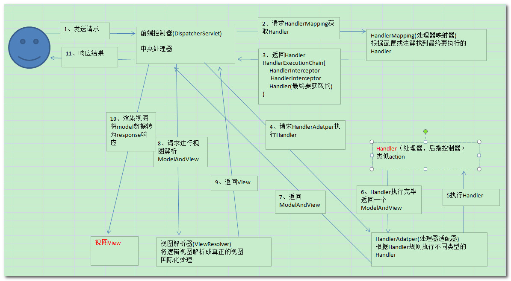
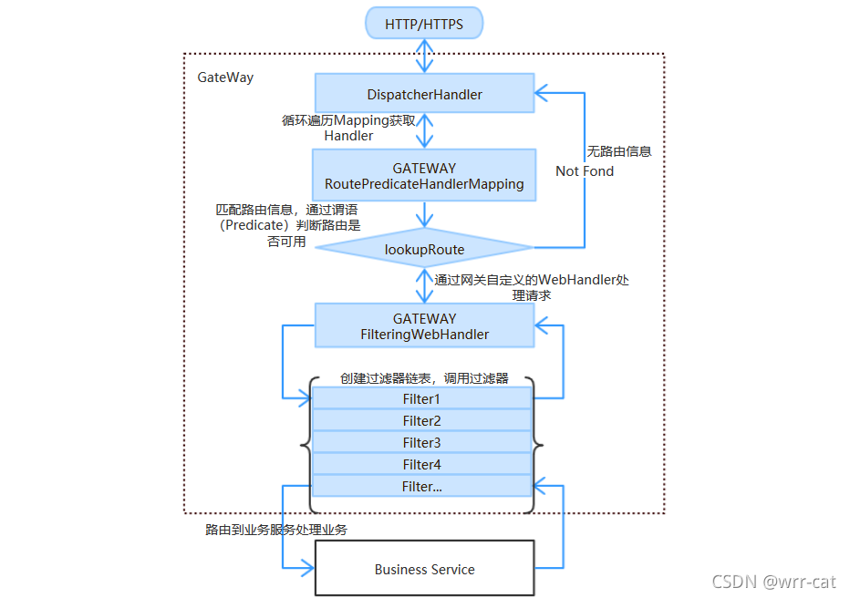

# 从Zuul到GateWay：响应式编程在网关设计中的优势

## 引言

在微服务架构中，API网关是一个非常重要的组件，它负责请求的**路由**、**负载均衡**、**安全控制**、**限流**等功能。Spring Cloud生态系统中，Zuul和Spring Cloud Gateway是两个常用的网关解决方案。随着技术的发展，Spring Cloud Gateway逐渐取代了Zuul，成为更主流的网关选择。本文将从Zuul到GateWay的演变出发，结合传统Web的缺陷和WebFlux的优点，探讨响应式编程在网关设计中的好处，并通过代码分析GateWay的工作流程，以及它与传统SpringMVC模式的差异。

## 1. 从Zuul到GateWay的演变

### 1.1 Zuul的局限性

Zuul是**Netflix**开源的API网关，早期在Spring Cloud生态中得到了广泛应用。Zuul基于**Servlet** 2.5（阻塞IO）构建，虽然在后期的Zuul 2中引入了异步和非阻塞的支持，但Zuul 1.x版本仍然是阻塞式的，存在以下局限性：

- **阻塞IO模型**：Zuul 1.x基于Servlet API，使用的是阻塞IO模型，每个请求都会占用一个线程，导致在高并发场景下线程资源消耗严重。
- **扩展性差**：Zuul的过滤器机制虽然灵活，但在复杂场景下，过滤器的配置和管理变得复杂，且性能开销较大。
- **缺乏对响应式编程的支持**：Zuul 1.x无法充分利用现代响应式编程的优势，难以应对高并发、低延迟的场景。

### 1.2 Spring Cloud Gateway的诞生

为了克服Zuul的局限性，Spring Cloud推出了Spring Cloud Gateway。Gateway基于Spring 5、Project Reactor和Spring Boot 2构建，完全支持响应式编程模型。相较于Zuul，Gateway具有以下优势：

- **非阻塞IO模型**：**Gateway基于Netty构建，使用非阻塞IO模型，能够更好地处理高并发请求。**
- **响应式编程支持**：**Gateway基于Reactor库，支持响应式编程，能够更高效地处理请求和响应。**
- **灵活的谓词和过滤器**：Gateway提供了丰富的谓词（**Predicate**）和过滤器（**Filter**）机制，能够轻松实现**路由、限流、熔断**等功能。

## 2. 传统Web的缺陷与WebFlux的优点

### 2.1 传统Web的缺陷

传统的Spring MVC基于Servlet API，使用的是阻塞IO模型。**每个请求都会占用一个线程**，直到**请求处理完成才会释放线程**。这种模型在**高并发场景**下存在以下问题：

- **线程资源消耗**：每个请求都会占用一个线程，线程的创建和销毁开销较大，且线程数量有限，容易成为系统瓶颈。
- **响应延迟**：阻塞IO模型下，线程在等待IO操作（如数据库查询、远程调用）时会一直阻塞，导致响应时间变长。
- **扩展性差**：随着并发量的增加，系统的扩展性受到限制，难以应对突发的高流量。

### 2.2 WebFlux的优点

Spring WebFlux是**Spring 5引入的响应式编程框架**，基于Reactor库构建，支持非阻塞IO模型。相较于传统的Spring MVC，WebFlux具有以下优点：

- **非阻塞IO**：WebFlux使用非阻塞IO模型，能够在少量线程的情况下处理大量并发请求，减少线程资源消耗。
- **高并发支持**：由于非阻塞IO的特性，WebFlux能够更好地应对高并发场景，提升系统的吞吐量和响应速度。
- **响应式编程**：WebFlux支持响应式编程模型，能够更灵活地处理异步数据流，提升系统的响应性和可扩展性。

## 3. 响应式编程在网关设计中的好处

在网关设计中，响应式编程带来了以下好处：

- **高并发处理能力**：网关作为系统的入口，需要处理大量的并发请求。响应式编程基于非阻塞IO模型，能够在少量线程的情况下处理大量请求，提升系统的并发处理能力。
- **低延迟**：响应式编程能够更高效地处理请求和响应，减少线程阻塞时间，降低系统的响应延迟。
- **资源利用率高**：由于非阻塞IO的特性，响应式编程能够更充分地利用系统资源，减少线程切换和上下文切换的开销。
- **更好的可扩展性**：响应式编程模型能够更好地应对突发的高流量，提升系统的可扩展性。

## 4. Spring Cloud Gateway的工作流程与代码分析

### 4.1 Spring Cloud Gateway的工作流程

Spring Cloud Gateway的核心组件包括：

- **Route（路由）**：**定义请求的路由规则**，包**括目标URI、谓词和过滤器**。
  - **Predicate（谓词）**：用于**匹配请求的条件**，决定**是否将请求路由**到指定的目标URI。
  - **Filter（过滤器）**：用于在请求处理过程中执行一些操作，如**修改请求头、限流、熔断**等。


Gateway的工作流程如下：

1. **请求到达网关**：客户端发送请求到网关。
2. **路由匹配**：网关根据配置的路由规则，匹配请求的**谓词**，找到对应的路由。
3. **过滤器链处理**：请求经过一系列的**过滤器链**，执行预处理操作。
4. **转发请求**：网关将请求转发到**目标服务**。
5. **响应处理**：目标服务返回响应，网关将响应经过**过滤器链处理**后返回给客户端。

### 4.2 代码分析

下面通过一个简单的代码示例，分析Spring Cloud Gateway的工作流程。

#### 4.2.1 路由配置

首先，我们配置一个简单的路由规则：

```java
@Bean
public RouteLocator customRouteLocator(RouteLocatorBuilder builder) {
    return builder.routes() // localhost:8080/api/test
        .route("path_route", r -> r.path("/api/**")
            .filters(f -> f.addRequestHeader("X-Request-Id", "123456"))
            .uri("http://httpbin.org")) // 其实一般是跳转到我的某个资源服务 APIModule UserModule
        .build();
}
```

在这个配置中，我们定义了一个路由规则，匹配路径为`/api/**`的请求，并添加一个请求头`X-Request-Id`，然后将请求转发到`http://httpbin.org`。

#### 4.2.2 过滤器链处理

Gateway提供了丰富的过滤器，可以在请求处理过程中执行一些操作。例如，我们可以自定义一个全局过滤器：

```java
@Component
public class CustomGlobalFilter implements GlobalFilter {
    @Override
    public Mono<Void> filter(ServerWebExchange exchange, GatewayFilterChain chain) {
        // 在请求处理前执行一些操作
        exchange.getRequest().mutate().header("X-Custom-Header", "custom-value");
        return chain.filter(exchange).then(Mono.fromRunnable(() -> {
            // 在请求处理后执行一些操作
            exchange.getResponse().getHeaders().add("X-Response-Header", "response-value");
        }));
    }
}
```

在这个过滤器中，我们在请求处理前添加了一个自定义请求头`X-Custom-Header`，在请求处理后添加了一个自定义响应头`X-Response-Header`。

#### 4.2.3 请求转发与响应处理

Gateway会根据配置的路由规则，将请求转发到目标服务。目标服务返回响应后，Gateway会将响应经过过滤器链处理后返回给客户端。

### 4.3 与传统SpringMVC模式的差异

#### 4.3.1 业务流程对比

- **SpringMVC模式**：
  1. 请求到达DispatcherServlet。
  2. DispatcherServlet根据请求路径找到对应的Controller。
  3. Controller处理请求并返回响应。
  4. 响应经过视图解析器处理后返回给客户端。

- **Spring Cloud Gateway模式**：
  1. 请求到达Gateway。
  2. Gateway根据路由规则匹配请求，找到对应的路由。
  3. 请求经过过滤器链处理。
  4. Gateway将请求转发到目标服务。
  5. 目标服务返回响应，Gateway将响应经过过滤器链处理后返回给客户端。

#### 4.3.2 差异分析

- **线程模型**：SpringMVC基于阻塞IO模型，每个请求占用一个线程；而Gateway基于非阻塞IO模型，能够在少量线程的情况下处理大量请求。
- **响应式编程**：SpringMVC不支持响应式编程，而Gateway基于Reactor库，支持响应式编程，能够更高效地处理请求和响应。
- **扩展性**：Gateway的非阻塞IO模型和响应式编程支持，使其在高并发场景下具有更好的扩展性。

## 结论

从Zuul到Spring Cloud Gateway的演变，反映了微服务架构中网关设计的进步。Spring Cloud Gateway基于响应式编程模型，能够更好地应对高并发、低延迟的场景，提升系统的性能和可扩展性。通过代码分析，我们可以看到Gateway的工作流程与传统SpringMVC模式的差异，以及响应式编程在网关设计中的优势。随着微服务架构的普及，Spring Cloud Gateway将成为更主流的网关选择。