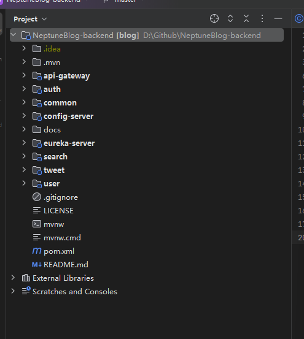
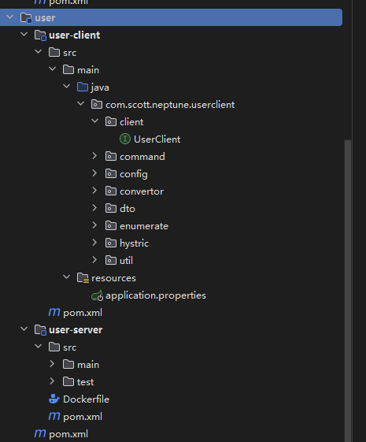

# 一：了解基础的微服务项目架构功能



**我们需要将框架组件与业务服务进行严格的区分：**

**先说结论：**我们会将单个的服务,拆分为两个部分-Client与Server。其中Client负责接收前端传递的信息，并且进行处理。而Server负责全部的逻辑层运算与持久层处理。所以你会发现：在任何一个服务模块中，client的dependency是很少的，而server的dependency一般较多。**说明server的业务复杂度更高**

- **框架组件：**
  - **eureka-server：**服务注册中心
    - spring-cloud-starter-netflix-eureka-server
    - spring-boot-starter-actuator
  - **config-server：**配置文件服务器
    - spring-cloud-config-server
    - spring-cloud-starter-netflix-eureka-client
    - spring-cloud-config-monitor
    - spring-cloud-starter-bus-amqp
    - spring-boot-starter-actuator
  - **api-gateway：**整个项目的网关-使用zuul
    - spring-cloud-starter-netflix-eureka-client
    - spring-cloud-starter-netflix-zuul
    - spring-cloud-config-client
    - spring-cloud-starter-bus-amqp
    - spring-cloud-starter-zipkin
    - spring-boot-starter-security
    - spring-security-test
    - spring-boot-starter-actuator
- 业务组件：
  - **common**(封装基础逻辑)
    - spring-boot-starter-web
    - spring-boot-starter-aop
    - spring-boot-starter-data-redis
    - spring-boot-starter-cache
    - spring-boot-starter-validation
    - spring-cloud-starter-openfeign
  - **search**(本质是一个eureka-client)
    - common
    - user-client
    - tweet-client
    - auth-client
    - spring-cloud-starter-netflix-eureka-client
    - spring-cloud-starter-netflix-hystrix
    - spring-cloud-starter-netflix-hystrix-dashboard
    - spring-cloud-config-client
    - spring-cloud-starter-bus-amqp
    - spring-cloud-starter-stream-rabbit
    - spring-cloud-starter-zipkin
    - spring-boot-starter-actuator
  - **tweet**(本质是一个eureka-client)
    - **tweet-client**
      - common
      - user-client
    - **tweet-server**
      - common
      - user-client
      - tweet-client
      - auth-client
      - spring-cloud-starter-netflix-eureka-client
      - spring-cloud-starter-netflix-hystrix
      - spring-cloud-starter-netflix-hystrix-dashboard
      - spring-cloud-config-client
      - spring-cloud-starter-bus-amqp
      - spring-cloud-starter-stream-rabbit
      - spring-cloud-starter-zipkin
      - spring-boot-starter-data-redis
      - spring-boot-starter-data-jpa
      - mysql-connector-java
      - spring-boot-starter-actuator
  - **user**(本质是一个eureka-client)
    - **user-client**
      - common
    - **user-server**
      - common
      - user-client
      - auth-client
      - spring-cloud-starter-netflix-eureka-client
      - spring-cloud-starter-netflix-hystrix
      - spring-cloud-starter-netflix-hystrix-dashboard
      - spring-cloud-config-client
      - spring-cloud-starter-bus-amqp
      - spring-cloud-starter-stream-rabbit
      - spring-cloud-starter-zipkin
      - spring-boot-starter-data-redis
      - spring-boot-starter-data-jpa
      - mysql-connector-java
      - spring-boot-starter-actuator
  - **auth**
    - **auth-client**
      - common(我们自己写的)
      - user-client(我们自己写的)
      - jjwt（io.jsonwebtoken）
    - **auth-server**(从依赖就能看出来-**到底谁在干活**)
      - common（自己写的模块）
      - user-client（自己写的模块）
      - auth-client（自己写的模块）
      - spring-cloud-starter-netflix-eureka-client
      - spring-cloud-starter-netflix-hystrix
      - spring-cloud-starter-netflix-hystrix-dashboard
      - spring-cloud-config-client
      - spring-cloud-starter-bus-amqp
      - spring-cloud-starter-stream-rabbit
      - spring-cloud-starter-zipkin
      - spring-boot-starter-security
      - spring-security-test
      - spring-boot-starter-actuator

> 
>
> ### 1. **spring-cloud-starter-bus-amqp**
>
> - **功能**：Spring Cloud Bus 是一个用于连接多个服务实例的工具，支持广播消息。通过与 AMQP（如 RabbitMQ）结合使用，它可以在微服务架构中传播事件和状态更新。
> - **用途**：
>   - 在分布式系统中传播配置变更，例如配置更新、服务状态变化等。
>   - 实现服务之间的事件驱动通信，例如服务实例之间共享某些事件（如链路追踪、熔断状态等）。
>
> ### 2. **spring-cloud-starter-zipkin**
>
> - **功能**：Zipkin 是一个分布式跟踪系统，能够收集和查看微服务之间的请求链路。此依赖是 Spring Cloud 对 Zipkin 的支持，使得微服务可以自动收集跟踪数据。
> - **用途**：
>   - 监控和跟踪请求在多个微服务中的流转，帮助识别瓶颈和延迟。
>   - 通过可视化的界面查看请求的调用链，有助于排查问题和优化性能。
>
> ### 3. **spring-boot-starter-security**
>
> - **功能**：Spring Security 是一个强大的认证和授权框架。这个起步依赖包含了 Spring Security 的基本配置和功能。
> - **用途**：
>   - 保护微服务应用，提供基于角色的访问控制。
>   - 实现用户身份验证、会话管理和安全配置。
>   - 处理常见的安全需求，如 CSRF 防护、HTTP Basic Auth、OAuth2 等。
>
> ### 4. **spring-security-test**
>
> - **功能**：这是一个用于测试 Spring Security 应用的工具包，提供了一些便于编写和执行安全相关测试的功能。
> - **用途**：
>   - 在单元测试和集成测试中方便地设置和验证安全配置。
>   - 支持模拟用户认证和权限，方便测试受保护的资源。
>   - 提供测试支持类，简化了与 Spring Security 相关的测试工作。
>
> ### 5. **spring-boot-starter-actuator**
>
> - **功能**：Spring Boot Actuator 提供了一系列生产级功能，用于监控和管理 Spring Boot 应用。这些功能包括健康检查、指标收集、应用状态等。
> - **用途**：
>   - 提供应用的健康检查端点，方便监控应用是否正常运行。
>   - 收集应用的运行指标，如内存使用情况、线程信息等，便于性能监控和优化。
>   - 提供自定义的管理端点，可以方便地管理和监控应用。
>
> 

# 二：在具体的服务模块中-Client与Server的交互

## 1.XXX-Client的client包



1. 以User服务为例，存在user-client与user-server两个子服务。
2. 其中user-client负责处理前端传入的请求，并且进行简单处理。
3. 然后通过feign客户端传递处理后的请求到server，进行最严格的逻辑层处理与持久层储存。

## 2.User-client的内容含义

1. **client包**
  用途：这个包通常包含与其他微服务进行 HTTP 或其他协议通信的客户端代码。通过使用 RESTful API 或 gRPC 等技术，与其他服务进行交互。
  例子：可能包含用来发送用户数据的 API 客户端、获取用户信息的客户端方法等。
2. **config包**
  用途：用于存放配置相关的类，可能涉及配置文件的加载、服务发现、负载均衡等。
  例子：可以包含 Spring Cloud Config 的配置类，或者定义服务间通信所需的配置。
3. **command包**
  用途：通常用于实现命令模式，尤其在使用像 Netflix Hystrix 这样的工具时，用于封装对外部服务的调用逻辑。
  例子：可能包含具体的命令类，用于在 Hystrix 中执行远程调用，并在失败时提供后备逻辑。
4. **dto包**
  用途：包含数据传输对象 (DTO)，用于在服务之间传递数据。这有助于将内部数据模型与外部接口解耦。
  例子：定义用户信息的 DTO 类，以便在用户服务与其他服务之间传输用户数据。
5. **enumerate包**
  用途：通常包含枚举类，定义一些固定的常量，便于代码中使用。
  例子：可以定义用户角色、状态等的枚举值。
6. **util包**
  用途：存放一些通用的工具类和方法，这些方法可能在不同的服务和模块中复用。
  例子：常用的字符串处理、日期转换、加密等工具方法。
7. **hystrix包**
  用途：用于配置和管理 Hystrix 的断路器功能，以提高微服务的健壮性和可用性。
  例子：可以包含对远程调用的 Hystrix 配置，定义超时时间、隔离策略、回退逻辑等。

## 3.Client包的工作流程

1. 请求初始化
调用端：在你的服务代码中，通过注入 UserClient 接口来发起对用户服务的调用。

2. Feign 客户端代理
代理生成：Feign 会生成 UserClient 接口的实现，并在调用 getUserById 方法时，将请求构建为 HTTP 请求。Feign 使用 Spring 的代理机制来实现这一点。
3. 请求配置
URL：Feign 使用 name = "user-server" 作为服务发现的标识。通常，它会在注册中心（如 Eureka）中查找相应的服务实例。
配置：通过 configuration = FeignConfig.class 指定的配置类，Feign 可以使用自定义的设置，比如超时、编码、解码器等。
回退机制：通过 fallbackFactory = UserClientFallbackFactory.class，你可以指定一个回退工厂，这样在调用失败时可以返回默认的响应或处理错误。
4. 服务发现
服务定位：Feign 会通过服务发现机制（如 Eureka、Consul）找到名为 user-server 的服务实例，并根据负载均衡策略（如轮询、随机等）选择具体的实例。
5. HTTP 请求
发送请求：Feign 会根据接口方法的注解（如 @GetMapping）构建 HTTP 请求，设置请求方法（GET/POST）及路径参数，然后发送到用户服务的具体地址。
6. 接收响应
处理响应：用户服务接收到请求后，处理该请求并返回相应的响应。Feign 将该响应转换为 UserDto 对象（如果有相应的转换逻辑）。
7. 回退处理
失败情况：如果请求失败（如超时、404、500等），Feign 会使用你提供的 UserClientFallbackFactory 来返回默认值或处理逻辑。这个工厂可以返回实现了 UserClient 接口的类，提供一个后备方案。
8. 响应返回
  返回结果：最终，调用 getUser 方法的地方将获得 UserDto 对象或者 fallback 返回的对象。

  ```
   2. 完整的请求流程图示
        调用端
      |
       v
        UserClient (Feign Client)
      |
       v
        生成代理
      |
       v
        构建HTTP请求
      |
       v
        服务发现 (Eureka)
      |
       v
        选择服务实例
      |
       v
        发送请求
      |
       v
        用户服务处理请求
      |
       v
        返回响应
      |
       v
        处理响应 (转换为 UserDto)
      |
       v
        回退处理 (如需要)
      |
      v
       返回结果
  
  
  ```
  
  