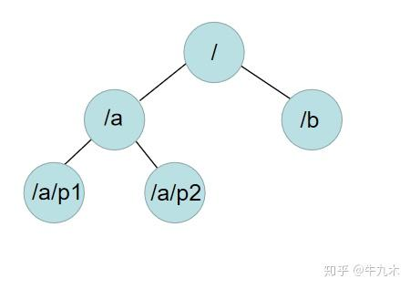
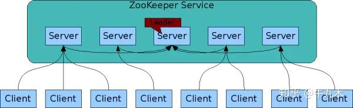
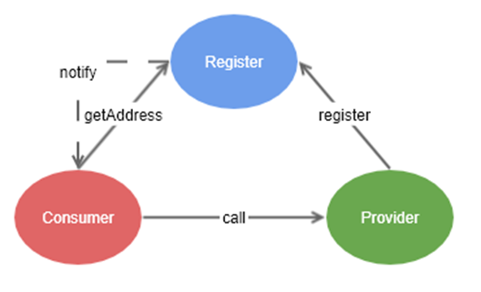
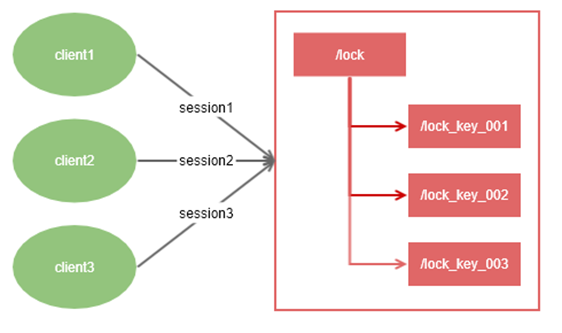
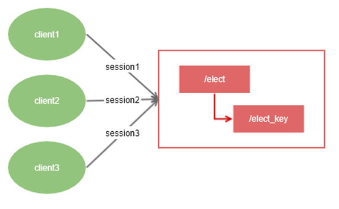

# 零：我们能用ZooKeeper干什么？

## 1.介绍

**ZooKeeper是一个分布式服务协调框架**，提供了分布式数据一致性的解决方案，基于ZooKeeper的**数据结构，Watcher，选举机制**等特点，可以**实现数据的发布/订阅，[软负载均衡](https://zhida.zhihu.com/search?content_id=123463400&content_type=Article&match_order=1&q=软负载均衡&zhida_source=entity)，命名服务，统一配置管理，分布式锁，集群管理**等等。

ZooKeeper能保证：

- 更新请求顺序进行。来自同一个client的更新请求按其发送顺序依次执行
- 数据更新原子性。一次数据更新要么成功，要么失败
- **全局唯一数据视图**。client无论连接到哪个server，数据视图都是一致的
- **实时性**。在一定时间范围内，client读到的数据是最新的

ZooKeeper的数据结构和Unix文件系统很类似，总体上可以看做是一棵树，每一个节点称之为一个ZNode，每一个ZNode**默认能存储1M的数据**。每一个ZNode可**通过唯一的路径标识**。如下图所示：



创建ZNode时，可以指定以下四种类型，包括：

- **PERSISTENT，持久性ZNode**。创建后，即使客户端与服务端断开连接也不会删除，只有客户端主动删除才会消失。
- **PERSISTENT_SEQUENTIAL，持久性顺序编号ZNode**。和持久性节点一样不会因为断开连接后而删除，并且ZNode的编号会自动增加。
- **EPHEMERAL，临时性ZNode**。客户端与服务端断开连接，该ZNode会被删除。
- **EPEMERAL_SEQUENTIAL，临时性顺序编号ZNode**。和临时性节点一样，断开连接会被删除，并且ZNode的编号会自动增加。

Watcher是基于**[观察者模式](https://zhida.zhihu.com/search?content_id=123463400&content_type=Article&match_order=1&q=观察者模式&zhida_source=entity)**实现的一种机制。如果我们需要实现当某个ZNode节点发生变化时收到通知，就可以使用Watcher监听器。

**客户端通过设置监视点（watcher）向 ZooKeeper 注册需要接收通知的 [znode](https://zhida.zhihu.com/search?content_id=123463400&content_type=Article&match_order=1&q=znode&zhida_source=entity)，在 znode 发生变化时 ZooKeeper 就会向客户端发送消息**。

**这种通知机制是一次性的**。一旦watcher被触发，ZooKeeper就会从相应的存储中删除。如果需要不断监听ZNode的变化，可以在收到通知后再设置新的watcher注册到ZooKeeper。（**这种一次性的劣势,使得我们转向了ZkClient与Curator这种客户端**）

监视点的类型有很多，如**监控ZNode数据变化、监控ZNode子节点变化、监控ZNode 创建或删除**。


ZooKeeper是一个高可用的应用框架，因为ZooKeeper是支持集群的。ZooKeeper在集群状态下，[配置文件](https://zhida.zhihu.com/search?content_id=123463400&content_type=Article&match_order=1&q=配置文件&zhida_source=entity)是不会指定Master和Slave，而是在ZooKeeper服务器初始化时就在内部进行选举，产生一台做为Leader，多台做为Follower，并且遵守半数可用原则。

由于遵守半数可用原则，所以5台服务器和6台服务器，实际上最大允许宕机数量都是3台，所以为了节约成本，**集群的服务器数量一般设置为奇数**。

如果在运行时，**如果长时间无法和Leader保持连接的话，则会再次进行选举，产生新的Leader，以保证服务的可用**。




## 2.ZooKeeper的应用场景

#### 注册中心

*注册中心模型*

- 依赖于**临时节点** 
- 消费者启动的时候，会先去注册中心中全量拉取服务的注册列表。
- 当某个服务节点有变化的时候，通过**监听机制**做数据更新。
- zookeeper挂了，不影响消费者的服务调用。

目前还有个比较流行的服务Eureka也可以做注册中心，他们有什么优势和劣势呢？留个疑问，哈哈哈。

#### 分布式锁

*分布式锁*

- 依赖于**临时顺序节点** 
- 判断当前client的顺序号是否是最小的，如果是获取到锁。
- 没有获取到锁的节点监听最小节点的删除事件（比如lock_key_001）
- 锁释放，最小节点删除，剩余节点重新开始获取锁。
- 重复步骤二到四。

redis和db也能创建分布式锁，哪有什么异同呢？留个疑问，哈哈哈。

#### 集群管理与master选举

*集群管理与master选举*

- 依赖于**临时节点** 
- zookeeper保证**无法重复创建一个已存在的数据节点**，创建成功的client为master。
- 非master，在已经创建的节点上**注册节点删除事件**监听。
- 当master挂掉后，其他集群节点收到节点删除事件，进行重新选举
- 重复步骤二到四

当然还有其他应用场景，不一一列举了。


到这里，可以基本上满足基于zk应用开发的理论知识储备。对原理或有更强求知欲的小伙伴可以继续往下看，接下来聊聊zookeeper如何做到高性能高可用强一致性的。

# 一：Zookeeper的安装工作

**[Zookeeper详解（从安装—入门—使用）-CSDN博客](https://blog.csdn.net/qq_52595134/article/details/123467180)**

倘若上述的网页内容被删除了,你可以使用同级目录中的快照对其进行了解。

这里我们补充一些在安装Zookeeper过程中,你需要学习的Linux命令

> A.Linux的权限并非是子目录继承父目录的..譬如chmod 777 /opt了,但是/opt/zookeeper这个目录是没有rwx权限的.你如果想在该目录上传内容,得单独chmod 777 /opt/zookeeper .当然,上述的操作得是sudo状态的
>
> B.tar用来解压和压缩：-z是使用gzip算法工作。处理.tar.gz格式或者.tgz的压缩包;-x表示解压-extract ;-v表示verbose详细输出解压的内容;-f表示要解压的文件名,注意-f得最后用
>
> C.`cp zoo-sample.cfg zoo.cfg`复制一份前者,新文件命名为后者.
>
> D.vim相关操作：vim 文件名->打开;按i进入插入模式,按ESC退出模式;ESC后输出:wq保存退出vim
>
> E.sh脚本通常通过./zkServer.sh start来启动.此处的./表示当前目录.start是一个参数,恰好脚本用这个参数来决定启动

# 二：Zookeeper体验

很好，既然你已经成功启动了 Zookeeper 实例，接下来我会提供一些常见的命令来帮助你体验 Zookeeper 的完整使用流程，包括如何连接到 Zookeeper、创建和管理节点、查看状态等操作。

### 1. **连接到 Zookeeper 服务**
首先，确保你已经启动了 Zookeeper 服务。可以使用 `zkCli.sh`（Zookeeper 客户端工具）连接到 Zookeeper 服务：

```bash
./zkCli.sh -server 127.0.0.1:2181
```
这里 `127.0.0.1:2181` 是 Zookeeper 默认的服务器地址和端口，若你使用了其他地址或端口，请替换成对应的地址。

### 2. **查看 Zookeeper 节点数据（查看节点路径）**
连接到 Zookeeper 后，你可以执行以下命令来查看当前节点的数据和状态。

- **查看根节点数据：**
  ```bash
  ls /
  ```
  这将列出根路径下的所有子节点。

- **查看某个节点下的子节点：**
  ```bash
  ls /znode_path
  ```
  将 `/znode_path` 替换成你想查看的实际路径。如果该节点存在，它将返回该节点下的所有子节点。

- **查看某个节点的数据：**
  ```bash
  get /znode_path
  ```
  这个命令会显示指定路径节点的数据内容。

### 3. **创建一个新的节点**
你可以使用 `create` 命令在 Zookeeper 中创建一个新的节点，并为其设置数据。

- **创建一个临时节点：**
  ```bash
  create /myNode myData
  ```
  这将在 `/` 路径下创建一个名为 `myNode` 的节点，并设置其数据为 `myData`。如果 Zookeeper 服务断开，这个节点会被自动删除（临时节点）。

- **创建一个永久节点：**
  ```bash
  create -e /myPermanentNode myData
  ```
  `-e` 参数表示创建的是永久节点。如果 Zookeeper 服务断开，永久节点不会被删除。

### 4. **修改节点数据**
可以使用 `set` 命令来修改已有节点的数据：

```bash
set /myNode newData
```
这将把 `/myNode` 节点的数据从 `myData` 改为 `newData`。

### 5. **删除节点**
可以使用 `delete` 命令来删除指定的节点：

```bash
delete /myNode
```
这将删除 `/myNode` 节点。如果该节点有子节点，删除操作会失败，除非你先删除它的子节点。

### 6. **查看节点的状态信息**
Zookeeper 提供了一些命令来检查节点的状态。

- **查看节点的状态（包含版本、ACL 等信息）：**
  ```bash
  stat /znode_path
  ```
  这个命令会显示指定节点的详细信息，如版本号、数据长度、节点的ACL（访问控制列表）等。

### 7. **获取并修改节点的 ACL（访问控制）**
Zookeeper 支持对节点设置权限控制。你可以设置或查看节点的 ACL。

- **查看节点的 ACL：**
  ```bash
  getAcl /znode_path
  ```

- **设置节点的 ACL：**
  ```bash
  setAcl /znode_path world:anyone:cdrwa
  ```
  这个命令为 `/znode_path` 节点设置一个 ACL，表示任何人都可以对该节点执行 `create`、`delete`、`read`、`write` 和 `admin` 操作。

### 8. **查看 Zookeeper 集群的状态**
如果你运行的是一个集群环境，你可以使用以下命令来查看 Zookeeper 的集群状态和其他详细信息。

- **查看 Zookeeper 节点的状态：**
  ```bash
  stats
  ```
  这将显示 Zookeeper 服务器的当前统计信息，包括客户端连接数、节点数、内存使用等。

- **查看连接的客户端：**
  ```bash
  listclients
  ```

### 9. **退出 Zookeeper 客户端**
完成操作后，可以使用以下命令退出 Zookeeper 客户端：

```bash
quit
```

### 示例操作流程
下面是一个简单的 Zookeeper 使用流程，模拟创建一个临时节点、查看、修改和删除节点的过程：

```bash
# 启动 zkCli 并连接 Zookeeper 服务
./zkCli.sh -server 127.0.0.1:2181

# 查看根节点下的子节点
ls /

# 创建一个名为 /myTestNode 的临时节点
create /myTestNode "HelloZookeeper"

# 查看 /myTestNode 节点的数据
get /myTestNode

# 修改 /myTestNode 节点的数据
set /myTestNode "NewData"

# 查看修改后的节点数据
get /myTestNode

# 删除 /myTestNode 节点
delete /myTestNode

# 退出客户端
quit
```

通过这些操作，你可以体验到如何创建、管理和删除 Zookeeper 中的节点。希望这些命令对你有所帮助，了解更多 Zookeeper 的用法后，你可以扩展到更复杂的操作，例如分布式锁、配置管理等。

> 坦率的说：在`./zkCli.sh -server 127.0.0.1:2181`执行后,你执行命令的逻辑和Linux是类似的：譬如使用`ls /`来查看所有的子节点