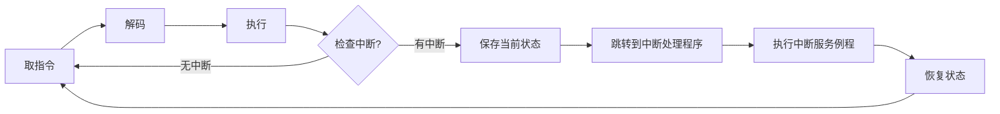
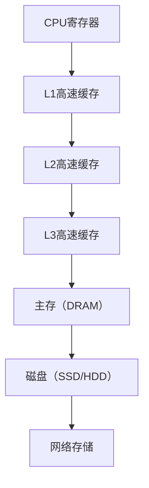
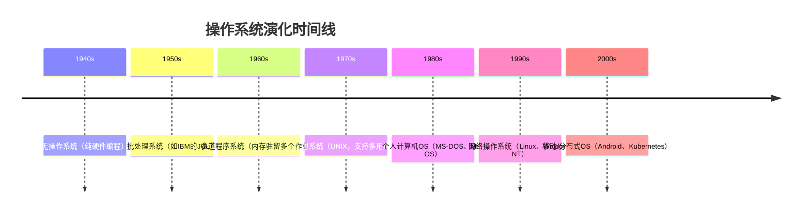

# 0.题型

A.选择题(20分，每题2分)

B.填空题(10分，每空2分)

C.简答题(30分，每小题6分)

D.综合体(40分，每小题10分)

# 1.计算机系统

## A.基本构成

> ### **1. 处理器（CPU）**
>
> #### **核心组成**
>
> - 运算器（ALU）
>   - 功能：算术运算（加减乘除）、逻辑运算（与或非）
>   - 关键部件：加法器、移位器、多路选择器
> - 控制器（CU）
>   - 功能：取指、译码、执行、写回（指令周期）
>   - 关键部件：程序计数器（PC）、指令寄存器（IR）、时序发生器
> - 寄存器组
>   - 通用寄存器（AX, BX等）、专用寄存器（PC, SP, PSW等）
>   - 作用：暂存数据、地址或状态，加速访问。
>
> #### **重要概念**
>
> - **指令系统**：CISC vs RISC、指令格式（操作码+地址码）
> - **流水线技术**：五级流水（取指、译码、执行、访存、写回）、冲突处理（数据/控制/结构冲突）
> - **多核处理器**：并行处理、缓存一致性（MESI协议）
>
> ------
>
> ### **2. 内存（存储器系统）**
>
> #### **层次结构**
>
> - Cache（高速缓存）
>
>   
>
>   - 作用：缓解CPU与主存速度差异
>   - 映射方式：直接映射、组相联、全相联
>   - 替换算法：LRU、FIFO
>
> - 主存（RAM/ROM）
>
>   - RAM类型：SRAM（快、贵）、DRAM（慢、廉价，需刷新）
>   - ROM类型：PROM、EPROM、Flash Memory
>
> - **辅存**：磁盘、SSD（非易失性）
>
> #### **关键问题**
>
> - **地址映射**：逻辑地址→物理地址（页表、TLB快表）
> - **存储器扩展**：位扩展（增加字长）、字扩展（增加容量）
> - **性能指标**：存取时间、带宽、容量
>
> ------
>
> ### **3. 输入输出模块（I/O系统）**
>
> #### **I/O设备与接口**
>
> - **设备类型**：字符设备（键盘）、块设备（磁盘）、网络设备
> - **接口功能**：数据缓冲、信号转换、错误检测
> - **常见接口**：USB、SATA、PCIe
>
> #### **数据传输方式**
>
> - **程序控制I/O**：CPU轮询（效率低）
> - **中断驱动I/O**：设备发起中断请求（需中断向量表）
> - **DMA（直接存储器访问）**：由DMA控制器接管总线，减少CPU干预
> - **通道控制**：专用I/O处理器（大型机）
>
> #### **中断机制**
>
> - 中断类型：硬件中断（外设）、异常（内部错误）、软中断（INT指令）
> - 处理流程：保存现场→执行ISR→恢复现场
>
> ------
>
> ### **4. 系统总线**
>
> #### **总线类型与结构**
>
> - 按功能分类：
>   - 数据总线（双向传输数据）
>   - 地址总线（单向，CPU→内存/I/O）
>   - 控制总线（读写信号、中断请求等）
> - 按层次分类：
>   - 片内总线（CPU内部）
>   - 系统总线（主板级，如PCI）
>   - 通信总线（外部设备，如USB）
>
> #### **总线仲裁**
>
> - 集中式仲裁：
>   - 链式查询（优先级固定）
>   - 计数器定时查询（灵活性高）
>   - 独立请求（速度快，成本高）
> - **分布式仲裁**：设备自主竞争（如CAN总线）
>
> #### **总线标准**
>
> - 示例：PCIe（串行、高速）、ISA（早期并行）、SATA（存储设备）
>
> 

## B.微处理器的发展

> ### **B. 微处理器的发展**
>
> 微处理器的演进经历了从单核到多核、再到高度集成的片上系统（SoC）的过程，其发展主要分为以下三个阶段：
>
> ------
>
> #### **1. 单核处理器（Single-Core Processor）**
>
> - 
>
>   特点
>
>   ：
>
>   - 单个芯片上集成**一个完整的CPU核心**（运算器、控制器、寄存器等）。
>   - 通过提高主频（如从MHz到GHz）和优化指令集（如x86、ARM）提升性能。
>
> - 
>
>   局限性
>
>   ：
>
>   - **“频率墙”问题**：主频提升导致功耗和发热急剧增加（如Pentium 4的NetBurst架构）。
>   - **单线程瓶颈**：无法充分利用并行计算资源。
>
> ------
>
> #### **2. 多核处理器（Multi-Core Processor）**
>
> - 
>
>   特点
>
>   ：
>
>   - 单个芯片上集成**多个独立CPU核心**（如双核、四核、八核）。
>   - 通过**并行处理**（任务分配到不同核心）提升性能，而非单纯提高主频。
>
> - 
>
>   关键技术
>
>   ：
>
>   - **缓存一致性协议**（如MESI）：确保多核共享数据时的一致性。
>   - **核间通信**：通过片上总线（如Ring Bus）或片上网络（NoC）连接各核心。
>
> - 
>
>   优势
>
>   ：
>
>   - 能效比更高，适合多任务、多线程场景（如服务器、高性能计算）。
>
> - 
>
>   代表架构
>
>   ：
>
>   - Intel Core系列（如i7-12700K：12核）、AMD Ryzen系列（如16核的Ryzen 9）。
>
> ------
>
> #### **3. 片上系统（SoC, System on Chip）**
>
> - 特点：
>   - 将**CPU、GPU、内存控制器、I/O接口、专用加速器**等集成到单一芯片。
>   - 高度定制化，针对特定场景优化（如移动设备、物联网）。
> - 核心组件：
>   - **CPU多核集群**（如ARM的big.LITTLE架构）。
>   - **GPU**（图形处理单元，如Apple M系列芯片的集成GPU）。
>   - **专用加速器**（如NPU用于AI计算、DSP用于信号处理）。
>   - **外设控制器**（USB、PCIe、蓝牙等）。
> - 优势：
>   - **低功耗**：集成设计减少芯片间通信能耗。
>   - **小型化**：适合嵌入式设备（如智能手机、智能手表）。
> - 代表产品：
>   - 手机芯片：高通骁龙、苹果A/M系列、华为麒麟。
>   - 嵌入式芯片：树莓派使用的Broadcom SoC。
>
> ------
>
> ### **对比总结**
>
> | **发展阶段**       | **单核处理器**      | **多核处理器** | **片上系统（SoC）**      |
> | ------------------ | ------------------- | -------------- | ------------------------ |
> | **集成度**         | 单一CPU核心         | 多个CPU核心    | CPU+GPU+内存+I/O+加速器  |
> | **性能提升方式**   | 提高主频            | 并行多核处理   | 异构计算（CPU+专用硬件） |
> | **典型应用**       | 早期PC（如Pentium） | 现代PC、服务器 | 智能手机、物联网设备     |
> | **功耗与面积优化** | 较差                | 中等           | 极优（高度集成）         |

## C.指令的执行（重点）

> ### **1. 基本执行流程**
> ```mermaid
> graph LR
>     A[开始] --> B[取下一条指令]
>     B --> C[解码指令]
>     C --> D[执行指令]
>     D --> E{满足停止条件?}
>     E -- 否 --> B
>     E -- 是 --> F[停止]
> ```
>
> 1. 取指令（Fetch）  
>    • CPU从程序计数器（PC）指向的内存地址读取下一条指令。
>
>    • 读取后，PC自动递增（或根据指令长度调整），指向下一条指令地址。
>
>
> 2. 解码指令（Decode）  
>    • 指令被送入指令解码器，解析操作码（Opcode）和操作数（如寄存器、内存地址等）。
>
>    • 此阶段可能涉及微操作拆分（如CISC架构）。
>
>
> 3. 执行指令（Execute）  
>    • 算术逻辑单元（ALU）执行计算，或访问内存/寄存器。
>
>    • 可能触发：
>
>      ◦ 数据移动（如 `MOV`）
>
>      ◦ 算术运算（如 `ADD`）
>
>      ◦ 控制流跳转（如 `JMP`，此时修改PC）
>
>      ◦ I/O操作（需OS介入）
>
>
> 4. 检查停止条件  
>    • 通常由停机指令（HALT）或外部中断（如用户关闭程序）触发。
>
>
> ---
>
> ### **2. 关键扩展知识**
> #### **a) 流水线技术（Pipeline）**
> • 目标：提升吞吐量，通过并行化取指、解码、执行等阶段。
>
> • 冲突问题：
>
>   • 结构冲突：资源竞争（如同时访问内存）。
>
>   • 数据冲突：未完成的指令产生依赖（通过转发/旁路缓解）。
>
>   • 控制冲突：分支指令导致预测错误（需分支预测）。
>
>
> #### **b) 异常与中断处理**
> • 中断：外部事件（如I/O完成）触发，CPU保存现场后跳转至中断服务程序（ISR）。
>
> • 异常：指令执行错误（如除零），由OS处理（可能终止进程）。
>
> • 关键寄存器：程序状态字（PSW）记录中断/异常状态。
>
>
> #### **c) 特权级与系统调用**
> • 用户态→内核态：通过陷阱指令（如 `int 0x80`）触发系统调用，CPU切换到特权模式执行OS代码。
>
>
> #### **d) 多核与多线程**
> • 并行取指：多核CPU各有独立的PC和寄存器，但共享内存。
>
> • 超线程：单个核心通过时间片模拟多线程，共享ALU但独立维护上下文。
>
>
> ---
>
> ### **3. 常见考题方向**
> 1. 指令周期与时钟周期的关系？
>    • 一个指令周期可能包含多个时钟周期（尤其CISC）。
>
> 2. 直接寻址 vs 间接寻址对执行的影响？
>    • 间接寻址需多次访存，增加延迟。
>
> 3. 如何优化分支指令的性能？
>    • 答案可能涉及：分支预测缓冲、延迟槽（MIPS）、静态/动态预测。
>

## **D. 中断（重点）**

中断（Interrupt）是操作系统和计算机体系结构中的核心机制，它允许CPU暂停当前任务，转而去处理更高优先级的任务（如硬件事件、错误或系统调用），处理完成后恢复原任务。中断机制使得CPU能够高效响应外部事件，实现多任务调度、I/O管理和错误处理。

------

## **D.1 中断和指令周期**

### **1. 中断如何影响指令周期？**

在标准的 **取指-执行周期（Fetch-Execute Cycle）** 中，CPU按顺序执行指令，但中断会强制打断这个流程：



- **中断检测时机**：通常在**每条指令执行完成后**（部分架构允许在指令执行中间检测）。

- 

  中断响应

  ：

  - CPU检查**中断请求线（IRQ）**是否有信号。
  - 若有中断，暂停当前程序，保存**程序计数器（PC）**和**程序状态字（PSW）**（即上下文）。
  - 跳转到**中断向量表（Interrupt Vector Table）**指定的地址，执行中断服务例程（ISR）。

### **2. 中断 vs 异常 vs 陷阱**

| **类型**              | **触发源**               | **处理方式**             | **例子**                    |
| --------------------- | ------------------------ | ------------------------ | --------------------------- |
| **中断（Interrupt）** | 外部设备（如键盘、磁盘） | 异步，随机发生           | 键盘输入、定时器到期        |
| **异常（Exception）** | CPU执行指令时出错        | 同步，由错误指令触发     | 除零、非法指令、缺页        |
| **陷阱（Trap）**      | 程序主动触发             | 同步，用于系统调用或调试 | `int 0x80`（Linux系统调用） |

------

## **D.2 中断处理**

### **1. 中断处理流程**

1. **硬件自动完成**：
   - 保存 **PC** 和 **PSW**（程序状态字，包括标志寄存器）。
   - 关闭中断（防止嵌套中断干扰）。
   - 根据**中断类型号**查**中断向量表**，跳转到对应的 **ISR（中断服务例程）**。
2. **软件（OS）处理**：
   - **ISR** 执行具体任务（如读取键盘缓冲区、处理磁盘I/O完成）。
   - 可能涉及：
     - 保存更多寄存器（由OS代码完成）。
     - 调用内核函数（如唤醒等待I/O的进程）。
   - 执行 `IRET`（中断返回）指令，恢复现场，重新开放中断。

### **2. 关键数据结构**

- 

  中断向量表（IVT）

  ：

  - 存储不同中断号对应的ISR入口地址。
  - 例如，x86实模式下，`0x00`~`0xFF`对应256个中断。

- 

  中断描述符表（IDT）

  （保护模式）：

  - 更复杂，包含特权级、段选择子等信息。

### **3. 中断屏蔽**

- **CLI（Clear Interrupt）**：关闭中断（用于关键代码段，避免竞争）。
- **STI（Set Interrupt）**：重新开放中断。
- **优先级控制**：某些中断可被更高优先级中断打断（如时钟中断 > 磁盘中断）。

------

## **D.3 多个中断**

### **1. 处理多个中断的策略**

- 禁止嵌套：
  - 处理一个中断时，屏蔽所有其他中断（简单但低效）。
  - 适用于单核CPU或实时系统。
- 优先级嵌套：
  - 高优先级中断可打断低优先级中断（如硬件故障 > I/O中断）。
  - 需硬件支持（如**可编程中断控制器，PIC**或**APIC**）。

### **2. 中断优先级**

- **固定优先级**：硬件预先设定（如x86的IRQ0~IRQ15）。
- **动态优先级**：OS可调整（如Linux的`/proc/interrupts`）。
- 例子：
  - **最高优先级**：机器错误（不可屏蔽中断，NMI）。
  - **最低优先级**：普通外设（如鼠标）。

### **3. 中断冲突与解决**

- 共享中断线：
  - 多个设备共享同一IRQ（如PCI设备）。
  - ISR需轮询设备状态寄存器，确定中断源。
- 中断风暴：
  - 某个设备持续发送中断（如故障网卡）。
  - OS可能临时禁用该设备的中断。

------

## **总结**

- **中断是异步事件**，打破指令周期，强制CPU转去执行ISR。
- **中断处理需保存现场**，通过中断向量表跳转，最后恢复。
- **多个中断通过优先级管理**，高优先级可嵌套。
- **关键应用**：I/O完成通知、定时任务调度、系统调用（陷阱）。

**考题方向**：

1. 中断和异常的区别？9
2. 描述中断处理的全流程（硬件+软件）。
3. 如何设计中断优先级以优化系统响应速度？
4. 多个中断同时发生时，CPU如何决定处理顺序？

## **E. 存储器的层次结构**

计算机存储系统采用**层次化设计**，以平衡速度、容量和成本。通常分为以下几层（从上到下，速度递减、容量递增）：



### **1. 各层特性对比**

| **层级**         | **访问时间** | **容量**      | **成本/位** | **管理方** |
| ---------------- | ------------ | ------------- | ----------- | ---------- |
| **寄存器**       | 0.1~1 ns     | 几十~几百字节 | 最高        | 编译器/CPU |
| **L1缓存**       | 1~5 ns       | 几十KB~几百KB | 高          | 硬件       |
| **L2缓存**       | 5~20 ns      | 几百KB~几MB   | 中          | 硬件       |
| **L3缓存**       | 20~60 ns     | 几MB~几十MB   | 中低        | 硬件       |
| **主存（DRAM）** | 50~200 ns    | 几GB~几TB     | 低          | 操作系统   |
| **磁盘（SSD）**  | 50~100 μs    | 几百GB~几十TB | 极低        | 文件系统   |
| **网络存储**     | 1~100 ms     | 理论上无限    | 最低        | 分布式系统 |

### **2. 局部性原理（Locality）**

- **时间局部性**：最近访问的数据很可能再次被访问（如循环变量）。
- **空间局部性**：访问某个地址后，其附近地址也可能被访问（如数组遍历）。
- **层次结构依赖局部性**：高速缓存利用局部性存储热点数据，减少访问主存次数。

### **3. 关键问题**

- **缓存一致性**（多核场景）：如何确保多个CPU核心看到的缓存数据一致？（如MESI协议）
- **虚拟内存**：如何通过分页/分段机制扩展“可用内存”？（见后续章节）

------

## **F. 高速缓存（Cache）**

### **F.1 动机**

- **CPU与主存的速度差距**：现代CPU速度比DRAM快100倍以上，直接访问主存会导致CPU长时间等待。
- **解决方案**：在CPU和主存之间加入**高速缓存**，存储近期使用的数据副本。

### **F.2 高速缓存原理**

#### **1. 缓存基本结构**

- **缓存行（Cache Line）**：最小存储单位（通常64字节），每次加载/写入以行为单位。
- 地址划分：
  - **标记（Tag）**：标识主存数据块来源。
  - **索引（Index）**：定位缓存行位置（类似哈希表）。
  - **块偏移（Offset）**：定位行内具体字节。

#### **2. 缓存映射方式**

| **方式**       | **特点**                         | **冲突率** | **硬件成本**           |
| -------------- | -------------------------------- | ---------- | ---------------------- |
| **直接映射**   | 主存块固定映射到唯一缓存行       | 高         | 低                     |
| **全相联映射** | 主存块可放入任意缓存行           | 低         | 高（需并行比较所有行） |
| **组相联映射** | 主存块映射到特定组（组内全相联） | 中         | 中（如4路、8路）       |

#### **3. 缓存命中与缺失**

- **命中（Hit）**：所需数据在缓存中，直接访问（1~10周期）。
- 缺失（Miss）：数据不在缓存，需从主存加载（100+周期）。
  - 三种缺失类型：
    - **强制缺失（Compulsory）**：首次访问某数据必然缺失。
    - **冲突缺失（Conflict）**：因映射规则导致缓存行被替换。
    - **容量缺失（Capacity）**：缓存空间不足。

### **F.3 高速缓存设计**

#### **1. 写入策略**

| **策略**                    | **特点**                                         | **适用场景**               |
| --------------------------- | ------------------------------------------------ | -------------------------- |
| **写直达（Write-through）** | 同时写入缓存和主存，一致性高但速度慢             | 小缓存或需严格一致性的系统 |
| **写回（Write-back）**      | 仅写入缓存，置换时才写回主存，速度快但需脏位标记 | 大多数现代CPU              |

#### **2. 替换算法**

- **LRU（Least Recently Used）**：替换最久未使用的行（硬件实现复杂）。
- **FIFO**：替换最早进入的行（可能误删热点数据）。
- **随机替换**：简单但性能不稳定。

#### **3. 多级缓存设计**

- **L1缓存**：分拆为**指令缓存（I-Cache）**和**数据缓存（D-Cache）**，避免结构冲突。
- **L2/L3缓存**：共享缓存，容量更大，缓解L1缺失的惩罚。

#### **4. 缓存优化技术**

- **预取（Prefetching）**：预测未来访问模式，提前加载数据。
- **非阻塞缓存**：允许缺失时继续处理其他指令（乱序执行支持）。
- **牺牲缓存（Victim Cache）**：临时存储被替换的行，减少冲突缺失。

------

## **总结**

- **存储层次结构**：通过多级缓存弥补CPU与主存速度差距，依赖局部性原理。
- **缓存核心问题**：映射方式、写入策略、替换算法决定性能。
- **关键设计权衡**：速度 vs 一致性 vs 硬件成本。

**考题方向**：

1. 为什么需要多级缓存？L1和L3的设计差异？
2. 如何计算缓存命中率对平均访问时间的影响？
3. 组相联缓存中，增加“路数”会如何影响冲突缺失？
4. 写回缓存中“脏位”的作用是什么？

## **2. 操作系统概述**

### **A. 操作系统的目标和功能**

#### **1. 主要目标**

- **资源管理**：高效分配CPU、内存、I/O设备等硬件资源。
- **用户友好性**：提供抽象接口（如文件、进程），隐藏硬件复杂性。
- **系统稳定性**：防止程序错误导致整个系统崩溃（如内存隔离）。
- **安全性**：控制非法访问（如用户权限管理）。

#### **2. 核心功能**

| **功能**     | **说明**                                                     |
| ------------ | ------------------------------------------------------------ |
| **进程管理** | 创建、调度、同步进程/线程，处理死锁（如Linux的`fork()`和`schedule()`）。 |
| **内存管理** | 分配/回收内存，实现虚拟内存（如分页、分段）。                |
| **文件系统** | 管理磁盘数据，提供树状目录结构（如NTFS、ext4）。             |
| **设备管理** | 抽象硬件设备为文件（如`/dev/sda`），通过驱动控制（如USB、GPU）。 |
| **用户接口** | 提供CLI（Shell）或GUI（如Windows桌面）。                     |

------

### **B. 操作系统的演化（重点）**

#### **1. 关键发展阶段**



#### **2. 各阶段特点**

- **批处理系统**：
  - 顺序执行作业，无交互（如穿孔卡片输入）。
  - **缺点**：CPU利用率低（等待I/O时空闲）。
- **多道程序系统**：
  - 内存同时加载多个作业，CPU在I/O等待时切换任务。
  - **关键突破**：引入**中断**和**DMA**。
- **分时系统**：
  - 多用户通过终端共享主机（如UNIX），采用**时间片轮转调度**。
  - **成就**：首次实现交互式计算。
- **个人计算机OS**：
  - 单用户独占资源（如MS-DOS），简化设计。
- **现代OS**：
  - 支持多核、虚拟化（如Hyper-V）、容器化（Docker）。

------

### **C. 操作系统的主要成就（重点）**

#### **1. 进程与线程模型**

- **进程**：资源分配单位（独立地址空间）。
- **线程**：CPU调度单位（共享进程资源），提升并发性能。
- **案例**：Chrome浏览器为每个标签页开独立进程，避免单页崩溃影响整体。

#### **2. 虚拟内存**

- **分页机制**：将内存划分为固定大小的页（如4KB），通过页表映射到物理内存。

- 

  优势

  ：

  - 程序可使用比物理内存更大的地址空间。
  - 隔离进程内存（防止越界访问）。

#### **3. 文件系统抽象**

- **统一接口**：设备、磁盘、网络资源均抽象为文件（如Linux的`一切皆文件`）。
- **关键技术**：日志（Journaling）防止断电导致数据损坏（如ext3）。

#### **4. 微内核架构**

- **特点**：仅核心功能（进程调度、IPC）在内核态，其余（文件系统、驱动）运行在用户态。
- **代表系统**：QNX、华为鸿蒙OS。

------

### **D. 现代操作系统的特征**

#### **1. 多任务与多用户**

- **抢占式调度**：OS强制收回CPU（如Linux的CFS调度器）。
- **权限分级**：用户态（受限） vs 内核态（完全控制）。

#### **2. 对称多处理（SMP）**

- 多核CPU共享内存，OS需处理**缓存一致性**（如MESI协议）。

#### **3. 分布式支持**

- **网络协议栈**：内置TCP/IP（如Windows的Winsock）。
- **分布式文件系统**：如Google的GFS、Hadoop HDFS。

#### **4. 安全机制**

- **ASLR（地址空间随机化）**：防止缓冲区溢出攻击。
- **沙盒（Sandboxing）**：限制应用权限（如Android的App隔离）。

#### **5. 虚拟化与云原生**

- **虚拟机监控器（VMM）**：如VMware、KVM。
- **容器化**：轻量级隔离（Docker利用cgroups和命名空间）。

------

## **总结**

- **操作系统目标**：管理资源、提供抽象、保障安全。
- **演化主线**：从批处理到分时，再到分布式和移动化。
- **核心成就**：进程模型、虚拟内存、文件系统、微内核。
- **现代特征**：多核支持、安全强化、云原生集成。

**考题方向**：

1. 分时系统如何解决批处理系统的缺陷？
2. 虚拟内存如何实现内存隔离和扩展？
3. 微内核相比宏内核的优缺点？
4. 现代OS如何应对Spectre等硬件安全漏洞？

# 3. 进程

## A. 什么是进程 (重点)
进程是正在执行的程序，包括程序代码、当前状态以及内存和 CPU 时间等资源。它是操作系统中执行的基本单位，包含程序计数器、寄存器、堆栈和数据。进程是动态实体，由操作系统管理以确保资源的高效分配和执行。

## B. 进程的状态
进程在以下状态间转换：
- **新建 (New)**：进程正在被创建。
- **就绪 (Ready)**：进程等待 CPU 分配。
- **运行 (Running)**：进程在 CPU 上执行。
- **等待/阻塞 (Waiting/Blocked)**：进程等待某事件（如 I/O 完成）。
- **终止 (Terminated)**：进程完成执行或被终止。

## C. 进程描述 - 操作系统和进程的控制结构 (重点)
操作系统通过**进程控制块 (PCB)** 管理进程，PCB 包含：
- **进程标识符 (PID)**

- **进程状态**

- **程序计数器、寄存器内容**

- **内存分配信息**

- **CPU 调度信息（如优先级）**

- **I/O 状态信息**

  PCB 是操作系统跟踪和管理进程的核心数据结构。

## D. 进程的控制
进程控制包括：
- **创建**：分配资源，初始化 PCB。
- **调度**：决定哪个进程获得 CPU。
- **上下文切换**：保存当前进程状态，加载新进程状态。
- **终止**：释放资源，移除 PCB。
- **通信**：进程间通过消息传递或共享内存通信。

## E. 操作系统的执行 (重点)
操作系统通过以下方式执行：
- **内核态**：执行特权指令，管理硬件资源。
- **用户态**：运行用户进程，限制直接硬件访问。
- **中断处理**：响应硬件或软件中断，切换进程或执行系统调用。
操作系统通过调度和中断机制协调进程执行，确保系统稳定和高效。

# 4. 线程

## A. 进程和线程 (重点)
- **进程**：**独立的执行单位**，拥有独立的地址空间和资源。
- **线程**：**进程内的执行单元**，**共享进程的地址空间和资源**（如代码、数据、文件）。线程有自己的**栈和寄存器**。
线程是轻量级进程，创建和切换开销比进程小，适合多任务并行。

## B. 线程的分类 (重点)
- **用户级线程**：由**用户程序**管理，操作系统不可见，切换快但无法利用多核。
- **内核级线程**：由**操作系统**管理，支持多核并行，但创建和切换开销较大。
- **混合线程**：结合**用户级和内核级**线程，平衡**灵活性和性能**。

# 5. 并发：互斥与同步

## A. 并发的原理
**并发**允许**多个进程或线程**同时执行（或看似同时执行）。并发通过**分时或多核**实现，提高资源利用率，但需解决竞争条件和数据一致性问题。

## B. 互斥：硬件的支持
硬件支持互斥的机制包括：
- **禁用中断**：防止进程切换，确保原子操作。
- **测试和设置指令 (Test-and-Set)**：原子性地检查和修改共享变量。
- **比较和交换 (Compare-and-Swap)**：原子性条件更新。

## C. 信号量 (重点)
信号量是用于同步和互斥的计数器：
- **二进制信号量**：用于互斥，值仅为 0 或 1。
- **计数信号量**：用于资源管理，值表示可用资源数。
操作包括 **P (wait)** 减少信号量值，**V (signal)** 增加信号量值，避免竞争条件。

## D. 消息传递
进程间通过发送和接收消息通信：
- **直接通信**：指定发送者和接收者。
- **间接通信**：通过共享邮箱或消息队列。
消息传递避免共享内存的复杂性，适合分布式系统。

## E. 读者/写者问题
读者/写者问题涉及多个进程访问共享资源：
- **读者优先**：允许多个读者同时访问，写者需等待。
- **写者优先**：写者优先于读者，减少数据不一致。
使用信号量或锁机制（如读写锁）解决，确保数据一致性。

# 6. 并发：死锁与饥饿

## A. 死锁原理
死锁指多个进程因循环等待彼此持有的资源而无法继续执行。死锁的四个必要条件：
- **互斥**
- **持有并等待**
- **非抢占**
- **循环等待**

## B. 死锁预防 (重点)
通过破坏死锁的必要条件：
- **破坏互斥**：尽量使资源可共享。
- **破坏持有并等待**：进程申请所有资源或逐个释放。
- **破坏非抢占**：允许资源被抢占。
- **破坏循环等待**：按序分配资源。

## C. 死锁避免 (重点)
通过动态检测避免死锁：
- **银行家算法**：在分配资源前，检查是否会导致不安全状态。
- **资源分配图**：检测循环等待的可能性。

## D. 死锁检测
通过周期性检查资源分配图或状态表，检测死锁的存在。若检测到死锁，可通过终止进程或回滚恢复。

## E. 一种综合的死锁策略
综合策略结合预防、避免和检测：
- 对关键资源使用预防。
- 对非关键资源使用避免。
- 定期运行死锁检测算法，必要时恢复。

## F. 哲学家就餐问题 (重点)
哲学家就餐问题模拟多进程竞争有限资源：
- 五个哲学家围坐，共享五根筷子。
- 每个哲学家需两根筷子进餐。
解决方法：
- 使用信号量控制筷子访问。
- 引入资源分级或奇偶哲学家策略，破坏循环等待。

# 7. 内存管理

## A. 内存管理的需求
内存管理确保进程高效使用内存：
- 分配和回收内存。
- 防止非法访问。
- 支持多进程并发执行。

## B. 内存分区 (重点)
- **固定分区**：内存分为固定大小区域，分配简单但有碎片。
- **动态分区**：根据进程大小分配，减少内部碎片但可能产生外部碎片。
- **伙伴系统**：动态分配2的幂次大小的块，便于合并。

## C. 分页 (重点)
内存分为固定大小的页面，进程逻辑地址映射到物理页面：
- **页面表**：记录逻辑页面到物理页面映射。
- **优点**：无外部碎片，支持动态分配。
- **缺点**：页面表开销，内部碎片。

## D. 分段
内存按逻辑单元（如代码、数据）分段：
- **段表**：记录段的基址和长度。
- **优点**：支持模块化程序设计。
- **缺点**：可能产生外部碎片。

# 8. 虚拟内存 - 重点是页式地址的转换与置换

## A. 硬件和控制结构
虚拟内存通过硬件支持逻辑地址到物理地址转换：
- **页面表**：存储页面映射。
- **TLB (转换旁路缓冲)**：缓存常用页面映射，加速地址转换。
- **MMU (内存管理单元)**：执行地址转换。

## B. 操作系统软件
操作系统管理虚拟内存：
- **页面置换**：当页面缺失时，选择替换页面（如 FIFO、LRU、最佳置换）。
- **页面分配**：决定每个进程的页面数。
- **页面错误处理**：处理页面缺失，加载页面到内存。

- 

# 9. 单处理器调度 - 期末考试复习提纲 (重点：短程调度)

## A. 处理器调度的类型

处理器调度是操作系统决定如何分配 CPU 资源给进程的核心机制，分三种类型，用类比和例子解释：

1. **长程调度**（Job Scheduling）：

   - **定义**：决定哪些新创建的作业（进程）进入**就绪队列**，控制系统并发度。

   - 特点

     ：

     - 运行频率低，通常在批处理系统中使用。
     - 目标是平衡系统负载，防止过多进程竞争 CPU。

   - **类比**：学校食堂决定今天让多少学生排队吃饭，控制队伍长度。

   - **例子**：批处理系统中，挑选 10 个作业加入就绪队列，避免系统过载。

   - **适用场景**：多用户或批处理系统。

2. **中程调度**（Medium-Term Scheduling）：

   - **定义**：决定哪些进程从内存换出（挂起）到磁盘，或从磁盘换入内存。

   - 特点

     ：

     - 管理内存资源，调整运行进程数量。
     - 涉及进程状态转换（如就绪 ↔ 挂起）。

   - **类比**：食堂把部分排队学生暂时请到休息室，等座位空出再叫回来。

   - **例子**：内存不足时，将低优先级进程换出到磁盘，腾出空间。

   - **适用场景**：内存紧张的系统。

3. **短程调度**（CPU Scheduling）：

   - **定义**：从就绪队列中选择一个进程分配 CPU 执行。

   - 特点

     ：

     - 运行频率最高（毫秒级），直接影响系统性能和响应时间。
     - 核心目标：优化 CPU 利用率、响应时间和公平性。

   - **类比**：食堂管理员从排队学生中挑一个去窗口打饭。

   - **例子**：操作系统从就绪队列中选一个进程（如浏览器）分配 CPU。

   - **适用场景**：所有现代操作系统，特别交互系统。

**考试重点**：

- 理解三种调度的作用和运行频率（短程最高）。
- 短程调度是重点，需掌握其算法和性能指标。

**复习建议**：

- **记忆口诀**：长程“选人进队”，中程“换入换出”，短程“挑谁上 CPU”。
- **画图理解**：画进程状态图（新建 → 就绪 → 运行），标注三种调度的作用。

------

## B. 短程调度算法

短程调度算法决定就绪队列中哪个进程获得 CPU。以下是五种常见算法，重点讲解原理、优缺点、适用场景，用类比和例子生动解释：

1. **先来先服务 (FCFS, First-Come, First-Serve)**：

   - **定义**：按进程到达就绪队列的顺序分配 CPU。

   - 特点

     ：

     - 简单公平，像排队买票。
     - 可能导致“护送效应”：短进程被长进程堵住，平均等待时间长。

   - **类比**：食堂按排队顺序打饭，哪怕后面是饿急了的小孩。

   - **例子**：进程 P1（到达 0ms，执行 10ms）、P2（到达 1ms，执行 2ms）。FCFS 顺序：P1 → P2，P2 等待 10ms。

   - **优点**：实现简单，无饥饿。

   - **缺点**：长进程可能导致短进程等待过久，效率低。

   - **适用场景**：批处理系统，进程长度差异小。

2. **最短作业优先 (SJF, Shortest Job First)**：

   - **定义**：优先选择执行时间最短的进程（分为非抢占和抢占式）。

   - 特点

     ：

     - 优化平均等待时间和吞吐量。
     - 需预知进程执行时间（实际中难准确估计）。
     - 可能导致长进程“饥饿”。

   - **类比**：食堂优先给拿一个面包的人打饭，拿整桌菜的人可能一直等。

   - **例子**：进程 P1（执行 10ms）、P2（2ms）、P3（5ms），均在 0ms 到达。SJF 顺序：P2 → P3 → P1，平均等待时间低。

   - **优点**：理论上最小平均等待时间。

   - **缺点**：长进程可能长期未被调度，需预知执行时间。

   - **适用场景**：批处理系统，执行时间可预测。

3. **优先级调度 (Priority Scheduling)**：

   - **定义**：根据进程优先级分配 CPU，高优先级先执行（可抢占或非抢占）。

   - 特点

     ：

     - 优先级可基于进程类型、重要性等。
     - 低优先级进程可能“饥饿”，需解决（如老化机制）。

   - **类比**：食堂给 VIP 学生优先打饭，普通学生可能一直排队。

   - **例子**：进程 P1（优先级 3，执行 10ms）、P2（优先级 1，2ms）。顺序：P2 → P1（1 最高）。

   - **优点**：灵活，优先处理重要任务。

   - **缺点**：低优先级可能饥饿。

   - **适用场景**：实时系统（如医疗设备优先处理紧急任务）。

4. **轮转法 (RR, Round-Robin)**：

   - **定义**：每个进程分配固定时间片（如 10ms），时间到后切换到队列下一个进程。

   - 特点

     ：

     - 公平，响应时间短，适合交互系统。
     - 时间片大小影响性能：太短增加切换开销，太长接近 FCFS。

   - **类比**：食堂每人打饭 10 秒，超时换下一个，循环进行。

   - **例子**：时间片 4ms，进程 P1（执行 10ms）、P2（4ms）。顺序：P1(4ms) → P2(4ms) → P1(6ms)。

   - **优点**：公平，响应快，无饥饿。

   - **缺点**：上下文切换有开销，效率依赖时间片。

   - **适用场景**：分时系统（如桌面操作系统）。

5. **多级反馈队列 (MFQ, Multi-Level Feedback Queue)**：

   - **定义**：多个优先级队列，进程根据行为动态调整优先级，低优先级队列时间片更长。

   - 特点

     ：

     - 新进程进入高优先级队列，短进程快速完成。
     - 长进程逐渐降到低优先级队列，防止饥饿。
     - 综合 FCFS、SJF、RR 优点，复杂但高效。

   - **类比**：食堂分快餐（高优先级）、普通餐（中）、大餐（低）队列，排队久了可换到快餐队列。

   - **例子**：进程 P1（短任务）在高优先级队列快速完成，P2（长任务）降到低优先级队列。

   - **优点**：平衡响应时间和吞吐量，动态适应。

   - **缺点**：实现复杂，需调参（如队列数、时间片）。

   - **适用场景**：现代操作系统（如 Linux）。

**考试重点**：

- 理解五种算法的原理、优缺点、适用场景。
- 掌握计算平均等待时间、完成时间，分析调度顺序。
- 重点关注 RR 和 MFQ（交互系统常用）。

**复习建议**：

- **画图练习**：用时间轴画进程调度，标注到达时间、执行时间、等待时间。

- 记忆关键词

  ：

  - FCFS：公平、护送效应
  - SJF：最短优先、饥饿
  - 优先级：高优先先、饥饿
  - RR：时间片、公平
  - MFQ：动态优先、综合

- **场景练习**：如“浏览器多任务用哪种算法？”（答案：RR 或 MFQ）。

------

## C. 短程调度性能指标

短程调度的目标是优化以下指标，用类比解释：

1. CPU 利用率

   ：CPU 忙碌时间占比。

   - **类比**：食堂窗口工作时间比例，空闲越少越好。

2. 吞吐量

   ：单位时间内完成的进程数。

   - **类比**：食堂一小时服务的学生数。

3. 等待时间

   ：进程在就绪队列中的总等待时间。

   - **类比**：学生排队等打饭的时间。

4. 响应时间

   ：从提交到首次执行的时间。

   - **类比**：学生排队到第一次打饭的时间。

5. 周转时间

   ：从提交到完成的总时间（等待 + 执行）。

   - **类比**：学生从排队到吃完饭的总时间。

**考试重点**：

- 理解指标定义，计算等待时间和周转时间。
- 常见题型：给进程调度顺序，计算平均等待时间。

**复习建议**：

- **公式记忆**：周转时间 = 完成时间 - 到达时间；等待时间 = 周转时间 - 执行时间。
- **画图理解**：用甘特图（Gantt Chart）表示进程执行顺序。

------

## D. 考试重点题目

以下是针对 **短程调度** 的模拟考试题目，涵盖选择、计算、分析，重点考察调度算法，适合零基础学生：

1. **选择题**：

   - 以下哪种调度算法最适合交互式系统（如桌面操作系统）？
     - A. FCFS
     - B. SJF
     - C. RR
     - D. 优先级调度
   - **答案**：C. RR（时间片轮换，响应快，公平）。

2. **选择题**：

   - 某系统需确保短任务快速完成，同时避免长任务饥饿，应选择哪种算法？
     - A. FCFS
     - B. SJF
     - C. RR
     - D. MFQ
   - **答案**：D. MFQ（动态调整优先级，短任务优先，长任务逐渐调度）。

3. **计算题**：

   - 进程 P1（到达 0ms，执行 8ms）、P2（到达 1ms，执行 4ms）、P3（到达 2ms，执行 6ms）。按 **FCFS** 算法，求调度顺序、每个进程的等待时间和平均等待时间。

   - 答案

     ：

     - 顺序：P1 → P2 → P3
     - 完成时间：P1（8ms）、P2（12ms）、P3（18ms）
     - 等待时间：P1（0ms）、P2（8-1=7ms）、P3（12-2=10ms）
     - 平均等待时间：(0 + 7 + 10) / 3 = 5.67ms

4. **计算题**：

   - 同上进程，按 **SJF（非抢占）** 算法，求调度顺序、每个进程的等待时间和平均等待时间。

   - 答案

     ：

     - 顺序：P1 → P2 → P3（按执行时间 8、4、6 排序，P1 先到达）
     - 完成时间：P1（8ms）、P2（12ms）、P3（18ms）
     - 等待时间：P1（0ms）、P2（8-1=7ms）、P3（12-2=10ms）
     - 平均等待时间：(0 + 7 + 10) / 3 = 5.67ms
     - **注**：此例因 P1 先到达，SJF 顺序与 FCFS 相同。

5. **计算题**：

   - 同上进程，按 **RR（时间片 4ms）** 算法，求调度顺序、每个进程的等待时间和平均等待时间。

   - 答案

     ：

     - 顺序：P1(4ms) → P2(4ms) → P3(4ms) → P1(4ms) → P3(2ms)
     - 完成时间：P1（12ms）、P2（8ms）、P3（18ms）
     - 等待时间：P1（12-8=4ms）、P2（8-4=4ms）、P3（18-6=12ms）
     - 平均等待时间：(4 + 4 + 12) / 3 = 6.67ms

6. **计算题**：

   - 进程 P1（到达 0ms，执行 10ms，优先级 3）、P2（到达 1ms，执行 2ms，优先级 1）、P3（到达 2ms，执行 5ms，优先级 2）。按 **优先级调度（非抢占，1 最高）**，求调度顺序和平均等待时间。

   - 答案

     ：

     - 顺序：P1 → P2 → P3（P1 先到达，执行完后按优先级选 P2）
     - 完成时间：P1（10ms）、P2（12ms）、P3（17ms）
     - 等待时间：P1（0ms）、P2（10-1=9ms）、P3（12-2=10ms）
     - 平均等待时间：(0 + 9 + 10) / 3 = 6.33ms

7. **分析题**：

   - 某系统有进程 P1（执行 10ms）、P2（2ms）、P3（5ms），均在 0ms 到达。比较 **FCFS** 和 **SJF** 的调度顺序、平均等待时间，分析哪种更高效。

   - 答案

     ：

     - FCFS

       ：

       - 顺序：P1 → P2 → P3
       - 完成时间：P1（10ms）、P2（12ms）、P3（17ms）
       - 等待时间：P1（0ms）、P2（10ms）、P3（12ms）
       - 平均等待时间：(0 + 10 + 12) / 3 = 7.33ms

     - SJF

       ：

       - 顺序：P2 → P3 → P1
       - 完成时间：P2（2ms）、P3（7ms）、P1（17ms）
       - 等待时间：P2（0ms）、P3（2ms）、P1（7ms）
       - 平均等待时间：(0 + 2 + 7) / 3 = 3ms

     - **分析**：SJF 更高效（3ms < 7.33ms），因优先短任务，减少等待时间。

8. **分析题**：

   - 某交互系统（如浏览器）需快速响应用户操作，进程 P1（执行 8ms）、P2（4ms）、P3（6ms）。比较 **RR（时间片 2ms）** 和 **MFQ** 的适用性，说明理由。

   - 答案

     ：

     - RR

       ：

       - 顺序：P1(2ms) → P2(2ms) → P3(2ms) → P1(2ms) → P2(2ms) → P3(2ms) → P1(2ms) → P3(2ms) → P1(2ms)
       - 特点：公平，响应快，适合交互系统。
       - 缺点：频繁切换增加开销。

     - MFQ

       ：

       - 短进程（如 P2）进入高优先级队列，快速完成；长进程（如 P1）降到低优先级。
       - 特点：动态调整，短任务响应快，长任务不饥饿。
       - 优点：综合 RR 和 SJF 优点，适应多种任务。

     - **分析**：MFQ 更适合交互系统，因其动态优化短任务响应，同时避免长任务饥饿。

9. **场景题**：

   - 某实时系统需优先处理紧急任务（如心跳监测），其他任务次之。选择最合适的调度算法，并说明理由。

   - 答案

     ：

     - **选择**：优先级调度
     - **理由**：紧急任务（如心跳监测）分配高优先级，确保快速响应；普通任务低优先级，结合老化机制避免饥饿。

10. **综合题**：

    - 进程 P1（到达 0ms，执行 6ms）、P2（2ms，执行 3ms）、P3（4ms，执行 8ms）。按 **RR（时间片 3ms）**，画甘特图，计算平均等待时间和周转时间。

    - 答案

      ：

      - **甘特图**：P1(3ms) | P2(3ms) | P3(3ms) | P1(3ms) | P3(5ms)
      - 完成时间：P1（9ms）、P2（6ms）、P3（17ms）
      - 等待时间：P1（9-6=3ms）、P2（6-3=3ms）、P3（17-8=9ms）
      - 平均等待时间：(3 + 3 + 9) / 3 = 5ms
      - 周转时间：P1（9-0=9ms）、P2（6-2=4ms）、P3（17-4=13ms）
      - 平均周转时间：(9 + 4 + 13) / 3 = 8.67ms

**复习建议 for 短程调度**：

- **练习计算**：用以上题目反复计算等待时间、周转时间，熟练甘特图绘制。
- **画图巩固**：画时间轴（甘特图）表示 FCFS、SJF、RR 的调度顺序。
- **场景记忆**：联想场景，如 FCFS（排队）、SJF（短优先）、RR（轮流打饭）、MFQ（动态分队列）。
- **时间分配**：建议用 3 小时练习调度算法题目，重点 RR 和 MFQ。

------

## E. 复习建议与时间分配

- **重点记忆**：表格总结三种调度类型、五种算法的优缺点、性能指标。

- 画图理解

  ：

  - 调度类型：画进程状态图（新建 → 就绪 → 运行）。
  - 算法：画甘特图，标注进程执行和等待时间。
  - 指标：用时间轴表示等待时间、周转时间。

- **练习题目**：用以上 10 道题目反复练习，特别关注计算题和场景分析。

- 时间分配

  （建议总复习时间 8 小时）：

  - 调度类型：15%（1.2 小时）
  - 短程调度算法：60%（4.8 小时，含计算题）
  - 性能指标：25%（2 小时）

# 10. IO 管理与磁盘调度 - 期末考试复习提纲 (面向零基础学生)

## A. 执行 IO 的技术

IO（输入/输出）管理是操作系统与硬件设备（如键盘、磁盘、打印机）交互的核心。以下是三种执行 IO 的技术，用类比和例子让它们更生动：

1. **程序控制 IO**：
   - **定义**：CPU 亲自管理整个 IO 过程，像“手把手”搬运数据。
   - 特点：
     - CPU 发起 IO 后，忙等（一直检查设备状态），直到数据传输完成。
     - 效率低，CPU 浪费时间在等待上。
   - **类比**：你亲自把一箱书一本本搬到另一个房间，搬完一本再搬下一本，累且慢。
   - **例子**：早期计算机从键盘读取输入，CPU 一直盯着键盘状态。
   - **适用场景**：简单设备，数据量小。
2. **中断驱动 IO**：
   - **定义**：CPU 发起 IO 后去干别的，等设备完成时通过中断通知 CPU。
   - 特点：
     - CPU 解放出来，效率高于程序控制 IO。
     - **但频繁中断仍会占用 CPU 时间。**
   - **类比**：你让助理搬书，搬完一箱他喊你一声，你再去检查。
   - **例子**：打印机打印文件，打印完后通知 CPU 处理下一任务。
   - **适用场景**：中小型数据传输，如键盘输入。
3. **DMA (直接内存访问)**：
   - **定义**：专用硬件（DMA 控制器）直接在内存和设备间传输数据，CPU 几乎不参与。
   - 特点：
     - 效率高，适合大批量数据传输。
     - CPU 只需设置初始参数，传输完成后接收中断。
   - **类比**：你雇了个搬家公司，他们自己把书搬到新房间，只在最后告诉你“搞定了”。
   - **例子**：**从磁盘读取大视频文件到内存，DMA 直接传输，CPU 专注其他任务。**
   - **适用场景**：大文件传输，如视频流、磁盘读写。

**考试重点**：

- 理解三种 IO 技术的原理和适用场景。
- 常见题型：比较三种技术的效率，或选择适合某场景的技术。

**复习建议**：

- **记忆口诀**：程序控制“CPU 累死”，中断驱动“助理喊你”，DMA“搬家公司全搞定”。
- **场景练习**：如“下载 10GB 电影用哪种 IO？”（答案：DMA）。

------

## B. 缓冲

缓冲是内存中的一块区域，用于缓解 CPU（快）与 IO 设备（慢）之间的速度差异，就像“中转站”暂时存放数据。以下是三种缓冲方式，用生活例子解释：

1. **单缓冲**：
   - **定义**：只有一个缓冲区，**CPU 写满后等待设备读取**，设备读完后 CPU 再写入。
   - **特点**：简单，但效率低，CPU 和设备常需等待。
   - **类比**：只有一个水桶接雨水，满了得等它被用完才能再接。
   - **例子**：老式打印机打印文本，CPU 写满缓冲区后等待打印机。
   - **适用场景**：简单、低成本系统。
2. **双缓冲**：
   - **定义**：两个缓冲区交替使用，一个被 CPU 写入，另一个被设备读取。
   - **特点**：减少等待时间，效率高于单缓冲。
   - **类比**：**两个水桶，一个接雨水时，另一个被倒进水箱，交替进行。**
   - **例子**：**视频播放时，一个缓冲区加载数据，另一个供播放器读取。**
   - **适用场景**：需要连续处理的场景，如音视频流。
3. **循环缓冲**：
   - **定义**：**多个缓冲区组成循环队列，CPU 和设备并行操作。**
   - **特点**：效率高，适合高速、连续数据流。
   - **类比**：多个水桶排成圈，接满一个就换下一个，源源不断。
   - **例子**：网络流媒体（如直播），数据不断写入循环缓冲区，播放器持续读取。
   - **适用场景**：高吞吐量场景，如实时数据传输。

**考试重点**：

- 理解缓冲的作用和三种方式的效率差异。
- 常见题型：选择适合某场景的缓冲方式，或分析缓冲如何提高效率。

**复习建议**：

- **画图理解**：画单缓冲（一个方块）、双缓冲（两个方块交替）、循环缓冲（环形队列）。
- **记忆关键词**：单缓冲（简单、慢）、双缓冲（交替、快）、循环缓冲（连续、高效）。
- **场景练习**：如“直播视频用哪种缓冲？”（答案：循环缓冲）。

------

## C. 磁盘性能参数

磁盘性能影响数据读写速度，主要由以下三个参数决定，用类比和例子解释：

1. **寻道时间**：
   - **定义**：磁头移动到目标磁道的时间。
   - **特点**：通常占**总时间的 50%以上**，取决于磁头移动距离。
   - **类比**：你在图书馆找书，先走到目标书架（磁道），这段时间就是寻道时间。
   - **例子**：硬盘读取文件，磁头从外圈移到内圈的磁道。
2. **旋转延迟**：
   - **定义**：磁盘旋转，直到目标扇区到达磁头下的时间。
   - **特点**：取决于磁盘转速（RPM），通常是毫秒级。
   - **类比**：到了书架，等书被传送带送到你面前的时间。
   - **例子**：磁盘转速 7200 RPM，平均旋转延迟约 4.17ms（半圈时间）。
3. **传输时间**：
   - **定义**：数据从磁盘读到内存或写入磁盘的时间。
   - **特点**：取决于数据量和传输速率，最快的一部分。
   - **类比**：把书从书架拿下来并翻阅的时间。
   - **例子**：读取 1MB 文件，磁盘传输速率 100MB/s，传输时间 0.01s。

**考试重点**：

- 记住三个参数的定义和影响因素。
- 常见题型：排序三者的时间占比，或计算简单性能（如旋转延迟）。

**复习建议**：

- **记忆口诀**：寻道（找书架）、旋转（等传送）、传输（拿书读）。
- **计算练习**：如“7200 RPM 磁盘的平均旋转延迟？”（答案：1/7200 ÷ 2 ≈ 4.17ms）。
- **画图理解**：画磁盘（圆盘+磁头），标注磁道、扇区、磁头移动。

------

## D. 磁盘调度算法

磁盘调度算法决定磁头处理读写请求的顺序，优化寻道时间。以下用类比和例子解释四种算法：

1. **先来先服务 (FCFS)**：

   - **定义**：按请求到达顺序处理。

   - 特点

     ：

     - 简单公平，但磁头可能来回移动，寻道时间长。
     - 效率低，尤其当请求分布不均。

   - **类比**：超市收银员按排队顺序结账，哪怕顾客在两头跑。

   - **例子**：磁头按请求顺序访问磁道 50、10、100，移动距离大。

   - **适用场景**：请求少或顺序接近的场景。

2. **最短寻道时间优先 (SSTF)**：

   - **定义**：优先处理离当前磁头最近的磁道请求。
   - 特点：
     - 优化寻道时间，效率高。
     - 可能导致“**饥饿**”，**远处请求长期未被处理。**
   - **类比**：收银员先服务旁边的顾客，远处的顾客可能一直等。
   - **例子**：磁头在磁道 50，请求 10、60、100，先处理 60。
   - **适用场景**：高吞吐量，但需避免饥饿。

3. **扫描 (SCAN)**：

   - **定义**：磁头沿一个方向移动，服务沿途请求，到达边界后反向移动。
   - 特点：
     - 减少来回移动，效率较高。
     - 中间磁道响应快，边界磁道可能等待较久。
   - **类比**：电梯从一楼到顶楼，沿途停靠有人的楼层，再下行。
   - **例子**：磁头从 50 向 100 移动，服务 60、100，再反向服务 10。
   - **适用场景**：通用场景，平衡效率和公平。

4. **循环扫描 (C-SCAN)**：

   - **定义**：磁头单向移动，服务沿途请求，到达边界后返回起点重新开始。

   - 特点

     ：

     - 比 SCAN 更均匀，减少边界磁道等待时间。
     - 磁头空返回起点，略增加开销。

   - **类比**：电梯只上行，服务完顶楼直接回一楼再上。

   - **例子**：磁头从 50 向 100，服务 60、100，返回 0，再服务 10。

   - **适用场景**：需要均匀响应的场景，如服务器。

**考试重点**：

- 理解四种算法的原理、优缺点和适用场景。
- 常见题型：给一组磁道请求，计算某种算法的寻道顺序和总距离。

**复习建议**：

- **画图练习**：用时间轴画磁头移动（FCFS 随意跳，SSTF 找最近，SCAN 来回扫，C-SCAN 单向循环）。
- **记忆关键词**：FCFS（公平、慢）、SSTF（最近、饥饿）、SCAN（电梯、边界慢）、C-SCAN（均匀、回起点）。
- **场景题**：如“服务器高负载用哪种算法？”（答案：C-SCAN，均匀响应）。

------

## 

## E. 补充的磁盘调度算法考试题目

以下是新增的针对**四种磁盘调度算法**的题目，涵盖选择、计算、分析和比较题型，难度由浅入深，适合零基础学生练习：

1. **选择题**：
   - 以下哪种磁盘调度算法最适合需要公平处理所有请求的场景？
     - A. FCFS
     - B. SSTF
     - C. SCAN
     - D. C-SCAN
   - **答案**：A. FCFS（按请求顺序处理，最公平但效率低）。
2. **选择题**：
   - 在高负载服务器中，需确保所有磁道请求的响应时间较均匀，应选择哪种算法？
     - A. FCFS
     - B. SSTF
     - C. SCAN
     - D. C-SCAN
   - **答案**：D. C-SCAN（单向移动并返回起点，响应均匀）。
3. **计算题**：
   - 磁头当前在磁道 50，磁盘磁道范围 0-199，请求队列为 30、80、20、90、150。按 **FCFS** 算法，求磁头移动顺序和总寻道距离。
   - **答案**：
     - 顺序：50 → 30 → 80 → 20 → 90 → 150
     - 距离：|50-30| + |30-80| + |80-20| + |20-90| + |90-150| = 20 + 50 + 60 + 70 + 60 = 260 个磁道。
4. **计算题**：
   - 磁头当前在磁道 50，磁盘磁道范围 0-199，请求队列为 30、80、20、90、150。按 **SSTF** 算法，求磁头移动顺序和总寻道距离。
   - **答案**：
     - 顺序：50 → 30 → 20 → 80 → 90 → 150
     - 距离：|50-30| + |30-20| + |20-80| + |80-90| + |90-150| = 20 + 10 + 60 + 10 + 60 = 160 个磁道。
5. **计算题**：
   - 磁头当前在磁道 50，磁盘磁道范围 0-199，请求队列为 30、80、20、90、150，磁头向大磁道方向移动。按 **SCAN** 算法，求磁头移动顺序和总寻道距离。
   - **答案**：
     - 顺序：50 → 80 → 90 → 150 → 199（边界）→ 30 → 20
     - 距离：|50-80| + |80-90| + |90-150| + |150-199| + |199-30| + |30-20| = 30 + 10 + 60 + 49 + 169 + 10 = 328 个磁道。
6. **计算题**：
   - 磁头当前在磁道 50，磁盘磁道范围 0-199，请求队列为 30、80、20、90、150，磁头向大磁道方向移动。按 **C-SCAN** 算法，求磁头移动顺序和总寻道距离。
   - **答案**：
     - 顺序：50 → 80 → 90 → 150 → 199（边界）→ 0（起点）→ 20 → 30
     - 距离：|50-80| + |80-90| + |90-150| + |150-199| + |199-0| + |0-20| + |20-30| = 30 + 10 + 60 + 49 + 199 + 20 + 10 = 378 个磁道。
7. **分析题**：
   - 某文件服务器收到磁道请求 20、50、100、10，磁头在磁道 30。比较 **FCFS** 和 **SSTF** 算法的寻道顺序和总距离，分析哪种更高效。
   - **答案**：
     - **FCFS**：
       - 顺序：30 → 20 → 50 → 100 → 10
       - 距离：|30-20| + |20-50| + |50-100| + |100-10| = 10 + 30 + 50 + 90 = 180 个磁道。
     - **SSTF**：
       - 顺序：30 → 20 → 10 → 50 → 100
       - 距离：|30-20| + |20-10| + |10-50| + |50-100| = 10 + 10 + 40 + 50 = 110 个磁道。
     - **分析**：SSTF 更高效（距离 110 < 180），因为它优先选择最近的磁道，减少磁头移动。
8. **分析题**：
   - 某实时系统需要确保所有磁道请求的响应时间尽量均匀，磁头在磁道 50，请求为 30、80、20、90。比较 **SCAN** 和 **C-SCAN**（向大磁道移动，范围 0-199），分析哪种更适合。
   - **答案**：
     - **SCAN**：
       - 顺序：50 → 80 → 90 → 30 → 20
       - 距离：|50-80| + |80-90| + |90-30| + |30-20| = 30 + 10 + 60 + 10 = 110 个磁道。
       - 特点：边界磁道（如 20）等待稍长。
     - **C-SCAN**：
       - 顺序：50 → 80 → 90 → 199 → 0 → 20 → 30
       - 距离：|50-80| + |80-90| + |90-199| + |199-0| + |0-20| + |20-30| = 30 + 10 + 109 + 199 + 20 + 10 = 378 个磁道。
       - 特点：响应更均匀，磁头返回起点后服务低端磁道。
     - **分析**：C-SCAN 更适合实时系统，因其响应时间均匀，适合高负载场景，尽管总距离较长。
9. **比较题**：
   - 简述 FCFS 和 SSTF 的优缺点，说明 SSTF 为什么可能导致“饥饿”。
   - **答案**：
     - **FCFS**：
       - 优点：简单公平，按请求顺序处理。
       - 缺点：磁头来回移动，寻道时间长，效率低。
     - **SSTF**：
       - 优点：优先最近磁道，寻道时间短，效率高。
       - 缺点：远端请求可能长期未被处理（饥饿），因磁头总优先附近请求。
     - **饥饿原因**：如磁头在 50，请求不断集中在 40-60，远处的 200 可能一直被忽略。
10. **场景题**：
    - 某数据库服务器需频繁随机访问磁盘，请求分布较广，磁头初始在磁道 100，请求为 50、150、20、200。选择最合适的磁盘调度算法，并说明理由。
    - **答案**：
      - **选择**：C-SCAN
      - **理由**：数据库需要均匀响应，C-SCAN 单向移动并返回起点，确保所有请求（包括远端 20、200）得到及时处理，避免 SSTF 的饥饿问题，优于 FCFS 的低效和 SCAN 的边界延迟。

**复习建议 for 磁盘调度**：

- **练习计算**：用以上题目反复计算寻道顺序和距离，熟练每种算法的移动逻辑。
- **画图巩固**：在 0-199 磁道轴上，标注请求点，画出 FCFS（按序）、SSTF（跳最近）、SCAN（来回）、C-SCAN（单向循环）的路径。
- **场景记忆**：联想实际场景，如 FCFS（排队）、SSTF（就近优先）、SCAN（电梯）、C-SCAN（循环电梯）。
- **时间分配**：建议用 2 小时专门练习磁盘调度题目，重点练习计算和比较题。

------


# 11. 文件管理 - 期末考试复习提纲 (面向零基础学生)

## A. 概述

文件管理是操作系统中负责**存储、组织、访问**数据的核心模块，帮助用户高效管理文件。

- 文件

  ：数据的逻辑单元，包含：

  - **数据**：用户存储的内容（如文本、图片、视频）。
  - **元数据**：描述文件的信息（如文件名、大小、创建时间、存储位置、权限）。

- 文件系统

  ：操作系统管理文件的机制，负责：

  - 文件的创建、删除、读写。
  - 存储空间的分配与回收。
  - 权限管理与数据保护。

**考试重点**：

- 理解文件和文件系统的基本概念。
- 记住元数据的常见内容（文件名、位置、大小、权限、时间）。

**复习建议**：用卡片记忆元数据内容，想象文件像一本书，元数据是封面的简介。

------

## B. 文件组织和访问

文件组织决定数据如何存储，访问方式决定如何读取数据。以下是三种常见访问方式：

1. **顺序访问**：
   - 数据按顺序存储和读取，像流水线。
   - 优点：简单，适合连续数据处理。
   - 缺点：随机访问效率低。
   - **例子**：日志文件按时间顺序记录，逐行读取。
2. **直接访问**（随机访问）：
   - 根据数据块的偏移量直接访问，跳到任意位置。
   - 优点：适合需要快速定位的场景，如数据库。
   - 缺点：需要知道具体位置。
   - **例子**：数据库中查找某条记录。
3. **索引访问：**
   - 通过**索引表定位数据块**，索引表记录每个数据块的地址。
   - 优点：灵活，支持快速定位。
   - 缺点：索引表占用额外空间。
   - **例子**：大型文件系统中的文件定位。

**考试重点**：

- 区分三种访问方式的适用场景。
- 常见题型：给一个场景（如日志记录、数据库查询），选择合适的访问方式。

**复习建议**：

- 画图记忆：顺序（流水线）、直接（跳跃）、索引（查字典）。
- 练习场景题：如“视频流媒体用哪种访问方式？”（答案：顺序访问）。

------

## C. B 树

B 树是一种**平衡多路搜索树**，广泛用于文件系统和数据库，优化查找、插入和删除操作。

- 特点：

  - 每个**节点**包含**多个键（关键字）和指针**，指向子节点或数据。
  - 保持平衡，所有**叶子节点在同一层，**查找效率稳定。
  - 每个**节点占用一个磁盘块**，减少磁盘 I/O。

- 优点：

  - 高效**查找**（时间复杂度 O(log n)）。
  - 适合**大容量数据存储**，如文件系统索引、数据库索引。

- 应用

  ：

  - 文件系统（如 NTFS、ext4）。
  - 数据库索引（如 MySQL 的 B+ 树变种）。

**考试重点**：

- 理解 B 树的平衡特性和多路结构。
- 常见题型：简述 B 树的特点，或比较 B 树与二叉树（B 树多键、适合磁盘）。

**复习建议**：

- 画一个简单 B 树（3-4 个节点），标注键和指针。
- 记住核心优势：**减少磁盘 I/O**。

------

## D. 文件目录

文件目录存储文件的**元数据**，便于查找和管理文件。

- 元数据内容：
  - 文件名、存储位置（磁盘地址）、大小、创建/修改时间、权限。
- 目录结构类型：
  1. 单级目录：
     - 所有文件存储在一个目录中。
     - 优点：简单，适合小型系统。
     - 缺点：文件多时查找慢，不支持同名文件。
     - **例子**：早期 DOS 系统。
  2. 树形目录：
     - 层次结构（如文件夹嵌套）。
     - 优点：支持多用户、分组管理，查找效率高。
     - 缺点：管理复杂。
     - **例子**：Windows 的 **C:\Users\Name\Documents。**
  3. 图目录：
     - 支持文件共享，允许文件被多个目录引用，可能形成循环链接。
     - 优点：灵活，适合共享场景。
     - 缺点：可能出现循环引用，需特殊处理。
     - **例子**：**Linux 中的符号链接**。

**考试重点**：

- 记住三种目录结构的优缺点。
- 常见题型：判断某种目录结构适合的场景，或解释元数据的用途。

**复习建议**：

- 画树形目录结构图（根目录→子目录→文件）。
- 记忆关键词：单级（简单）、树形（层次）、图（共享）。

------

## E. 文件共享

**文件共享**允许**多个用户或进程**访问同一文件，涉及**链接**和**权限管理**。以下详细讲解**硬链接**和**软链接**的差异：

- **硬链接**：
  - **定义**：多个目录项指向同一物理文件（共享同一个 inode，Linux 系统中 inode 存储文件的物理地址和元数据）。
  - 特点：
    - 硬链接和原文件指向相同的磁盘数据块。
    - 删除一个硬链接不影响文件内容，只要还有其他硬链接存在，文件就不会被删除。
    - **硬链接与原文件地位平等**，修改任一链接都会影响文件内容。
  - **优点**：节省磁盘空间，文件数据更安全。
  - 缺点：
    - 不能跨文件系统（如不同磁盘分区）。
    - 不能链接目录（仅限普通文件）。
  - **例子**：在 Linux 中，`ln source.txt link.txt` 创建硬链接。
  - **类比**：像**同一个房子有多个门**，打开**任一扇门进入的都是同一个房子**。
- **软链接**（符号链接）：
  - **定义**：一个独立文件，存储目标文件的路径，类似“快捷方式”。
  - 特点：
    - 软链接有自己的 **inode**，指向目标文件的路径。
    - 删除目标文件后，**软链接失效**（变成“死链接”）。
    - 修改**软链接不影响目标文件**，修改目标文件会影响通过软链接访问的内容。
  - 优点：
    - 灵活，可跨文件系统。
    - 可链接目录和文件。
  - **缺点**：**目标文件丢失后，软链接失效。**
  - **例子**：在 Linux 中，`ln -s source.txt link.txt` 创建软链接。
  - **类比**：**像一张写着房子地址的纸条，纸条指向房子**，但房子**拆了纸条**就没用了。
- **访问控制**：
  - 通过权限管理共享（如读、写、执行）。
  - 常见机制：用户/组/其他权限（如 Linux 的 `rwxr-xr-x`）。
  - **例子**：`chmod 755 file.txt` 设置文件权限（所有者读写执行，其他人读执行）。

**硬链接 vs 软链接（总结表）**：

| 特性             | 硬链接                   | 软链接                   |
| ---------------- | ------------------------ | ------------------------ |
| **本质**         | 指向同一 inode           | 独立文件，存储目标路径   |
| **删除目标文件** | 不影响（只要有链接存在） | 失效（死链接）           |
| **跨文件系统**   | 不支持                   | 支持                     |
| **链接目录**     | 不支持                   | 支持                     |
| **空间占用**     | 仅增加目录项，节省空间   | 独立 inode，占用少量空间 |
| **例子**         | `ln source link`         | `ln -s source link`      |

**考试重点**：

- 理解硬链接和软链接的原理、区别和适用场景。
- 常见题型：
  - 比较硬链接和软链接的区别。
  - 分析场景（如“删除原文件后，链接是否可用”）。
  - 解释权限设置（如 `rw-r--r--` 的含义）。

**复习建议**：

- **记忆口诀**：硬链接“**共享本体，删了没事**”；软链接“**路径指针，目标没了失效**”。
- **实践练习**：在 Linux 终端试用 `ln` 和 `ln -s`，观察删除原文件后的效果。
- **画图理解**：硬链接（多个箭头指向同一数据块）；软链接（箭头指向路径，再指向数据块）。

------

## F. 文件分配方法（共享组块）

文件分配方法决定文件数据如何存储在磁盘上，影响性能和空间利用率。

1. **连续分配：**
   - 文件数据存储在连续的磁盘块中。
   - 优点：访问速度快，适合顺序访问。
   - 缺点：容易产生外部碎片，文件扩展困难。
   - **例子**：DVD 存储视频文件。
2. **链接分配：**
   - 每个磁盘块包含指向下一块的指针，形成链表。
   - 优点：无外部碎片，文件大小可动态扩展。
   - 缺点：随机访问慢，指针损坏可能丢失数据。
   - **例子**：FAT 文件系统。
3. **索引分配**：
   - 使用索引块记录所有数据块的地址。
   - 优点：支持随机访问，扩展灵活。
   - 缺点：索引块占用额外空间，管理复杂。
   - **例子**：NTFS 文件系统。

**考试重点**：

- 理解三种分配方法的优缺点和适用场景。
- 常见题型：比较三种方法的效率，或选择适合某种场景的分配方法。

**复习建议**：

- 画图记忆：连续（整块）、链接（链表）、索引（查表）。
- 记忆关键词：连续（快、碎片）、链接（灵活、慢）、索引（高效、复杂）。
- 练习场景题：如“数据库文件适合哪种分配？”（答案：索引分配）。

------

## G. 常见文件系统简介

了解常见文件系统有助于理解文件管理的实际应用（可能出现在选择题中）：

- **FAT32**：简单，兼容性好，适合 U 盘，但文件大小限制 4GB。
- **NTFS**：支持大文件、权限管理，Windows 默认。
- **ext4**：Linux 主流，高效，支持大容量。
- **HFS+/APFS**：macOS 使用，优化多媒体和加密。

**考试重点**：记住 1-2 个文件系统的特点，如 NTFS（权限、大文件）、FAT32（兼容性）。

**复习建议**：用表格记忆文件系统的特点和应用场景。

------

## H. 考试重点题目

以下是针对文件管理知识点的考试题目，涵盖**文件共享**和其他重点，适合零基础学生练习：

1. **概念题**：

   - 什么是文件系统的元数据？列举至少三种元数据内容。
   - **答案**：元数据是描述文件的信息，如文件名、存储位置、大小、创建时间、权限。

2. **比较题**：

   - 比较硬链接和软链接的区别，至少列出三点。
   - 答案：
     - 硬链接**指向同一 inode**，软链接**存储目标路径**。
     - 删除**原文件**后，硬链接仍有效，软链接失效。
     - 硬链接不能**跨文件系统**，软链接可以。

3. **应用题**：

   - 某用户在 Linux 中创建了一个文件 `data.txt`，然后用 `ln data.txt link1.txt` 和 `ln -s data.txt link2.txt` 创建了两个链接。删除 `data.txt` 后，`link1.txt` 和 `link2.txt` 是否还能访问？为什么？
   - 答案：
     - `link1.txt`（硬链接）仍可访问，因为它与 `data.txt` 共享同一 inode，删除 `data.txt` 不影响数据块。
     - `link2.txt`（软链接）不可访问，因为它存储 `data.txt` 的路径，路径失效导致死链接。

4. **选择题**：

   - 以下哪种文件分配方法最适合需要频繁随机访问的数据库文件？
     - A. 连续分配
     - B. 链接分配
     - C. 索引分配
     - **答案**：C. 索引分配（支持随机访问，灵活高效）。

5. **简答题**：

   - 简述 B 树的特点及其在文件系统中的应用。
   - **答案**：B 树是平衡多路搜索树，每个节点含多个键和指针，保持平衡，减少磁盘 I/O。用于文件系统和数据库索引，如 NTFS 和 MySQL。

6. **分析题**：

   - 某文件系统使用树形目录结构，说明其优点和适合的场景。

   - 答案

     ：

     - 优点：支持层次组织，适合多用户和分组管理，查找效率高。
     - 场景：大型系统，如 Windows 的文件管理（C:\Users\Name\Documents）。

**复习建议**：

- 针对每道题，写出答案并对照解析，确保理解。
- 重点练习文件共享的题目，画硬链接和软链接的示意图。
- 模拟考试时间（每题 2-3 分钟），提高答题速度。

