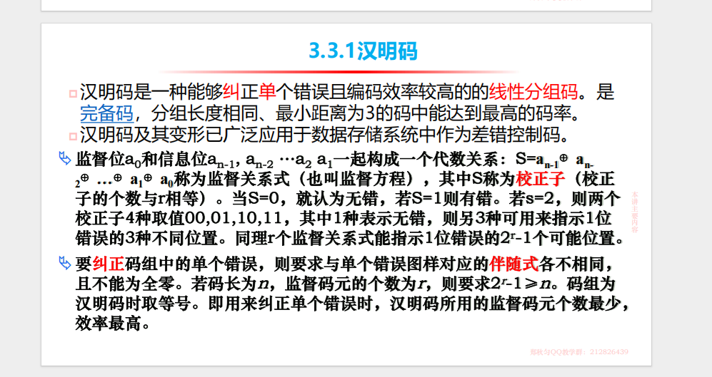

xyc-2025/5/15

# 一、图表题（共3题，每题12分，共36分）

## 1.双极性不归零、单极性不归零、曼彻斯特码、抑制载频2ASK，2PSK、2DPSK信号的波形

##### 单极性非归零码（NRZ）

- 单极性：1—高电平；0—0电平，码元持续期间电平不变
- 非归零：NRZ (nor-return to zero)
- 有直流且有固定0电平，多用于终端设备或近距离传输（线路板内或线路板间）；
  例如：


##### 双极性非归零码（NRZ）

- 无直流
- 1—高电平+1；0—负电平-1
  例如：


### 单极性归零码

归零：RZ (return to zero)发送“1”码时高电平在码元期间内只持续一段时间（一般取占空比50%），多用于近距离波形变换；
有直流；
可直接提取位定时；
规则：1—高电平；0—0电平（与单极性非归零码相同），但是在一个定时信号中，存在归零现象，也就是比如二进制1—高点平1，但是存在归零，高电平不能占满整个一个的定时信号，而会存在50%占空比为0电平。
例如：
判决规则及错误传递、幅度滚降与部分响应系统的主要特点


##### 双极性归零码

- 无直流
- 基本规则与双极性非归零码雷同，但是同在在一个定时信号中存在50%的零电平


### 曼彻斯特编码


### 制载频数字调制信号分析

#### 1.1 2ASK (二进制幅移键控)

2ASK是一种幅度调制方式，用载波的不同幅度来表示二进制数字信号：

- 数字"1"对应有载波输出
- 数字"0"对应无载波输出

数学表达式：

```
s(t) = A(t)cos(2πfct)
```

其中A(t)随基带信号变化，当发送"1"时A(t)=A，发送"0"时A(t)=0。

#### 1.2 2PSK (二进制相移键控)

2PSK是一种相位调制方式，用载波的不同相位来表示二进制数字信号：

- 数字"1"对应相位0°
- 数字"0"对应相位180°

数学表达式：

```
s(t) = Acos(2πfct + φn)
```

其中φn=0或π，分别对应"1"和"0"。

#### 1.3 2DPSK (二进制差分相移键控)

2DPSK是2PSK的改进形式，通过前后码元的相对相位变化来表示信息：

- 数字"1"使载波相位变化π
- 数字"0"使载波相位保持不变

数学表达式与2PSK类似，但相位变化是相对于前一码元的相位而言的。


## 2.第一、四类部分响应系统预编码方程、相关编码方程、判决规则及错误传递、幅度滚降与部分响应系统的主要特点等

### 2.1第一类部分响应系统


#### 预编码方程：

预编码的目的是避免错误传播，将原始数据序列${a_k}$(取值为0或1)转换为预编码序列${b_k}$

$$b_k=a_k\oplus b_{k-1}$$

- 符号说明：
  - $\oplus$：模2+
  - $b_{k-1}$是前一个时刻的预编码输出-一般设置为0
- 作用：通过**差分编码**来消除**相关编码引入的依赖性**-从而判决错误不会连续传播

#### 相关编码方程：

相关方程通过线性叠加相邻比特，人为引入ISI：

$c_k = b_k + b_{k-1}$

#### 判决规则：

接收端根据${c_k}$​的值恢复原始数据

- 模2判决
  - $${c_k· = c_k mod 2}$$
- 预逆编码
  - $a_k = c_k \oplus b_{k-1}$


#### 错误传递：

通过预编码限制了错误传递的范围

- 单个错误的影响
  - 若某个 $c_k$ 因噪声被误判（如1→2），仅影响当前 $a_k$ 和下一个$a_{k+1}$
  - 由于预编码的差分特性，错误不会无限扩散。

### 2.2第四类部分响应系统


#### 预编码方程：


#### 相关编码方程：

- 

#### 判决规则：


#### 错误传递：

- **无预编码时**：单个判决错误会导致后续所有解码错误（错误传播）。
- **预编码作用**：错误仅影响当前比特的解码，因预编码的差分关系将错误隔离。
- **示例**：若 $d_k$判决错误，仅影响 $b_k$和 $b_{k+2}$，不扩散到其他位。

### 2.3幅度滚降与部分响应系统的主要特点

- 部分响应系统
  - **频域特性**：
    - 允许**可控的码间干扰（ISI）**，通过人为引入相关性提高频谱利用率。
    - 频响通常具有**余弦或正弦形状**（如第Ⅰ类、第Ⅳ类部分响应）。
  - **时域特性**：
    - 在采样点处**存在已知ISI**（如+1, -1），但可通过预编码或差分编码消除。
    - 时域响应**拖尾较短**，但相邻符号会相互影响（需均衡或检测算法）。
  - **应用场景**：
    - 适用于**高频谱效率**需求，如高速调制（QAM）、磁记录、光纤通信。
    - 典型例子：**双二进制编码（第Ⅰ类PRS）**、**修正双二进制（第Ⅳ类PRS）**。
  - **优缺点**：
    - **优点**：提高频带利用率（接近奈奎斯特极限），适用于高数据率传输。
    - **缺点**：需要额外**预编码或均衡**技术（如Viterbi检测）来消除ISI，复杂度较高。
- 幅度滚降
  - **频域特性**：
    - 在频域上对信号的高频分量进行**平滑衰减**（如升余弦滚降滤波器）。
    - 滚降系数（α）决定过渡带的陡峭程度（α=0 时为理想低通，α=1 时过渡带最宽）。
  - **时域特性**：
    - 减少码间干扰（ISI），但**不引入可控ISI**。
    - 时域响应通常具有**较长的拖尾**，但通过滚降优化可使其在**采样点处为**零（奈奎斯特准则）。
  - **应用场景**：
    - 主要用于**基带传输**（如PAM调制）和**带限信道**（如电话线、数字通信）。
    - 典型例子：**升余弦滤波器**（用于消除ISI）。
  - **优缺点**：
    - **优点**：有效抑制高频噪声，减少ISI，适用于带宽受限系统。
    - **缺点**：滚降会占用额外带宽（α>0时），且陡峭滚降可能增加实现复杂度。

## 3.等差错控制基本思想，常用的差错控制方式


## 4.奇偶校验监督方程、监督码元、汉明距离及校验特性





# 二、计算题（共3题，每题8分，共24分）

## 线性分组码特性及循环码特性?

1. **汉明码**：汉明码是一种能够纠正一位错码且编码效率较高的线性分组码。
2. **(n,k)汉明码**：n位码长，k位信息位
   1. 校验式：$S=a_{n-1} \bigoplus a_{n-2} \bigoplus ... \bigoplus a_{1} \bigoplus a_0 $ 
   2. 若有r个校验位，则可以表示$2^r$种关系。则$1种代表无错，2^r-1种代表可能位置$
   3. 为此，码长为$n$，信息位为$k$，则监督位数为$r=n-k$
   4. 因此要求$2^r-1 \geq n \ or\ 2^r \geq k + r + 1，其中2^r-1代表可以表示的位置可能，n代表码长$ 
3. **(7,4)汉明码（了解看懂就行**：n=7，k=4，为此有3个校正子。
   1. 首先，分别令3个校正子为$S_1,S_2,S_3$
   2. 建立关系表：
      
   3. 通过查表分别找到：$S_1$为1时分别有$a_2,a_4,a_5,a_6$出错，$S_2$为1时分别有$a_1,a_3,a_5,a_6$出错，$S_3$为1时分别有$a_0,a_3,a_4,a_6$出错。
   4. 通过3构建监督关系：
      - $S_1 = a_6 \bigoplus a_5 \bigoplus a_4 \bigoplus a_2 $  
      - $S_2 = a_6 \bigoplus a_5 \bigoplus a_3 \bigoplus a_1 $
      - $S_3 = a_6 \bigoplus a_4 \bigoplus a_3 \bigoplus a_0 $
      - $a_0,a_1,a_2$分别与对应监督式参考进行偶校验推导即可。（若令S为0表示错误则参考其他方式
4. **线性分组码（重点 大题8分**：
   1. **监督矩阵**：将上述表3-4改写成$S_i \times a_j$的形式，构造出对应的一个矩阵。
      - $H =\left [ \begin{matrix}1&1&1&0&1&0&0 \\ 1&1&0&1&0&1&0 \\1&0&1&1&0&0&1 \\ \end{matrix}  \right ]$ 
      - $A=\left[ \begin{matrix} a_6&a_5&a_4&a_3&a_2&a_1&a_0 \end{matrix} \right] $
      - $0=\left[ \begin{matrix} 0&0&0 \end{matrix} \right] $ 
      - 则可建立$H \cdot A^T = 0^T$ 或 $A \cdot H^T = 0$ 
      - 将$H$拆解为$P =\left [ \begin{matrix}1&1&1&0 \\ 1&1&0&1 \\1&0&1&1 \\ \end{matrix}  \right ]$，$I_r =\left [ \begin{matrix}1&0&0 \\ 0&1&0 \\0&0&1 \\ \end{matrix}  \right ]$ 构造出 $H = (P \cdot I_r)$的形式，$I_r$为单位方阵。此时我们称$H$矩阵为典型形式的监督矩阵。
      - 由(7,4)汉明码我们知道有：$[a_2\ a_1\ a_0] = [a_6\ a_5\ a_4\ a_3]P^T=[a_6\ a_5\ a_4\ a_3] Q;Q = p^T$
      - 为此我们还能得到$[监督码] = [信息码] \cdot Q$ 
   2. **生成矩阵**：将上述$Q$左边加入$k$ 阶单位方阵 $I_k$，得到$G=[I_kQ]$，此时称$G$为典型的生成矩阵。
      - 由$G$可以获得整个码组$A=[a_{n-1}\ a_{n-2}\ ...\ a_0]=[信息码] \cdot G(典型的)$
      - 
        
   3. **监督矩阵与生成矩阵的关系（如上述例题）**
   4. **线性分组码主要性质**
      1. 封闭性：一种线性分组码中的任意两个码组之逐位模2和仍为这种码中的另一个许用码组。
         即$A_1H^T=0,A_2H^T=0$则$A_1H^T+A_2H^T=(A_1+A_2)H^T=0$
      2. 码的最小距离等于非零码的最小重量

## 已知循环码生成多项式或许用码组，求生成矩阵，监督位等？

1. **循环码的循环特性**
   1. **码的多项式（A->A(x))**：把长为n的码组与n-1次多项式建立一一对应的关系，$A=(a_{n-1},a_{n-2},...,a_0)$
      $A(x) = a_{n-1}x^{n-1}+a_{n-2}x^{n-2}+...+a_{0}x^{0}$
      如：$A=1011011,则A(x) =x^6+x^4+x^3+x+1$
   2. **循环码的循环特性**：指循环码中任一许用码组经过**循环移位**后（最右端码元移至最左 反之亦然），所得到的码组仍为它的一个许用码组。
      如：(0 0 1, 0 1 1 1) 可以得到(1 0 0, 1 0 1 1) // 右移一位
2. **循环码的生成多项式和生成矩阵(常见的是（7,3）循环码 记住一个001，0111**
   1. **生成多项式g(x)**：(n,k)循环码的$2^k$个码组中，有一个码组前k-1位码元均为0，第k位码元1，第n位(最后一位)码元为1，此码组对应的多项式即位生成多项式g(x)，其最高次幂为$x^{n-k}$。（理解也很简单，因为循环码的循环特性，可以循环移动使得最长连续的0为前缀）
      如：某个码组为0101110，则对应的$g(x)=x^4+x^2+x+1$
   2. **生成矩阵G：** $G=\left[ \begin{matrix} x^{k-1}g(x) \\ x^{k-2}g(x) \\ \vdots \\xg(x) \\ g(x)  \end{matrix} \right]$ 后，通过行变换变成典型生成矩阵$G = (I_kQ)；Q=P^T$可以获取$P$后继续获取典型监督矩阵$H=(PI_r)$
      


## 已知基带传输特征，求奈氏频带，滚降系数，传输速率等 

**具有升余弦频谱特性的形成网络（大题）**：频带利用率$\eta=\frac{2}{1+a}Baud/Hz$ （**a为滚降系数**）


- 计算方法：
  ①频带：$f_N$在开始下降和到0时的中间频率 ，因此$f_N=(2000+4000)\div2 = 3000Hz$
  ②符号速率：$f_s=2f_N$，因此$f_s=2\times3000=6000$
  ③滚降系数：$a$代表从$f_N$滚降到0时的频率长度与$f_N$的比例，因此$a = (4000-3000)\div3000=\frac{1}{3}$
  ④传输速率：$R=f_slog_2M$，因此$R = 6000\times log_28 = 18000bit/s$
  ⑤频带利用率：$\eta=\frac{2}{1+a}Baud/Hz$，因此$\eta=\frac{2}{1+\frac{1}{3}}=\frac{3}{2}Baud/Hz$​
- 切记：频带利用率有bit/baud两种，前者用传信速率做分子，后者用传输速率做分子

## 正交调幅系统求带宽、调制速率，传信速率、频带利用率等

**现代数字调制技术（计算题8分**：研究频谱调制技术在有限的带宽资源下获得更高的传输速率。

- 方式：**正交幅度调制（QAM）**、偏移（交错）正交相移调制（OQPSK）
- **QAM**：又称正交双边带调制。在多电平时，就构成了**多进制正交幅度调制（MQAM）**
- 基本公式：
  - **M**：代表M星点数，M值越大，星点数越多、频带利用率就越高、星点的空间距离越小、系统的抗干扰能力下降、误码率越高。
  - **电平数**：$n = \sqrt{M}$（n电平代表n进制
  - **码元比特数**：$k=log_2n=log_2\sqrt{M}=\frac{1}{2}log_2M$
  - **码元速率（调制速率）**：$f_s$
  - **频带**：$f_N$
  - **带宽**：$B$
  - **码元速率-频带-带宽关系**：$f_s=2f_N;B=2(1+a)f_N$
  - **频带利用率**：$\eta=\frac{f_b}{B}=\frac{f_s\times log_2M}{(1+a)f_s}=\frac{log_2M}{1+a}$
- 

## 已知光纤△，波长等求数值孔径、单模传输纤芯半径等


## 光纤的导光原理、数值孔径物理意义，阶跃与渐变折射率光纤的特点等

光纤的导光原理、数值孔径的物理意义，以及阶跃与渐变折射率光纤的特点可以总结如下：

---

**1. 光纤的导光原理**
光纤利用全反射原理将光限制在纤芯中传播。其核心结构包括：
• 纤芯（Core）：高折射率（$n_1$），光信号在此传播。

• 包层（Cladding）：低折射率（$n_2 < n_1$），通过全反射将光束缚在纤芯内。

• 临界角条件：当入射角大于临界角（$\theta_c = \sin^{-1}(n_2/n_1)$）时，光在纤芯-包层界面发生全反射，实现长距离传输。


---

**2. 数值孔径（NA）的物理意义**
数值孔径（Numerical Aperture, NA）描述**光纤集光能力和光接收角度范围**：
• 定义：$NA = \sqrt{n_1^2 - n_2^2} = n_0 \sin\theta_{\text{max}} $ 

  $（n_0$为空气折射率，$theta_{\text{max}}$为最大入射角）
• 物理意义：

  • 集光效率：NA越大，光纤接收光的能力越强（可接受更大角度的入射光）。

  • 模式容量：高NA光纤支持更多传输模式（多模光纤），但可能增加模间色散。


---

**3. 阶跃折射率光纤 vs. 渐变折射率光纤**

**（1）阶跃折射率光纤（Step-Index Fiber）**
• 折射率分布：纤芯折射率恒定（$n_1$），包层折射率突变为$n_2$（$n_1 > n_2$）。

• 特点：

  • 多模传输：光以不同路径（模式）传播，导致模间色散（脉冲展宽），限制带宽。

  • 单模传输：通过减小纤芯直径（如8-10 μm）和NA，仅支持单一基模，但需要高精度光源（如激光器）。

• 应用：多模用于短距离通信（如局域网）；单模用于长距离、高速通信。


**（2）渐变折射率光纤（Graded-Index Fiber）**
• 折射率分布：纤芯折射率从中心向外逐渐降低（抛物线分布），包层折射率恒定。

• 特点：

  • 自聚焦效应：光在纤芯中沿弯曲路径传播，高速模式路径长但折射率低，低速模式路径短但折射率高，最终减少模间色散。

  • 带宽提升：相比阶跃多模光纤，渐变折射率光纤的带宽显著提高（可达GHz·km量级）。

• 应用：中短距离通信（如企业网、数据中心）。


---

**4. 关键对比总结**
| 特性           | 阶跃折射率光纤             | 渐变折射率光纤                   |
| -------------- | -------------------------- | -------------------------------- |
| **折射率分布** | **纤芯恒定，包层突变**     | **纤芯渐变（抛物线），包层恒定** |
| **色散**       | 模间色散严重（多模）       | 模间色散大幅降低                 |
| 带宽           | 低（多模）或极高（单模）   | 中等（优于阶跃多模）             |
| 成本           | 单模成本高，多模成本低     | 适中                             |
| 典型应用       | 单模：长距离；多模：短距离 | 中短距离高速通信                 |

---

**5. 补充说明**
• 单模光纤：必须采用阶跃折射率设计，通过极小纤芯直径抑制高阶模。

• 多模光纤优化：渐变折射率通过折射率分布补偿模式延迟，是提升多模带宽的关键技术。


通过理解这些原理和特性，可以更好地选择光纤类型以满足特定通信需求（如距离、带宽、成本）。

# 三、简答题（共8题，每题5分，共40分）

## 数据通信系统的基本构成及主要功能

- 数据终端设备（DTE=数据输入设备+数据输出设备+传输控制器）

  - 数据输入设备/输出设备：发送端将数据信息转化为数字代码表示的数据信号/接收端将数据信号还原成数据
  - 传输控制器：完成各种传输控制：差错控制/终端的接续控制/确认控制/传输顺序控制/切断控制
  - DTE是总称呼：在发送数据中，DTE可以是键盘输入器，在接收数据中，它可以是屏幕显示设备，也可以是激光打印机

- 数据电路

  - 位置：DTE和计算机系统之间

  - 作用：为数据通信提供传输通道

  - 内容：在数据电路两端收发的是二进制的"1"或者"0"的数据信号

  - 要求：数据传输电路要保证将DTE的数据信号送到计算机系统以及让计算机系统送回DTE

  - 构成：

    - 传输信道：
      - 通信线路：电缆/光缆/微波线路
      - 通信设备：模拟通信设备（模拟传输信道）/数字通信设备(数字传输信道)
    - 两侧的数据电路终接设备(DCE)
      - 是什么：DTE和传输信道的接口设备
      - 基带传输：DCE是对DTE的数据信号进行转换，让信号功率谱和信道相适应
      - 频带传输：DCE是调制解调器：是调制器和解调器的结合，发送的时候，调制器对数据信号进行调制，将其频带搬移到相应的载频频带上传输；接收时，解调器进行解调，将模拟信号还原成数字信号

    

- 中央计算机系统：

  - 通信控制器
    - 数据电路和计算机系统的接口，控制与远程数据终端设备连接的全部通信信道
  - 主机：
    - CPU/主存/输入输出设备/其他外围设备组成

## 奈奎斯特第一准则与第二准则的特点

**奈奎斯特第一准则（无码间串扰准则）**

1. 核心思想：
    在理想低通信道（带宽为 B）中，无码间串扰（ISI）的最高**符号传输速率**为 **2B 波特**（即每秒传输 2B 个符号）。

2. 特点：
    • 带宽限制：要求**信道带宽 B 至少为符号速率 Rs​ 的一半**（即 Rs​≤2B）。

   • 理想低通特性：需满足矩形幅频响应和线性相频响应，实际中难以实现。

   • 采样点无失真：在符号间隔 T=1/(2B) 的采样点上，**信号仅受当前符号影响，邻符号干扰为零**。

   • 缺点：陡峭的截止特性导致工程实现困难，且对定时误差敏感。

3. 应用：
    指导基带传输系统的理论极限，如PCM系统设计。

------

**奈奎斯特第二准则（部分响应系统）**

1. 核心思想：
    通过人为引入**可控的码间串扰**，利用相关编码技术换取带宽效率的提升，允许符号速率 **Rs​=2B** 时仍能消除ISI。

2. 特点：
    • 带宽效率：在相同带宽下可传输**更高符号速率**（如 Rs​=2B），但需牺牲部分噪声容限。

   • 可控ISI：通过预编码和判决反馈，将串扰转化为可预测的形式（如双二进制编码）。

   • 实现灵活：无需理想低通滤波器，采用升余弦等滚降特性更易实现。

   • 复杂度增加：需额外编码/解码步骤，可能引入错误传播。

3. 应用：
    高频谱效率场景（如数字微波通信），典型技术包括第Ⅰ类、第Ⅳ类部分响应系统。

------

**对比总结**

| 特性       | 第一准则          | 第二准则                 |
| ---------- | ----------------- | ------------------------ |
| 目标       | 完全消除ISI       | 可控ISI以提升带宽利用率  |
| 符号速率   | Rs≤2B（理论极限） | Rs=2B（实际可达）        |
| 实现难度   | 高（需理想低通）  | 较低（允许滚降）         |
| 噪声敏感性 | 低（无ISI）       | 较高（需权衡噪声与串扰） |
| 典型技术   | 理想采样系统      | 部分响应编码、预均衡技术 |

关键点：第一准则追求无失真传输，而第二准则通过折中设计实现更高效率，两者共同构成数字通信系统设计的理论基础。

## 三网融合及意义

#### **1. 三网融合的定义**

**三网融合**是指**电信网、广播电视网和互联网**在技术、业务、网络和监管层面的融合，实现**网络互联互通、资源共享、业务协同**，最终形成统一的信息通信网络。

#### **2. 三网融合的特点**

- **技术融合**：采用IP（互联网协议）技术，实现语音、数据、视频的统一传输。
- **业务融合**：提供综合服务，如IPTV（网络电视）、VoIP（网络电话）、宽带上网等。
- **网络融合**：光纤到户（FTTH）、5G等高速网络支撑三网融合。
- **监管融合**：打破行业壁垒，统一管理标准。

## 传信速率，调制速率定义及关系

**1. 传信速率（比特率）**  
• 定义：单位时间内传输的二进制位数，表示信息传输的实际速率。  

• 单位：比特/秒（$$ \text{bit/s} $$、$$ \text{bps} $$）。  

• 公式：  

  $$ R_b = \frac{\text{传输的比特数}}{\text{时间（秒）}} $$  
• 特点：反映有效信息传输效率，与进制数无关。  


**2. 调制速率（波特率）**  
• 定义：单位时间内传输的码元（符号）个数，表示信号波形的变化频率。  

• 单位：波特（$$ \text{Baud} $$）。  

• 公式：  

  $$ B = \frac{1}{T} $$  
  其中，$$ T $$ 为码元周期。  
• 特点：与调制方式（如$$ \text{QPSK} $$、$$ \text{16-QAM} $$）相关，一个码元可携带多个比特。  

**3. 两者关系**  
• 基本公式：  

  $$ R_b = B \cdot \log_2 M $$  
  其中，$$ M $$ 为码元的进制数（如二进制 $$ M=2 $$，四进制 $$ M=4 $$）。  
• 关键结论：  

  • 二进制时（$$ M=2 $$）：$$ R_b = B $$（数值相等，单位不同）。  

  • 多进制时：波特率不变，但比特率随 $$ \log_2 M $$ 倍增。例如：  

◦ 四进制（$$ \text{4-QAM} $$）：$$ R_b = 2B $$。  

◦ 八进制（$$ \text{8-PSK} $$）：$$ R_b = 3B $$。  

**4. 示例**  
• 若调制速率 $$ B = 1200 \, \text{Baud} $$：  

  • 二进制传输：比特率 $$ R_b = 1200 \, \text{bps} $$。  

  • 四进制传输：比特率 $$ R_b = 2400 \, \text{bps} $$。  


**5. 应用意义**  
• 调制速率决定信道带宽需求（奈奎斯特准则：$$ B \leq 2W $$）。  

• 传信速率决定实际数据传输效率，可通过多进制调制提升。  


总结：调制速率描述信号变化频率，传信速率描述信息量；两者通过进制数 $$ M $$ 关联，多进制调制可在相同波特率下提高比特率。

## 交换技术、ATM的定义及数据报、虚电路、帧中继等的特点

交换技术是将数据**从源传输到目的地**的**网络通信方式**，主要包括**电路交换**、**报文交换**和**分组交换**。**ATM**（异步传输模式）是一种基于**固定长度单元**（53字节）的高速**分组交换**技术，支持实时语音、视频和数据传输。**数据报**是**无连接的分组**交换方式，每个分组独立路由，可能乱序到达，适合容错性强的应用。**虚电路**是**面向连接的分组**交换，提供逻辑连接，顺序保证，适用于稳定传输。**帧中继**是一种简化X.25的面向连接技术，减少开销，适合局域网互联，提供中等速度和可靠性。

以下是关于交换技术、ATM（异步传输模式）及数据报、虚电路、帧中继等技术的详细说明：

------

### **一、交换技术**

交换技术是网络通信中实现数据传输的核心机制，主要分为三类：

1. **电路交换**
   - **定义**：通信前需建立一条专用的物理通路，全程独占资源（如电话网络）。
   - **特点**：低延迟、固定带宽，但资源利用率低，无差错控制。
2. **报文交换**
   - **定义**：以完整报文为单位存储-转发，无需预先建立连接。
   - **特点**：动态分配资源，但延迟高（需存储整个报文），适用于早期电报网络。
3. **分组交换**
   - **定义**：将数据分割为多个分组独立传输，分为**数据报**和**虚电路**两种方式。
   - **特点**：高效利用带宽，支持多路复用，是现代网络的主流技术。

------

### **二、ATM（异步传输模式）**

- **定义**：ATM是一种面向连接的快速分组交换技术，采用固定长度（53字节）的**信元（Cell）**传输数据，支持语音、视频等实时业务。

- 

  特点

  ：

  - **固定信元大小**：降低处理延迟，适合实时应用。
  - **面向连接**：通过虚电路（VP/VC）保证服务质量（QoS）。
  - **统计复用**：动态分配带宽，提高资源利用率。
  - **综合业务支持**：可承载多种流量类型（CBR、VBR等）。

------

### **三、数据报与虚电路**

#### **1. 数据报（Datagram）**

- 

  特点

  ：

  - **无连接**：每个分组独立路由，路径可能不同。
  - **灵活性高**：适应网络拓扑变化，但可能乱序到达。
  - **典型应用**：IP协议（Internet的核心）。

#### **2. 虚电路（Virtual Circuit, VC）**

- 

  特点

  ：

  - **面向连接**：通信前建立逻辑路径（如ATM、帧中继）。

  - **有序传输**：分组沿固定路径传递，保证顺序。

  - **资源预留**：可提供QoS保障，但需维护连接状态。

  - 

    分类

    ：

    - **永久虚电路（PVC）**：长期固定的逻辑连接。
    - **交换虚电路（SVC）**：按需动态建立。

------

### **四、帧中继（Frame Relay）**

- **定义**：一种简化的分组交换技术，基于虚电路传输可变长帧，主要用于广域网（WAN）。

- 

  特点

  ：

  - **高效性**：省略了ATM的信元分割和复杂控制，延迟更低。
  - **统计复用**：共享带宽，适合突发流量。
  - **轻量级差错控制**：仅检测错误（不纠正），依赖高层协议重传。
  - **成本低**：相比专线，更经济实惠。

------

### **五、关键对比**

| **技术**   | **连接方式** | **数据单元** | **特点**                        |
| ---------- | ------------ | ------------ | ------------------------------- |
| **ATM**    | 面向连接     | 信元（53B）  | 固定长度、QoS保障、高复杂度     |
| **数据报** | 无连接       | 可变分组     | 灵活、无序、适应性强（如IP）    |
| **虚电路** | 面向连接     | 可变分组     | 有序传输、资源预留（如ATM PVC） |
| **帧中继** | 面向连接     | 可变帧       | 简化控制、低成本、适合企业网络  |

------

### **六、应用场景**

- **ATM**：传统电话骨干网、高清视频传输（逐渐被IP/MPLS取代）。
- **数据报**：互联网（IP协议）、实时性要求不高的场景。
- **虚电路**：企业专网（帧中继）、需要稳定QoS的实时业务。
- **帧中继**：企业分支机构互联、低成本的广域网解决方案。

希望以上总结能帮助您清晰理解这些技术的核心概念与区别！

## 网络体系结构OSI、TCP/IP模型定义、分层、功能及异同

OSI（开放系统互连）模型是ISO定义的网络体系结构，分为七层：物理层、数据链路层、网络层、传输层、会话层、表示层、应用层，每层提供特定功能，如物理层负责比特传输，网络层处理路由，应用层支持用户接口。TCP/IP模型是互联网基础，分为四层：网络接口层、网络层、传输层、应用层，功能类似但更简化，如网络层处理IP，传输层支持TCP/UDP。

**异同**：两者均采用分层设计，OSI理论化、层次分明，TCP/IP实用化、层次较少。OSI每层功能明确，TCP/IP功能划分模糊（如网络接口层）。OSI适用于多种网络，TCP/IP专为互联网优化。两者在网络层（IP）和传输层（TCP）功能相似，但OSI有额外会话层和表示层，TCP/IP将这些功能合并到应用层。

## HDLC帧的类型及透明传输

HDLC（高级数据链路控制）帧分为三类：**信息帧（I帧）**用于传输用户数据和确认，包含序列号；**监督帧（S帧）**用于流量控制和差错控制，如确认（ACK）、拒绝（REJ）；**无编号帧（U帧）**用于链路管理，如建立/断开连接。

**透明传输**：HDLC通过**比特填充**实现透明传输。在数据中，若出现与标志序列（01111110）相同的比特模式，发送端在第五个1后插入0，接收端检测并删除此0，确保数据与标志序列区分，实现任意比特序列的正确传输。

1. **HDLC帧结构**
   
   1. **标志字段（F）**：用于**帧同步**，表示一帧的开始和结束。为防止提前结束引入**“0”插入和删除技术**
      
   2. 地址字段（A）
   3. 控制字段（C）
   4. 信息字段（I）
   5. **帧校验字段（FCS）**：校验的范围包括除**标志字段之外的所有字段**，但为了进行透明传输而**插入的‘0’不在校验范围**内。
2. **HDLC控制字段（C）的格式与3种类型的帧**
   
   1. **信息帧（I帧）：实现数据信息的传输**
   2. **监控帧（S帧）：实现对数据链路的监控。**
   3. **无编号帧（U帧）：提供链路的建立和拆除等多种附加的数据链路控制功能和无编号信息的传输功能。**

> ### HDLC帧的类型及透明传输（考试标准答案）
>
> ------
>
> #### **一、HDLC帧的三种类型**
>
> 1. **信息帧（I帧）**
>   - **功能**：主要用于传输用户数据，同时携带确认信息（捎带确认）。
>    
>   - 结构特点：包含**序列号**`N(S)`（发送的数据序号）和`N(R)`（期望接收的下一个帧序号）。
>    
>     - 通过控制字段的`0`开头标识为I帧。
>    
>   - **示例场景**：A向B发送数据时，I帧既携带数据，也隐含确认“已正确收到B之前发送的`N(R)-1`号帧”。
>    
>2. **监督帧（S帧）**
> 
>    - **功能**：专用于流量控制和差错控制，不携带用户数据。
>
>    - 类型：
>
>      - **RR（接收就绪）**：确认接收正常，允许继续发送。
>     - **RNR（接收未就绪）**：请求暂停发送（流量控制）。
>      - **REJ（拒绝）**：请求重传从`N(R)`开始的帧（后退N帧ARQ）。
>     - **SREJ（选择拒绝）**：请求重传指定帧（选择重传ARQ）。
>      
>   - **结构特点**：控制字段以`10`开头标识为S帧。
>    
>3. **无编号帧（U帧）**
>    - **功能**：用于链路管理（建立、断开、重置连接）。
>   
>    - 常见命令/响应：
>    
>      - **SNRM**：设置正常响应模式（建立连接）。
>      - **DISC**：断开连接。
>     - **UA**：无编号确认，用于响应U帧命令。
>      - **FRMR**：帧拒绝（表示收到非法帧）。
>     
>    - **结构特点**：控制字段以`11`开头标识为U帧。
>
> ------
>
> #### **二、透明传输的实现：比特填充**
>
> 1. **问题背景**
>   HDLC使用​**​标志序列`01111110`​**​标识帧的起始和结束。若用户数据中恰好出现`01111110`，会被误判为帧边界，导致传输错误。
> 2. **解决方案：比特填充（零比特插入）**
>   - **发送端规则**：
>      在数据中每出现​**​连续5个1​**​，自动在第5个1后插入一个​**​0​**​。
>      ​**​示例​**​：
>      原始数据：`01111101` → 填充后：`0111110 01`（插入0后变为`011111001`）。
>    - **接收端规则**：
>     检测到连续5个1后的0时，自动删除该0，恢复原始数据。
> 3. **核心意义**
>   通过比特填充，确保用户数据中​**​任何比特模式​**​（包括`01111110`）都能被正确传输，避免与标志序列混淆，实现​**​透明传输​**​。

## 常用光波分复用技术及TDM、STDM、WDM等的区别及特点

Wavelength Division Multiplexing

- 光波分复用（WDM）技术通过在单根光纤中同时传输多个不同波长的光信号，实现多路信号复用，提高带宽利用率，常用于高速骨干网。
  - 粗波分复用（CWDM，波长间隔大，成本低）
  - 密集波分复用（DWDM，波长间隔小，通道多，容量高）。

**区别及特点**：

- **TDM（时分复用）**：将时间分成固定时隙，分配给不同信号，同步传输，适合固定速率信号（如电话），但带宽利用率较低。
- **STDM（统计时分复用）**：动态分配时隙给活跃信道，适合数据突发场景（如数据网络），提高带宽效率，但需复杂控制。
- **WDM（波分复用）**：利用光波长复用，通道间互不干扰，适合超高带宽需求（如光纤通信），但设备成本高。

**总结**：TDM和STDM基于时间分割，适合电信号；WDM基于波长分割，专为光通信设计，容量大但成本高。

## 光纤通信系统的基本单元及主要功能

光纤通信系统基本单元包括：**光发送机**、**光纤**、**光接收机**、**光中继器**（可选）。

- **光发送机**：将电信号转换为光信号，包含光源（如激光器或LED）和调制器，负责信号编码和发射。
- **光纤**：传输光信号的介质，提供低损耗、高带宽的传输通道。
- **光接收机**：将光信号转换回电信号，包含光探测器和解调器，负责信号解码。
- **光中继器**：延长传输距离，放大或再生光信号，补偿衰减。

**主要功能**：实现高速、长距离、低损耗的数据传输，支持语音、视频和数据通信，广泛应用于骨干网和接入网。

## 光纤的传输窗口，光纤通信系统的优势

**光纤传输窗口**：指光纤传输损耗较低的波长范围，主要有三个窗口：

- **第一窗口**（850 nm）：损耗较高，适合短距离多模光纤传输。
- **第二窗口**（1310 nm）：低色散、低损耗，适合中长距离单模光纤传输。
- **第三窗口**（1550 nm）：最低损耗，适合长距离传输，常用于DWDM系统。

**光纤通信系统优势**：

1. **高带宽**：支持Tb/s级数据传输，满足高速通信需求。
2. **低损耗**：信号衰减小，可实现数百公里无中继传输。
3. **抗干扰**：不受电磁干扰，适合复杂环境。
4. **安全性高**：光信号难窃听，保密性强。
5. **体积小、重量轻**：便于布线和维护，适合长距离和大容量网络。

## 光与物质三个过程，LD与LED的异同、激光出射的条件

**光与物质的三个过程**：
1. **受激吸收**：原子吸收光子，从低能级跃迁到高能级。
2. **自发辐射**：高能级原子自发回到低能级，释放光子，产生非相干光。
3. **受激辐射**：高能级原子受外部光子激发，释放与入射光子同相的光子，产生相干光。

**LD（半导体激光器）与LED（发光二极管）的异同**：

- **相同点**：均为半导体光源，利用电激发产生光，广泛用于光通信和照明。
- **不同点**：
  - **工作原理**：LD基于受激辐射，输出相干光；LED基于自发辐射，输出非相干光。
  - **光特性**：LD光束方向性强、单色性好、功率高；LED光束发散、谱宽、功率较低。
  - **应用**：LD用于光纤通信、激光器；LED用于显示、照明。
  - **结构**：LD有谐振腔，提供光反馈；LED无谐振腔。

**激光出射条件**：

1. **粒子数反转分布**：高能级粒子数多于低能级，形成增益介质。
2. **正反馈谐振腔**：通过谐振腔（如反射镜）提供光子多次往返放大。

**产生激光最主要的过程： ****受激辐射**

## 光纤网络传输体制定义、光纤网络传输体制的主要特点及网络节点信息流的规范及优势、意义

- 光纤网络传输体制指基于光信号在光纤介质中传输的标准化技术框架，包括**信号复用方式、帧结构、同步机制及网络管理规范**。其核心分为**PDH（准同步数字体系）**和**SDH（同步数字体系）**两大技术体制。

  - 前提是什么？光信号在光纤介质中传输

  - 要求是什么？标准化

  - 主要有什么？PDH和SDH

  - 特点是什么？

    - #### **1. 同步方式差异**

      - **PDH（准同步数字体系）**
        PDH采用​**​准同步​**​机制，各网络节点依赖独立的时钟源（如晶体振荡器），类似于“班级晨跑时每个班自行喊口号”。由于缺乏全局同步，不同节点的时钟频率存在微小偏差（±50ppm），需通过​**​码速调整​**​（正/零/负调整）补偿时钟差异，导致效率降低且管理复杂。
      - **SDH（同步数字体系）**
        SDH采用​**​全网同步​**​机制，所有节点严格遵循主从时钟（如PRC原子钟），类似于“阅兵方阵统一听从天安门指令”。通过指针调整（AU/TU指针）实现相位对齐，无需码速调整，显著提升传输效率与可靠性。

      #### **2. 复用方式差异**

      - **PDH**
        PDH采用​**​逐级复用/解复用​**​，低速率信号（如2Mbps）需通过多级复用（如2M→34M→140M）才能接入高速链路，类似“拆解多层套娃快递箱”。此过程需逐级解复用，导致设备复杂、时延增加，且无法直接提取支路信号。
      - **SDH**
        SDH支持​**​一步复用​**​，通过指针定位直接访问任意低速支路信号（如2Mbps），类似“智能快递柜输入取件码直达目标包裹”。其虚容器（VC）结构结合开销字节（如J0/J1路径跟踪），可实时监控信号完整性，显著提升运维效率。

      #### **3. 管理能力差异**

      - **PDH**
        PDH缺乏标准化网管功能，故障定位依赖人工逐段排查（如误码仪测试），类似“拍打老式收音机维修”。此外，欧标（E1）与美标（T1）互不兼容，进一步增加运维成本。
      - **SDH**
        SDH通过​**​丰富的开销字节​**​实现智能化管理：
        - **E1/E2公务信道**：支持节点间语音通信；
        - **DCC（数据通信通道）**：传输网管指令；
        - **自动保护倒换（APS）**：50ms内完成环网自愈，确保业务连续性。
          其标准化接口与强大OAM能力，类似“智能手机的远程诊断与自修复功能”。

  > ### **一、网络节点信息流的规范**
  >
  > 1. **标准化协议**
  >    - **协议栈分层**（如OSI模型、TCP/IP）：明确各层职责（物理层、传输层、应用层等），确保跨厂商设备兼容性。
  >    - **数据格式统一**：如HTTP/HTTPS的报文结构、RESTful API的JSON/XML规范，避免解析歧义。
  > 2. **路由与转发规则**
  >    - **动态路由协议**（如OSPF、BGP）：通过算法（Dijkstra、路径矢量）优化路径选择，避免环路。
  >    - **流量工程**（如MPLS）：通过标签交换实现 QoS 保障，区分高优先级流量（如VoIP）。
  > 3. **安全与合规**
  >    - **加密传输**：TLS/SSL、IPSec 保障数据机密性。
  >    - **访问控制**：基于角色的权限管理（RBAC）、防火墙规则（如ACL）。
  >    - **数据主权**：符合GDPR、HIPAA等法规，确保用户隐私。
  > 4. **流量控制机制**
  >    - **拥塞避免**：TCP的滑动窗口、RED（随机早期检测）算法。
  >    - **速率限制**：令牌桶算法限制突发流量（如API调用频次）。
  >
  > ------
  >
  > ### **二、网络节点信息流的优势**
  >
  > 1. **效率提升**
  >    - **负载均衡**：通过DNS轮询、一致性哈希分配流量，避免单点过载（如CDN节点分布）。
  >    - **低延迟**：边缘计算（如MEC）将数据处理靠近用户，减少回传延迟。
  > 2. **可靠性增强**
  >    - **冗余设计**：多路径传输（如ECMP）、故障切换（VRRP协议）。
  >    - **容错性**：纠删码（如Reed-Solomon）修复数据包丢失。
  > 3. **可扩展性**
  >    - **模块化架构**：SDN（软件定义网络）分离控制面与数据面，灵活扩展功能。
  >    - **分布式拓扑**：P2P网络（如区块链）无中心节点，动态适应规模变化。
  > 4. **安全性优化**
  >    - **零信任模型**：持续身份验证（如mTLS），最小权限原则。
  >    - **威胁检测**：基于AI的异常流量分析（如UEBA）。

## 结合实际光纤入教室的设计单元、提供服务及看法

**光纤入教室设计单元**：

光是**optical**

在光纤入教室的网络架构中，主要包括三个核心设备：**OLT（光线路终端）**、**ODN（光分配网络）**和**ONU（光网络单元）**。**OLT**作为整个网络的控制中心，通常部署在校园机房，负责管理所有用户终端设备并连接上层网络，实现带宽分配、用户认证等关键功能。**ODN**是由**光纤和分光器**组成的无源传输网络，采用**树形或星形拓扑结构**将主干光纤信号分配到各个教室，确保每个教室都能获得独立的网络带宽。**ONU**则是安装在教室内的终端设备，主要功能是将光纤传输的**光信号转换为电信号**，为教室内的电脑、无线AP等终端设备提供网络接入服务。这三个设备协同工作，形成"**核心控制-信号分配-终端接入**"的完整网络架构，为智慧教室建设提供高速、稳定的网络基础。

**提供服务**：

1. **高速网络**：支持高清视频教学、在线课堂和实时互动。
2. **多媒体教学**：提供云端资源访问、虚拟实验和远程协作。
3. **管理与监控**：通过网络管理平台实时监控教室网络状态，优化资源分配。
4. **安全保障**：支持加密传输和访问控制，保护教学数据。

**看法**：
光纤入教室显著提升教学质量和效率，满足数字化教育需求，尤其在偏远地区能缩小教育资源差距。但需注意：1）**成本控制**：初期建设费用高，需合理规划；2）**维护专业性**：需培训技术人员确保系统稳定；3）**兼容性**：设备需与现有教学平台无缝对接。综合来看，光纤入教室是教育现代化的重要一步，值得推广，但需结合实际预算和技术支持实施。

## 海牛II号相关编码方案及国之重器之重要性

