# 记忆并理解

## A.编译程序五阶段的划分与作用

## B.各个编译阶段的输入与输出

| 阶段         | 输入             | 输出                   | 介绍                                                         |
| ------------ | ---------------- | ---------------------- | ------------------------------------------------------------ |
| 词法分析     | 源程序           | 单词符号串（Token流）  | 将源代码分解为有意义的词法单元（如标识符、关键字、运算符等） |
| 语法分析     | 单词符号串       | 抽象语法树（AST）      | 根据语法规则检查Token流的合法性，并构建树形结构的语法表示    |
| 语义分析     | AST              | 带标注的AST            | 检查类型一致性、作用域合法性等语义规则，并为AST节点添加语义信息 |
| 中间代码生成 | 带标注的AST      | 中间代码（如三地址码） | 将AST转换为与机器无关的中间表示形式，便于后续优化和代码生成  |
| 优化器       | 中间代码         | 优化后的中间代码       | 通过常量传播、死代码消除等技术提高代码执行效率或减少资源消耗 |
| 目标代码生成 | 优化后的中间代码 | 目标机器代码           | 将中间代码转换为特定架构的机器代码（如x86汇编），可能涉及寄存器分配等 |


# 掌握计算方法

## A.乔姆斯基文法的分类

以下是乔姆斯基四型文法的分类及其特性的表格总结：

| **文法类型** | **别称**              | **语言类别**         | **产生式规则约束**                                           | **对应自动机**            | **能力与限制**                                               |
| ------------ | --------------------- | -------------------- | ------------------------------------------------------------ | ------------------------- | ------------------------------------------------------------ |
| **0型文法**  | 短语文法              | 递归可枚举语言       | 无限制：α → β（α至少包含一个非终结符）                       | 图灵机                    | 能力最强，等价于图灵机，可描述所有可计算语言                 |
| **1型文法**  | 上下文有关文法（CSG） | 上下文有关语言       | 限制：αAβ → αγβ（A为非终结符，γ非空，替换时需考虑上下文α和β） | 线性有界自动机            | 弱于0型，不允许空串替换（部分定义允许带`S→ε`）               |
| **2型文法**  | 上下文无关文法（CFG） | 上下文无关语言       | 限制：A → γ（A为非终结符，γ可为空串ε，替换无需上下文）       | 下推自动机（PDA）         | 描述编程语言语法（如表达式、语句结构），无法处理依赖上下文的语言（如`aⁿbⁿcⁿ`） |
| **3型文法**  | 正规文法（RG）        | 正规语言（正则语言） | 限制：A → aB 或 A → a（右线性），或 A → Ba 或 A → a（左线性） | 有限状态自动机（DFA/NFA） | 能力最弱，仅描述正则表达式能匹配的模式（如标识符、数字）     |

### 关键说明：

1. **层级关系**：0型 ⊃ 1型 ⊃ 2型 ⊃ 3型（能力递减）。
2. 空串（ε）规则：
   - 1型文法通常禁止ε产生式（除非`S→ε`且S不出现在任何产生式右侧）。
   - 2型和3型文法允许`A→ε`。
3. 编程语言应用：
   - **词法分析**：3型文法（正则表达式）。 正则
   - **语法分析**：2型文法（BNF范式）。 上下文无关
   - **语义分析**：可能涉及1型文法（如类型检查需上下文）。 语义分析

## B.根据文法定义进行推导与规约

在编译原理中，根据文法定义进行**推导（Derivation）**与**规约（Reduction）**是语法分析的核心操作，直接关联到**自顶向下**和**自底向上**两类语法分析方法。以下是关键概念和关联技术：

------

### **1. 推导（Derivation）**

- **定义**：从文法的开始符号出发，逐步应用产生式规则替换非终结符，最终生成句子（终结符串）的过程。

- **分类**：

  - **最左推导（Leftmost Derivation）**：总是优先替换最左边的非终结符（用于自顶向下分析，如递归下降、LL分析）。
  - **最右推导（Rightmost Derivation）**：总是优先替换最右边的非终结符（对应自底向上分析中的规范推导）。

- **示例**（文法：`S → aSb | ε`，生成 `aabb`）：

  ```
  最左推导：S ⇒ aSb ⇒ aaSbb ⇒ aabb
  最右推导：S ⇒ aSb ⇒ aaSbb ⇒ aabb
  ```

- **编译中的应用**：

  - **自顶向下分析**（如递归下降、LL(1)分析器）：模拟最左推导，尝试从开始符号推导出输入串。
  - **语法错误检测**：若无法通过推导匹配输入符号，则报错。

------

### **2. 规约（Reduction）**

- **定义**：是推导的逆过程，将输入串的片段按产生式规则反向替换为非终结符，最终规约到文法的开始符号。

- **关键操作**：

  - **句柄（Handle）**：当前可规约的子串，与某个产生式右部匹配。
  - **移进-规约（Shift-Reduce）**：自底向上分析的核心动作（如LR分析器）。

- **示例**（文法同上，规约 `aabb`）：

  ```
  aabb ⇐ aaSbb ⇐ aSb ⇐ S
  ```

- **编译中的应用**：

  - **自底向上分析**（如LR、LALR分析器）：通过移进-规约操作构造语法树。
  - **优化与代码生成**：规约过程中可触发语义动作（如生成中间代码）。

------

### **3. 推导与规约的对应关系**

| **特性**       | **推导**                       | **规约**                       |
| -------------- | ------------------------------ | ------------------------------ |
| **方向**       | 从开始符号到输入串（自顶向下） | 从输入串到开始符号（自底向上） |
| **分析方法**   | 递归下降、LL(k)                | LR(k)、LALR(1)                 |
| **语法树构建** | 按推导顺序展开                 | 按规约顺序逆推                 |
| **典型工具**   | ANTLR（LL(*)）                 | Yacc/Bison（LR）               |

------

### **4. 关键问题与挑战**

- **二义性文法**：同一句子存在多个推导/规约路径（需通过改写文法或指定优先级解决）。

- 冲突处理：

  - **移进-规约冲突**：LR分析中同一状态可能同时需要移进和规约。
  - **规约-规约冲突**：多个产生式可匹配同一句柄。
  
- 性能权衡：

  - 自顶向下方法（如LL）直观但文法受限（需消除左递归和回溯）。
- 自底向上方法（如LR）能力强但实现复杂。

------

### **5. 实际应用场景**

- **递归下降分析**：手写编译器前端（如GCC的C++前端）。
- **LR分析**：Yacc/Bison生成语法分析器（用于解析编程语言、配置文件）。
- **错误恢复**：在规约时插入错误符号或跳过输入符号。


------

### **编译原理二义性题目与解答**

#### **题目：二义性文法示例**

给定以下上下文无关文法（CFG）和输入字符串，说明其二义性，并给出消除方法。

**文法规则：**

```
E → E + E  
E → E * E  
E → (E)  
E → id
```

**输入字符串：**
 `id + id * id`

------

### **1. 二义性分析**

该文法存在二义性，因为输入字符串 `id + id * id` 可以生成**两种不同的语法树**，导致语义冲突：

#### **语法树1：加法优先（左结合）**

```
        E
       /|\
      E + E
     /    /|\
    id   E * E
        /    \
       id    id
```

**解释：**
 计算顺序为 `(id + id) * id`，违背数学中“乘法优先级高于加法”的规则。

#### **语法树2：乘法优先（符合常规优先级）**

```
        E
       /|\
      E * E
     /|\   \
    E + E   id
   /    \
  id     id
```

**解释：**
 计算顺序为 `id + (id * id)`，符合数学规则。

------

### **2. 解决二义性的方法**

#### **方法1：重写文法，显式定义优先级和结合性**

通过引入非终结符，强制规定：

- `*` 的优先级高于 `+`；
- 运算符均为左结合。

**修改后的文法：**

```
从高到低分配非终结符
最高优先级：括号和基本单元（F）
F → (E) | id
（因为括号和 id 是最小的不可再分的表达式）
次高优先级：乘法（*），用 T 表示
T → T * F | F
（* 比 + 优先级高，所以乘法规则要比加法规则更底层）
最低优先级：加法（+），用 E 表示
E → E + T | T
（加法规则在最高层，因为它的优先级最低）

E → E + T | T       // 加法（低优先级，左结合）
T → T * F | F       // 乘法（高优先级，左结合）
F → (E) | id        // 括号和终结符
```

**消除二义性后的唯一语法树：**

```
        E
       /|\
      E + T
     /    /|\
    T    T * F
    |    |   |
    F    F  id
    |    |
   id   id
```

**结果：**
 计算顺序强制为 `id + (id * id)`，符合预期。

------

#### **方法2：利用工具声明优先级（如Yacc/Bison）**

在解析器生成工具中直接声明优先级，无需修改文法：

```
%left '+'     // 左结合，低优先级
%left '*'     // 左结合，高优先级
```

## C.正则表达式

### C.1正则表达式到NFA的转换

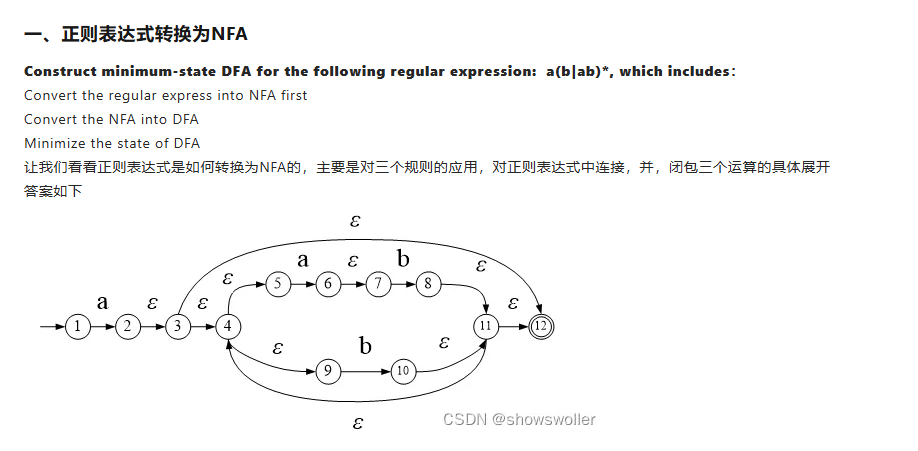

### C.2使用子集构造法将NFA转DFA

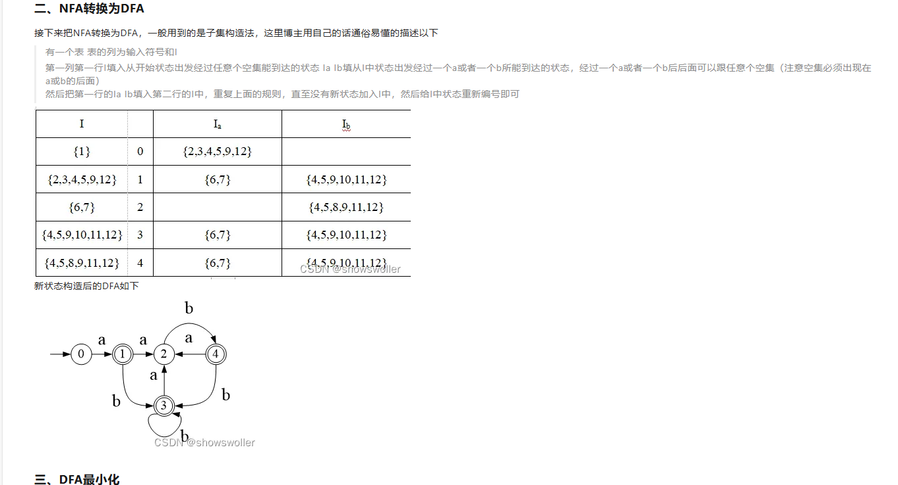

### C.3DFA最小化

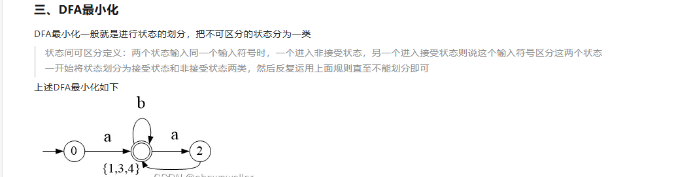

## D.LL分析法

### D.1First集和Follow集的计算

First集和Follow集是编译原理中用于构造LL(1)文法分析表的重要工具。下面我将详细介绍它们的计算方法和规则。

## First集的计算

First(α)定义为可从α推导出的所有可能串的第一个终结符的集合，其中α是任意的文法符号串。

### 计算规则：

1. **对于终结符a**：
    First(a) = {a}
2. **对于非终结符A**：
   - 对于每个产生式A → Y₁Y₂...Yₙ：
     - 将First(Y₁)中非ε的元素加入First(A)
     - 如果First(Y₁)包含ε，则继续检查First(Y₂)，依此类推
     - 如果所有First(Yᵢ)都包含ε，则将ε加入First(A)
   - 重复上述过程直到First集不再变化
3. **对于符号串X₁X₂...Xₙ**：
   - First(X₁X₂...Xₙ)包含First(X₁)中非ε的元素
   - 如果First(X₁)包含ε，则加入First(X₂)中非ε的元素
   - 依此类推，如果所有First(Xᵢ)都包含ε，则加入ε

### 示例：

考虑文法：

```
E → TE'
E' → +TE' | ε
T → FT'
T' → *FT' | ε
F → (E) | id
```

计算First集：

1. First(F) = {'(', 'id'}
2. First(T') = {'*', ε}
3. First(T) = First(F) = {'(', 'id'}
4. First(E') = {'+', ε}
5. First(E) = First(T) = {'(', 'id'}

## Follow集的计算

Follow(A)定义为在某些句型中紧跟在非终结符A后面的终结符的集合。

### 计算规则：

1. 将$（结束标记）加入Follow(S)，其中S是开始符号
2. 对于每个产生式A → αBβ：
   - 将First(β)中非ε的元素加入Follow(B)
   - 如果First(β)包含ε，则将Follow(A)加入Follow(B)
3. 对于产生式A → αB，将Follow(A)加入Follow(B)
4. 重复上述过程直到所有Follow集不再变化

### 示例：

E → TE'
E' → +TE' | ε
T → FT'
T' → *FT' | ε
F → (E) | id

继续使用上面的文法计算Follow集：

1. Follow(E) = {$, ')'} （因为F → (E)）
2. Follow(E') = Follow(E) = {$, ')'}
3. Follow(T):
   - 从E → TE'，First(E')={'+',ε}，所以Follow(T)包含First(E')中非ε的元素：{'+'}
   - 因为E'可以推导出ε，所以还要加入Follow(E)：{$, ')', '+'}
4. Follow(T') = Follow(T) = {$, ')', '+'}
5. Follow(F):
   - 从T → FT'，First(T')={'*',ε}，所以Follow(F)包含{'*'}
   - 因为T'可以推导出ε，所以还要加入Follow(T)：{$, ')', '+', '*'}

### D.2 LL(1)分析表的计算

1. 对每个产生式 A → α：
   - 对每个终结符 a ∈ First(α)，将 A → α 加入 M[A,a]
   - 如果 ε ∈ First(α)，则对每个终结符 b ∈ Follow(A)，将 A → α 加入 M[A,b]
2. 所有未定义的条目标记为"错误"

```java
E → TE'
E' → +TE' | ε
T → FT'
T' → *FT' | ε
F → (E) | id
```

```java
First(E) = First(T) = First(F) = {'(', 'id'}
First(E') = {'+', ε}
First(T') = {'*', ε}
```

```java
Follow(E) = {')', '$'}
Follow(E') = {')', '$'}
Follow(T) = {'+', ')', '$'}
Follow(T') = {'+', ')', '$'}
Follow(F) = {'*', '+', ')', '$'}
```

| 非终结符 |   id    |     +     |     *     |    (    |   )    |   $    |
| :------: | :-----: | :-------: | :-------: | :-----: | :----: | :----: |
|    E     | E → TE' |           |           | E → TE' |        |        |
|    E'    |         | E' → +TE' |           |         | E' → ε | E' → ε |
|    T     | T → FT' |           |           | T → FT' |        |        |
|    T'    |         |  T' → ε   | T' → *FT' |         | T' → ε | T' → ε |
|    F     | F → id  |           |           | F → (E) |        |        |

### D.3LL(1)文法的判别

设文法 $ G = (V, T, P, S) $，需满足：

**条件 1: FIRST-FOLLOW 无冲突**
$$
\forall A \in V \text{ 及产生式 } A \to \alpha \mid \beta:
$$

$$
\text{FIRST}(\alpha) \cap \text{FIRST}(\beta) = \emptyset 
$$

若 $\epsilon \in \text{FIRST}(\alpha)$，则额外要求：
$$
\text{FIRST}(\beta) \cap \text{FOLLOW}(A) = \emptyset
$$

**条件 2: 无左递归**

文法 $ G $ 不能含直接或间接左递归。

### D.4消除左递归、提取公共左因子

以下是关于消除左递归和提取公共左因子的说明，使用 Typora 支持的 Markdown 格式输出：

------

**语法分析中的文法变换**

1. **消除左递归**

左递归分为 **直接左递归** 和 **间接左递归**，消除方法如下：

直接左递归的消除

给定产生式形式：
 `A → Aα | β` （其中 `β` 不以 `A` 开头）

**消除步骤：**

1. 引入新的非终结符 `A'`

2. 重写产生式为：

   ```
   A  → βA'
   A' → αA' | ε
   ```

**示例：**
 原始文法：
 `E → E + T | T`
 消除后：

```
E  → TE'
E' → +TE' | ε
```

**间接左递归的消除**

1. 对所有非终结符按固定顺序排列（如 `A₁, A₂, ..., Aₙ`）
2. 对于每个 `Aᵢ`，用 `Aⱼ`（`j < i`）的产生式替换 `Aᵢ` 中的 `Aⱼ`
3. 消除 `Aᵢ` 的直接左递归

------

2. **提取公共左因子**

当多个产生式有共同前缀时，可以提取公共左因子以减少回溯。

**步骤：**

1. 找出形如 `A → αβ₁ | αβ₂ | ... | αβₙ | γ` 的产生式
    （`α` 为公共前缀，`γ` 是不以 `α` 开头的产生式）

2. 引入新非终结符 

   ```
   A'
   ```

   ，重写为：

   ```
   A  → αA' | γ
   A' → β₁ | β₂ | ... | βₙ
   ```

**示例：**
 原始文法：
 `S → if E then S else S | if E then S`
 提取后：

```
S  → if E then S S'
S' → else S | ε
```

------

**对比表格**

| 操作类型       | 适用场景             | 变换方法                 | 新增符号 |
| -------------- | -------------------- | ------------------------ | -------- |
| 消除直接左递归 | `A → Aα | β`         | 引入右递归 `A'`          | 是       |
| 提取公共左因子 | 多个产生式有共同前缀 | 提取前缀并引入新非终结符 | 是       |

------

**注意事项**

1. 消除左递归可能改变算符结合性（左递归→右递归）
2. 提取左因子后可能需要处理 `ε` 产生式
3. 两种变换均适用于 LL(k) 文法

**题目：判断以下文法G是否为LL(1)文法，并详细说明每一步骤。**

给定文法G：

```
S → a A | B  
A → a B | ε  
B → S b | c  
```

------

### **解答步骤：**

#### **1. 消除所有类型的左递归**

文法中存在**间接左递归**：

- 由 `B → S b` 和 `S → B`，可推导出 `B ⇒ S b ⇒ B b`，形成间接左递归。

**消除步骤：**

- 将`S`的产生式代入`B → S b`中：
   `B → (a A | B) b → a A b | B b`
   此时，`B`的产生式变为：
   `B → a A b | B b | c`
   产生直接左递归 `B → B b`。

- 引入新非终结符`B'`消除直接左递归：

  ```
  B  → a A b B' | c B'  
  B' → b B' | ε  
  ```

消除左递归后的文法G'：

```
S  → a A | B  
A  → a B | ε  
B  → a A b B' | c B'  
B' → b B' | ε  
```

------

#### **2. 提取左公因子（若存在）**

检查所有产生式：

- `S → a A | B`：无左公因子。
- `A → a B | ε`：无左公因子。
- `B → a A b B' | c B'`：无左公因子。
- `B' → b B' | ε`：无左公因子。

无需提取左公因子。

------

#### **3. 计算各非终结符的FIRST集和FOLLOW集**

**FIRST集计算：**

- `FIRST(S) = FIRST(a A) ∪ FIRST(B) = {a} ∪ {a, c} = {a, c}`
- `FIRST(A) = {a} ∪ {ε} = {a, ε}`
- `FIRST(B) = {a, c}`
- `FIRST(B') = {b} ∪ {ε} = {b, ε}`

**FOLLOW集计算：**

- **规则1**：`FOLLOW(S)`包含`$`（开始符号）。
   由`B → S b`，`FOLLOW(S) += {b}`。
   ∴ `FOLLOW(S) = {b, $}`
- **规则2**：`FOLLOW(A)`：
  - `S → a A` ⇒ `FOLLOW(A) += FOLLOW(S) = {b, $}`
  - `B → a A b B'` ⇒ `FOLLOW(A) += FIRST(b B') = {b}`
     ∴ `FOLLOW(A) = {b, $}`
- **规则3**：`FOLLOW(B)`：
  - `S → B` ⇒ `FOLLOW(B) += FOLLOW(S) = {b, $}`
  - `A → a B` ⇒ `FOLLOW(B) += FOLLOW(A) = {b, $}`
     ∴ `FOLLOW(B) = {b, $}`
- **规则4**：`FOLLOW(B')`：
  - `B → a A b B'` 和 `B → c B'` ⇒ `FOLLOW(B') += FOLLOW(B) = {b, $}`
     ∴ `FOLLOW(B') = {b, $}`

------

#### **4. 检查每个非终结符是否满足LL(1)条件**

对每个非终结符的不同产生式，检查以下条件：

- **条件1**：同一非终结符的不同产生式的`FIRST`集互不相交。
- **条件2**：若某个产生式可推导出`ε`，则其`FIRST`集与`FOLLOW`集不相交。

**具体检查：**

1. **非终结符`S`：**
   - 产生式：`S → a A | B`
   - `FIRST(a A) = {a}`，`FIRST(B) = {a, c}`
   - 交集为`{a} ≠ ∅`，违反条件1。
2. **非终结符`A`：**
   - 产生式：`A → a B | ε`
   - `FIRST(a B) = {a}`，`FIRST(ε) = {ε}`
   - 无交集，满足条件1。
   - 对`A → ε`，检查`FIRST(ε) ∩ FOLLOW(A) = {ε} ∩ {b, $} = ∅`，满足条件2。
3. **非终结符`B`：**
   - 产生式：`B → a A b B' | c B'`
   - `FIRST(a A b B') = {a}`，`FIRST(c B') = {c}`
   - 无交集，满足条件1。
4. **非终结符`B'`：**
   - 产生式：`B' → b B' | ε`
   - `FIRST(b B') = {b}`，`FIRST(ε) = {ε}`
   - 无交集，满足条件1。
   - 对`B' → ε`，检查`FIRST(ε) ∩ FOLLOW(B') = {ε} ∩ {b, $} = ∅`，满足条件2。

------

### **结论**

由于非终结符`S`的两种产生式`S → a A`和`S → B`的`FIRST`集存在交集`{a}`，**文法G不是LL(1)文法**。即使消除了左递归，仍不满足LL(1)条件。

## E.LR分析法

### E.1LR（0）自动机的计算

设 LR(0) 自动机的项目集族为 $ \{ I_0, I_1, \dots, I_n \} $，需满足：
$$
\forall I_k, \text{若存在项目 } [A \to \alpha \cdot] \in I_k, \text{则 } I_k \text{ 中不能有：}
$$

1. 移进项目：$ [B \to \beta \cdot a \gamma] $
2. 其他归约项目：$ [C \to \delta \cdot] $

即 **不允许移进-归约或归约-归约冲突**。

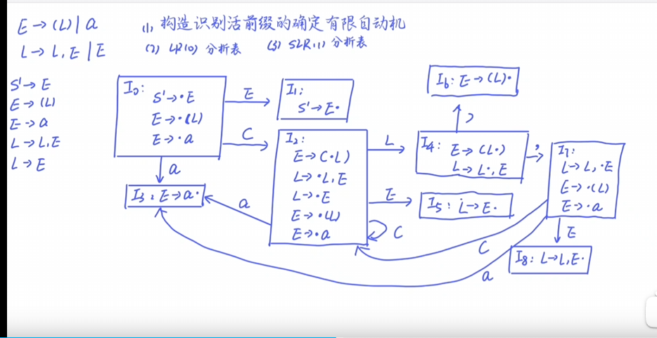

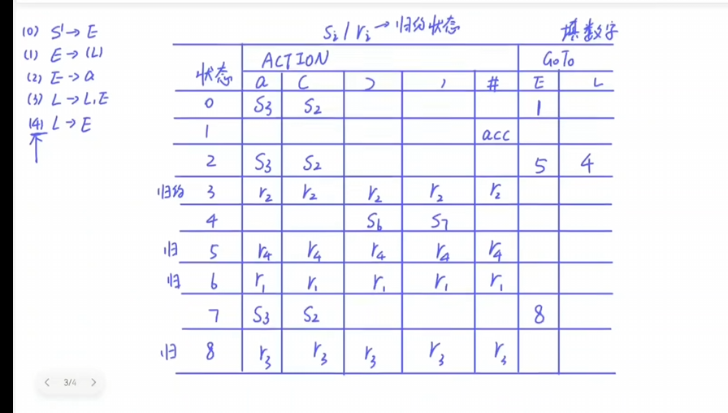


### E.2SLR(1)文法的判别与证明

在 LR(0) 基础上，对冲突项目集 $ I_k $​​：

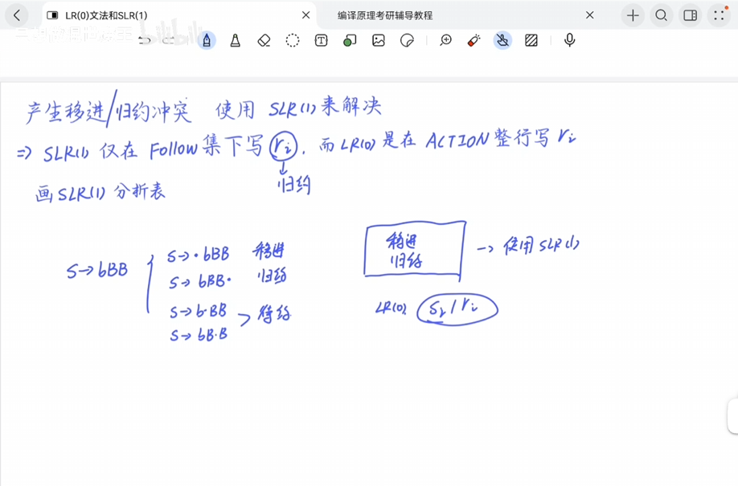

follow集的意思是：你要规约成(1)时候 你就看(1)这个产生式的左侧 求这个左侧的Follow集合 然后只在Action表中的follow集中出现的元素处写r1

SLR(1)分析表和LR(0)分析表的主要差异就在于r(x)的出现次数变少了。

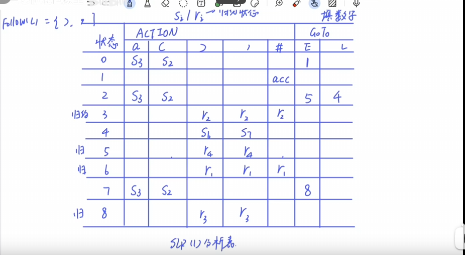

#### 移进-归约冲突

若存在 $ [A \to \alpha \cdot a \beta] $ 和 $ [B \to \gamma \cdot] $，则要求：
$$
a \notin \text{FOLLOW}(B)
$$

#### 归约-归约冲突

若存在 $ [A \to \beta \cdot] $ 和 $ [B \to \gamma \cdot] $，则要求：
$$
\text{FOLLOW}(A) \cap \text{FOLLOW}(B) = \emptyset
$$

---

### E.3LR(1)文法的判别与证明

设 LR(1) 项目集族为 $ \{ J_0, J_1, \dots, J_m \} $，需满足：
$$
\forall J_k, \text{若存在项目 } [A \to \alpha \cdot, a] \text{，则 } J_k \text{ 中不能有：}
$$

1. 移进项目 $ [B \to \beta \cdot b \gamma, c] $ 满足 $ a = b $
2. 其他归约项目 $ [C \to \delta \cdot, d] $ 满足 $ a = d $

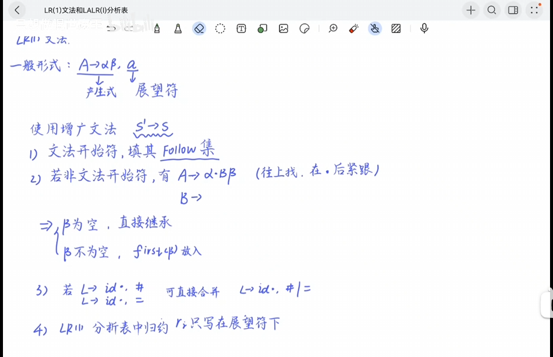

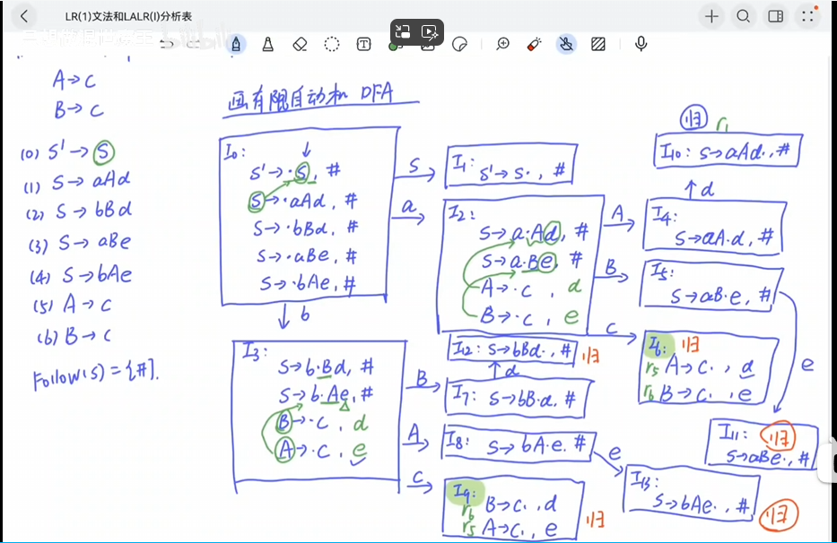

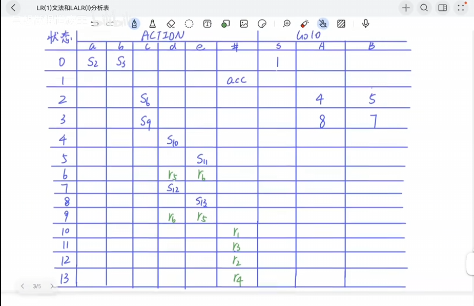

### E.4LALR(1)文法的判别与证明

合并 LR(1) 的同心项目集后得到 $ \{ K_0, K_1, \dots, K_p \} $，需满足：
$$
\forall K_i, \text{合并后的项目 } [A \to \alpha \cdot, a/b] \text{ 不与其他项目冲突}
$$
即：
$$
\{a, b\} \cap \{\text{移进符号}\} = \emptyset
$$

---

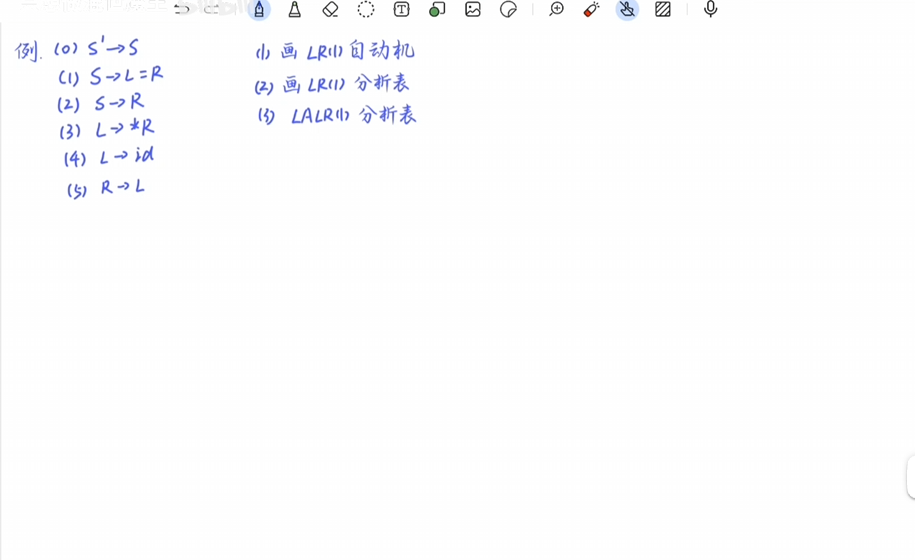

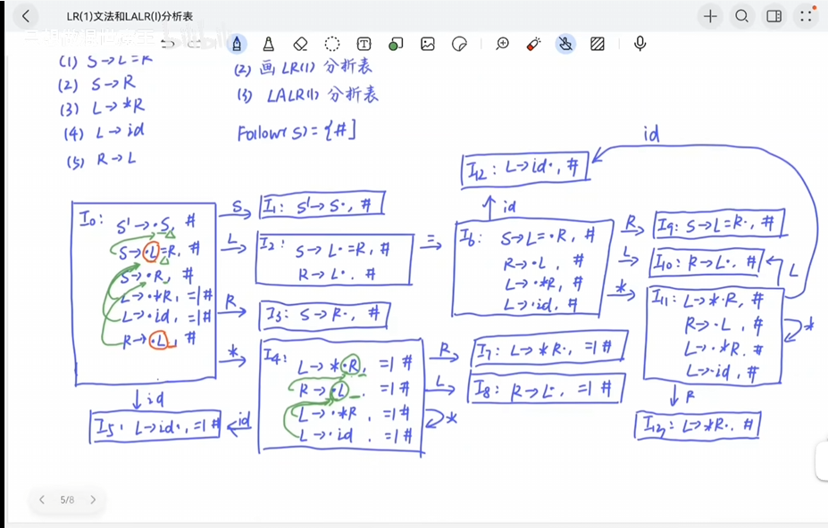

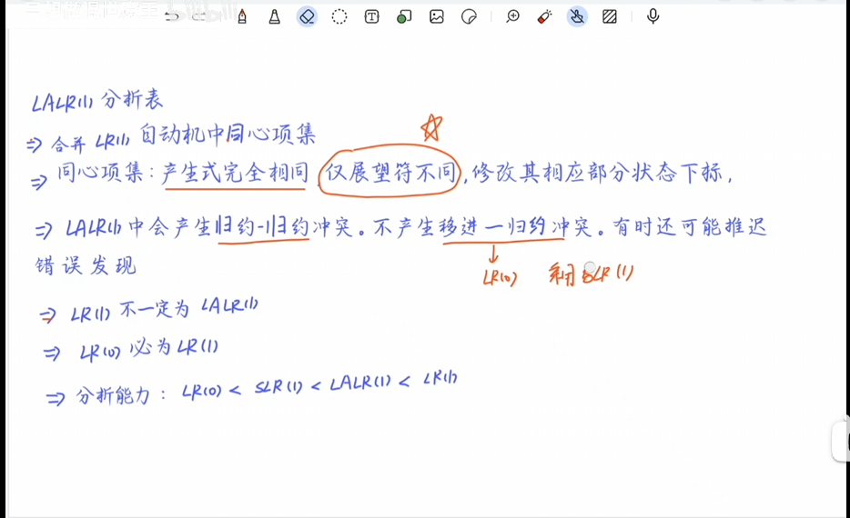

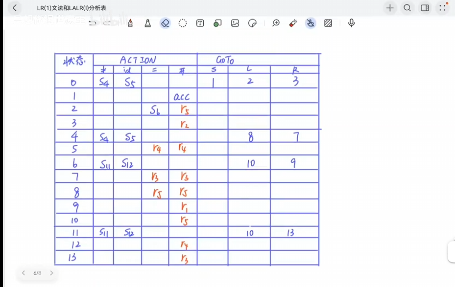

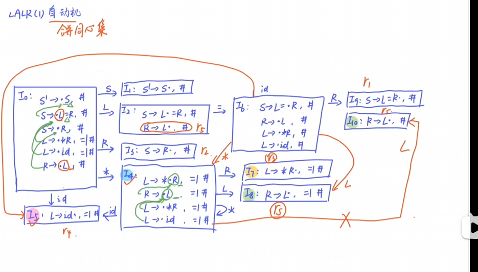

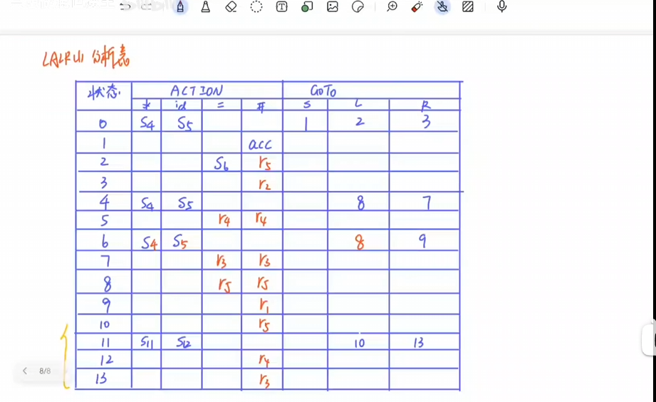

删去10、11、12、13

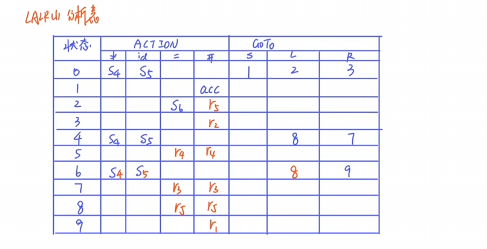

## F.中间代码表示

### F.1中缀表达式

> # 编译原理：中缀表达式
>
> ## 概念讲解
>
> ### 什么是中缀表达式
>
> 中缀表达式(Infix Notation)是我们日常生活中最常用的数学表达式表示方法，其特点是运算符位于两个操作数之间。例如：
>
> ```
> a + b
> 3 * (4 + 5)
> x - y / z
> ```
>
> ### 中缀表达式的特点
>
> 1. **运算符优先级**：不同运算符有不同的优先级，如乘除高于加减
> 2. **括号改变优先级**：可以使用括号来改变默认的运算顺序
> 3. **结合性**：相同优先级的运算符有左结合或右结合的规则
>
> ### 中缀表达式的处理难点
>
> 在编译过程中，中缀表达式需要转换为计算机更容易处理的形式(如后缀表达式或语法树)，因为：
>
> 1. 运算符优先级和括号增加了分析的复杂性
> 2. 需要处理运算符的结合性
> 3. 需要处理一元运算符和多元运算符
>
> ## 题目讲解
>
> ### 题目1：将中缀表达式转换为后缀表达式
>
> 将以下中缀表达式转换为后缀表达式(逆波兰表示法)：
>
> ```
> (3 + 4) * 5 - 6
> 
> stack:
> *-
> ```
>
> #### 解答步骤：
>
> 1. 初始化一个空栈用于存放运算符，一个空列表用于输出
> 2. 从左到右扫描中缀表达式：
>    - 遇到数字(3)：直接输出 → 输出列表：[3]
>    - 遇到'('：压入栈 → 栈：['(']
>    - 遇到'+'：栈顶是'('，直接压入 → 栈：['(', '+']
>    - 遇到数字(4)：直接输出 → 输出列表：[3, 4]
>    - 遇到')'：弹出栈顶直到'(' → 弹出'+'并输出 → 输出列表：[3, 4, +] → 弹出'('
>    - 遇到'*'：栈空，直接压入 → 栈：['*']
>    - 遇到数字(5)：直接输出 → 输出列表：[3, 4, +, 5]
>    - 遇到'-'：栈顶'*'优先级高于'-'，弹出'*'并输出 → 输出列表：[3, 4, +, 5, *] → 栈空，压入'-' → 栈：['-']
>    - 遇到数字(6)：直接输出 → 输出列表：[3, 4, +, 5, *, 6]
> 3. 表达式结束，弹出栈中剩余运算符 → 弹出'-'并输出 → 输出列表：[3, 4, +, 5, *, 6, -]
>
> 最终后缀表达式：`3 4 + 5 * 6 -`
>
> ### 题目2：构建中缀表达式的语法树
>
> 为以下中缀表达式构建抽象语法树(AST)：
>
> ```
> a + b * c - d
> ```
>
> #### 解答步骤：
>
> 考虑运算符优先级(*高于+和-，+和-左结合)：
>
> 1. 首先处理b * c：
>
>    ```
>      *
>     / \
>    b   c
>    ```
>
> 2. 然后处理a + (b * c)：
>
>    ```
>       +
>      / \
>     a   *
>        / \
>       b   c
>    ```
>
> 3. 最后处理(a + (b * c)) - d：
>
>    ```
>         -
>        / \
>       +   d
>      / \
>     a   *
>        / \
>       b   c
>    ```
>
> 最终语法树反映了运算的优先级和顺序。
>
> ### 题目3：计算中缀表达式的值
>
> 计算以下中缀表达式的值：
>
> ```
> 2 * (3 + 4) - 5 / 2
> ```
>
> #### 解答步骤：
>
> 1. 先计算括号内的3 + 4 = 7
> 2. 然后计算2 * 7 = 14
> 3. 计算5 / 2 = 2.5
> 4. 最后计算14 - 2.5 = 11.5
>
> 最终结果：11.5
>
> ## 总结
>
> 中缀表达式是编译原理中重要的概念，理解其转换和处理方法对于编写编译器或解释器至关重要。关键点包括：
>
> 1. 掌握中缀转后缀的算法
> 2. 理解运算符优先级和结合性
> 3. 能够构建表达式的语法树
> 4. 掌握表达式的求值顺序
>
> 这些知识是后续学习语法分析、中间代码生成等编译技术的基础。

### F.2后缀表达式

> # 中等复杂度的中缀转后缀表达式题目
>
> ## 题目要求
>
> 将以下包含常见运算符和括号的中缀表达式转换为后缀表达式：
>
> ```
> (5 + 3) * 6 - 8 / 4 ^ 2
> ```
>
> ## 运算符优先级表（从高到低）
>
> | 运算符 | 描述   | 结合性                                                       |
> | ------ | ------ | ------------------------------------------------------------ |
> | ^      | 幂运算 | 右结合                                                       |
> | * /    | 乘除   | 左结合                                                       |
> | + -    | 加减   | 左结合                                                       |
> | (和）  | 括号   | 非常特殊-当有左括号压入时-遇到有括号后，左括号后的一切符号都要出栈，同时两个括号出栈 |
>
> ## 解答步骤
>
> 1. 初始化空栈和空输出列表
> 2. 从左到右扫描表达式：
>
> ```
> 符号  动作                            栈          输出
> (     直接压入                       [(]         []
> 5     数字，直接输出                  [(]         [5]
> +     栈顶是(，直接压入               [(,+]       [5]
> 3     数字，直接输出                  [(,+]       [5,3]
> )     弹出+输出，弹出(丢弃             []          [5,3,+]
> *     栈空，直接压入                  [*]         [5,3,+]
> 6     数字，直接输出                  [*]         [5,3,+,6]
> -     优先级低于*，弹出*输出           []          [5,3,+,6,*]
>        压入-                          [-]         [5,3,+,6,*]
> 8     数字，直接输出                  [-]         [5,3,+,6,*,8]
> /     优先级高于-，压入               [-,/]       [5,3,+,6,*,8]
> 4     数字，直接输出                  [-,/]       [5,3,+,6,*,8,4]
> ^     优先级高于/，压入               [-,/,^]     [5,3,+,6,*,8,4]
> 2     数字，直接输出                  [-,/,^]     [5,3,+,6,*,8,4,2]
> 结束  弹出^、/、-输出                 []          [5,3,+,6,*,8,4,2,^,/,-]
> ```
>
> ## 最终后缀表达式
>
> ```
> 5 3 + 6 * 8 4 2 ^ / -
> ```
>
> ## 验证计算步骤
>
> 让我们按照后缀表达式计算：
>
> 1. `5 3 +` → 8
> 2. `8 6 *` → 48
> 3. `8 4 2 ^` → 先计算`4 2 ^`=16
> 4. `8 16 /` → 0.5
> 5. `48 0.5 -` → 47.5
>
> 验证原始表达式：
>
> ```
> (5 + 3) * 6 - 8 / 4 ^ 2
> = 8 * 6 - 8 / 16
> = 48 - 0.5
> = 47.5
> ```
>
> 结果一致，转换正确。

### F.3三元式与四元式的转换

> # 三元式与四元式的转换（编译原理）
>
> ## 一、基本概念
>
> ### 1. 三元式
>
> 三元式是一种中间代码表示形式，由三个部分组成：
>
> ```
> (运算符, 操作数1, 操作数2)
> ```
>
> - 优点：结构紧凑，节省存储空间
> - 缺点：难以优化和重排序
>
> 示例：
>
> ```
> (+, a, b)    // 表示 a + b
> (*, c, 3)    // 表示 c * 3
> ```
>
> ### 2. 四元式
>
> 四元式是另一种中间代码表示形式，由四个部分组成：
>
> ```
> (运算符, 操作数1, 操作数2, 结果)
> ```
>
> - 优点：便于优化和代码重排
> - 缺点：占用更多存储空间
>
> 示例：
>
> ```
> (+, a, b, t1)  // 表示 t1 = a + b
> (*, c, 3, t2)  // 表示 t2 = c * 3
> ```
>
> ## 二、转换方法
>
> ### 1. 三元式转四元式
>
> 转换步骤：
>
> 1. 为每个三元式分配一个临时变量作为结果
> 2. 将三元式的三个部分作为四元式的前三个部分
> 3. 将分配的临时变量作为四元式的第四个部分
>
> 示例：
>
> ```
> 三元式序列：
> (+, a, b)
> (*, c, 3)
> (-, (1), (2))
> 
> 转换为四元式：
> (1) (+, a, b, t1)
> (2) (*, c, 3, t2)
> (3) (-, t1, t2, t3)
> ```
>
> ### 2. 四元式转三元式
>
> 转换步骤：
>
> 1. 去掉四元式的结果部分
> 2. 如果操作数是临时变量，需要记录其对应的原始表达式
>
> 示例：
>
> ```
> 四元式序列：
> (1) (+, a, b, t1)
> (2) (*, c, 3, t2)
> (3) (-, t1, t2, t3)
> 
> 转换为三元式：
> (1) (+, a, b)
> (2) (*, c, 3)
> (3) (-, (1), (2))  // 使用编号引用前面的结果
> ```
>
> ## 三、转换示例
>
> ### 示例1：简单表达式
>
> 中缀表达式：`a + b * c`
>
> 1. 三元式表示：
>
> ```
> (1) (*, b, c)
> (2) (+, a, (1))
> ```
>
> 1. 转换为四元式：
>
> ```
> (1) (*, b, c, t1)
> (2) (+, a, t1, t2)
> ```
>
> ### 示例2：带括号的表达式
>
> 中缀表达式：`(a + b) * c - d`
>
> 1. 三元式表示：
>
> ```
> (1) (+, a, b)
> (2) (*, (1), c)
> (3) (-, (2), d)
> ```
>
> 1. 转换为四元式：
>
> ```
> (1) (+, a, b, t1)
> (2) (*, t1, c, t2)
> (3) (-, t2, d, t3)
> ```
>
> ## 四、比较与选择
>
> | 特性         | 三元式                  | 四元式           |
> | ------------ | ----------------------- | ---------------- |
> | 存储空间     | 更节省                  | 需要更多空间     |
> | 优化便利性   | 较难优化                | 便于优化         |
> | 代码重排     | 困难                    | 容易             |
> | 临时变量管理 | 隐式引用                | 显式管理         |
> | 适用场景     | 简单编译器/空间受限环境 | 需要优化的编译器 |
>
> 在实际编译器设计中，四元式更为常用，因为：
>
> 1. 更清晰的中间表示
> 2. 便于进行各种优化
> 3. 更容易生成目标代码
> 4. 调试和维护更方便
>
> ## 五、练习题
>
> 1. 将以下三元式转换为四元式：
>
> ```
> (1) (+, x, y)
> (2) (*, 3, (1))
> (3) (-, z, (2))
> ```
>
> 1. 将以下四元式转换为三元式：
>
> ```
> (1) (+, a, b, t1)
> (2) (*, t1, c, t2)
> (3) (/, t2, d, t3)
> ```
>
> 1. 为中缀表达式 
>
>    ```
>    a * (b + c) - d / e
>    ```
>
>     生成：
>
>    - 三元式表示
>    - 四元式表示
>    - 并比较两种表示的区别

# G.技术场景题

### G.1：符号表实现方式的选择与比较

> # 符号表实现方式的选择与比较（编译原理）
>
> ## 一、符号表的基本概念
>
> 符号表是编译器中的一个重要数据结构，用于存储程序中各种标识符（变量名、函数名、类型名等）的属性信息，包括：
>
> - 标识符名称
> - 类型信息
> - 存储类别（全局/局部/参数等）
> - 存储位置（地址/偏移量）
> - 作用域信息
> - 其他属性（数组维数、函数参数等）
>
> ## 二、主要实现方式及比较
>
> ### 1. 线性表（数组/链表）
>
> **实现方式**：
>
> - 使用数组或链表顺序存储符号表项
> - 查找时采用线性搜索
>
> **特点**：
>
> ```
> 优点：
> - 实现简单
> - 插入操作高效（O(1)）
> - 内存连续，访问局部性好
> 
> 缺点：
> - 查找效率低（O(n)）
> - 删除操作可能复杂
> ```
>
> **适用场景**：
>
> - 小型编译器
> - 符号数量较少的情况（<100个符号）
> - 教学用编译器实现
>
> ### 2. 哈希表
>
> **实现方式**：
>
> - 使用哈希函数将标识符映射到固定大小的表中
> - 处理冲突的方法：链地址法/开放定址法
>
> **特点**：
>
> ```
> 优点：
> - 平均查找时间O(1)
> - 插入和查找效率高
> - 实现相对简单
> 
> 缺点：
> - 哈希函数设计影响性能
> - 冲突处理增加复杂度
> - 不适合动态作用域
> - 内存使用不连续
> ```
>
> **适用场景**：
>
> - 大多数实用编译器
> - 符号数量中等至大量
> - 静态作用域语言
>
> ### 3. 二叉搜索树（BST）
>
> **实现方式**：
>
> - 按照标识符的字典序组织二叉搜索树
> - 平衡BST（AVL/红黑树）可保证性能
>
> **特点**：
>
> ```
> 优点：
> - 查找效率O(log n)
> - 支持有序遍历
> - 动态扩展性好
> 
> 缺点：
> - 实现复杂度较高（特别是平衡树）
> - 平均性能不如哈希表
> - 内存使用不连续
> ```
>
> **适用场景**：
>
> - 需要有序访问符号的场景
> - 动态作用域语言
> - 符号数量变化大的情况
>
> ### 4. 多级符号表（作用域嵌套）
>
> **实现方式**：
>
> - 使用栈式结构管理不同作用域的符号表
> - 每个作用域对应一个符号表（通常用哈希表实现）
>
> **特点**：
>
> ```
> 优点：
> - 天然支持作用域嵌套
> - 进入/退出作用域操作高效
> - 符号查找符合语言语义
> 
> 缺点：
> - 实现复杂度较高
> - 需要额外管理作用域
> - 内存使用较多
> ```
>
> **适用场景**：
>
> - 支持块结构作用域的语言（C/C++/Java等）
> - 需要处理嵌套作用域的编译器
>
> ## 三、实现方式对比表
>
> | 实现方式   | 平均查找时间   | 插入效率 | 删除效率 | 内存效率 | 实现复杂度 | 作用域支持 |
> | ---------- | -------------- | -------- | -------- | -------- | ---------- | ---------- |
> | 线性表     | O(n)           | O(1)     | O(n)     | 高       | 简单       | 差         |
> | 哈希表     | O(1)           | O(1)     | O(1)     | 中       | 中等       | 一般       |
> | 二叉搜索树 | O(log n)       | O(log n) | O(log n) | 中       | 较高       | 好         |
> | 多级符号表 | O(1) per level | O(1)     | O(1)     | 较低     | 高         | 优秀       |
>
> ## 四、选择建议
>
> 1. **根据语言特性选择**：
>    - 简单语言（如Pascal子集）：线性表或简单哈希表
>    - 块结构语言（C/Java）：多级哈希表
>    - 函数式语言（Lisp/Scheme）：可能需要更复杂的符号表结构
> 2. **根据编译器用途选择**：
>    - 教学编译器：线性表或简单哈希表（易于理解）
>    - 生产编译器：多级哈希表（性能优先）
>    - 研究型编译器：可根据研究目标选择特殊结构
> 3. **性能考虑**：
>    - 符号数量<100：线性表足够
>    - 符号数量100-1000：哈希表
>    - 符号数量>1000：多级哈希表或高级数据结构
> 4. **作用域处理**：
>    - 无嵌套作用域：简单哈希表
>    - 有嵌套作用域：必须使用多级符号表结构
>
> ## 五、现代编译器实践
>
> 现代编译器（如GCC、LLVM）通常采用：
>
> 1. **多级哈希表**作为主要实现方式
> 2. **分离的数据结构**存储不同类型符号（变量/函数/类型）
> 3. **高效的内存管理**策略（内存池、延迟释放等）
> 4. **附加的辅助结构**加速特定查询（如类型查询）
>
> 示例：LLVM的符号表实现特点
>
> - 使用高效的StringMap（基于哈希）
> - 作用域管理使用显式的Scope栈
> - 符号表与AST紧密集成
> - 支持快速查找和修改

### G.2：词法分析技术的选择与比较

> # 编译原理中的词法分析技术：选择与比较
>
> 词法分析(Lexical Analysis)是编译过程的第一阶段，负责将源代码转换为一系列有意义的词素(Token)。以下是主要词法分析技术的比较与选择指南：
>
> ## 主要词法分析技术
>
> ### 1. 手工编码的词法分析器
>
> - **实现方式**：直接编写代码识别词素
> - 优点：
>   - 完全控制，性能最优
>   - 适合简单语法或特殊需求
> - 缺点：
>   - 开发效率低
>   - 维护成本高
> - **典型应用**：早期编译器、性能关键场景
>
> ### 2. 基于正则表达式的工具
>
> - **代表工具**：Lex/Flex
> - **实现方式**：使用正则表达式定义词法规则
> - 优点：
>   - 开发效率高
>   - 可读性好
>   - 自动生成高效代码
> - 缺点：
>   - 对复杂词法规则支持有限
>   - 灵活性不如手工编码
> - **典型应用**：大多数现代编译器前端
>
> ### 3. 基于有限自动机(DFA/NFA)
>
> - 实现方式：
>   - 非确定有限自动机(NFA)
>   - 确定有限自动机(DFA)
> - 优点：
>   - 理论基础扎实
>   - 可以优化为最小DFA
> - 缺点：
>   - 直接实现较复杂
>   - 通常作为其他技术的底层实现
> - **典型应用**：词法分析器生成器的内部实现
>
> ### 4. 基于解析组合子(Parser Combinator)
>
> - **实现方式**：函数式编程中的高阶函数组合
> - 优点：
>   - 高度模块化
>   - 可读性好
>   - 易于扩展
> - 缺点：
>   - 性能通常不如自动生成的分析器
>   - 内存消耗可能较高
> - **典型应用**：函数式语言实现的编译器
>
> ## 技术比较
>
> | 技术       | 开发效率 | 运行效率 | 灵活性 | 学习曲线 | 维护性 |
> | ---------- | -------- | -------- | ------ | -------- | ------ |
> | 手工编码   | 低       | 高       | 高     | 中       | 低     |
> | 正则工具   | 高       | 中-高    | 中     | 低       | 高     |
> | 有限自动机 | 中       | 高       | 中     | 高       | 中     |
> | 解析组合子 | 高       | 中       | 高     | 中       | 高     |
>
> ## 选择建议
>
> 1. **通用编译器开发**：优先考虑Lex/Flex等工具，平衡了开发效率和运行效率
> 2. **教学/研究目的**：可以手工实现或使用有限自动机，加深理解
> 3. **嵌入式/资源受限环境**：考虑手工编码或优化后的DFA实现
> 4. **函数式语言项目**：解析组合子可能是更自然的选择
> 5. **需要动态词法规则**：考虑运行时生成DFA或使用解析组合子
>
> ## 现代发展趋势
>
> - **多语言支持**：词法分析器需要处理Unicode和多种编码
> - **错误恢复**：更智能的错误处理而非简单失败
> - **与语法分析集成**：如ANTLR等工具模糊了词法和语法分析的界限
> - **增量分析**：支持IDE的实时语法检查需求
>
> 选择词法分析技术时，应综合考虑项目需求、团队技能和性能要求，没有放之四海而皆准的最佳方案。

### G.3：语法分析技术的选择与比较

> ### **一、语法分析技术分类**（先明确框架）
>
> 1. **自顶向下分析**
>    - 递归下降分析法：通过递归函数实现，适合手工编写
>    - LL分析法：使用预测分析表，如LL(1)
> 2. **自底向上分析**
>    - 算符优先分析法：专为表达式设计
>    - LR分析法家族：包括LR(0)、SLR(1)、LALR(1)、LR(1)
>    - GLR分析法：处理歧义文法的通用方法
> 3. **其他方法**
>    - 解析组合子（函数式编程）
>    - PEG（Parsing Expression Grammar）
>
> ------
>
> ### **二、关键技术对比**（核心得分点）
>
> |     维度     |   递归下降   |    LL(1)     |    LR(1)     |    GLR     |
> | :----------: | :----------: | :----------: | :----------: | :--------: |
> | **文法限制** | 需消除左递归 |   限制严格   |   限制较少   |   无限制   |
> |   **效率**   |     中等     |     O(n)     |     O(n)     | 最差O(n³)  |
> | **表达能力** |     中等     |      弱      |      强      |    最强    |
> | **实现难度** | 手工编写简单 | 自动生成容易 | 自动生成复杂 | 实现难度高 |
>
> ------
>
> ### **三、典型应用场景**（结合实例）
>
> 1. **教学场景**
>    - 优先选择递归下降（代码直观，便于理解原理）
>    - 示例：C语言小型编译器实验
> 2. **工业级编译器**
>    - 推荐LALR(1)（如Bison/Yacc工具）
>    - 示例：GCC早期版本、PHP语法分析
> 3. **自然语言处理**
>    - 必须使用GLR（处理歧义能力强）
>    - 示例：Google的SyntaxNet
> 4. **领域特定语言(DSL)**
>    - 解析组合子或PEG（开发效率高）
>    - 示例：配置文件解析器
>
> ------
>
> ### **四、选择原则**（总结性陈述）
>
> 1. **文法复杂度**：简单文法用LL，复杂文法用LR/GLR
> 2. **性能需求**：实时系统优先LR，非关键路径可用递归下降
> 3. **开发效率**：快速原型选PEG或解析组合子
> 4. **工具链支持**：工业项目优先成熟工具（如ANTLR）
>
> ------
>
> ### **五、附加分技巧**
>
> - 若题目涉及**错误恢复**：强调LR系列比LL更易实现错误恢复
> - 若题目涉及**IDE支持**：提及增量解析（如Roslyn编译器）
> - 可对比经典工具：ANTLR（LL*）vs Bison（LALR）vs Pest（PEG）

### G.4：中间语言的选择与比较

> # 中间语言的选择与比较
>
> ## 一、中间语言的主要类型
>
> 1. **抽象语法树(AST)**
>    - 特点：保留源代码的语法结构
>    - 优点：
>      - 与源代码高度对应
>      - 便于进行语法级别的转换
>    - 缺点：
>      - 结构复杂
>      - 与目标机器无关性较差
> 2. **三地址码(TAC)**
>    - 特点：每条指令最多三个操作数
>    - 优点：
>      - 简单统一
>      - 便于优化
>    - 缺点：
>      - 表达能力有限
>      - 与硬件无关性一般
> 3. **控制流图(CFG)**
>    - 特点：以基本块为节点表示程序流程
>    - 优点：
>      - 显式控制流
>      - 便于数据流分析
>    - 缺点：
>      - 不适合直接作为最终中间表示
> 4. **静态单赋值形式(SSA)**
>    - 特点：每个变量只赋值一次
>    - 优点：
>      - 简化数据流分析
>      - 便于优化
>    - 缺点：
>      - 转换开销大
>      - 需要phi函数处理控制流合并
> 5. **字节码**
>    - 特点：面向栈或寄存器
>    - 优点：
>      - 紧凑
>      - 跨平台
>    - 缺点：
>      - 解释执行效率低
> 6. **LLVM IR**
>    - 特点：多层次中间表示
>    - 优点：
>      - 丰富的优化基础设施
>      - 良好的可扩展性
>    - 缺点：
>      - 学习曲线陡峭
>
> ## 二、关键比较维度
>
> | 维度           | AST  | TAC  | SSA  | 字节码 | LLVM IR |
> | -------------- | ---- | ---- | ---- | ------ | ------- |
> | **抽象级别**   | 高   | 中   | 低   | 低     | 多层次  |
> | **优化友好度** | 低   | 中   | 高   | 中     | 高      |
> | **转换开销**   | 低   | 中   | 高   | 中     | 高      |
> | **跨平台性**   | 差   | 中   | 好   | 优     | 优      |
> | **调试支持**   | 优   | 中   | 差   | 中     | 中      |
> | **实现复杂度** | 低   | 中   | 高   | 中     | 高      |
>
> ## 三、典型应用场景
>
> 1. **解释型语言实现**
>    - 首选：字节码
>    - 示例：Python、Java JVM
> 2. **优化型编译器**
>    - 首选：SSA或LLVM IR
>    - 示例：GCC、Clang
> 3. **源代码转换工具**
>    - 首选：AST
>    - 示例：代码格式化工具、IDE重构
> 4. **教学编译器**
>    - 首选：TAC
>    - 示例：编译器课程实验
> 5. **JIT编译器**
>    - 首选：多层次表示(AST→SSA)
>    - 示例：V8 JavaScript引擎
>
> ## 四、选择原则
>
> 1. **根据编译器目标**
>    - 解释执行优先考虑字节码
>    - 静态编译优先SSA或LLVM IR
> 2. **根据优化需求**
>    - 需要复杂优化选择SSA
>    - 简单转换AST足够
> 3. **根据目标平台数量**
>    - 多平台选择与硬件无关的表示
>    - 单一平台可考虑更接近目标的表示
> 4. **根据开发资源**
>    - 资源有限选择简单表示(TAC)
>    - 有成熟框架可用选择LLVM IR

### G.5：内存管理技术的选择与比较

> # 编译原理中的内存管理技术：选择与比较
>
> ## 一、内存管理技术分类
>
> ### 1. 静态内存分配
>
> - **特点**：编译时确定内存布局
> - 实现方式：
>   - 全局变量固定地址分配
>   - 局部变量栈帧偏移计算
> - 优点：
>   - 无运行时开销
>   - 可预测性强
> - 缺点：
>   - 不支持动态数据结构
>   - 递归深度受限
> - 典型应用：
>   - 嵌入式系统
>   - 传统Fortran程序
>
> ### 2. 栈式内存分配
>
> - **特点**：LIFO方式管理函数调用上下文
> - 关键机制：
>   - 活动记录(Activation Record)
>   - 栈指针(SP)维护
> - 优点：
>   - 自动管理调用上下文
>   - 高效的内存重用
> - 缺点：
>   - 对象生命周期受限于函数调用
>   - 栈溢出风险
> - 变体：
>   - 分段栈(Golang早期)
>   - 连续栈(现代实现)
>
> ### 3. 堆内存管理
>
> - **特点**：运行时动态分配
> - 管理策略：
>   - 显式分配/释放(malloc/free)
>   - 垃圾回收(GC)自动管理
> - 分配算法：
>   - 首次适应(First-fit)
>   - 最佳适应(Best-fit)
>   - 伙伴系统(Buddy System)
> - 碎片问题：
>   - 外部碎片
>   - 内部碎片
>
> ### 4. 区域式内存管理
>
> - **特点**：基于生命周期的批量管理
> - 实现形式：
>   - 内存池(Memory Pool)
>   - 竞技场(Arena)
> - 优点：
>   - 减少分配/释放次数
>   - 避免碎片累积
> - 缺点：
>   - 需要预判对象生命周期
> - 典型应用：
>   - 编译器自身内存管理
>   - 游戏引擎
>
> ## 二、垃圾回收技术比较
>
> | GC类型    | 暂停时间 | 吞吐量 | 内存开销 | 实现复杂度 | 适用场景     |
> | --------- | -------- | ------ | -------- | ---------- | ------------ |
> | 标记-清除 | 长       | 中     | 低       | 低         | 批处理系统   |
> | 标记-整理 | 长       | 中     | 低       | 中         | 内存紧张环境 |
> | 引用计数  | 无       | 低     | 高       | 低         | 实时系统     |
> | 分代回收  | 短       | 高     | 中       | 高         | 企业应用     |
> | 增量式    | 极短     | 低     | 高       | 高         | 交互式系统   |
> | 并发式    | 无       | 中     | 高       | 极高       | 低延迟服务   |
>
> ## 三、编译器中的特殊考量
>
> 1. **符号表管理**
>    - 通常采用区域式分配
>    - 编译阶段结束后批量释放
> 2. **中间表示存储**
>    - AST多使用内存池
>    - 优化器可能需要临时堆分配
> 3. **目标代码生成**
>    - 静态数据段与代码段分离
>    - 重定位信息特殊处理
> 4. **JIT编译环境**
>    - 需要内存可执行权限管理
>    - 考虑代码垃圾回收
>
> ## 四、选择原则
>
> 1. **根据语言特性**
>    - 系统编程语言：显式堆管理+栈分配
>    - 托管语言：自动GC+逃逸分析优化
> 2. **根据目标平台**
>    - 资源受限设备：静态分配为主
>    - 服务器环境：复杂GC策略
> 3. **根据性能需求**
>    - 实时系统：无暂停GC或RC
>    - 吞吐优先：分代GC
> 4. **根据开发成本**
>    - 手动管理实现简单但易错
>    - 高级GC需要运行时支持

### G.6：编译功能变化时候，需要修改编译程序的哪个部分

> #### 1. 前端修改
>
> **适用场景**：语法/语义层面的变化
>
> - **词法分析器**：
>   ➤ 新增关键字/运算符的识别规则（例：添加`**`幂运算符需扩展正则规则）
>   ➤ 调整词法错误处理（新token的容错处理）
> - **语法分析器**：
>   ➤ 修改文法产生式（例：引入`?:`三元运算符需修改语法规则）
>   ➤ 更新语法错误恢复逻辑
> - **语义分析**：
>   ➤ 扩展符号表结构（例：支持闭包需增加环境记录）
>   ➤ 添加新的类型检查规则（例：引入泛型需修改类型系统）
>
> #### 2. 中端修改
>
> **适用场景**：优化或中间表示变化
>
> - **IR设计**：
>   ➤ 新增IR指令类型（例：支持SIMD需添加向量操作指令）
>   ➤ 调整控制流表示（例：添加异常处理需扩展基本块链接方式）
> - **优化器**：
>   ➤ 增加新的优化Pass（例：引入循环向量化优化）
>   ➤ 修改数据流分析算法（例：支持指针别名分析）
>
> #### 3. 后端修改
>
> **适用场景**：目标平台相关变化
>
> - **代码生成器**：
>   ➤ 扩展指令选择模式（例：支持新CPU指令集如AVX512）
>   ➤ 调整寄存器分配策略（例：新增寄存器类需修改分配算法）
> - **目标文件**：
>   ➤ 修改调试信息格式（例：支持DWARF5标准）

## H.优化技术

### H.1 消除公共表达式（Common Subexpression Elimination, CSE）

**定义**：识别并消除程序中重复计算的相同表达式，用临时变量保存结果供后续使用。

**应用场景**：

- 同一基本块内多次出现的相同表达式（如 `a = b + c; d = b + c;` → `tmp = b + c; a = tmp; d = tmp;`）。
- 跨基本块的全局公共表达式（需数据流分析）。

**实现步骤**：

1. **识别公共表达式**：通过语法树或中间代码匹配相同结构的表达式。
2. **插入临时变量**：在首次出现处计算表达式并存储结果。
3. **替换重复计算**：用临时变量替换后续相同表达式。

**示例**：

```
# 优化前
x = (a + b) * c
y = (a + b) * d

# 优化后（CSE）
tmp = a + b
x = tmp * c
y = tmp * d
```

------

### H.2 复写传播（Copy Propagation）

**定义**：将变量之间的直接赋值关系（如 `x = y`）传播到后续使用中，减少冗余赋值。

**应用场景**：

- 消除中间变量（如 `t = x; y = t;` → `y = x;`）。
- 与其他优化（如死代码消除）结合使用。

**实现步骤**：

1. **追踪复写语句**：记录变量间的赋值关系（如 `x = y`）。

2. 

   传播条件检查

   ：

   - 在 `x` 的引用点，若从赋值到引用之间 `x` 和 `y` 未被重新定义，则可用 `y` 替换 `x`。

3. **删除冗余复写**：若复写语句的变量后续未被使用，可删除。

**示例**：

```
# 优化前
a = x
b = a + 1  # a可替换为x
c = b * 2
d = a      # a可替换为x

# 优化后
b = x + 1
c = b * 2
d = x
```

------

### H.3 消除无用表达式（Dead Code Elimination）

**定义**：移除对程序结果无影响的代码，包括未使用的变量、不可达代码或无效计算。

**分类**：

1. **无用赋值**：变量被定义但未被引用（如 `x = 10;` 后未使用 `x`）。
2. **无用控制流**：不可达的分支（如 `if False: ...`）。
3. **无用计算**：计算结果未被使用的表达式（如 `a + b;` 无副作用且结果丢弃）。

**实现步骤**：

1. **活跃变量分析**：确定变量的使用点是否影响程序输出。

2. 

   标记无用代码

   ：

   - 未被引用的变量定义。
   - 无副作用且结果未使用的表达式。

3. **安全删除**：确保移除的代码不改变程序行为（如不删除含副作用的函数调用）。

**示例**：

```
# 优化前
def foo():
    x = 5      # 无用赋值
    y = 10
    return y
    print("hi") # 不可达代码

# 优化后
def foo():
    y = 10
    return y
```

------

