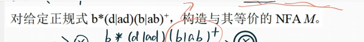
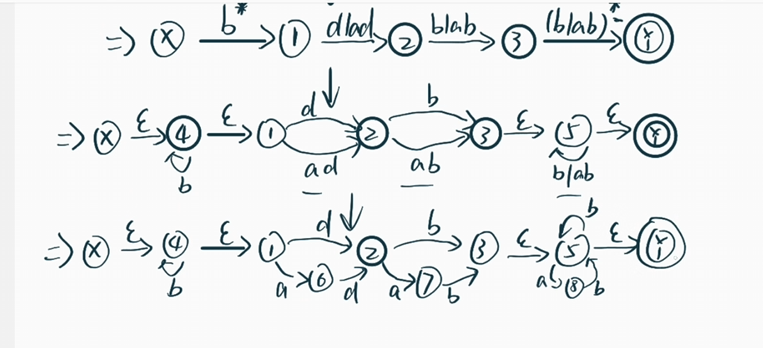
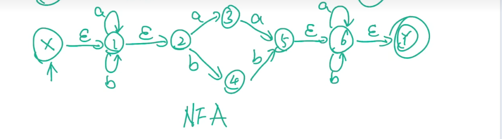
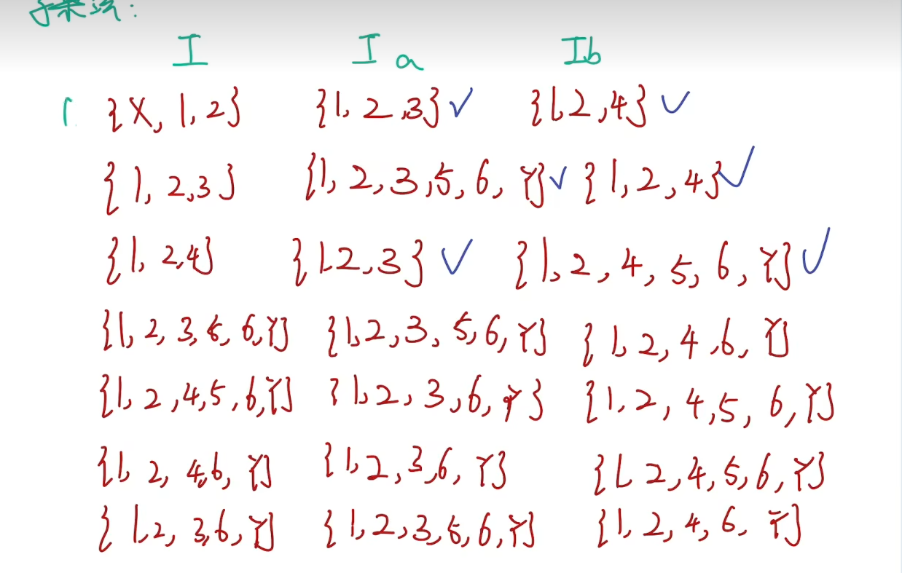
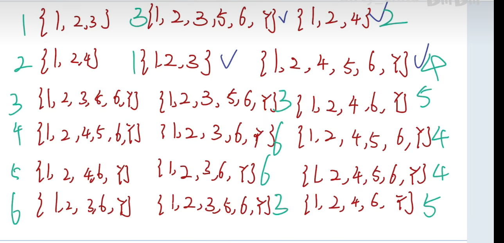
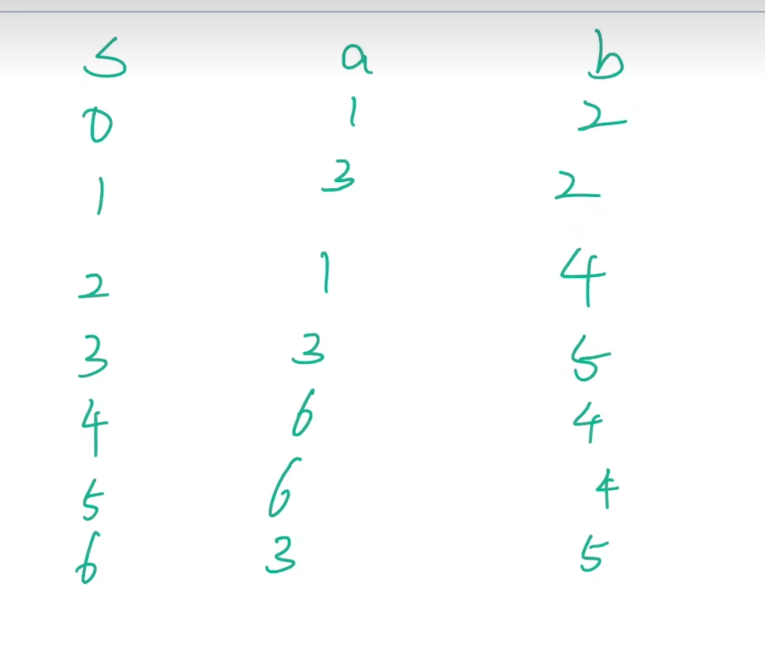
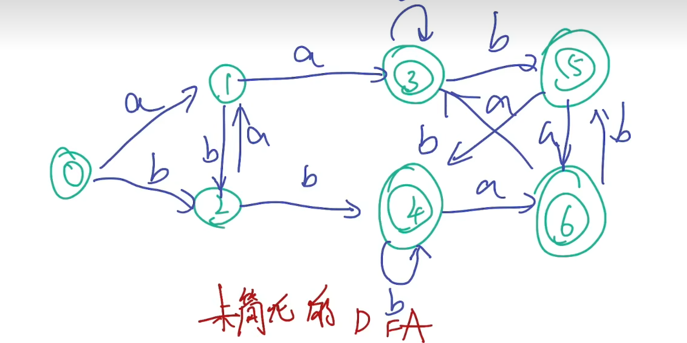

# 记忆并理解

## 1.编译程序五阶段的划分与作用

编译程序通常被划分为五个主要阶段，每个阶段负责将源代码逐步转换为目标代码。以下是各阶段的详细划分及其作用：

------

### 1. **词法分析（Lexical Analysis）**

- **作用**：将源代码字符流分解为有意义的词法单元（Token）。

- 

  关键任务：

  - 识别**标识符、关键字、运算符、常量**等。
  - 过滤**空白符**、**注释**等无关内容。
  - 生成符号表（Symbol Table）的初始条目。

- **输出**：Token 序列（如 `[type: ID, value: "x"]`）。

- **工具示例**：Lex、Flex。

**示例**：
 代码 `int x = 42;` 会被分解为：
 `[type: KEYWORD, value: "int"]`、`[type: ID, value: "x"]`、`[type: OPERATOR, value: "="]`、`[type: CONST, value: 42]`。

------

### 2. **语法分析（Syntax Analysis）**

- **作用**：根据语法规则验证 Token 序列的结构，生成抽象语法树（AST）。

- 

  关键任务：

  - 检查语法错误（如缺少分号、括号不匹配）。
  - 构建层次化的语法结构（如表达式、语句、函数）。

- **输出**：抽象语法树（AST）。

- **工具示例**：Yacc、Bison。

**示例**：
 `x = 42 + y` 的 AST 可能表示为：

```
    (=)
   /   \
  x    (+)
      /   \
    42     y
```

------

### 3. **语义分析（Semantic Analysis）**

- **作用**：分析程序的语义正确性，补充类型和上下文信息。

- 

  关键任务：

  - 类型检查（如变量类型匹配、运算符合法性）。
  - 作用域分析（变量是否声明、是否重复定义）。
  - 符号表填充（记录变量类型、作用域等属性）。

- **输出**：带标注的 AST（附加类型和作用域信息）。

**示例**：
 若 `y` 未声明，报错：`Error: Undefined variable 'y'`。

------

### 4. **中间代码生成（Intermediate Code Generation）**

- **作用**：生成与机器无关的中间表示（IR），便于优化和跨平台。
- 关键任务：
  - 将 **AST** 转换为**三地址码、四元式或虚拟机指令**（如 LLVM IR）。
  - 简化后续优化和翻译过程。
- **输出**：中间代码（如三地址码）。

**示例**：
 `x = 42 + y` 的三地址码：

```
t1 = 42 + y  
x = t1
```

------

### 5. **代码优化与目标代码生成**

#### **代码优化（可选）**

- **作用**：提高目标代码的效率（速度/空间）。
- 优化类型：
  - **局部优化**：常量折叠、死代码删除。
  - **全局优化**：循环优化、内联展开。

**示例**：
 `x = 2 * 3` → 优化为 `x = 6`（常量折叠）。

#### **目标代码生成**

- **作用**：将中间代码转换为目标机器代码（汇编或二进制）。

- 

  关键任务

  ：

  - 寄存器分配（如使用图着色算法）。
  - 指令选择（匹配机器指令集）。
  - 处理平台相关细节（调用约定、内存对齐）。

- **输出**：目标代码（如 x86 汇编或 JVM 字节码）。

**示例**：
 三地址码 `x = t1` 可能生成：

```
mov eax, [t1]  
mov [x], eax
```

------

### 总结

| 阶段          | 输入         | 输出              | 核心任务                   |
| ------------- | ------------ | ----------------- | -------------------------- |
| 词法分析      | 源代码字符流 | Token 序列        | 分词、去冗余               |
| 语法分析      | Token 序列   | 抽象语法树（AST） | 检查语法结构               |
| 语义分析      | AST          | 带标注的 AST      | 类型检查、作用域分析       |
| 中间代码生成  | AST          | 中间代码（IR）    | 生成机器无关表示           |
| 代码优化/生成 | IR           | 目标代码          | 优化、寄存器分配、指令选择 |

------

### 补充说明

- 前端 vs 后端：
  - **前端**（**词法分析→语义分析**）**与语言相关，处理源代码结构。**
  - **后端**（优化→目标代码生成）与机器相关，处理代码执行效率。
- **错误处理**：每个阶段都可能检测到错误（如词法错误、类型不匹配），需及时报告并恢复。
- **现代编译器**：如 GCC、Clang 采用多阶段设计，支持插件化优化和跨平台。

通过这五个阶段，编译器实现了从高级语言到可执行代码的可靠转换。

## 2.各个编译阶段的输入与输出

| 阶段          | 输入         | 输出              | 核心任务                   |
| ------------- | ------------ | ----------------- | -------------------------- |
| 词法分析      | 源代码字符流 | Token 序列        | 分词、去冗余               |
| 语法分析      | Token 序列   | 抽象语法树（AST） | 检查语法结构               |
| 语义分析      | AST          | 带标注的 AST      | 类型检查、作用域分析       |
| 中间代码生成  | AST          | 中间代码（IR）    | 生成机器无关表示           |
| 代码优化/生成 | IR           | 目标代码          | 优化、寄存器分配、指令选择 |

# 计算方法

## l 乔姆斯基文法的分类；

好的！让我们用「做菜」和「学校规则」的生活场景来类比乔姆斯基文法的分类和编译原理中的专业名词，保证通俗易懂！

------

### **1. 乔姆斯基文法的分类**

乔姆斯基将文法分为4类（0~3型），规则约束从宽松到严格：

#### **(0) 无限制文法（Unrestricted Grammar）**

- **专业名词**：短语结构文法（Phrase Structure Grammar）

- 

  通俗解释

  ：像「随意写菜谱」

  - 规则：做菜时没有任何限制，比如“把任意食材变成任意其他食材”（比如“鸡蛋→土豆”）。
  - 场景：像天马行空的黑暗料理，没有逻辑约束，可能做出无法入口的菜。

#### **(1) 上下文有关文法（Context-Sensitive Grammar, CSG）**

- **专业名词**：上下文有关规则（如 `αAβ → αγβ`）

- 

  通俗解释

  ：像「根据场景调整菜谱」

  - 规则：处理食材时，必须看周围环境。比如“只有锅里已经有洋葱时，才能把牛肉切块”（类似 `洋葱 牛肉 洋葱 → 洋葱 牛肉块 洋葱`）。
  - 场景：像严格的烹饪节目，步骤不能乱来，必须符合当前状态。

#### **(2) 上下文无关文法（Context-Free Grammar, CFG）**

- **专业名词**：产生式规则（如 `A → γ`）

- 

  通俗解释

  ：像「固定步骤的速食菜谱」

  - 规则：无论什么情况，遇到食材就按固定步骤处理。比如“见到鸡蛋→打散鸡蛋”（`鸡蛋 → 打散的鸡蛋`），不需要看其他食材。
  - 场景：像泡面说明书，无论饿不饿，操作都一样。编程语言的语法大多属于这类。

#### **(3) 正则文法（Regular Grammar, RG）**

- **专业名词**：有限自动机（Finite Automaton）

- 

  通俗解释

  ：像「流水线加工食材」

  - 规则：只能一步步线性处理，比如“胡萝卜→切丝→炒熟”（`胡萝卜 → 胡萝卜丝 → 熟胡萝卜丝`），不能跳步或嵌套。
  - 场景：像快餐店的流水线，严格按顺序操作，不能中途做其他事。

------

### **2. 编译原理名词的生活映射**

| **专业名词**   | **生活场景比喻**          | 作用                     |
| -------------- | ------------------------- | ------------------------ |
| **终结符**     | 成品菜（如“炒鸡蛋”）      | 最终结果，不可再分解。   |
| **非终结符**   | 半成品（如“打散的鸡蛋”）  | 需要进一步加工。         |
| **产生式规则** | 菜谱步骤（如“鸡蛋→打散”） | 定义如何转换食材。       |
| **推导**       | 按菜谱一步步做菜          | 从原料到成品的转换过程。 |
| **语法分析**   | 检查菜谱步骤是否合法      | 确保程序语法正确。       |

------

### **3. 总结：用学校规则类比**

- **0型**：校长说“随便你们怎么制定班规”（完全自由）。
- **1型**：班主任说“如果教室有老师，学生可以自习”（依赖上下文）。
- **2型**：班长说“所有学生必须交作业”（无视场景，统一规则）。
- **3型**：值日生说“按学号顺序交作业”（严格线性顺序）。

这样是不是更清晰了呢？ 😊

## l 根据文法定义进行推导与规约；

好的！我们结合**抽象语言**（如编程语言、数学表达式）和**生活场景**，用严格的文法术语和通俗类比，重新梳理**推导（Derivation）**与**规约（Reduction）**的核心逻辑。

------

### **1. 抽象语言中的推导与规约**

#### **(1) 推导（Derivation）——生成语言的过程**

- **专业定义**：从文法的开始符号 S 出发，通过**产生式规则**（如 A→α）逐步替换非终结符，最终得到终结符串（句子）。

- 

  抽象语言示例

  （算术表达式文法）：

  ```
  G: 
    E → E + E | E * E | (E) | id  
  推导 "id + id * id" 的步骤：
    E ⇒ E + E          （规则：E → E + E）
      ⇒ id + E         （规则：E → id）
      ⇒ id + E * E     （规则：E → E * E）
      ⇒ id + id * E    （规则：E → id）
      ⇒ id + id * id   （规则：E → id）
  ```

- 

  关键点

  ：

  - 每次替换**一个非终结符**（如第一个 E 被替换为 E+E）。
  - 结果是一个**合法的句子**（属于文法描述的语言）。

#### **(2) 规约（Reduction）——解析语言的过程**

- **专业定义**：从终结符串出发，反向应用产生式规则，将子串替换为非终结符，最终回归到开始符号 S。

- 

  同一文法下的规约

  （对 "id + id * id"）：

  ```
  id + id * id  
    ⇐ id + E * id      （规约：id → E）
    ⇐ id + E * E       （规约：id → E）
    ⇐ id + E           （规约：E * E → E）
    ⇐ E + E            （规约：id → E）
    ⇐ E                （规约：E + E → E）
  ```

- 

  关键点

  ：

  - 每次规约**一个产生式的右部**（如 id 规约为 E）。
  - 用于验证句子是否属于语言，并构建**语法分析树**。

------

### **2. 生活场景的抽象映射**

#### **(1) 推导：编写数学公式**

- 

  场景

  ：老师要求学生按规则生成合法公式。

  - **开始符号**：Expression

  - 

    规则

    ：

    ```
    Expression → Number | Expression + Expression  
    Number → 1 | 2 | 3
    ```

  - 

    推导过程

    ：

    ```
    Expression ⇒ Expression + Expression  
               ⇒ 2 + Expression  
               ⇒ 2 + 3
    ```

  - **结果**：合法公式 "2 + 3"。

#### **(2) 规约：批改数学作业**

- 

  场景

  ：老师检查学生写的公式是否合法。

  - **输入**：公式 "2 + 3"

  - 

    规约过程

    ：

    ```
    2 + 3  
      ⇐ Number + 3       （规约：2 → Number）  
      ⇐ Number + Number  （规约：3 → Number）  
      ⇐ Expression       （规约：Number + Number → Expression）
    ```

  - **结论**：公式合法（可规约到开始符号）。

------

### **3. 编译原理中的核心关联**

| **概念**       | **抽象语言中的角色**             | **生活类比**                   | 编译阶段               |
| -------------- | -------------------------------- | ------------------------------ | ---------------------- |
| **产生式规则** | 语言的生成/解析规则              | 数学公式的书写规则             | 语法分析的基础         |
| **推导**       | 生成合法句子（编译器设计阶段）   | 按规则写出公式                 | 自顶向下分析（LL文法） |
| **规约**       | 验证句子合法性（编译器运行阶段） | 检查公式是否符合规则           | 自底向上分析（LR文法） |
| **非终结符**   | 中间抽象符号（如 E）             | 未完成的公式部分（如 "□ + 3"） | 语法树的中间节点       |
| **终结符**     | 语言的最小单位（如 id）          | 公式中的数字/运算符            | 词法分析后的单词       |

------

### **4. 为什么需要抽象语言视角？**

1. 

   精确性

   ：形式化文法（如CFG）是编程语言语法的基础，推导与规约对应语法分析的核心操作。

   - 例：编译器解析 `a = b + c;` 时，需规约为 `赋值语句 → 标识符 = 表达式`。

2. **通用性**：所有上下文无关语言（如JSON、SQL）均可用此框架分析。

3. **自动化**：推导与规约的步骤可转化为算法（如递归下降、移进-归约）。

------

### **5. 更复杂的例子：嵌套结构的推导与规约**

**文法**（简化版if语句）：

```
S → if (E) S | other  
E → id | num
```

**句子**：`if (x) if (y) other`

- 

  推导

  ：

  ```
  S ⇒ if (E) S  
     ⇒ if (x) S                （E → x）  
     ⇒ if (x) if (E) S         （S → if (E) S）  
     ⇒ if (x) if (y) other     （E → y, S → other）
  ```

- 

  规约

  ：

  ```
  if (x) if (y) other  
    ⇐ if (x) if (y) S          （other → S）  
    ⇐ if (x) S                 （if (y) S → S）  
    ⇐ S                        （if (x) S → S）
  ```

**生活类比**：

- 推导：像写嵌套的“如果...那么...”规则。
- 规约：像解套娃，从最内层的 `other` 逐步确认整体是一个合法语句。

------

### **总结**

- **推导**是“生成”，规约是“解析”，二者互为逆过程。
- 在抽象语言中，它们形式化地定义了**语言的合法性**和**语法结构**。
- 编译器中，推导对应语法设计，规约对应语法分析，是代码→语法树的关键步骤。

如果需要用具体编程语言（如Python或C）的语法举例，可以进一步展开！

## l 正则表达式

### n 正则表达式到NFA的转换

- +表示一个或者多个。对于（a|b）+ 可以转化为(a|b)(a|b)*
- 看到*，将星号修饰的内容自环于某一个状态点，并且该状态点和其他状态点之间用厄普西隆连接
- 对于ab 则串联状态节点
- 对于a|b 则并联状态节点-若此时的a|b是某个*的自环节点，则画两条自环的箭头





### n 使用子集构造法将NFA转DFA

- I的第一个集合，是从X开始的
- Ia和Ib指的是，I中的元素施加a/b可以走到的位置
- 你会发现，只有第一个集合有X 是因为X只能走伊普西龙，无法和a和b发生任何作用
- 遇到伊普西龙就可以往右边走，无条件的走，并且将走到的结果添加到当前集合。
- 施加a或者b的只能是I中的集合，你别拿到从1 2 4 出发拿到3了，就觉得可以从3到5，不可以的，你只能对I中的集合施加A或者B。这里的5是你通过I集合施加a或者b得到的结果（不能贪杯）
- 这里编号的意思是：对不一样的集合做一个序号，然后等会咱们拿序号来构建DFA











- 先做划分：上面有Y的就是终态集合。其他是是非终态集合

### n DFA最小化

## l LL分析法

### n First集和Follow集的计算

### n LL(1)分析表的计算

### n LL(1)文法的判别

### n 消除左递归，提取公共左子因子

## l LR分析法

### n LR(0)自动机的计算

### n LR、SLR、LALR文法的判别与证明

# **中间代码表示与优化技术**

## **1. 中间代码表示**

中间代码（Intermediate Code）是编译器在**语法分析**和**目标代码生成**之间的桥梁，主要包括：

- **中缀表达式**（Infix Notation）
- **后缀表达式**（Postfix Notation / Reverse Polish Notation, RPN）
- **三元式**（Triples）
- **四元式**（Quadruples）
- **三地址码**（Three-Address Code, TAC）

### **(1) 中缀表达式 → 后缀表达式**

**中缀表达式**（人类易读）：

```
a + b * c
```

**转换为后缀表达式**（运算符在操作数后）：

```
a b c * +
```

**转换方法**（使用栈）：

1. 遇到操作数直接输出。
2. 遇到运算符：
   - 若栈空或栈顶是 `(`，直接入栈。
   - 否则，弹出优先级 ≥ 当前运算符的栈顶元素，再入栈。
3. 遇到 `(` 入栈，遇到 `)` 弹出栈顶直到 `(`。
4. 遍历结束后，弹出栈中剩余运算符。

**示例**：

```
中缀：a + b * c
步骤：
1. a → 输出 a
2. + → 栈 [+]
3. b → 输出 b
4. * → 栈 [+, *]（* 优先级 > +）
5. c → 输出 c
6. 弹出 * → 输出 *
7. 弹出 + → 输出 +
结果：a b c * +
```

------

### **(2) 后缀表达式 → 三元式 / 四元式**

**后缀表达式**：

```
a b c * +
```

**转换为三元式**（`(op, arg1, arg2)`）：

```
(1) (*, b, c)  // t1 = b * c
(2) (+, a, (1)) // x = a + t1
```

**转换为四元式**（`(op, arg1, arg2, result)`）：

```
(1) (*, b, c, t1)  // t1 = b * c
(2) (+, a, t1, x)  // x = a + t1
```

------

### **(3) 三元式 ↔ 四元式**

- **三元式** 隐式引用临时变量（通过编号）。
- **四元式** 显式使用临时变量（如 `t1`, `t2`）。

**三元式**：

```
(1) (*, b, c)  // t1 = b * c
(2) (+, a, (1)) // x = a + t1
```

**转换为四元式**：

```
(1) (*, b, c, t1)
(2) (+, a, t1, x)
```

**四元式 → 三元式**：

```
(1) (*, b, c, t1)
(2) (+, a, t1, x)
```

转换为三元式：

```
(1) (*, b, c)
(2) (+, a, (1))
```

------

## **2. 优化技术**

### **(1) 消除公共子表达式（Common Subexpression Elimination, CSE）**

**目标**：避免重复计算相同的表达式。

**示例**：

```
x = a + b * c;
y = a + b * c;  // b * c 重复计算
```

**优化后**：

```
t1 = b * c;
x = a + t1;
y = a + t1;  // 复用 t1
```

------

### **(2) 复写传播（Copy Propagation）**

**目标**：用变量的赋值直接替换其引用，减少临时变量。

**示例**：

```
t1 = a + b;
x = t1;      // 可以替换为 x = a + b
y = x * 2;   // 替换为 y = (a + b) * 2
```

**优化后**：

```
x = a + b;
y = x * 2;  // 或直接 y = (a + b) * 2
```

------

### **(3) 消除无用代码（Dead Code Elimination）**

**目标**：删除不影响程序结果的代码。

**示例**：

```
x = a + b;  // 后续未使用 x
y = c * d;
return y;
```

**优化后**：

```
y = c * d;
return y;  // 删除了 x = a + b
```

------

### **(4) 常量传播（Constant Propagation）**

**目标**：提前计算常量表达式。

**示例**：

```
x = 5;
y = x + 3;  // 可替换为 y = 8
```

**优化后**：

```
x = 5;
y = 8;  // 直接计算
```

------

## **3. 综合示例**

### **原始代码（C语言）**

```
int x = a + b * c;
int y = a + b * c;
if (x > 10) {
    x = x - 5;
}
```

### **(1) 转换为三地址码**

```
t1 = b * c
x = a + t1
y = a + t1    // 公共子表达式
if x <= 10 goto L1
x = x - 5
L1:
```

### **(2) 优化（消除公共子表达式 + 复写传播）**

```
t1 = b * c
x = a + t1
y = x         // 复写传播
if x <= 10 goto L1
x = x - 5
L1:
```

### **(3) 进一步优化（无用代码消除）**

如果 `y` 后续未使用：

```
t1 = b * c
x = a + t1
if x <= 10 goto L1
x = x - 5
L1:
```

------

## **4. 总结**

| **技术**             | **作用**             | **示例**                                              |
| -------------------- | -------------------- | ----------------------------------------------------- |
| **中缀 → 后缀**      | 方便计算和转换       | `a + b * c` → `a b c * +`                             |
| **后缀 → 四元式**    | 结构化中间代码       | `a b c * +` → `(*, b, c, t1); (+, a, t1, x)`          |
| **消除公共子表达式** | 避免重复计算         | `x = a + b; y = a + b` → `t1 = a + b; x = t1; y = t1` |
| **复写传播**         | 减少临时变量         | `t1 = a + b; x = t1` → `x = a + b`                    |
| **无用代码消除**     | 删除不影响结果的代码 | `x = 10; y = 20; return y` → `y = 20; return y`       |
| **常量传播**         | 提前计算常量         | `x = 5; y = x + 3` → `x = 5; y = 8`                   |

这些优化技术广泛应用于现代编译器（如 GCC、LLVM），能显著提升生成代码的效率。

 


## **1. 符号表实现方式的选择与比较**

| **实现方式**            | **优点**                       | **缺点**                       | **适用场景**                     |
| ----------------------- | ------------------------------ | ------------------------------ | -------------------------------- |
| **线性表（数组/链表）** | 实现简单，适合小规模符号表     | 查找效率低（O(n)）             | 教学示例、小型编译器             |
| **哈希表**              | 平均O(1)查找效率，适合动态插入 | 哈希冲突可能影响性能           | 大多数通用编译器（如GCC、Clang） |
| **二叉搜索树**          | 有序存储，支持范围查询         | 最坏情况退化为O(n)（需平衡树） | 需要有序访问符号的场景           |
| **红黑树/AVL树**        | 平衡树保证O(log n)操作         | 实现复杂                       | 对性能要求高的工业级编译器       |

**选择建议**：

- 小型编译器：线性表或简单哈希表。
- 工业级编译器：哈希表（如GCC）或红黑树（如Java编译器）。

------

## **2. 词法分析技术的选择与比较**

| **技术**               | **优点**             | **缺点**           | **适用场景**                   |
| ---------------------- | -------------------- | ------------------ | ------------------------------ |
| **手工编码（状态机）** | 高效，无额外工具依赖 | 开发维护复杂       | 对性能要求极高的场景（如LLVM） |
| **正则表达式+自动机**  | 开发速度快（如Flex） | 生成代码可能臃肿   | 大多数编译器（如GCC早期版本）  |
| **表驱动词法分析器**   | 灵活，易维护         | 运行时需查表，稍慢 | 教学或实验性编译器             |

**选择建议**：

- 快速开发：使用Lex/Flex等工具。
- 极致性能：手工实现DFA。

------

## **3. 语法分析技术的选择与比较**

| **技术**           | **优点**                     | **缺点**                   | **适用场景**                |
| ------------------ | ---------------------------- | -------------------------- | --------------------------- |
| **递归下降分析法** | 直观，易实现错误恢复         | 需手动处理左递归和优先级   | 小型编译器（如早期C编译器） |
| **LL(1)分析器**    | 简单，适合确定性文法         | 文法限制严格（需无左递归） | 教学或简单语言（如Pascal）  |
| **LR(1)/LALR(1)**  | 支持复杂文法（如Yacc/Bison） | 生成的分析表较大           | 工业级编译器（如Java、C#）  |
| **GLR分析器**      | 支持歧义文法                 | 内存消耗高                 | 复杂语言（如C++模板解析）   |

**选择建议**：

- 简单语言：递归下降或LL(1)。
- 复杂语言：LR(1)/LALR(1)（如Bison）。
- 歧义文法：GLR（如GCC的C++前端）。

------

## **4. 中间语言的选择与比较**

| **中间语言**          | **优点**                   | **缺点**         | **适用场景**                    |
| --------------------- | -------------------------- | ---------------- | ------------------------------- |
| **三地址码**          | 接近机器码，易优化         | 冗余较多         | 传统优化编译器（如GCC的GIMPLE） |
| **SSA（静态单赋值）** | 简化数据流分析             | 转换复杂度高     | 现代优化编译器（如LLVM IR）     |
| **字节码**            | 跨平台，易解释执行         | 性能低于原生代码 | 虚拟机语言（如JVM、Python）     |
| **AST（抽象语法树）** | 保留源码结构，适合语义分析 | 不易直接优化     | 解释器或语法糖多的语言          |

**选择建议**：

- 高性能编译：SSA（如LLVM）。
- 跨平台：字节码（如Java）。
- 快速开发：AST（如TypeScript编译器）。

------

## **5. 内存管理技术的选择与比较**

| **技术**      | **优点**       | **缺点**                  | **适用场景**               |
| ------------- | -------------- | ------------------------- | -------------------------- |
| **手动管理**  | 无运行时开销   | 易内存泄漏/悬垂指针       | 系统编程（如C/C++）        |
| **引用计数**  | 简单，实时回收 | 循环引用问题              | 脚本语言（如Python早期）   |
| **标记-清除** | 处理循环引用   | STW（Stop-The-World）暂停 | 通用垃圾回收（如Java CMS） |
| **分代收集**  | 针对年轻代优化 | 实现复杂                  | 高性能语言（如Java G1）    |

**选择建议**：

- 无GC需求：手动管理。
- 高吞吐量：分代GC（如Java）。
- 实时性要求：增量式GC（如Go）。

------

## **6. 编译功能变化时的修改部分**

当编译器需要新增功能或修改语义时，需调整的具体部分：

| **功能变化类型**      | **需修改的编译器阶段**         | **示例**                        |
| --------------------- | ------------------------------ | ------------------------------- |
| **新增关键字/运算符** | 词法分析器、语法分析器、符号表 | 添加`final`关键字到Java编译器   |
| **修改类型系统**      | 语义分析器、中间代码生成       | 支持泛型（如C++模板到Java泛型） |
| **优化策略变更**      | 中间代码优化器                 | 新增循环展开或内联优化          |
| **目标平台变更**      | 代码生成器、运行时系统         | 从x86移植到ARM                  |
| **新增语法糖**        | 语法分析器、AST转换层          | 添加Python的`@decorator`语法    |

**关键原则**：

- **词法/语法分析层**：处理语言表面结构变化。
- **语义分析层**：处理类型系统或作用域规则变化。
- **后端优化/代码生成**：处理性能或平台相关修改。

------

## **总结**

- **符号表**：哈希表或平衡树是工业级选择。
- **词法分析**：手工DFA（性能）或Lex/Flex（开发效率）。
- **语法分析**：LR(1)/LALR(1)适合复杂文法，递归下降适合简单语言。
- **中间语言**：SSA（LLVM）用于优化，字节码用于跨平台。
- **内存管理**：分代GC平衡吞吐量与延迟。
- **功能修改**：根据变化类型定位到具体阶段，避免牵一发而动全身。

通过合理选择技术和模块化设计，可以高效维护和扩展编译器功能。

