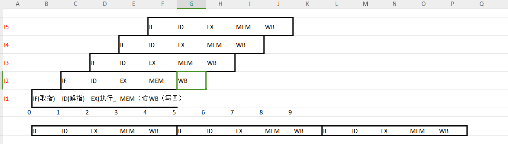
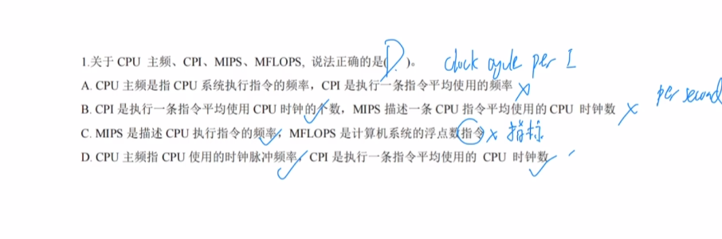
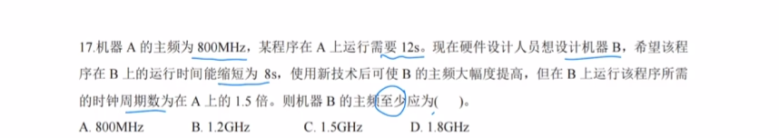
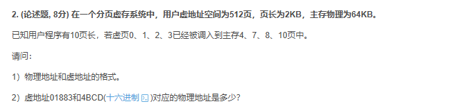

## 1.流水线：加速比/吞吐率/流水线效率

$$
加速比=\frac{顺序执行消耗的时间}{使用指令流水线消耗的时间}\\
实际吞吐率=\frac{总任务条数}{使用指令流水线消耗的时间}\\
流水线效率=\frac{加速比}{流水线的级数}\\
t含义：多级操作中耗时最长的操作的时间 eg:本题中耗时最长的操作时间为100ns 所以本题的t是100ns\\

加速比=\frac{(100+100+80+50)ns*100}{(330)ns+t(100-1)}=3.2\\
实际吞吐率=\frac{100}{(330)ns+t(100-1)}=10^-7 件/s\\
流水线效率=\frac{3.2}{4}=0.8
$$

## 2.CPI计算

首先明确时钟周期T是最小的时间单位

1. 主频f：也叫CPU时钟频率，指的是1s内时钟周期的的个数。**只影响指令的执行速度，主频越高，执行速度越快。**
2. **CPI（Clock cycle per Instuction）**：**和时钟频率无关**。是每条指令需要的时钟周期数，只和系统结构，指令集，计算机组成有关。
3. CPU执行时间=CPU时钟周期数量x时钟周期=(指令条数xCPI)*时钟周期=(指令条数xCPI)/主频 (后面两个推导过程就是t=1/f)
4. (用上面的推导)IPS：每秒执行的指令条数 IPS=主频/CPI :CPI和IPS的乘积就是主频
5. MFLOPS是计算机系统浮点数**指标**：你切记这不是指令

> 本题答案是D
>
> 本题的桥梁是：时钟周期的数量。
>
> 看到一个12s的程序运行时间，下意识一定是有n个时钟周期x单个周期的时间。也就是n个时钟周期/单个周期的频率。

$$
f(A)=800MHz\\
T(A)=12s\\
f(B)=x\\
T(B)=8s\\
特殊条件：CntB=1.5CntA\\
T(a)=\frac{时钟周期数}{f} => 时钟周期数(a)=9600M\\
时钟周期数(b)=1.5x9600M=14400M\\
f(b)=14400M/8=1.8GHz
$$

## 3.波特率计算

8x=1200

x=150

则150x11=1650

**3.16 在异步传输系统中,字符格式为：1个起始位、8个数据位、1个校验位、2个终止位.若要求传输120个字符,求传送的波特率和比特率？**

**标准答案：**

1）由题意，一个字符有 1+8+1+2=12位，
则每秒传送120个字符时，波特率为 12 × 120 = 1440bps ， 比特率为 8 × 120 = 960bps

**笔记：**

1）一个字节Byet = 8bit，所以1Bps = 8bps，1MBps = 8Mbps，所以3.15结果可以化简为16MBps

2）总线带宽的两种计算方法
第一种：**带宽 = 时钟频率 × 数据位数**
第二种：**带宽 = 数据位数 / 总线传输周期**，总线传输周期 = n×时钟周期，时钟周期 = 1 / 时钟频率
其中n是题目中规定的总线传输周期对应的时钟周期的个数，这种方法也适用于计算数据传输率

3）提高传输率的方法
根据数据传输率的计算公式（带宽计算的第二种方法），显而易见，可以通过**提高总线时钟频率**、**增大总线的宽度**或减少**总线传输周期的时钟个数**这三种方法。
4）波特率和比特率
**波特率为单位时间内传输的二进制数据的位数**
**比特率为单位时间内传输的二进制有效数据的位数**

## 4.虚页存储器相关计算

- 虚地址页长：2KB=>2的11次方。则虚拟地址有11个二进制位
- 主存有64KB，且我的页长是2KB。则主存有32个页，32是2的5次方。则描述这32个不同的页，需要5个二进制位。通过虚地址可以知道，页内地址有11位。则物理地址共有16位地址码。主存的格式是：【5位页面地址】【11位页内地址】
- 而虚拟页空间有512个页，是2的9次方，则需要9个二进制位来描述。则虚存的格式是【9位页面地址】【11位页内地址】

- 虚地址01883H=0000 0001 1000 1000 0011B，页面号为3，查表得已被调入到主存页10，
  - 所以，物理地址中的页面号为10，页内地址与虚地址的页内地址相同，
  - 所以物理地址是：101 0000 1000 0011B=5083H
- 虚地址4BCDEH=0100 1011 1100 1101 B，
  - 页面号为9，查表，发现该页未被调入到主存中。
  - 所以无物理地址，会发生缺页中断。