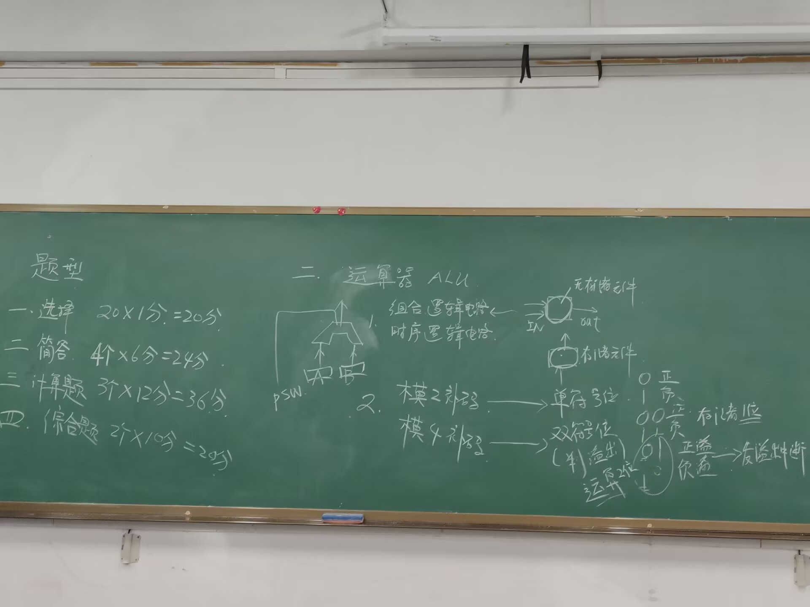
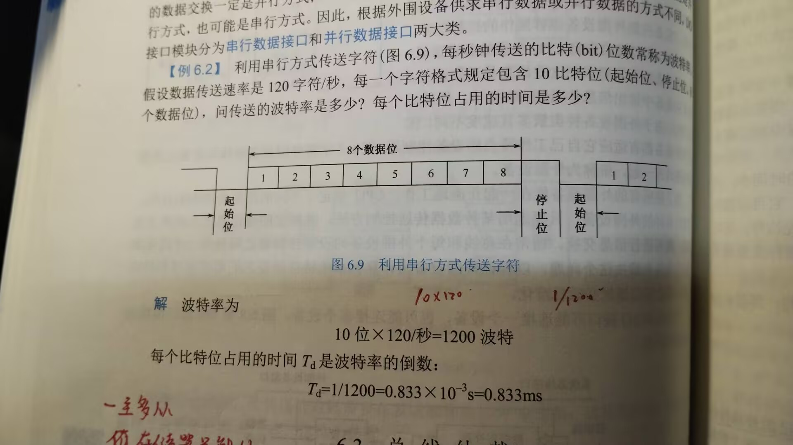
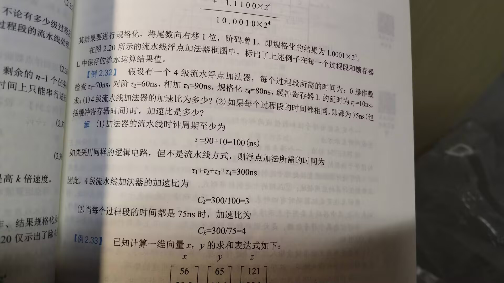
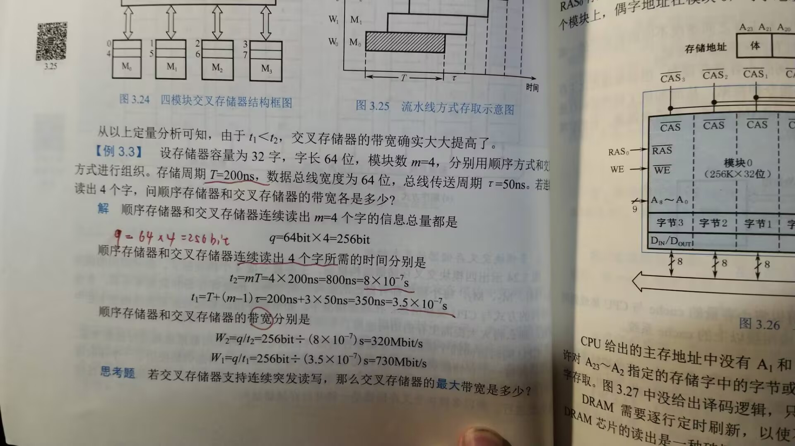

# A.主体部分

## 1.冯诺依曼型计算机体系的基本思想(五大部件，功能)

> 冯诺依曼型计算机体系的基本思想是由数学家约翰·冯·诺依曼提出的，核心思想是将**程序与数据存储在同一个内存空间中**，通过**中央处理单元（CPU）**来控制程序的执行，并通过**输入输出设备**与外部环境进行交互。
>
> 冯诺依曼计算机体系的五大部件及其功能如下：
>
> ### 1. **运算器（ALU, Arithmetic Logic Unit）**：组合逻辑
>
> - **功能**：负责执行算术运算（如加法、减法、乘法、除法等）和逻辑运算（如与、或、非、异或等）。它是计算机中进行计算的核心部分。
> - **作用**：处理数据并执行计算任务，是计算机执行程序的基础。
>
> ### 2. **控制器（CU, Control Unit）**：时序
>
> - **功能**：负责从内存中取出指令并解码，控制计算机各部件的工作顺序。控制器通过发出信号，协调和指挥各部件按照程序要求进行操作。
> - **作用**：调度计算机各部件的工作，确保指令按顺序执行，且没有冲突。
>
> ### 3. **内存（Memory）**
>
> - **功能**：存储程序指令和数据。内存分为两类：主存和辅存。主存（如RAM）用于临时存储程序和数据，辅存（如硬盘）用于长期存储数据。
> - **作用**：内存提供了程序运行所需的存储空间，存储指令和数据，使CPU能够随时访问。
>
> ### 4. **输入设备（Input Devices）**
>
> - **功能**：用于向计算机输入数据。常见的输入设备有键盘、鼠标、扫描仪等。
> - **作用**：使计算机能够接收外部信息，用于执行程序或与外部世界进行交互。
>
> ### 5. **输出设备（Output Devices）**
>
> - **功能**：用于将计算机处理后的结果输出到外部世界。常见的输出设备有显示器、打印机、扬声器等。
> - **作用**：向用户显示或输出处理结果，使计算机与外部环境进行信息交换。
>
> ### 冯诺依曼体系的工作原理：
>
> 冯诺依曼型计算机的工作过程遵循“存储程序”概念，即程序和数据都存储在计算机的内存中，CPU根据内存中的指令进行执行。其基本步骤包括：
>
> 1. **取指（Fetch）**：从**内存**中获取指令。
> 2. **解码（Decode）**：**控制器**对指令进行解码，分析指令的操作内容。
> 3. **执行（Execute）**：**运算器**根据解码后的指令进行相应的运算或逻辑操作。
> 4. **存储（Store）**：将计算结果**存回内存**或**输出设备。**
>
> ### 总结：
>
> 冯诺依曼型计算机的基本思想是将程序与数据存储在统一的内存中，并通过五大部件的协作，完成计算任务。五大部件分别是：运算器（ALU）、控制器（CU）、内存（Memory）、输入设备（Input Devices）、输出设备（Output Devices）。

## 2.如何判断浮点数是规格化数(分原码补码讨论)，如何进行规格化。

> 浮点数的规格化是指将浮点数表示成一种标准化的形式，使得在浮点数的有效数字部分不出现前导零。这是为了提高计算的精度和效率。浮点数通常使用IEEE 754标准进行表示，其基本结构包括符号位、指数部分和尾数部分（有效数字）。
>
> 在讨论浮点数是否是规格化数时，需要分别从 **原码** 和 **补码** 的角度来分析。我们主要关注的是 **浮点数的表示方式**，即在原码和补码下如何进行规格化。
>
> ### 1. 浮点数的规格化定义
>
> **规格化数** 是指浮点数的尾数部分必须以一个非零的数字（通常是1）开始（在二进制表示中，尾数部分的最高位必须为1）。在IEEE 754标准下，规格化浮点数的尾数部分通常被隐含为1，因此只有指数部分需要存储。
>
> 浮点数的标准格式为：
> $$(-1)^{sign} \times 1.f \times 2^{(e - bias)}$$
>
> 
>
> - \( sign \) 是符号位
> - \( 1.f \) 是尾数部分（以1为最高位）
> - \( e \) 是指数部分
> - \( bias \) 是偏移量（在32位单精度下，偏移量是127；在64位双精度下，偏移量是1023）
>
> ### 2. 判断浮点数是否为规格化数
>
> **原码表示** 和 **补码表示** 在浮点数判断规格化时的区别不大，关键是查看浮点数表示中尾数和指数部分的特性。具体步骤如下：
>
> #### 2.1 原码表示的浮点数判断
>
> 对于浮点数的 **原码表示**（以IEEE 754标准为例），判断一个浮点数是否为规格化数的步骤如下：
>
> - **符号位**：符号位不会影响浮点数是否规格化。
> - **指数部分**：浮点数的指数部分必须是非全0（即不是全0或全1）。如果指数部分为全0，则是非规格化数。
>   - **例如，对于IEEE 754单精度浮点数，指数部分是8位，如果指数部分为0，则是非规格化数。**
> - **尾数部分**：**尾数部分的最高有效位（即小数点右边的第一位）必须是1**。如果尾数部分的最高位为0，则表示是非规格化数。
>
> #### 2.2 补码表示的浮点数判断
>
> 在 **补码表示** 中，浮点数的表示方法和原码表示相同，但是浮点数的尾数部分可能涉及到补码的表示。判断时，步骤依然是类似的：
>
> - **指数部分**：如果指数部分为全0（即指数部分全部是0），则浮点数表示的是非规格化数。
> - **尾数部分**：尾数部分的最高位必须为1，表示浮点数是规格化的。
>
> ### 3. 浮点数如何进行规格化
>
> 当浮点数的原始形式不符合规格化要求时，我们需要将其 **规格化**。规格化过程的步骤如下：
>
> #### 3.1 非规格化数转规格化数的过程
>
> - **步骤1**：检查浮点数的指数部分。
>   - 如果指数为0或全1，且尾数不符合规格化要求（即不是1开头），则需要进行规格化。
>   
> - **步骤2**：调整尾数，确保尾数的最高位为1。
>   - 将尾数向右移动，使得小数点后第一个有效位变为1。对于浮点数来说，可以通过修改指数来实现尾数的移动。
>   
> - **步骤3**：重新调整指数部分。
>   - 在调整尾数后，需要相应地调整指数部分，以保持浮点数的值不变。
>
> #### 3.2 非规格化数（原码补码）转规格化数的具体操作
>
> 假设我们有一个浮点数，表示为 $$(-1)^{sign} \times 1.f \times 2^{(e - bias)}$$，如果指数部分为0（比如IEEE 754标准下，单精度浮点数指数部分为8位，指数为0），且尾数部分以0为开头，那么我们需要将浮点数进行规格化。可以按以下方式操作：
>
> 1. **尾数的左移**：将尾数的二进制小数点右边第一个非零位移到小数点前，即移动尾数中的有效位。
> 2. **调整指数**：将移动后的尾数调整为符合标准规范，并相应地修改指数部分，确保浮点数值不变。
>
> ### 4. 示例：如何规格化浮点数
>
> 假设我们有一个非规格化数：
>
> **原始表示** 
>
> $$0.0011 \times 2^{-4} $$
>
> - **步骤1**：首先，将尾数部分向右移动，直到其首位是1：
>   
>   $$0.0011 \times 2^{-4} = 1.1 \times 2^{-7}$$
> - **步骤2**：此时，尾数已经变为规格化形式 \( 1.1 \)，并且指数部分已经相应地调整为 \( -7 \)。
>
> ### 5. 总结
>
> - **判断规格化数**：浮点数的尾数部分应该以1为起始位，指数部分不能为全0（非规格化数）。
> - **进行规格化**：通过调整尾数和指数来确保尾数的首位为1，同时相应地修改指数值。
>
> 通过这些步骤，浮点数可以从非规格化数转换为规格化数，以满足浮点数的标准表示要求。

## 3.cache的行大小与命中率的关系，为了提高命中率，应用了什么原理(局部性原理)，请解释该原理

> ### 1. **Cache行大小与命中率的关系**
>
> **Cache的行大小**（也叫做 **块大小**）指的是每次从内存中加载到Cache中的数据量。在现代计算机体系结构中，Cache是高速存储，目的是为了加速数据访问并减少对较慢主存的依赖。Cache是以一定的行（或块）来存储数据的，每一行的大小通常是多个字节。
>
> #### 关系：
> - **Cache行越大，命中率可能越高**：由于现代程序往往访问的数据是连续的或者在局部区域内，因此，如果Cache行的大小增大，能够一次加载更多相邻的内存内容。当程序访问这些相邻的数据时，Cache可能命中更多，从而提高命中率。
> - **Cache行过大，可能会影响命中率**：虽然大行可能提高局部性命中，但如果行的大小过大，也可能带来一些负面影响。首先，较大的行意味着每次加载的数据量增加，可能导致Cache空间被占用过多，其他数据块的空间不足，从而降低了Cache的有效利用率。其次，对于一些访问模式不连续的程序，增大Cache行的大小可能导致数据不再局部化，降低命中率。
>
> ### 2. **提高命中率的原理：局部性原理**
>
> 为了提高Cache的命中率，计算机体系结构和程序设计通常依赖于 **局部性原理**。局部性原理可以分为 **时间局部性** 和 **空间局部性**，这两种局部性原理是提高Cache命中率的基础。
>
> #### 2.1 **时间局部性 (Temporal Locality)**
>
> 时间局部性是指程序中，如果某个数据在某一时刻被访问，那么它在接下来的不久时间内可能会再次被访问。例如，如果程序访问了某个变量或数据项，过一段时间后它可能会再次被访问。
>
> - **作用**：时间局部性意味着频繁访问的数据可能在短时间内多次被使用。因此，如果这些数据被保存在Cache中，能够提高命中率。
> - **例子**：访问数组中的某个元素时，若数组元素是按顺序访问的，那么当前访问的元素在下一次循环中可能会被再次访问，这时利用时间局部性，Cache中可以保留这些元素，从而提高命中率。
>
> #### 2.2 **空间局部性 (Spatial Locality)**
>
> 空间局部性是指程序中，如果某个数据项被访问，那么该数据项附近的数据项也很可能在不久的将来被访问。例如，程序访问了一个数组中的元素后，它很可能会接着访问该元素附近的其他元素。
>
> - **作用**：空间局部性意味着数据的访问倾向于集中在某个区域，因此如果Cache能够预加载这一区域的其他数据（即较大的Cache行），就能提高命中率。
> - **例子**：在访问数组时，程序可能会按顺序遍历整个数组，若Cache一次加载一个较大的块（包含数组的一部分），则随着程序的访问，后续访问很可能命中这些已经加载的数据。
>
> ### 3. **局部性原理如何影响Cache行大小和命中率**
>
> - **时间局部性与Cache行大小**：
>   - 当数据访问有时间局部性时，较小的Cache行也能获得较高的命中率，因为程序会频繁访问同一数据块。
>   
> - **空间局部性与Cache行大小**：
>   - 空间局部性倾向于顺序访问相邻的数据，因此较大的Cache行可以提高命中率，因为程序在访问某一数据项时，很可能同时访问到这一数据项的邻近部分。
>
> ### 4. **优化Cache行大小的策略**
>
> 为了在实际应用中实现较高的命中率，硬件设计通常会根据程序的访问模式优化Cache行大小。例如：
> - **较小的Cache行**：适用于数据访问的局部性较差的应用，或是访问模式较为随机的情况。
> - **较大的Cache行**：适用于数据访问有较强空间局部性的应用，或者当程序访问大块连续数据时，较大的Cache行能减少Cache缺失和填充的开销。
>
> ### 5. **总结**
>
> - **Cache行大小**对命中率有重要影响，合理的行大小能够提高Cache的有效性。
> - **局部性原理**（包括时间局部性和空间局部性）是提高Cache命中率的基础。通过理解程序的数据访问模式，硬件可以设计适当的Cache行大小来适应这些局部性，从而提高性能。
> - 在提高命中率时，程序设计和硬件优化应根据应用的访问模式（是否具有局部性）来决定最合适的Cache策略。

## 4.机器指令由哪几个部分构成，每个部分有什么含义：间接寻址，寄存器寻址，寄存器间接寻址。

> 机器指令是计算机系统执行程序的基本单元，通常由操作码（Opcode）和操作数（Operands）两部分构成。具体来说，机器指令可以分为以下几个部分：
>
> ### 1. **机器指令的组成部分**
>
> - **操作码（Opcode）**：表示指令的具体操作类型，例如加法、减法、数据移动等。操作码是指令的核心部分，告诉计算机该执行哪种操作。
> - **操作数（Operands）**：表示参与操作的数据源，可能是寄存器、内存地址或常数值等。操作数可以是一个或多个，具体依赖于指令的种类。
>
> 通常，指令格式的设计会将操作码和操作数分开，以便计算机能够在执行时正确解析指令。
>
> ### 2. **寻址方式**
>
> 寻址方式决定了指令中的操作数是如何指定的。常见的寻址方式有以下几种：
>
> #### 2.1 **间接寻址（Indirect Addressing）**
>
> 在间接寻址方式中，指令中指定的操作数是一个地址，该地址指向一个内存位置，存储着实际操作数的地址。可以理解为“指针寻址”，即间接通过一个地址来访问数据。
>
> **形式**：
> - 操作数是一个内存地址，该内存地址存储的是实际数据的地址。
>   
>
> **示例**：
> - 假设寄存器 `R1` 存储着一个内存地址 `1000`，而内存地址 `1000` 存储着数据 `42`。如果执行一个间接寻址的加载指令（例如 `LOAD (R1)`），计算机会首先从 `R1` 取出地址 `1000`，然后再去内存地址 `1000` 中取出数据 `42`，并加载到寄存器中。
>
> **图示**：
> ```
> 指令： LOAD (R1)
> R1 = 1000    --> 通过R1指向内存地址1000
> 内存[1000] = 42   --> 从内存中获取数据42
> ```
>
> #### 2.2 **寄存器寻址（Register Addressing）**
>
> 在寄存器寻址方式中，指令中的操作数直接指定的是寄存器，而不是内存地址。这种方式的优点是速度快，因为寄存器访问速度比内存要快得多。
>
> **形式**：
> - 操作数是寄存器的名称，计算机直接使用该寄存器中的数据。
>
> **示例**：
> - 假设有一个寄存器 `R1` 存储了数值 `10`，指令 `ADD R1, R2` 将寄存器 `R1` 和 `R2` 中的数据相加，并将结果存储回 `R2` 中。
>
> **图示**：
> ```
> 指令： ADD R1, R2
> R1 = 10
> R2 = 5
> 结果： R2 = R1 + R2 = 10 + 5 = 15
> ```
>
> #### 2.3 **寄存器间接寻址（Register Indirect Addressing）**
>
> 在寄存器间接寻址方式中，寄存器存储的是内存地址，而不是直接的数据。指令中的操作数表示寄存器，计算机会通过该寄存器的值作为内存地址，从该地址处取出数据。
>
> **形式**：
> - 寄存器中的值是一个内存地址，指令通过该地址访问数据。
>
> **示例**：
> - 假设寄存器 `R1` 存储了地址 `2000`，而内存地址 `2000` 存储了数据 `50`。执行指令 `LOAD (R1)` 后，CPU会访问 `R1` 中的地址 `2000`，然后从内存地址 `2000` 中加载数据 `50`。
>
> **图示**：
> ```
> 指令： LOAD (R1)
> R1 = 2000     --> R1 存储内存地址2000
> 内存[2000] = 50  --> 从内存地址2000获取数据50
> ```
>
> ### 3. **总结**
>
> - **间接寻址**：指令中的操作数是一个地址，该地址指向一个内存位置，存储着实际数据的地址。常用于动态数据的访问，通常通过一个中间步骤来访问数据。
> - **寄存器寻址**：指令中的操作数直接指定一个寄存器。此时计算机直接在寄存器中读取数据，速度很快。
> - **寄存器间接寻址**：指令中的操作数是寄存器，而寄存器的值是一个内存地址，计算机通过该地址访问内存中的数据。
>
> 通过这三种寻址方式，计算机可以灵活地访问和操作内存或寄存器中的数据，优化程序的执行效率和内存管理。

## 5.微程序控制器的基本原理

> 微程序控制器是计算机控制单元的一种实现方式，其基本原理是通过微指令（Microinstruction）来控制计算机内部的操作。与传统的硬布线控制器不同，微程序控制器使用**存储器**（通常是ROM或RAM）来存储控制指令，这些指令逐步地引导计算机执行特定的任务。
>
> ### 微程序控制器的基本原理
>
> #### 1. **控制器的作用**
>
> 计算机中的控制器负责管理和调度各个部件的操作，如算术逻辑单元（ALU）、寄存器、内存和输入输出设备。控制器通过发出控制信号来指挥这些部件的操作。传统的硬布线控制器通过逻辑电路直接生成控制信号，而微程序控制器则通过执行微程序来生成控制信号。
>
> #### 2. **微程序的概念**
>
> 微程序是一组控制指令，这些指令通过存储在**控制存储器**（通常是**ROM**）中的**微指令**来实现。微指令每一条控制信号的状态，控制计算机执行一个最小的操作步骤。微程序通过一系列的微指令来完成一个复杂的指令周期。
>
> #### 3. **微指令的格式**
>
> 微指令的格式取决于控制器的设计。常见的微指令格式包含以下几个部分：
>
> - **操作码（Opcode）**：微指令中的操作码决定了**具体的控制操作**，如数据传输、算术运算、条件跳转等。
> - **控制信号（Control Signals）**：每条微指令可以控制不同的硬件部件，**如ALU、寄存器、内存等。**微指令通常会包含多个控制信号，以指示硬件进行相应的操作。
> - **地址字段（Address Field）**：有些微指令包含一个地址字段，用于指定需要**操作的内存地址或寄存器地址**。
> - **下一条微指令地址（Next Address）**：该字段指示在执行当前微指令后，**下一条微指令的地址**。可以是顺序执行、条件跳转或者是跳转到特定的地址。
>
> #### 4. **微程序控制器的工作原理**
>
> 微程序控制器通过读取微程序存储器中的微指令，逐条执行它们来完成计算机的操作流程。其工作原理大致可以分为以下几个步骤：
>
> 1. **指令取出（Fetch）**：
>    - 控制器根据当前的**程序计数器（PC）**地址，从**存储器**中取出要执行的微指令。
>    - 微程序控制器中的“**微指令寄存器**”（MIR）保存当前的微指令。
>
> 2. **微指令执行**：
>    - 每条微指令控制计算机的一个操作步骤，可能包括从寄存器中读取数据、将数据写入寄存器、ALU操作、内存读写等。
>    - 微指令中的控制信号会直接驱动相关硬件部件执行相应的操作。
>
> 3. **跳转与条件判断**：
>    - 在微程序中，某些微指令会包含跳转条件，比如根据算术运算结果决定是否跳转到另一个微程序地址。这是为了实现复杂的控制流，如循环、分支等。
>    - **这种跳转通常由“下一条微指令地址”字段来决定。**
>
> 4. **指令周期的循环**：
>    - 微程序控制器会在指令周期中通过执行一系列微指令来完成整个指令的执行。每次指令执行时，微程序控制器根据当前**状态和控制信号**来决定下一条微指令的执行地址，直到完成当前指令的执行。
>
> #### 5. **微程序控制器的分类**
>
> 微程序控制器一般可以分为两种类型：
>
> - **硬件微程序控制器**：这种控制器将微程序存储在只读存储器（**ROM**）中，微指令的内容在硬件上预先设定好。微指令的执行是固定的，不需要外部输入来改变控制过程。
> - **可编程微程序控制器**：这种控制器允许在运行时根据需要重新编程微指令。通常使用可编程存储器（如**EPROM**或RAM）来存储微程序，允许根据不同的任务或需求改变控制过程。
>
> #### 6. **微程序控制器的优点**
>
> - **灵活性**：微程序控制器比硬布线控制器更灵活，因为控制过程可以通过更改微程序来实现不同的操作，而不需要修改硬件电路。
> - **易于维护与升级**：微程序控制器可以通过更新微程序来修复错误或添加新功能，无需物理修改硬件。
> - **适应复杂控制逻辑**：微程序控制器可以处理复杂的控制逻辑，适用于需要多步骤或条件判断的复杂指令。
>
> #### 7. **微程序控制器的缺点**
>
> - **速度较慢**：相比硬布线控制器，微程序控制器的执行速度较慢。每执行一条指令，需要从存储器中取出并执行多条微指令，这会增加控制开销。
> - **存储需求较大**：微程序控制器需要较大的存储器来存储所有的微程序，这可能占用大量的存储空间。
>
> ### 总结
>
> 微程序控制器通过执行微程序来生成控制信号，指挥计算机各个部件的操作。它利用存储器（如ROM或RAM）存储微指令，逐条执行这些指令来控制计算机的操作。微程序控制器的灵活性使得它能够处理复杂的控制任务，但相对而言，执行速度较慢，且需要较大的存储空间。

## 6.某时刻，总线上允许有多对主从设备通信吗?

> 在计算机系统或嵌入式系统的总线结构中，是否允许多个主设备与从设备同时通信，取决于总线的类型和设计。
>
> ### 1. **单主机总线（Single-Master Bus）**
>
> 在这种总线结构中，只有一个主设备可以在任何时刻发起通信，而其他设备（从设备）则等待主设备的命令。也就是说，**在同一时刻，总线上只能有一对主从设备进行通信**。这种设计简化了总线控制和冲突避免，常见于简单的总线架构，比如I2C（集成电路间通信）。
>
> ### 2. **多主机总线（Multi-Master Bus）**
>
> 在多主机总线结构中，多个主设备都可以在同一时刻访问总线并与从设备进行通信。然而，尽管多个主设备可以并行存在，**总线通常会采用一定的机制来避免同一时刻两个主设备同时发起通信，从而避免冲突**。这种冲突避免机制通常由总线仲裁机制来处理。
>
> #### 常见的总线仲裁机制：
> - **总线竞争（Bus Arbitration）**：当多个主设备尝试同时使用总线时，仲裁机制决定哪个主设备可以获得总线控制权。常见的仲裁方法有优先级仲裁、轮询仲裁等。
> - **多任务处理（Time-Slice或Time Division）**：某些总线协议（如USB）可能通过时间分片机制进行通信，使得多个设备可以在不同的时间片内进行通信，避免冲突。
>
> 例如，**CAN（控制器局域网络）总线**支持多主机模式，在多主设备之间进行通信时，通过仲裁来确保没有两个主设备在同一时刻发起通信。
>
> ### 3. **并行总线与串行总线**
>
> - **并行总线**：在并行总线系统中，通常每个设备通过多个线路进行数据传输。并行总线可以支持多主设备，但依然需要仲裁机制避免冲突。常见的并行总线如PCI（外围组件互连）和ISA总线。
> - **串行总线**：在串行总线系统中，设备通过单一的数据通道进行通信。串行总线如I2C、SPI、USB和CAN等，虽然也支持多设备通信，但通常会通过轮询、优先级、时间分片等机制管理通信。
>
> ### 4. **总结**
>
> - 在**单主机总线**中，同一时刻只有一对主设备与从设备可以通信。
> - 在**多主机总线**中，多个主设备可能同时存在，但通常通过仲裁机制来控制同一时刻哪个主设备可以访问总线，避免冲突。

## 7.为什么不能把外设直接接到系统总线上?通过什么方式才能把外设接到系统中?

> 在计算机或嵌入式系统中，直接将外设接到系统总线上通常不可行，主要有以下几个原因：
>
> ### 1. **兼容性和协议差异**
>    - 系统总线（如CPU与内存之间的总线）通常使用专门的协议来进行数据传输。这些协议专门为计算机内部的通信设计，而外设可能需要不同的协议来与主机进行通信。外设通常使用标准化的通信协议（如USB、I2C、SPI等），而系统总线的协议不一定与这些外设兼容。
>    - 外设的工作电压、信号格式、数据速率等可能与系统总线的要求不匹配，直接连接可能导致通信失败、损坏设备或系统不稳定。
>
> ### 2. **物理接口差异**
>    - 系统总线通常有固定的接口标准，而外设的接口标准可能不相同。比如，内存和CPU之间的总线可能使用特定的电气标准（如PCIe、DDR），而外设如键盘、显示器、传感器等，通常使用标准的外部接口（如USB、GPIO、HDMI等）。
>    - 如果直接连接，物理接口和电气特性之间的不匹配会导致通信无法正常进行，甚至可能损坏外设或主机。
>
> ### 3. **控制和调度问题**
>    - 系统总线的管理通常由CPU或主控制器来进行，而外设的控制逻辑可能与主机系统的控制方式不同。系统总线的仲裁和调度机制并不适合外设的实时需求，外设可能需要周期性或异步的访问控制。
>    - 外设的访问可能需要特殊的协议栈（如USB的设备枚举、数据传输过程中的时序控制等），而系统总线通常没有这样的机制。
>
> ### 4. **功耗和电源问题**
>    - 外设通常有特定的电源要求，而系统总线的电源设计并不考虑所有外设的电源需求。例如，一些外设可能需要较高的电流，或者有不同的电压要求，直接连接系统总线可能导致电源问题。
>
> ### 5. **扩展性问题**
>    - 系统总线的设计通常是面向内部设备（如内存、硬盘、CPU等）的连接，而外设的种类繁多且要求不一。如果将外设直接接入总线，不仅会增加总线复杂性，还可能导致总线拥塞，影响内部设备的性能和稳定性。
>
> ---
>
> ### 如何把外设接入系统中？
>
> 为了将外设正确、安全地接入系统，总线架构中通常会有 **外设接口** 或 **外设总线** 来实现外设与主系统的连接。这些外设接口/总线通常具有以下特点：
>
> #### 1. **外部总线/接口标准**
>
>    常见的接口标准和总线有：
>
>    - **USB（通用串行总线）**：USB允许外设如键盘、鼠标、存储设备等连接到计算机。USB有专门的协议和硬件支持，能够兼容各种外设，且支持热插拔。
>    - **I2C（集成电路间通信）和SPI（串行外设接口）**：这些是短距离、低速率的串行总线，通常用于连接传感器、显示屏、EEPROM等外设。I2C和SPI协议简单，易于集成，适合嵌入式系统。
>    - **PCIe（外围组件互连）**：用于连接高速外设（如显卡、网络适配器、硬盘控制器等）。PCIe提供高带宽、低延迟的连接。
>    - **Ethernet**：用于通过网络连接外部设备，通常用于网络设备、打印机、摄像头等。
>
> #### 2. **设备控制器**
>
>    外设需要通过一个 **设备控制器**（或称为 **外设接口控制器**）来与主系统进行通信。这些控制器负责与外设协议进行交互，并将外设的数据和信号转化为系统可以理解的格式。
>
>    - **USB控制器**：用于管理USB设备的连接、数据传输等。
>    - **硬件中断控制器**：外设可能通过硬件中断与CPU通信。中断控制器帮助系统管理来自外设的中断信号。
>
> #### 3. **适配器和桥接芯片**
>
>    如果外设与系统总线不兼容，可能需要 **适配器** 或 **桥接芯片** 来进行转换。例如，USB转以太网适配器可以将USB接口的外设连接到网络中。
>
> #### 4. **驱动程序和操作系统支持**
>
>    外设不仅需要硬件接口支持，还需要操作系统中的 **设备驱动程序** 来实现功能。这些驱动程序负责管理外设的数据交换、资源分配、错误处理等。
>
> #### 5. **总线扩展技术**
>
>    通过 **总线扩展技术**，系统能够支持更多外设。比如，PCIe可以通过 **PCIe交换机** 连接多个外设，而USB可以通过 **USB集线器** 扩展连接更多设备。
>
> ---
>
> ### 总结
>
> 外设不能直接接到系统总线上，主要是因为接口、协议、电气特性、功耗要求、控制机制等方面的差异。为了将外设接入系统，通常需要通过专门的外设接口（如USB、I2C、SPI、PCIe等）、控制器、适配器和驱动程序来实现与系统的兼容与通信。这些机制确保外设与系统之间的稳定、高效、安全的连接。

## 8.简述四种IO控制方式(查询，中断，dma,通道)

> 在计算机系统中，**输入输出控制（IO控制）**是指通过不同的方式管理和调度外部设备与中央处理器（CPU）之间的数据传输。常见的四种IO控制方式是：**查询方式**、**中断方式**、**DMA方式**和**IO通道方式**。以下是每种方式的简要说明：
>
> ### 1. **查询方式（Polling）**
>    - **定义**：查询方式是**CPU主动定期检查外设的状态**，查看外设是否准备好进行数据传输。
>    - **工作原理**：CPU通过**轮询**检查外设的状态寄存器，判断是否有数据需要读写。如果外设准备好数据，CPU会进行数据传输；如果没有准备好，CPU继续轮询检查。
>    - **优点**：
>      - 实现简单，编程容易。
>      - 适用于数据量较小或传输频率较低的场合。
>    - **缺点**：
>      - **浪费CPU资源**，因为CPU需要不断检查外设状态，不能同时执行其他任务。
>      - **低效，**尤其在外设需要长时间等待的情况下。
>
> ### 2. **中断方式（Interrupt）**
>    - **定义**：中断方式是**外设在需要处理时，通过向CPU发送中断信号，通知CPU处理外设数据。**
>    - **工作原理**：当外设准备好进行数据传输时，向CPU发出中断请求**，CPU响应中断并停止当前任务，转而执行外设的中断服务程序，处理数据传输。完成后，CPU恢复原来任务。**
>    - **优点**：
>      - CPU可以处理其他任务，只有在外设需要服务时才被打断，节省了CPU时间。
>      - 提高系统效率，适用于多个外设同时操作的情况。
>    - **缺点**：
>      - **中断处理需要额外的时间，可能引入上下文切换开销。**
>      - **中断频繁时可能导致中断风暴，影响系统稳定性。**
>
> ### 3. **DMA方式（Direct Memory Access）**
>    - **定义**：DMA方式通过DMA控制器，直接在**外设和内存**之间传输数据，CPU不参与数据的具体传输过程，只在开始和结束时介入。
>    - **工作原理**：当外设需要传输数据时，**CPU将DMA控制器启动，设置数据的源地址和目标地址等参数**，之后DMA控制器直接在内存和外设之间传输数据。**数据传输完成后，DMA会向CPU发出中断信号。**
>    - **优点**：
>      - 高效，CPU不需要介入数据的传输过程，可以处理其他任务。
>      - 适用于大量数据的高速传输，如硬盘、网络等。
>    - **缺点**：
>      - **需要额外的硬件支持（DMA控制器）。**
>      - 系统设计复杂，需要管理DMA通道，且可能会与CPU访问内存产生冲突。
>
> ### 4. **通道方式（Channel）**
>    - **定义**：通道方式是引入一个**专门的处理器（通道控制器）**，该处理器负责管理和控制大量IO设备的操作，将数据从外设传送到内存或从内存传送到外设，减轻CPU的负担。
>    - **工作原理**：通道控制器独立于CPU运行，可以执行数据传输、设备控制等任务。CPU将任务交给通道控制器后，通道会按照预定的指令集自动处理设备的数据交换，CPU只在开始时进行设置，并在完成时得到通知。
>    - **优点**：
>      - 极大地减轻了CPU的负担，特别是在大量IO操作时。
>      - 高度并行化，多个通道可以同时工作。
>    - **缺点**：
>      - 系统结构复杂，硬件成本较高。
>      - 通道控制器设计复杂，可能会引入额外的开销。
>
> ---
>
> ### 总结对比
>
> | 控制方式 | 优点                              | 缺点                           | 适用场景                         |
> | -------- | --------------------------------- | ------------------------------ | -------------------------------- |
> | 查询方式 | 实现简单，适用于低频操作          | 浪费CPU时间，效率低            | 简单、低速数据传输场合           |
> | 中断方式 | 节省CPU时间，提高并行性           | 中断处理开销，可能导致中断风暴 | 多任务、高并发操作               |
> | DMA方式  | 高效，减少CPU参与，适合大数据传输 | 需要额外硬件支持，系统复杂     | 大量、高速数据传输，如硬盘、网络 |
> | 通道方式 | 极大减轻CPU负担，高度并行         | 系统复杂，硬件成本高           | 大规模数据传输，多设备管理系统   |
>
> 每种控制方式根据不同的应用场景和硬件资源的要求，选择最合适的方式来优化系统性能和效率。

# B.细节部分

## 1.组合逻辑和时序逻辑记住组合逻辑有ALU运算器，时序逻辑有内存就行了

> ### 1. **组合逻辑（Combinational Logic）**
>    - **定义**：组合逻辑是指输出仅仅依赖于当前输入信号的逻辑电路，不涉及任何存储元件或历史信息。换句话说，组合逻辑的输出是即时的，只与当前输入值相关。
>    - **特点**：
>      - **没有记忆性**：组合逻辑的输出仅由当前输入决定，没有历史数据的影响。
>      - **无时序依赖**：没有时钟信号控制，完全由输入的状态决定输出。
>    - **例子**：
>      - **算术逻辑单元（ALU）**：执行加法、减法、逻辑运算等操作的电路，ALU根据输入的数据（如操作数）和控制信号（如加法、减法等操作类型）计算输出结果，输出与输入的即时关系密切。
>      - **加法器**、**乘法器**、**逻辑门（AND、OR、XOR等）**、**解码器**等都属于组合逻辑电路。
>
> ### 2. **时序逻辑（Sequential Logic）**
>    - **定义**：时序逻辑的输出不仅依赖于当前输入，还依赖于输入的历史状态，即它包含了**记忆性**。时序逻辑电路通常需要存储元件（例如**触发器、寄存器**等）来保存过去的输入信息。
>    - **特点**：
>      - **有记忆性**：时序逻辑电路的输出不仅由当前输入决定，还受到之前状态的影响。
>      - **时钟控制**：时序逻辑通常依赖时钟信号（同步时序逻辑）或事件触发（异步时序逻辑），通过时钟来控制状态的更新。
>    - **例子**：
>      - **内存**：例如，RAM、ROM、缓存等是时序逻辑，因为它们不仅保存数据，还依赖时钟信号来控制数据的读取与写入。
>      - **寄存器**、**计数器**、**状态机**、**触发器（如D触发器、T触发器等）**等都是典型的时序逻辑电路。
>      - **时序电路**通常用于需要记录和控制时序状态的地方，如CPU中的**寄存器、时钟信号生成器**等。
>
> ### 总结：
> - **组合逻辑**：由输入直接决定输出，没有历史状态的影响，典型的例子是**ALU**（算术逻辑单元）运算器。
> - **时序逻辑**：输出依赖于当前输入和过去的状态（记忆性），通常有存储元件，典型的例子是包含**内存**的电路。
>
> 这两种逻辑是数字电路设计中的基础，组合逻辑用于即时计算与数据处理，时序逻辑则用于实现带有状态记忆的电路结构。

## 2.模2补码和模4补码，记得存储只需要存一位，运算需要双符号位，模2补码表示单符号位，模4补码表示双符号位，具体看图片

> 关于“模2补码”和“模4补码”这一术语，通常情况下我们所讨论的是**补码**（特别是在计算机中用于表示有符号数的方式）和数字系统中的**进制**（如模2、模4等）的关系。为了确保理解正确，我将从这几个角度详细解释：
>
> ### 1. **模2补码（Mod-2 Complement）**
>
> 在**模2补码**中，通常是指一种用于表示二进制数的方法，专门用于计算机中表示**有符号整数**。
>
> #### **定义：**
> - **模2补码**是一种**二进制数**表示方式，用来表示有符号数。它与普通的二进制数不同，模2补码通过对负数的表示做特殊处理，使得加法和减法运算更加简单，不需要考虑符号。
>   
>   具体来说，模2补码表示方式中的**符号位**在最前面（即最左边），它是使用一个位来表示数字的正负：
>   - **0**代表正数；
>   - **1**代表负数。
>   
>   对于n位的模2补码：
>   - **正数**：与对应的二进制值一致。
>   - **负数**：其补码是对其对应正数的二进制数进行按位取反，然后加1。
>   
> #### **例子**：
> 以**8位**二进制数为例：
> - 正数**+5**的模2补码表示为：`00000101`。
> - 负数**-5**的模2补码表示为：`11111011`（步骤是：5的二进制`00000101`，按位取反得到`11111010`，然后加1得到`11111011`）。
>
> ### 2. **模4补码（Mod-4 Complement）**
>
> **模4补码**的概念通常出现在**进制转换**中，尤其是在涉及到多位符号位的情况下。这里的“模4”并不是指单纯的补码表示，而是指在**符号位的表示上**，通常会用**双符号位**来表示。
>
> #### **定义：**
> - **模4补码**表示的数字是基于4位的表示方式。与模2补码不同，模4补码表示时，使用2位来表示符号，实际上是扩展了补码的位数。通过这种方式，符号范围会增大。
>   
>   在模4补码中，符号位会被扩展为双符号位。例如，对于一个系统来说，表示一个数可能用**2个符号位**，其范围为**模4**。
>
> #### **模4补码示例**：
> - **模4补码**的表示方式允许更多的符号组合。例如，在一个2符号位表示的系统中，有四种可能的组合，通常表示为（00、01、10、11）。
>   - 正数和负数的具体定义会根据应用的场景而有所不同。
>
> #### **例子**：
> 考虑一个**4位的模4补码**：
> - 对于数字**+3**，如果用2位符号位，可能表示为`0011`；
> - 对于数字**-3**，可能表示为`1011`，其中第一个符号位`1`表示负数。
>
> ### 3. **总结与关系**：
> - **模2补码**通常指的是**二进制补码**，用于有符号数的表示，**符号位为1位**，如`+5`用`00000101`表示，`-5`用`11111011`表示。
> - **模4补码**可以理解为一种扩展的补码表示方式，通常涉及**双符号位**，主要是在**进制扩展**中，可能用来表示更多的符号组合，通常在涉及更复杂的符号表示时会使用。
>
> ### 运算中的符号位
> - **存储一位符号位**是为了表示正负数；
> - **运算需要双符号位**通常是为了能够准确处理更大范围的数字，避免溢出等问题。在模2补码中，1位符号位已经足够表示正负，而在模4补码中可能需要2位符号位来表示范围更广的数字。
>
> 希望这个解释能帮助你更好地理解“模2补码”和“模4补码”的含义与区别！

## 3.相联存储器

> **相联存储器**（Associative Memory），又称为**内容可寻址存储器**（Content-Addressable Memory，简称 CAM），是一种特殊类型的计算机存储器，其主要特点是数据是通过“内容”来访问的，而不是通过传统的“地址”来访问的。
>
> ### 1. 基本概念
> 在常规的存储器（例如随机存取存储器 RAM）中，数据的访问是通过**地址**来进行的，也就是你提供一个地址，存储器根据这个地址返回存储在该位置的数据。而在相联存储器中，数据的查找方式是通过**数据内容**来进行的，用户可以直接通过某个数据的内容来查询该数据是否存在，而不需要提供特定的地址。
>
> ### 2. 工作原理
> 相联存储器的工作方式与普通的存储器不同。在相联存储器中，当你想查找某个数据时，它会将该数据与存储器中所有存储位置的数据进行比对，找到匹配的数据并返回其存储位置。它不需要知道具体的数据存储位置，只要数据内容相同，就能返回匹配的存储位置或数据。
>
> ### 3. 主要特点
> - **内容寻址**：存储器根据提供的数据内容进行查找，而不是根据地址进行查找。用户给定一个数据，存储器会自动返回该数据的位置。
> - **并行搜索**：相联存储器通常采用并行方式进行搜索，它会将存储器的每个存储单元的内容与查询的数据进行并行对比，从而在一个周期内返回匹配的数据。
> - **速度快**：由于相联存储器是并行查找，因此其查找速度非常快，通常可以在一个时钟周期内完成查找过程。
>
> ### 4. 应用场景
> 相联存储器的主要应用场景包括：
> - **高速缓存**：如 CPU 的 L1、L2 缓存、网页缓存等，在这些应用中，快速匹配和查找数据至关重要。
> - **网络路由器**：在网络交换机或路由器中，存储路由表和查找数据包的匹配项时，常常会使用相联存储器。
> - **数据查找**：例如在数据库系统中，某些查询操作也可以利用相联存储器加速数据匹配。
>
> ### 5. 相联存储器的分类
> 根据不同的实现和功能，相联存储器可以分为几种不同类型：
> - **静态相联存储器（S-CAM）**：这类存储器主要用于静态数据存储，具有较高的查询速度，适用于数据量相对较小、对查找速度有较高要求的场合。
> - **动态相联存储器（D-CAM）**：这种存储器允许存储动态数据，并能够根据数据的更新进行内容的自动匹配，适用于对数据更新频繁的场景。
>
> ### 6. 相联存储器的优缺点
> #### 优点：
> - **快速查找**：由于相联存储器是通过内容进行查找的，能够并行搜索存储器的所有位置，查找速度非常快。
> - **不需要地址映射**：与传统的存储器不同，使用者无需关心具体的数据存储地址，只需要关心数据内容即可。
> - **简化存取操作**：在某些应用中，简化了存取操作的复杂性，能够更快速地匹配数据。
>
> #### 缺点：
> - **硬件开销大**：因为相联存储器需要对每个存储单元的数据进行并行比较，因此实现成本较高，硬件复杂度和功耗也较大。
> - **容量受限**：由于并行比较需要较多硬件资源，因此相联存储器的存储容量通常比较小，难以与传统存储器（如 RAM）相比。
> - **更新复杂**：相联存储器在更新数据时，通常需要重新整理或同步其内容，这可能增加管理的复杂性。
>
> ### 7. 发展与挑战
> 随着技术的发展，相联存储器逐渐得到广泛应用，尤其是在需要高效查找和匹配数据的领域。当前，研究者们也在不断探索提高其存储密度、降低功耗和提升性能的方法。例如，**近似计算**和**基于硬件的神经网络加速**技术，正在成为相联存储器的研究热点。
>
> ### 总结
> 相联存储器通过数据内容进行快速查找，与传统的通过地址查找数据的存储方式不同。它在一些需要高速查找和匹配的应用中表现出色，但由于其硬件实现复杂、成本较高，因此在容量和应用范围上有所限制。



## 4.串行传送:算波特率和传输速率的，例题



## 5.流水线



## 6.四模块交叉存储，例题



# C.综合部分：

## 1.软件和硬件的逻辑等价性

> **软件和硬件的逻辑等价性**是计算机科学和工程中的一个重要概念，指的是在理论上，软件和硬件都可以用来执行同样的计算任务，只是实现方式和效率可能有所不同。换句话说，软件和硬件能够完成相同的功能，它们在逻辑上是等价的，但它们在执行过程中的方式和实现路径有所不同。
>
> ### 1. 基本概念
> - **硬件**是指计算机的物理组件，执行低层次的操作，比如处理器、内存、输入输出设备等。
> - **软件**是指运行在硬件之上的程序或代码，执行更高层次的任务，例如操作系统、应用程序等。
>
> 从逻辑上看，硬件和软件可以相互替代，任何一个计算任务，理论上都可以通过编程语言编写相应的软件来实现，或者通过设计硬件电路来实现。
>
> ### 2. 逻辑等价性的含义
> 硬件和软件的逻辑等价性并不意味着它们在性能或效率上是完全相同的，而是指它们在执行相同任务时，能够得到相同的结果。这种等价性体现在以下几个方面：
>
> #### a) **功能等价性**
> 无论是通过软件还是硬件，最终都能实现相同的功能。例如，一个加法运算可以用硬件加法器来实现，也可以通过编写软件程序来模拟加法操作。两者完成的结果是一样的。
>
> #### b) **计算等价性**
> 根据**图灵机**的定义，硬件和软件都可以模拟图灵机的行为，即它们都可以实现任意计算。在理论上，任何一个可计算的问题都可以用硬件电路来实现，或者通过编写相应的算法在软件中实现。因此，从计算能力的角度来看，硬件和软件是逻辑等价的。
>
> #### c) **替代性**
> 任何用硬件设计的计算任务，理论上都可以通过软件来模拟，反之亦然。例如，在某些情况下，硬件加速器（如GPU）可以完成特定的计算任务，而这些任务也可以通过软件实现，虽然软件实现的效率可能较低。
>
> ### 3. 软件与硬件的实现差异
>
> 虽然软件和硬件在逻辑上是等价的，但它们在实现上存在许多显著差异：
>
> #### a) **执行效率**
> - **硬件**通常比**软件**更高效，因为硬件可以直接执行低级别的操作，减少了抽象层次。例如，硬件实现的加法器可以在一个时钟周期内完成加法操作，而软件实现可能需要更多的计算步骤。
> - **软件**依赖于硬件资源（如处理器和内存）进行执行，通常会因为抽象层次较高而导致效率较低。
>
> #### b) **灵活性**
> - **软件**具有更高的灵活性和可修改性。修改软件的功能通常只需要修改源代码并重新编译，甚至可以在运行时动态改变程序行为。
> - **硬件**的修改较为复杂，通常需要重新设计电路或芯片，这是一项耗时且成本较高的过程。硬件在功能上更固定，但可以在执行效率上表现出色。
>
> #### c) **资源消耗**
> - **硬件**可能在资源消耗上更为高效，因为它专门为特定任务进行优化，能够减少冗余操作。
> - **软件**则通常需要更多的资源来模拟硬件行为，尤其在运行时需要大量的CPU和内存资源。
>
> ### 4. 硬件和软件的典型应用
>
> #### a) **硬件优先应用**
> - **嵌入式系统**：这些系统通常有特定功能需求，需要高效的硬件实现。例如，汽车中的控制系统、家用电器中的处理单元等。
> - **数字信号处理（DSP）**：信号处理任务需要高效的硬件设计，比如在图像处理、语音识别、视频解码等领域，硬件加速器通常能提供更高的处理速度。
>
> #### b) **软件优先应用**
> - **通用计算**：如桌面计算机和服务器，它们运行各种复杂的软件应用，硬件的灵活性和可编程性使得它们能够执行多种任务。
> - **跨平台支持**：由于软件可以在不同的硬件平台上运行，因此软件更适用于需要广泛兼容性的应用。
>
> ### 5. 实例：软件与硬件的逻辑等价性
>
> #### a) **排序算法**
> 可以通过硬件实现一个专用的排序电路，或者通过编写软件算法来完成排序任务。两者的功能相同：将一组数据按某种规则进行排序。虽然硬件电路能够在更短的时间内完成此任务，但在逻辑上它们是等价的。
>
> #### b) **加密操作**
> 现代加密算法（如AES）可以通过专用硬件（如硬件加密模块）加速，也可以通过软件实现。硬件加速通常在处理速度上优于软件，但二者在加密结果上没有差异。
>
> #### c) **图形渲染**
> 在图形学中，图形渲染可以通过软件（如OpenGL、DirectX等API）或者专用的图形处理单元（GPU）来实现。GPU硬件专门为图形渲染设计，能提供更高的性能，而软件可以在不同的硬件平台上运行，灵活性更高。
>
> ### 6. 结论
> 软件和硬件的逻辑等价性意味着两者在理论上能够完成相同的计算任务，尽管它们的实现方式和效率可能不同。硬件通常在性能和资源消耗上更具优势，而软件则具有更高的灵活性和可修改性。在实际应用中，硬件和软件通常是互补的，现代计算机系统往往同时利用两者的优势来优化性能和功能。

## 2.存储映射

> 存储映射（**Cache Mapping**）是计算机系统中用于将内存块映射到缓存位置的过程。在计算机体系结构中，缓存（Cache）是一个用于加速数据访问的存储区域，通常容量较小，但访问速度非常快。为了高效利用缓存，设计了不同的**映射方式**来决定内存中的数据块如何映射到缓存中的缓存行（Cache Line）。
>
> 主要的存储映射方式有三种：
>
> 1. **全相联映射**（Fully Associative Mapping）
> 2. **直接映射**（Direct-Mapped Mapping）
> 3. **组相联映射**（Set-Associative Mapping）
>
> 这三种映射方式各有优缺点，适用于不同的场景。
>
> ---
>
> ### 1. **全相联映射**（Fully Associative Mapping）
>
> **全相联映射**是一种缓存映射方式，其中**内存的任意一个块**都可以被映射到**缓存的任意一行**。也就是说，内存中的数据块在缓存中没有固定位置，可以自由地存放在任何一个缓存行。
>
> #### 工作原理：
> - 内存中的每个数据块在缓存中都有可能被放置在任何缓存行。缓存管理器会检查缓存中**所有行的标签（Tag）**来查找所需的数据。
> - 访问时，缓存控制器会将内存地址的标记部分与缓存中的每一行的标签进行比较，如果匹配，则为命中，否则为缺失（miss）。
>
> #### 优点：
> - **灵活性高**：任何数据块都可以存放在任何缓存行，避免了直接映射中的冲突问题。
> - **命中率高**：由于内存块可以被存放在缓存的任何位置，因此相比其他映射方式，命中率较高。
>
> #### 缺点：
> - **硬件实现复杂**：需要对每一缓存行进行标签比较，因此硬件复杂度较高。
> - **访问延迟高**：在缓存中需要检查所有的缓存行，可能增加访问延迟。
>
> #### 适用场景：
> 适用于对缓存命中率要求极高的应用，但由于实现复杂度高，通常用于一些较小的缓存或特定的硬件设计。
>
> ---
>
> ### 2. **直接映射**（Direct-Mapped Mapping）
>
> **直接映射**是一种较为简单的缓存映射方式，它将内存中的**每个块直接映射到缓存中的某一特定行**。具体来说，每个内存地址的某一部分（通常是地址的低位）用于决定数据应当存放到缓存的哪一行。
>
> #### 工作原理：
> - 内存地址通常分为三部分：
>   - **块地址**（Block Address）：用来定位内存中的某一数据块。
>   - **缓存行号**（Cache Line Number）：用来定位缓存中的具体行。
>   - **块内偏移**（Block Offset）：用来确定缓存行内的具体数据位置。
>
> - 内存地址通过一个哈希函数（通常是直接取地址的一部分）来映射到缓存行。如果某个内存块被映射到某个缓存行，且该缓存行中已有数据，那么新的数据就会覆盖原有的数据（发生替换）。
>
> #### 优点：
> - **实现简单**：硬件实现简单，因为只需要用地址的部分位来确定缓存行。
> - **访问速度快**：每个内存地址映射到唯一的缓存行，查找过程很快。
>
> #### 缺点：
> - **冲突较多**：由于每个缓存行只能映射到一个特定的内存块，容易出现冲突，导致缓存命中率低。如果多个内存块被映射到同一个缓存行，则需要替换，容易导致性能下降。
>
> #### 适用场景：
> 适用于需要简单硬件实现的系统，如嵌入式系统等，但当程序访问模式存在大量冲突时，命中率可能较低。
>
> ---
>
> ### 3. **组相联映射**（Set-Associative Mapping）
>
> **组相联映射**结合了全相联映射和直接映射的特点，它将缓存分成若干组，每一组内有多个缓存行。内存中的数据块可以映射到某一特定的组中，而在组内，数据块可以自由选择缓存行进行存储。
>
> #### 工作原理：
> - 内存地址被分成三部分：
>   - **块地址**（Block Address）：用来定位内存中的数据块。
>   - **组号**（Set Number）：用来定位缓存中的某一组。
>   - **块内偏移**（Block Offset）：用来确定缓存行内的具体数据位置。
>   
> - 在组相联映射中，每个缓存行内有多个位置（称为“路”），如果某个内存块映射到某一组内，缓存控制器会在该组内所有缓存行中进行匹配，找到匹配的缓存行。
>
> #### 优点：
> - **减少冲突**：相比直接映射，多个内存块可以映射到同一组内，从而减少了冲突。
> - **灵活性**：相比全相联映射，组相联映射通过对缓存进行分组，减少了硬件的复杂度，同时提高了缓存命中率。
>
> #### 缺点：
> - **实现复杂**：相比直接映射，组相联映射需要更多的硬件资源来实现多个缓存行的比较。
> - **延迟较高**：组内多路比较可能导致访问延迟增加，但一般低于全相联映射。
>
> #### 适用场景：
> 组相联映射常见于高性能缓存设计中，它在实现复杂性和性能之间达到了较好的平衡，广泛应用于现代处理器中的三级缓存（L1、L2、L3缓存）中。
>
> ---
>
> ### 比较总结
>
> | 映射方式       | 优点                                                     | 缺点                           | 适用场景                       |
> | -------------- | -------------------------------------------------------- | ------------------------------ | ------------------------------ |
> | **全相联映射** | 高命中率，灵活性强，避免冲突                             | 实现复杂，硬件要求高，延迟较大 | 高性能应用，如小型缓存的设计   |
> | **直接映射**   | 实现简单，访问速度快                                     | 冲突较多，命中率较低           | 嵌入式系统、简单硬件设计       |
> | **组相联映射** | 在直接映射和全相联映射之间找到平衡，减少冲突，命中率较高 | 实现较复杂，访问延迟较高       | 高性能计算、现代处理器缓存设计 |
>
> 不同的映射方式在不同的应用场景下会有不同的表现，选择合适的映射方式能够提高缓存的效率，进而提升系统的整体性能。

## 3.虚页存储

> **虚页存储（Virtual Paging）** 是操作系统中管理虚拟内存的一种方式，它通过将虚拟地址空间分成小块（页）并将它们映射到物理内存中的页框（Page Frame）上，从而有效地利用内存并且支持虚拟内存的功能。
>
> **段页式存储**（Segmented Paging）是将地址空间分为多个段，每个段内再进行分页。它结合了**段式存储**和**页式存储**的优点，既支持对程序进行逻辑分段（如代码段、数据段、堆栈段等），又可以在每个段内部进行分页，便于操作系统管理不同类型的内存。
>
> 为了更清楚地理解段页式地址转换的过程，我们可以通过一个具体的例子来解释。
>
> ---
>
> ### 概念回顾
>
> 1. **段式存储**：虚拟地址空间被划分为多个段（例如代码段、数据段、堆栈段等），每个段有一个基址和长度。
>    
> 2. **分页存储**：每个段被进一步划分为固定大小的页，每个页被映射到物理内存中的一个页框。
>
> 3. **段页式存储**：虚拟地址由两部分组成：**段号和页号**。首先根据段号找到对应的段表项，然后根据页号找到该段中的页表项，最终得到物理地址。
>
> ### 示例：段页式地址转换
>
> 假设我们有一个虚拟地址空间，它被分为多个段，每个段又被分页。我们以一个简单的示例来演示如何进行段页式地址转换。
>
> #### 假设条件：
>
> - 假设虚拟地址总共32位，物理地址总共24位。
> - 每个页的大小是4KB（即页大小为 $$ 2^{12}  字节$$，所以页偏移为12位。
> - 每个段的大小是 $$ 2^{20}$$ 字节，即每个段有$$2^{20} / 2^{12} = 2^8 = 256页$$ 
> - 操作系统有两个段：代码段（段号0）和数据段（段号1）。
> - 每个段有自己的页表，存储了该段内页到物理内存页框的映射。
>
> #### 虚拟地址格式
>
> 假设虚拟地址由以下几部分组成：
>
> - **段号**（Segment Number）：高位部分，表示虚拟地址所属的段。
> - **页号**（Page Number）：中间部分，表示虚拟地址所属段中的某个页。
> - **页内偏移**（Page Offset）：低位部分，表示该页内具体的字节位置。
>
> 具体地址格式为：
>
> - **段号**：12位
> - **页号**：8位
> - **页内偏移**：12位
>
> 假设虚拟地址 `0x00001012`，我们可以按照上面的格式将其分为三个部分：
>
> - **段号**：高12位（即 `0x000`，段号为0）
> - **页号**：接下来的8位（即 `0x01`，页号为16）
> - **页内偏移**：低12位（即 `0x012`，页内偏移为18）
>
> #### 1. 根据段号查找段表
>
> 我们首先根据段号（在这个例子中是0）查找段表。假设代码段的段表项存储在内存中的某个地址，它包含了该段的基地址（段基址）和该段的页表的起始位置。
>
> - **段表项**：例如，段表项指向代码段的页表，并给出了该段在物理内存中的基地址。
>   
>
> 假设段表项指向物理内存的地址 `0x3000`，并且该段的页表在物理内存的 `0x3000` 处。
>
> #### 2. 根据页号查找页表
>
> 接下来，我们根据段号找到该段的页表。在页表中，页号（在这个例子中是16）对应于页表中的一个条目。页表项包含了该页在物理内存中的位置（页框号）。
>
> 假设代码段的页表项如下：
>
> | 页号 | 物理页框号 |
> | ---- | ---------- |
> | 0    | 0x100      |
> | 1    | 0x101      |
> | ...  | ...        |
> | 16   | 0x110      |
> | ...  | ...        |
>
> 根据页表，页号16对应的页框号是 `0x110`。
>
> #### 3. 计算物理地址
>
> 最后，我们将物理页框号和页内偏移结合起来，计算出物理地址。物理页框号 `0x110` 乘以页大小（4KB）得到该页的起始物理地址。
>
> - 物理页框号：`0x110` × 4KB = `0x110000`
> - 页内偏移：`0x012`
>
> 因此，物理地址就是：
>
> \[ 物理地址 = 0x110000 + 0x012 = 0x110012 \]
>
> 最终，虚拟地址 `0x00001012` 转换为物理地址 `0x110012`。
>
> ---
>
> ### 总结
>
> 在段页式存储中，虚拟地址的转换过程可以分为三个步骤：
>
> 1. 根据段号查找段表，找到该段的页表。
> 2. 根据页号查找页表，找到该页的物理页框号。
> 3. 结合物理页框号和页内偏移，计算出最终的物理地址。
>
> 这种方式结合了段式管理和页式管理的优点，可以更灵活地处理内存空间的分配，同时避免了传统段式存储的内存碎片问题。