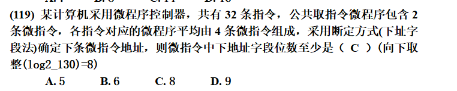
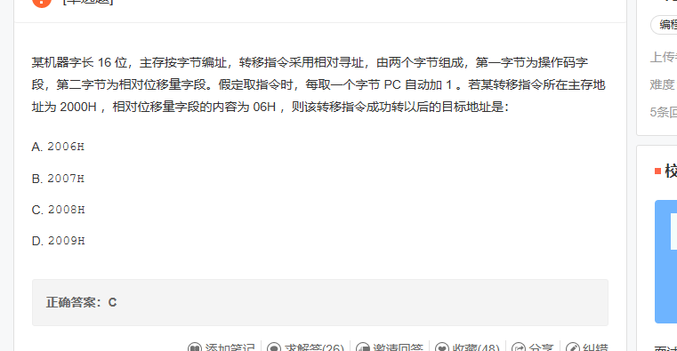
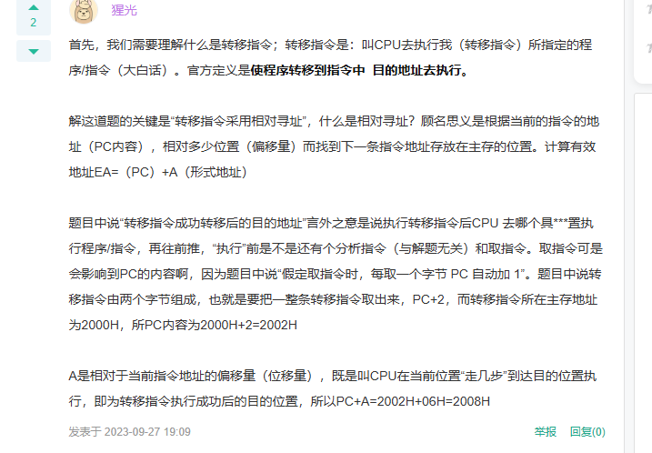
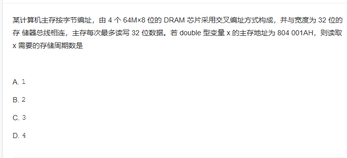
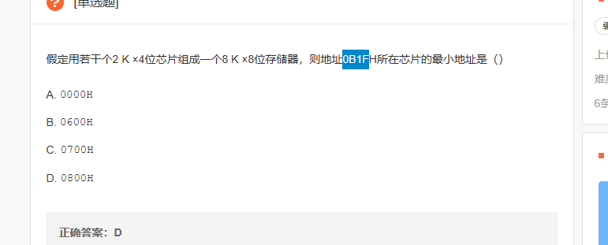
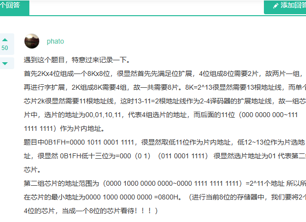
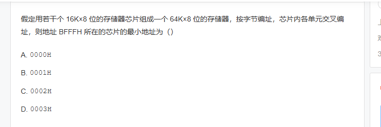

***\*(\*******\*1\*******\*17) 某容量为256M的存储器由若干个4 M\**** ***\*×\*******\*8位\*******\*DRAM\**** ***\*芯片构成，该DRAM芯片的地址引脚和数据引脚总数是\*******\*（ D ）\*******\*（\*******\*DRAM有地址复用：4M可以有22根地址线，但是DRAM复用后只用11根，然后加上数据线的8根。一共19根\*******\*）\****

***\*A.\**** ***\*22\****  ***\*B.\**** ***\*30\****   ***\*C.\**** ***\*36\****   ***\*D.\**** ***\*19\****

