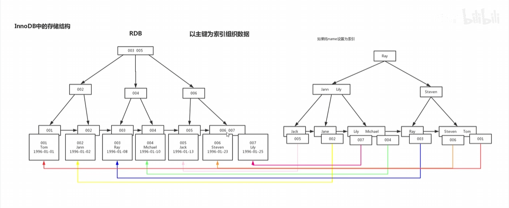
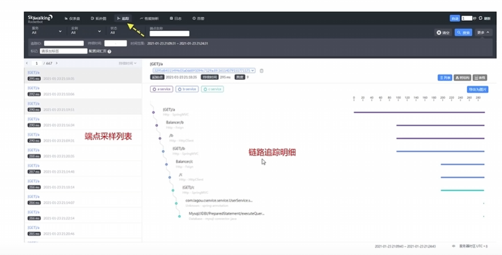
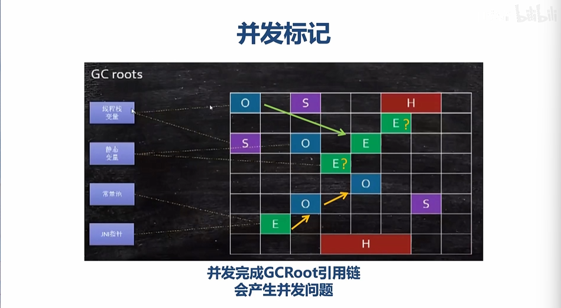
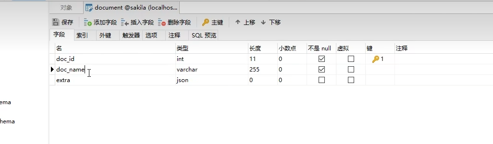
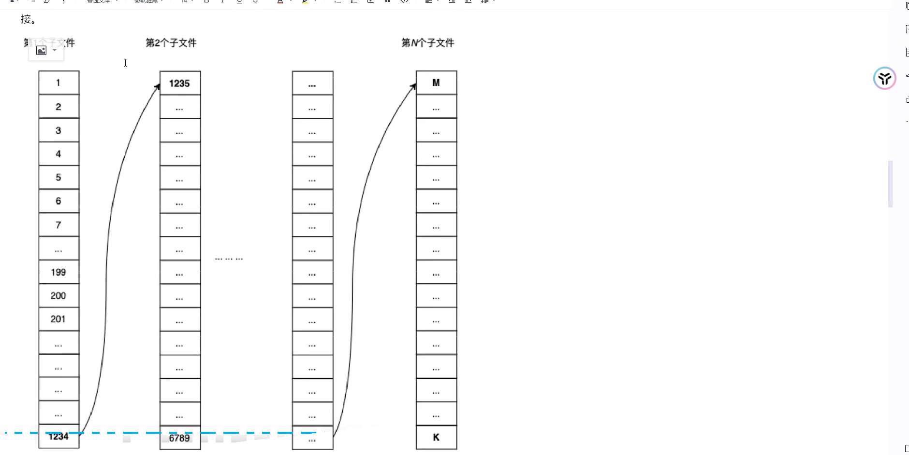
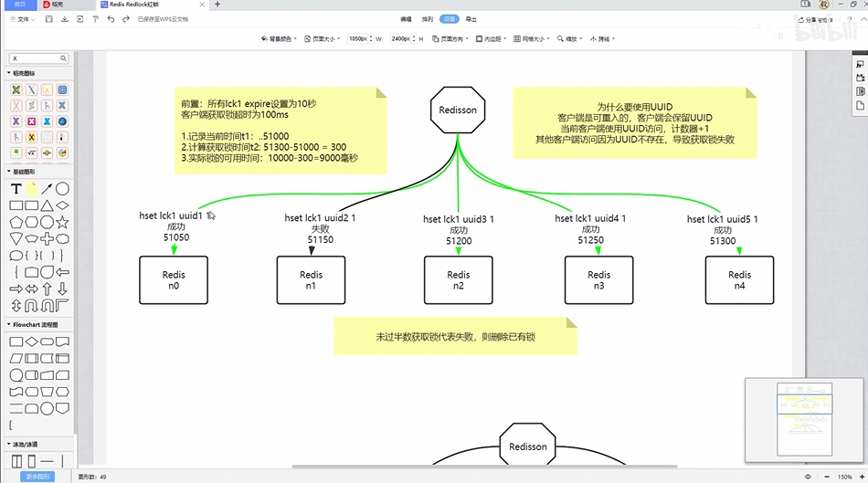

## 1.Seata-TCC-银行转账场景

> 在分布式系统中，银行转账使用 **TCC（Try-Confirm-Cancel）** 模式时，涉及到多个服务的协作。每个服务需要对其相关资源进行事务管理，以确保转账的一致性与可靠性。不同服务之间的数据结构和表设计至关重要，尤其是如何记录每个阶段的状态、事务的关联等。
>
> 以下是银行转账中涉及的 **TCC** 模式下，不同服务的表结构设计，假设有以下服务：
> 1. **账户服务**：负责账户资金的冻结、解冻、扣款和恢复。
> 2. **支付服务**：负责资金的实际转账操作。
> 3. **通知服务**：负责通知用户转账结果。
>
> ### 1. 账户服务：冻结与解冻账户资金
>
> 账户服务的核心功能是管理账户的资金状态，尤其是在 **Try** 阶段冻结资金，在 **Confirm** 阶段扣款，在 **Cancel** 阶段解冻资金。
>
> #### 表结构设计：`account_transactions`
>
> | 字段名           | 类型            | 描述                                                 |
> | ---------------- | --------------- | ---------------------------------------------------- |
> | `transaction_id` | `VARCHAR(64)`   | 事务ID，唯一标识一次银行转账事务                     |
> | `account_id`     | `VARCHAR(64)`   | 账户ID，标识该资金归属于哪个账户                     |
> | `amount`         | `DECIMAL(20,2)` | 事务金额，表示冻结或扣除的金额                       |
> | `status`         | `ENUM`          | 事务状态（`PENDING`，`COMMITTED`，`CANCELLED`）      |
> | `freeze_status`  | `BOOLEAN`       | 冻结状态，标识是否已冻结资金                         |
> | `created_at`     | `TIMESTAMP`     | 创建时间，标记事务的初始时间                         |
> | `updated_at`     | `TIMESTAMP`     | 更新时间，标记事务状态变更的时间                     |
> | `service_name`   | `VARCHAR(64)`   | 服务名称，标记是哪个服务在处理此操作（如支付服务等） |
> | `action`         | `ENUM`          | 当前操作类型（`TRY`，`CONFIRM`，`CANCEL`）           |
>
> - **Try 阶段**：在账户服务中，当请求冻结资金时，会插入一条记录，并将状态设置为 `PENDING`，并且 `freeze_status` 设置为 `TRUE`，表示资金已被冻结。
> - **Confirm 阶段**：如果转账成功，账户服务会将 `status` 更新为 `COMMITTED`，表示资金已经成功扣除。
> - **Cancel 阶段**：如果转账失败，账户服务将 `status` 更新为 `CANCELLED`，并解冻资金，`freeze_status` 更新为 `FALSE`。
>
> #### 示例记录：
>
> | transaction_id | account_id | amount  | status    | freeze_status | created_at          | updated_at          | service_name | action  |
> | -------------- | ---------- | ------- | --------- | ------------- | ------------------- | ------------------- | ------------ | ------- |
> | txn_123456     | acc_001    | 1000.00 | PENDING   | TRUE          | 2024-12-02 10:00:00 | 2024-12-02 10:10:00 | Payment      | TRY     |
> | txn_123456     | acc_001    | 1000.00 | COMMITTED | TRUE          | 2024-12-02 10:00:00 | 2024-12-02 10:30:00 | Payment      | CONFIRM |
>
> ---
>
> ### 2. 支付服务：处理资金转账操作
>
> 支付服务的核心任务是执行资金的实际转账操作，它需要协调多个服务之间的事务，确保资金的流动。支付服务需要记录每笔转账的 **Try**、**Confirm** 和 **Cancel** 阶段的执行情况。
>
> #### 表结构设计：`payment_transactions`
>
> | 字段名            | 类型            | 描述                                            |
> | ----------------- | --------------- | ----------------------------------------------- |
> | `transaction_id`  | `VARCHAR(64)`   | 事务ID，唯一标识一次银行转账事务                |
> | `from_account_id` | `VARCHAR(64)`   | 付款账户ID，标识资金来源账户                    |
> | `to_account_id`   | `VARCHAR(64)`   | 收款账户ID，标识资金目标账户                    |
> | `amount`          | `DECIMAL(20,2)` | 转账金额                                        |
> | `status`          | `ENUM`          | 事务状态（`PENDING`，`COMMITTED`，`CANCELLED`） |
> | `created_at`      | `TIMESTAMP`     | 创建时间                                        |
> | `updated_at`      | `TIMESTAMP`     | 更新时间                                        |
> | `action`          | `ENUM`          | 当前操作类型（`TRY`，`CONFIRM`，`CANCEL`）      |
> | `payment_method`  | `VARCHAR(64)`   | 支付方式（如银行转账、信用卡等）                |
>
> - **Try 阶段**：支付服务记录转账的初始请求，将状态设置为 `PENDING`，并执行转账验证操作。
> - **Confirm 阶段**：在资金冻结确认后，支付服务完成实际的资金转移，将状态设置为 `COMMITTED`。
> - **Cancel 阶段**：在转账过程中出现异常时，支付服务会将状态更新为 `CANCELLED`，并撤销相关操作。
>
> #### 示例记录：
>
> | transaction_id | from_account_id | to_account_id | amount  | status    | created_at          | updated_at          | action  |
> | -------------- | --------------- | ------------- | ------- | --------- | ------------------- | ------------------- | ------- |
> | txn_123456     | acc_001         | acc_002       | 1000.00 | PENDING   | 2024-12-02 10:00:00 | 2024-12-02 10:10:00 | TRY     |
> | txn_123456     | acc_001         | acc_002       | 1000.00 | COMMITTED | 2024-12-02 10:00:00 | 2024-12-02 10:30:00 | CONFIRM |
>
> ---
>
> ### 3. 通知服务：发送转账通知
>
> 通知服务的职责是根据转账的不同状态（成功、失败等），向用户发送相应的通知。
>
> #### 表结构设计：`notifications`
>
> | 字段名            | 类型          | 描述                               |
> | ----------------- | ------------- | ---------------------------------- |
> | `notification_id` | `VARCHAR(64)` | 通知ID，唯一标识一次通知           |
> | `transaction_id`  | `VARCHAR(64)` | 事务ID，关联支付事务               |
> | `user_id`         | `VARCHAR(64)` | 用户ID，标识哪个用户需要接收通知   |
> | `message`         | `TEXT`        | 通知内容，描述转账成功或失败的情况 |
> | `status`          | `ENUM`        | 通知状态（`SENT`，`FAILED`）       |
> | `created_at`      | `TIMESTAMP`   | 创建时间                           |
> | `updated_at`      | `TIMESTAMP`   | 更新时间                           |
>
> - **Try 阶段**：通知服务一般不会在 **Try** 阶段介入，但可以根据情况发送预通知。
> - **Confirm 阶段**：当转账完成时，通知服务会向用户发送成功通知，`status` 为 `SENT`。
> - **Cancel 阶段**：如果转账取消，通知服务会向用户发送失败通知，`status` 为 `FAILED`。
>
> #### 示例记录：
>
> | notification_id | transaction_id | user_id  | message                      | status | created_at          | updated_at          |
> | --------------- | -------------- | -------- | ---------------------------- | ------ | ------------------- | ------------------- |
> | notif_123456    | txn_123456     | user_001 | "转账成功，已完成1000元支付" | SENT   | 2024-12-02 10:30:00 | 2024-12-02 10:30:00 |
> | notif_123457    | txn_123456     | user_001 | "转账失败，1000元支付未完成" | FAILED | 2024-12-02 10:30:00 | 2024-12-02 10:30:00 |
>
> ---
>
> ### 总结
>
> 在银行转账过程中使用 **TCC** 模式时，各个服务（账户服务、支付服务和通知服务）都需要设计相应的表结构来记录事务状态、操作类型（`TRY`、`CONFIRM`、`CANCEL`）以及资源的冻结、解冻、扣款等操作。通过这些表结构，系统能够在分布式环境下保持数据一致性，并确保跨服务的事务协调。

> 以下是使用SpringCloud、Mybatis-Plus、Lombok和Seata实现TCC银行转账场景的相关代码。由于Seata相关的代码主要集中在服务实现类中，以下将提供每个服务的实现类以及Seata的TCC拦截器配置。
> ### 1. 账户服务实现（AccountService）
> ```java
> import io.seata.rm.tcc.api.BusinessActionContext;
> import io.seata.rm.tcc.api.TwoPhaseBusinessAction;
> import org.springframework.beans.factory.annotation.Autowired;
> import org.springframework.stereotype.Service;
> import org.springframework.transaction.annotation.Transactional;
> @Service
> public class AccountServiceImpl implements AccountService {
>     @Autowired
>     private AccountTransactionMapper accountTransactionMapper;
>     @Override
>     @TwoPhaseBusinessAction(name = "accountServiceTry", commitMethod = "accountServiceConfirm", rollbackMethod = "accountServiceCancel")
>     public void tryFreeze(BusinessActionContext context, AccountTransaction transaction) {
>         // 冻结资金逻辑
>         accountTransactionMapper.insert(transaction);
>     }
>     @Override
>     @Transactional
>     public void accountServiceConfirm(BusinessActionContext context) {
>         // 确认转账逻辑
>         String transactionId = context.getActionContext("transactionId").toString();
>         accountTransactionMapper.updateStatusById(transactionId, "COMMITTED");
>     }
>     @Override
>     @Transactional
>     public void accountServiceCancel(BusinessActionContext context) {
>         // 取消转账逻辑
>         String transactionId = context.getActionContext("transactionId").toString();
>         accountTransactionMapper.updateStatusById(transactionId, "CANCELLED");
>     }
> }
> ```
> ### 2. 支付服务实现（PaymentService）
> ```java
> import io.seata.rm.tcc.api.BusinessActionContext;
> import io.seata.rm.tcc.api.TwoPhaseBusinessAction;
> import org.springframework.beans.factory.annotation.Autowired;
> import org.springframework.stereotype.Service;
> import org.springframework.transaction.annotation.Transactional;
> @Service
> public class PaymentServiceImpl implements PaymentService {
>     @Autowired
>     private PaymentTransactionMapper paymentTransactionMapper;
>     @Override
>     @TwoPhaseBusinessAction(name = "paymentServiceTry", commitMethod = "paymentServiceConfirm", rollbackMethod = "paymentServiceCancel")
>     public void tryTransfer(BusinessActionContext context, PaymentTransaction transaction) {
>         // 尝试转账逻辑
>         paymentTransactionMapper.insert(transaction);
>     }
>     @Override
>     @Transactional
>     public void paymentServiceConfirm(BusinessActionContext context) {
>         // 确认转账逻辑
>         String transactionId = context.getActionContext("transactionId").toString();
>         paymentTransactionMapper.updateStatusById(transactionId, "COMMITTED");
>     }
>     @Override
>     @Transactional
>     public void paymentServiceCancel(BusinessActionContext context) {
>         // 取消转账逻辑
>         String transactionId = context.getActionContext("transactionId").toString();
>         paymentTransactionMapper.updateStatusById(transactionId, "CANCELLED");
>     }
> }
> ```
> ### 3. 通知服务实现（NotificationService）
> ```java
> import io.seata.rm.tcc.api.BusinessActionContext;
> import io.seata.rm.tcc.api.TwoPhaseBusinessAction;
> import org.springframework.beans.factory.annotation.Autowired;
> import org.springframework.stereotype.Service;
> import org.springframework.transaction.annotation.Transactional;
> @Service
> public class NotificationServiceImpl implements NotificationService {
>     @Autowired
>     private NotificationMapper notificationMapper;
>     @Override
>     @TwoPhaseBusinessAction(name = "notificationServiceTry", commitMethod = "notificationServiceConfirm", rollbackMethod = "notificationServiceCancel")
>     public void sendNotification(BusinessActionContext context, Notification notification) {
>         // 发送通知逻辑
>         notificationMapper.insert(notification);
>     }
>     @Override
>     @Transactional
>     public void notificationServiceConfirm(BusinessActionContext context) {
>         // 确认通知发送逻辑
>         String notificationId = context.getActionContext("notificationId").toString();
>         notificationMapper.updateStatusById(notificationId, "SENT");
>     }
>     @Override
>     @Transactional
>     public void notificationServiceCancel(BusinessActionContext context) {
>         // 取消通知发送逻辑
>         String notificationId = context.getActionContext("notificationId").toString();
>         notificationMapper.updateStatusById(notificationId, "FAILED");
>     }
> }
> ```
> ### 4. Seata TCC拦截器配置
> 在Spring Boot的配置类中，你需要注册TCC拦截器：
> ```java
> import io.seata.spring.annotation.GlobalTransactionScanner;
> import org.springframework.context.annotation.Bean;
> import org.springframework.context.annotation.Configuration;
> @Configuration
> public class SeataTccConfig {
>     @Bean
>     public GlobalTransactionScanner globalTransactionScanner() {
>         return new GlobalTransactionScanner("your-application-id", "your-tx-service-group");
>     }
> }
> ```
> 确保你的服务类上有`@Service`注解，并且`@Transactional`注解用于标注事务方法。`@TwoPhaseBusinessAction`注解用于标记TCC事务的方法。
> 请注意，以上代码仅为示例，并未包含具体的数据库操作逻辑。在实际应用中

## 2.MySQL单库-读写分离集群-分库分表集群-分片算法

> 在数据库系统设计中，随着数据量的不断增长和业务需求的多样化，单一的数据库架构往往无法满足高可用、高性能、高扩展等需求。因此，通常采用多种集群架构和中间件来提升系统的能力。你提到的三种常见模式（单库模式、读写分离集群模式、分库分表集群模式）是数据库架构设计中的关键组成部分，下面是对这些模式的完善和扩展说明。
>
> ### 1. **单库模式**
> 单库模式是最基础的数据库架构模式，通常适用于数据量较小、并发量较低的系统。在该模式下，所有的数据存储都集中在一个 MySQL 数据库实例中，所有的读写操作都由这个单一数据库来处理。优点是架构简单，易于管理；但缺点也很明显，随着数据量和并发量的增加，单个数据库实例会面临性能瓶颈，无法应对大规模的流量和数据存储需求。
>
> **适用场景：**
> - 数据量较小，负载较轻。
> - 系统复杂度较低，开发人员希望架构简单。
>
> **缺点：**
> - 随着数据量增大，性能瓶颈逐渐显现。
> - 不具备高可用性，一旦数据库故障，系统可能无法恢复。
>
> ### 2. **读写分离集群模式**
> 为了解决单库模式带来的性能瓶颈问题，通常采用读写分离集群模式。该模式的核心思想是将数据库的读操作和写操作分开，由不同的数据库节点来处理。具体来说，系统通过在主数据库（Master）和从数据库（Slave）之间进行数据同步来实现读写分离。主库负责写入操作，而从库负责读取操作，减轻了主库的负担，从而提升了系统的性能和可扩展性。
>
> **原理：**
> - **主从复制：** MySQL 通过 `binlog`（二进制日志）将主库的更新操作同步到从库。主库一般用于写操作，从库用于读操作。
> - **中间件：** 为了实现读写分离，通常会引入中间件（如 **Mycat**、**ShardingSphere** 等）来根据不同的业务场景将请求路由到主库或从库。
> - **高可用性：** 采用 **MHA**（MySQL高可用性架构）或 **Orchestrator** 等中间件来实现故障自动切换。若主库发生故障，可以自动将某个从库提升为新的主库，从而保证系统的高可用性。
>
> **优点：**
> - 减轻了主库的负担，提高了读操作的吞吐量。
> - 通过主从同步机制，能够实现数据冗余，提高数据的可靠性。
> - 使用中间件可以灵活地将请求路由到不同的数据库，提升了系统的可扩展性。
>
> **缺点：**
> - 写操作依赖于主库，如果主库宕机，可能会导致写操作的延迟或丢失。
> - 数据同步的延迟可能导致从库的数据略有滞后，影响读取的准确性。
>
> **适用场景：**
> - 读多写少的应用场景，如电商、新闻网站等。
> - 数据量和流量逐渐增大，但单库仍能承受的情况。
>
> ### 3. **分库分表（分片）集群模式**
> 当系统的负载进一步加大时，单一的数据库无法承载如此庞大的数据量，这时就需要采用分库分表（即分片）架构来水平扩展。分库分表通过将数据分布到多个物理数据库实例中，打破了单个数据库的限制，从而支持大规模的数据存储和高并发的读写操作。
>
> **分片的核心概念：**
> - **分库：** 将数据分布到多个数据库实例中，每个数据库负责一部分数据。通过拆分大表，避免单库的存储限制和性能瓶颈。
> - **分表：** 将大表进一步划分为多个小表，减少单个表的数据量，提高查询效率。
> - **分片键（Shard Key）：** 根据特定的字段（如用户ID、订单ID等）进行分片，确保数据的均匀分布和查询效率。
>
> **分片算法：**
> 1. **范围法：** 根据分片键的值范围将数据划分到不同的库和表中。例如，根据 ID 的大小进行区间划分。范围法易于扩展和理解，适用于大部分场景，但可能导致数据分布不均匀，某些区间的负载可能过高。
>    
>    **例子：**
>    - 分片键：`user_id`
>    - 范围：`user_id < 1000` 分到 `shard1`，`1000 <= user_id < 2000` 分到 `shard2` 等。
>
> 2. **哈希法：** 根据分片键对数据进行哈希计算（如取模），将数据均匀地分配到不同的库和表中。哈希法的优点是数据分布均匀，但扩展性较差，因为扩展时可能需要大量的数据迁移。
>
>    **例子：**
>    - 分片键：`user_id`
>    - 哈希：`user_id % 3`，分别映射到 `shard1`、`shard2`、`shard3`。
>
> 3. **一致性哈希：** 一致性哈希是哈希算法的一种变种，主要用于解决分库扩容时数据迁移的难题。它通过哈希环的方式分配数据，在新增或减少分片时，只有少量的数据需要迁移，从而提高了扩展性。
>
> **优点：**
> - 通过水平拆分，极大地扩展了数据库的存储容量和处理能力。
> - 数据存储分散，降低了单点故障的风险。
> - 在高并发的场景下，能够实现高吞吐量的读写操作。
>
> **缺点：**
> - 数据跨库、跨表查询复杂，查询性能和开发难度增加。
> - 分片方案设计不当可能导致数据不均匀分布，影响负载均衡。
> - 扩展过程中可能需要迁移大量数据，影响系统稳定性。
>
> **适用场景：**
> - 数据量极大，无法通过单一数据库进行存储和处理的场景。
> - 需要高并发、高吞吐量处理的系统，如大型电商、社交平台等。
>
> ### 4. **主流模式：读写分离 + 分库分表的组合运用**
> 在实际应用中，读写分离和分库分表通常会结合使用，构成一个更加复杂的集群架构。具体来说：
> - **分库分表**解决了单一数据库实例的性能瓶颈和扩展性问题，通过将数据分布到多个数据库节点中，可以承载更大的数据量。
> - **读写分离**通过将读操作分发到从库，减轻主库的负担，从而提高系统的整体性能。
>
> **结合方式：**
> - 在每个分片（分库）内，使用读写分离架构，主库负责写操作，从库负责读操作。
> - 通过中间件（如 **ShardingSphere** 或 **Mycat**），负责将请求路由到正确的分片和对应的读写分离节点。
>
> **优点：**
> - 系统可扩展性强，能够应对大规模数据和高并发读写的需求。
> - 通过分片和读写分离的结合，既保证了数据存储的扩展性，又提高了系统的读写性能。
>
> **缺点：**
> - 架构复杂度较高，需要精心设计分片策略、数据路由策略和容错机制。
> - 开发和维护的成本增加。
>
> **适用场景：**
> - 数据量庞大，且系统需要处理大量的读请求的高并发系统，如大型电商平台、社交网站、金融系统等。
>
> ### 总结
> 随着业务的不断发展，数据库架构也需要不断地调整和优化。不同的架构模式适用于不同的场景：
> - **单库模式**适用于简单、小规模的应用。
> - **读写分离模式**适用于读多写少的场景，能有效提升读取性能。
> - **分库分表模式**适用于数据量极大、需要水平扩展的系统。
> - **读写分离 + 分库分表组合模式**适用于高并发、大数据量的复杂应用，既保证了扩展性，又提升了性能。
>
> 选择合适的架构模式需要综合考虑业务需求、系统规模、可维护性以及未来的扩展需求。

> 配置 **MHA（MySQL High Availability）** 主要涉及以下几个步骤，包括安装 MHA 相关组件、配置 MySQL 主从复制、配置 MHA 管理器、以及测试高可用性配置。下面是详细的配置过程。
>
> ### 1. **准备 MySQL 环境**
> 首先，确保你已经有一个 MySQL 环境，并且至少有两个 MySQL 实例（一个主库和一个从库）。MHA 的核心依赖于 MySQL 的主从复制。
>
> #### 1.1 安装 MySQL
>
> 在每台服务器上安装 MySQL。假设你有两台服务器：
> - **主库服务器**：`master-host`
> - **从库服务器**：`slave1-host`，`slave2-host`
>
> 安装 MySQL 的版本建议与 MHA 兼容，通常是 5.6 或 5.7。安装过程根据操作系统不同而有所区别。
>
> ### 2. **配置 MySQL 主从复制**
> #### 2.1 主库配置
> 在主库上进行以下配置：
>
> 1. 编辑 `my.cnf` 配置文件，启用二进制日志（`binlog`）和服务器 ID（`server-id`）。
>
> ```ini
> [mysqld]
> server-id = 1
> log-bin = mysql-bin
> binlog-format = row
> ```
>
> 2. 重启 MySQL 服务，使配置生效。
>
> ```bash
> systemctl restart mysql
> ```
>
> 3. 创建复制用户并授予权限：
>
> ```sql
> CREATE USER 'replica_user'@'%' IDENTIFIED BY 'password';
> GRANT REPLICATION SLAVE ON *.* TO 'replica_user'@'%';
> FLUSH PRIVILEGES;
> ```
>
> #### 2.2 从库配置
> 在从库上进行以下配置：
>
> 1. 编辑 `my.cnf` 配置文件，设置唯一的 `server-id`，并启用复制。
>
> ```ini
> [mysqld]
> server-id = 2  # 对于每台从库，确保 ID 唯一
> ```
>
> 2. 重启 MySQL 服务。
>
> ```bash
> systemctl restart mysql
> ```
>
> 3. 配置从库连接到主库：
>
> ```sql
> CHANGE MASTER TO 
>   MASTER_HOST = 'master-host', 
>   MASTER_USER = 'replica_user', 
>   MASTER_PASSWORD = 'password', 
>   MASTER_LOG_FILE = 'mysql-bin.000001',  -- 从主库的二进制日志文件名
>   MASTER_LOG_POS = 154;                  -- 从主库获取日志位置
> START SLAVE;
> ```
>
> 4. 检查从库是否同步：
>
> ```sql
> SHOW SLAVE STATUS\G
> ```
>
> 确保 `Slave_IO_Running` 和 `Slave_SQL_Running` 都是 `Yes`，表示从库正常同步主库。
>
> ### 3. **安装 MHA 组件**
> MHA 需要在管理节点（MHA Manager）和数据库节点（MySQL 实例）上安装相关软件。
>
> #### 3.1 安装 MHA Manager
> MHA Manager 是负责监控 MySQL 主库状态、执行故障转移等操作的核心组件。你需要在管理服务器上安装 MHA Manager。
>
> 1. 安装依赖：
>
> ```bash
> sudo apt-get install perl libdbi-perl libmysqlclient-dev libssh2-1-dev
> ```
>
> 2. 下载并安装 MHA：
>
> ```bash
> wget https://github.com/yoshinori-ikegami/mha4mysql-manager/releases/download/v0.57/mha4mysql-manager-0.57.tar.gz
> tar -xzvf mha4mysql-manager-0.57.tar.gz
> cd mha4mysql-manager-0.57
> perl Makefile.PL
> make
> sudo make install
> ```
>
> #### 3.2 配置 MHA Manager
> MHA Manager 配置文件通常位于 `/etc/mha.cnf`。你需要设置以下内容：
>
> ```ini
> [server default]
> # MHA Manager 配置的全局设置
> manager_user=root
> manager_password=yourpassword
> ssh_user=root
> # 配置 MHA Manager 服务器列表
> master_ip_failover_script=/usr/local/bin/master_ip_failover
> # 配置 MySQL 节点
> [server1]
> hostname=master-host
> port=3306
> candidate_master=1
> # 配置从库
> [server2]
> hostname=slave1-host
> port=3306
> candidate_master=1
> # 其他从库配置
> [server3]
> hostname=slave2-host
> port=3306
> candidate_master=0
> ```
>
> - `manager_user` 和 `manager_password`：用于 MHA 管理工具连接到 MySQL 的用户名和密码。
> - `master_ip_failover_script`：定义故障转移时的 IP 切换脚本路径（通常使用 `master_ip_failover` 脚本）。
> - `hostname` 和 `port`：列出所有 MySQL 服务器的信息。
> - `candidate_master=1`：标记该服务器为故障转移的候选主库。
>
> #### 3.3 配置 SSH 和密钥
> MHA Manager 需要通过 SSH 连接到所有 MySQL 节点。你需要确保 MHA Manager 机器能够无密码登录到所有 MySQL 节点。
>
> 1. 生成 SSH 密钥：
>
> ```bash
> ssh-keygen -t rsa
> ```
>
> 2. 将公钥拷贝到所有 MySQL 节点：
>
> ```bash
> ssh-copy-id user@master-host
> ssh-copy-id user@slave1-host
> ssh-copy-id user@slave2-host
> ```
>
> ### 4. **启动 MHA**
> 启动 MHA Manager 后，它将开始监控 MySQL 集群，并根据需要进行故障转移。
>
> 1. 启动 MHA Manager：
>
> ```bash
> masterha_manager --conf=/etc/mha.cnf --ignore_last_failover
> ```
>
> 2. 查看故障转移状态：
>
> ```bash
> masterha_check_repl --conf=/etc/mha.cnf
> ```
>
> 该命令将检查 MySQL 集群的复制状态，确保所有节点都同步并且可以正常工作。
>
> ### 5. **测试 MHA 故障转移**
> 为了测试 MHA 是否工作正常，你可以手动停止主库 MySQL 服务，查看是否能够自动切换到从库。
>
> 1. 停止主库：
>
> ```bash
> systemctl stop mysql
> ```
>
> 2. 查看 MHA 是否执行故障转移，主库会自动切换到新的主库。
>
> ```bash
> masterha_check_repl --conf=/etc/mha.cnf
> ```
>
> 如果配置正确，MHA 会自动将新的从库提升为主库，并且所有的 MySQL 节点会重新同步。
>
> ### 6. **优化和维护**
> - **定期检查 MHA 状态**：定期使用 `masterha_check_repl` 检查 MySQL 集群的状态，确保复制同步无误。
> - **故障转移脚本**：你可以自定义故障转移脚本，以便根据特定需求进行调整，例如自动调整 DNS 或修改应用配置。
> - **监控**：可以将 MHA 集成到系统的监控工具（如 Zabbix、Prometheus）中，以便实时监控 MySQL 的健康状态。
>
> ### 总结
> 配置 MHA 主要包括以下步骤：
>
> 1. 配置 MySQL 主从复制。
> 2. 安装和配置 MHA Manager 以监控 MySQL 集群并执行故障转移。
> 3. 配置 SSH 无密码登录，以便 MHA Manager 能够与各个 MySQL 节点进行交互。
> 4. 测试故障转移过程，确保 MHA 能够在主库宕机时自动切换。
>
> 通过这些步骤，你就可以实现 MySQL 的高可用性，保证在数据库故障时系统能够自动切换到新的主库。
> 

## 3.大厂为何做垂直分表？

> ### 为什么大厂做垂直分表？
>
> 垂直分表（Vertical Partitioning）是将一个表中的字段按逻辑或访问频率进行拆分，创建多个小表。这种做法通常是为了优化性能，减少 I/O 操作，提高数据库的查询效率，尤其是在面对大数据量的情况下。大厂做垂直分表的主要原因，通常与以下几个因素密切相关：
>
> 1. **表的字段过多，数据查询性能低**：
>    当一张表的字段非常多，特别是包含一些大字段（如 `VARCHAR`、`BLOB`、`CLOB`）时，每次查询时，数据库需要加载大量不必要的数据，导致内存和磁盘 I/O 的开销变大。垂直分表能够将频繁访问的小字段与不常访问的大字段分开存储，从而减少每次查询时加载的无关数据。
>
> 2. **优化查询和提高执行效率**：
>    如果表中包含一些低频字段或大字段（如图片、文本等），在常规查询时，这些字段并不总是被访问，导致不必要的数据被载入到内存中，影响性能。通过垂直分表，可以将大字段和高频字段分开，查询时只加载需要的字段，避免全表扫描和大数据量的内存消耗。
>
> 3. **减少跨页读取的成本**：
>    由于 InnoDB 存储引擎使用的是页（Page）作为数据存储的基本单元，一个页的大小默认是 16KB。若一张表中的行数据过大，每一页可能只能容纳很少的行，这样在查询时可能需要跨多个页来检索数据。通过垂直分表，可以让每个小表的行数据更加紧凑，减少跨页读取，从而提高查询效率。
>
> 4. **提高数据的存储与管理效率**：
>    垂直分表可以把不同类型的数据放在不同的表中，这样可以更好地管理数据。例如，大字段（如文本、二进制数据）可以单独存储，以优化存储和检索性能。而小字段则可以存放在一个紧凑的小表中，以加速查询。
>
> ---
>
> ### 什么是水平分表？
>
> 水平分表（Horizontal Partitioning）是将数据按行拆分，即通过某种策略（如范围法、哈希法等）将数据分布到多个表中。每个表的结构是完全相同的，唯一的区别在于存储的数据行不同。常见的水平分表策略包括：
>
> - **范围法（Range Partitioning）**：按一定的范围划分数据，例如按日期、ID 等字段范围来划分表。
> - **哈希法（Hash Partitioning）**：根据某个字段的哈希值，将数据分到不同的表中。
>
> 水平分表的主要目的是解决单表数据量过大的问题，特别是在数据量大到无法在单台机器上高效存储和查询时。通过将数据拆分到多个表中，降低单个表的数据量，提高查询和存储性能。
>
> ### 什么是垂直分表？
>
> 垂直分表是将一张表的列（字段）拆分成多张表，通过主外键的关系将它们关联起来。与水平分表通过拆分数据行不同，垂直分表主要是将表的不同字段进行拆分。
>
> 垂直分表适用于以下场景：
>
> - **字段过多，且查询时频繁只需要部分字段**：如果表中有很多字段，但并不是每次查询都需要这些字段，垂直分表可以帮助将频繁访问的字段与不常访问的字段分开，减少查询时的数据量。
> - **大字段（如 `TEXT`、`BLOB`）**：这些字段占用空间大，频繁查询时不常访问，通过垂直分表，可以将这些大字段单独存储，以减少查询时的开销。
>   
>
> 垂直分表可以根据字段的类型、查询频率等因素进行拆分：
>
> - **小表**：存储查询频繁的小字段，通常包括索引字段、常用字段。
> - **大表**：存储低频访问的字段，如大文本字段、二进制文件等。
>
> ### 垂直分表的背景：InnoDB 存储引擎的工作原理
>
> 理解为什么垂直分表能够提高性能，我们需要从 **InnoDB** 存储引擎的底层机制来分析。
>
> 1. **页（Page）与区（Extent）**：
>    InnoDB 存储引擎将数据存储在称为 **页**（Page）中，每页大小为 **16KB**。多个连续的页组成一个 **区**（Extent），每个区通常有 64 页。每一页可以存储一定量的行数据，行的大小和页的容量直接影响存储效率和查询性能。
>
> 2. **跨页检索问题**：
>    如果一行数据的大小较大，可能会导致单页不能完全容纳一个完整的行数据，导致数据分布在多个页中。每次查询时，InnoDB 可能需要跨越多个页来检索同一行的数据，这增加了 I/O 操作的开销，影响查询性能。
>
> 3. **压缩页（Compressed Pages）**：
>    在 InnoDB 1.0 之后，压缩页成为一个新特性。压缩页可以减少数据在磁盘上的存储占用，但在跨页检索时，压缩和解压缩的过程会导致额外的 CPU 和时间消耗。因此，为了避免跨页检索，设计时应尽可能让一行数据能够完全存储在一个页内。
>
> ### 垂直分表的优化效果
>
> 假设一张表的每行数据为 1KB，而每页大小为 16KB，这样每页可以存储约 16 行数据。若数据量达到 1 亿行，那么表将占用 625 万页的数据空间。
>
> 通过垂直分表，假设每行数据能够被压缩到 64 字节（通过将一些大字段分离），那么每页就可以存储 256 行数据。这使得同样的数据量（1 亿行）仅需要 39 万页，极大地减少了页的数量，从而提高了数据访问效率。
>
> ### 垂直分表的应用条件
>
> 垂直分表的条件通常包括：
>
> 1. **单表数据量达到千万级别**：当表的数据量过大时，单个表的查询、存储、备份等操作变得非常缓慢，垂直分表能有效减轻这些负担。
> 2. **字段数超过 20 个且包含大字段类型**：当表的字段过多，且包括了 `VARCHAR`、`CLOB`、`BLOB` 等大字段类型时，垂直分表能够帮助将频繁访问的小字段与大字段分离，减少查询时的数据量。
> 3. **高频访问字段与低频访问字段区分明显**：通过将高频访问字段与低频访问字段分开存储，能够大大减少查询时的冗余数据加载，提升性能。
>
> ### 垂直分表的字段拆分策略
>
> 在进行垂直分表时，字段拆分的依据通常是：
>
> - **小表**：存储查询、排序时频繁使用的小字段，如主键、索引字段、状态字段等。
> - **大表**：存储低频访问的字段，如大文本字段、图片、文件数据等。 
>
> 通过这样的拆分策略，可以在保证查询效率的同时，降低存储和访问的开销。
>
> ---
>
> ### 总结
>
> 垂直分表是针对表中字段较多、数据量大的情况采取的一种优化策略。通过将表按字段拆分成多个小表，可以提高查询性能、减少磁盘 I/O 操作和内存开销，尤其适用于字段过多、包含大字段（如 `VARCHAR`、`BLOB` 等）的场景。垂直分表的实现通常依赖于对 MySQL 内部存储引擎（如 InnoDB）机制的深入理解，能够帮助解决大数据量、高频访问和低频字段分离等问题。
>
> 

> 下面通过一个实际的例子来展示如何使用垂直分表优化数据库查询性能。
>
> ### 场景背景
>
> 假设我们有一个 **用户信息表** (`users`)，它存储了每个用户的基本信息、联系方式、地址等。由于该表的字段比较多，且表中的一些字段访问频率较低（如用户的头像、地址等），而一些字段频繁查询（如用户名、邮箱、手机号码等），因此需要考虑通过垂直分表来优化查询性能。
>
> #### 原始 `users` 表结构
>
> ```sql
> CREATE TABLE users (
>     user_id INT PRIMARY KEY,       -- 用户ID
>     username VARCHAR(50),          -- 用户名
>     email VARCHAR(100),            -- 用户邮箱
>     phone VARCHAR(20),             -- 用户电话
>     password_hash VARCHAR(255),    -- 密码哈希值
>     address TEXT,                  -- 用户地址
>     profile_picture BLOB,          -- 用户头像
>     created_at DATETIME,           -- 注册时间
>     updated_at DATETIME            -- 信息更新时间
> );
> ```
>
> - 表中有很多字段，但并不是所有字段在每次查询时都需要使用。
> - `address` 和 `profile_picture` 是大字段，频繁查询时并不总是需要它们。
>
> ### 目标
>
> 通过 **垂直分表**，将高频字段和低频字段分离，提高查询性能，减少不必要的 I/O 操作。
>
> ### 垂直分表策略
>
> 我们将用户表按访问频率将字段拆分为两部分：
>
> - **高频查询字段**：如 `user_id`, `username`, `email`, `phone`, `password_hash`, `created_at`, `updated_at`。
> - **低频查询字段**：如 `address` 和 `profile_picture`（这类字段通常较大且不常查询）。
>
> #### 分表后的结构
>
> 1. **`users_basic` 表**：存储常用的、查询频繁的字段。
> 2. **`users_extra` 表**：存储不常用的、低频访问的字段。
>
> ```sql
> -- 高频字段表
> CREATE TABLE users_basic (
>     user_id INT PRIMARY KEY,        -- 用户ID
>     username VARCHAR(50),           -- 用户名
>     email VARCHAR(100),             -- 用户邮箱
>     phone VARCHAR(20),              -- 用户电话
>     password_hash VARCHAR(255),     -- 密码哈希值
>     created_at DATETIME,            -- 注册时间
>     updated_at DATETIME             -- 信息更新时间
> );
> 
> -- 低频字段表
> CREATE TABLE users_extra (
>     user_id INT PRIMARY KEY,        -- 用户ID
>     address TEXT,                   -- 用户地址
>     profile_picture BLOB,           -- 用户头像
>     FOREIGN KEY (user_id) REFERENCES users_basic(user_id)  -- 外键关联
> );
> ```
>
> ### 分表后的访问场景
>
> 1. **常规查询**：
>    - 假设我们需要查询一个用户的基本信息（例如用户名、邮箱、电话号码等），这时只需要查询 `users_basic` 表即可，避免了读取 `address` 和 `profile_picture` 字段，从而提高了查询效率。
>
>    ```sql
>    SELECT user_id, username, email, phone, created_at, updated_at
>    FROM users_basic
>    WHERE user_id = 123;
>    ```
>
> 2. **查询包含低频字段的用户信息**：
>    - 如果我们需要查询用户的地址或头像，只有在必要时才会去查询 `users_extra` 表，避免了不必要的数据加载。
>
>    ```sql
>    SELECT u.username, u.email, u.phone, e.address, e.profile_picture
>    FROM users_basic u
>    JOIN users_extra e ON u.user_id = e.user_id
>    WHERE u.user_id = 123;
>    ```
>
> 3. **查询所有字段**：
>    - 如果需要查询完整的用户信息（包括地址和头像），可以通过联合查询来获取所有字段。
>
>    ```sql
>    SELECT u.*, e.*
>    FROM users_basic u
>    LEFT JOIN users_extra e ON u.user_id = e.user_id
>    WHERE u.user_id = 123;
>    ```
>
> ### 优化效果
>
> 1. **减少不必要的数据加载**：
>    - 在大多数查询场景中，我们只需要查询用户的基本信息（用户名、邮箱、电话等）。通过垂直分表，这些常用字段与低频字段分开存储，查询时无需加载 `address` 和 `profile_picture` 这些不必要的数据，减少了 I/O 开销。
>
> 2. **提高缓存效率**：
>    - 常用的字段存储在 `users_basic` 表中，查询时只涉及较小的数据集合，这样可以提高缓存命中率，减少磁盘读取。
>
> 3. **提升查询速度**：
>    - 如果用户表的行数非常庞大（例如千万级用户），查询 `users_basic` 表时只需要扫描较少的数据，查询效率大大提升。
>
> 4. **数据存储和管理优化**：
>    - 将大字段（如头像、地址）存储在 `users_extra` 表中，有助于更好地管理这些数据。因为这些字段通常比较大，频繁读取可能对性能产生影响，将它们分开存储可以减少主表的负担。
>
> ### 总结
>
> 通过垂直分表，我们将频繁访问的字段与不常用的字段分开存储，提高了查询效率，并减少了不必要的磁盘 I/O 操作。此外，垂直分表使得数据的管理更加清晰，并能针对不同类型的数据做针对性优化。

## 4.缓存：客户端->应用层->服务层&一致性

> 
>
> ### 缓存是提升性能最直接的方法
>
> 缓存可以显著提高系统的性能，减少对后端服务的请求，降低延迟并减少带宽占用。常见的缓存机制可以分为多级缓存：**客户端缓存**、**应用层缓存**、**服务层缓存**、**数据层缓存**。
>
> #### 一、客户端缓存
> 客户端缓存主要用于浏览器的静态资源缓存，通过本地存储机制减少网络带宽消耗，提高用户体验。常见的做法是设置 `Expires` 或 `Cache-Control` 响应头，告诉浏览器在特定时间段内缓存资源，避免重复请求同一资源。
>
> - **Expires**：指示浏览器在特定的时间点后缓存过期。比如设置一个日期时间，浏览器会缓存文件直到该时间，过期后会重新请求。
> - **Cache-Control**：是另一种缓存控制方法，能更细粒度地设置缓存的过期时间和策略。比如设置 `Cache-Control: max-age=86400` 表示资源在 86400 秒内有效。
>
> **客户端缓存的好处**：
> 1. 减少网络请求，提高页面加载速度。
> 2. 降低带宽消耗和服务器压力。
> 3. 有助于高并发情况下减轻后端负担。
>
> #### 二、应用层缓存
> 应用层缓存通常指通过CDN（内容分发网络）、Nginx等技术将静态资源或应用数据进行缓存，从而减少服务器的负载。应用层缓存主要是将客户端请求缓存到中间层，通过缓存资源来避免重复计算和请求。
>
> - **(部署成本很贵)CDN（内容分发网络）**：CDN通过将内容分发到不同的地理位置的节点，使得用户能够就近访问缓存数据，从而提高访问速度并减少带宽压力。例如，用户访问某个静态资源时，CDN会根据DNS请求选择最优的CDN节点（如上海），如果该节点有缓存资源，则直接返回给用户。如果没有，则会从源站（如北京）获取并缓存到本地。
>
> - **Nginx缓存管理**：Nginx可以通过反向代理和负载均衡将请求转发到多个应用服务器，并提供静态资源缓存和压缩功能，减少数据库或后端服务的访问压力。
>
> **响应头Expires与Cache-Control的区别**：
> 1. **Expires**：表示缓存的过期时间，是绝对时间点，过期后缓存将失效。
> 2. **Cache-Control**：则表示缓存的最大生存时间，相对时间，能细粒度控制缓存策略（如 `max-age` 表示缓存的有效时间）。
>
> #### 三、服务层缓存
> 服务层缓存包括进程内缓存和进程外缓存，主要用于优化数据查询和处理速度。
>
> - **进程内缓存**：指数据在应用程序内存中存储。常见的实现有 `ehcache`、`Caffeine`，这些缓存是在单个应用实例的内存中进行缓存，能够快速访问数据，避免重复的数据库查询或计算。
>
>   - **Java框架的缓存机制**：例如在 `Hibernate` 或 `MyBatis` 中使用一级缓存和二级缓存，或者在 `Spring MVC` 中进行页面缓存，都属于进程内缓存的一种应用。
>
> - **进程外缓存**：指数据缓存存储在分布式缓存系统中，如 `Redis`、`Memcached`。它们能够跨越多台服务器共享缓存，支持高并发访问。
>
>   **缓存策略**：
>   - **先近后远**：在多级缓存架构中，通常采用“先近后远”的策略，先访问本地缓存，如果没有则访问分布式缓存，最后访问数据库。
>   - **场景**：例如商品秒杀场景，如果没有本地缓存，数据可能都会存储在 `Redis` 中，但如果缓存没有及时更新或 Redis 节点崩溃，会导致系统压力过大。因此，设计时需要合理分配缓存层级，并考虑缓存失效和更新策略。
>
> #### 四、缓存一致性处理
> 缓存一致性是指在缓存更新时，确保缓存中的数据和数据库中的数据保持一致。
>
> - **问题场景**：假设修改商品价格为 80 元，如何保证缓存中的数据也能及时更新？
>   
>   **处理方法**：
>   1. **主动推送更新**：通过消息队列（如 Kafka、RabbitMQ）将数据更新的消息推送到各个服务实例。
>   2. 服务实例接收到更新消息后，删除原缓存并重新加载新数据，确保缓存与数据库中的数据一致。
>   3. 可以使用“缓存更新”模式，定时或触发更新缓存数据。
>
> #### 五、什么时候使用多级缓存架构
> 多级缓存架构通常适用于以下场景：
>
> 1. **缓存数据稳定**：数据更新不频繁，适合缓存，以减少对数据库的访问。
> 2. **高并发场景**：例如高流量的电商平台（如12306），在启动时进行缓存预热，将热点数据提前缓存，避免每次请求都访问后端服务。
> 3. **允许一定程度的数据不一致**：一些场景对数据的一致性要求不高，可以接受一定时间的延迟，适合使用“事件驱动”的更新方式，如T+1批处理模式、ETL日中处理等。
>
> ### 总结
> 多级缓存架构是现代分布式系统中提升性能和可伸缩性的关键手段。通过合理使用客户端缓存、应用层缓存、服务层缓存等技术，能够显著提高系统的响应速度，减少对后端服务的压力，并且在高并发场景下保持系统稳定运行。同时，缓存一致性问题也需要特别关注，通过设计合理的缓存更新机制，确保缓存数据与数据库数据的一致性。

## 5.行业倾向

1. 行业>项目>甲方
2. 行业：
   1. 银行=互联网>保险>传统行业>政府
3. 项目：
   1. 核心(支付业务)>业务系统(业务相关管理系统)>数据应用(基础核心业务的计算+产出+报表,要去接触数据)>行政应用
4. 甲方：
   1. 知名厂牌>大银行>小银行>其他企业
   2. 大厂和大银行数据多，你能看到的数据越多，你以后跳槽的起点越高。

## 6.大表涉及到分库分表为何禁用自增主键

> ---
>
> ### 自增主键在分布式环境下的挑战
>
> 在传统的单机数据库中，自增主键（Auto-Increment Primary Key）是常用的唯一标识符方式，能够为每条记录生成一个唯一的 ID。然而，在分布式环境下，自增主键面临着以下几大挑战：
>
> 1. **范围法分片导致扩展困难**：  
>    自增主键通常与数据库表的分片方案结合使用，常见的一种分片方式是“按范围法”进行分片。即每个数据库节点分配一个特定的 ID 范围，插入数据时分配一个特定范围内的主键。然而，这种方案有几个缺点：
>    - **固定的ID范围无法动态扩展**：当数据库节点需要扩展时，原有的 ID 范围已被占用，必须手动调整或重新分配，这对于系统的可扩展性来说是一个瓶颈。
>    - **尾部热点效应**：由于分片按照 ID 范围进行划分，前面的分片数据已积累完毕，而最后一个分片则承担了大量的写入操作，从而导致该分片成为性能瓶颈，产生**尾部热点**。这种热点问题可能导致系统性能不均衡。
>
> 2. **自增主键的顺序性问题**：  
>    自增主键要求生成的 ID 是连续且递增的，但在分布式环境下，生成连续的 ID 变得非常困难，因为各个节点独立工作，且 ID 必须保证唯一和有序，这给系统带来了很大的挑战。
>
> ### 为什么不使用 UUID 替代自增主键？
>
> **UUID**（通用唯一标识符）是一种全局唯一的标识符，通常用来替代自增主键。尽管 UUID 可以保证全球唯一性，但在分布式数据库中使用时存在一些问题：
>
> 1. **UUID 的无序性**：  
>    - UUID 作为主键，生成的 ID 是完全无序的（通常基于随机数或时间戳生成）。这导致在插入数据时，数据库的 B+ 树索引会发生大量的重排，从而显著降低了数据库的写入性能。
>    - 相比之下，自增主键是有序的，B+ 树索引可以高效地在原有数据的末尾追加新的 ID，从而减少索引的重排和优化查询性能。
>
> 2. **数据库性能问题**：  
>    由于 UUID 的无序特性，插入时数据库可能会频繁地对索引进行重排，导致性能下降。这对于大规模的高并发写入场景来说，可能成为瓶颈。
>
> ### 如何解决分布式环境下的主键生成问题？
>
> 为了解决分布式环境下自增主键和 UUID 的问题，**分布式且有序的主键生成算法**成为一个有效的解决方案。其中，**雪花算法（Snowflake）**是最常用的一种方式。
>
> #### 雪花算法（Snowflake）
>
> 雪花算法最初由 Twitter 提出，旨在解决分布式系统中的唯一 ID 生成问题。该算法生成的 ID 是有序的，同时保证在分布式环境下不会出现重复的情况，具有较高的性能和扩展性。
>
> **雪花算法的结构**：
> 雪花算法生成的 ID 是一个 64 位的整数，具体结构如下：
>
> 1. **符号位（1 bit）**：始终为 0，表示 ID 是正数。
> 2. **时间戳（41 bits）**：使用 41 位来表示毫秒级时间戳。这样可以支持长时间的唯一 ID 生成（大约 69 年），即时间戳部分表示当前时间的毫秒数。
> 3. **机器 ID（10 bits）**：用于区分不同的机器节点。通常，机器 ID 可以包括数据中心 ID 和机器的标识符，这样可以确保不同机器生成的 ID 不会重复。10 位可以支持最多 1024 台机器。
> 4. **序列号（12 bits）**：每个机器节点在同一毫秒内，最多能够生成 4096 个 ID。序列号是自增的，避免在同一毫秒内生成相同的 ID。
>
> 因此，雪花算法生成的 ID 具有以下特点：
> - **唯一性**：每个生成的 ID 都是唯一的，不会出现重复。
> - **有序性**：因为时间戳位在高位，生成的 ID 按照时间顺序递增，从而避免了索引重排的问题。
> - **高效性**：由于 ID 生成过程不依赖于数据库或网络，因此生成速度非常快，适用于高并发的分布式环境。
>
> **ID 示例**：假设生成的 ID 为 `1000000000000001`，我们可以通过解析该 ID 获得具体的信息：
> - 时间戳（41bit）部分：可以推算出该 ID 的生成时间。
> - 机器 ID（10bit）部分：可以标识生成该 ID 的机器。
> - 序列号（12bit）部分：可以表示该机器在同一毫秒内生成的不同 ID。
>
> #### 雪花算法的注意事项
>
> 尽管雪花算法在解决分布式 ID 生成问题方面非常有效，但也有一些需要注意的地方：
>
> 1. **时间回拨问题**：  
>    雪花算法依赖于系统时间来生成 ID，如果系统时间发生回拨（即时间被设置为比当前时间更早的值），可能会导致生成的 ID 重复。为了避免这一问题，雪花算法通常会进行时间校验，确保时间的单调递增，或者使用时钟回拨检测机制来进行处理。
>    
> 2. **序列号溢出问题**：  
>    如果同一台机器在同一毫秒内生成的序列号达到了最大值（即 4095），则会等待到下一毫秒生成新的 ID。虽然这种情况很少发生，但在高并发场景下仍然需要关注这一问题。
>
> 3. **时间戳精度问题**：  
>    雪花算法使用毫秒级别的时间戳，这意味着在高并发的情况下，多个请求可能会生成相同的序列号。如果需要更高精度的时间戳（例如微秒级别），需要调整算法结构。
>
> ### 总结
>
> 1. **自增主键**在分布式环境下的主要问题是范围法分片无法动态扩展，并且会导致尾部热点问题，严重影响系统性能。
> 2. **UUID**虽然能够保证全局唯一性，但由于其无序性导致数据库索引重排，性能较差。
> 3. **雪花算法**是一种分布式且有序的主键生成方案，通过时间戳、机器 ID 和序列号的结合，解决了分布式系统中的唯一性、顺序性和性能问题。但在使用时需要特别注意系统时间回拨和序列号溢出等问题。
>
> 通过采用雪花算法，可以在保证高并发和分布式环境下的性能和扩展性的同时，解决自增主键和 UUID 的问题。

## 7.布隆过滤器在亿级电商场景的应用

> 为了更好地实现Redisson集成布隆过滤器的部分，并且在实际应用中应对缓存穿透的问题，我们可以逐步完善该方案。下面将介绍如何使用布隆过滤器进行预防缓存穿透的具体实现，并探讨一些可能的优化方案。
>
> ### 一、背景与需求
>
> **场景说明：**  
> 假设Redis缓存有1000条数据，当系统遭遇大量无效请求（如爬虫、流量攻击等）时，查询请求可能直接穿透到数据库。由于数据库的承载能力有限，过多的查询请求可能会使数据库崩溃或响应超时。
>
> **缓存穿透：**  
> 指的是查询不存在的数据，导致这些查询被直接发送到数据库，给数据库带来极大的压力。为了减少这种影响，布隆过滤器可以作为一种有效的预防手段。
>
> ### 二、布隆过滤器的工作原理
>
> **布隆过滤器的基本特点：**
> 1. **误识别率**：布隆过滤器可能会报告某些不存在的数据存在（误判）。但若布隆过滤器说某个数据不存在，那么它绝对不存在。
> 2. **空间高效**：布隆过滤器使用一个固定大小的位数组和多个哈希函数，能够有效减少内存使用。
> 3. **删除困难**：由于布隆过滤器是基于多个哈希函数来设置位标志的，删除某个元素可能会导致无法准确处理，因为同一个哈希位可能被多个元素共用。
>
> ### 三、如何使用布隆过滤器防止缓存穿透
>
> **布隆过滤器的实现方案：**
>
> 1. **初始化时加载数据到布隆过滤器：**  
>    在应用启动时，应该将所有有效的商品编号（或其他关键数据）预先加载到布隆过滤器中。每个商品编号都通过多个哈希函数映射到布隆过滤器的二进制位数组中。
>
> 2. **用户请求时，布隆过滤器先判断：**  
>    用户请求一个商品时，首先查询布隆过滤器：
>    - 如果布隆过滤器返回该商品编号“可能存在”，则查询Redis缓存。
>    - 如果Redis缓存中没有该商品，则访问数据库，并将查询结果缓存到Redis中。
>    - 如果布隆过滤器返回该商品编号“不存在”，直接返回不存在的结果，而不会查询数据库。
>
> 3. **避免缓存穿透：**  
>    布隆过滤器能够在大量请求查询不存在的数据时，避免不必要的数据库查询，减少数据库的负载。即使布隆过滤器偶尔误判某个数据存在，数据库查询也相对较少，因此不会导致崩溃。
>
> ### 四、布隆过滤器的优化与问题
>
> 1. **如何删除元素：**
>    由于布隆过滤器的删除操作复杂且无法精确控制（多个元素可能共享相同的哈希位），需要一些特殊的处理方案：
>    - **定期重建布隆过滤器**：可以定期重新构建布隆过滤器，将所有当前有效的商品编号重新插入，这样可以避免由于元素删除导致的哈希冲突问题。
>    - **使用计数布隆过滤器**：计数布隆过滤器不仅记录某个位置的位状态，还记录某个位置的计数值。这使得可以进行更复杂的操作，例如当某个位置的计数值为零时，才认为该元素已被删除。
>
> 2. **增加布隆过滤器的准确性：**
>    - **增加位数组的大小**：通过增大位数组的长度，可以有效降低误判率。位数组越大，布隆过滤器的误判率越低。
>    - **增加哈希函数的数量**：通过增加哈希函数的数量，布隆过滤器的碰撞几率会减少，从而降低误判率。通常哈希函数的数量和位数组的大小是需要平衡的，增加哈希函数的数量虽然减少误判，但也会增加计算开销。
>
> 3. **如何处理布隆过滤器的初始化与更新：**
>    - 在应用启动时，可以从数据库中加载所有有效的数据，初始化布隆过滤器。
>    - 可以通过一个后台任务定期更新布隆过滤器，避免因商品数据变化而导致布隆过滤器中的数据过时。
>
> ### 五、项目中如何使用Redisson集成布隆过滤器
>
> Redisson为Redis提供了丰富的集成方案，其中包括布隆过滤器的内置支持。以下是一个简单的集成示例：
>
> ```java
> // 引入 Redisson 客户端依赖
> RedissonClient redisson = Redisson.create();
> 
> // 创建布隆过滤器
> RBloomFilter<String> bloomFilter = redisson.getBloomFilter("productBloomFilter");
> bloomFilter.tryInit(1000000, 0.03);  // 初始化布隆过滤器，1000000个元素，误判率为0.03
> 
> // 预加载数据到布隆过滤器中
> List<String> productIds = getAllProductIdsFromDatabase();
> for (String productId : productIds) {
>     bloomFilter.add(productId);
> }
> 
> // 用户请求时判断布隆过滤器
> public boolean isProductExist(String productId) {
>     // 1. 检查布隆过滤器
>     if (!bloomFilter.contains(productId)) {
>         return false; // 如果布隆过滤器说商品不存在，直接返回
>     }
> 
>     // 2. 检查Redis缓存
>     String productCache = redisClient.get(productId);
>     if (productCache != null) {
>         return true; // 如果缓存中有数据，直接返回
>     }
> 
>     // 3. 查询数据库并更新缓存
>     Product product = productService.getProductById(productId);
>     if (product != null) {
>         redisClient.set(productId, product);
>         return true;
>     }
> 
>     return false; // 如果数据库中没有该商品，返回不存在
> }
> ```
>
> ### 六、总结
>
> 通过使用布隆过滤器，我们能够有效减少缓存穿透带来的负面影响，避免大量无效查询对数据库造成压力。Redisson提供的内置布隆过滤器使得集成变得更加简单。通过合理地设计布隆过滤器的大小、哈希函数数量、以及定期更新，可以进一步优化系统的性能和准确性。
>
> 在实际使用中，布隆过滤器的更新和删除操作需要额外关注，定期重建布隆过滤器或使用计数布隆过滤器等技术可以有效降低误判率和冲突率，确保系统的稳定性。

## 8.京东开发为何禁用IP直连？个人项目和企业项目的区分点。

> 在现代分布式架构中，数据库的IP直连（例如`jdbc:mysql://192.168.3.21:3306/db`）虽然在短期内简单易用，但随着业务的演进和运维需求的增加，这种方式会面临很多问题。特别是当数据库需要横向扩展、迁移、或者应对故障时，IP直连会导致强耦合，增加系统的维护成本。因此，使用更灵活、可扩展的方式来替代IP直连是必要的。
>
> ### 问题：IP直连带来的强耦合
>
> 在原代码中，数据库连接使用的是硬编码的IP地址，例如`jdbc:mysql://192.168.3.21:3306/db`。这种做法的缺点包括：
> 1. **强耦合**：数据库IP和应用程序是紧密耦合的，数据库迁移时，应用程序必须修改配置并重新编译部署，增加了运维的复杂性。
> 2. **扩展困难**：当业务需求增长时，数据库需要横向扩展（例如增加数据库节点），此时应用程序必须适配多个数据库节点，增加了运维和开发成本。
> 3. **故障恢复不灵活**：数据库故障时，如果依赖IP直连，应用程序无法自动识别故障并切换到其他健康节点，导致系统可用性下降。
>
> ### 解决方法
>
> 为了避免IP直连的强耦合问题，常见的解决方法是使用域名、注册中心或服务发现机制。下面我们将讨论两种主要的解决方案。
>
> #### 解决方法1：引入内部DNS（域名解析）
>
> **思路：**
> 使用域名代替IP地址，例如：`jdbc:mysql://db.example.com:3306/db`。通过DNS解析将域名映射到数据库的IP地址。当数据库IP地址发生变化时，只需要修改DNS服务器的解析记录，而无需修改应用代码。
>
> **实现：**
> - 在内部建立一个DNS解析服务器（或使用现有的DNS服务）。
> - 将域名（如`db.example.com`）映射到数据库的IP地址。
> - 在应用程序中，使用域名代替IP地址进行数据库连接。
>
> **优点：**
> - **灵活性高**：当数据库的IP地址发生变化时，只需要更新DNS记录，而不需要修改应用程序代码和进行重新部署。
> - **解耦**：应用程序只关心域名，不需要关注具体的数据库IP地址，减少了应用与基础设施的耦合。
>
> **缺点：**
> - **无故障转移**：DNS本身无法感知数据库故障。如果数据库出现故障，DNS解析仍然指向故障的IP地址，导致服务不可用。
> - **负载均衡能力有限**：DNS通常只支持简单的轮询负载均衡，无法提供智能的流量调度。例如，如果数据库负载较高，DNS无法根据负载状况动态调整流量分配。
>
> #### 解决方法2：引入注册中心（如Nacos、Eureka、Consul）
>
> **思路：**
> 通过将数据库节点注册到注册中心（如Nacos、Eureka、Consul），使用注册中心提供的服务发现和负载均衡功能。应用程序不直接连接数据库IP，而是通过注册中心获取数据库节点的信息，且注册中心会根据负载均衡策略选择健康的数据库节点进行连接。
>
> **实现：**
> 1. **数据库注册**：将数据库节点注册到注册中心，注册过程通常包含心跳机制，确保数据库节点在注册中心的状态始终是最新的。
> 2. **应用查询**：应用程序通过注册中心查询可用的数据库节点，选择一个健康节点进行连接。
> 3. **负载均衡**：注册中心可以提供多种负载均衡策略（如轮询、加权、最小连接数等），自动将请求分配到负载较低的数据库节点。
> 4. **故障转移**：如果某个数据库节点宕机，注册中心会自动将其从可用节点列表中移除，应用程序会接收到更新的数据库节点列表，进行故障转移。
>
> **优点：**
>
> - **故障发现与转移**：注册中心可以实时监控数据库节点的状态，并自动处理故障转移，保证系统的高可用性。
> - **灵活的负载均衡**：支持多种负载均衡策略，能够根据实际情况智能地分配数据库请求。
> - **自动化**：注册中心可以自动管理节点的生命周期，无需手动修改配置文件。
>
> **缺点：**
> - **架构复杂度增加**：注册中心引入了额外的组件，增加了系统架构的复杂度，必须保证注册中心的高可用性和稳定性。
> - **心跳和状态维护开销**：为了保证节点的健康状态，注册中心需要定期接收心跳包并处理节点的状态更新，这增加了系统的运维成本。
> - **依赖注册中心的稳定性**：如果注册中心出现问题，可能会影响到数据库的服务发现和负载均衡，甚至导致数据库连接失败。
>
> ### 总结与建议
>
> **问题回顾：**  
> 在使用数据库的IP直连时，存在强耦合问题，导致数据库迁移和扩展变得复杂，且故障恢复困难。特别是在数据库发生变化（如IP变动、增加新节点等）时，传统的IP直连方式需要修改应用配置并重新部署，增加了运维的成本。
>
> **推荐解决方案：**
> - **短期解决：** 使用域名代替IP地址，通过内部DNS实现数据库IP的动态解析。这种方式可以避免硬编码IP地址，提供一定的灵活性，但没有故障发现和转移能力，且负载均衡能力有限。(阿里云提供的数据库也是这样链接的)
> - **长期解决：** 引入注册中心（如Nacos、Eureka或Consul）来实现数据库服务的注册和发现，提供更灵活的负载均衡和故障恢复能力。虽然架构复杂度有所增加，但能够显著提高系统的可扩展性、稳定性和高可用性。
>
> **具体应用：**
> - 若数据库只是少数几个节点，且没有高可用和负载均衡的复杂需求，使用DNS解析可能已经足够。
> - 如果需要更高的可扩展性和故障转移能力，建议使用注册中心来管理数据库的连接，尤其是当数据库节点数量较多时，注册中心能够提供更智能的流量分配和自动故障转移功能。
>
> 最终选择的方案应该根据具体的业务需求和架构复杂度来决定。

> 你的问题很有意思！其实，数据库节点的注册到 Nacos 的过程，和通常的服务注册和发现稍有不同，因为数据库本身并不像一个普通的微服务那样具有服务端口和业务逻辑。所以，直接让数据库 "注册到 Nacos" 的概念是有点误解的，数据库节点并不会像一个 Java 微服务那样直接通过 Spring Boot 或其他框架注册到 Nacos。
>
> 不过，如果你的需求是将数据库的健康状态和服务信息暴露给 Nacos，从而能动态地管理数据库连接池和实现负载均衡，这里可以通过一些手段来实现。
>
> ### 一、数据库注册到 Nacos的核心思路
>
> 实际上，数据库本身并不会直接通过 Nacos 注册。你需要实现一个 **代理** 服务或者 **监控服务**，来向 Nacos 注册数据库节点的信息，并定期更新数据库的健康状态。
>
> 通常的流程如下：
>
> 1. **数据库监控/代理服务**：通过一个轻量级的服务（可以是一个微服务）来代理数据库的状态。这个服务定期检查数据库的健康状态（比如使用 JDBC 连接池或者简单的数据库健康检查 API），并将结果注册到 Nacos。
>    
> 2. **Nacos 服务注册**：这个代理服务会作为一个服务向 Nacos 注册，提供数据库的健康状态（`UP` 或 `DOWN`）以及连接信息（比如数据库 IP、端口等）。
>
> 3. **应用动态查询**：应用程序不再直接连接数据库的 IP，而是通过 Nacos 获取数据库节点的信息。Nacos 会返回健康的数据库节点列表，应用根据需要选择可用节点。
>
> ### 二、如何实现数据库服务的注册？
>
> 1. **数据库健康检查**：
>    你可以创建一个独立的服务来监控数据库的健康状况。这种服务可能会定期检查数据库的可用性（比如通过 JDBC 发起简单的查询 `SELECT 1` 来测试数据库连接）。如果数据库服务宕机或者不可用，该服务可以更新注册到 Nacos 中的健康状态。
>
> 2. **Nacos 服务注册和发现**：
>    使用 Nacos 的客户端（比如 `nacos-client`），你可以将数据库节点的信息注册到 Nacos。这个注册服务就像一个普通的微服务，它的任务是定期报告数据库的状态，或者根据负载等信息决定是否需要调整数据库的连接策略。
>
> ### 三、实现方式（示例代码）
>
> 假设你已经有一个 Spring Boot 应用，我们通过 `nacos-client` 来实现服务注册。
>
> #### 步骤1：在 Maven 中添加依赖
>
> ```xml
> <dependency>
>     <groupId>com.alibaba.nacos</groupId>
>     <artifactId>nacos-client</artifactId>
>     <version>2.0.3</version>  <!-- 请根据需要选择合适版本 -->
> </dependency>
> ```
>
> #### 步骤2：创建数据库健康检查和注册服务
>
> 在 Spring Boot 中创建一个定期检查数据库健康状况的服务，并将其注册到 Nacos。
>
> ```java
> import com.alibaba.nacos.api.naming.NamingService;
> import com.alibaba.nacos.api.naming.pojo.Instance;
> import org.springframework.beans.factory.annotation.Autowired;
> import org.springframework.scheduling.annotation.Scheduled;
> import org.springframework.stereotype.Service;
> 
> @Service
> public class DatabaseHealthCheckService {
> 
>     @Autowired
>     private NamingService namingService;  // Nacos Naming Service
> 
>     private static final String DATABASE_SERVICE_NAME = "database-service";
>     private static final String DATABASE_HOST = "localhost";  // 数据库主机
>     private static final int DATABASE_PORT = 3306;  // 数据库端口
> 
>     @Scheduled(fixedRate = 30000)  // 每30秒检查一次
>     public void checkDatabaseHealth() {
>         boolean isDatabaseUp = checkDatabaseAvailability();
> 
>         Instance instance = new Instance();
>         instance.setIp(DATABASE_HOST);
>         instance.setPort(DATABASE_PORT);
> 
>         if (isDatabaseUp) {
>             instance.setHealthy(true);
>             namingService.registerInstance(DATABASE_SERVICE_NAME, instance);
>         } else {
>             instance.setHealthy(false);
>             namingService.deregisterInstance(DATABASE_SERVICE_NAME, instance);
>         }
>     }
> 
>     private boolean checkDatabaseAvailability() {
>         try {
>             // 这里的逻辑可以用实际的数据库连接来测试连接是否可用
>             // 比如使用 JDBC 查询 `SELECT 1` 来判断数据库是否可以连接
>             // 这里是一个简单的模拟逻辑，实际情况请使用 JDBC 或其他方法
>             return true;  // 假设数据库健康
>         } catch (Exception e) {
>             return false;  // 如果出现异常，说明数据库不可用
>         }
>     }
> }
> ```
>
> #### 步骤3：配置 Nacos 客户端
>
> 你需要在 Spring Boot 中配置 Nacos 的连接信息，通常在 `application.properties` 或 `application.yml` 中配置。
>
> ```properties
> spring.cloud.nacos.discovery.server-addr=127.0.0.1:8848  # Nacos 服务地址
> spring.cloud.nacos.discovery.namespace=public  # 命名空间，如果有需要可以指定
> spring.cloud.nacos.discovery.cluster-name=default  # 默认集群名
> ```
>
> #### 步骤4：通过 Nacos 获取数据库节点
>
> 当数据库服务的状态发生变化时，其他应用可以通过 Nacos 动态查询数据库节点的信息（例如获取健康的数据库节点列表）。例如：
>
> ```java
> import com.alibaba.nacos.api.naming.NamingService;
> import com.alibaba.nacos.api.naming.pojo.Instance;
> import org.springframework.beans.factory.annotation.Autowired;
> import org.springframework.stereotype.Service;
> 
> import java.util.List;
> 
> @Service
> public class DatabaseServiceDiscovery {
> 
>     @Autowired
>     private NamingService namingService;
> 
>     private static final String DATABASE_SERVICE_NAME = "database-service";
> 
>     public Instance discoverHealthyDatabaseInstance() {
>         List<Instance> instances = namingService.getAllInstances(DATABASE_SERVICE_NAME);
>         for (Instance instance : instances) {
>             if (instance.isHealthy()) {
>                 return instance;  // 返回健康的数据库实例
>             }
>         }
>         return null;  // 如果没有健康的数据库实例，返回 null
>     }
> }
> ```
>
> ### 四、总结
>
> 虽然数据库本身不会直接像服务一样注册到 Nacos，但通过实现一个数据库健康检查服务，你可以将数据库的状态注册到 Nacos 中。这样，应用程序可以通过 Nacos 动态发现数据库服务，选择健康的数据库节点进行连接。关键点是创建一个“代理”服务来监控数据库的状态，并把它作为服务注册到 Nacos 中。
>
> 希望这样解释能帮你理解如何将数据库与 Nacos 结合使用。如果你有进一步的问题，欢迎随时提问！

## 9.CAP真实场景应用

> ### 什么是CAP定理？
>
> - CP：银行——用户体验不重要，一致性重要，因为金钱不得有误
> - AP：互联网应用——用户体验最重要，一致性可以暂时忽略，但是用户响应慢了用户就不愿意用了
> - CA：小公司——没有分区容错的必要性，所以一致性和可用性可以兼得
>   - 总的来说：C是数据的一致性 A是用户响应的体验 P分布式多系统的容错能力。
>
> **CAP定理**，也叫**Brewer定理**，是由计算机科学家Eric Brewer提出的一个关于**分布式系统**的理论，它指出：在一个分布式系统中，**一致性**（Consistency）、**可用性**（Availability）和**分区容错性**（Partition tolerance）三者最多只能同时实现两点，无法做到三者兼得。CAP定理为设计和理解分布式系统提供了一个核心的理论基础。
>
> - **一致性（C）**：每个节点在任何时候都有相同的数据视图。也就是说，所有节点在同一时刻的数据都是一致的，更新操作后，所有用户看到的数据是相同的。例如，在分布式数据库中，一旦更新某个数据，所有其他节点都会立即得到这个更新。
>   
> - **可用性（A）**：即使系统的某些部分失败，系统仍然能够正常响应用户请求。一个请求将始终获得一个响应，无论是成功的结果，还是失败的结果。
>   
> - **分区容错性（P）**：即使系统的一部分节点或网络发生故障，系统仍然能够继续工作。网络分区指的是系统中的一些节点之间无法通信，分区容错性保证了即使发生这种情况，系统也能继续提供服务。
>
> ### CAP定理的关键点
>
> - **一致性**要求所有节点的数据在任何时刻都是一致的。
> - **可用性**要求系统总是能够响应请求，不管系统的部分节点是否不可用。
> - **分区容错性**要求系统在发生网络分区或节点故障时，仍然能够继续提供服务。
>
> **CAP定理的核心结论**是：**在一个分布式系统中，这三个特性不能同时保证，只能选择其中的两个**。
>
> ### CAP定理的三种组合
>
> 1. **CP（Consistency + Partition tolerance）**：
>    - 在分区发生时，系统保持数据一致性，但可能牺牲可用性。例如，如果某个节点与其他节点的通信中断，为了保持数据一致性，系统可能会拒绝某些请求，直到网络恢复并同步数据。
>    - 例子：**ZooKeeper**（基于Hadoop的分布式数据库）是一个典型的CP系统。在遇到网络分区时，它会确保一致性，但在某些情况下，它可能会拒绝服务请求，直到数据同步完成。
>
> 2. **AP（Availability + Partition tolerance）**：
>    - 在分区发生时，系统保持可用性，但可能牺牲一致性。例如，系统会返回请求的结果，即使数据在不同节点之间可能不一致，系统依然会继续提供服务。
>    - 例子：**Nacos Eureka** 是一个典型的AP系统。在网络分区发生时，Cassandra会继续提供服务，允许数据的写入和读取，但它可能不保证立即一致性，数据会通过后续的同步来保证最终一致性。
>
> 3. **CA（Consistency + Availability）**：
>    - 系统保证数据的一致性和可用性，但在网络分区时无法容忍故障。也就是说，系统无法提供分区容错性，所有节点必须是可达的才能继续工作。
>    - 例子：单体数据库系统（例如MySQL）通常遵循CA模型，但在分布式环境下，如果网络发生分区或节点失败，系统可能无法继续提供服务。
>
> ### 结合实际应用：订单系统与库存系统的例子
>
> 假设你有一个**订单系统**和一个**库存系统**，订单系统用来创建用户订单，库存系统用来管理商品库存。在分布式环境中，当用户下单时，系统需要在订单系统和库存系统之间进行数据同步。例如，用户购买了一瓶酒，库存需要减少1瓶。这就涉及到一致性、可用性和分区容错性之间的权衡。
>
> #### 1. **CP（Consistency + Partition tolerance）**：
>    - **场景**：用户在订单系统下单时，系统会等待库存系统更新库存后，才返回成功信息。这样做的好处是确保了数据的一致性，但由于等待库存更新，用户体验可能较差，响应时间较长。如果库存系统和订单系统发生了网络分区，系统可能会拒绝订单请求，直到数据同步完成。
>    - **优点**：保证数据一致性，强一致性表现。
>    - **缺点**：响应时间慢，用户体验差，系统可用性降低。
>    - **例子**：类似于银行存款的场景，系统会确保事务的一致性和完整性，但在发生分区时，可能会拒绝提供服务，确保不会产生数据不一致。
>
> #### 2. **AP（Availability + Partition tolerance）**：
>    - **场景**：用户下单后，系统不等待库存减少操作完成，立即返回订单创建成功的响应。库存系统会通过异步处理的方式，后续减少库存，如果库存减少失败，会通过补偿机制（如重新发请求、补录、校对程序等）来确保最终一致性。
>    - **优点**：保证系统高可用，响应时间短，用户体验好。
>    - **缺点**：可能会导致短时间内的库存数据不一致，系统要通过异步补偿机制来保证最终一致性。
>    - **例子**：类似于淘宝的订单系统，用户下单后，系统快速返回成功，库存减少操作是异步的，库存不一致时，系统会通过后续的同步或补偿来处理。
>
> #### 3. **AC（单体应用，Consistency + Availability）**：
>    - **场景**：在单一数据库系统中，订单和库存操作在一个事务中完成，保证了数据的一致性和可用性。订单创建后，库存减少在同一个事务内完成，确保了操作的原子性。
>    - **优点**：保证强一致性和原子性，事务操作简单。
>    - **缺点**：无法扩展到分布式环境，无法支持分区容错性。如果发生网络分区，系统无法继续提供服务。
>    - **例子**：传统的单体应用，所有操作在一个数据库事务中完成，适用于规模较小、对扩展性要求不高的系统。
>
> ### 结论：如何选择CAP组合？
>
> 根据不同的业务需求和系统设计，**CAP定理**帮助我们理解分布式系统中的权衡：
>
> - 如果系统对**一致性**要求极高，并且能接受在分区情况下牺牲可用性（例如金融系统），可以选择**CP**模型。
> - 如果系统对**可用性**要求更高，并且可以容忍短时间的数据不一致（例如电商网站的订单系统），可以选择**AP**模型。
> - 对于单体应用或不需要处理复杂分布式问题的系统，**CA**模型是简单有效的选择，但它不能扩展到分布式架构中。
>
> ### 实际应用中的选择
>
> 大部分现代分布式系统通常都倾向于选择**AP**或**CP**模型，而不完全依赖于CA模型，因为在分布式环境中，分区容错性是必须的。
>
> 通过对CAP定理的理解，系统设计者可以根据具体业务需求、对一致性、可用性和容错性的需求，做出适合的选择。

## 10.负载均衡器-四层LVS-七层Nginx-负载均衡策略

> ### 负载均衡的概述
>
> **负载均衡**（Load Balancing）是指通过分配流量或请求到多台服务器或资源池上的多个服务器实例，从而实现资源的优化利用，提升系统的高可用性、可靠性、可扩展性和响应速度。
>
> 负载均衡不仅可以有效避免单台服务器的过载，防止因某台服务器宕机导致的服务不可用，还能确保在不同的访问高峰时段，系统能够平稳地处理大量的请求。负载均衡通常通过使用负载均衡器来进行流量分发，负载均衡器可以是硬件设备，也可以是软件实现。
>
> ### 负载均衡的优点
>
> 1. **高可用性**：通过将请求分配到多个服务器，避免单点故障。如果某台服务器发生故障，负载均衡器可以自动将流量转移到其他健康的服务器，从而确保服务的持续可用性。
>    
> 2. **设备压力分担**：负载均衡通过将流量分摊到多台服务器上，避免了某一台设备因流量过大而导致性能瓶颈或宕机，从而优化了服务器资源的利用率。
>
> 3. **支持故障发现与转移**：负载均衡器通常会定期检测后端服务器的健康状态。一旦某台服务器出现故障，负载均衡器会自动将流量转发到其他健康的服务器，减少服务中断的风险。
>
> ### 负载均衡的种类
>
> 1. **硬件负载均衡（Hardware Load Balancer）**：
>    - 这种负载均衡通常是专用硬件设备（如F5负载均衡器）进行流量分发，能够提供高性能、高可靠性的负载均衡。
>    - 优点：处理能力强，支持高并发，适合大规模企业级应用。
>    - 缺点：硬件成本较高，部署和维护复杂，灵活性差。
>
> 2. **软件负载均衡（Software Load Balancer）**：
>    - 这种负载均衡使用软件（如Nginx、HAProxy）来实现流量的分配，通常运行在通用的服务器硬件上。
>    - 优点：部署简单，成本低，灵活性强，支持动态扩展。
>    - 缺点：性能相对硬件负载均衡器较低，但对于大部分中小规模应用来说，已经足够满足需求。
>
> ### 网络层面负载均衡
>
> 负载均衡器根据不同层次进行工作，主要有以下两种常见的层级：
>
> - 应用层：FTP，HTTP，SNMP，DNS
> - 表示层：URL加密解密，图片编码解码
> - 会话层：Session会话：用户登录，断点续传
> - 传输层：TCP协议，UDP，进程，端口socket
> - 网络层：路由器，多层交换机，防火墙
> - 数据链路层：网卡，网桥，二层交换机
> - 物理层：网线，HUB
>
> 1. **4层负载均衡（传输层，TCP）**：
>    - 4层负载均衡通常在OSI模型的传输层工作，处理的是TCP/IP协议的流量，负责基于源IP、目标IP、端口号等信息来进行负载分配。
>    - 例如：Linux下常用的 **LVS（Linux Virtual Server）** 就是4层负载均衡，它通过对TCP请求进行转发来实现负载均衡。
>    - 适用于需要对TCP连接进行负载均衡的场景，比如Web服务器、数据库连接等。
>
> 2. **7层负载均衡（应用层，HTTP）**：
>    - 7层负载均衡工作在应用层，能够基于HTTP协议的各种请求头信息（如URL、请求方法、请求参数等）来进行流量分发。
>    - 例如：**Nginx** 和 **HAProxy** 都是常用的7层负载均衡器。
>    - 适用于需要根据具体请求内容进行精细化流量分配的应用场景，如按用户请求的URL路径、请求域名、HTTP头信息等进行路由。
>
> ### Nginx负载均衡的策略
>
> Nginx作为一个高性能的Web服务器和反向代理服务器，内置了多种负载均衡策略来满足不同的应用需求。以下是常见的Nginx负载均衡策略：
>
> 1. **轮询策略（Round Robin）**：
>    - **默认策略**：Nginx默认采用轮询策略，它会将请求依次分配给后端服务器。每个请求会轮流转发给不同的服务器。
>    - **适用场景**：当后端服务器的性能相差不大时，轮询策略是一种最简单且高效的负载均衡方式。
>    - **缺点**：如果服务器性能不均衡，轮询策略可能会导致一些性能较差的服务器承载过多的请求，从而影响整体性能。
>
> 2. **权重策略（Weight）**：
>    - 权重策略允许为不同的服务器设置不同的权重，权重较大的服务器会分配到更多的请求，权重较小的服务器则会承担较少的请求。
>    - **适用场景**：当后端服务器性能不一致时，可以根据各台服务器的性能来设置权重，从而保证流量按能力分配。
>    - **示例**：假设有三台服务器，分别设定权重为 `weight=3`, `weight=1`, `weight=2`，那么总流量中，第一台服务器将处理3份请求，第二台服务器处理1份请求，第三台服务器处理2份请求。
>
> 3. **IP_Hash（IP哈希）**：
>    - IP_Hash根据客户端的IP地址来选择服务器，将来自同一IP的请求总是转发到同一台服务器。具体做法是将客户端的IP地址进行哈希计算，并取余得到对应的服务器。
>    - **适用场景**：当需要确保同一客户端的请求始终转发到同一台服务器时（例如会话保持），可以使用IP_Hash策略。
>    - **缺点**：无法保证负载均衡，因为IP哈希计算可能导致部分服务器负载过重，特别是在有大量用户访问时。
>
> 4. **URL_Hash（URL哈希）**（第三方模块）：
>    - URL_Hash根据请求的URL进行哈希计算，将请求中相同的URL转发到同一台服务器。与IP_Hash类似，只是计算依据是URL。
>    - **适用场景**：对于一些基于URL的负载均衡需求较为适用，但依然存在负载不均衡的风险。
>    - **缺点**：同样不能保证均衡性，且根据URL的特性，某些服务器可能会受到更多请求，而某些则较少。
>
> 5. **FAIR（公平调度）**（第三方模块）：
>    - FAIR负载均衡策略基于服务器的负载情况来分配请求，倾向于将请求分配给负载最轻的服务器。通过心跳检测等机制，监测各台服务器的空闲状况，实时调整请求分配。
>    - **适用场景**：适用于负载均衡需要动态调整、负载情况变化较大的环境。
>    - **缺点**：需要额外的监控和心跳包机制，且在实际使用中不如其他策略广泛。
>
> ### 总结
>
> 负载均衡在现代大规模系统中至关重要，它能够有效提高服务的可用性、性能和扩展性。Nginx作为一个流行的负载均衡工具，提供了多种负载均衡策略来应对不同的需求。选择合适的负载均衡策略，可以根据系统的规模、服务器的性能差异以及业务需求来做出决策。

## 11.阿里规范禁用外键约束的原因

> 这段内容已经清晰地列出了阿里规范关于外键与级联的限制，以及对外键约束的不同观点和场景分析。为了使其更具逻辑性和结构化，下面是对该段文字的完善：
>
> ---
>
> ### 阿里规范：不得使用外键与级联操作，一切外键相关的概念必须在应用层（即代码层面）解决。
>
> #### 反对外键约束的理由：
> 1. **测试与开发人员的困扰**：在执行 `DELETE` 或 `UPDATE` 操作时，外键约束可能会影响其他相关表的数据，导致开发和测试人员需要处理额外的复杂逻辑。例如，删除或更新主表中的记录时，可能需要手动清理或修改与之关联的其他表的数据。
> 2. **性能问题**：外键约束会导致额外的查询操作。例如，在订单明细表中添加一条数据时，系统需要检查对应的订单表中是否存在有效的订单ID。这个额外的校验会增加数据库的负担，降低操作性能。
> 3. **并发问题**：外键约束会引入行级锁。在并发环境下，向订单明细表添加数据时，系统会检查订单ID是否存在，这会导致订单表上的共享锁（**S锁**），从而影响对订单表的访问。而如果更新操作涉及到主表的订单ID，可能会引发排它锁（**X锁**）。这可能导致资源争用，锁无法及时释放，进而引发系统阻塞或崩溃。
> 4. **级联操作的复杂性**：外键级联操作，如级联删除（`ON DELETE CASCADE`），在复杂的多层关系中会让数据变得难以控制。尤其是在触发器被启用时，级联操作的复杂性和不可预测性增加，可能会引发难以维护的数据一致性问题。
> 5. **数据耦合问题**：外键约束将数据库层面数据关系绑定在一起，导致数据之间的耦合性增加。数据迁移和系统扩展变得更加困难，特别是当需要将数据迁移到分布式系统或新的数据库技术时，外键约束可能成为障碍。
>
> #### 举例：订单表与订单明细表
>
> - **场景描述**：在订单系统中，订单表和订单明细表通过 `订单ID` 形成主外键关系。每当向订单明细表插入数据时，数据库会检查该 `订单ID` 是否存在于订单表中。
>
> - **性能问题**：每次对订单明细表执行插入操作时，都需要进行一次额外的查询来检查订单ID的有效性，这增加了查询负担，影响性能。
>
> - **并发问题**：外键约束会导致行级锁。在并发高的环境下，订单明细表插入操作会触发对订单表的共享锁，若订单表中的某个记录被更新，会触发排它锁，这使得其他操作可能受到阻塞，甚至可能引发系统崩溃。
>
> - **级联删除问题**：如果存在多层级联删除操作，删除一个订单可能会导致删除其相关的多个订单明细，进而影响到更多表的记录，造成数据不一致或误删。复杂的级联操作还可能通过触发器引发不可预测的副作用，因此应避免使用触发器。
>
> - **数据迁移与一致性问题**：当数据量增大（例如，订单明细表数据达到10亿条）时，可能需要将数据迁移到分布式存储（如HBase）。在这种情况下，由于没有外键约束，代码层无法确保数据的一致性，可能导致数据不一致的问题。
>
> #### 拥护外键约束的理由：
> 1. **数据一致性和完整性**：外键约束能够强制确保数据的完整性，避免出现孤立或无效的记录（例如，订单明细表中的订单ID没有对应的订单记录）。
> 2. **级联操作的便捷性**：外键约束支持级联操作（如 `ON DELETE CASCADE`），使得数据库可以自动处理关联表的数据删除或更新，减少了代码层面的复杂性。
> 3. **代码简化**：将数据一致性检查交给数据库来执行，减少了开发者在代码层面需要编写的校验逻辑，降低了代码复杂度。
>
> ### 结论：
> 阿里规范选择不使用外键约束，主要是出于对性能、并发、数据耦合及维护性的考虑。在大规模、高并发、分布式系统的背景下，外键约束可能带来更多的管理和性能问题。相反，通过在应用层进行数据一致性校验，虽然增加了代码的复杂性，但能更灵活地处理这些问题，减少数据库的负担，从而提高整体系统的可扩展性和稳定性。
>
> ---
>
> 以上是对原文的结构化和完善，目的是使其论述更清晰、简洁，并且突出了不同观点之间的对比。在实际应用中，是否使用外键约束需要根据具体的系统需求、性能考量和维护成本来做决策。

## 12.Canal+MQ实现异构数据同步(数据先存MySQL，再同步到ES和MongoDB)

> ### 什么是异构数据？
>
> **异构数据**指的是来自不同数据源的、格式、结构、存储方式不同的数据。在实际应用中，数据的异构性通常表现为：一个系统的数据存储格式与另一个系统的数据存储格式不匹配。比如，一个系统使用 **MySQL** 存储关系型数据，而另一个系统使用 **Elasticsearch (ES)** 存储和搜索数据，它们的存储结构和查询方式有很大差异，这时就产生了异构数据。
>
> ### 场景描述：
>
> 在后台管理系统中，商户添加的数据需要同步到前台供消费者查询。这时，后台使用 **MySQL** 存储数据，但前台查询的数据则存储在 **Elasticsearch (ES)** 中。由于这两个系统存储的数据结构不同，因此需要处理数据同步的问题，这时我们就面对了 **异构数据同步** 的问题。
>
> ### 如何将后台的数据同步到 ES？
>
> 一种常见做法是：  
> 团队A负责在 **Java** 代码中实现，当往 **MySQL** 数据库中新增数据时，调用团队B提供的接口，向 **Elasticsearch** 中新增商品数据。
>
> #### 缺点：
> 1. **团队之间存在代码强耦合**：每当团队A新增或修改 **MySQL** 数据时，都需要修改调用团队B接口的代码，增加了维护的复杂性。
> 2. **扩展困难**：假设团队C需要将数据同步到 **MongoDB**，那么团队A也需要修改原来的代码。每增加一个新的数据存储系统，就需要重新调整和维护大量的代码。
>
> ### 目标：
> 1. **实时同步**：确保后台的数据在新增、删除时能够实时同步到 **Elasticsearch** 中。
> 2. **团队解耦**：避免团队之间的强耦合，使得各团队之间能够独立工作，团队A不需要频繁修改代码或调用其他团队的接口。
>
> ### 引出 Canal
>
> 为了解决上述问题，我们引入 **Canal**。
>
> #### Canal是什么？
> **Canal** 是阿里巴巴开源的一个工具，它基于 **MySQL** 的增量日志解析，通过订阅和消费数据库的增量数据，来实现数据的实时同步。简单来说，Canal 作为一种 **增量数据同步工具**，能够监听 **MySQL** 的 **binlog**（二进制日志），并实时同步数据到其他系统中，例如 **Elasticsearch** 或 **MongoDB**。
>
> #### MySQL 的主从同步功能
>
> 在讲解 Canal 前，我们首先了解一下 **MySQL** 数据库的主从同步机制。  
> **原理**：MySQL 主从同步是基于 **binlog**（二进制日志）实现的。
>
> 1. 当用户在主库上执行增、删、改等操作时，MySQL 会将执行的 SQL 语句记录到 **binlog** 中。
> 2. 主库将这些 **binlog** 数据传输给从库。
> 3. 从库接收到 **binlog** 后，会把其写入 **relaylog**（重放日志），并根据日志执行相同的操作，使得从库的状态与主库保持一致。
>
> #### Canal 如何替代 MySQL 从库？
>
> **Canal** 的作用相当于一个 **假 MySQL 从库**，它并不真正执行 **SQL**，而是监听 **MySQL** 主库的 **binlog**，并解析这些增量数据。当 **MySQL** 主库发生数据变化时，Canal 会实时读取 **binlog**，并触发相应的同步动作。通过这种方式，可以实现不同数据库间的数据同步。
>
> #### Canal 的执行流程
>
> 1. **Canal 配置**：通过 Canal 配置文件设置要监听的 **MySQL** 主库的 **binlog**，以及需要同步到的目标系统（如 **Elasticsearch**）。
> 2. **增量同步**：Canal 会持续监听 **MySQL** 的 **binlog**，当主库的数据发生变化时（例如新增、删除、修改数据），Canal 会获取到增量数据并进行处理。
> 3. **触发同步操作**：Canal 通过配置的 **Java 代码** 或其他机制，触发同步操作，将数据转换为目标系统所需要的格式，并将数据同步到 **Elasticsearch** 或其他系统。
>
> 通过 Canal 的实时数据订阅与消费，能够轻松实现 **MySQL** 数据同步到 **Elasticsearch**，同时避免了不同团队间的强耦合。
>
> ### 引入 MQ，解决解耦问题
>
> 为了进一步 **解耦** 系统中的各个组件，我们可以引入 **消息队列（MQ）**。
>
> #### 解决方案：
>
> 1. 当团队A在 **MySQL** 中新增、删除数据时，将相关的消息发送到 **MQ**（例如 Kafka、RabbitMQ）。
> 2. 其他团队（如团队B、团队C）可以从 **MQ** 中订阅这些消息，并根据自己的需求将数据同步到目标系统，如 **Elasticsearch** 或 **MongoDB**。
>
> #### 优点：
> - **解耦**：通过 MQ，将各团队的工作解耦，团队A只负责发布数据变更的消息，而不需要关心其他团队如何处理这些消息。
> - **扩展性**：当新增需要同步数据的团队时，只需要让该团队订阅 MQ 中的相关消息，而不需要修改团队A的代码。
> - **异步处理**：消息队列能有效缓解同步操作的实时性问题，确保系统不会因为同步过程中的延迟而受到影响。
>
> ### 结论
>
> 通过引入 **Canal** 和 **MQ**，我们能够实现 **MySQL** 数据的实时增量同步到 **Elasticsearch**，并且实现了团队间的解耦。Canal 提供了一个基于 **binlog** 的增量数据同步解决方案，而通过 **MQ** 实现消息发布与订阅机制，进一步提高了系统的扩展性和灵活性，避免了传统接口调用带来的耦合问题。
>
> ### 学习总结
>
> 本篇文章总结了 **异构数据同步** 的问题与解决方案，并通过实际的技术栈（如 **Canal** 和 **MQ**）介绍了如何高效地同步数据。对于有类似需求的团队，可以借鉴这个思路，通过引入适合的技术，解决数据同步和团队解耦的问题。
>
> 请大家根据具体的项目需求，选择适合的技术方案，并参考学习视频，进一步加深理解。

## 13.基于MHA实现的MySQL高可用


> ### MHA：最成熟的 MySQL 高可用方案
>
> **MHA (Master High Availability)** 是 MySQL 数据库的高可用性解决方案，旨在确保在 MySQL 主服务器发生故障时，能够迅速切换到备用服务器并保持数据一致性。MHA 提供了 **高可用性**、**自动故障转移** 和 **自动恢复** 功能，广泛应用于 MySQL 集群环境中。
>
> ### MySQL 主从复制原理简述
>
> 在介绍 MHA 之前，需要先了解 MySQL 的 **主从复制** 原理。主从复制是 MySQL 数据库中的一项关键技术，允许一个主服务器（Master）将数据同步到一个或多个从服务器（Slave）上，保证多个数据库之间数据的一致性。主服务器执行写操作时，这些操作会被记录在 **binlog**（二进制日志）中，从服务器通过读取 **binlog** 文件来同步主服务器上的数据。
>
> ### 场景：主服务器挂掉，无法切换到从服务器
>
> 在传统的 MySQL 主从复制架构中，若主服务器发生故障，从服务器并不会自动切换为新的主服务器，仍然会处于从状态，导致服务不可用。为了解决这个问题，需要引入 **高可用** 方案。MHA 就是为了解决这一场景中的问题，它能够自动检测故障并将**从服务器**升级为**新的主服务器**，从而确保系统的高可用性。
>
> ### MHA 故障发现与转移流程
>
> #### 1. 启动前置检查
>
> 在 MHA 启动时，会进行一系列的前置检查，包括：
>
> - 配置文件是否正确
> - 节点之间的网络连接是否正常
> - 各种依赖服务是否就绪
>
> #### 2. 运行过程中的故障检测
>
> MHA 通过以下机制检测主服务器是否故障：
>
> 1. **定期检测**：**MHA Manager** 每隔 3 秒通过向主服务器发送 `SELECT 1` SQL 语句来检测主服务器是否仍然响应。如果连续 3 次检测失败（即 9 秒钟内无法响应），MHA 会认为主服务器发生故障。
> 2. **网络问题排查**：为了避免网络故障导致无法检测到主服务器的异常，MHA 会让从服务器（MHA Node）通过 SSH 登录主服务器进行检查。如果所有从服务器都无法连接到主服务器，MHA 会认为主服务器无法正常工作，从而开始故障转移过程。
>
> #### 3. 故障转移
>
> MHA 在检测到主服务器故障后，会开始故障转移的流程。具体步骤如下：
>
> 1. **切断外界连接**：首先，MHA 会切断外部客户端与主服务器的连接（通常通过断开虚拟 IP 与故障的主服务器的连接）。同时，主从同步也会被断开。
> 2. **备份主服务器的 binlog**：MHA Manager 会通过 SSH 连接到备份服务器，拉取备份服务器的 binlog 数据，并将其保存到 MHA Manager 本地。这是为了确保数据一致性，在切换主从时不会丢失关键数据。
> 3. **数据一致性检查**：由于主服务器的 binlog 和从服务器的 relaylog 可能存在差异，MHA 会对从服务器之间进行比对，确保数据的一致性。每个从服务器会检查自己上的 relaylog，识别哪个是最新的，并将差异数据应用到其他节点。
> 4. **确保主从一致性**：此时，从服务器的 relaylog 已经一致，但可能与旧主服务器的 binlog 数据不一致。MHA 会将旧主服务器的 binlog 中的差异数据发送到从服务器，并应用这些差异，确保数据完全一致。
>
> #### 4. 选举新的主服务器
>
> 在数据一致性得到保证后，MHA 需要确定新的主服务器。这里有三种选举方案：
>
> 1. **手动指定主服务器**：由 MHA Manager 指定哪个节点作为新的主服务器。
> 2. **基于日志最新程度**：根据哪个从服务器的日志最新来决定新的主服务器。
> 3. **按注册实例列表选择**：根据 MHA 中记录的 SQL 操作历史，选择一个具有较少延迟的从服务器作为新主。
>
> #### 5. 主从链路恢复
>
> 1. **切换虚拟 IP**：将原主服务器的虚拟 IP 指向新的主服务器，确保外部应用能够继续访问数据库。
> 2. **恢复旧主服务器**：当原主服务器恢复时，它会自动作为从服务器与新的主服务器进行同步。
> 3. **自动同步**：MHA 会自动处理新旧主服务器之间的同步工作，确保数据的一致性。
>
> ### 故障转移过程中的潜在问题与解决方案
>
> 在 MHA 的故障转移过程中，可能会遇到以下一些问题，以下是解决方案：
>
> 1. **binlog 不完整**：
>    - **问题**：当主服务器故障时，可能会发生 binlog 数据丢失或不完整。
>    - **解决方案**：通过 MHA 的 **备份机制**，将故障主服务器的 binlog 拉取到 MHA Manager 中，尽量避免数据丢失。同时，通过从服务器的 **relaylog** 进行比对，确保数据一致。
> 2. **迁移丢包，数据不完整**：
>    - **问题**：在故障转移的过程中，可能存在网络问题或消息丢失，导致数据不完整。
>    - **解决方案**：MHA 会保证日志的完整性，通过定期的 **binlog 拉取与同步**，确保数据同步的及时性和完整性。如果丢包发生，MHA 会进行重试和补偿机制。
> 3. **旧主服务器的 binlog 不一致**：
>    - **问题**：原主服务器的 binlog 可能与新的主服务器的数据不一致，导致数据冲突。
>    - **解决方案**：MHA 会通过比对从服务器的 relaylog 和主服务器的 binlog，解决日志不一致的问题，确保数据同步的一致性。
>
> ### 总结
>
> MHA 是一个高效、成熟的 MySQL 高可用方案，通过自动检测主服务器故障并进行故障转移，能够保证系统在主服务器发生故障时不会中断服务。其主要优点在于：
>
> - **自动化**：故障检测与切换过程自动化，减少了人工干预。
> - **数据一致性**：通过 binlog 和 relaylog 的比对，保证数据一致性。
> - **高扩展性**：支持多个从服务器，可以灵活配置和扩展。
>
> MHA 能有效地提升 MySQL 数据库的高可用性，适用于生产环境中对数据库高可用性要求较高的场景。

## 14.基于Sentinel的Redis高可用方案


> 你的描述已经相当全面，下面我将对你的内容进行一些补充和优化，使其更加清晰和详细。
>
> ### 1. 主从复制
>
> #### 一主多从架构
> - **主服务器（Master）**：负责处理写操作（write），并将数据同步到从服务器。
> - **从服务器（Slave）**：负责处理读操作（read），减轻主服务器的负担。每个从服务器都会同步主服务器的数据，确保数据一致性。
>
> #### Redis主从同步原理：
> 1. **Slave连接Master**：Slave向Master发起连接，建立一个持久的TCP连接。
> 2. **Master生成RDB快照**：Master执行`BGSAVE`命令，这会触发Redis在后台生成RDB（Redis数据备份文件）快照。RDB是Redis的持久化方式之一，将内存中的数据以二进制格式存储在本地磁盘。
> 3. **Master发送数据到Slave**：生成的RDB快照会通过网络发送到Slave上，Slave接收到快照文件后，会读取并恢复数据，确保与Master数据一致。
> 4. **数据同步**：Master继续接收写命令并将更新的数据通过AOF（Append-Only File）或RDB增量同步的方式实时传输给Slave，保证主从数据一致性。
>
> **第一次同步：全量同步(通过bgsave实现-RDB是二进制的内存数据-将内存数据发送到从服务器)**
>
> **之后的同步：增量同步(apppendonly yes执行后,主服务器的新增命令,以命令的形式同步到从服务器)**
>
> - 第一次同步的是：**二进制数据**
> - 在此之后同步的是：**主服务器新增的命令**
>
> #### 主从复制的缺点：
> - **单点故障**：如果Master服务器宕机，整个Redis集群的写入操作会中断，集群不可用。
> - **读写不均衡**：虽然主从复制支持读写分离，但在Master宕机的情况下，无法快速进行故障切换。
>
> 为了提高可用性和容错性，Redis引入了**高可用方案**，即使用 **Sentinel（哨兵模式）**。
>
> ---
>
> ### 2. Sentinel（哨兵模式）
>
> #### 哨兵模式的架构
> 1. **Sentinel集群**：至少由3个Sentinel实例组成，Sentinel负责监控Redis集群中的主从实例，检测主服务器是否宕机，并在宕机时触发故障转移。
> 2. **Sentinel角色**：
>    - **Leader Sentinel**：在Sentinel集群中，只有一个Leader，负责管理故障转移。
>    - **Follower Sentinels**：其他的Sentinel实例作为跟随者，协同工作，协助故障转移和选举Leader。
>
> 3. **节点部署**：通常建议部署6个节点：3个Sentinel节点和3个Redis实例（一个Master和两个Slave）。Sentinel实例与Redis节点分开部署，通常部署在不同的机器上，避免单点故障。
>
> #### Sentinel工作流程
> 1. **健康检测**：
>    - Sentinel定期向Master和Slave节点发送PING命令，检测它们的健康状态。
>    - 如果Master节点没有响应，Sentinel会检查多个Slave节点，判断Master是否真正宕机，避免误判。
>
> 2. **故障转移**：
>    - **检测Master宕机**：多个Sentinel节点检测到Master无法恢复时，会启动故障转移过程。
>    - **选举新的Master**：Sentinel集群会从Slave节点中选举一个新的Master。
>      - **条件**：
>        1. 剔除主观下线（例如网络问题引起的短暂断开）和已断线的Slave节点。
>        2. 剔除因同步数据滞后或与Master连接断开时间过长的Slave节点。
>        3. 按照Slave的同步数据偏移量**选出最完整的Slave**（偏移量越大，数据越完整）。
>        4. 如果多个Slave的偏移量相同，选取ID最小的Slave。
>
> 3. **故障转移流程**：
>    - 选定新的Master后，Sentinel会向这个Slave发送`SLAVEOF NO ONE`命令，让其转变为新的Master。
>    - **Sentinel**通过**发布和订阅机制**，将**新Master**的配置同步给**其他Sentinel**节点以及**所有的Slave节点**。
>    - 其他Slave节点会通过`SLAVEOF`命令连接到新的Master，成为其新的Slave。
>    - 新的Master会继续接收来自客户端的写入操作，并同步数据给其新的Slave。
>    - 如果**原Master**恢复，**Sentinel会将其降级为Slave**，并与**新Master同步数据，保持数据一致性。**
>
> #### Sentinel高可用性
> 1. **选举机制**：Sentinel集群使用Raft协议来选举Leader节点。如果Leader宕机，集群中的其他Sentinel节点会自动选举出新的Leader。
> 2. **Leader的职责**：Sentinel Leader负责执行故障转移操作。如果Leader宕机，剩余的Sentinel节点会通过Raft算法选举出新的Leader。
> 3. **保证高可用**：通过部署多个Sentinel实例并使用Raft算法，确保即使某些Sentinel挂掉，集群依然能够稳定运行。
>
> #### Sentinel信息同步
> - **注册信息**：Sentinel实例会向Redis Master注册自己的信息，Master持有所有Sentinel的信息。这样，Sentinel能够发现彼此的存在，并能够有效进行健康检查、故障转移等操作。
>
> ---
>
> ### 3. Redis集群的高可用性与可扩展性
>
> 通过引入**Sentinel**，Redis可以在面对Master宕机时实现自动故障转移，确保集群的高可用性。但为了进一步提高扩展性，可以结合 **Redis Cluster**，将数据分片（Sharding）到多个Master节点上，这样可以实现更高的并发吞吐量，并且每个节点都可以有自己的Slave进行读写分离。
>
> #### Redis Cluster与Sentinel的结合
> - **Redis Cluster**：用于**数据分片，处理数据的水平扩展。**
> - **Sentinel**：用于**监控和故障转移**，确保集群在任何节点故障的情况下仍能保持可用性。
>
> ---
>
> ### 总结
>
> Redis的主从复制通过主服务器（Master）负责写操作和从服务器（Slave）负责读操作来实现读写分离，从而提高了系统的性能和扩展性。通过引入Sentinel机制，可以在Master宕机时进行自动故障转移，提高了集群的可用性。Sentinel通过Raft算法确保Leader的选举和集群的高可用性，并且通过注册机制实现Sentinel实例之间的通信与信息同步。这样，Redis集群不仅可以提供高效的读写性能，还能保证在节点发生故障时迅速恢复，减少服务中断的时间。

> ### 1. 主观下线（Subjective Down，`SDOWN`）
>
> 主观下线是指某个 Sentinel 实例认为某个 Redis 节点已经不可用。具体来说，它是在 Sentinel 自己的视角下，基于该 Sentinel 实例的监控和检测到的故障标志，认为某个 Redis 实例已经无法正常工作。
>
> - **判定方式**：每个 Sentinel 实例会定期通过 PING 命令或者连接检查来监控被管理的 Redis 实例的健康状况。如果某个 Sentinel 无法与 Redis 主节点或者从节点建立连接，或者长时间没有收到 Redis 实例的响应，它就会将该实例标记为**主观下线**。
>
> - 特征
>
>   ：
>
>   - 主观下线是基于单个 Sentinel 的判断。
>   - 如果只有一个 Sentinel 实例判断该 Redis 实例不可用，那它只是被认为是“主观下线”。
>   - 主观下线并不代表故障转移的触发，只有当多个 Sentinel 认为节点故障时，才有可能触发故障转移。
>
> ### 2. 客观下线（Objective Down，`ODOWN`）
>
> 客观下线是指至少有大多数 Sentinel 实例都认为该 Redis 节点不可用，意味着故障是由多个 Sentinel 实例确认的。在分布式系统中，由于每个 Sentinel 实例都是独立运行的，可能有个别的 Sentinel 实例在某些网络波动或临时问题下误判某个节点故障，因此需要多个 Sentinel 的判断来确认节点是否真有故障。
>
> - **判定方式**：如果 Redis 节点被大多数 Sentinel 实例标记为主观下线，那么就会将该节点标记为客观下线。这是一个“集体判断”的过程，通常需要超过一半的 Sentinel 实例认为该节点故障才能确认其客观下线。
>
> - 特征
>
>   ：
>
>   - 客观下线是通过大多数 Sentinel 实例的投票机制确认的。
>   - 当一个 Redis 节点的主观下线状态被足够多的 Sentinel 实例确认时，才会标记为客观下线。
>   - 客观下线状态触发了故障转移机制，即可以启动新的主节点选举，来恢复系统的高可用性。
>
> ### 主观下线和客观下线的关系：
>
> 1. **主观下线**是单个 Sentinel 实例的判断，它可能会存在误判的情况。
> 2. **客观下线**是多个 Sentinel 实例达成共识后的状态，通常意味着一个节点的故障是广泛存在的。
> 3. Sentinel 会根据**客观下线**来触发故障转移过程，尝试选举新的主节点。
>
> ### 故障转移触发条件：
>
> - 只有当 Redis 实例被**客观下线**（`ODOWN`）时，Sentinel 才会考虑进行故障转移操作。
> - 在故障转移过程中，Sentinel 会选举新的主节点，确保系统尽可能地恢复服务。
>
> ### 总结：
>
> - **主观下线（`SDOWN`）**：由单个 Sentinel 实例判断某个节点故障，可能是误判。
> - **客观下线（`ODOWN`）**：通过大多数 Sentinel 实例确认的节点故障，触发故障转移的依据。

> Redis Sentinel 的内部选举机制确实受到了 Raft 共识算法的启发，虽然 Redis Sentinel 本身并不完全实现 Raft，但其主从切换与故障恢复过程与 Raft 有很多相似之处，尤其是在领导选举和一致性方面。下面我将详细讲解 Redis Sentinel 选举机制如何体现 Raft 算法的思想。
>
> ### 1. Redis Sentinel 概述
>
> Redis Sentinel 是用于管理 Redis 高可用性的系统，提供自动的故障转移、服务发现和通知功能。当主节点发生故障时，Sentinel 会通过选举一个新的主节点来替代旧的主节点，从而保证服务的持续可用性。其工作流程包括监控 Redis 实例、故障检测、自动故障转移和系统通知等。
>
> 在 Sentinel 集群中，多个 Sentinel 实例共同工作，每个 Sentinel 实例都监控一个或多个 Redis 实例的健康状况，并根据需要进行故障转移。关键点在于，Sentinel 中的“选举”机制确保集群中的多个 Sentinel 实例就谁是新的主节点达成一致，确保高可用性。
>
> ### 2. Raft 算法概述
>
> **Raft** 是一种为了管理分布式系统中的**日志一致性**而提出的**共识算法**。Raft 主要解决了以下几个问题：
>
> - **领导选举**：确保在集群中只有一个领导节点负责处理客户端请求。
> - **日志复制**：领导节点将客户端请求的日志条目复制到其他节点，以保持数据一致性。
> - **安全性**：领导选举过程保证选出的领导者具有合法性。
>
> Raft 算法的基本流程如下：
> 1. **领导选举**：当集群中没有领导节点时，或者现有领导节点不可用时，节点会发起选举。
> 2. **日志复制**：领导节点将日志条目复制给其他节点，所有节点日志一致。
> 3. **保证安全性**：Raft 保证只有已提交的日志才会被应用到状态机。
>
> ### 3. Redis Sentinel 选举与 Raft 的相似性
>
> 尽管 Redis Sentinel 没有完全实现 Raft 的全部内容（例如没有日志复制的概念），但其选举机制与 Raft 的领导选举有许多相似之处，特别是在如何保证在主节点故障时，其他 Sentinel 能选择一个新的主节点来保持集群的一致性。
>
> #### 3.1 领导选举
>
> 在 Redis Sentinel 中，选举过程发生在以下情景：
> - 主节点发生故障或不可用。
> - Sentinel 集群需要选举一个新的主节点来替代原来的主节点。
>
> 与 Raft 中的领导选举类似，Redis Sentinel 中的选举机制依赖于多个 Sentinel 实例的投票。每个 Sentinel 实例都会基于自己的判断（例如监测到主节点不可用的时间）来决定是否参与选举，最终通过一个“多数投票”的机制来选出新的主节点。
>
> 具体流程如下：
> - 每个 Sentinel 定期检查主节点的状态，如果发现主节点不可用，会标记该节点为“下线”状态。
> - 一旦多数 Sentinel 判断主节点已经不可用，它们会开始发起选举，争夺新的主节点。
> - 参与选举的 Sentinel 会投票给它认为最合适的候选者（通常是当前的从节点）。
> - 如果在一个选举周期内有超过半数的 Sentinel 选举支持一个节点为新的主节点，这个节点就会被提升为主节点。
>
> 这种选举方式与 Raft 类似，Raft 中每个节点会通过投票选举出一个领导节点，且需要超过半数的节点支持一个候选者，才能确定领导。
>
> #### 3.2 共识与一致性
>
> Redis Sentinel 的故障转移过程与 Raft 算法的日志一致性有相似之处。Raft 中，只有在大多数节点达成一致时，才会修改日志并进行提交。**在 Redis Sentinel 中，只有当大多数 Sentinel 实例同意某个节点作为主节点时，才会进行主节点的切换。**
>
> 这保证了在 Sentinel 选举时，所有参与选举的 Sentinel 对主节点的选择达成一致，从而避免了“分裂脑”（split-brain）的情况——即两个节点同时被认为是主节点。
>
> #### 3.3 投票与领导权
>
> Raft 的选举通过投票来决定领导者，同样，Redis Sentinel 中也有类似的投票机制。在 Redis Sentinel 中：
> - 每个 Sentinel 会根据主节点的故障检测信息决定是否参与投票。
> - 投票的方式类似 Raft，Sentinel 会投票给它认为是最合适的候选节点（通常是从节点），以此来达成共识。
>
> #### 3.4 超时和重新选举
>
> 在 Raft 算法中，选举是基于超时机制的：如果一个节点在一定时间内没有收到来自领导节点的心跳信息，它会发起选举。Redis Sentinel 也有类似的机制，当它监测到主节点不可用时，会等待一个超时窗口，若在这个窗口内确认主节点故障，则启动选举。
>
> ### 4. 区别：Raft 与 Sentinel 的差异
>
> 尽管 Redis Sentinel 选举机制与 Raft 的选举机制有相似性，但 Redis Sentinel 并没有完全实现 Raft 算法。主要的区别包括：
>
> - **日志复制**：Raft 通过日志复制保证数据一致性，而 Redis Sentinel 主要关注的是主节点的选举和故障恢复，并不涉及完整的日志复制。
> - **一致性模型**：Raft 保证所有节点的数据一致性，而 Redis Sentinel 更注重的是在故障转移时确保系统可用性，不严格保证所有副本的一致性。
> - **分布式日志管理**：Raft 中每个节点都有一个完整的日志副本，而 Redis Sentinel 只是基于主节点和从节点的状态来进行选举，不涉及日志同步和一致性管理。
>
> ### 5. 总结
>
> Redis Sentinel 的故障转移与主节点选举机制借鉴了 Raft 共识算法中的一些核心思想，特别是**领导选举**和**通过投票达成一致**的过程。这种机制能够确保在 Redis 主节点发生故障时，其他 Sentinel 实例能够快速、可靠地选举出一个新的主节点，从而保持 Redis 集群的高可用性。然而，Redis Sentinel 并没有完全实现 Raft，包括日志复制和更复杂的一致性保证等。

## 15.阿里Seata场景(TC协调,TM全局事务,RM子服务内事务干活)


> 在 Seata 中的 AT（Automatic Transaction）模式下，事务的管理和控制是通过分布式事务的核心组件来实现的，涉及到 TM（事务管理器）、TC（事务协调者）和 RM（资源管理器）。在 AT 模式下，Seata 的事务管理机制可以在事务提交和回滚时自动控制数据的一致性和完整性，特别是在分布式系统中的并发控制方面，避免了脏写、脏读等问题。
>
> ### 1. Seata 分布式事务的基本角色和工作流程
>
> - **事务管理器（TM）**：作为全局事务的指挥者，TM 负责定义事务的边界，发起全局事务，并在事务结束时决定是提交还是回滚。TM 会通过调用 TC 来协调参与者的操作。
>   
> - **事务协调者（TC）**：作为分布式事务的传令官，TC 协调各个 RM 的事务操作。TC 收集各个 RM 的提交或回滚请求，并在最后根据结果决定全局事务的提交或回滚。
>
> - **资源管理器（RM）**：实际执行事务操作的组件，负责具体的数据操作，并向 TM 和 TC 报告事务的执行状态。每个 RM 都控制着自己管理的资源，如数据库、消息队列等。
>
> ### 2. Seata AT 模式的实现
>
> 在 AT 模式下，Seata **自动在数据库操作中插入“undo”日志**，以实现数据的自动回滚和提交。下面是 AT 模式如何工作以及如何处理事务提交和回滚的过程：
>
> #### 第一阶段：事务开始
> 1. **TM 定义事务边界**：通过 `@GlobalTransactional` 注解，TM 确定了事务的开始和结束。
> 2. **RM 启动本地事务**：当 RM 接收到 TM 发起的全局事务请求时，它会在自己的数据源上开启一个本地事务。在数据库中，这个本地事务会启动，但尚未提交。
>
> #### 第二阶段：事务操作
> 1. **数据库操作与 Undo 日志记录**：
>    - 在事务执行过程中，RM 会执行各种数据操作，如插入、更新、删除等，同时，会将这些操作记录到 **undo 日志** 中。Undo 日志记录的是可以回滚的数据变更操作，比如被更新或删除的数据的原始状态。
>    - Undo 日志的作用是，当事务回滚时，RM 能够通过这些日志恢复数据到原始状态，确保数据一致性。
>    
> 2. **TM 通知事务提交或回滚**：
>    - 当所有的业务操作执行完成后，TM 会通知 TC 全局事务是提交还是回滚。TC 根据接收到的请求，协调各个 RM 执行对应的操作。
>
> #### 第三阶段：全局事务提交或回滚
> - **全局提交**：如果全局事务决定提交，RM 会根据之前记录的 Undo 日志将数据提交到数据库中。
> - **全局回滚**：如果全局事务决定回滚，RM 会根据 Undo 日志撤销之前的所有操作，将数据恢复到事务开始前的状态。
>
> ### 3. Seata AT 模式如何实现数据自动提交和回滚
>
> 在 AT 模式下，**事务的回滚是通过 undo 日志来实现的**。具体来说，Seata 会在每个数据操作（比如 UPDATE、INSERT）时记录操作前的数据状态，这个过程称为 **undo logging**。当事务回滚时，Seata 会利用 undo 日志来恢复数据，确保事务执行前后的数据一致性。
>
> 例如：
> - 在事务操作时，假设对某条记录进行更新，Seata 会在数据库中记录一份该记录的备份（即 undo 日志）。
> - 如果事务最终需要回滚，Seata 会利用这份 undo 日志，将数据库中的数据恢复为事务开始前的状态。
>
> **具体步骤**：
> 1. RM 在本地事务开始时记录一个 undo 日志。
> 2. 执行数据变更操作（如更新或删除数据）。
> 3. 如果 TM 确定提交，则 RM 将数据永久保存（提交）。
> 4. 如果 TM 确定回滚，则 RM 根据 undo 日志恢复原数据，回滚操作。
>
> ### 4. Seata 如何避免并发场景中的脏读和脏写？
>
> 在分布式事务场景下，特别是 AT 模式下，Seata 为了避免脏读和脏写，采用了以下几种策略：
>
> #### 4.1 **锁机制**
> Seata 在执行数据库操作时，会通过乐观锁或悲观锁来保证数据一致性，防止在同一时刻有多个事务对相同数据进行操作，从而避免脏写。具体实现包括：
>
> - **乐观锁**：在数据表中引入版本号字段，每次更新数据时，版本号加1。更新时，事务会校验版本号是否一致，如果版本号已经被其他事务修改，当前事务会回滚，避免脏写。
> - **悲观锁**：在事务执行期间，Seata 会在数据库中加锁，确保其他事务不能在当前事务未完成之前修改相同的数据，避免脏写和脏读。
>
> #### 4.2 **二阶段提交协议（2PC）**
> Seata 在全局事务的提交过程中，采用了 **二阶段提交协议（2PC）** 来保证数据一致性。该协议确保了全局事务的每个 RM 都在提交时按照严格的顺序进行：
> 1. **准备阶段**：在提交前，RM 会将当前事务的状态通知 TC，并锁定相关数据，以避免并发事务对同一数据进行修改。
> 2. **提交阶段**：一旦所有 RM 都返回准备好的状态，TC 才会通知每个 RM 执行提交操作，确保数据一致性。
>
> #### 4.3 **事务隔离性**
> AT 模式中的事务隔离性通过数据库自身的事务隔离级别来控制。Seata 不直接修改数据库的事务隔离级别，但它依赖数据库的默认事务隔离级别（如 **读已提交（Read Committed）** 或 **可重复读（Repeatable Read）**），从而防止脏读和脏写。
>
> #### 4.4 **避免并发修改同一数据**
> 为了防止并发事务修改同一数据导致的数据不一致问题，Seata 在 RM 中会对涉及的记录进行加锁或使用版本号机制来避免冲突。例如，当多个事务尝试修改相同的记录时，Seata 会根据事务隔离级别、锁机制及版本号判断是否允许并发修改。
>
> ### 5. 总结
>
> - **Seata AT 模式**通过自动记录**undo 日志**来实现数据的自动提交和回滚。
> - 在事务提交时，RM 根据 undo 日志将数据持久化；在回滚时，RM 根据 undo 日志恢复数据。
> - 为了避免并发场景中的脏读和脏写，Seata 采用了 **锁机制**、**二阶段提交协议（2PC）** 和数据库的 **事务隔离性** 来保证数据的一致性和隔离性。
>   
>
> 通过这些机制，Seata 在分布式环境中能够有效控制事务的提交、回滚，以及并发数据的安全性，确保数据的一致性和高可用性。

## 16.京东金融保障接口幂等性的策略(redis构建幂等表+RestFul请求触发AOP)


> ### A. 幂等性的定义
>
> 幂等性指的是无论同一个请求被执行一次还是多次，最终的结果都应该与预期一致。换句话说，发一次接口调用和发多次相同的接口调用，系统的状态不应该发生变化，或者至少不会因为重复请求而导致错误或异常行为。
>
> ---
>
> ### B. 场景描述
>
> 假设有一个接口用于更新员工工资：
>
> ```json
> PUT https://xxxxxx.com/employee/salary
> {
>   "id": "1",
>   "incr_salary": 500
> }
> ```
>
> #### 初级程序员的实现方式
>
> ```java
> // 查询1号员工数据
> Employee employee = employeeService.selectById(1);
> // 更新员工工资
> employee.setSalary(employee.getSalary() + incrSalary);
> // 执行更新操作
> employeeService.update(employee);
> ```
>
> #### 问题分析
>
> 在这种实现方式中，如果消息中间件为了确保可用性，重复发送相同的请求，那么每次请求都会导致员工的工资被多次增加，进而破坏幂等性。
>
> #### 传统解决方案
>
> 常见的传统方法是添加前置判断逻辑来避免重复操作。例如：
>
> ```java
> if (!employeeHasBeenAdjusted) {
>     // 执行工资调整逻辑
> }
> ```
>
> 然而，这种做法存在以下问题：
>
> 1. **前置判断多，容易遗漏**：在复杂的业务逻辑中，前置判断的地方太多，程序员容易漏掉某些场景。
> 2. **业务与技术代码耦合**：前置判断和实际的业务逻辑代码紧密耦合，难以维护。
> 3. **缺乏幂等性思维**：对于刚接触项目的程序员，幂等性的设计思路不清晰，容易忽略需要做幂等性处理的地方。
>
> 因此，我们需要将幂等性处理与业务代码解耦，能够让程序员专心写业务逻辑，而不需要过多关注幂等性。
>
> ---
>
> ### C. 解决方案：使用幂等性表
>
> 通过构建**幂等性表**来处理重复请求，可以实现这一目标。幂等性表可以存储请求的唯一标识，并标明请求是否已成功处理。这样，针对相同请求，系统可以通过标识来判断是否需要执行相同操作，从而确保幂等性。
>
> #### 1. 存储位置
>
> 幂等性信息可以存储在 **Redis** 中，利用其快速的读写性能来保证高效性。
>
> #### 2. Redis结构
>
> 在Redis中，可以使用以下结构来存储幂等性信息：
>
> - **键**：请求的唯一标识（如 `SYS1-123456789`）
> - **值**：请求的处理状态（如 `OK` 表示已成功处理，`PROC` 表示请求正在处理中）
> - **过期时间**：每个请求标识有一个过期时间（如三分钟），防止过期请求阻塞未来的请求。
>
> 例如：
>
> ```
> 键： SYS1-123456789
> 值： OK
> 过期时间： 3分钟
> ```
>
> 如果请求正在处理中，可以使用 `PROC` 来标记：
>
> ```
> 键： SYS1-123456789
> 值： PROC
> 过期时间： 3分钟
> ```
>
> #### 3. 幂等性判断的实现
>
> 在业务代码中，我们需要在处理请求时，首先检查Redis中是否存在该请求的标识。如果标识存在且状态为 `OK`，则跳过该请求；如果标识为 `PROC`，则等待请求处理完成；如果标识不存在，则执行实际的业务逻辑，并将状态更新为 `OK`。
>
> #### 4. 使用AOP解耦幂等性逻辑
>
> 为了避免在每个接口方法中都写冗余的幂等性判断代码，可以通过**AOP（面向切面编程）**将幂等性逻辑抽象出来，解耦业务代码。
>
> ##### 步骤：
>
> 1. 定义一个自定义注解 `@Idempotent`，用于标记需要进行幂等性处理的接口方法。
> 2. 使用AOP拦截标记了 `@Idempotent` 注解的方法，进行幂等性判断和处理。
>
> ```java
> @Target(ElementType.METHOD)
> @Retention(RetentionPolicy.RUNTIME)
> public @interface Idempotent {
>     String value() default "";
> }
> ```
>
> ```java
> @Aspect
> @Component
> public class IdempotentAspect {
> 
>     @Autowired
>     private RedisTemplate<String, String> redisTemplate;
> 
>     @Around("@annotation(Idempotent)")
>     public Object checkIdempotent(ProceedingJoinPoint joinPoint) throws Throwable {
>         // 获取请求的唯一标识（可以根据具体业务生成）
>         String requestId = generateRequestId(joinPoint);
> 
>         // 查询Redis中是否已有该请求
>         String status = redisTemplate.opsForValue().get(requestId);
> 
>         if ("OK".equals(status)) {
>             // 如果状态为OK，表示该请求已经处理过，直接返回
>             return new ResponseEntity<>("Request already processed", HttpStatus.OK);
>         } else if ("PROC".equals(status)) {
>             // 如果状态为PROC，表示请求正在处理中，可以等待或者返回处理中提示
>             return new ResponseEntity<>("Request is being processed", HttpStatus.CONFLICT);
>         }
> 
>         // 如果请求没有处理过，标记为正在处理中
>         redisTemplate.opsForValue().set(requestId, "PROC", 3, TimeUnit.MINUTES);
> 
>         // 执行原业务逻辑
>         Object result = joinPoint.proceed();
> 
>         // 请求处理成功后，标记为已处理
>         redisTemplate.opsForValue().set(requestId, "OK", 3, TimeUnit.MINUTES);
> 
>         return result;
>     }
> 
>     private String generateRequestId(ProceedingJoinPoint joinPoint) {
>         // 生成请求的唯一标识，例如使用请求的参数、时间戳等
>         return "SYS1-" + joinPoint.hashCode();
>     }
> }
> ```
>
> #### 5. 业务接口的实现
>
> 在业务代码中，方法只需简单地添加 `@Idempotent` 注解，AOP会自动处理幂等性。
>
> ```java
> @RestController
> public class EmployeeController {
> 
>     @PutMapping("/employee/salary")
>     @Idempotent
>     public ResponseEntity<String> updateSalary(@RequestBody SalaryRequest request) {
>         // 这里是业务逻辑代码，AOP会自动处理幂等性
>         employeeService.updateSalary(request.getId(), request.getIncrSalary());
>         return new ResponseEntity<>("Salary updated", HttpStatus.OK);
>     }
> }
> ```
>
> ---
>
> ### 总结
>
> 通过使用幂等性表（Redis）和AOP机制，我们可以将幂等性判断与业务代码解耦，确保程序员能够专注于业务实现，而不需要在每个接口中重复进行幂等性判断。这种方法不仅提高了代码的可维护性，还能有效避免因重复请求导致的业务逻辑错误。
>
> 在你提供的代码中，`joinPoint` 是一个 `ProceedingJoinPoint` 对象，它是 `@Around` 注解方法中的一个参数。`ProceedingJoinPoint` 是 Spring AOP (面向切面编程) 中的一个接口，表示正在执行的方法或连接点。它是 `JoinPoint` 的子接口，提供了更多的功能，尤其是可以在切面中控制方法的执行。
>
> ### `joinPoint` 主要用于以下几个方面：
>
> 1. **获取方法签名和参数**：
>    - `joinPoint.getSignature()`：可以获取被拦截方法的签名，例如方法名、参数类型等信息。
>    - `joinPoint.getArgs()`：可以获取方法的参数列表。
> 2. **控制目标方法的执行**：
>    - `joinPoint.proceed()`：用来继续执行被拦截的目标方法，并返回其执行结果。在你的代码中，`joinPoint.proceed()` 是用来调用目标方法的实际业务逻辑。
> 3. **获取连接点的其他信息**：
>    - `joinPoint.getTarget()`：获取被拦截方法所在的目标对象。
>    - `joinPoint.getThis()`：获取当前 AOP 代理对象。
>
> ### 在你提供的 `IdempotentAspect` 类中，`joinPoint` 的作用是：
>
> 1. **生成请求的唯一标识（RequestId）**： 在 `generateRequestId(joinPoint)` 方法中，`joinPoint.hashCode()` 被用来生成一个唯一的请求 ID。你可以根据自己的业务需求来生成更具代表性的请求 ID，例如根据请求的参数或其他唯一标识符。
> 2. **执行被拦截的方法**： 通过调用 `joinPoint.proceed()` 来执行实际的业务逻辑。这个方法会让被拦截的方法继续执行，返回执行结果。
> 3. **控制请求的处理状态**： 在执行目标方法之前和之后，代码通过 `joinPoint` 生成请求标识符，并使用 Redis 来检查和控制请求的状态（例如 `PROC` 表示请求正在处理中，`OK` 表示请求已经处理过）。`joinPoint.proceed()` 会在状态检查后执行目标方法，从而确保请求的幂等性。
>
> ### `ProceedingJoinPoint` 和 `JoinPoint` 的区别：
>
> - `ProceedingJoinPoint` 继承自 `JoinPoint`，并且添加了 `proceed()` 方法，允许你控制目标方法的执行。
> - `JoinPoint` 只提供了对方法的基本信息（例如方法签名、参数等），不能控制方法的执行。

## 17.京东金融乐观锁解决并发数据冲突:版本号+Spring-Retry

> ## 17. 京东金融乐观锁解决并发数据冲突方案
>
> 在高并发场景下，如何保证数据一致性和避免并发冲突是一个重要问题。乐观锁（Optimistic Lock）作为一种常见的解决方案，通过版本号机制或时间戳等方法来避免并发操作时数据冲突的发生。下面我们将介绍如何使用乐观锁以及在Spring框架下实现Spring Retryable进行重试，确保并发请求不会导致数据不一致。
>
> ### 错误例子：乐观锁未使用的并发数据冲突
>
> 假设有一个账户余额的更新操作。系统中多个请求可能会同时访问同一条账户数据，若不采取措施，可能会出现数据覆盖的问题。
>
> 1. **事务1** 开始：
>     ```sql
>     select * from acc where id = 1001;
>     ```
>     - 事务1获取账户数据，余额为400。
>
> 2. **事务2** 开始：
>     ```sql
>     select * from acc where id = 1001;
>     ```
>     - 事务2也获取账户数据，余额也是400。
>
> 3. **事务1** 修改余额：
>     ```sql
>     update acc set bal = 500 where id = 1001;
>     ```
>
> 4. **事务2** 修改余额：
>     ```sql
>     update acc set bal = 900 where id = 1001;
>     ```
>
> 5. **事务1提交**：
>     - 事务1将余额设置为500，并提交。
>
> 6. **事务2提交**：
>     - 事务2将余额设置为900，并提交。
>
> 结果：余额应该是500，但由于事务2覆盖了事务1的修改，最终余额被错误地设置为900。
>
> ### 正确方案：使用版本号机制解决并发冲突
>
> 为了避免类似的问题，可以使用乐观锁的版本号机制。每次更新数据时，通过检查版本号是否匹配来确保数据一致性。
>
> 1. **数据库表设计：**
>     ```sql
>     CREATE TABLE account (
>         id INT PRIMARY KEY,
>         balance INT,
>         version INT
>     );
>                                                                                                                 
>     ```
>     
> 2. **事务流程：**
>
>    - **事务1** 开始：
>      ```sql
>      select * from acc where id = 1001;
>      ```
>      - 事务1获取账户数据，余额为400，版本号为1。
>
>    - **事务2** 开始：
>      ```sql
>      select * from acc where id = 1001;
>      ```
>      - 事务2也获取账户数据，余额为400，版本号为1。
>
>    - **事务1** 更新余额：
>      ```sql
>      update acc set bal = 500, version = version + 1 where id = 1001 and version = 1;
>      ```
>      - 事务1将余额更新为500，并将版本号更新为2。
>
>    - **事务2** 更新余额：
>      ```sql
>      update acc set bal = 900, version = version + 1 where id = 1001 and version = 1;
>      ```
>      - 事务2尝试将余额更新为900，但由于版本号为1，更新失败。
>
>    - **事务1提交：**
>      - 事务1成功提交，余额更新为500，版本号变为2。
>
>    - **事务2提交：**
>      - 由于事务2的版本号检查失败，更新操作不成功。系统可以提示用户或进行重试。
>
> ### 如何在Spring中实现重试机制：使用Spring Retry
>
> 为了应对并发冲突，Spring提供了`Spring Retry`功能，它允许我们在遇到特定异常时自动进行重试。我们可以通过配置`@Retryable`注解来实现这种重试逻辑。
>
> #### 1. 引入Spring Retry依赖
>
> 首先，我们需要在`pom.xml`中引入Spring Retry的相关依赖：
>
> ```xml
> <dependency>
>     <groupId>org.springframework.retry</groupId>
>     <artifactId>spring-retry</artifactId>
>     <version>1.3.0</version>
> </dependency>
> <dependency>
>     <groupId>org.springframework.boot</groupId>
>     <artifactId>spring-boot-starter-aop</artifactId>
> </dependency>
> ```
>
> #### 2. 启用Spring Retry
>
> 在Spring Boot应用的启动类或配置类中启用Spring Retry：
>
> ```java
> @EnableRetry
> @SpringBootApplication
> public class Application {
>     public static void main(String[] args) {
>         SpringApplication.run(Application.class, args);
>     }
> }
> 
> ```
>
> ```java
> import com.baomidou.mybatisplus.annotation.TableId;
> import com.baomidou.mybatisplus.annotation.TableName;
> import com.baomidou.mybatisplus.annotation.Version;
> import lombok.Data;
> 
> @Data
> @TableName("account")
> public class Account {
> 
>     @TableId
>     private Integer id;
> 
>     private Integer balance;
> 
>     @Version
>     private Integer version;  // 乐观锁字段
> }
> 
> ```
>
> 
>
> #### 3. 使用`@Retryable`注解
>
> 我们可以在Service层的方法上使用`@Retryable`注解来指定需要重试的逻辑，并定义重试次数和间隔时间。
>
> ```java
> import org.springframework.retry.annotation.Backoff;
> import org.springframework.retry.annotation.Retryable;
> import org.springframework.dao.OptimisticLockingFailureException;
> import org.springframework.beans.factory.annotation.Autowired;
> import org.springframework.stereotype.Service;
> 
> @Service
> public class AccountService {
> 
>     @Autowired
>     private AccountMapper accountMapper;
> 
>     @Retryable(
>         value = OptimisticLockingFailureException.class,  // 只在乐观锁异常时进行重试
>         maxAttempts = 3,                               // 最大重试次数
>         backoff = @Backoff(delay = 2000)               // 重试间隔2秒
>     )
>     public void updateAccountBalance(int accountId, int newBalance) {
>         // 获取账户对象
>         Account account = accountMapper.selectById(accountId);
> 
>         if (account == null) {
>             throw new IllegalArgumentException("Account not found");
>         }
> 
>         // 更新账户余额和版本号
>         account.setBalance(newBalance);
> 
>         // 使用 MyBatis-Plus 的 `updateById`，会自动根据版本号进行乐观锁控制
>         int updatedRows = accountMapper.updateById(account);
> 
>         // 如果没有更新成功，说明并发冲突，抛出乐观锁异常
>         if (updatedRows == 0) {
>             throw new OptimisticLockingFailureException("Optimistic lock failed");
>         }
>     }
> }
> 
> ```
>
> #### 4. 配置重试策略
>
> `@Retryable`注解的`value`属性指定了发生哪种异常时进行重试，这里我们指定了`OptimisticLockingFailureException`。重试的最大次数由`maxAttempts`指定，`backoff`属性用于设置重试的间隔时间。
>
> #### 5. 失败后的处理
>
> 当重试次数耗尽时，我们可以在方法内捕获到`MaxAttemptsExceededException`，进行相应的处理，可能是返回错误消息、提示用户或进行补偿操作。
>
> ### 总结
>
> 通过结合乐观锁机制和Spring Retry，我们可以有效地解决并发冲突问题。乐观锁通过版本号或时间戳机制确保数据更新的一致性，Spring Retry则帮助我们在冲突发生时自动重试，减少人工干预，保证系统的健壮性。
>
> 这种方案适用于金融类、电商类等需要处理大量并发事务且要求数据一致性的应用场景，能够确保在高并发环境下的数据正确性和用户体验。

## 18.阿里规范：超过三表不可join。需要join的字段数据类型必须一致！多表关联时，被关联的字段必须有索引

> 在处理数据库设计和优化时，多表关联（尤其是复杂的多表连接）往往会遇到性能瓶颈，尤其是在面对大数据量的场景下。这里的讨论可以从多个角度分析，并提出相应的解决方案。
>
> ### 1. 为什么禁用多表关联
>
> 多表关联在数据库查询中非常常见，但在某些场景下，尤其是当数据量非常大的时候，使用多表关联可能导致查询效率显著下降，尤其是当涉及到**全表扫描**时。以下是一些禁用多表关联的主要原因：
>
> - **性能问题**：对于大表的关联查询，尤其是复杂的 `JOIN` 操作，会产生大量的中间结果集，可能会导致性能下降，特别是对于不适合索引的列进行关联时。
>   
> - **贪心和动态规划**：在有些情况下，特别是小表驱动大表（即小表作为驱动表，其他大表作为被驱动表）时，数据库优化器往往无法有效地选择最优的执行计划。例如，针对某些复杂的查询，可能需要采用动态规划来选择连接顺序，从而减少内存消耗和计算量。
>
> - **数据迁移和拆分**：在电商场景中，常常遇到大表和关联表的问题，例如商品ID和订单明细ID之间的关联。商品ID有限，但订单明细表的ID数量非常庞大。在这种情况下，常常需要进行**数据拆分**和**数据库分片**。例如可以使用 `Mycat` 或 `ShardingSphere` 来对数据表进行水平拆分（如按商品ID或按时间段分片），从而减少大表的关联压力。
>
> ### 2. 出现多表关联后解决方案
>
> 为了优化多表关联的性能，可以使用以下几种解决方案：
>
> #### A. **分散查询与嵌套查询**
>
> - 通过将查询拆分成多个单独的查询，并通过编程语言（例如 Java 或 Python）在应用层将这些查询结果结合起来。这种方式常常会用到临时查询和子查询。例如：
>   ```sql
>   SELECT * FROM a WHERE ...
>   SELECT * FROM b WHERE aid IN (SELECT aid FROM c WHERE bid IN ...);
>   ```
>   这种方法适合小数据量，尤其是当关联表的记录较少时可以有效提高查询性能。
>
> - 适合情况：
>   - 内连接（`INNER JOIN`）特别适用于较小的数据集。
>   - 使用索引（如基于 `aid` 和 `bid` 的索引）来提高子查询的效率。
>
> #### B. **反范式化（Denormalization）**
>
> - 对于性能要求较高的查询，可以使用反范式化的方法，将一些查询中经常一起查询的字段提前存储到一个表中，以避免在查询时频繁进行多表连接。反范式化可能会导致数据冗余，但可以大大提高查询效率。
>
> - **不能使用视图**：尽管视图可以简化查询，但视图本质上只是逻辑上的一个表示，不会减少数据库查询时的物理计算。若是处理大量数据时，使用视图会依然导致查询效率低下，因为它没有优化底层数据存储和检索。
>
> - 反范式化可能的实施方式：
>   - 合并表：将原本分布在多个表的数据合并到一个表中。
>   - 维护冗余字段：例如，将某个表中经常被用作查询条件的字段直接存储到目标表中。
>
> #### C. **数据仓库与数据集市（ETL处理）**
>
> - 在许多大型应用中，尤其是银行和电商场景，数据仓库和数据集市非常常见。通过使用ETL（Extract-Transform-Load）工具对数据进行加工、导入和导出，可以将查询压力从OLTP（在线事务处理）数据库转移到专门用于分析和查询的数据仓库中。
>
> - **ETL**流程：
>   1. **Extract（提取）**：从多个数据源提取数据。
>   2. **Transform（转换）**：进行数据清洗、标准化、整合等操作。
>   3. **Load（加载）**：将处理后的数据加载到数据仓库中。
>
> - 通过将历史数据或者大数据量的处理任务放到专门的**数据仓库**中，可以减少主业务库的查询压力，保证业务系统的响应速度。
>
> #### D. **倒排表（Inverted Index）**
>
> - **倒排索引**是一种常见的优化查询性能的方式，尤其适用于全文检索或者大数据量的查询场景。它通过将数据中的关键字和对应的记录ID进行反向索引，使得查询时能够通过索引快速定位到相关数据，而不需要扫描全表。
>
> - **空间换时间**：使用倒排表本质上是在空间上做了权衡，通过额外的存储空间来换取更快速的查询时间。在需要频繁进行某些条件查询时，倒排表可以大大减少查询时间。
>
> - 应用场景：
>   - 在搜索引擎、日志分析系统、以及需要高效查询大规模数据集的场景下非常常见。
>   - 比如在电商平台中，可以为商品属性（如标签、类别、关键词等）创建倒排索引，使得搜索查询可以快速定位相关商品。
>
> ### 总结
>
> 在面对多表关联时，我们可以根据不同的应用场景和数据量，选择合适的优化策略。对于数据量较小的关联查询，常规的 `JOIN` 或者嵌套查询可能是有效的方案。但对于大数据量、复杂的多表关联，我们需要采用分散查询、反范式化、ETL处理、倒排表等技术手段，以保证系统的性能和响应速度。

> ### 倒排表（Inverted Index）
>
> 倒排表（Inverted Index）是信息检索系统、全文搜索引擎等技术中常用的一种数据结构，它的主要作用是加速查询效率。倒排表在处理海量数据的检索时尤为重要，特别是在涉及大量文档和关键词的情况下，它能有效地减少查询的时间复杂度。倒排表常用于搜索引擎、数据库全文索引以及日志分析等场景。
>
> #### 1. **倒排表的基本概念**
> 倒排表是一种“反向”索引结构，通常用于存储文档中每个词汇（或其他单位）出现的位置。与传统的“正排索引”不同，正排索引按文档（或记录）进行组织，而倒排表是根据关键词（或词项）来索引文档。
>
> 具体来说，倒排表将文档中的每个词条与它出现的文档ID列表关联起来，生成一个词到文档的映射。这使得在查询时，可以直接通过查询词快速定位包含该词的文档。
>
> #### 2. **倒排表的结构**
>
> 倒排表的基本结构是由多个条目组成，每个条目包含：
> - **词项**：即我们要查询的关键词或术语（通常是文档中的单词）。
> - **文档列表**：包含该词项的所有文档ID，或词项在文档中的具体位置（位置可以是文档ID加上词的偏移量或词在文档中的位置）。
>
> 例如，对于下面的三个文档：
>
> - 文档1：“apple banana cherry”
> - 文档2：“banana apple orange”
> - 文档3：“cherry banana apple”
>
> 倒排表会是这样的：
>
> | 词项   | 文档ID（出现该词的文档） |
> | ------ | ------------------------ |
> | apple  | [1, 2, 3]                |
> | banana | [1, 2, 3]                |
> | cherry | [1, 3]                   |
> | orange | [2]                      |
>
> 在这个倒排表中：
> - `apple` 词出现在文档 1、2、3 中。
> - `banana` 词出现在文档 1、2、3 中。
> - `cherry` 词出现在文档 1 和 3 中。
> - `orange` 词只出现在文档 2 中。
>
> #### 3. **倒排表的建立过程**
>
> 倒排表的构建过程通常包括以下步骤：
>
> 1. **分词**：首先对每个文档进行分词（tokenization），将文档分解为单独的词项。
> 2. **去重和标准化**：去除常见的停用词（如“的”，“是”等）和进行词形还原（例如将“running”转为“run”），并且进行大小写统一等处理。
> 3. **构建词典**：对所有文档的词项进行遍历，统计每个词项出现的位置，建立词典（或者称为词汇表）。
> 4. **倒排列表的生成**：对每个词项，创建一个包含其所在文档ID的列表。
>
> #### 4. **倒排表的查询过程**
>
> 倒排表的查询效率是非常高的。假设我们有如下的倒排表：
>
> | 词项   | 文档ID（出现该词的文档） |
> | ------ | ------------------------ |
> | dog    | [1, 2, 5]                |
> | cat    | [1, 3, 4]                |
> | rabbit | [2, 4, 5]                |
>
> 当用户查询一个词（如“dog”）时，倒排表可以直接返回包含该词的文档ID列表 `[1, 2, 5]`，无需扫描整个文档。
>
> 如果是复杂的查询，比如查找包含“dog”和“cat”的文档，查询过程会涉及以下步骤：
> - 查找“dog”的倒排列表：`[1, 2, 5]`
> - 查找“cat”的倒排列表：`[1, 3, 4]`
> - 对两个列表进行**交集**操作，返回 `[1]`，即同时包含“dog”和“cat”的文档是文档 1。
>
> 如果是多个词项的查询，倒排表支持交集、并集、差集等集合运算，进一步提升了查询的效率。
>
> #### 5. **倒排表的应用**
>
> 倒排表在很多应用中都有广泛的使用，特别是在以下场景中：
>
> - **全文搜索引擎**：如 Google、百度等搜索引擎，使用倒排索引来加速网页内容的检索。当用户输入查询词时，搜索引擎通过倒排表直接找到包含该词的网页ID，并基于相关性排序返回结果。
>   
> - **数据库的全文索引**：例如 MySQL、PostgreSQL 等数据库也支持全文搜索功能，使用倒排表来加速对大量文本数据的搜索。
>
> - **日志分析**：在大规模的日志数据中，倒排索引可以帮助快速定位特定的日志信息。比如，查找包含某个关键字或某类错误的日志。
>
> - **文档管理系统**：在文档管理或文献检索系统中，倒排表可以帮助用户快速查询包含指定关键字的文档或文章。
>
> #### 6. **倒排表的优缺点**
>
> **优点：**
> - **高效的查询性能**：倒排表可以极大地提高查询速度，尤其是在对文档进行关键词检索时。它能够通过直接访问存储在倒排表中的文档ID来快速定位到相关文档。
> - **支持复杂查询**：可以高效地支持布尔查询（AND、OR、NOT）、短语查询、前缀匹配等多种复杂查询操作。
> - **可扩展性强**：随着数据量的增大，倒排表依然能够保持高效的查询速度。只要有适当的分布式存储和处理方式，倒排索引能够在海量数据中表现良好。
>
> **缺点：**
> - **存储开销**：倒排表会占用大量的存储空间，尤其是当词汇表非常庞大时。每个词条需要存储其对应的文档ID，可能导致存储需求大幅增加。
> - **更新成本高**：倒排表适用于频繁查询，但对于频繁更新的系统（如经常插入、删除文档），倒排表的维护成本较高。每次文档增加或删除都需要更新倒排表，特别是在分布式系统中，可能需要进行数据同步和再索引操作。
>
> #### 7. **倒排表的优化**
>
> 为了减少倒排表的存储开销和提升查询效率，通常可以采取以下几种优化方式：
>
> - **压缩存储**：对倒排表的文档ID列表进行压缩，例如使用跳表、差值编码（delta encoding）等方法来减少存储空间。
> - **分片技术**：将倒排表分成多个子表或片段，分布式存储和并行处理，提升性能。
> - **稀疏索引**：只对频繁查询的词项建立倒排索引，对于出现频率较低的词项可以选择不建立倒排索引。
>
> ### 总结
>
> 倒排表是信息检索系统的核心数据结构之一，广泛应用于搜索引擎、数据库的全文检索和日志分析等领域。它通过将词项映射到文档ID，使得查询效率大大提高，尤其是在面对海量数据时。倒排表的构建虽然需要一定的存储空间和处理时间，但其高效的查询性能和支持复杂查询的能力，使得它成为处理文本数据和进行信息检索的重要工具。

## 19.存储过程：银行使用，互联网不推荐

> 在比较互联网场景和银行系统中的存储过程使用时，确实存在很多不同的原因。以下是补充和完善后的详细解释：
>
> ### 1. 信息安全问题
> **银行系统**：存储过程常被用来封装敏感的业务逻辑与数据访问，这有助于提升信息安全性。通过存储过程，数据库管理员可以控制哪些应用程序和用户有权限执行特定的操作，避免了直接暴露 SQL 语句给客户端，降低了 SQL 注入攻击的风险。
>
> **互联网场景**：互联网公司通常更依赖于灵活的 API 或微服务架构，通过应用层代码来实现复杂的业务逻辑，减少了依赖数据库的操作，这使得数据库访问更透明、更灵活。然而，这也意味着业务逻辑和数据存储分离，安全性通常通过其他手段（如应用程序层的身份验证、API 安全等）来确保。
>
> ### 2. 存储过程迁移存在问题
> **银行系统**：银行业务的数据库系统通常高度依赖存储过程进行核心业务逻辑的封装，一旦系统迁移，存储过程可能需要重写或迁移到新的平台。这对于传统银行系统来说，虽然迁移困难，但依然是不可避免的一部分，且在很多场景下需要高度稳定和一致性，因此存储过程被广泛使用。
>
> **互联网场景**：互联网公司更倾向于去耦合业务逻辑和数据存储，采用微服务或服务化的架构，使得迁移的成本较低。由于互联网公司一般会使用灵活的数据库、NoSQL 数据库以及应用程序层的抽象，这样做可以更容易地进行数据库的迁移或替换，而不需要像存储过程那样绑定到特定的数据库平台。
>
> ### 3. 分片场景下只能针对局部数据
> **银行系统**：在银行业务中，数据分片通常依赖于业务逻辑的层面，如按用户或账户进行分片，存储过程可以精确地作用于单一的分片范围。通过存储过程，数据库操作可以在分片级别进行优化，避免了跨分片的复杂查询和事务管理。
>
> **互联网场景**：互联网场景中的分布式架构通常更加动态，数据分片不一定有严格的分片规则，且大量的查询可能需要跨多个分片进行。在这种情况下，存储过程的作用会受到限制，因为它无法在跨分片的查询中保持有效的性能和一致性。
>
> ### 4. 导致数据库压力骤增
> **银行系统**：由于银行系统一般会处理大量的交易数据，且对数据一致性和事务性有严格要求，使用存储过程将业务逻辑封装在数据库端可以减轻应用服务器的负担。然而，随着业务量的增加，存储过程可能导致数据库的性能瓶颈，尤其是需要处理大量并发请求时，数据库的压力骤增。
>
> **互联网场景**：互联网公司通常通过分布式数据库、缓存系统等技术来分担数据库的压力，存储过程虽然能提高执行效率，但也容易导致性能瓶颈。因此，互联网公司更多选择将业务逻辑分散到应用层，使用缓存、异步处理等技术来减少对数据库的直接依赖，从而避免数据库的压力过大。
>
> ### 5. 无法保证分布式全局事务
> **银行系统**：银行系统的事务通常具有强一致性要求，存储过程可以在数据库层面管理事务，以确保在单个数据库实例中保持事务的原子性、一致性、隔离性和持久性（ACID）。但是，随着分布式数据库的普及，跨多个数据库的全局事务就变得非常复杂，存储过程难以在这种环境中有效地管理分布式事务。
>
> **互联网场景**：互联网场景中，尤其是在微服务架构中，分布式事务管理更加复杂。互联网公司通常使用两阶段提交（2PC）、分布式事务框架（如 TCC、Saga）等方式来解决这一问题，而不是依赖于存储过程。在这种环境下，存储过程不能有效支持跨服务或跨数据库的全局事务。
>
> ### 6. 开发难以调试
> **银行系统**：由于银行的存储过程通常会涉及到复杂的业务规则、数据一致性要求以及多表操作等，因此调试存储过程变得非常困难。开发人员需要在数据库中逐步调试，且许多存储过程会运行在数据库服务器中，不能直接与应用代码进行交互调试，增加了开发的难度。
>
> **互联网场景**：互联网公司通常更倾向于将业务逻辑放在应用层，这样开发人员可以使用现代的开发工具（如调试器、日志等）进行快速调试。由于业务逻辑通常是模块化、解耦的，所以调试变得更加灵活和高效。
>
> ### 7. 业务执行碎片化
> **银行系统**：银行系统中，存储过程通常会被用来执行一系列的业务操作，以确保事务的一致性和完整性。然而，随着系统复杂度的增加，存储过程的逻辑可能变得越来越复杂，导致单个存储过程包含了多个操作，难以拆解和维护，从而引发“业务执行碎片化”的问题。
>
> **互联网场景**：互联网公司往往采取微服务架构，每个服务专注于特定的业务功能，避免了单个模块过于复杂和不易维护。业务逻辑分散在不同的服务中，从而避免了存储过程中的复杂性和执行碎片化的问题。这种架构设计使得系统更容易扩展和维护。
>
> ### 总结：
> - **银行偏爱存储过程**：由于银行系统对数据一致性、事务性和安全性要求较高，存储过程能够提供较好的封装和集中管理，满足其业务的需求。但这也导致了可维护性差、性能瓶颈以及分布式事务难以处理的问题。
>   
> - **互联网场景不使用存储过程**：互联网公司更倾向于将业务逻辑移到应用层，依靠灵活的架构和分布式技术来提升系统的可扩展性、灵活性和维护性。同时，避免了存储过程对数据库性能的过度依赖，能够更容易地适应快速迭代和大规模分布式环境。

## 20.JWT-分布式场景

> ## **1.JWT的Java实现-涉及JJWT-密钥**
>
> 为了扩展前面提到的JWT生成与解析逻辑，添加权限信息（例如角色和权限列表）到JWT的有效载荷中，我们可以在生成JWT时将这些信息包含进`claims`中，并且在解析JWT时提取这些信息。
>
> ### 1. 更新 `JwtSender` 类
>
> 我们需要在JWT的有效载荷中添加用户的角色列表和权限列表。这些信息将被存储在JWT的`data`部分，作为自定义声明。
>
> ```java
> import io.jsonwebtoken.Jwts;
> import io.jsonwebtoken.SignatureAlgorithm;
> import java.util.Date;
> import java.util.List;
> 
> public class JwtSender {
>     private static final String SECRET_KEY = "mySecretKey"; // 对称密钥
> 
>     // 生成JWT
>     public String generateJwt(String subject, List<String> roles, List<String> permissions) {
>         // 设置JWT的有效载荷
>         return Jwts.builder()
>                 .setSubject(subject)  // 用户标识（如用户ID）
>                 .setIssuedAt(new Date())  // 签发时间
>                 .setExpiration(new Date(System.currentTimeMillis() + 3600000))  // 过期时间：1小时
>                 .claim("roles", roles)  // 用户角色列表
>                 .claim("permissions", permissions)  // 用户权限列表
>                 .signWith(SignatureAlgorithm.HS256, SECRET_KEY)  // 使用HS256签名
>                 .compact();  // 构建JWT
>     }
> 
>     // 示例用法：生成JWT并返回
>     public static void main(String[] args) {
>         JwtSender sender = new JwtSender();
>         
>         // 生成JWT时，传入角色和权限
>         String jwt = sender.generateJwt("user123", List.of("admin", "user"), List.of("read", "write", "delete"));
>         System.out.println("Generated JWT: " + jwt);
>     }
> }
> ```
>
> ### 2. 更新 `JwtParser` 类
>
> 为了读取JWT中的角色和权限列表，我们需要在解析JWT时提取这些自定义声明（`roles` 和 `permissions`）。这可以通过`Claims`对象轻松实现。
>
> ```java
> import io.jsonwebtoken.Jwts;
> import io.jsonwebtoken.Claims;
> import io.jsonwebtoken.ExpiredJwtException;
> import io.jsonwebtoken.SignatureException;
> import java.util.List;
> 
> public class JwtParser {
>     private static final String SECRET_KEY = "mySecretKey"; // 对称密钥
> 
>     // 解析JWT
>     public Claims parseJwt(String jwt) {
>         try {
>             // 解析JWT
>             Claims claims = Jwts.parser()
>                 .setSigningKey(SECRET_KEY)  // 设置密钥进行验证
>                 .parseClaimsJws(jwt)  // 解析JWT并获取Claims
>                 .getBody();
> 
>             // 返回JWT中的有效载荷（Claims）
>             return claims;
>         } catch (ExpiredJwtException e) {
>             System.out.println("JWT 已过期");
>         } catch (SignatureException e) {
>             System.out.println("无效的签名");
>         } catch (Exception e) {
>             System.out.println("无法解析JWT: " + e.getMessage());
>         }
>         return null;
>     }
> 
>     // 示例用法：解析JWT并打印
>     public static void main(String[] args) {
>         JwtSender sender = new JwtSender();
>         String jwt = sender.generateJwt("user123", List.of("admin", "user"), List.of("read", "write", "delete"));  // 生成一个JWT
> 
>         JwtParser parser = new JwtParser();
>         Claims claims = parser.parseJwt(jwt);  // 解析JWT
> 
>         if (claims != null) {
>             System.out.println("Subject: " + claims.getSubject());  // 输出用户ID
>             System.out.println("Roles: " + claims.get("roles"));  // 输出角色列表
>             System.out.println("Permissions: " + claims.get("permissions"));  // 输出权限列表
>             System.out.println("Expiration: " + claims.getExpiration());  // 输出过期时间
>         }
>     }
> }
> ```
>
> ### 3. 结构化响应
>
> 根据您的要求，我们可以构造一个包含JWT和用户信息的结构化响应。假设您在API中发送这样的JSON响应，可以如下：
>
> ```json
> {
>   "status": "success",
>   "message": "登录成功",
>   "data": {
>     "jwt": "eyJhbGciOiJIUzI1NiIsInR5cCI6IkpXVCJ9.eyJzdWIiOiIxMjM0NTY3ODkwIiwibmFtZSI6IkpvaG4gRG9lIiwiaWF0IjoxNTE2MjM5MDIyfQ.S3cr3tK3y",
>     "expires_in": 3600,
>     "user_info": {
>       "user_id": "123456",
>       "username": "john_doe",
>       "email": "john.doe@example.com",
>       "roles": ["admin", "user"],
>       "permissions": ["read", "write", "delete"]
>     },
>     "token_type": "Bearer",
>     "issued_at": 1626348390
>   }
> }
> ```
>
> ### 4. 进一步处理
>
> - **`expires_in`**：您可以根据JWT的过期时间来计算`expires_in`，如JWT的`exp`字段表示的时间戳。
> - **`roles` 和 `permissions`**：这些数据已经存储在JWT的`claims`中，您可以在解析JWT时提取并返回给客户端。
> - **`issued_at`**：使用`iat`字段来存储令牌的发放时间戳。
>
> #### 生成的JWT：
> ```
> Generated JWT: eyJhbGciOiJIUzI1NiIsInR5cCI6IkpXVCJ9.eyJzdWIiOiIxMjM0NTY3ODkwIiwibmFtZSI6IkpvaG4gRG9lIiwiaWF0IjoxNTE2MjM5MDIyfQ.S3cr3tK3y
> ```
>
> #### 解析输出：
> ```
> Subject: user123
> Roles: [admin, user]
> Permissions: [read, write, delete]
> Expiration: Tue Dec 03 12:00:00 UTC 2024
> ```
>
> ## **2.实现一：网关统一鉴权**
>
> ```mermaid
> sequenceDiagram
>     participant U as 用户
>     participant AC as 认证中心
>     participant GW as 网关
>     participant A as 业务模块A
>     participant B as 业务模块B
> 
>     U->>AC: 用户登录，获取JWT
>     U->>GW: 发送请求，携带JWT
>     GW->>AC: 向认证中心鉴权，发送JWT
>     AC->>AC: 校验JWT密钥及权限（与RBAC权限库关联）
>     AC->>GW: 鉴权结果（成功/失败）
>     alt 鉴权成功
>         GW->>A: 请求业务模块A
>         GW->>B: 请求业务模块B
>     else 鉴权失败
>         GW->>U: 返回鉴权失败信息
>     end
> ```
>
> ```java
> http//usercenter/login #认证中心登录地址
> ```
>
> ### 说明：
>
> - **用户**先向**认证中心**发送登录请求，获取JWT。
> - 用户带着JWT发起请求访问**网关**。
> - **网关**收到请求后，向**认证中心**发送JWT进行鉴权。
> - **认证中心**通过JWT密钥验证和用户的RBAC权限库进行校验。
> - 如果认证成功，**网关**将请求转发到业务模块A和B。
> - 如果认证失败，**网关**会返回鉴权失败信息给用户。
>
> 这种方式确保了API网关对请求进行统一的认证和权限校验。
>
> ## 3.实现二：网关不鉴权-有需要的模块自行鉴权
>
> 
>
> ### 架构描述
> 1. **用户** 登录到认证中心，认证中心生成并返回 JWT。
> 2. 用户携带 JWT，通过网关请求各个业务模块（模块A、模块B、模块C）。
> 3. **网关** 不做实际鉴权工作，只是转发请求到相应的业务模块。
> 4. **业务模块A/B/C** 需要鉴权，每个模块的 Controller 方法通过 AOP 校验用户是否有权限访问该接口，具体通过在方法上加注解来实现。
> 5. **认证中心** 存储 JWT 密钥，并且与 RBAC 权限库关联，用于校验 JWT 是否有效，以及检查用户是否具有访问权限。
>
> ### Mermaid 代码
>
> ```mermaid
> 	sequenceDiagram
>     participant User
>     participant AuthCenter as 认证中心
>     participant API_Gateway as API网关
>     participant ServiceA as 业务模块A
>     participant ServiceB as 业务模块B
>     participant ServiceC as 业务模块C
>     participant RBAC as RBAC权限库
> 
>     User->>AuthCenter: 提交用户名和密码
>     AuthCenter->>User: 返回JWT令牌
>     User->>API_Gateway: 请求接口 (携带JWT)
>     API_Gateway->>ServiceA: 请求业务模块A (JWT在请求头中)
>     ServiceA->>ServiceA: AOP检查权限 (JWT校验)
>     ServiceA->>AuthCenter: 校验JWT是否有效
>     AuthCenter->>RBAC: 查询RBAC权限库
>     RBAC->>AuthCenter: 返回用户权限信息
>     AuthCenter->>ServiceA: 返回权限结果
>     ServiceA->>User: 返回业务模块A的结果
> 
>     User->>API_Gateway: 请求接口 (携带JWT)
>     API_Gateway->>ServiceB: 请求业务模块B (JWT在请求头中)
>     ServiceB->>ServiceB: AOP检查权限 (JWT校验)
>     ServiceB->>AuthCenter: 校验JWT是否有效
>     AuthCenter->>RBAC: 查询RBAC权限库
>     RBAC->>AuthCenter: 返回用户权限信息
>     AuthCenter->>ServiceB: 返回权限结果
>     ServiceB->>User: 返回业务模块B的结果
> 
>     User->>API_Gateway: 请求接口 (携带JWT)
>     API_Gateway->>ServiceC: 请求业务模块C (JWT在请求头中)
>     ServiceC->>ServiceC: AOP检查权限 (JWT校验)
>     ServiceC->>AuthCenter: 校验JWT是否有效
>     AuthCenter->>RBAC: 查询RBAC权限库
>     RBAC->>AuthCenter: 返回用户权限信息
>     AuthCenter->>ServiceC: 返回权限结果
>     ServiceC->>User: 返回业务模块C的结果
> ```
>
> ### 解释：
> 1. **用户认证**：
>    - 用户向认证中心发送用户名和密码，认证中心校验身份并生成 JWT，返回给用户。
> 2. **API 网关**：
>    - 用户在每次访问服务时，都会将 JWT 放在请求头中，发送给 API 网关。网关不进行任何鉴权处理，只是将请求转发到具体的业务模块。
> 3. **业务模块**：
>    - 各业务模块（如模块A、B、C）需要对请求进行鉴权。每个业务模块中的接口方法通过 AOP 拦截器来进行权限检查。
>    - AOP 拦截器会验证 JWT 的有效性，并通过认证中心查询 RBAC 权限库，确认用户是否有权限访问该接口。
> 4. **认证中心和RBAC权限库**：
>    - 认证中心保存 JWT 密钥并与 RBAC 权限库关联，用于校验 JWT 是否有效。
>    - RBAC 权限库存储用户的角色与权限信息，认证中心通过查询 RBAC 确认用户的权限是否符合要求。
>
> ### 关键技术点：
> - **AOP (面向切面编程)**：业务模块A/B/C的控制器方法通过 AOP 拦截器来注解并触发权限校验。
> - **RBAC (基于角色的访问控制)**：认证中心通过查询 RBAC 权限库来判断用户是否有权限访问特定的业务模块或接口。
>
> ### 业务逻辑：
> - 当用户访问需要权限校验的接口时，网关转发请求到业务模块，模块内部通过 AOP 触发对 JWT 的校验，并从认证中心获取用户的权限信息。
> - 如果校验成功，用户可以继续访问接口，否则会返回无权限的错误信息。
>
> 在这个实现方案中，我们将使用Spring AOP来实现方法的拦截，并结合JJWT进行JWT的解析和验证。鉴权部分通过Feign发起请求，向认证服务验证JWT的有效性。
>
> ### 依赖
> 首先，你需要在 `pom.xml` 中添加以下依赖：
>
> ```xml
> <dependencies>
>     <!-- AOP 支持 -->
>     <dependency>
>         <groupId>org.springframework.boot</groupId>
>         <artifactId>spring-boot-starter-aop</artifactId>
>     </dependency>
> 
>     <!-- Feign 客户端支持 -->
>     <dependency>
>         <groupId>org.springframework.cloud</groupId>
>         <artifactId>spring-cloud-starter-openfeign</artifactId>
>     </dependency>
> 
>     <!-- JJWT 库 -->
>     <dependency>
>         <groupId>io.jsonwebtoken</groupId>
>         <artifactId>jjwt</artifactId>
>         <version>0.11.5</version>
>     </dependency>
> </dependencies>
> ```
>
> ### Feign 客户端接口
> Feign 客户端用于向认证服务发起请求，验证 JWT 是否有效。
>
> ```java
> @FeignClient(name = "auth-service", url = "${auth.service.url}")
> public interface AuthClient {
> 
>     @PostMapping("/api/auth/validate")
>     ResponseEntity<AuthResponse> validateToken(@RequestBody TokenRequest tokenRequest);
> }
> ```
>
> `AuthResponse` 和 `TokenRequest` 类如下：
>
> ```java
> public class TokenRequest {
>     private String token;
> 
>     // getters and setters
> }
> 
> public class AuthResponse {
>     private boolean valid;
>     private String username;
> 
>     // getters and setters
> }
> ```
>
> ### AOP 切面实现
> 接下来，我们将通过 AOP 拦截所有需要鉴权的接口方法。在方法执行之前，拦截器将从请求中获取 JWT，发送到认证服务进行验证。
>
> ```java
> @Aspect
> @Component
> public class AuthAspect {
> 
>     @Autowired
>     private AuthClient authClient;
> 
>     @Before("@annotation(com.example.demo.security.RequiresAuth)")
>     public void validateToken(JoinPoint joinPoint) throws Throwable {
>         // 从请求头中获取 JWT Token
>         String token = extractTokenFromRequest();
> 
>         // 调用 Feign 客户端请求认证服务进行验证
>         TokenRequest tokenRequest = new TokenRequest();
>         tokenRequest.setToken(token);
> 
>         ResponseEntity<AuthResponse> response = authClient.validateToken(tokenRequest);
> 
>         if (response.getBody() == null || !response.getBody().isValid()) {
>             throw new UnauthorizedException("Invalid or expired token.");
>         }
> 
>         // 在此可以将验证后的用户名等信息设置到上下文
>         String username = response.getBody().getUsername();
>         SecurityContextHolder.getContext().setAuthentication(new UsernamePasswordAuthenticationToken(username, null, Collections.emptyList()));
>     }
> 
>     private String extractTokenFromRequest() {
>         // 假设请求头中包含 Authorization: Bearer <token>
>         String token = "";
>         HttpServletRequest request = ((ServletRequestAttributes) RequestContextHolder.getRequestAttributes()).getRequest();
>         String authorizationHeader = request.getHeader(HttpHeaders.AUTHORIZATION);
> 
>         if (authorizationHeader != null && authorizationHeader.startsWith("Bearer ")) {
>             token = authorizationHeader.substring(7);  // 取出 Bearer 后的 Token
>         }
> 
>         return token;
>     }
> }
> ```
>
> ### 自定义注解 `RequiresAuth`
> `RequiresAuth` 注解用于标识哪些接口方法需要进行鉴权。
>
> ```java
> @Target(ElementType.METHOD)
> @Retention(RetentionPolicy.RUNTIME)
> public @interface RequiresAuth {
>     // 你可以根据需要添加更多配置项
> }
> ```
>
> ### 例子：受保护的 Controller
> 在受保护的控制器方法上使用 `@RequiresAuth` 注解，表示该方法需要进行 JWT 鉴权。
>
> ```java
> @RestController
> @RequestMapping("/api")
> public class UserController {
> 
>     @RequiresAuth
>     @GetMapping("/user")
>     public ResponseEntity<String> getUserInfo() {
>         // 业务逻辑
>         return ResponseEntity.ok("User info");
>     }
> }
> ```
>
> ### 异常处理
> 你可以自定义 `UnauthorizedException` 异常来表示认证失败的情况，并在全局异常处理器中捕获该异常。
>
> ```java
> public class UnauthorizedException extends RuntimeException {
>     public UnauthorizedException(String message) {
>         super(message);
>     }
> }
> ```
>
> 在 `@ControllerAdvice` 中处理 `UnauthorizedException`：
>
> ```java
> @ControllerAdvice
> public class GlobalExceptionHandler {
> 
>     @ExceptionHandler(UnauthorizedException.class)
>     public ResponseEntity<String> handleUnauthorized(UnauthorizedException ex) {
>         return ResponseEntity.status(HttpStatus.UNAUTHORIZED).body(ex.getMessage());
>     }
> }
> ```
>
> ### 总结
> 通过上述实现，`AuthAspect` 切面会拦截所有标注了 `@RequiresAuth` 注解的方法，获取 JWT Token，使用 Feign 调用认证服务来验证 Token 的有效性。如果 Token 无效，则会抛出 `UnauthorizedException`，最终返回 401 错误。
>
> 同时，我们还在 Feign 客户端 `AuthClient` 中定义了与认证服务交互的接口，验证逻辑则是通过 `validateToken` 方法完成的。

## 21.无状态的JWT令牌如何实现续签（不改token-存redis/改token-双token）


> ### 1. **不允许改变Token令牌状态实现续签**
>
> 认证中心多加一步：写JWT到Redis，并且以用户设备的IP/UA/MAC等信息作为MD5原料，这样可以提供更安全的Token续签机制。
>
> #### Q1: **那我不设置过期时间不就行了么？**
>
> **A1:**
>  不设置过期时间虽然可以避免频繁的用户登录，但会产生严重的安全隐患，尤其是Token长期有效。如果Token被劫持，攻击者可以长时间伪造身份进行操作，造成数据泄漏或恶意操作的后果。此外，长期存储Token还可能在前端或后端造成“太空垃圾”，占用存储资源，增加安全风险。
>
> #### Q2: **那我不实现续签有什么问题呢？无非是重新登录一次罢了。**
>
> **A2:**
>  如果不实现Token续签，当用户在复杂操作过程中Token失效时，用户可能需要重新登录并重新填写所有数据。比如在一个涉及大量数据的转账流程中，Token在用户输入过程中过期，用户会面临重新填写所有信息的麻烦，这不仅不利于用户体验，还可能导致用户流失。因此，Token续签可以避免这种不必要的重复操作，提升用户体验。
>
> ------
>
> ### 2. **允许改变Token实现续签**
>
> **实现方式：** 注册中心返回一个`access_token`和`refresh_token`，通过`refresh_token`来续签新的`access_token`。
>
> #### `access_token`与`refresh_token`的作用
>
> - **access_token**：用于业务系统与用户身份的交互，存储有限的用户信息，具有限时有效性。通常会有较短的有效期（例如30分钟到1小时），以减小安全风险。
> - **refresh_token**：用于在`access_token`过期后重新获取新的`access_token`，其有效期通常较长（例如数天或数周）。`refresh_token`通过认证中心验证后，允许用户获取新的`access_token`，避免用户频繁登录。
>
> ------
>
> ### 3. **续约时的重发JWT问题解决**
>
> #### 问题：为什么必须要两个`refresh_token`？为什么不直接设置Token一个小时过期，判断剩余有效期为10分钟时自动生成新的Token？
>
> **答：**
>  这两个Token的职责不同，解决了不同的问题。
>
> - **access_token**：用于实际的业务请求，具有较短的有效期。每次请求时都需要携带`access_token`进行身份验证。
> - **refresh_token**：主要用于获取新的`access_token`，而不是直接用于业务请求。它通常有更长的有效期，一旦`access_token`过期，客户端可以通过`refresh_token`来请求一个新的`access_token`，而不需要重新登录。
>
> #### 为什么需要两个`refresh_token`？
>
> 1. **安全性**：两个`refresh_token`通常被设计成一种“滚动”机制——一个用于“当前”操作，另一个则用于“备用”。这样即便一个`refresh_token`被泄露或过期，另一个`refresh_token`可以继续提供服务，保证用户体验不被打断。
> 2. **生命周期管理**：`access_token`的生命周期通常较短，而`refresh_token`需要提供更长时间的认证机制。如果只使用一个`refresh_token`，在用户的`access_token`过期时，可能会出现安全漏洞或过期时间控制不灵活的问题。通过使用两个`refresh_token`，可以实现更细粒度的生命周期管理。
>
> #### 为什么不直接每次判断`access_token`的有效期并续签？
>
> 直接在每次请求时检查`access_token`剩余有效期，并在剩余有效期较短时续签，虽然也能达到一定目的，但会增加系统的复杂性和性能负担：
>
> - **频繁计算有效期**：每次请求都需要计算和判断`access_token`的剩余有效期，增加了额外的计算负担，尤其是在高并发场景下。
> - **性能问题**：每次判断和续签都涉及到认证中心或存储的查询操作，可能影响系统的响应时间。
> - **安全性**：自动续签有时可能导致安全漏洞，特别是在Token处理不当的情况下，黑客可以通过定期续签获取长时间有效的`access_token`，增加攻击的窗口期。
>
> 通过使用`refresh_token`，可以在较为固定的时间周期内进行Token的安全续签，而不必每次请求时都进行有效期计算，从而简化了流程，提高了系统性能。
>
> ------
>
> ### 总结
>
> 1. **Token过期策略**：合理设置`access_token`过期时间，可以避免Token泄露带来的风险，同时避免前端长期存储过期的Token。
> 2. **Token续签机制**：`refresh_token`和`access_token`的分离实现了更灵活的身份验证和Token更新机制，避免了频繁的用户登录，且保证了较长时间内的认证有效性。
> 3. **续签机制的安全性和用户体验**：通过合理管理`access_token`和`refresh_token`的生命周期，可以提升用户体验，减少重新登录的次数，同时降低安全风险。

## 22.公共表如何在分布式架构下访问(下沉共性表,上浮业务表,多表服务注册中心连接,注解RPC实现CRUD)

> 针对你提到的架构设计问题，我们可以提出一种基于微服务架构的解决方案，来应对数据量增长和跨服务查询的问题。这里的设计方案侧重于以下几个方面：
>
> 1. **公共表的定义与下沉策略**
> 2. **数据量扩展与服务拆分**
> 3. **高效的跨服务调用（RPC）**
> 4. **工程师友好的开发体验**
>
> ### 1. 公共表与下沉策略
>
> 公共表通常是业务服务之间共享的数据，例如用户表、行政区划、组织架构等。随着系统的发展，这些表的数据量会不断增长，需要考虑如何进行拆分和优化查询性能。
>
> **策略**：我们将公共表下沉为基础服务，暴露 API 接口给其他业务服务。也就是说，公共表所在的服务（如用户表）会成为一个独立的微服务，并通过 RESTful API 供其他业务服务调用。
>
> 例如，用户表下沉为 `user-service`，而业务表（如信审表、车贷表等）则由各自的业务服务（如 `credit-service`、`loan-service` 等）管理。
>
> ### 2. 数据量不断增加与服务拆分
>
> 随着数据量的增加，单表查询的性能会受到影响，特别是当查询的用户数据量达到数千万时，单一数据库很难满足性能需求。为了避免全表查询带来的性能瓶颈，应该将表切分为多个微服务。
>
> **切分策略**：将基础表（如用户表、行政区划表等）拆分为独立的基础服务，并且通过 RESTful 接口提供给业务服务。对于业务表，则可以考虑将它们划分为业务相关的微服务，每个服务只关心自己的业务逻辑。
>
> **举例**：
> - `user-service`: 存储用户信息。
> - `credit-service`: 存储与用户信审相关的数据。
> - `loan-service`: 存储与车贷相关的数据。
>
> 这些业务服务会分别存储各自的数据，并通过 RESTful API 或 RPC 机制与其他服务进行交互。
>
> **问题**：当需要跨服务查询时，传统的 SQL 查询无法直接完成，需要通过多次 API 调用来实现跨服务的数据访问。
>
> **方案**：采用 RESTful 接口，提供按需查询的数据，但要避免频繁跨服务查询。在设计时，可以通过消息队列或事件驱动的方式来确保数据同步和高效访问。
>
> ### 3. 高效的跨服务调用（RPC）
>
> 为了让服务间的通信变得简洁、直观，我们可以通过设计一种高层的 RPC 调用机制，避免工程师直接处理低层的通信细节。
>
> **RPC 调用封装**：
> 通过注解来简化 RPC 的调用流程。工程师只需要关注业务逻辑，底层的 RPC 调用会自动处理。
>
> **实现思路**：
> 我们可以定义一个自定义的注解（例如 `@RC`）来指定需要调用的服务接口和请求路径，框架在运行时会通过注解自动处理服务注册、RPC 调用等底层逻辑，开发者不需要显式地调用远程服务。
>
> **示例代码**：
>
> 1. **实体类定义**：
>    ```java
>    public class Bucket {
>        private Long userId;
>        private User user;
>                                                                               
>        // 自动注入 user 服务
>        @RC(name = "user-service", uri = "/user/id/{userId}")
>        public void setUser(User user) {
>            this.user = user;
>        }
>                                                                               
>        public User getUser() {
>            return user;
>        }
>    }
>    ```
>
> 2. **注解定义**：
>    ```java
>    @Target(ElementType.METHOD)
>    @Retention(RetentionPolicy.RUNTIME)
>    public @interface RC {
>        String name();  // 服务名称
>        String uri();   // 请求路径
>    }
>    ```
>
> 3. **RPC 调用实现**：
>    通过 AOP 或者动态代理，框架会扫描 `@RC` 注解，自动生成相应的 HTTP 请求并调用相应的服务。
>
>    ```java
>    @Aspect
>    @Component
>    public class RCAspect {
>        @Autowired
>        private RestTemplate restTemplate;
>                                                                               
>        @Around("@annotation(rc)")
>        public Object handleRCAnnotation(ProceedingJoinPoint joinPoint, RC rc) throws Throwable {
>            String uri = rc.uri();
>            String serviceName = rc.name();
>                                                                               
>            // 构建请求路径
>            String url = getServiceUrl(serviceName) + uri;
>                                                                               
>            // 获取方法参数（如 userId）
>            Object[] args = joinPoint.getArgs();
>            Long userId = (Long) args[0];  // 假设 userId 是第一个参数
>            url = url.replace("{userId}", userId.toString());
>                                                                               
>            // 发起远程服务调用
>            ResponseEntity<User> response = restTemplate.exchange(url, HttpMethod.GET, null, User.class);
>            return response.getBody();
>        }
>                                                                               
>        private String getServiceUrl(String serviceName) {
>            // 根据服务名称获取服务的注册信息，假设通过服务发现获取服务实例的 URL
>            return "http://" + serviceName + ".com";
>        }
>    }
>    ```
>
> ### 4. 工程师友好的开发体验
>
> 为了简化开发，避免工程师直接处理低层的 RPC 通信细节，系统架构需要将通信细节与业务逻辑解耦。通过注解和 AOP 技术，我们可以让 RPC 调用变得像本地方法调用一样简洁，不需要关注 HTTP 请求的构造、传输、解析等细节。
>
> ### 总结
>
> 1. **公共表下沉**：将公共表（如用户表）拆分为独立的微服务，提供 RESTful API 接口。
> 2. **数据量扩展**：随着数据量的增加，将系统拆分为多个微服务，并通过 RESTful 接口进行跨服务通信。
> 3. **高效跨服务调用**：通过自定义注解和 AOP 技术封装 RPC 调用过程，让工程师像调用本地方法一样调用远程服务，避免直接处理底层通信细节。
> 4. **系统可扩展性**：通过服务拆分和接口暴露，系统可以灵活地应对数据量增长和业务扩展的需求。
>
> 这种架构使得每个微服务可以独立发展，避免了大规模表查询的性能瓶颈，并且提高了开发的可维护性和扩展性。

## 23.凭借DNS轮询+VIP漂移-组合多Nginx+KeepAlived+多Tomcat确保架构高可用

> 为了确保系统架构的高可用性，可以结合 **DNS轮询**、**VIP漂移**、**Nginx负载均衡**、**KeepAlived**、以及 **Tomcat多实例部署**。这些技术可以共同工作，以确保流量在多个服务器之间的有效分发，同时确保某些节点的故障不会影响系统的整体可用性。以下是详细的架构设计和技术补充：
>
> ### 1. **DNS轮询（DNS Round Robin）**
> DNS轮询是一种简单的负载均衡技术，它通过将多个IP地址返回给客户端来分散流量。虽然DNS轮询本身并不保证高可用性，但它能够帮助将请求分发到多个Tomcat服务器实例。
>
> - **原理**：通过在DNS服务器中配置多个A记录（多个IP地址），当客户端查询域名时，DNS服务器将按照一定策略（如轮询）返回多个IP地址。
> - **局限性**：DNS轮询不能感知后端服务器的健康状态。如果某个Tomcat服务器宕机，DNS依然可能将流量引导到该服务器，因此需要与其他高可用机制结合使用。
>
> ### 2. **VIP漂移（Virtual IP漂移）**
> VIP（虚拟IP）漂移是一种在集群中提供高可用性的技术，通常通过 **KeepAlived** 或 **Heartbeat** 等软件来实现。
>
> - **原理**：VIP是一个虚拟IP地址，通常不会绑定到单一物理服务器上，而是绑定到一个虚拟节点。当一个节点发生故障时，VIP会自动从故障节点漂移到健康的备用节点，从而保证服务的可用性。
> - **KeepAlived**：通过VRRP协议（虚拟路由冗余协议）来实现VIP的漂移。KeepAlived可以监控Tomcat服务器实例的健康状态，一旦某个实例宕机，VIP将迅速漂移到另一个健康的Tomcat服务器。
> - **配置**：需要在多个Nginx节点、KeepAlived节点上配置VIP漂移，确保每个Nginx节点都能获取到正确的VIP并转发请求。
>
> ### 3. **Nginx负载均衡**
> Nginx作为反向代理和负载均衡器，能够在多个Tomcat实例之间分发流量，实现负载均衡并提高系统的可用性。
>
> - **配置负载均衡**：Nginx通过配置 `upstream` 模块，将请求均匀地分发到多个Tomcat实例。
>   
>   示例配置：
>   ```nginx
>   upstream tomcat_backend {
>       server 192.168.1.10:8080;  # Tomcat实例1
>       server 192.168.1.11:8080;  # Tomcat实例2
>       server 192.168.1.12:8080;  # Tomcat实例3
>   }
>   
>   server {
>       listen 80;
>   
>       location / {
>           proxy_pass http://tomcat_backend;
>           proxy_set_header Host $host;
>           proxy_set_header X-Real-IP $remote_addr;
>           proxy_set_header X-Forwarded-For $proxy_add_x_forwarded_for;
>       }
>   }
>   ```
>
> - **健康检查**：通过 `health_check` 模块，Nginx可以定期检查Tomcat实例的健康状态，如果某个Tomcat实例不可用，Nginx会自动停止将流量转发到该实例。
>   
>   示例配置：
>   ```nginx
>   upstream tomcat_backend {
>       server 192.168.1.10:8080;
>       server 192.168.1.11:8080;
>       server 192.168.1.12:8080;
>                                                     
>       health_check;
>   }
>   ```
>
> ### 4. **KeepAlived**
> KeepAlived通常用于实现高可用性，通过VRRP协议来动态切换VIP，确保在某个节点故障时，VIP能够迅速迁移到健康的节点上。
>
> - **原理**：KeepAlived部署在每台物理服务器上，负责监控Tomcat服务和VIP状态。通常有两个角色：
>   - **Master**：当前拥有VIP的节点，负责处理流量。
>   - **Backup**：在Master节点故障时，接管VIP并继续提供服务。
>   
>   配置示例：
>   ```bash
>   # /etc/keepalived/keepalived.conf
>   vrrp_instance VI_1 {
>       state MASTER
>       interface eth0
>       virtual_router_id 51
>       priority 101  # 高优先级，优先成为Master
>       advert_int 1
>       virtual_ipaddress {
>           192.168.1.100  # VIP
>       }
>   }
>   ```
>
> ### 5. **多Tomcat实例部署**
> 多个Tomcat实例用于处理Web请求，实现负载均衡，并通过Nginx进行流量分发。
>
> - **配置多个Tomcat实例**：在不同的物理或虚拟机上部署多个Tomcat实例，通常每台机器上运行一个或多个Tomcat实例。
> - **集群部署**：Tomcat支持集群部署，可以使用 **Tomcat Cluster** 共享会话状态。通过配置 `server.xml` 文件，Tomcat可以共享会话信息，确保在负载均衡过程中用户会话不会丢失。
>
>   示例配置：
>   ```xml
>   <Engine name="Catalina" defaultHost="localhost">
>       <Cluster className="org.apache.catalina.ha.tcp.SimpleTcpCluster"/>
>   </Engine>
>   ```
>
> ### 6. **结合架构实现高可用性**
>
> 通过DNS轮询和VIP漂移的结合，可以在多个Tomcat服务器实例之间均衡流量，同时通过KeepAlived保证VIP的高可用性，确保当某个节点故障时，流量会自动切换到健康的服务器上。Nginx负责负载均衡流量，并且可以根据Tomcat服务器的健康状态动态调整流量的分配。
>
> ### 总结
>
> 结合 **DNS轮询**、**VIP漂移**、**Nginx负载均衡**、**KeepAlived** 和 **Tomcat集群部署**，可以确保系统的高可用性和可靠性：
>
> - **DNS轮询**：实现初步的负载均衡。
> - **VIP漂移与KeepAlived**：提供节点故障时的快速恢复。
> - **Nginx负载均衡**：进一步分配流量，并提供健康检查。
> - **Tomcat集群**：确保会话的共享和负载均衡的无状态处理。
>
> 这样的架构可以在高并发和高可用性场景下有效工作，确保服务的稳定和性能。

## 24.Redis Cluster集群模式(集群和哨兵二选一：前者分散存，后者集中存。前者Raft，后者Gossip,切记最多1024x16个槽)

> ### A. 基本信息：
>
> 1. **Redis 3.0提出的**  
>    Redis 3.0引入了Redis Cluster，旨在实现Redis的水平扩展和分布式高可用。该版本正式将集群功能作为核心特性。
>
> 2. **无中心结构，每个节点保存数据和整个集群状态**  
>    Redis Cluster采用去中心化的架构，每个节点不仅存储数据，还保存集群的元数据和集群状态。因此，每个节点都是集群的独立组成部分，而没有单点故障。
>
> 3. **官方要求：起码六个节点才能不保证高可用，三主三从**  
>    为了确保Redis Cluster的高可用性，集群至少需要六个节点，其中三个主节点和三个从节点。这样，即使某个主节点发生故障，集群也能够保持可用状态，并且从节点可以被提升为主节点。
>
> 4. **节点会相互通讯，采用gossip协议来交换元数据信息**  
>    Redis Cluster中的各个节点通过gossip协议相互通信，传播关于集群状态的元数据信息，包括节点的状态、槽的分配情况等。这种方式允许集群中的节点对故障进行自动发现和响应。
>
> 5. **数据分散到各个节点上**  
>    在Redis Cluster中，数据是通过槽（Hash Slot）机制分散到不同的节点上，数据并非在单个节点上存储，而是均匀分布在集群中多个节点上。
>
> ---
>
> ### B. Sentinel和Cluster的区别：
>
> 1. **Sentinel每个节点是持有全量数据，且数据保持一致，从而Redis高可用**  
>    Redis Sentinel是通过监控Redis实例，提供故障转移（Failover）和通知功能来确保高可用性。每个Sentinel监控的主节点都会有一个全量的数据备份，并且这些数据保持一致。Sentinel会监控主节点的健康状态，当主节点发生故障时，会自动将某个从节点提升为新的主节点，从而实现高可用。
>
> 2. **Cluster的每一个子节点性能较差，每个节点的主数据不同，是数据的子集，多台服务器构建集群提供高可用支持。且每一个Master有一个Slave**  
>    与Sentinel不同，Redis Cluster的每个节点并不是全量数据备份，而是负责存储数据的一个子集。Cluster通过分片机制将数据分布到不同的节点上。每个主节点（Master）通常都会有一个从节点（Slave）进行数据复制，提供容错和高可用。
>
> 3. **Cluster的数据是分散存储在不同的Redis服务中的，如何分配数据？**  
>    在Redis Cluster中，数据是通过 **HashSlot** 分配到不同的节点的。Redis Cluster将数据的键值哈希到16384个槽（Slots）中，每个槽会对应一个主节点。具体来说，16384个槽分配给集群中的各个主节点进行存储。每个主节点会负责一部分槽的存储，不同的Redis节点负责不同的槽区域。
>
> 4. **算法是 `crc16("test_key") % 16384 = 3000`**  
>    数据分布的具体算法是基于 CRC16（Cyclic Redundancy Check 16）算法，通过对每个键进行哈希计算，得到一个值，再对16384取余，最终确定该键值所在的槽。例如，`crc16("test_key") % 16384` 可能会计算出该键位于槽3000中。
>
> 5. **为何是16384呢？因为1024x16**  
>    16384个槽并非随机选择，而是有历史原因和性能考虑。其选择基于2的幂次方的结构，便于哈希计算，通常设计为16k槽是为了保证集群的扩展性，同时也避免过多节点时产生性能瓶颈。16384的数量相对较小，适合大多数常见场景，而且不会导致节点数量过多。
>
> 6. **具体配置策略：前面三个主节点，后面三个从节点，模拟日志**  
>    在Redis Cluster中，通常配置前面三个主节点，后面三个从节点来实现集群的高可用。每个主节点都有一个从节点备份，通过主从关系确保数据的容错与冗余。当某个主节点失效时，从节点会自动接管其职责，确保数据持续可用。
>
> ---
>
> ### 总结：
> Redis Sentinel和Redis Cluster都提供了高可用性解决方案，但两者在架构和实现方式上有很大的区别。Sentinel更关注于监控、故障转移和高可用性保证，而Cluster则通过分片和去中心化的方式实现数据分布、扩展性和高可用。

> ### Redis Cluster 配置流程
>
> Redis Cluster 是 Redis 提供的一种分布式存储解决方案，它将数据分布到多个节点上，以提供高可用性和横向扩展的能力。以下是配置 Redis Cluster 的步骤，假设我们需要配置一个包含 6 个节点的集群，其中每个节点都运行 Redis。
>
> #### 1. 准备 Redis 配置文件
>
> 首先，确保在每个 Redis 实例的配置文件中启用了集群模式，并配置了节点之间的通信。
>
> - 创建 6 个配置文件：`redis-7000.conf`, `redis-7001.conf`, ..., `redis-7005.conf`。每个配置文件中的主要配置如下：
>
>     ```ini
>     # 启用集群模式
>     cluster-enabled yes
>
>     # 集群配置文件，Redis 用于存储集群的元数据
>     cluster-config-file nodes.conf
>
>     # 允许集群节点间的通信端口
>     cluster-node-timeout 5000
>
>     # 设置不同的 Redis 实例监听端口
>     port 7000  # 对应不同的配置文件，7000 ~ 7005
>     bind 127.0.0.1
>
>     # 启用持久化方式（可选）
>     appendonly yes
>     ```
>
> - 关键配置：
>   - `cluster-enabled yes`：开启 Redis 集群模式。
>   - `cluster-config-file nodes.conf`：集群状态的持久化文件。
>   - `cluster-node-timeout`：设置节点之间的超时时间。
>   - `port`：设置 Redis 实例的监听端口。
>
> #### 2. 启动 Redis 实例
>
> 使用上面创建的配置文件启动每个 Redis 实例。假设 Redis 已经安装并配置好，运行以下命令启动每个 Redis 节点：
>
> ```bash
> redis-server /path/to/redis-7000.conf
> redis-server /path/to/redis-7001.conf
> redis-server /path/to/redis-7002.conf
> redis-server /path/to/redis-7003.conf
> redis-server /path/to/redis-7004.conf
> redis-server /path/to/redis-7005.conf
> ```
>
> 每个实例应该独立运行，并监听不同的端口（7000-7005）。
>
> #### 3. 使用 `redis-trib.rb` 创建集群
>
> 在 Redis 3.0 及之前版本中，创建集群的工具是 `redis-trib.rb`，在 Redis 5.0 以后，集群工具变为 `redis-cli`。我们以 `redis-cli` 为例。
>
> 1. **启动集群**：
>     使用 `redis-cli` 创建集群。以下命令将 6 个 Redis 节点加入到一个 Redis 集群中：
>
>     ```bash
>     redis-cli --cluster create 127.0.0.1:7000 127.0.0.1:7001 127.0.0.1:7002 127.0.0.1:7003 127.0.0.1:7004 127.0.0.1:7005 --cluster-replicas 1
>     ```
>
>     这个命令的含义是：
>     - `127.0.0.1:7000 127.0.0.1:7001 127.0.0.1:7002 127.0.0.1:7003 127.0.0.1:7004 127.0.0.1:7005`：这些是要加入集群的 Redis 节点地址。
>     - `--cluster-replicas 1`：指定每个主节点有一个从节点，用于故障转移。
>
> 2. **确认集群创建成功**：
>     命令执行后，Redis 会提示你确认是否继续创建集群，输入 `yes` 确认。
>
>     ```bash
>     >>> Is the configuration correct? (yes/no): yes
>     ```
>
>     创建完成后，集群中的每个 Redis 节点会自动分配负责的哈希槽，并与其他节点建立连接。
>
> #### 4. 验证集群状态
>
> 1. **检查集群状态**：
>     创建集群后，你可以使用 `redis-cli` 来检查集群的状态，确保集群正常运行。
>
>     ```bash
>     redis-cli -c -h 127.0.0.1 -p 7000 cluster nodes
>     ```
>
>     这将列出集群中的所有节点及其状态，确保每个节点都已正确加入集群。
>
> 2. **测试数据是否分片存储**：
>     你可以在集群中存储一些数据，然后查看数据是否被正确分片到不同的节点。
>
>     ```bash
>     redis-cli -c -h 127.0.0.1 -p 7000 set key1 "value1"
>     redis-cli -c -h 127.0.0.1 -p 7001 set key2 "value2"
>     ```
>
>     这两个命令将数据存储到不同的节点，使用 `redis-cli` 的 `-c` 标志来支持集群模式。
>
> #### 5. 添加/删除节点（可选）
>
> 1. **添加新节点**：
>     如果需要添加新的 Redis 节点，可以使用以下命令：
>
>     ```bash
>     redis-cli --cluster add-node 127.0.0.1:7006 127.0.0.1:7000
>     ```
>
>     这会将 `7006` 节点添加到集群，并将 `7000` 作为连接的一个节点。
>
> 2. **删除节点**：
>     删除节点时，可以通过以下命令：
>
>     ```bash
>     redis-cli --cluster del-node 127.0.0.1:7000 <node-id>
>     ```
>
>     `<node-id>` 是要删除的节点 ID，可以通过 `cluster nodes` 命令获取。
>
> #### 6. 监控集群状态
>
> 集群部署完毕后，可以使用 `cluster info` 命令检查集群状态：
>
> ```bash
> redis-cli -h 127.0.0.1 -p 7000 cluster info
> ```
>
> 这将显示集群的状态信息，例如：
>
> ```bash
> cluster_state:ok
> cluster_slots_assigned:16384
> cluster_slots_ok:16384
> cluster_slots_pfail:0
> cluster_slots_fail:0
> cluster_known_nodes:6
> cluster_size:3
> cluster_current_epoch:6
> cluster_my_epoch:1
> cluster_stats_messages_sent:189
> cluster_stats_messages_received:188
> ```
>
> #### 总结
>
> 配置 Redis Cluster 的流程包括以下步骤：
> 1. 配置每个 Redis 实例的配置文件，启用集群模式。
> 2. 启动 Redis 实例。
> 3. 使用 `redis-cli` 工具创建集群并分配节点。
> 4. 验证集群状态和数据分配情况。
> 5. 在需要时，添加或删除节点，扩展集群。
>
> 通过这些步骤，你就可以搭建一个高可用的 Redis 集群，支持数据分片和自动故障恢复。

## 25.MVCC解决幻读——(Innodb之所以能在RR阶段解决幻读,是因为针对快照读提供了MVCC,对于当前读提供了行锁+间隙锁.当然,MVCC比后者弱,不能完全解决幻读)

**MVCC是基于UNDO_LOG的版本链的** (UNDO这个概念，在Seata的RM中也有体现)


| 隔离级           | 脏读可能性 | 不可重复读可能性 | 幻读可能性   | 加锁读 |
| ---------------- | ---------- | ---------------- | ------------ | ------ |
| READ UNCOMMITTED | 是         | 是               | 是           | 否     |
| READ COMMITED    | 否         | 是               | 是           | 否     |
| REPEATEABLE READ | 否         | 否               | 是innodb除外 | 否     |
| SERIALIZABLE     | 否         | 否               | 否           | 是     |

> InnoDB 是 MySQL 数据库的一个存储引擎，它支持事务处理、行级锁定和外键等特性。在讨论 REPEATABLE READ 隔离级别时，InnoDB 引擎之所以被特别提及为“除外”，是因为它通过以下两种机制减少了幻读的可能性：
> 1. **多版本并发控制（MVCC）**:
>    - InnoDB 使用 MVCC 来实现 REPEATABLE READ 隔离级别。当一个事务在 REPEATABLE READ 模式下开始时，它可以看到一个一致的数据快照，这个快照是在事务开始时数据库的状态。因此，即使在事务执行期间其他事务修改了数据，当前事务也不会看到这些修改，从而避免了幻读。
>    - MySQL InnoDB存储引擎下：RC和RR都是基于MVCC的
>    - MVCC是基于"数据版本"对并发事务进行访问
> 2. **间隙锁定（Next-Key Locking）**:
>    - InnoDB 不仅锁定查询中涉及的行，还会锁定这些行之间的间隙。这意味着如果一个事务在执行范围查询时，其他事务不能在这些行的间隙中插入新的行。这样，即使在 REPEATABLE READ 隔离级别下，也能防止幻读的发生。
>    因此，当提到 REPEATABLE READ 隔离级别时，通常认为它不能防止幻读，但实际上 InnoDB 通过上述机制在默认配置下确实防止了幻读的发生。这就是为什么在讨论 InnoDB 的 REPEATABLE READ 隔离级别时，会特别指出它“除外”。
>    需要注意的是，虽然 InnoDB 在 REPEATABLE READ 下通过这些机制大大减少了幻读的可能性，但在某些情况下（如使用某些锁定提示或非事务性表），幻读仍然可能发生。要完全避免幻读，需要使用 SERIALIZABLE 隔离级别，它会锁定整个范围，从而确保事务之间的完全隔离。

> 在数据库事务处理中，**ReadView** 是多版本并发控制（MVCC）机制中用于实现快照读的关键概念。下面是对相关内容的详细说明和扩充，包括 ReadView 的结构、如何与 UndoLog 关联，以及如何在不同事务隔离级别下工作（例如 RC 和 RR）。
>
> ### 1. **ReadView的概念与结构**
>
> **ReadView** 是在数据库执行快照读时生成的一个数据结构，用于记录当前的快照信息。它的结构通常包括以下几个重要的字段：
>
> - **`m_ids`**：表示活动事务的 ID 集合，通常用于标识在当前快照时刻活跃的事务。
> - **`min_trx_id`**：最小的活动事务 ID。表示在创建 ReadView 时最小的活跃事务 ID，用于确定哪些事务不应被当前读所看到。只有事务 ID 小于或等于 `min_trx_id` 的事务的修改，才能被当前事务读取。
> - **`max_trx_id`**：最大的事务 ID。表示在创建 ReadView 时最大的事务 ID，通常是下一个将要创建的事务 ID。
> - **`creator_trx_id`**：创建 ReadView 的事务 ID。用于追踪哪个事务生成了该 ReadView。
>   - `max_trx_id` 确保当前事务不能看到(未来的事务)提交的修改（即它的可见事务范围上限）。
>   - `min_trx_id` 确保当前事务不能看到自己开始后才启动的(事务的修改)（即它的可见事务范围下限）。
>   - 人话就是：max确保比当前事务更新的事务，这个事务的一切。min确保比当前事务更老的事务，在当前节点之后提交的修改。
>
>
> ### 2. **快照读（Snapshot Read）与当前读（Current Read）的比较**
>
> - **快照读**：又称为“非锁定读”，指在读取数据时，不会锁定数据行，而是读取数据的快照。快照读使用的是一个 **ReadView**，它能确保事务读取到一致性视图中的数据，即使其他事务对数据进行了更新。快照读不会被其他事务的写操作影响，因此实现了较好的并发性能。
>
> - **当前读**：这种读操作会锁定数据行以避免其他事务对这些数据行的并发修改。当前读通常用于实现“行锁 + 间隙锁”机制，确保事务在读取数据时不会被其他事务修改，从而避免了“幻读”现象。
>
> ### 3. **ReadView的生成与使用**
>
> - 在 **RC（Read Committed）** 隔离级别下，**每次执行快照读时**，都会生成一个新的 **ReadView**。这使得每次查询时都能看到一个一致性快照的视图，确保查询的数据不会受到其他事务的影响。
>
> - 在 **RR（Repeatable Read）** 隔离级别下，**只在第一次执行快照读时** 生成 **ReadView**，后续的读取会复用同一个 **ReadView**。这可以确保在一个事务的整个生命周期内，读取到的数据保持一致，不会因其他事务的提交而发生变化。然而，这种方式并不能完全避免幻读问题。
>
> ### 4. **ReadView与UndoLog的关联**
>
> **UndoLog** 是用来支持事务回滚的日志结构，它记录了数据修改前的状态，以便在事务回滚时恢复数据。**ReadView** 与 **UndoLog** 的关联在于，快照读需要访问 **UndoLog** 中的历史记录来确保读取的数据是事务可见的。例如，在使用 **MVCC** 机制时：
>
> - 如果一个事务 A 进行快照读时，**ReadView** 会检查事务历史（如 **UndoLog** 中的记录），以确定哪些数据在当前事务视图中可见。
> - **ReadView** 中的 `min_trx_id` 和 `max_trx_id` 的信息帮助事务判断，哪些事务对数据的修改不应影响其快照视图。
>
> ### 5. **RR 隔离级别与幻读**
>
> 在 **RR（Repeatable Read）** 隔离级别下，即使事务使用 **ReadView** 进行快照读以确保数据一致性，仍然无法完全避免“幻读”。幻读是指在同一个事务内的多次查询结果可能会因为其他事务的插入操作而不一致。例如，事务 A 在查询时发现某些符合条件的数据，然后在后续查询中由于其他事务 B 的插入操作，发现新的数据行符合条件，导致数据结果不一致。
>
> - **RR 隔离级别的特点**：在第一次执行快照读时会生成 **ReadView**，此后该 **ReadView** 会被复用，以确保读到的数据一致。虽然这样做避免了不可重复读和脏读，但由于在读取数据时 **ReadView** 不会动态更新，因此如果其他事务在此期间插入新的数据行，事务 A 可能会看到不同的查询结果，从而引发幻读问题。
>
> - **解决幻读的措施**：为了完全避免幻读，数据库可以采用 **Serializable** 隔离级别，或者在查询时使用 **行锁 + 间隙锁** 机制进行额外的锁定，确保在事务期间数据集合不会发生变化。
>
> ### 总结
>
> - **ReadView** 是实现快照读的基础，结构包括 `m_ids`, `min_trx_id`, `max_trx_id`, 和 `creator_trx_id`。
> - 在 **RC** 隔离级别下，每次快照读都会生成新的 **ReadView**，而在 **RR** 隔离级别下，**ReadView** 在第一次使用时生成并复用。
> - **ReadView** 与 **UndoLog** 通过历史版本记录来确定数据的可见性。
> - **RR 隔离级别** 不能完全避免幻读，因此在高并发场景下需要额外措施，如使用锁机制来解决幻读问题。

> 
>
> ### 场景描述：
> 假设我们有一个关于员工的数据库表，包含 `id`（员工ID）、`name`（员工姓名）、`age`（员工年龄）等字段。现在，我们有两个事务同时运行：
>
> - **事务 T1** 要查找所有年龄大于等于30的员工。这里的Select很重要，因为只有Select这种快照读会采用MVCC，但凡换成update delete 都不可使用MVCC
> - **事务 T2** 在事务 T1 执行查询的过程中，插入了一条新的记录，年龄为32的员工。
>
> 我们希望分析 **UndoLog** 和 **ReadView** 如何确保在这种情况下避免幻读。
>
> ### 初始数据：
> 假设在数据库表 `employees` 中初始有以下数据：
>
> | id   | name    | age  |
> | ---- | ------- | ---- |
> | 1    | Alice   | 28   |
> | 2    | Bob     | 35   |
> | 3    | Charlie | 40   |
>
> ### 步骤 1：事务 T1 和 T2 启动
>
> 1. **事务 T1** 启动，并执行查询，查找所有年龄大于等于30的员工：
>    ```sql
>    SELECT * FROM employees WHERE age >= 30;
>    ```
>    此时，假设 **事务 T1** 的 **ReadView** 被创建，记录了当前所有活跃事务的事务ID。假设 T1 的事务ID是 `T1_ID`，并且数据库中活跃的事务ID有 `T1_ID` 和 `T2_ID`（T2 是刚刚启动的事务，且正在进行数据插入操作）。
>
>    T1 查询时看到的数据是：
>    ```sql
>    +----+---------+-----+
>    | id | name    | age |
>    +----+---------+-----+
>    | 2  | Bob     | 35  |
>    | 3  | Charlie | 40  | 
>    ```
>    
> 2. **事务 T2** 启动，并执行插入操作，插入一条新的员工数据，年龄为32：
>    
>    ```sql
>    INSERT INTO employees (id, name, age) VALUES (4, 'David', 32);
>    ```
>    **事务 T2** 向表中插入一条新的数据记录，但由于 **ReadView** 的作用，**事务 T1** 不会看到这个插入操作。
>
> ### 步骤 2：分析 **ReadView** 和 **UndoLog** 的作用
>
> #### **ReadView 的作用：**
> - 当事务 T1 启动时，它创建了一个 **ReadView**，记录了所有活跃事务的ID。
> - 在查询时，**ReadView** 确保事务 T1 只能看到那些在它启动之前已经提交的数据。具体来说，`ReadView` 会记录当前活跃事务的事务ID，如 `T1_ID`（T1）和 `T2_ID`（T2）。当 T1 执行查询时，它看到的数据库内容只包括那些在 `T1_ID`（T1 启动时）之前已经提交的事务对数据的修改。
> - **事务 T1** 不会看到 **事务 T2** 插入的记录，因为 T2 是在 T1 启动之后才开始执行的。T1 的查询结果中，不会包括 T2 插入的 `David`（年龄32）的记录。
>
> #### **UndoLog 的作用：**
> - **UndoLog** 在这个场景中主要用于支持数据库的回滚操作，但它也有助于确保事务一致性。
> - 假设 T2 插入数据时，由于 MVCC 的机制，会记录这条数据修改的 `UndoLog`。如果 T2 需要回滚，数据库可以利用 `UndoLog` 来撤销插入操作。
> - 由于 **UndoLog** 记录了事务修改前的数据版本，事务 T1 在查询时依然会读取到那些已经提交的历史数据版本，保证了数据的一致性和隔离性。
>
> ### 步骤 3：事务 T1 继续执行
>
> 假设在 T1 执行查询后的某个时刻，**事务 T2** 提交了它的修改。此时，**事务 T1** 的结果集仍然不会发生变化，因为事务 T1 受到 **ReadView** 的保护，仍然只能看到在事务 T1 启动时已经提交的记录。
>
> ### 步骤 4：避免幻读
>
> - 在 **事务 T1** 执行查询时，由于 **ReadView** 的作用，它并不会看到 **事务 T2** 插入的新记录，即便 **事务 T2** 在 T1 执行查询的过程中插入了数据。这就避免了幻读的发生。
> - 通过 **ReadView**，事务 T1 只会看到在其启动时已经提交的记录，确保它的查询结果一致性。
> - 如果事务 T2 插入的数据对于事务 T1 来说是不可见的（由于它没有在事务 T1 的 `ReadView` 视图中），那么即使事务 T2 插入的数据符合查询条件，事务 T1 也不会返回这些数据。
>
> ### 总结
>
> - **ReadView** 确保事务 T1 在其生命周期内只会看到在事务开始时已经提交的记录，避免了事务 T1 查询时出现新插入的数据（避免了幻读）。
> - **UndoLog** 主要用于事务的回滚，但它确保了在事务执行期间可以访问一致的数据版本，防止数据不一致性，并确保查询始终基于事务开始时的快照数据。
>
> 通过这种机制，**MVCC** 可以有效避免幻读现象，确保事务之间的隔离性和一致性。

> 在 **Serializable** 隔离级别下，数据库使用 **ReadView** 来管理事务的读写操作，以确保数据的一致性和避免幻读。为了更清晰地理解 **Serializable** 隔离级别下如何使用同一个 **ReadView**，我们可以通过一个具体的例子来展示。
>
> 假设我们在 **Repeatable Read (RR)** 隔离级别下，两个事务都共享同一个 **ReadView** 来确保数据一致性并避免幻读。
>
> ### 场景设定：
> - 有一个 **employees** 表，包含员工信息，包括 `id`、`name`、`age` 等字段。
> - 当前表中有三条记录：
>
> | id   | name    | age  |
> | ---- | ------- | ---- |
> | 1    | Alice   | 28   |
> | 2    | Bob     | 35   |
> | 3    | Charlie | 40   |
>
> - 事务 T1 和 T2 都在 **Repeatable Read** 隔离级别下进行操作，T1 查询所有年龄大于等于 30 的员工，T2 更新其中一条记录，并插入新数据。
>
> ### 步骤 1：事务 T1 和 T2 启动
>
> 1. **事务 T1** 执行查询，查找所有年龄大于等于30的员工：
>    ```sql
>    SELECT * FROM employees WHERE age >= 30;
>    ```
>
>    事务 T1 启动时，创建一个 **ReadView**，记录了当前所有活跃事务的事务ID。假设 T1 的事务ID为 `T1_ID`，并且数据库中活跃的事务ID有 `T1_ID` 和 `T2_ID`。
>
>    事务 T1 看到的查询结果是：
>
>    ```sql
>    +----+---------+-----+
>    | id | name    | age |
>    +----+---------+-----+
>    | 2  | Bob     | 35  |
>    | 3  | Charlie | 40  |
>    +----+---------+-----+
>    ```
>
> 2. **事务 T2** 启动，并执行更新操作，将 `Bob` 的年龄增加 5：
>    
>    ```sql
>    UPDATE employees SET age = age + 5 WHERE id = 2;
>    ```
>    
>    然后，事务 T2 执行插入操作，添加一条新的员工记录，`David`，年龄为32：
>    ```sql
>    INSERT INTO employees (id, name, age) VALUES (4, 'David', 32);
>    ```
>
> ### 步骤 2：事务 T1 使用同一个 **ReadView** 进行查询
>
> 在 **Repeatable Read** 隔离级别下，**事务 T1** 在它开始时创建的 **ReadView** 会确保它后续的查询不会受到其他事务修改的影响。这意味着，尽管 **事务 T2** 在事务 T1 执行查询后进行了更新和插入操作，但事务 T1 后续的查询仍然基于它开始时的数据视图。
>
> 1. **事务 T1** 会重新执行查询，但是由于它的 **ReadView** 是在 T1 启动时创建的，因此它依旧看不到事务 T2 插入的新数据 `David`（年龄32）。
> 2. 由于 **事务 T1** 使用同一个 **ReadView**，它不会看到事务 T2 对 `Bob` 记录的更新，依然看到原始的记录（Bob 的年龄仍然是 35）。
>
> 因此，T1 查询的结果依然是：
>
> ```sql
> +----+---------+-----+
> | id | name    | age |
> +----+---------+-----+
> | 2  | Bob     | 35  |
> | 3  | Charlie | 40  |
> +----+---------+-----+
> ```
>
> ### 步骤 3：事务 T2 提交
>
> 在事务 T1 执行查询时，事务 T2 已经完成了它的更新和插入操作。假设事务 T2 提交后，**employees** 表的内容变成了：
>
> | id   | name    | age  |
> | ---- | ------- | ---- |
> | 1    | Alice   | 28   |
> | 2    | Bob     | 40   |
> | 3    | Charlie | 40   |
> | 4    | David   | 32   |
>
> 但是，**事务 T1** 不会看到这些更新（除非它执行了新的查询）。它仍然保持原有的 **ReadView**，看到了事务 T1 启动时的数据快照，保证了 **Repeatable Read** 隔离级别下的一致性。
>
> ### 步骤 4：事务 T1 提交
>
> 假设事务 T1 在查询完数据后，提交它的操作。由于 **Repeatable Read** 隔离级别下，**事务 T1** 在其生命周期内会看到一致的读视图，这意味着它的查询结果不会受到 **事务 T2** 的影响。
>
> ### 总结：共享同一个 **ReadView** 的行为
>
> - **事务 T1** 和 **事务 T2** 在 **Repeatable Read** 隔离级别下共享 **ReadView**，即事务 T1 在查询过程中始终看到的是它在启动时的快照视图。
> - 即使事务 T2 在事务 T1 查询后插入了新数据，或者更新了已有的数据，事务 T1 也无法看到这些修改，保证了 **Repeatable Read** 隔离级别下的 **一致性** 和 **幻读避免**。
> - 通过共享一个 **ReadView**，事务 T1 能确保其查询结果的一致性，不会在不同的查询操作之间看到数据的变化。
>
> 在 **Repeatable Read** 隔离级别下，**ReadView** 的使用确保了 **事务 T1** 在生命周期内的一致性，即使其他事务对数据进行了修改，也不会影响 **事务 T1** 已经执行的查询。

## 26.宜信的架构演化过程（单体->垂直拆分(每个垂直模块重复了基础服务如MySQL)->无注册中心的IP耦合RPC通讯->昂贵的ESB总线(总线压力大，要抗通讯和注册)服务阶段->微服务架构）


## 27.Docker构建+部署Nginx+3个App+MySQL应用集群

```sh
#0.
docker network create -d bridge my-bridge#先创建一个虚拟网段,等会我们的实例都在同一个虚拟网段中
docker ps #查询当前有多少个容器在运行
docker images #查询本地下载了多少个容器

#1.docker hub上找到mysql的镜像 
#1.1准备初始化的数据库 一个sql脚本 bsbdj/sql
#1.2准备一个空的data文件夹,存放mysql实例要产生的数据 bsbdj/data
docker run \  # 1. 启动一个新的容器实例命令

# 2. -p 3306:3306
-p 表示将主机的端口映射到容器的端口
# 3306:3306 将主机的 3306 端口映射到容器的 3306 端口，允许外部访问 MySQL 服务 前者是宿主机 后者是容器

# 3. --network my-bridge
--network 用来指定容器连接的 Docker 网络
# my-bridge 是一个用户自定义的网络名称，表示容器将连接到该自定义网络，便于容器间的通信

# 4. --name db
--name 用来给容器指定一个名称
# db 是容器的名称，方便后续管理和操作容器，例如使用 docker stop db 来停止该容器

# 5. -v /usr/local/bsbdj/sql:/docker-entrypoint-initdb.d
-v 用于挂载宿主机目录到容器中的指定路径，实现数据持久化或配置共享 容器内部数据不挂载到宿主机,会导致容器销毁从而导致数据销毁
# /usr/local/bsbdj/sql 是宿主机目录，挂载到容器的 /docker-entrypoint-initdb.d 目录，用于初始化数据库 
# /docker-entrypoint-initdb.d是mysql设定好的,只有放在这个目录下的sql才能被自动执行
# 容器启动时，会执行该目录下的 SQL 文件来初始化 MySQL 数据库结构和数据

# 6. -v /usr/local/bsbdj/data:/var/lib/mysql
-v 用于挂载宿主机目录到容器中的指定路径
# /usr/local/bsbdj/data 是宿主机目录，挂载到容器的 /var/lib/mysql 目录，实现数据持久化
# 容器的 MySQL 数据存储在宿主机上，避免容器重启后数据丢失

# 7. -e MYSQL_ROOT_PASSWORD=root
-e 用来设置容器中的环境变量
# MYSQL_ROOT_PASSWORD=root 设置 MySQL 根用户的密码为 root，用于数据库管理员登录

# 8. -d
-d 是 --detach 的简写，表示容器将在后台运行,不加这个d,所有 mysql的启动日志会打印出来,我们就没法输入更多命令了
# 这个选项让容器在后台启动，不会绑定到当前终端

# 9. mysql:5.7
mysql:5.7 是所使用的 Docker 镜像和版本
# 使用 MySQL 官方镜像的 5.7 版本来创建容器实例

# 总结：
# 该命令启动一个名为 db 的 MySQL 5.7 容器实例
# - 容器的 MySQL 服务监听 3306 端口并映射到宿主机的 3306 端口
# - 容器连接到名为 my-bridge 的自定义网络，便于容器间通信
# - 数据库初始化通过挂载到 /docker-entrypoint-initdb.d 目录的 SQL 文件来完成
# - MySQL 数据持久化存储在宿主机的 /usr/local/bsbdj/data 目录
# - MySQL root 密码设置为 root
# - 容器将在后台运行
# - \的意思是：命令在当前行没有结束,在下一行继续


```

**镜像的dockerfile**

```dockerfile
from openjdk:11 #基于openjdk:11 这个原始镜像部署 如果你本地没有openjdk:11.那就会自动下载
ADD ./app /user/local/bsbdj #这一块的./app是镜像中的目录 /user/lcoal/bsbdj是linux宿主机的目录 你得把宿主机我们传递上去的所有内容,都加载到容器中去
workdir /user/local/bsbdj#刚刚我们把linux宿主机的/user/local/bsbdj这个文件夹传到容器的./app目录下了,现在我们得workdir进入这个目录,然后才能启动服务
CMD ["java","-jar","bsbdj.jar"]#cmd执行 java -jar bsbdj
```

**构建镜像**

```sh
cd /user/local/bsbdj #先切换到要构建镜像的目录
docker build -t xyc/bsbdj:1.0 .#这里的.表示当前目录下的所有文件
```

**创建App容器**

```sh
docker run \
--name app1 \
--network mybridge \ #刚刚说好了:所有的应用都要在my-bridge这个network中
-p 8080:8080 \ #linux宿主机的8080端口和容器的8080端口建立映射
-d xyc/bsbdj:1.0 #-d表示隐藏构建容器时的大量输出 xyc/bsbdj:1.0是你要构建容器基于的镜像，我们刚刚已经docker build了
```

**同一个网段中IP地址就是容器名**

这一点在Spring的application配置特别有用：比方说：你要访问同一个网段中的数据库服务，你就如下配置

```yml
spring:
	datasource:
		driver-class-name: com.mysql.jdbc.Driver
		url: jdbc:mysql://db:3306/bsbdj #db就是同一个网段中的容器db
		username:root
		password:root
```

**我想创建第二个 第三个相同应用怎么办？**

```shell
docker run --name app2 \
--network my-bridge \
-p 8081:8080 \ #宿主机的8081就是容器的8080
-d xyc/bsbdj:1.0

docker run --name app3 \
--network my-bridge \
-p 8082:8080 \ #宿主机的8081就是容器的8080
-d xyc/bsbdj:1.0

#创建容器成功后会输出一段随机字符
```

**我有三个Tomcat服务了,真得负载均衡一下吧,得上Nginx了**

```shell
docker run --name nginx \
-v /usr/local/bsbdj/nginx/nginx.conf:/etc/nginx/nginx.conf \ #这里前者是我配置好的conf，里面有我三个服务的负载均衡配置 后者是要替换的容器的默认数据
--network my-bridge \
-p 80:80 \
-d nginx
```

**关注一下我准备的特殊conf**

```nginx
# 后端服务器池
upstream bsbdj {
    # bsbdj是自定义的服务器池名称
    server app1:8080;  # 容器的名字:容器内的端口，注意是容器内的端口
    server app2:8080;
    server app3:8080;
    #再新增多个app 在这里新增upstream就可以了
}

server {
    # nginx通过80端口提供服务
    listen 80;
    
    # 使用bsbdj服务器池进行后端处理
    location / {
        proxy_pass http://bsbdj; #默认nginx采取轮询方案
        
        # 设置请求头代理转发
        proxy_set_header Host $host;
        proxy_set_header X-Real-IP $remote_addr;
        proxy_set_header X-Forwarded-For $proxy_add_x_forwarded_for;
        proxy_set_header X-Forwarded-Proto $scheme;

        # 配置请求超时等
        proxy_read_timeout 90;
        proxy_connect_timeout 90;
        proxy_redirect off;
    }
}

```

**善后工作**

```cmd
docker network inspect my-brdige #查看网段内容器的信息

docker rm -f nginx #删去nginx容器

docker rm -f app1 #删去一个app

docker rm -f app2 #删去一个app

docker rm -f app3 #删去一个app

docker rm -f db #删去数据库

#上述都是删除容器 下面都是删去镜像

docker rmi -f xyc/bsbdj:1.0

docker rmi -f mysql:5.7

docker rmi -f openjdk:11

#下面是删去网段
docker network rm my-bridge 

```

## 28.蓝绿/红黑/灰度发布(蓝绿和红黑都是全量,灰度是增量/蓝绿和红黑都是有两套业务环境,灰度是一套业务环境/红黑和灰度都是逐步切换,蓝绿是直接切换)

> 蓝绿部署、红黑部署以及灰度发布（金丝雀发布）是软件部署的几种策略，它们都旨在减少或消除因更新或部署新版本软件而导致的停机时间。以下是这三种部署策略的补充和完善：
> ### 蓝绿部署（Blue-Green Deployment）
> 蓝绿部署是一种持续交付策略，其中有两个完全相同的生产环境，一个被称为“蓝”环境，另一个是“绿”环境。在任何时候，只有一个环境是活跃的，处理所有生产流量。
> **完善内容**：
> - **切换机制**：蓝绿部署需要有一个切换机制，可以迅速将流量从一个环境切换到另一个环境。这通常通过修改负载均衡器的配置来实现。
> - **版本控制**：在部署新版本时，先在非活跃环境（假设是绿环境）上进行部署，测试无误后，再将所有流量切换到绿环境，原来的蓝环境则作为备用。
> - **回滚策略**：如果新版本有问题，可以快速切换回旧版本，因为蓝环境仍然运行着旧版本的应用。
> - **资源要求**：蓝绿部署要求有足够的资源来同时运行两个生产环境。
> ### 红黑部署（Red-Black Deployment）
> 红黑部署与蓝绿部署非常相似，通常被视为蓝绿部署的变体。在这种策略中，也维护了两个环境，但通常被称为“红”和“黑”。
> **补充内容**：
> - **滚动更新**：红黑部署可能涉及滚动更新，其中新版本逐渐替换旧版本，而不是一次性切换。
> - **流量分配**：与蓝绿部署不同，红黑部署可能会在两个环境之间分配流量，而不是完全切换。
> - **风险分散**：由于流量逐渐转移，任何问题都可以在影响整个系统之前被发现。
> ### 灰度发布（Gray Scale Deployment）/金丝雀发布（Canary Release）
> 灰度发布或金丝雀发布是一种逐步推出新版本的方法，允许你逐步向用户推出新功能，而不是一次性向所有用户推出。
> **完善内容**：
> - **用户群组**：通常先向一小部分用户推出新版本，这些用户可以是随机选择的，也可以是基于特定标准的。
> - **监控和评估**：在向更多用户推出之前，密切监控新版本的性能和稳定性。
> - **逐步扩大**：如果新版本表现良好，可以逐渐增加访问新版本的用户比例。
> - **快速回滚**：如果发现问题，可以快速回滚到旧版本，只影响一小部分用户。
> 每种策略都有其优势和挑战，选择哪种策略取决于组织的具体需求、资源以及风险承受能力。重要的是，这些策略都要求有良好的自动化测试、部署流程和监控机制，以确保新版本的稳定性和性能。
>
> 下面是一个简单的表格，比较蓝绿部署、红黑部署和灰度发布（金丝雀发布）之间的差异：
> | 特性/策略  | 蓝绿部署 (Blue-Green Deployment) | 红黑部署 (Red-Black Deployment) | 灰度发布 (Gray Scale/Canary Release) |
> | ---------- | -------------------------------- | ------------------------------- | ------------------------------------ |
> | 环境数量   | **两个**完全相同的生产环境       | **两个**生产环境，通常配置相同  | **单个**生产环境，逐步更新           |
> | 流量切换   | 一次性切换所有流量               | 可以是逐步切换或一次性切换      | 逐步增加流量到新版本                 |
> | 部署方式   | 非活跃环境部署新版本             | 可能是滚动更新或一次性切换      | 小范围部署新版本                     |
> | 回滚速度   | 快速回滚到旧版本                 | 逐步或快速回滚到旧版本          | 快速回滚到旧版本                     |
> | 用户影响   | 切换瞬间可能影响所有用户         | 逐步更新，影响逐渐增加          | 只影响部分用户                       |
> | 资源要求   | 需要足够的资源来运行两个环境     | 资源需求与蓝绿部署相似          | 资源需求相对较低                     |
> | 适用场景   | 需要快速切换且资源充足           | 适合大型系统，需要逐步更新      | 适合需要精确控制发布风险的场景       |
> | 监控和测试 | 需要全面监控和测试               | 需要持续监控和测试              | 需要精确监控和测试                   |
> | 自动化要求 | 高，需要自动化部署和切换         | 高，需要自动化部署和切换        | 高，需要自动化部署和流量管理         |
> |            |                                  |                                 |                                      |

> 红黑部署（Red-Black Deployment）是一种类似于蓝绿部署的部署策略，但它通常用于更复杂的系统，可能涉及到多个服务或组件的更新。以下是一个简化的例子来解释红黑部署的过程：
> 假设我们有一个在线购物网站，它由多个服务组成，包括前端服务、后端服务、数据库服务等。我们想要更新后端服务到一个新版本。
> ### 红黑部署例子：
> 1. **初始状态**：
>    - 红环境（Red）：当前活跃的生产环境，处理所有用户请求。
>    - 黑环境（Black）：备用环境，用于部署新版本。
> 2. **部署新版本**：
>    - 在黑环境中部署新版本的后端服务，同时保持红环境不变，继续处理所有生产流量。
> 3. **测试新版本**：
>    - 在黑环境中进行测试，确保新版本的后端服务运行正常，没有重大问题。
> 4. **切换流量**：
>    - 逐步将流量从红环境切换到黑环境。这个过程可以是平滑的，例如通过调整负载均衡器的权重，逐步增加流向黑环境的流量比例。
>    - 或者，如果系统设计允许，可以一次性切换所有流量到黑环境。
> 5. **监控和验证**：
>    - 在切换过程中和切换后，密切监控系统的性能和稳定性。
>    - 如果一切正常，黑环境现在成为新的生产环境。
> 6. **回滚（如果需要）**：
>    - 如果在黑环境中发现问题，可以快速将流量切换回红环境，直到问题被解决。
> ### 具体步骤：
> - **步骤 1**：部署新版本到黑环境。
>   ```
>   红环境：运行旧版本的后端服务
>   黑环境：部署新版本的后端服务
>   ```
> - **步骤 2**：在黑环境中进行测试。
>   ```
>   红环境：处理所有生产流量
>   黑环境：测试新版本的后端服务
>   ```
> - **步骤 3**：开始切换流量。
>   ```
>   红环境：逐渐减少流量
>   黑环境：逐渐增加流量
>   ```
> - **步骤 4**：完成切换并监控。
>   ```
>   红环境：停止处理流量（或作为备用）
>   黑环境：处理所有生产流量（新生产环境）
>   ```
> - **步骤 5**：如果新版本出现问题，可以回滚。
>   ```
>   红环境：重新开始处理流量
>   黑环境：停止流量，进行问题排查
>   ```
>   红黑部署的关键在于它提供了一种在不停机的情况下更新生产环境的方法，并且可以在出现问题时快速回滚到旧版本。与蓝绿部署相比，红黑部署可能更灵活，因为它允许逐步切换流量，而不是一次性切换。

> 在灰度发布（也称为金丝雀发布）的场景中，我们同样使用在线购物网站的例子，但是我们会逐步地向用户推出新版本的后端服务，而不是一次性切换所有流量。以下是灰度发布测试的步骤：
> ### 灰度发布例子：
> 1. **初始状态**：
>    - 生产环境正在运行旧版本的后端服务，处理所有用户请求。
> 2. **部署新版本**：
>    - 在生产环境中部署新版本的后端服务，但只对一小部分用户可见。
> 3. **选择金丝雀用户**：
>    - 选取一小部分用户（例如1%），将他们的请求路由到新版本的后端服务。
>    - 这可以通过多种方式实现，比如基于用户ID、地理位置、随机选择等。
> 4. **测试和监控**：
>    - 监控金丝雀用户的反馈和系统性能指标，确保新版本没有重大问题。
>    - 收集日志、错误报告、性能数据等，与旧版本进行比较。
> 5. **逐步扩大范围**：
>    - 如果金丝雀测试成功，没有发现严重问题，可以逐步增加访问新版本的用户比例。
>    - 例如，可以将用户比例增加到5%，然后是10%，依此类推。
> 6. **全面推出或回滚**：
>    - 如果所有测试都表明新版本稳定，可以逐步将所有用户切换到新版本。
>    - 如果发现问题，可以限制新版本的影响范围，只影响金丝雀用户，然后回滚到旧版本。
> ### 具体步骤：
> - **步骤 1**：部署新版本到生产环境。
>   ```
>   生产环境：运行旧版本的后端服务
>   新版本后端服务：部署完成，但仅对内部测试开放
>   ```
> - **步骤 2**：选择金丝雀用户并开始测试。
>   ```
>   生产环境：旧版本后端服务处理大部分流量
>   新版本后端服务：处理1%的金丝雀用户流量
>   ```
> - **步骤 3**：监控金丝雀测试结果。
>   ```
>   生产环境：监控旧版本后端服务的性能
>   新版本后端服务：监控金丝雀用户的反馈和性能指标
>   ```
> - **步骤 4**：逐步增加新版本的用户比例。
>   ```
>   生产环境：旧版本后端服务处理减少的流量
>   新版本后端服务：处理增加至5%的用户流量
>   ```
> - **步骤 5**：根据监控结果决定下一步行动。
>   ```
>   如果一切正常：
>   生产环境：继续减少流量
>   新版本后端服务：逐步处理更多用户流量，直至100%
>   如果发现问题：
>   生产环境：保持处理大部分流量
>   新版本后端服务：停止新用户流量，进行问题排查和回滚
>   ```
>   灰度发布允许团队以可控的方式测试新版本，减少了对用户的影响，并且可以在问题发生时快速响应。这种方法非常适合需要频繁更新且对用户体验有高要求的在线服务。

> 灰度发布（Canary Release）是一种逐步发布新版本的策略，旨在通过先将新版本推向一小部分用户，观察其运行情况，以确保其稳定性，再决定是否全量发布。这种发布方式可以帮助避免大规模的系统故障，但也可能带来一些兼容性问题，特别是在新老版本并存的情况下。以下是一些常见的灰度发布造成的兼容性问题示例：
>
> ### 1. **API 兼容性问题**
>    - **问题描述**：新版本的系统可能更新了 API 的某些接口或参数类型，而在灰度发布期间，旧版本的客户端和新版本的服务器之间可能会发生不兼容的情况。
>    - **例子**：假设一个 API 接口在新版本中改变了返回字段的结构（例如将字段名称从 `user_id` 改为 `id`），在灰度发布阶段，只有部分用户调用了新版本的 API。如果用户端还是使用旧版本的客户端，它将无法正确解析新版本的返回值，导致请求失败或解析错误。
>
> ### 2. **数据库结构变更不兼容**
>    - **问题描述**：新版本可能对数据库结构（如表结构、索引或列的类型）进行了修改。灰度发布期间，如果旧版本的代码依然在访问旧结构的数据库，可能会导致查询出错或者数据不一致。
>    - **例子**：假设在新版本中，某个表新增了一个字段 `address`，但是旧版本的代码并未处理这个字段。在灰度发布阶段，部分用户的请求会走到新版本，而另一些请求可能仍然访问旧版本，这会导致对于旧版本的数据库结构没有考虑到新字段，从而产生错误。
>
> ### 3. **前后端版本不兼容**
>    - **问题描述**：前端和后端在灰度发布期间可能使用不同的版本。由于前后端依赖关系紧密，如果新版本的前端和旧版本的后端（或反之）存在不兼容的变化，可能会导致功能失效。
>    - **例子**：前端应用更新了 UI 组件，调用了一个新版本的 API（例如，加入了新的请求参数），但后端仍然是旧版本，未做相应的处理。在这种情况下，前端会向后端发送无法识别的参数，导致请求失败或返回错误信息。
>
> ### 4. **客户端缓存问题**
>    - **问题描述**：客户端缓存（如浏览器缓存、API 缓存等）可能保存了旧版本的数据或静态资源（如 JS、CSS 文件），即使用户已经访问了新版本的服务，仍然会使用过时的资源，这可能会导致显示错误或功能异常。
>    - **例子**：在灰度发布过程中，前端更新了页面的某些静态资源（如 JS 文件），但旧版本的用户客户端仍然从缓存中加载旧版本的 JS 文件，导致页面功能无法正常工作。
>
> ### 5. **功能标志（Feature Flag）问题**
>    - **问题描述**：为了控制灰度发布，很多系统会使用功能标志来切换某些功能的开关。如果这些功能标志的管理不当，可能会导致在某些用户中，功能开关处于不一致的状态，进而出现异常行为。
>    - **例子**：某个新功能在新版本中启用，但由于灰度发布策略不一致，部分用户在访问新版本时可能会发现该功能仍未启用（功能标志未切换），而另一些用户则能看到该功能，导致用户体验不一致。
>
> ### 6. **多版本兼容性问题**
>    - **问题描述**：灰度发布通常意味着新旧版本的代码并存于同一环境中。这可能会导致一些新的依赖或库与旧版本不兼容，特别是当有共享组件或服务时。
>    - **例子**：假设在新版本中更新了某个共享库（如日志库或第三方 SDK），而旧版本的代码仍然依赖旧版本的库。两者之间的兼容性差异可能导致异常或错误发生，特别是在并发请求时，可能会出现不可预期的问题。
>
> ### 7. **路由和负载均衡不一致**
>    - **问题描述**：在灰度发布时，负载均衡器和路由配置可能会根据用户的特征或其他条件将请求路由到新旧不同版本的服务。如果路由配置不当，可能会导致流量分配不均或请求被错误地路由到不兼容的服务。
>    - **例子**：在灰度发布期间，如果一个用户在访问新版本的服务时，偶尔会被路由到旧版本的服务，或者两者之间的路由策略不一致，可能会导致请求失败、性能下降或数据不一致。
>
> ### 8. **环境配置不一致**
>    - **问题描述**：不同版本的代码可能对系统环境（如配置文件、环境变量等）有不同的需求。在灰度发布期间，如果新版本和旧版本使用了不同的环境配置，可能会导致系统配置不一致或异常行为。
>    - **例子**：新版本的应用可能需要一个新的 API 密钥或者不同的数据库连接池配置，而旧版本仍然依赖于旧的配置。在这种情况下，旧版本可能会出现认证失败或连接失败的情况。
>
> ### 总结
> 灰度发布的兼容性问题通常与不同版本的系统之间的交互、配置以及数据流动有关。为了尽量避免这些问题，团队应做好版本控制、充分的回滚机制、以及在灰度发布期间的监控和日志记录，以便快速发现并解决潜在的兼容性问题。

## 29.MySQL索引的选择性陷阱（少用尾匹配和低选择性字段+使用Canal+MQ把异构数据导出到ES等搜索引擎进行处理）


> ### A. 什么是索引选择性陷阱
>
> 在数据库中，**索引选择性**是指通过索引筛选数据时，能够有效区分出不同数据的能力。具体来说，索引选择性高的字段，意味着该字段的值在整个表中具有较好的区分度，即每个不同的值对应的行数较少，能够通过索引快速定位数据。而选择性低的字段则意味着该字段的值分布较为集中（例如大部分记录都相同），使用索引时不会显著减少扫描的数据量，可能导致索引失效，最终可能会导致全表扫描，从而造成性能下降。
>
> **索引选择性陷阱**指的是在某些情况下，虽然字段上有索引，但由于该字段的选择性非常差，查询时即使使用了索引，也无法发挥应有的效率，反而可能导致全表扫描。这种情况经常出现在以下几种情况中：
>
> 1. **头匹配（前缀匹配）**：
>    - 对于支持前缀匹配的字段（如 `LIKE '133%'`），如果索引字段是按字典序排列的，索引会有效利用。比如，你查询手机号以 `'133%'` 开头的记录时，数据库可以直接使用索引来查找，而不需要扫描全表。
>    - 然而如果你使用尾匹配（如 `LIKE '%8721090910'`），由于索引是按字典序排列的，数据库无法根据尾部内容排序，也就无法使用索引进行优化，导致全表扫描，性能降低。
>
> 2. **低选择性字段**：
>    - 如手机号、性别等字段，在某些特定的情况下，可能出现低选择性，即大部分数据都属于某些固定值（例如，所有手机号都是以`1`开头，或者大多数电竞选手都是男性）。在这种情况下，使用索引并没有显著减少数据量，甚至接近于全表扫描。
>    - 比如，查询所有 `mobile like '1%'` 或者 `sex = 1`（男性），由于手机号以 `1` 开头的比例非常高，或者大部分电竞选手都是男性，这样的查询会扫描大量数据，索引的使用效果非常有限。
>
> ### 示例：
>
> 假设我们有以下数据表：
>
> | id   | name    | mobile      | sex  |
> | ---- | ------- | ----------- | ---- |
> | 1    | 王某1   | 13366768719 | 1    |
> | 2    | 李某1   | 17938421798 | 1    |
> | 3    | 孙某1   | 18838219004 | 1    |
> | 4    | 王某2   | 13938210980 | 1    |
> | 5    | 王某3   | 16683902101 | 1    |
> | 6    | 齐某1   | 18721090910 | 1    |
> | 7    | 王某4   | 13289009439 | 1    |
> | 8    | 赵某1   | 17738903280 | 1    |
> | 9    | 司徒某1 | 13938900019 | 1    |
> | 10   | 欧阳某1 | 13889932091 | 1    |
> | 11   | 孙倩怡  | 16639809329 | 0    |
> | 12   | 李子琪  | 18283090830 | 0    |
>
> 假设我们对 `mobile` 和 `sex` 字段建立了索引。
>
> 1. **查询：**
>    ```sql
>    explain select * from esports where mobile like '133%'
>    ```
>    - 这种查询可以有效使用 `mobile` 字段的前缀索引，数据库通过索引直接查找所有以 `133` 开头的手机号，避免全表扫描。
>
> 2. **查询：**
>    ```sql
>    explain select * from esports where mobile like '%8721090910'
>    ```
>    - 由于 `%` 是前置的通配符，无法根据尾部的内容利用索引进行排序，数据库将不得不执行全表扫描。
>
> 3. **查询：**
>    ```sql
>    explain select * from esports where mobile like '1%'
>    ```
>    - 这种查询虽然使用了前缀索引，但由于 `mobile` 字段中的手机号大多是以 `1` 开头，选择性极低，数据库仍然可能需要扫描大量数据。
>
> 4. **查询：**
>    ```sql
>    explain select * from esports where sex = 1
>    ```
>    - 如果大部分电竞选手都是男性（即 `sex=1` 的数据占比极高），那么 `sex` 字段的索引选择性也非常低，查询时数据库会扫描大量记录，可能接近全表扫描的效果。
>
> ### B. 如何解决索引选择性问题
>
> 为了提高查询效率，解决低选择性索引带来的性能问题，可以采取以下几种策略：
>
> #### B.1 组合索引提高选择性
>
> **组合索引**可以通过联合多个字段来提高选择性。例如，查询一个包含多个条件的查询时，可以在多个字段上创建组合索引，使得查询可以更有效地筛选数据。
>
> 例如，查询 `护士表` 中，科室为“妇科”且性别为“女”的护士：
>
> ```sql
> select * from nurses where department = "妇科" and gender = "女";
> ```
>
> 如果分别对 `department` 和 `gender` 字段建立单列索引，数据库可能仍然需要分别访问这两个索引，效率较低。通过为这两个字段创建组合索引：
>
> ```sql
> create index idx_department_gender on nurses(department, gender);
> ```
>
> 这样，数据库就能够通过组合索引来更有效地筛选数据，避免低选择性的问题。
>
> #### B.2 引入搜索引擎（如 Elasticsearch）
>
> 对于查询性能要求高，数据量庞大的情况，可以考虑引入 **Elasticsearch（ES）** 等搜索引擎。Elasticsearch 是基于倒排索引设计的，能够高效地处理复杂的查询，并支持多线程并发检索，特别适合需要高效检索的场景。
>
> 例如，若医院的护士表需要频繁查询性别为“女”的护士，可以考虑将护士表导入 Elasticsearch。数据可以通过 **Canal** 和 **MQ** 等中间件同步到 Elasticsearch，实时更新。
>
> 在 Elasticsearch 中，查询将会比在传统关系型数据库中使用 SQL 更高效。且 Elasticsearch 对于模糊匹配、范围查询等操作也有更优化的实现方式。
>
> #### 总结：
>
> 1. **低选择性字段**应尽量避免使用索引，或者通过其他优化手段来提高查询效率。
> 2. 对于多个条件的查询，**组合索引**能提高查询效率。
> 3. 对于大规模数据和复杂查询，可以考虑使用 **Elasticsearch** 等搜索引擎来替代传统的数据库索引，尤其是对于实时检索需求较高的场景。
>
> 通过理解索引选择性的影响，能够更加合理地设计查询和索引，从而提高数据库的查询性能。

## 30.替代JDK序列化的方案：SpringBoot内置的Jackson/Dubbo内置的Hessian/Google的Protocal Buffers

> JDK 自带的序列化机制（Java Object Serialization）虽然在 Java 开发中非常普遍，但它有一些缺点，如性能较差、安全性问题、以及序列化后的数据结构不易于跨平台使用。因此，许多项目和框架提供了替代 JDK 序列化的方案。这些方案通常会更加高效、灵活，并且支持不同的语言和平台。以下是三种常见的替代方案：Spring Boot 内置的 Jackson、Dubbo 内置的 Hessian、以及 Google 的 Protocol Buffers。
>
> ### 1. **Spring Boot 内置的 Jackson**
>
> **Jackson** 是一个广泛使用的 JSON 序列化和反序列化框架，Spring Boot 内置支持 Jackson 用于处理 JSON 格式的数据。Jackson 提供了比 JDK 默认序列化更好的性能和更高的灵活性，并且支持 JSON 格式的数据传输，具有跨语言的优势。
>
> - **特点**：
>   - **高效性**：Jackson 提供了高效的 JSON 处理能力，能够在 Java 对象和 JSON 格式之间快速转换。
>   - **兼容性**：支持 JDK 8 和更高版本的序列化，可以和大多数现代 Web 应用程序或微服务架构无缝集成。
>   - **灵活性**：支持自定义序列化和反序列化规则，通过注解（如 `@JsonProperty`、`@JsonIgnore`）可以轻松定制序列化过程。
>   - **跨平台**：因为 JSON 格式是文本格式，支持几乎所有编程语言，数据可以方便地在不同的系统或编程语言之间传输。
>   
> - **应用场景**：
>   - Web 应用开发，尤其是 RESTful API（JSON 数据传输格式的 API）。
>   - 微服务架构中，服务之间的通信通常使用 JSON 格式。
>
> - **优点**：
>   - 性能优于 JDK 默认序列化，尤其是在处理大型对象时。
>   - 提供丰富的功能和配置选项，可以处理复杂的数据类型。
>   
> - **缺点**：
>   - 由于是基于 JSON 格式，有时会导致较大的数据传输量。
>   - 需要在发送端和接收端都支持 JSON 解析。
>
> **使用示例**（Spring Boot 项目中自动配置）：
> ```java
> import com.fasterxml.jackson.annotation.JsonProperty;
> 
> public class User {
>     @JsonProperty("user_name")
>     private String name;
>     private int age;
> 
>     // getter and setter methods
> }
> ```
>
> ### 2. **Dubbo 内置的 Hessian**
>
> **Hessian** 是一个轻量级的二进制协议，通常用于 Java 系统之间的远程调用，它也可以用作替代 JDK 序列化的方案。Hessian 比 JDK 序列化更高效，特别是在进行跨语言的远程调用时，Hessian 可以支持多种语言（包括 Java、PHP、C++ 等），并且比 JSON 格式更节省带宽。
>
> - **特点**：
>   - **高效性**：相对于 JSON 和 XML，Hessian 是一种二进制协议，传输数据的大小远小于文本协议，因此在性能和带宽上表现更好。
>   - **跨语言支持**：Hessian 协议不仅支持 Java，还可以通过提供相应的库支持其他语言（如 PHP、C++、.NET）。
>   - **易于集成**：Dubbo 框架内置了 Hessian 作为一种高效的序列化方式，可以无缝集成到分布式系统中。
>
> - **应用场景**：
>   - **RPC 框架**：如 Dubbo 中使用 Hessian 序列化协议，进行远程过程调用（RPC）时序列化和反序列化对象。
>   - 需要进行跨语言数据交换和远程调用的场景。
>
> - **优点**：
>   - 数据传输压缩度高，效率优于 JSON 和 XML。
>   - 与 JDK 序列化相比，跨语言能力强，能够在不同的编程语言中使用相同的序列化机制。
>
> - **缺点**：
>   - 序列化和反序列化速度相对 JSON 更慢。
>   - 支持的语言和框架相对较少，使用的场景主要集中在 Java 和少数语言上。
>
> **使用示例**（Dubbo 使用 Hessian）：
> ```xml
> <dubbo:protocol name="hessian" port="20880" />
> ```
>
> ### 3. **Google 的 Protocol Buffers (Protobuf)**
>
> **Protocol Buffers**（简称 Protobuf）是 Google 开发的一种高效的、平台中立的、可扩展的序列化协议。Protobuf 的序列化方式比 JSON 和 XML 更为紧凑，能够处理复杂的消息结构，并且支持不同语言之间的互操作性。Protobuf 常被用于高效的远程服务调用、存储和数据交换。
>
> - **特点**：
>   - **高效性**：Protobuf 序列化的消息格式比 JSON 和 XML 更紧凑，传输速度更快，占用带宽更小。
>   - **跨平台**：Protobuf 支持多种编程语言（包括 Java、C++、Python、Go 等），可以在不同的编程语言和平台之间进行数据交换。
>   - **强类型**：Protobuf 采用强类型定义，必须使用 `.proto` 文件描述数据结构，保证了数据的一致性和类型安全。
>   - **版本控制**：Protobuf 设计支持数据结构的向后兼容和向前兼容，使得在协议变更时，旧版本的应用仍然能够处理新版本的数据。
>
> - **应用场景**：
>   - 分布式系统，特别是在微服务架构中，Protobuf 可以用于高效的数据交换。
>   - 需要序列化复杂数据结构，并且需要保证数据传输效率和跨语言支持的场景。
>   - 大规模数据传输（如日志数据存储、数据存档等）。
>
> - **优点**：
>   - 高效的二进制格式，相比 JSON、XML 更加节省带宽和存储空间。
>   - 支持多种编程语言的互操作性，广泛应用于跨语言的分布式系统中。
>   - 提供了向前兼容和向后兼容功能，便于系统版本迭代。
>
> - **缺点**：
>   - 相比 JSON、XML 等文本格式，Protobuf 不容易调试和查看。
>   - 使用起来比 JSON 更复杂，需要定义 `.proto` 文件。
>
> **使用示例**：
> 1. **定义 .proto 文件**：
>    ```proto
>    syntax = "proto3";
>                                                                            
>    message User {
>      string name = 1;
>      int32 age = 2;
>    }
>    ```
>
> 2. **生成 Java 类**：
>    使用 Protobuf 编译器生成 Java 类：
>    ```bash
>    protoc --java_out=. user.proto
>    ```
>
> 3. **序列化和反序列化**：
>    ```java
>    User user = User.newBuilder().setName("John").setAge(30).build();
>    byte[] serializedData = user.toByteArray();  // 序列化
>    User deserializedUser = User.parseFrom(serializedData);  // 反序列化
>    ```
>
> ### 总结
>
> - **Jackson**：适用于 Web 开发中需要进行 JSON 数据交换的场景，特别是在 Spring Boot 应用中表现优秀。
> - **Hessian**：适用于高效的二进制协议传输，特别是在 RPC 框架（如 Dubbo）中，适合服务间的数据传输。
> - **Protocol Buffers**：适用于需要高效跨语言的数据交换，支持大规模分布式系统中的数据传输和存储，特别适合对性能有严格要求的场景。
>
> 选择哪种序列化方案取决于应用的具体需求，如性能要求、跨平台支持、开发复杂度等。

## 31.MQ中间件通用消息投递过程/丢消息情况分析


> 
> ### 发送阶段
> 1. **高延迟处理**：当Producer发送消息时遇到网络高延迟，系统会采取以下措施：
>    - **重发机制**：Producer会在一定时间内多次尝试重新发送消息，直到接收到Broker的ack确认。
>    - **去重处理**：在重发过程中，Broker会自动进行消息去重，确保不会因为重发而产生重复消息。
> 2. **异常处理**：
>    - **超时异常**：如果Producer在预设的超时时间内未收到Broker的ack确认，会产生超时异常。
>    - **应用捕获**：应用层需要捕获该异常，并进行相应的处理，比如记录日志、告警提示或者进行重试策略的调整。
> ### 存储阶段
> 1. 1. **刷盘策略**：
>    
>    - **先刷盘后ack**（Write-Ahead-Log, WAL）：
>       这种策略的核心是保证消息在确认发送前已经持久化到磁盘中。具体流程是：
>      - 消息被Broker接收并写入到磁盘存储（刷盘）。
>      - 确保数据持久化后，Broker才会向Producer发送`ack`确认消息已经成功传递。这样可以保证即便系统崩溃或出现故障，消息不会丢失，因为它已经被写入磁盘。
>    - **ack确认**：
>       在消息被成功刷盘后，Broker才会发送`ack`确认消息。这种机制确保了消息的可靠性，特别是在消息系统的高可靠性要求下，像分布式消息队列（如Kafka）会常用这种机制来避免丢失消息。
>    
>    2. **消息可靠性**：
>    
>    - **ack失败处理**：
>       即使ack确认失败，消息已经刷盘，因此数据不会丢失。这样的设计提高了系统的可靠性，防止因为暂时的网络或系统问题导致消息丢失。在这种情况下，消息会保留在Broker中，直到ack确认成功或其他补救措施执行。
>    - **重试机制**：
>       如果Broker无法成功向Producer发送ack确认，它会通过一定的重试机制来保证最终消息的可靠性。这可能会导致消息积压在Broker端，尤其是在网络不稳定或Producer端处理速度较慢的情况下。为了避免积压过多，通常会配合消息过期、批量处理等机制来处理。
>    
>    3. **RAID1 和 RAID0**：
>    
>    - **RAID0（条带化）**：
>       RAID0将数据分条存储在多个硬盘上，目的是提高读写性能。但是，RAID0没有冗余机制，一旦某个硬盘出现故障，所有数据都可能丢失。它主要用于对性能有较高要求但对数据冗余没有强需求的场景。
>    - **RAID1（镜像）**：
>       RAID1是通过将数据镜像存储到多个硬盘上来提供冗余，确保数据的高可用性。如果一个硬盘出现故障，另一个硬盘上的镜像数据仍然存在，数据不会丢失。但因为需要写入两个硬盘，RAID1的写入性能相较RAID0较低，但它在数据保护上提供了较好的可靠性。
>    - **RAID10（RAID 1+0）**：
>       RAID10结合了RAID1和RAID0的特点，既有数据镜像（RAID1），又有数据条带化（RAID0）。它提供了较高的可靠性和性能，在多个硬盘出现故障的情况下仍能保证数据的完整性。RAID10常用于对高可用性和高性能要求的场景，尤其是在数据库等负载较高的应用中。
>    
>    4. **RAID1和RAID10的对比**：
>    
>    - **RAID1**适用于对数据冗余有较高要求，但性能要求相对较低的场景。
>    - **RAID10**适用于既需要高性能又需要高可靠性的应用。它提供了比RAID1更高的性能，因为RAID10同时具备条带化和镜像特性，可以实现更高的数据吞吐量。
> ### 消费阶段
> 1. **消息投递**：
>    - **数据发送**：Broker会向Consumer发送数据，供其消费处理。
>    - **重发机制**：如果Broker在一定时间内未收到Consumer的ack确认，会自动重发消息。
> 2. **消费确认**：
>    - **Ack确认**：Consumer在处理完消息后，需要发送ack确认给Broker，表示消息已被成功消费。
>    - **幂等处理**：由于消息可能会因为网络问题或者重试机制而被重复投递，Consumer需要实现幂等处理逻辑，确保重复消息不会导致业务逻辑的错误。
>    通过以上体系化的内容描述，可以确保分布式消息队列系统的稳定性、可靠性和高效性。

## 32.京东的CI/DI：持续发布集成的策略(代码push到GitLab,带上maven和dockerfile/配置管理员通过Jenkins使用mvn package打包并根据dockerfile构建镜像,镜像push到Harbor（类似Dockerhub但是公司内网中的）接着Jenkins定期发布到K8s中,k8s逐步通过：测试区,UAT区,生产区。测试区开放网关给测试，UAT区开放给产品经理,生产区进行灰度发布)

> 你提到的这个流程非常典型，涉及到从开发到生产的CI/CD（持续集成/持续交付）流程。为了更清晰、全面地描述每一步，我将对原文进行一些完善和补充，同时详细解释涉及的各个技术环节。
>
> ---
>
> ### 1. **开发人员将代码推送到GitLab**
>
> 开发人员首先会将本地的代码提交并推送到公司的GitLab仓库。此时，代码中包含了两个关键的元素：
>
> - **Maven项目（Maven Project）**：Maven是一个常用的Java构建工具，它帮助管理项目的依赖关系、构建过程以及发布过程。开发人员通常会确保所有的依赖都在`pom.xml`中配置齐全，并且能够顺利构建项目。
> - **Dockerfile**：Dockerfile是用来构建Docker镜像的脚本，它描述了如何从基础镜像开始构建自己的应用镜像，包括安装依赖、复制应用程序、设置环境变量、暴露端口等。Dockerfile通常会指向打包好的`jar`文件，并将其作为应用启动的入口。
>
> ### 2. **Jenkins 配置管理员的工作**
>
> 配置管理员根据开发人员的需求，使用**Jenkins**来自动化构建和部署过程。Jenkins是一款流行的开源自动化工具，广泛用于CI/CD流程中。
>
> - **Jenkins从GitLab拉取代码**：  
>   Jenkins通过配置的GitLab插件或Git SCM插件，定期拉取（`git pull`）GitLab上的代码。这一步骤会触发Jenkins构建任务，开始自动化过程。
>
> - **Maven构建（mvn package）**：  
>   Jenkins执行`mvn package`命令，使用Maven构建工具将Java代码编译并打包成一个可执行的`jar`文件。这个过程会下载项目所依赖的库，并最终生成`target`目录中的`jar`包。
>
> - **Docker构建镜像（Docker build）**：  
>   Jenkins在构建完成后，使用开发人员提供的**Dockerfile**构建Docker镜像。构建过程会将打包好的`jar`文件和相关环境（如JRE、依赖库等）一起打包到镜像中。具体命令为`docker build -t <image-name>:<tag> .`，这会生成一个Docker镜像。
>
> - **将镜像推送到Harbor镜像仓库**：  
>   构建完成后，Jenkins将Docker镜像推送到公司内部的**Harbor镜像仓库**。Harbor是一个企业级的Docker镜像仓库，它提供了镜像管理、权限控制、日志和安全扫描等功能，确保容器镜像的高可用和安全性。
>
> ### 3. **Kubernetes 部署**
>
> - **Kubernetes的作用**：  
>   Kubernetes是一个容器编排平台，负责自动化部署、扩展和管理容器化应用。在Jenkins构建好镜像并推送到Harbor之后，接下来的部署任务交给Kubernetes来完成。
>
> - **部署到不同环境**：
>   Jenkins触发Kubernetes进行应用的部署，Kubernetes集群通常分为多个环境：
>   - **测试环境（Testing）**：用于开发人员进行功能测试、集成测试等。
>   - **用户验收测试环境（UAT）**：用于产品经理或客户（甲方）验证功能是否符合需求。
>   - **生产环境（Production）**：最终产品部署到此环境，通常会进行灰度发布以减少对现有用户的影响。
>
> #### 部署到测试区
>
> - **Kubernetes命令**：
>   Jenkins通过`kubectl deployment`命令让Kubernetes创建新的部署。具体来说，Kubernetes会根据提供的`Deployment`资源配置（例如`deployment.yaml`）来创建和管理Pods。
>
> - **容器创建**：  
>   Kubernetes会在测试区的容器中运行刚刚构建的镜像。首先，Kubernetes从Harbor仓库拉取镜像（`docker pull`），然后通过`docker run`启动容器。这里的容器运行的是开发人员最新提交的代码。
>
> - **测试区的访问**：  
>   测试区的容器会通过Kubernetes的**Ingress**（网关）暴露到外部，以便测试人员能够访问和进行集成测试。测试人员通过API或Web接口，验证功能的完整性和性能。
>
>   **注意**：测试区通常会保留全量的服务，保证所有的接口和服务都能进行全方位的测试，模拟真实生产环境。
>
> #### 部署到UAT区
>
> - **UAT区的作用**：  
>   用户验收测试（UAT）环境是由产品经理或甲方来验收应用功能的地方，确保项目开发符合业务需求。在这个阶段，产品经理和甲方会验证应用是否按预期功能运行，并提出改进意见。
>
> - **开放接口**：  
>   与测试区不同，UAT区的接口通常是面向**项目经理**或**甲方**的，而非开发人员或测试人员。开发团队需要确保UAT环境中的服务能够稳定地进行验收测试。
>
> - **Kubernetes部署**：  
>   与测试环境类似，UAT环境中的镜像会通过`docker pull`拉取到对应的节点，并通过Kubernetes的`kubectl`命令启动应用容器，确保UAT环境的部署和服务都能顺利进行。
>
> #### 灰度发布到生产环境
>
> - **灰度发布**：  
>   在生产环境中，通常不会一次性将所有流量都切换到新版本，而是采用**灰度发布**的方式，即将新版本应用逐步推送给一部分用户。这可以有效减少系统升级过程中对现有用户的影响。
>
> - **Kubernetes的灰度发布**：  
>   在Kubernetes中，灰度发布可以通过**Rolling Update**来实现，即逐步替换老版本Pod为新版本Pod。这种方式允许新旧版本的容器并存，并能根据负载情况自动调整，保证应用高可用。
>
> - **监控和回滚**：  
>   灰度发布过程中，监控工具（如Prometheus、Grafana等）可以实时监控服务的运行状况。一旦发现新版本有问题，可以及时进行回滚，恢复到稳定版本。
>
> ---
>
> ### 总结：
>
> 这个流程完整地涵盖了从代码提交到生产环境部署的各个环节，涉及到多个技术工具的协作，包括：
>
> - **GitLab**：源代码管理，开发人员提交代码。
> - **Jenkins**：CI工具，自动化构建和部署。
> - **Maven**：项目构建工具，用于编译和打包代码。
> - **Docker**：容器化技术，用于构建镜像和运行应用。
> - **Harbor**：私有镜像仓库，用于存储和管理Docker镜像。
> - **Kubernetes**：容器编排平台，用于管理和部署容器化应用。
>
> 这个流程通过自动化和容器化的方式，保证了代码的高效开发、测试和稳定发布，有效地支持了软件开发生命周期的持续集成和交付。

## 33.为何表的主键用代理主键(自增编号)而非业务主键(..身份证)

> 根据您提供的内容，以下是对每个问题的补充和完善：
>
> ---
>
> 1. **业务主键太长浪费空间**  
>    当业务主键过长时，不仅会浪费存储空间，还会增加索引和查询的开销。如果主键是字符串类型，尤其是很长的字符串（例如身份证号码、UUID等），每次查询、更新操作都会影响性能。尤其在分布式数据库环境中，过长的主键会导致跨机通信的数据包增大，降低系统的吞吐量。  
>    **建议**：尽可能使用简短且唯一的数值型主键（如自增ID、雪花ID等），减少存储和网络负担。
>
> 2. **业务主键无顺序，在介入数据时候需要更长组织索引**  
>    如果业务主键没有顺序性，比如散列的字符串或随机生成的UUID，在数据库插入数据时，索引的分布会变得很分散，从而导致性能瓶颈。无顺序主键会导致插入操作频繁发生页分裂，进而增加索引维护的成本。  
>    **建议**：考虑使用有序的主键（如自增ID、雪花ID、时间戳等），这些有序主键在数据库中能够顺利地聚集数据，减少索引更新的频率。
>
> 3. **业务主键如果是字符串，分库分别时候无法做取模运算，需要先转成数字，比较麻烦**  
>    如果业务主键是字符串类型（例如UUID或身份证号等），进行分库操作时（如按照主键的哈希值或模数来分库）会遇到困难，因为字符串类型无法直接进行数值取模运算。这通常需要先将主键转换为数字，增加了开发和运维的复杂度。  
>    **建议**：对于需要分库的场景，主键最好使用数字类型，这样可以直接进行取模运算。若主键为字符串，考虑转换为唯一数字或者采用其他一致性哈希算法进行分库。
>
> 4. **业务主键为身份证时，当身份证规则更新（例如从15位到18位身份证）**  
>    如果将身份证号码作为主键，当身份证规则发生变化（例如15位身份证过渡到18位身份证）时，系统中的大量数据需要进行更新。由于主键是身份证号码，因此每次规则更新时，都会涉及到大规模的数据迁移和服务修改，导致服务间的耦合度较高，并且增加了维护成本。  
>    **建议**：避免使用身份证号码作为业务主键。可以考虑将身份证作为业务字段存储，但主键使用自动生成的唯一标识符（如自增ID或UUID等）。同时，使用专门的字段来保存身份证号码。
>
> 5. **员工表使用身份证作为业务主键，逻辑删除导致插入失败**  
>    当员工表使用身份证号作为主键时，如果采用逻辑删除（即标记数据为已删除而非物理删除），则同样的身份证号码可能在多次入职时重复出现。由于主键必须唯一，逻辑删除的数据并未完全清除，导致新的入职记录无法插入，出现主键冲突。  
>    **建议**：为了避免主键冲突，可以考虑将主键设置为自增ID，身份证作为业务字段进行存储。对于需要逻辑删除的记录，可以通过“删除标识”字段（如`is_deleted`）来标记是否删除，而不依赖主键的唯一性。
>
> ---
>
> ### 综合优化建议：
> 1. 使用自增ID或雪花ID等数字型主键，避免因主键过长或无序带来的性能问题。
> 2. 避免将身份证等具有业务含义的字段作为主键，减少系统耦合。
> 3. 对于需要进行分库、分表操作的场景，可以考虑基于数字类型主键进行一致性哈希，简化运算和操作复杂度。
> 4. 对于逻辑删除的场景，主键可以独立于业务字段设计，通过额外的字段标识数据状态。

## 34.生产环境的JVM与垃圾回收的配置策略(JDK1.8优先用G1-G1不用设置新生代大小/-x基本参数/-XX涉及到GC选型和stw时间和日志打印等高级参数,是虚拟机特异性的)

> 在JVM（Java Virtual Machine）中，`-X` 和 `-XX` 都是用于设置JVM运行时参数的标志，它们各自有不同的用途和意义。下面详细解释这两个标志的含义。
>
> ### 1. `-X` 开头的参数
>
> `-X` 开头的参数通常是用于设置标准的、较为常见的JVM配置选项。它们的配置比较简单，主要用于内存管理、垃圾收集等常规设置。`-X` 参数一般属于JVM的“通用”设置，且对大多数JVM实现都是兼容的。
>
> **常见的 `-X` 参数示例：**
>
> - **`-Xms`**：设置JVM堆的初始大小（单位：字节、KB、MB、GB）。比如，`-Xms512m` 表示JVM启动时堆的初始大小为512MB。
> - **`-Xmx`**：设置JVM堆的最大大小（单位：字节、KB、MB、GB）。例如，`-Xmx2g` 表示JVM堆的最大大小为2GB。
> - **`-Xss`**：设置每个线程的堆栈大小（单位：字节、KB、MB）。例如，`-Xss256k` 设置每个线程的栈大小为256KB。
> - **`-Xmn`**：设置年轻代（Young Generation）的大小。年轻代是堆的一部分，存放短生命周期的对象。
>
> ### 2. `-XX` 开头的参数
>
> `-XX` 开头的参数是JVM的“扩展参数”或“高级参数”，通常是JVM特定实现（如HotSpot）中的配置选项，能够影响JVM的内部行为、优化策略以及垃圾回收的详细设置。这些参数通常不属于标准Java规范的一部分，因此它们的功能和支持的程度可能会根据JVM的不同版本或供应商有所差异。
>
> **常见的 `-XX` 参数示例：**
>
> - **`-XX:+UseG1GC`**：启用G1垃圾收集器。G1收集器是JVM的一个垃圾收集算法，旨在平衡延迟和吞吐量，适用于大内存、高并发应用。
> - **`-XX:MaxGCPauseMillis`**：设置JVM垃圾收集的最大暂停时间（单位：毫秒）。例如，`-XX:MaxGCPauseMillis=200` 表示JVM在垃圾收集时最多停顿200毫秒。
> - **`-XX:InitiatingHeapOccupancyPercent`**：设置启动垃圾回收的堆占用阈值（百分比）。例如，`-XX:InitiatingHeapOccupancyPercent=45` 表示当堆占用达到45%时，启动混合垃圾回收。
> - **`-XX:+PrintGCDetails`**：打印垃圾回收的详细日志，包括每次垃圾回收的具体内容。
> - **`-XX:+PrintGCTimeStamps`**：打印垃圾回收发生的时间戳，帮助分析垃圾回收的时间和间隔。
>
> ### `-X` 和 `-XX` 的区别
>
> 1. **功能范围：**
>    - `-X` 是JVM的标准参数，通常用于较为通用的配置，如堆大小、线程栈大小等。
>    - `-XX` 是JVM的扩展参数，通常涉及JVM的内部优化策略、垃圾收集器的设置、JVM特性的调优等，常用于性能调优和高级配置。
>
> 2. **兼容性：**
>    - `-X` 参数通常是所有JVM实现（如OpenJDK、Oracle JDK）都支持的标准配置项。
>    - `-XX` 参数可能只在特定的JVM实现（如HotSpot JVM）中有效，因此在不同的JVM实现中可能会有所不同。
>
> ### 总结
>
> - `-X` 参数：JVM标准参数，用于配置常见的内存、线程等资源设置。
> - `-XX` 参数：JVM扩展参数，用于更细粒度的控制和优化，通常与垃圾收集和性能调优相关。

> 在Java虚拟机（JVM）的生产环境调优过程中，针对不同的应用场景和需求，合理地配置JVM参数能够显著提升性能。根据你的内容，下面是关于JVM调优的一个详细补充和完善：
>
> ### JVM调优的三个主要方面
>
> 1. **最大堆和最小堆的大小（`-Xms` 和 `-Xmx`）**
>    - `-Xms`：JVM启动时分配的初始堆大小。通常设置为较大的值，可以避免堆在启动后频繁增长。
>    - `-Xmx`：JVM堆的最大大小。一般建议将 `-Xms` 和 `-Xmx` 设置为相同的值，这样可以减少堆在运行过程中动态调整的开销，尤其是在高并发的生产环境中，避免频繁的垃圾回收。
>    - 在没有全面监控和性能数据的情况下，盲目调整堆大小可能会导致不必要的性能问题。通常，建议根据应用的实际内存需求来合理调整堆的大小，初步可以将 `-Xmx` 设置为物理内存的 1/4 或 1/2。
>
> 2. **垃圾收集器（GC）**
>    - 垃圾收集器的选择直接影响JVM的性能，特别是对于延迟要求高的应用。JDK 1.8 之后，**G1垃圾收集器**被广泛推荐用于大多数生产环境。它设计上可以平衡延迟和吞吐量，适用于大内存、高并发的场景。
>    - 使用 G1 垃圾收集器时，常见的参数配置如下：
>      ```sh
>      java -XX:+UseG1GC -Xms2G -Xmx2G -Xss256k \
>          -XX:MaxGCPauseMillis=300 -Xloggc:/logs/gc.log \
>          -XX:+PrintGCTimeStamps -XX:+PrintGCDetails -jar test.jar
>      ```
>      - `-XX:+UseG1GC`：启用 G1 垃圾收集器。
>      - `-XX:MaxGCPauseMillis=300`：设定最大GC暂停时间，单位为毫秒。一般建议设置为300ms，针对大多数应用是一个合理的折中值。
>      - `-Xloggc:/logs/gc.log`：指定GC日志输出路径，方便后续分析。
>      - `-XX:+PrintGCTimeStamps` 和 `-XX:+PrintGCDetails`：打印GC的详细信息和时间戳。
>
> 3. **新生代大小（Young Generation Size）**
>    - G1垃圾收集器会动态调整新生代大小，因此通常不需要手动设置。它根据当前的堆大小和GC活动情况，自动管理新生代的大小。
>    - 对于其他垃圾收集器（如 ParallelGC 或 CMS），可以手动设置新生代的大小，例如：
>      ```sh
>      -XX:NewSize=256m -XX:MaxNewSize=512m
>      ```
>      这种方式可以帮助优化吞吐量和响应时间。
>
> ### JVM调优前的准备：监控与数据
>
> 在进行JVM参数调优前，必须有详细的监控和性能数据支持。没有这些数据，调整JVM参数基本上就是盲目操作，可能会导致性能恶化。常用的监控工具包括：
>
> - **JVM内存监控**：使用如 `jvisualvm`、`jconsole` 等工具，监控堆内存使用情况、GC统计信息等。
> - **GC日志**：配置 GC 日志以便分析垃圾收集的频率、持续时间以及 GC 对应用的影响。可以使用 `-Xloggc` 参数输出 GC 日志，并用专门的工具（如 GCeasy）进行分析。
> - **JVM Metrics**：通过采集 `JMX` 或 `Prometheus` 等监控工具的指标，观察 JVM 的健康状态。
>
> ### 其他常用JVM调优参数
>
> - **`-Xss`**：每个线程的堆栈大小。对于一般的应用，128k 或 256k 已经足够。对于需要较大栈的应用（例如递归深度较大的应用），可以适当增加该值。设置过大可能导致内存浪费。
>   - `-Xss256k`：设置每个线程的栈大小为256KB。
> - **`-XX:MaxGCPauseMillis`**：限制每次GC停顿的最大时间。如果你希望控制响应时间，可以调整此参数，但需要根据实际负载来做平衡。
> - **`-XX:InitiatingHeapOccupancyPercent`**：此参数控制G1触发混合垃圾收集（Mixed GC）的堆占用阈值，默认值是45%。根据需要调整，以控制GC发生的频率。
>
> ### 常见的调优误区
>
> 1. **盲目增加堆大小**：很多时候人们认为堆设置得越大越好，但实际上，堆过大可能导致长时间的Full GC，甚至可能因为内存碎片导致性能下降。
> 2. **忽视GC日志和监控**：没有及时收集GC日志和监控数据，导致无法准确评估性能瓶颈和GC的影响。
> 3. **不适合的垃圾收集器**：不同的垃圾收集器适用于不同的场景。例如，G1适合延迟要求较高的应用，而ParallelGC适合吞吐量要求较高的应用。
> 4. **不合理的线程栈大小**：设置过小会导致栈溢出，过大会浪费内存。
>
> ### 总结
>
> 在JVM调优时，最重要的步骤是理解应用的需求和性能目标，并基于实际监控数据来做调整。无论是堆大小、垃圾收集器的选择，还是新生代的管理，都需要根据应用的具体场景来综合考虑。盲目调优往往不能达到预期效果，甚至可能适得其反。因此，性能数据和监控是调优过程中不可或缺的一部分。

## 35.线上排查OOM问题思路(1.先jps看线程总数 2.jstat -gcutil 17038 1000 10 一秒一次输出十次查17038线程 3.重点看老年代相关的OC和OU以及FC全GC情况 4.jstack 17038可以用,但是输出太不友好,我们换Arthas 5.curl下载Arthas 并且jar -jar运行 6.选择线程,可以在命令行看到界面查询了 7.heapdump /tmp/dump-1.hprof 7.下载到本地,load到VisualVM 8.发现类只有1w个,但是实例有100w个,且大部分是HashMap,右键进去,查看Gc-Roots,看和哪些线程相关 9.发现都和阿里云的Oss相关,在代码中排查相关部分 10.发现原来是连接Oss的Client连接一直没有删除,导致时间堆积的对象过多,调整代码,排查完毕)

**1.登录Linux服务器开始查看进程**

```sh
jps
```

下面是Jps的结果:

```cmd
26765 Jps #26765是进程号 后面是进程名 下面的jar也是一样的
17038 jar
15150 BootStrap
```

**2.查看具体的进程信息**

```cmd
jstat -gcutil 17038 1000 10 #很好记：-gcutil就是gc工具的意思 #17038是要查的进程 1000是1秒查一次 10是一共输出十个结果
```

```java
 S0C    S1C    S0U    S1U    EC      EU     OC      OU     MC      MU     CCSC    CCSU    YGC    YGCT   FGC    FGCT   GCT
 4096   4096   2048   1024   10240   5120   16384   8192   1024    512    2048    1024    10     0.30   2      0.10   0.40
 4096   4096   1024   1024   10240   6144   16384   8192   1024    512    2048    1024    12     0.32   2      0.12   0.44
 ...
S0C：第 0 幼年代（Young Generation）空间的大小（单位：字节）。
S1C：第 1 幼年代空间的大小（单位：字节）。
S0U：第 0 幼年代空间的使用量（单位：字节）。
S1U：第 1 幼年代空间的使用量（单位：字节）。
EC：Eden 空间的总大小（单位：字节）。
EU：Eden 空间的使用量（单位：字节）。
OC：老年代空间的总大小（单位：字节）。
OU：老年代空间的使用量（单位：字节）。
MC：元空间（Metaspace）的总大小（单位：字节）。
MU：元空间（Metaspace）的使用量（单位：字节）。
CCSC：压缩类空间的总大小（单位：字节）。
CCSU：压缩类空间的使用量（单位：字节）。
YGC：年轻代垃圾回收的次数。
YGCT：年轻代垃圾回收所消耗的时间（单位：秒）。
FGC：老年代垃圾回收的次数。
FGCT：老年代垃圾回收所消耗的时间（单位：秒）。
GCT：垃圾回收总耗时（单位：秒），即 YGC 和 FGC 的时间之和。

```

```java
这一块关注两个参数：一个是老年代：O的占用是不是带99.8% 第二个是FGC这种现象是不是出现较多
```

**3.jstack查看线程堆栈(实际上不要用这个看,因为太复杂了,根本无法阅读,我们都是用的阿里的在线调优工具)**

```java
jstack 17038
```

**4.Arthas——用这个来排查问题**

由于Arthas本身就是一个jar包,因此我们可以直接在Linux中用curl下载并且执行

```cmd
curl -o https://alibaba.github.io/arthas/arthas-boot.jar#下载这个jar包
java -jar arthas-boot.jar #运行这个jar包
```

启动后会提示你，想要检测哪一个Jvm进程，用户友好直接输入序号就可以

**5.使用Arthas的dashboard来观测 **

**6.如何详细分析呢？还是得heapdump下来,然后下载到本地中,使用VisualVM一键分析,Load文件**

在Arthas的仪表盘内

```cmd
heapdump /tmp/dump-1.hprof
```

**7.使用VisualVM排查**


19079个类，但是有11,103,777个实例，看得出来问题确实挺大


这里按照类来分类，我们发现HashMap的对象比较多，且占比过分的高了。

看来OOM的原因是HashMap了

通过右键open in new lable.展开其中的内容


通过Gc-Root来查询到底是哪个方法产生了它（最关键！）


原来是使用了阿里云的Oss，且没有做对象回收啊！

那问题来了，如何定位到具体方法呢？右键select in Threads


原来是调用Oss时候远程连接没有做释放，导致Connection对象越来越多，从而出现了OOM！


原来是 我创建了Client，但是没有做回收，导致时间累积，产生了大量的Connection。

## 36.消息积压与死信队列：每日十点前台获取单据的速度远超信审系统处理单据的速度->引发消息积压->避免消息丢失->引入死信解决

> 在高并发系统中，如何保证消息不丢失并能够合理处理大流量消息是一个关键问题。结合你的描述，这里可以进一步补充和完善系统设计，来清晰地展示整个流程和技术细节。
>
> ### 系统背景和问题
>
> 1. **系统场景**：每天10点前台单据收集系统接收到大量的单据（500单/秒），但信审系统只能处理60单/秒。导致消息积压。
> 2. **实时性要求**：信审系统的实时性要求低，并不需要实时反馈结果，处理时间较为宽松。
> 3. **消息丢失风险**：在没有死信队列的情况下，若消息处理失败（例如：队列满、消费者拒绝接收、消息过期等），这些消息会丢失，尤其是对于涉及资金的系统来说，丢失消息是不可接受的。
>
> ### 死信队列解决方案
>
> **死信队列（DLQ）** 是一种有效的机制，用于处理无法及时消费的消息，并避免消息丢失。
>
> #### 死信消息产生的原因：
>
> 1. **消费者拒绝接受**：当消费者拒绝处理消息且没有重新入队时，这条消息会变成死信。
> 2. **队列满了**：当消息队列的容量达到上限时，后续的消息无法入队，这些消息会被转发到死信队列。
> 3. **消息TTL（Time-To-Live）过期**：设置了TTL的消息如果超过有效时间依然没有被消费，则会成为死信。
> 4. **队列TTL过期**：如果消息所在的队列设置了TTL，超过队列TTL的消息会被丢弃，转入死信队列。
>
> **如何产生死信消息**：
>
> - **死信队列**：在消息无法被正常消费时，消息会转入专门的死信队列中。死信队列一般会配置为一个标准的队列，并与原始队列不同。
> - **死信交换机（DLX, Dead Letter Exchange）**：当消息不能被消费时，RabbitMQ会将这些消息发送到死信交换机，再由交换机转发到死信队列。
>
> #### 死信队列的处理流程
>
> 1. **消息入队**：前台系统将消息发送到 RabbitMQ。
> 2. **消息积压**：由于信审系统处理能力有限，消息在高峰时段可能无法被即时消费，导致队列满，或者消息由于处理延迟超过TTL而被视为死信。
> 3. **转入死信队列**：未能处理的消息被送入死信交换机，经过配置的死信队列进行缓存。
> 4. **死信消息重试机制**：BS前台系统接收到死信消息后，会将消息存入数据库的消息表中。定时批处理（Batch）会定期检查该表，若消息过期时间尚未到达，则重新推送到RabbitMQ进行处理。
> 5. **后台信审系统处理**：由于信审系统的负载较低，批量处理可以利用系统空闲时进行消息消费，避免高峰时段造成的压力。
>
> ### 死信队列与消息重试机制的优点
>
> 1. **避免消息丢失**：通过死信队列机制，避免了因队列满或消费失败导致的消息丢失，确保消息最终得到处理。
> 2. **灵活的重试机制**：消息在死信队列中缓存，经过一段时间后可以再次重试处理，这样有效地分担了系统的压力。
> 3. **解耦前台与后台**：通过将前台的单据暂存到数据库中，可以实现前后台系统的解耦，避免因后台系统压力过大影响前台用户体验。
> 4. **系统资源优化**：通过合理配置死信队列与批处理机制，在高负载时前台系统可以将消息缓存至数据库，低负载时批处理系统可以进行消息的重发操作，不仅保证了消息的可靠性，还有效利用了系统资源。
>
> ### 方案的改进与扩展
>
> 1. **工作队列模式与负载均衡**：在处理大量消息时，可以将前台消息分发到多个信审系统实例进行并行处理（工作队列模式）。这有助于提高消息处理的吞吐量，但会消耗更多的服务器资源。为了避免资源浪费，可以结合业务需求，灵活调整系统配置。
>    - 例如，可以在信审系统负载较低的时段，自动调整系统实例的数量，或者根据消息量动态增减资源。
>
> 2. **消息优先级和限流控制**：在实际应用中，可以通过设置消息的优先级来控制重要消息的优先级处理。此外，采用限流机制可以避免系统在高负载时过度消耗资源。
>
> 3. **监控和告警机制**：为了确保系统的稳定性和可靠性，可以建立监控系统，监控消息队列的长度、处理速度、死信队列的大小等指标。一旦发现异常情况，及时告警并进行处理。
>
> 4. **集群化与高可用**：为了应对高并发场景，RabbitMQ可以进行集群化部署，保证高可用性与横向扩展能力，确保即使部分节点出现故障，系统仍能正常运行。
>
> ### 总结
>
> 通过合理配置死信队列和消息重试机制，结合前后台系统的工作流，可以有效避免因高并发导致的消息丢失，保证系统的可靠性与高效处理。同时，通过灵活的批处理与工作队列模式，也能够在流量不均的情况下优化系统资源的利用，确保大流量情况下系统依然能够平稳运行。

> 为了解决你提到的业务场景和技术栈要求，可以采用RabbitMQ的死信队列机制来确保消息的可靠传递，同时优化处理速度。以下是可能的实现方案：
>
> ### 1. **pom.xml (依赖配置)**
>
> ```xml
> <dependencies>
>     <!-- Spring Boot Starter AMQP for RabbitMQ integration -->
>     <dependency>
>         <groupId>org.springframework.boot</groupId>
>         <artifactId>spring-boot-starter-amqp</artifactId>
>     </dependency>
> 
>     <!-- Spring Boot Starter for the Web (optional, if needed) -->
>     <dependency>
>         <groupId>org.springframework.boot</groupId>
>         <artifactId>spring-boot-starter-web</artifactId>
>     </dependency>
> 
>     <!-- Spring Boot for AMQP / RabbitMQ -->
>     <dependency>
>         <groupId>org.springframework.amqp</groupId>
>         <artifactId>spring-amqp</artifactId>
>         <version>2.4.0</version>
>     </dependency>
> </dependencies>
> ```
>
> ### 2. **application.yml (配置 RabbitMQ 和死信队列)**
>
> ```yaml
> spring:
>   rabbitmq:
>     host: localhost
>     port: 5672
>     username: guest
>     password: guest
>     virtual-host: /
>     listener:
>       simple:
>         concurrency: 5
>         max-concurrency: 10
>         ack-mode: manual
> 
> # 定义消息队列及死信队列配置
> rabbitmq:
>   queues:
>     normal-queue:
>       durable: true
>       exclusive: false
>       auto-delete: false
>       arguments:
>         x-dead-letter-exchange: "dlx-exchange"
>         x-dead-letter-routing-key: "dlx-routing-key"
>     dlx-queue:
>       durable: true
>       exclusive: false
>       auto-delete: false
>   exchanges:
>     normal-exchange:
>       type: direct
>       durable: true
>     dlx-exchange:
>       type: direct
>       durable: true
>   bindings:
>     - source: normal-exchange
>       destination: normal-queue
>       routing-key: normal-routing-key
>     - source: dlx-exchange
>       destination: dlx-queue
>       routing-key: dlx-routing-key
> ```
>
> ### 3. **RabbitMQ 配置类 (Config)**
>
> ```java
> package com.example.config;
> 
> import org.springframework.amqp.core.*;
> import org.springframework.context.annotation.Bean;
> import org.springframework.context.annotation.Configuration;
> 
> @Configuration
> public class RabbitMQConfig {
> 
>     // 正常队列
>     @Bean
>     public Queue normalQueue() {
>         return QueueBuilder.durable("normal-queue")
>                 .withArgument("x-dead-letter-exchange", "dlx-exchange")
>                 .withArgument("x-dead-letter-routing-key", "dlx-routing-key")
>                 .build();
>     }
> 
>     // 死信队列
>     @Bean
>     public Queue dlxQueue() {
>         return new Queue("dlx-queue", true);
>     }
> 
>     // 正常交换机
>     @Bean
>     public DirectExchange normalExchange() {
>         return new DirectExchange("normal-exchange", true, false);
>     }
> 
>     // 死信交换机
>     @Bean
>     public DirectExchange dlxExchange() {
>         return new DirectExchange("dlx-exchange", true, false);
>     }
> 
>     // 绑定正常队列到正常交换机
>     @Bean
>     public Binding normalBinding() {
>         return BindingBuilder.bind(normalQueue()).to(normalExchange()).with("normal-routing-key");
>     }
> 
>     // 绑定死信队列到死信交换机
>     @Bean
>     public Binding dlxBinding() {
>         return BindingBuilder.bind(dlxQueue()).to(dlxExchange()).with("dlx-routing-key");
>     }
> }
> ```
>
> ### 4. **消息生产者 Service**
>
> ```java
> package com.example.service;
> 
> import org.springframework.amqp.core.AmqpTemplate;
> import org.springframework.beans.factory.annotation.Autowired;
> import org.springframework.stereotype.Service;
> 
> @Service
> public class MessageProducerService {
> 
>     @Autowired
>     private AmqpTemplate amqpTemplate;
> 
>     public void sendMessage(String message) {
>         // 发送消息到正常队列
>         amqpTemplate.convertAndSend("normal-exchange", "normal-routing-key", message);
>     }
> }
> ```
>
> ### 5. **消息消费者 Service**
>
> ```java
> package com.example.service;
> 
> import org.springframework.amqp.rabbit.annotation.RabbitListener;
> import org.springframework.stereotype.Service;
> 
> @Service
> public class MessageConsumerService {
> 
>     @RabbitListener(queues = "normal-queue")
>     public void receiveMessage(String message) {
>         try {
>             // 处理消息
>             System.out.println("Received message: " + message);
>             // 模拟处理失败，未成功处理消息的情况
>             if (message.contains("fail")) {
>                 throw new RuntimeException("Message processing failed");
>             }
>         } catch (Exception e) {
>             // 异常处理，消息会被发送到死信队列
>             System.out.println("Error processing message, sending to DLX: " + e.getMessage());
>         }
>     }
> }
> ```
>
> ### 6. **处理死信队列的消费者 Service**
>
> ```java
> package com.example.service;
> 
> import org.springframework.amqp.rabbit.annotation.RabbitListener;
> import org.springframework.stereotype.Service;
> 
> @Service
> public class DLXMessageConsumerService {
> 
>     @RabbitListener(queues = "dlx-queue")
>     public void receiveDLXMessage(String message) {
>         System.out.println("Received dead letter message: " + message);
>         // 这里可以进行重试或者记录日志等操作
>     }
> }
> ```
>
> ### 7. **总结**
>
> - **正常队列**：接收生产者发送的消息，并可能因处理失败而将消息送入死信队列。
> - **死信队列 (DLX)**：保存处理失败的消息，可以进行后续的日志记录或重试操作。
> - **消息丢失保护**：如果消息处理失败，确保消息不会丢失，而是进入死信队列等待后续处理。
>
> 通过这种设计，你能够有效地确保消息不会丢失，并且可以在系统负载较高的情况下避免消息积压。

## 37.主键不可用UUID：UUID随机性->新增row随机插入->B+树无法预测位置,需要重新IO,IO开销大->B+树比较UUID大小,寻找合适插入位置->UUID若在中间某个叶子节点插入,会导致页分裂问题,并且需要树的重新平衡->造成慢SQL和IO开销大

> UUID（通用唯一标识符）作为主键的选择在性能上确实存在一些潜在的挑战，尤其是在 MySQL 中使用 UUID 作为主键时，可能导致性能瓶颈，主要原因涉及 B+ 树的特性、数据存储结构和磁盘 I/O 等方面。下面进一步扩展和分析这个问题：
>
> ### 1. UUID和B+树索引
>
> MySQL使用B+树作为默认的索引结构，主键索引是聚集索引（Clustered Index），即数据表的实际数据存储是按主键的顺序来排列的。**因此，主键不仅是索引的标识符，也是表中数据的物理存储顺序。**
>
> - **UUID的特点**：UUID通常是随机生成的，长度为16字节。因为UUID是随机的，它的插入位置不能像自增ID那样有序。在B+树中，每次插入新记录时，都需要根据UUID的值找到合适的叶子节点，并且由于UUID的随机性，可能会被插入到B+树的中间部分。
>   
> - **B+树的插入策略**：当数据插入到B+树中时，MySQL会比较UUID的大小，找到合适的插入位置。如果UUID是在中间某个叶子节点插入的，这会引起该叶子节点的分裂（如果达到页面容量），并且可能需要重新平衡树结构。这种分裂可能导致更频繁的磁盘I/O，尤其是当该叶子节点不在缓存中时，MySQL需要从磁盘中加载该页。
>
> ### 2. 聚集索引和页分裂
>
> B+树的页（即MySQL的Page）存储着多个记录。当某一页的记录数超过容量时，会触发“页分裂”操作，新的记录将分配到新页。这一过程需要调整B+树的结构，重新平衡索引。UUID插入的随机性使得每次插入时可能导致页分裂，并且可能是在树的较高层（父节点）进行调整，这增加了树的重建和分裂的复杂度。
>
> - **随机UUID插入**：每次插入UUID时，由于UUID的随机性，插入的位置不容易预测。通常插入的叶子节点不在缓存中，需要频繁从磁盘读取数据，导致磁盘I/O消耗大。
>
> - **有序ID插入**：相比之下，递增的ID（如自增ID）会始终插入到B+树的末尾，因此新记录总是追加到树的叶子节点的最右端，这样不会引起页的中间分裂，减少了B+树结构的复杂性和磁盘I/O的开销。
>
> ### 3. 缓存和磁盘I/O
>
> - **缓存命中率**：MySQL会将频繁访问的叶子节点缓存在内存中，这样可以减少磁盘I/O。当使用递增ID作为主键时，最新的插入记录会总是位于树的末尾，并且经常被访问，因此这些叶子节点会更多地被缓存到内存中，减少磁盘I/O的次数。
>
> - **UUID的影响**：如果主键是UUID，由于每次插入的位置是随机的，导致不经常访问的叶子节点也需要被加载到内存中。这意味着，UUID插入可能导致内存缓存命中率较低，需要更多的磁盘I/O操作来读取数据，从而降低性能。
>
> ### 4. B+树再平衡的复杂性
>
> B+树在进行插入、删除操作时，可能会因为页分裂或者叶子节点满了而导致树的再平衡。这一过程可能需要多次访问父节点，进行页合并或从兄弟节点借用空间等操作。
>
> - **有序ID**：由于自增ID每次都插入到末尾叶子节点，B+树的结构保持相对简单，页分裂的次数较少，且大多数分裂发生在树的底部，通常不涉及较高层的树结构，因此再平衡过程较为简单，性能较高。
>   
> - **UUID**：UUID的随机性导致每次插入都可能打破现有叶子节点的顺序，需要进行更多的分裂、平衡、合并等操作。这些操作可能涉及树的较高层，导致更加复杂的再平衡过程，增加了性能开销。
>
> ### 5. 总结与性能影响
>
> - **插入顺序**：使用UUID作为主键会导致数据插入的位置随机，B+树的结构频繁发生分裂和再平衡操作，而使用有序ID（如自增ID）则能保证数据按顺序插入到树的末尾，减少分裂操作和再平衡的复杂度。
>
> - **磁盘I/O**：由于UUID的插入位置不固定，导致可能经常访问不在缓存中的叶子节点，增加了磁盘I/O的开销。相比之下，自增ID作为主键，最新的记录通常会在缓存中的叶子节点，磁盘I/O的开销较小。
>
> - **缓存利用**：自增ID插入模式能够充分利用B+树的有序性，减少内存中的缓存竞争，提升缓存命中率，从而提高性能。UUID则会由于其随机性，导致较低的缓存命中率和较高的磁盘访问频率。
>
> ### 结论
>
> 综上所述，UUID作为主键虽然具有保证全局唯一性的优势，但由于其插入顺序的随机性，可能导致B+树频繁分裂、再平衡，并且增加了磁盘I/O的开销，从而影响MySQL的性能。而使用有序的ID（如自增ID）作为主键，可以使插入操作更有序，减少了B+树的结构调整和磁盘I/O，提高了查询和插入性能。因此，从性能角度考虑，**自增ID**通常比**UUID**作为主键更加高效，特别是在高并发的写入场景下。

## 38.KafKa为何快？（1.磁盘顺序读写 2.页缓存 3.零拷贝 4.批量处理）

> Kafka 之所以能够达到高吞吐量和低延迟，主要得益于以下几个关键技术和设计模式：
>
> 1. **磁盘顺序读写（Sequential Disk I/O）**  
>    Kafka 将消息以顺序写入日志文件，而不是随机写入。磁盘顺序读写在硬盘上要比随机读写快得多，因为硬盘读写头需要较少的移动，因此能够有效减少磁盘的寻址时间。这种顺序写入使得 Kafka 在处理大量数据时，能够充分发挥磁盘 I/O 性能。
>
> 2. **页缓存（Page Cache）**  
>    Kafka 使用操作系统的页缓存机制将数据缓存到内存中，减少了磁盘 I/O 的需求。当消息被写入磁盘后，它们会被存储在操作系统的文件系统缓存中。随后，消费者在读取消息时可以直接从内存中的缓存获取，极大提高了读取效率。这意味着 Kafka 能够非常快速地处理和提供消息，尤其是对于频繁访问的数据。
>
> 3. **零拷贝（Zero-Copy）**  
>    Kafka 在数据传输过程中采用了零拷贝技术，尤其是在生产者和消费者之间传输数据时。零拷贝允许 Kafka 在不进行数据拷贝的情况下直接将文件从磁盘传输到网络中，减少了 CPU 的负担和内存的占用，从而提高了数据的传输效率。这一技术大大减少了数据处理的延迟，提高了 Kafka 的吞吐量。
>
> 4. **批量处理（Batch Processing）**  
>    Kafka 采用批量处理来提高消息的写入和读取效率。生产者可以将多条消息打包成一个批次发送，消费者也可以批量消费消息。这种方式减少了每次操作的网络和磁盘 I/O 开销，使得 Kafka 在处理大量消息时表现出更高的性能和吞吐量。批量处理还允许 Kafka 在后台进行高效的磁盘写入操作，进一步提升了整体的处理效率。
>
> ### 总结：
> Kafka 的高性能主要来源于其顺序磁盘读写、充分利用操作系统的页缓存、采用零拷贝技术以及批量处理机制。这些技术和设计模式使得 Kafka 在处理大规模数据时，不仅能够提供高吞吐量，还能够保证较低的延迟，从而成为现代分布式消息系统中的重要组成部分。

## 39.Cassandra列式数据库的高性能原理(用磁盘的图来记->行式数据库是按数据行连续排列,而列存储是按相同的列连续排列/读快更新难/版本号机制更新+逻辑删除+空闲删除)


> 要完善这段逻辑，首先需要澄清并扩展各个点之间的关系，同时补充一些细节以便更好地解释列式存储的特点、优势、以及存在的问题。以下是完善后的版本：
>
> ---
>
> 1. **常见的列式存储：HBase和Cassandra**
>
>    HBase和Cassandra都是基于列式存储的NoSQL数据库。它们通常用于处理大规模的结构化数据，并且特别适用于读多写少、需要快速查询特定列的数据场景。
>
> 2. **原理：硬盘随机读和顺序读的性能差异大**
>
>    存储设备（尤其是硬盘）对数据的读写操作有不同的性能表现。顺序读操作通常比随机读操作更高效，因为顺序读操作利用了磁盘连续的物理存储特性，而随机读需要频繁移动磁头，造成较大的延迟。
>
> 3. **原因：**
>
>    A. **数据不读无效数据**
>
>    列式存储将同一列的数据存储在一起，这意味着在读取某些数据时，只需要读取相关列的数据，而不需要加载整行数据。相比之下，行式存储需要每次读取整个行，即便并不需要该行的所有列，因此会读入大量无用数据，导致额外的I/O开销。
>
>    B. **数据压缩比大：因为连续存储的数据的数据类型一致**
>
>    在列式存储中，同一列的数据通常类型一致，且数据在物理存储上是连续排列的。这使得列式存储更容易应用高效的压缩算法。例如，相同类型的数据可能有相似的模式，能实现更高的压缩比。这减少了磁盘占用空间，也提高了数据读取的效率。
>
> 4. **问题：**
>
>    A. **数据写不容易**
>
>    列式存储的设计重点是优化读取性能，而写入性能通常较差。因为数据按列存储，写操作会涉及到对特定列的更新，这可能导致数据不连续，甚至在某些情况下需要频繁的磁盘写入操作。这对于大规模并发写入的场景来说，可能成为瓶颈。特别是在列式数据库中，写入数据通常是追加到存储系统中的最后一位置，因此会增加管理写入过程的复杂性。
>
>    B. **多个列族并发写，更新时不允许更新原有的数据，而是用版本号机制，将新的数据直接更新在最后面**
>
>    在列式存储中，特别是HBase和Cassandra这样的系统，采用了版本号机制来处理数据的更新。这意味着每次对某个数据列的修改，不会直接更新原有数据，而是将新的数据作为一个新的版本追加到现有数据后面。这种设计有助于防止数据丢失，但也使得数据写入变得复杂，尤其是在高并发写入的场景下，系统需要处理多个版本的数据，并且确保版本一致性。
>
>    C. **列式数据库的删除操作会做逻辑删除，Cassandra在服务器不忙的时候做删除**
>
>    列式数据库的删除操作通常是通过逻辑删除实现的，即标记数据为“删除”状态，而不是立即从磁盘中删除数据。这是为了避免频繁的磁盘写入操作，这对于性能来说至关重要。然而，这意味着删除的数据仍然占用磁盘空间，直到垃圾回收或后台清理机制将其真正移除。在Cassandra中，删除操作也是通过标记“删除”并通过后台的清理进程来定期删除过时数据。这使得删除操作对用户来说是异步的，并且在服务器空闲时进行。
>
> ---
>
> **总结：**
>
> 列式存储（如HBase和Cassandra）非常适合于查询密集型应用，特别是当需要频繁扫描某些列的数据时。然而，由于其设计专注于优化读取性能，因此写入和删除操作相对复杂且可能不如行式存储高效。此外，列式存储通过压缩和逻辑删除等方式优化存储和性能，但也带来了一定的管理开销。

## 40.微博大V更新的消息推送：Push和Pull区别（微信用Push所以限定用户好友数量）


## 41.动静分离：京东抗单页10wQPS的方案（把静态资源丢cdn+将部分动态数据存Redis）


1.常用的三大分离：读写分离，动静分离，前后台分离

2.动静分离指的是动态数据和静态数据分离。

- 静态数据无个性化：
  - 静态文件：Html/Css/Js/图片
  - 低频变动数据：字典数据/地区数据/组织架构/历史数据
- 动态数据
  - 个性化推荐
  - 高频写：股市行情/5G信号数据/天气变化

## 42.医渡云：医疗大数据场景为何拥抱MongoDB而非MySQL？（1.医生处方无结构 2.新增字段不需要重启服务 3.支持自动分片）


> 在你的信息中，关于 **MongoDB** 在处理医院处方数据的优势，下面我可以补充一些细节，特别是在 **分布式** 和 **非结构化数据** 存储方面的优势：
>
> ### 1. **多形性 (Polymorphism) 和动态性 (Dynamic Schema)**
>    - **MongoDB** 允许同一个集合中存储不同结构的文档。这对于医院的处方数据尤为重要，因为每位医生开出的处方结构、内容可能会有很大的差异。某些处方可能包含药品、剂量、用法、过敏史等信息，而其他处方可能没有这些字段。**MongoDB** 支持这种灵活的存储方式，避免了固定表结构带来的限制。
>    - 通过动态模式，**开发人员可以轻松调整文档结构，而不需要进行数据库迁移或停机维护**。这在医院这样的业务环境中至关重要，因为需求可能频繁变化（例如，新的药品、诊疗流程变化等）。
>
> ### 2. **分布式架构的优势**
>    - **分布式存储**：MongoDB的分布式架构支持水平扩展，适合存储大量医院处方数据。医院系统可能会处理来自成千上万病人的处方记录，分布式集群能够保证高并发和高可用性。
>    - **自动分片 (Sharding)**：MongoDB能够将数据自动分片到多个节点上，能够有效地分散数据负载，避免单点故障，提升查询性能。在大型医院或多个医疗机构的环境中，这种分布式架构能够确保系统始终在线，并能快速响应大量数据请求。
>
> ### 3. **数据治理和灵活性**
>    - **数据规范化**：虽然MongoDB使用的是无模式（schema-less）数据模型，但可以通过**JSON Schema**来定义数据模型和规范，这对于保持数据的一致性和质量非常重要。在医院的处方管理系统中，医生输入的处方数据有时候不规范，通过定义**Schema**，可以确保数据至少符合预定的结构，减少数据错误和不一致性。
>    - 数据治理工具和集成：MongoDB有内建的工具和API来进行数据验证、数据清理、数据审计等管理操作，确保医院的数据符合标准，便于后期维护和监管。
>
> ### 4. **高性能的查询与分析**
>    - **全文索引与聚合框架**：MongoDB的查询性能优越，尤其适合处理半结构化或非结构化数据。医院的处方数据通常是自由格式化的，可能包含药品名称、症状、历史病历等文本信息。MongoDB内置的**全文索引**和强大的**聚合框架**能高效地

## 43.MySQL模糊查询：Ngram替换Like（5.7.6提供ngram简单场景）/(create fulltext index以及select * from xxx match(content) against('测试'))使用match against匹配；

```sql
create index idx_title on article(title)

#可能用到索引，取决于索引的选择性
select * from article where title like 'Java%'

#一定不会用到索引
select * from article where title like '%Java'
select * from article where title like '%Java%'

```

> 在MySQL中使用Ngram全文解析器来进行全文搜索，是处理短文本的一个有效方式，尤其是替代`LIKE`操作来提高查询效率。在处理异构数据迁移到ElasticSearch的场景下，若要减少开销，Ngram提供了一种轻量的文本分词方式，通过分词后对文本进行索引，可以避免全表扫描和`LIKE`查询的性能问题。
>
> 下面将详细讲解如何在MySQL中使用Ngram全文解析器，并举例说明如何在复杂与简单业务场景下应用它。
>
> ### 1. 复杂业务场景：Canal+MQ到ElasticSearch的数据同步
>
> 在这种业务场景中，数据从MySQL迁移到ElasticSearch时通常需要进行分词和文本索引。使用MySQL的Ngram全文解析器可以有效地处理短文本，而不需要将所有的文本直接导入ElasticSearch后再分词。这样可以减少MySQL到ElasticSearch的数据迁移开销，并避免在ElasticSearch中重新分词。
>
> 假设我们有一个`products`表，需要将其迁移到ElasticSearch并为其字段设置搜索功能：
>
> ```sql
> CREATE TABLE products (
>     id INT PRIMARY KEY,
>     name VARCHAR(255),
>     description TEXT
> );
> ```
>
> 我们需要对`name`和`description`字段进行全文索引，并且这些字段会作为搜索条件。
>
> #### 步骤 1: 创建Ngram全文索引
>
> 首先，我们需要配置一个支持Ngram分词的全文索引：
>
> ```sql
> -- 设置Ngram的token size为3
> SET GLOBAL ngram_token_size = 3;
> 
> -- 创建全文索引
> CREATE FULLTEXT INDEX idx_name_description ON products(name, description) 
>     WITH PARSER ngram;
> ```
>
> 在这个例子中，我们使用了`ngram`全文解析器，并且设置了token size为3，这意味着每个词会被分割成连续的3个字符进行索引。
>
> #### 步骤 2: 使用Canal和MQ同步数据
>
> 使用Canal（一个数据同步工具）将MySQL中的数据变动同步到MQ（如Kafka）。然后，消费MQ中的消息，将数据写入ElasticSearch中。这样可以保证ElasticSearch中的数据在MySQL更新时保持一致。
>
> #### 步骤 3: ElasticSearch查询优化
>
> 在ElasticSearch中，可以使用Ngram类似的分词器（例如`edge_ngram`）进行索引，并使用MQ中的数据构建倒排索引。通过这种方式，可以在ElasticSearch中高效地执行全文搜索，而减少了在MySQL层面的查询压力。
>
> ---
>
> ### 2. 简单业务场景：MySQL 5.7.6中使用Ngram解析器进行全文检索
>
> 在MySQL 5.7.6版本及以上，已经内置了`ngram`全文解析器，可以直接使用它对短文本进行高效的全文检索，避免使用`LIKE`来匹配查询，减少性能开销。
>
> 假设我们有一个`messages`表，用户会在这个表中输入短文本消息，我们需要对`content`字段进行全文搜索。
>
> ```sql
> CREATE TABLE messages (
>     id INT PRIMARY KEY,
>     content TEXT
> );
> ```
>
> #### 步骤 1: 配置Ngram解析器
>
> 首先，需要确保MySQL启用了Ngram解析器。如果需要更改`ngram_token_size`的默认值（2），可以通过以下SQL进行设置：
>
> ```sql
> SET GLOBAL ngram_token_size = 3;  -- 设置n-gram的大小为3
> ```
>
> 这样配置之后，MySQL会将每个文本切分成连续的3个字符的片段。
>
> #### 步骤 2: 创建Ngram全文索引
>
> 接下来，我们为`content`字段创建一个全文索引，并指定使用Ngram解析器：
>
> ```sql
> CREATE FULLTEXT INDEX idx_content ON messages(content) 
>     WITH PARSER ngram;
> ```
>
> #### 步骤 3: 插入数据
>
> 插入一些示例数据：
>
> ```sql
> INSERT INTO messages (id, content) VALUES
> (1, '恭喜发财'),
> (2, '新年快乐'),
> (3, '财源滚滚'),
> (4, '万事如意');
> ```
>
> #### 步骤 4: 使用全文搜索
>
> 现在可以使用`MATCH`和`AGAINST`语句进行全文检索：
>
> ```sql
> -- 查询包含"恭喜"的记录
> SELECT * FROM messages WHERE MATCH(content) AGAINST ('恭喜' IN NATURAL LANGUAGE MODE);
> ```
>
> 这个查询会根据Ngram解析器切分后的字符片段来执行搜索，而不是基于`LIKE`语句逐个匹配。查询结果会返回所有包含"恭喜"字符的记录。
>
> ### 3. Ngram配置与调优
>
> - **ngram_token_size**：该参数决定了每个文本片段的大小，默认值为2。通常，较大的`ngram_token_size`适合长文本，较小的值适合短文本。对于短文本，建议设置为1或2，以确保充分分词。
> - **全文索引的适用场景**：`ngram`解析器非常适合处理短文本和无规律的查询词。如果你需要对长文本进行更精细的分词，可能需要考虑结合使用Elasticsearch或其他外部工具来增强搜索能力。
>
> ### 4. 性能考量
>
> - **查询效率**：使用`ngram`全文索引可以显著提高查询效率，尤其是对于`LIKE`操作性能差的情况。
> - **磁盘空间**：Ngram索引会占用一定的磁盘空间，因为它存储了大量的字符片段。在创建索引时，要根据实际情况评估硬件资源。
>

## 44.Raft选举算法(Nacos和RedisSentinel的原理)

> ### 1. Raft算法是分布式开发首选的共识算法
>
> Raft算法作为一种共识算法，主要用于解决分布式系统中多个节点间如何就一个状态达成一致的问题。与传统的Paxos算法相比，Raft算法通过简化状态机的管理，特别是在领导选举和日志复制方面，更加易于理解和实现。因此，Raft成为分布式系统中最广泛使用的共识算法之一。
>
> ---
>
> ### 2. 在分布式集群架构下的领导者(主节点)的确认
>
> 在Raft算法中，为了确保分布式集群中多个节点的数据一致性，必须有一个节点被选举为**领导者**（Leader）。领导者负责处理所有的写请求，并且负责将日志条目同步到其他节点（即跟随者）。只有领导者能够处理客户端的写请求，其他节点只能处理读取请求。通过Raft算法，系统中的节点会通过选举机制来选出领导者。
>
> ---
>
> ### 3. 流行的分布式系统底层使用Raft算法来确认主节点
>
> 以下是一些流行的分布式系统及其使用Raft算法的方式：
> - **Etcd**：一个分布式的键值存储系统，广泛用于Kubernetes集群中，采用Raft来管理集群中的领导者选举和日志同步。
> - **Consul**：用于服务发现和配置管理的工具，Raft用来保证集群的高可用性。
> - **Nacos**：分布式服务发现和配置管理平台，Raft用于选举主节点和日志同步。
> - **RocketMQ**：分布式消息队列系统，通过Raft保证集群一致性。
> - **Redis Sentinel**：用于Redis集群的高可用性，Raft用于选举主节点并监控节点状态。
>
> 这些系统都采用Raft算法来确保在分布式环境下能够正确地选举领导者，并且保证数据一致性和故障恢复能力。
>
> ---
>
> ### 4. Raft算法中的角色
>
> Raft算法中定义了三种主要角色：
>
> - **跟随者（Follower）**：  
>   跟随者是集群中的普通节点，它们主要负责接收领导者的命令并将日志条目存储在本地。跟随者在没有收到领导者的心跳消息或无法联系领导者时，会主动成为候选人发起选举。
>   
> - **候选人（Candidate）**：  
>   当跟随者的选举超时后，它会转变为候选人，并向其他节点发起投票请求。候选人需要获得大多数节点的选票，才能成为新的领导者。若选举成功，候选人会成为领导者并开始领导集群。
>   
> - **领导者（Leader）**：  
>   领导者负责处理客户端的写请求，并将这些写操作记录到日志中。领导者会定期向跟随者发送心跳消息，防止跟随者进入候选人状态。在领导者的任期内，其他节点不能发起新的选举。
>
> ---
>
> ### 5. Raft算法的状态与选举过程
>
> #### 5.1 初始状态
>
> 在Raft算法启动时，所有节点都会处于**跟随者**状态。假设系统中有三个节点 A、B 和 C，它们的初始任期（Term）都是0。Raft通过设置一个随机的超时时间来防止所有节点同时进入候选人状态。
>
> - 节点A的超时时间为150ms
> - 节点B的超时时间为200ms
> - 节点C的超时时间为300ms
>
> 由于A的超时时间最短，所以A最先超时并转为候选人。
>
> #### 5.2 发起投票
>
> 节点A超时后，成为候选人，并增加任期号（Term）。此时，A的任期从0变为1，并向其他节点（B和C）发起投票请求。A的投票状态如下：
>
> - **Node A**: Term=1, Vote Count=1（A为自己投票）
> - **Node B**: Term=0
> - **Node C**: Term=0
>
> B和C收到投票请求后，会判断是否投票给A。Raft的规则是，节点只能在当前任期内投票，且一个节点在同一任期内只能投一次票。
>
> - 如果节点B和C的任期号小于A的任期号，它们会更新自己的任期号，并投票给A。
>
> 投票后，B和C的任期号都会增加：
>
> - **Node B**: Term=1
> - **Node C**: Term=1
>
> 节点A此时获得了3票（包括自己），超过了半数（n/2 + 1），因此A成为新的领导者。
>
> #### 5.3 领导者的心跳消息
>
> 作为新的领导者，A会向B和C发送心跳消息，通知它们A已经是新的领导者。通过心跳消息，领导者保持集群的一致性，防止其他节点发起新的选举。
>
> ---
>
> ### 6. 领导者的任期管理
>
> 在Raft算法中，**任期（Term）**是非常重要的概念。每次选举开始时，任期号都会增加。领导者会在每个任期内处理所有的写请求和日志复制。任期号用于区分不同的选举周期，防止分布式系统中的节点由于网络延迟等问题，出现分裂脑现象（即两个节点都认为自己是领导者）。
>
> - 当领导者向其他节点发起RPC请求时，它会携带当前的任期号。
> - Raft的规则要求，接收到RPC请求的节点会将自己的任期号更新为请求中的任期号。如果当前节点的任期号小于请求中的任期号，它会接受请求并更新自己的任期。
>
> ---
>
> ### 7. 分区错误的恢复
>
> 在分布式系统中，节点之间的网络分区是常见的现象。Raft算法提供了自动恢复的机制，当领导者或跟随者发现自己的任期号比其他节点小（通常是因为网络分区后，某些节点还在旧的任期中），它会立刻放弃当前状态并转为跟随者状态，重新参与新的选举。
>
> 这种机制保证了即使在分区情况下，Raft算法也能够快速恢复一致性，避免出现多个领导者或数据不一致的情况。
>
> ---
>
> 通过以上描述，Raft算法的工作机制变得更加清晰。它通过领导者选举、日志同步、心跳机制等手段，确保了在分布式系统中的一致性与高可用性。

## 45.基于ZooKeeper的临时顺序节点实现分布式锁

> 在分布式系统中，Zookeeper 是一种常用的协调工具，提供了一些重要的特性，比如分布式锁、同步、配置管理等。理解 Zookeeper 的临时顺序节点（Ephemeral Sequential Nodes）以及它在实现分布式锁时的应用，对于解决分布式系统中的一些问题（如惊群效应）是非常关键的。下面我将逐步讲解这些概念，并且如何基于 Zookeeper 的这些特性实现分布式锁。
>
> ### 一、临时节点与顺序节点
>
> Zookeeper 节点有两种类型：**持久节点（Persistent Node）** 和 **临时节点（Ephemeral Node）**。
>
> 1. **临时节点（Ephemeral Node）**：
>    - 当客户端与 Zookeeper 断开连接时，临时节点会自动删除。
>    - 临时节点常用于标识某个客户端的存在，特别是当客户端希望在会话期间存在时，Zookeeper 会自动清理这个节点，避免客户端因崩溃或失去连接而留下垃圾数据。
>
> 2. **顺序节点（Sequential Node）**：
>    - 顺序节点是 Zookeeper 节点的一种特殊类型。每当客户端创建一个顺序节点时，Zookeeper 会自动在节点名后附加一个递增的数字后缀，从而确保节点名的唯一性。顺序节点常用于实现一些需要排序的任务。
>
> 3. **临时顺序节点（Ephemeral Sequential Node）**：
>    - 结合了上述两种类型的特点，即该节点既是临时的，也具备顺序的特性。
>    - 当客户端创建临时顺序节点时，Zookeeper 会为每个节点附加一个递增的序列号，并且当客户端断开连接时，这些节点会自动被删除。
>
> ### 二、惊群效应
>
> **惊群效应**指的是在分布式系统中，由于某些事件（如节点变更或数据更新）发生时，多个客户端同时获得通知并激活相关处理，导致大量的请求被同时发送，从而对系统造成过大的压力，甚至可能引起系统崩溃或响应过慢。
>
> 在 Zookeeper 中，当某个节点发生变化（如被删除或数据变更），所有关注该节点的客户端都会收到通知。如果节点的变化频繁，或监视节点的客户端数量很多，可能会导致**惊群效应**。
>
> ### 三、基于 Zookeeper 临时顺序节点的分布式锁实现
>
> 在分布式锁的场景中，Zookeeper 常常用于协调多个分布式节点的访问顺序。通过临时顺序节点，我们可以确保只有一个客户端获得锁，并且客户端在断开连接时会自动释放锁。具体实现步骤如下：
>
> 1. **创建临时顺序节点**：每当一个客户端想要获取锁时，它会在 Zookeeper 的一个指定路径下创建一个临时顺序节点。Zookeeper 会为每个节点自动附加一个递增的序列号。比如路径 `/lock/lock_0000000001`，`/lock/lock_0000000002` 等。
>
> 2. **检查节点顺序**：当客户端创建了顺序节点之后，它需要查看自己创建的节点的顺序。如果该客户端的顺序号是最小的，那么它就获得了锁。
>
> 3. **监听前一个节点**：如果客户端的顺序号不是最小的，那么它会监听自己前一个顺序节点的删除事件。只有当前一个节点被删除（即前一个客户端释放锁）时，当前客户端才可以尝试再次获取锁。
>
> 4. **释放锁**：当客户端完成任务时，它会删除自己的临时顺序节点，从而通知其他等待的客户端可以尝试获取锁。
>
> ### 示例代码
>
> 以下是基于 Zookeeper 临时顺序节点实现的简单分布式锁的代码示例：
>
> ```java
> public class DistributedLock {
>     private static final String LOCK_PATH = "/lock";
>     private ZooKeeper zooKeeper;
>     private String lockNode;
>     private String myZnode;
> 
>     public DistributedLock(ZooKeeper zooKeeper) {
>         this.zooKeeper = zooKeeper;
>     }
> 
>     // 获取锁
>     public boolean acquireLock() throws KeeperException, InterruptedException {
>         // 创建临时顺序节点
>         myZnode = zooKeeper.create(LOCK_PATH + "/lock_", new byte[0], 
>                                     ZooDefs.Ids.OPEN_ACL_UNSAFE, CreateMode.EPHEMERAL_SEQUENTIAL);
>         /*ZooDefs.Ids.OPEN_ACL_UNSAFE 是 Zookeeper 提供的一个常量，表示一种 开放的 ACL，任何客户端都可以访问该节点（不做权限限制）。这通常用于一些没有安全要求的场景。
> 该值的含义是：所有客户端都可以对该节点执行任何操作（包括读取、写入、删除等）。*/
> 
>         // 获取所有的子节点，并判断顺序
>         List<String> children = zooKeeper.getChildren(LOCK_PATH, false);
>         Collections.sort(children);
> 
>         // 判断自己的节点是否是最小的顺序节点
>         if (myZnode.equals(LOCK_PATH + "/" + children.get(0))) {
>             return true; // 获取到锁
>         }
> 
>         // 如果不是最小的顺序节点，监听前一个节点
>         String prevNode = children.get(Collections.binarySearch(children, myZnode) - 1);
>         Stat stat = zooKeeper.exists(LOCK_PATH + "/" + prevNode, true);
>         return false; // 未获取到锁，等待前一个节点被删除
>     }
> 
>     // 释放锁
>     public void releaseLock() throws KeeperException, InterruptedException {
>         if (myZnode != null) {
>             zooKeeper.delete(myZnode, -1);
>         }
>     }
> 
>     // 监听前一个节点
>     public void watchPreviousNode(String prevNode) throws KeeperException, InterruptedException {
>         zooKeeper.exists(LOCK_PATH + "/" + prevNode, event -> {
>             if (event.getType() == Watcher.Event.EventType.NodeDeleted) {
>                 try {
>                     // 前一个节点被删除后尝试重新获取锁
>                     acquireLock();
>                 } catch (KeeperException | InterruptedException e) {
>                     e.printStackTrace();
>                 }
>             }
>         });
>     }
> }
> ```
>
> ### 四、减少惊群效应
>
> 在上述的实现中，存在潜在的惊群效应，特别是在多个客户端竞争锁时，可能会因为客户端过多而同时被通知。为了减少惊群效应，可以考虑以下几个措施：
>
> 1. **优化事件通知**：确保只有当前一个节点被删除时，客户端才会被通知，从而避免其他客户端同时获得通知。
>    
> 2. **分批次请求**：在高并发场景下，可以对客户端进行分批次请求，减缓请求的压力。例如，可以将请求逻辑稍微延迟，避免所有客户端在同一时刻发起请求。
>
> 3. **增加重试机制**：当客户端未获得锁时，可以设置适当的重试间隔，而不是立即重新获取锁。
>
> ### 总结
>
> - **临时顺序节点**是实现分布式锁的关键技术，通过这种节点，Zookeeper 可以保证每个客户端能够以一个有序的方式竞争锁，并且在客户端断开连接时自动释放锁。
> - **惊群效应**是多客户端竞争时常见的问题，可以通过合理的事件监听和避免过多客户端同时请求来缓解。
> - 基于 Zookeeper 的分布式锁实现，能够有效地协调多个节点之间的锁竞争，保证系统的顺序性和一致性。
>
> 希望这些解释能够帮助你更好地理解 Zookeeper 的工作原理及其在分布式锁中的应用。如果有更多问题，随时提问！**

> import org.apache.zookeeper.*;
> import org.apache.zookeeper.data.Stat;
>
> import java.util.concurrent.CountDownLatch;
>
> public class ZookeeperClient {
>
> ```java
> // Zookeeper 服务器地址，格式为 <hostname>:<port>
> // 此处指定的是本地的 Zookeeper 服务器地址和端口，默认端口为 2181
> private static final String ZOOKEEPER_SERVER = "localhost:2181";
> 
> // 等待 Zookeeper 连接建立的计数器
> // 用于确保客户端在连接成功后才继续执行
> private static CountDownLatch connectedSignal = new CountDownLatch(1);
> 
> public static void main(String[] args) throws Exception {
>     // 创建 Zookeeper 客户端
>     // 参数解释：
>     // 1. ZOOKEEPER_SERVER：Zookeeper 服务器的地址和端口。
>     // 2. 3000：客户端与 Zookeeper 服务器建立连接时的超时时间，单位是毫秒。此处设置为 3000 毫秒，即 3 秒。
>     // 3. new Watcher()：回调处理器，用于处理与 Zookeeper 相关的事件，例如连接建立或节点变化等。
>     ZooKeeper zooKeeper = new ZooKeeper(ZOOKEEPER_SERVER, 3000, new Watcher() {
>         @Override
>         public void process(WatchedEvent event) {
>             // 监视器回调事件处理
>             // 判断连接是否成功建立
>             if (event.getState() == Event.KeeperState.SyncConnected) {
>                 // 当与 Zookeeper 服务器的连接建立成功时，释放计数器
>                 connectedSignal.countDown();
>             }
>         }
>     });
> 
>     // 等待 Zookeeper 连接建立，直到调用 countDown() 方法释放计数器
>     connectedSignal.await();
> 
>     // 输出连接成功信息
>     System.out.println("Zookeeper client connected successfully.");
> 
>     // 1. 创建节点
>     // path：指定节点的路径，在 Zookeeper 中创建的节点路径。
>     // data：节点存储的数据，此处使用了字符串 "Hello Zookeeper!"，会被转换为字节数组。
>     String path = "/my-node";
>     String data = "Hello Zookeeper!";
>     // 创建节点：指定路径、数据、ACL 和节点类型
>     // 参数说明：
>     // 1. path：指定节点的路径
>     // 2. data：节点的数据（字节数组）
>     // 3. ZooDefs.Ids.OPEN_ACL_UNSAFE：默认的 ACL 策略，允许所有客户端都能访问。
>     // 4. CreateMode.PERSISTENT：节点类型，持久节点类型，即节点不会因为客户端断开连接而被删除。
>     // 其他节点类型包括：
>     // CreateMode.EPHEMERAL：临时节点，会话结束时会被删除。
>     // CreateMode.EPHEMERAL_SEQUENTIAL：临时顺序节点，会话结束时会被删除，并且节点名后会附加一个单调递增的序列号。
>     // CreateMode.PERSISTENT_SEQUENTIAL：持久顺序节点，节点名后会附加一个单调递增的序列号。
>     String createdPath = zooKeeper.create(path, data.getBytes(), ZooDefs.Ids.OPEN_ACL_UNSAFE, CreateMode.PERSISTENT);
>     System.out.println("Created node at: " + createdPath);
> 
>     // 2. 获取节点数据
>     // path：指定节点路径
>     // false：表示不需要在获取节点数据时注册 Watcher
>     // new Stat()：用于获取节点状态信息（例如版本号等）
>     byte[] nodeData = zooKeeper.getData(path, false, new Stat());
>     System.out.println("Data of node " + path + ": " + new String(nodeData));
> 
>     // 3. 更新节点数据
>     // newData：新的数据（更新的数据）
>     // setData() 方法用于更新节点数据，参数：
>     // 1. path：节点的路径
>     // 2. newData.getBytes()：新的数据（字节数组形式）
>     // 3. -1：版本号，-1 表示不检查版本号，直接进行更新
>     String newData = "Updated Data!";
>     zooKeeper.setData(path, newData.getBytes(), -1);
>     System.out.println("Node data updated.");
> 
>     // 4. 获取更新后的节点数据
>     // 同第 2 步，获取更新后的数据
>     nodeData = zooKeeper.getData(path, false, new Stat());
>     System.out.println("Updated data of node " + path + ": " + new String(nodeData));
> 
>     // 5. 删除节点
>     // delete() 方法用于删除指定路径的节点，参数：
>     // 1. path：指定删除的节点路径
>     // 2. -1：版本号，-1 表示
>     // 6. 关闭连接
>     // 调用 close() 方法关闭与 Zookeeper 的连接
>     // 这一步是必要的，以释放客户端持有的资源，并确保所有挂起的更新操作都已完成。
>     zooKeeper.close();
> }
> ```

## 46.Curator集成ZooKeeper解决超卖问题

> 超卖问题通常指的是在分布式系统中，多个服务或请求同时对同一资源进行修改或购买，导致超出资源的实际可用数量。为了避免超卖，通常需要进行一些并发控制、锁机制或协调服务。在这种场景下，Apache ZooKeeper 是一个常用的分布式协调工具，可以帮助管理分布式系统中的一致性和协调。
>
> `Curator` 是一个基于 ZooKeeper 的客户端库，它封装了 ZooKeeper 的常见操作，简化了与 ZooKeeper 的交互。使用 Curator 和 ZooKeeper 可以很方便地实现锁机制、计数器等功能，从而解决超卖问题。
>
> 以下是如何使用 Curator 和 ZooKeeper 来实现超卖问题的解决方案：
>
> ### 1. 设计思路
>
> 假设你有一个电商系统，卖家发布了一定数量的商品库存，当多个用户同时请求购买时，我们需要确保不会出现超卖的情况。可以通过以下步骤解决：
>
> - 使用 ZooKeeper 来存储和更新商品库存的数量。
> - 使用 Curator 提供的锁机制确保每次只有一个请求能修改库存。
> - 通过 ZooKeeper 提供的原子操作（如 `setData`）来更新库存，并确保更新操作的原子性。
>
> ### 2. 使用 Curator 实现超卖防护
>
> 以下是如何使用 Curator 和 ZooKeeper 实现防止超卖的简单示例。
>
> #### 2.1. 引入依赖
>
> 首先，你需要在项目中添加 Curator 的依赖。如果是使用 Maven，可以在 `pom.xml` 中添加以下内容：
>
> ```xml
> <dependency>
>     <groupId>org.apache.curator</groupId>
>     <artifactId>curator-framework</artifactId>
>     <version>5.2.0</version> <!-- 请根据需要选择版本 -->
> </dependency>
> 
> <dependency>
>     <groupId>org.apache.curator</groupId>
>     <artifactId>curator-recipes</artifactId>
>     <version>5.2.0</version>
> </dependency>
> ```
>
> #### 2.2. 创建 ZooKeeper 客户端连接
>
> 首先，创建一个 `CuratorFramework` 客户端实例，连接到 ZooKeeper 集群。
>
> ```java
> import org.apache.curator.framework.CuratorFramework;
> import org.apache.curator.framework.CuratorFrameworkFactory;
> import org.apache.curator.retry.ExponentialBackoffRetry;
> 
> public class ZooKeeperClient {
>     public static CuratorFramework createClient() {
>         String zkConnectionString = "localhost:2181"; // ZooKeeper 集群地址
>         CuratorFramework client = CuratorFrameworkFactory.newClient(
>             zkConnectionString,
>             new ExponentialBackoffRetry(1000, 3)
>         );
>         client.start();
>         return client;
>     }
> }
> ```
>
> #### 2.3. 使用分布式锁避免超卖
>
> 我们可以使用 Curator 提供的 `InterProcessMutex` 来实现分布式锁。确保每次只有一个线程/进程可以修改库存。
>
> ```java
> import org.apache.curator.framework.CuratorFramework;
> import org.apache.curator.framework.recipes.locks.InterProcessMutex;
> import org.apache.curator.framework.recipes.locks.InterProcessLock;
> import org.apache.curator.framework.recipes.locks.LockInternals;
> 
> public class StockService {
>     private static final String STOCK_PATH = "/stock"; // 商品库存路径
>     private CuratorFramework client;
> 
>     public StockService(CuratorFramework client) {
>         this.client = client;
>     }
> 
>     public boolean purchaseItem(int userId, int quantity) throws Exception {
>         InterProcessLock lock = new InterProcessMutex(client, "/stockLock"); // 分布式锁路径
>         try {
>             lock.acquire(); // 获取锁
> 
>             // 获取当前库存
>             byte[] stockData = client.getData().forPath(STOCK_PATH);
>             int currentStock = Integer.parseInt(new String(stockData));
> 
>             if (currentStock < quantity) {
>                 // 库存不足，无法购买
>                 return false;
>             }
> 
>             // 扣除库存
>             currentStock -= quantity;
>             client.setData().forPath(STOCK_PATH, String.valueOf(currentStock).getBytes());
> 
>             return true; // 购买成功
>         } finally {
>             lock.release(); // 释放锁
>         }
>     }
> }
> ```
>
> #### 2.4. 初始化库存并进行操作
>
> 在系统启动时，我们需要在 ZooKeeper 上初始化商品库存。如果库存已经设置，后续操作会自动进行库存检查。
>
> ```java
> import org.apache.curator.framework.CuratorFramework;
> 
> public class StockInitializer {
>     public static void initializeStock(CuratorFramework client, int initialStock) throws Exception {
>         String path = "/stock";
>         if (client.checkExists().forPath(path) == null) {
>             client.create().creatingParentsIfNeeded().forPath(path, String.valueOf(initialStock).getBytes());
>         }
>     }
> }
> ```
>
> ### 3. 流程
>
> 1. **初始化库存**：当系统启动时，在 ZooKeeper 中创建一个节点，存储商品的初始库存数量。
> 2. **获取锁**：每次用户请求购买商品时，首先通过 Curator 获取一个分布式锁，保证同一时间只有一个请求能够修改库存。
> 3. **检查库存**：获取库存数量，检查是否足够，如果足够则继续操作，否则返回购买失败。
> 4. **更新库存**：如果库存足够，扣除相应数量并更新 ZooKeeper 中的库存值。
> 5. **释放锁**：操作完成后释放锁，其他请求才能继续进行。
>
> ### 4. 总结
>
> 通过 ZooKeeper 和 Curator，我们可以轻松实现分布式锁，从而避免超卖问题。Curator 提供了高层次的 API，使得与 ZooKeeper 的集成变得更加简单和安全。在实现库存管理、分布式事务和其他并发控制时，ZooKeeper 和 Curator 都能起到重要作用。
>
> 这种方案适用于需要保证分布式系统中资源访问一致性的场景，如电商系统中的商品库存管理。

## 47.BASE最终一致性：BA实质是牺牲纯粹的C,促生基本可用的A（用户以为执行完毕了，但是后台会慢慢干活）也就是所谓基本可用。S是软状态：三个服务的订单状态在短暂时间内可以不同，E是最终一致性，这是S的结果。

> 在订单业务系统中，BASE最终一致性是一个关键的设计原则，特别是在分布式系统中，保证系统在高可用性和容错性方面的平衡。BASE是“Basically Available, Soft state, Eventually consistent”的缩写，旨在提供一种比传统ACID（原子性、一致性、隔离性、持久性）事务模型更加灵活和容错的方式。
>
> ### 1. **Basically Available（基本可用）**
>
> 在订单业务中，基本可用性意味着系统在发生部分故障时，依然能够响应用户请求并提供部分服务。即使系统的某些组件不可用，订单系统仍应能继续处理用户的订单请求，甚至允许在某些情况下暂时无法提供所有的服务。比如，如果支付系统出现问题，用户的订单可以先存储，等支付系统恢复后再进行处理。
>
> #### 例子：
> - 用户创建订单时，系统可以接受订单并返回确认，但订单可能暂时处于“未支付”状态。在这种情况下，订单已经被记录，但支付环节可以稍后处理。
>
> ### 2. **Soft State（软状态）**
>
> 软状态指的是系统的状态可以随着时间的推移而变化，而不一定要维持在一个严格的确定状态下。这意味着，尽管在系统内部可能会存在临时的不一致状态，但这些状态会逐渐自我修复。
>
> 在订单系统中，软状态体现为订单数据和支付状态的变化。比如，订单可能经历“待支付” -> “已支付” -> “已发货” -> “已完成”等多个状态，且这些状态在不同的节点之间可能是异步更新的。系统可能会在某些时刻处于状态不一致的情况，但随着时间的推移，最终会趋向一致。
>
> #### 例子：
> - 订单系统中的一个订单可能暂时显示为“待支付”状态，但在某些情况下，支付请求可能已经提交并正在处理，这时订单状态可能在不同的系统节点上不同步。最终，这个订单状态会被更新为“已支付”。
>
> ### 3. **Eventually Consistent（最终一致性）**
>
> 最终一致性是指系统中所有节点的状态最终会达到一致，但这一过程是异步的、可能有延迟。这意味着，在分布式订单系统中，某个订单在不同节点上的状态（如支付、发货、库存等）可能在短时间内不一致，但系统会在一定时间后确保一致性。
>
> 最终一致性相较于强一致性，更关注的是系统的可用性和高效性，在一定的容忍范围内接受数据不一致，并保证最终在没有错误的情况下，所有的节点都能达到一致的状态。
>
> #### 例子：
> - 一个订单在多个分布式系统中可能需要跨多个服务（如库存服务、支付服务、物流服务）进行处理。虽然这些服务的状态可能不立即同步（如支付完成后，库存减少），但系统会通过后台机制（如消息队列、事件通知）确保最终一致性：一旦支付完成，库存就会减少，物流服务就会进行发货。
>
> ### 在订单业务中的应用
>
> #### 1. **订单创建和支付**
> 当用户创建订单时，系统可能会涉及多个微服务（如订单服务、支付服务、库存服务等）。由于分布式系统的复杂性，订单状态的同步可能存在延迟。通过采用BASE的最终一致性，订单系统可以在订单创建后立刻响应用户并提供订单号，但支付信息、库存扣减等操作可能会异步处理，系统会通过内部机制确保订单状态最终与真实情况一致。
>
> #### 2. **分布式事务与补偿机制**
> 在分布式系统中，多个微服务之间的事务可能无法保证ACID属性的严格要求。因此，订单业务常常采用补偿机制来确保最终一致性。例如，在订单创建后，支付服务可能因网络问题暂时无法完成支付请求。**这时，订单可以先保持为“待支付”状态，系统会尝试重新支付，或者在超时后调用补偿策略（如取消订单、恢复库存等）。**
>
> #### 3. **库存与支付的异步处理**
> 订单系统中的库存和支付操作可能需要通过异步处理来提升性能和可用性。例如，当用户下单并支付时，库存更新和支付确认可能在不同的系统中异步完成。即便库存减少和支付确认信息在短时间内未同步，系统仍能保证最终库存和支付信息一致。
>
> ### 小结
>
> 在订单业务中，BASE最终一致性能够帮助系统在高并发和分布式环境下保持高可用性，同时允许一定程度的数据不一致，以提高系统的容错能力和响应速度。尽管系统的状态可能会有短暂的不一致，但最终会通过异步的处理机制达到一致，确保系统在长远来看仍能正确运行。

## 48.更新缓存不可用update！而是先写库再删缓存(线程顺序不严格,可能线程1覆盖线程2的修改,导致数据库和redis的数据不一致)，因此得用旁路缓存，先写库，再删缓存。有请求来了再从库同步数据到缓存

> ### 1. 问题描述：线程并发更新导致缓存与数据库不一致
>
> 假设在一个分布式环境中，多个线程并发操作缓存和数据库。在具体的场景中：
>
> - **行数据（id=1, name=?)** 在数据库中存在。
> - 线程1将 `name` 更新为 `a1`，线程2将 `name` 更新为 `a2`。
> - 由于线程1比线程2晚执行，导致线程2更新的 `a2` 数据被线程1的 `a1` 覆盖，最终缓存中存储的是 `a1`，与数据库中的 `a2` 不一致，出现了缓存和数据库的不一致。
>
> 这种问题的根本原因是，缓存和数据库的更新过程没有同步，导致在更新缓存时，线程2的数据被线程1覆盖，最终导致缓存失效。
>
> ### 2. 解决方案：Cache Aside Pattern（先写库再删缓存）
>
> 为了避免上述缓存和数据库不一致的问题，我们可以采用 **Cache Aside Pattern（旁路缓存模式）**。
>
> **流程：**
> - 先更新数据库（通过数据库操作进行持久化），确保数据的一致性。
> - 然后删除缓存。删除缓存的目的是避免并发的线程读取到过期的缓存数据，从而避免数据不一致的情况。
> - 最后，下一次读取数据时，重新从数据库加载并缓存。
>
> 具体步骤：
> 1. **更新数据库**：先确保数据更新到数据库中。
> 2. **删除缓存**：数据库更新后，及时删除相关缓存，以确保下一次查询会重新加载最新的数据。
> 3. **重新加载缓存**：下一次有查询请求时，系统会重新加载数据库中的最新数据到缓存。
>
> 这样，缓存中的数据始终保持一致，并且数据库始终是最终的权威数据源。
>
> ### 3. 为什么不使用 CP（一致性优先）方案？
>
> CP 方案代表的是一致性和可用性的妥协，在分布式系统中，**CP**（Consistency + Partition tolerance）优先的架构，意味着当系统分区发生时，系统会保持一致性，但可能牺牲可用性。
>
> #### 分布式锁方案（如 ZooKeeper 临时顺序节点）：
> - **分布式锁**通常通过保证每次只有一个线程能操作共享资源来避免并发问题。
> - 在这个方案下，所有操作会被串行化，从而避免了并发更新导致的缓存不一致问题。
>
> 然而，分布式锁的使用有以下几个问题：
> 1. **性能瓶颈**：由于所有操作必须串行化，所有请求都需要等待锁释放，这会造成系统性能的严重下降，特别是高并发场景下。
> 2. **不可扩展性**：分布式锁会成为一个瓶颈，随着节点数的增加，性能问题会更加突出。
>
> 在互联网应用场景中，分布式锁的使用常常会严重影响系统的响应时间和吞吐量，因此不可取。
>
> #### Cache Aside Pattern 与 AP 方案的关系：
> - **AP 方案**（Availability + Partition tolerance）意味着系统在网络分区时，仍然保持高可用性，允许系统继续提供服务。
> - **Cache Aside Pattern** 更符合 AP 方案，因为它避免了锁的串行化影响，使得系统在并发情况下能够高效工作。它通过缓存和数据库的同步机制，在保证数据一致性的同时，提供了较高的系统可用性和性能。
>
> 因此，**Cache Aside Pattern** 更适合大规模分布式系统中的并发场景，它能最大化可用性，避免性能瓶颈，同时保持数据的一致性。
>
> ### 4. 详细分析旁路缓存流程
>
> **旁路缓存（Cache Aside）流程的详细步骤**如下：
>
> 1. **读取流程：**
>    - 当请求数据时，首先尝试从缓存中获取数据。
>    - 如果缓存中存在数据（缓存命中），则直接返回缓存数据。
>    - 如果缓存中没有数据（缓存未命中），则从数据库中查询数据。
>    - 将数据库查询结果放入缓存中，以便下次访问时可以直接从缓存获取。
>
> 2. **写入流程：**
>    - 数据修改时，首先进行数据库更新操作，确保数据持久化到数据库。
>    - 然后删除相关缓存数据（或者更新缓存）。删除缓存确保下一次查询时能够重新加载最新的数据。
>    
>    - **删除缓存的时机**：如果直接更新缓存会导致数据不一致的问题，最好的方式是先写数据库，再删除缓存。这样做可以避免缓存中的过期数据影响查询。
>
> 3. **缓存更新策略：**
>    - 如果对缓存的内容进行更新（而不仅仅是删除），则需要确保缓存更新的时机与数据库更新保持一致。理想情况下，应当保证写操作对缓存的修改与数据库更新操作是原子性的。
>
> 4. **过期策略：**
>    - 设置缓存的过期时间（TTL），可以帮助避免数据长时间不更新，导致缓存与数据库之间的严重不一致。
>    - 过期时间设置需根据数据更新的频率来合理选择，以确保缓存的有效性。
>
> 5. **并发场景下的处理：**
>    - 由于并发操作可能导致缓存不一致，因此需要特别注意对缓存的管理和更新，避免并发请求中数据的覆盖或丢失。
>    - 可以使用 **双重检查锁定**（Double-Checked Locking）等策略来优化缓存的获取和更新，避免多线程下不必要的数据库访问。
>
> ### 总结：
>
> 在处理缓存与数据库不一致的情况下，**Cache Aside Pattern** 是一种常见且有效的策略。通过将缓存与数据库的操作解耦，确保数据库的数据为最终权威，缓存作为中间层来提高读取效率。对于分布式系统来说，使用分布式锁来强制串行化操作，可能导致系统性能问题，因此在实际应用中，通常采用 **AP 方案** 来保证系统的高可用性和性能，同时尽量通过有效的缓存策略和并发控制来保证数据一致性。

## 49.既然有了Redis和ZooKeeper这种分布式锁，为何还需要Seata等分布式事务？

> 这是一个非常有价值的问题，涉及到分布式系统中不同技术的作用和适用场景。要理解为什么在有了 **Redis** 和 **Zookeeper** 这类分布式锁方案之后，依然需要使用 **Seata** 这种分布式事务管理工具，我们需要深入探讨以下几个关键点：
>
> ### 1. **分布式锁与分布式事务的本质区别**
>
> - **分布式锁**：  
>   分布式锁主要用于解决 **并发控制** 问题，确保在多个微服务或线程之间，只有一个服务能执行某个临界区的操作。锁通常用来避免资源竞争，例如防止多个服务同时更新同一条数据，或防止某些操作的重复执行（如支付、库存扣减等）。但是，分布式锁本质上只关心 **资源访问的独占性**，并不关心事务的 **原子性、持久性或一致性**。
>
> - **分布式事务**：  
>   分布式事务主要解决的是 **跨服务、跨数据库** 的一致性问题。即在多服务或者多数据源的操作中，确保多个操作要么都成功，要么都失败，避免某个操作成功而其他操作失败的情况。这就要求在多个服务或数据库之间，能以一致的方式管理事务，确保操作的 **原子性** 和 **一致性**。
>
> ### 2. **Redis 和 Zookeeper 的锁不能解决的事务问题**
>
> 虽然 **Redis** 和 **Zookeeper** 可以在分布式环境下解决并发控制问题，但它们并不能自动保证 **分布式事务的一致性**，也就是说：
>
> - **跨服务的原子性**：  
>   即使在操作中使用了分布式锁，多个服务之间的数据库操作仍然可能会发生中断或失败。比如，假设有两个微服务，服务 A 执行数据库更新，服务 B 执行其他相关操作，服务 A 的操作成功，但服务 B 由于某种原因失败了，这时就会发生所谓的 **数据不一致** 问题。分布式锁无法解决这种跨服务的原子性问题。
>
> - **事务回滚**：  
>   在分布式事务中，如果某个服务或某个操作失败了，需要能够 **回滚** 之前已经执行的操作，确保数据一致性。分布式锁只能确保某个操作独占资源，但它并不具备事务回滚和补偿的能力。
>
> - **故障恢复**：  
>   分布式事务要求服务能在出现故障时自动恢复，保证即使某个服务崩溃或不可用，系统也能保证最终一致性。这需要事务协调器来跟踪事务的执行过程，并在某些操作失败时进行补偿。分布式锁并不具备这个功能。
>
> ### 3. **Seata 的角色：分布式事务管理**
>
> **Seata** 是一个 **分布式事务解决方案**，它能够在多个服务之间协调事务，保证分布式操作的 **ACID** 特性，主要通过 **分布式事务的两阶段提交**（2PC）协议来实现：
>
> - **全局事务**：  
>   Seata 为分布式系统中的每个操作提供一个全局事务ID（GID），在全局事务的上下文中，它能够管理不同服务或数据库的本地事务。Seata 提供了一个全局事务的视图，确保每个参与者（服务）都能在全局事务中执行自己的本地操作。
>
> - **事务一致性**：  
>   Seata 可以通过 **两阶段提交**（2PC）协议来保证分布式事务的一致性。在第一阶段，所有参与者都会锁定资源并准备提交；在第二阶段，所有参与者会根据协调者的决策决定是提交事务还是回滚事务。这样，Seata 保证了即使在多服务场景下，所有操作要么都成功，要么都回滚，保证了事务的一致性。
>
> - **补偿机制**：  
>   Seata 支持事务的 **补偿机制**，即当某个操作失败时，可以触发补偿操作，恢复数据的一致性。比如在某个支付操作失败时，Seata 会通过补偿操作撤回已经执行的操作，确保系统的最终一致性。
>
> ### 4. **为什么 Redis 和 Zookeeper 不能替代 Seata**
>
> 1. **分布式事务的可靠性**：  
>    Redis 和 Zookeeper 等分布式锁工具并不关心操作的成功或失败，它们只负责在分布式环境下保证某个资源的独占访问。而 Seata 专注于 **事务的一致性和可靠性**，它确保所有跨服务的操作要么都成功，要么都失败，保证数据的一致性，解决分布式事务中的问题。
>
> 2. **跨服务的协调和一致性**：  
>    在微服务架构中，服务之间通常使用不同的数据库系统，或者某些操作可能涉及多个数据库的修改。Redis 和 Zookeeper 无法保证这种跨服务、跨数据库的事务一致性，而 Seata 通过全局事务管理，协调这些操作，保证它们的一致性。
>
> 3. **恢复与补偿机制**：  
>    如果某个服务执行失败，Redis 和 Zookeeper 并没有能力提供回滚或者补偿操作，导致某些操作无法恢复。Seata 通过两阶段提交和补偿机制，能够确保操作失败时能够进行回滚或恢复，保证系统的最终一致性。
>
> 4. **分布式事务的透明化管理**：  
>    使用 Redis 和 Zookeeper 锁，通常需要开发者手动实现事务回滚和一致性检查。而 Seata 提供了透明的分布式事务管理，开发者无需关心事务的协调和回滚，Seata 会自动处理这些复杂的事务问题。
>
> ### 5. **总结**
>
> - **Redis 和 Zookeeper** 主要用于解决 **并发控制** 和 **资源独占** 问题，确保不同服务或线程间不会同时修改同一资源。
> - **Seata** 解决的是 **分布式事务的一致性** 问题，提供全局事务管理，确保跨服务、跨数据库操作的一致性和原子性，提供事务回滚和补偿机制，确保操作的一致性和可靠性。
>
> 因此，虽然 Redis 和 Zookeeper 在某些场景下能辅助并发控制，但它们无法替代 Seata 的分布式事务管理能力。Seata 是专门为分布式系统设计的事务管理工具，能够处理跨服务和跨数据库的一致性问题，而 Redis 和 Zookeeper 只是用来解决一些并发访问控制的简单问题，二者在目标和功能上有本质的区别。

## 50.秒杀业务：Nginx+Lua+预先准备好的Redis秒杀表+RocketMQ


> 秒杀业务是一个高并发、高压力的系统场景，涉及到高效的流量控制、库存管理和数据一致性等问题。在这样的场景下，常常需要结合多种技术方案来实现。以下是基于 **Nginx+Lua+Redis+RocketMQ** 的秒杀业务架构的一个简要介绍及如何完善内容的方案。
>
> ### 1. **技术栈概述**
> - **Nginx**: 作为反向代理服务器，承担请求的负载均衡与流量控制，能够通过高效的事件驱动处理大量并发请求。
> - **Lua**: 通过 Nginx 集成 Lua 脚本（`ngx_lua` 模块），可进行灵活的业务逻辑处理，比如限流、鉴权等操作。
> - **Redis**: 作为缓存数据库，负责秒杀商品库存的管理及临时数据存储。通常可以利用 Redis 的高性能来快速响应秒杀请求。
> - **RocketMQ**: 作为消息队列，确保秒杀请求的异步处理、系统解耦以及消息可靠性，帮助处理系统中高并发的事务。
>
> ### 2. **架构设计**
> **整体流程：**
>
> 1. **用户发起秒杀请求**
>    - 用户通过浏览器或客户端发起秒杀请求，进入到 Nginx 服务器。
>    - Nginx 通过 `ngx_lua` 模块拦截请求，进行限流、排队、以及预处理（如验证码校验等）。
>
> 2. **限流控制**
>    - 秒杀通常伴随着短时间内的超高并发，直接访问后端服务可能导致系统崩溃。为此，需要在 Nginx 中使用 Lua 脚本来控制流量。
>    - 例如，可以通过 Redis 存储当前时间窗口内的请求次数，并进行速率限制（例如每个 IP 每秒只能请求一次）。
>    - 使用 **漏桶算法** 或 **令牌桶算法** 来控制请求频率。
>
> 3. **库存检查**
>    - 如果请求通过了限流检查，Lua 脚本会访问 Redis 缓存，检查秒杀商品的库存。
>    - 在 Redis 中，可以使用类似 `INCRBY` 或 `DECRBY` 命令对商品库存进行原子操作，确保库存的一致性。
>    - 一般来说，秒杀商品的库存会存在 Redis 中一个特定的 Key，如 `seckill:item_id:stock`。
>
> 4. **异步处理请求** (通过 RocketMQ)
>    - 为了避免高并发的请求直接压垮数据库，可以将秒杀请求异步化处理。此时 Nginx 会将请求转发到一个消息队列（RocketMQ）。
>    - 请求内容（包括用户信息、商品 ID、购买数量等）会被打包成消息发送到 RocketMQ 队列。
>    - 后端系统（如订单服务）异步消费这些消息，并按顺序完成订单创建等操作。
>
> 5. **库存扣减与订单处理**
>    - 后端服务从 RocketMQ 中获取消息后，进行订单生成，并检查库存。
>    - 库存扣减可以再次使用 Redis 的原子操作来确保数据一致性。如果库存不足，则返回失败；如果成功扣减库存，继续创建订单。
>
> 6. **回馈用户结果**
>    - Nginx 会根据后端服务处理结果返回响应，告知用户秒杀成功或者失败。
>    - 如果秒杀失败（如库存不足），可以通过前端页面或 API 返回适当的错误信息。
>
> ### 3. **详细步骤与技术完善**
>
> #### **限流与排队**
> - **漏桶/令牌桶算法**：通过 Lua 脚本对 Nginx 进行流量控制，限制每秒的请求次数。例如，使用 Redis 存储用户请求次数，并通过 Lua 实现漏桶/令牌桶算法来控制访问频率，避免短时间内大量请求导致服务器崩溃。
>   
> - **请求排队**：对秒杀请求做排队处理，可以使用 Redis 列表（`LPUSH`）来保存请求，并由后端服务逐个消费。这样可以减少瞬间请求量对服务器的冲击。
>
> #### **Redis库存管理**
> - **库存锁**：当秒杀请求进入 Redis 时，可以使用 **分布式锁** 来保证库存的准确性。例如，使用 Redis 的 `SETNX` 命令来保证同一时刻只有一个线程操作库存，避免多个请求同时扣减库存导致库存超卖。
>
> - **库存预热**：为了应对秒杀的高并发，提前在 Redis 中加载库存信息。当秒杀开始时，库存已经预先存储在 Redis 中，能够提供快速的响应。
>
> #### **RocketMQ的异步处理**
> - **消息消费**：为了避免直接访问数据库造成的压力，所有的秒杀请求会被发送到 RocketMQ 消息队列中，后端消费者（如订单服务）从队列中读取请求，进行订单处理。
>
> - **消息可靠性**：RocketMQ 提供了消息的高可用和持久化保障，能够确保即使在高并发情况下也不会丢失消息。
>
> - **幂等性**：处理消息时需要确保幂等性，即同一请求不会被重复处理。例如，可以根据用户的 `user_id` 和商品 `item_id` 来避免同一用户多次购买。
>
> #### **系统监控与容错**
> - **监控与告警**：在高并发的秒杀场景中，系统可能出现多种问题（如 Redis 异常、队列堵塞等）。因此，需要对各个环节（如 Nginx 负载均衡、Redis 使用情况、RocketMQ 队列长度等）进行实时监控，并设置告警机制。
>
> - **熔断与降级**：在极端情况下，为了保护系统，应该设计熔断机制，避免系统因秒杀流量过大而崩溃。比如，当 Redis 出现异常时，暂时停止秒杀请求，返回友好的提示信息。
>
> ### 4. **性能优化**
> - **缓存策略**：对秒杀商品信息进行缓存，减少数据库查询的压力。对于秒杀商品，可以提前将商品信息、价格等存入 Redis，秒杀开始时直接从缓存中读取，而不是从数据库查询。
>   
> - **异步订单创建**：订单创建可以通过后台异步处理，避免秒杀时直接在高并发下同步访问数据库。RocketMQ 可以将订单创建任务异步推送到后台服务。
>
> - **数据库优化**：对于库存扣减、订单创建等操作，需要通过优化数据库索引、使用批量插入等方式减少数据库的负担。
>
> ### 5. **总结**
> 基于 **Nginx+Lua+Redis+RocketMQ** 的秒杀业务架构，能够在高并发情况下提供稳定、高效的服务。通过 Nginx 的流量控制和 Lua 脚本的灵活性、Redis 的高性能缓存、以及 RocketMQ 的可靠消息队列，能够有效地解决秒杀场景中的并发问题、库存一致性问题和系统负载问题。

> 下面是一个基于 Nginx + Lua 的简单秒杀流量控制与库存检查的 Lua 脚本例子。我们将使用 Lua 实现以下几个核心功能：
>
> 1. **流量限流**：控制每个 IP 每秒只能请求一次。
> 2. **库存检查**：检查秒杀商品库存是否足够，并扣减库存。
>
> ### 1. **流量限流**（每秒请求次数限制）
>
> 流量控制的核心是利用 Redis 来记录每个 IP 在当前时间窗口内的请求次数。我们可以用 Redis 存储请求的时间戳，并限制每个 IP 每秒的请求次数。
>
> #### Lua 脚本：流量限流
>
> ```lua
> -- 获取客户端的 IP 地址
> local client_ip = ngx.var.remote_addr
> 
> -- 设定每秒最大请求次数
> local rate_limit = 1
> 
> -- 设定流量限流的时间窗口（单位：秒）
> local window_size = 1
> 
> -- Redis 存储键
> local redis_key = "rate_limit:" .. client_ip
> 
> -- 获取当前时间戳（单位：秒）
> local current_time = ngx.time()
> 
> -- 计算时间窗口的开始时间
> local window_start = current_time - (current_time % window_size)
> 
> -- 使用 Redis 获取该 IP 上次请求的时间戳
> local last_request_time = redis.call("HGET", redis_key, "last_request_time")
> 
> -- 如果该 IP 没有记录，说明是首次请求，直接设置
> if not last_request_time then
>     redis.call("HSET", redis_key, "last_request_time", current_time)
>     redis.call("HSET", redis_key, "request_count", 1)
>     ngx.say("请求成功")
>     return
> end
> 
> -- 如果时间戳超出了限流时间窗口，重置请求计数
> if tonumber(last_request_time) < window_start then
>     redis.call("HSET", redis_key, "last_request_time", current_time)
>     redis.call("HSET", redis_key, "request_count", 1)
>     ngx.say("请求成功")
>     return
> end
> 
> -- 获取该 IP 在当前时间窗口的请求次数
> local request_count = tonumber(redis.call("HGET", redis_key, "request_count"))
> 
> -- 如果请求次数超过限制，返回错误
> if request_count >= rate_limit then
>     ngx.status = ngx.HTTP_TOO_MANY_REQUESTS
>     ngx.say("请求过于频繁，请稍后再试")
>     return
> end
> 
> -- 否则增加请求次数
> redis.call("HINCRBY", redis_key, "request_count", 1)
> ngx.say("请求成功")
> ```
>
> ### 2. **库存检查与扣减**
>
> 假设秒杀商品的库存已经存储在 Redis 中，键名为 `seckill:item_id:stock`。此脚本会检查库存是否充足，库存不足则返回失败；如果库存足够，则扣减库存。
>
> #### Lua 脚本：库存检查与扣减
>
> ```lua
> -- 获取秒杀商品的 ID 和用户请求的信息
> local item_id = ngx.var.arg_item_id  -- 商品 ID 由 URL 参数传入
> local client_ip = ngx.var.remote_addr  -- 获取客户端 IP 地址
> 
> -- Redis 存储库存的键名
> local stock_key = "seckill:" .. item_id .. ":stock"
> 
> -- 获取秒杀商品的当前库存
> local stock = tonumber(redis.call("GET", stock_key))
> 
> -- 如果库存为负，表示秒杀已经结束
> if stock == nil or stock <= 0 then
>     ngx.status = ngx.HTTP_SERVICE_UNAVAILABLE
>     ngx.say("秒杀商品已售罄")
>     return
> end
> 
> -- 扣减库存，使用 Redis 的原子操作 DECRBY
> local success = redis.call("DECRBY", stock_key, 1)
> 
> -- 判断扣减库存是否成功
> if success < 0 then
>     -- 如果库存不足，恢复库存并返回失败
>     redis.call("INCRBY", stock_key, 1)  -- 恢复库存
>     ngx.status = ngx.HTTP_SERVICE_UNAVAILABLE
>     ngx.say("秒杀商品已售罄")
>     return
> end
> 
> -- 执行秒杀成功后的操作（如异步通知订单系统）
> ngx.say("秒杀成功！商品 ID: " .. item_id)
> ```
>
> ### 3. **综合示例：流量控制与库存检查**
>
> 结合流量控制与库存检查，可以得到一个完整的 Lua 脚本。在这个例子中，我们将首先进行流量控制，确认用户的请求没有超出限制，接着检查库存是否充足并进行库存扣减。
>
> ```lua
> -- 获取客户端的 IP 地址
> local client_ip = ngx.var.remote_addr
> local item_id = ngx.var.arg_item_id  -- 商品 ID
> 
> -- 设定每秒最大请求次数和库存检查的相关配置
> local rate_limit = 1
> local window_size = 1
> local stock_key = "seckill:" .. item_id .. ":stock"
> 
> -- Redis 存储流量控制的键
> local rate_limit_key = "rate_limit:" .. client_ip
> 
> -- 获取当前时间戳
> local current_time = ngx.time()
> 
> -- 计算时间窗口的开始时间
> local window_start = current_time - (current_time % window_size)
> 
> -- 检查流量限流
> local last_request_time = redis.call("HGET", rate_limit_key, "last_request_time")
> if not last_request_time then
>     redis.call("HSET", rate_limit_key, "last_request_time", current_time)
>     redis.call("HSET", rate_limit_key, "request_count", 1)
> else
>     if tonumber(last_request_time) < window_start then
>         redis.call("HSET", rate_limit_key, "last_request_time", current_time)
>         redis.call("HSET", rate_limit_key, "request_count", 1)
>     else
>         local request_count = tonumber(redis.call("HGET", rate_limit_key, "request_count"))
>         if request_count >= rate_limit then
>             ngx.status = ngx.HTTP_TOO_MANY_REQUESTS
>             ngx.say("请求过于频繁，请稍后再试")
>             return
>         end
>         redis.call("HINCRBY", rate_limit_key, "request_count", 1)
>     end
> end
> 
> -- 检查库存
> local stock = tonumber(redis.call("GET", stock_key))
> if stock == nil or stock <= 0 then
>     ngx.status = ngx.HTTP_SERVICE_UNAVAILABLE
>     ngx.say("秒杀商品已售罄")
>     return
> end
> 
> -- 扣减库存
> local success = redis.call("DECRBY", stock_key, 1)
> if success < 0 then
>     redis.call("INCRBY", stock_key, 1)  -- 恢复库存
>     ngx.status = ngx.HTTP_SERVICE_UNAVAILABLE
>     ngx.say("秒杀商品已售罄")
>     return
> end
> 
> -- 秒杀成功
> ngx.say("秒杀成功！商品 ID: " .. item_id)
> ```
>
> ### 4. **部署与运行**
>
> 在 Nginx 配置文件中，需要启用 Lua 脚本并配置相应的处理逻辑。下面是一个简单的 Nginx 配置：
>
> ```nginx
> http {
>     server {
>         listen 80;
> 
>         location /seckill {
>             default_type 'text/html';
>             content_by_lua_file /path/to/seckill.lua;
>         }
>     }
> }
> ```
>
> 确保 `ngx_lua` 模块已正确安装并配置到 Nginx 中。通过以上配置和脚本，你可以实现流量控制和库存管理等秒杀相关功能。
>
> ### 5. **总结**
> 上面的 Lua 脚本实现了一个简单的秒杀流量限流和库存扣减的示例，流量控制通过 Redis 实现每秒请求次数限制，库存管理则通过 Redis 的原子操作确保秒杀商品库存一致性。这个架构可以适应高并发的秒杀场景。

## 51.Sentinel：替代Hystrix的分布式限流工具（Sentinel实现：拦截器+责任链模式slot+客户端只接入pom依赖/在UI面板配置具体方法的qps或者线程数约束）


> ## 1.为什么要做流量控制
>
> 重要的支付接口需要防止流量过高导致的服务宕机
>
> ## 2.Alibaba的Sentinel接入
>
> A.在github下载SentinelDashBoard的jar包
>
> ```cmd
> java -jar -Dserver.port=9100 sentinel-dashboard-1.8.2.jar #默认是单机启动
> #默认账号和密码都是sentinel
> ```
>
> 
>
> B.将若干服务接入Sentinel,在每一个子服务的pom中填入
>
> ```xml
> <dependency>>
> 	<groupId>org.springframework.boot</groupId>
>     <artifactId>spring-cloud-starter-alibaba-sentinel</artifactId>
> </dependency>
> ```
>
> C.配置子服务的application.properties
>
> ```properties
> #应用名称
> spirng.application.name="test_flow"
> #服务Web访问端口
> server.port=8080
> #Sentinel控制台地址
> spring.cloud.sentinel.transport.dashboard=localhost:9100
> #取消sentinel控制台懒加载
> spring.cloud.sentinel.eager=true
> ```
>
> D.设计一个测试Controller
>
> ```java
> @RestController
> @RequestMapping("/test")
> public class TestController{
>     @GetMapping
>     public void test_flow_rule(){
>         return "Success"
>     }
> }
> ```
>
> E.因为我们这是一个重要的支付接口，因此每秒钟限流一次
>
> 
>
> 
>
> 
>
> ## 3.Sentinel拦截执行原理
>
> 
>
> 在 Sentinel 中，拦截执行原理是通过 **Slot** 和 **Interceptor**（拦截器）机制实现的，核心思想是将流量控制、熔断、降级等策略应用到代码执行的不同阶段，从而保证系统的稳定性。具体来说，Sentinel 采用了一个基于 **Slot** 的机制来拦截并控制资源的执行流。下面从代码实现的角度来详细说明 Sentinel 的拦截执行原理。
>
> ### 1. **Slot 的概念**
> Sentinel 中的 **Slot** 可以理解为一组用于处理请求的 **处理单元**，每个请求会在一组 Slots 中依次通过，而每个 Slot 都有自己的拦截策略和处理逻辑。所有的请求处理逻辑会按照一定顺序依次经过这些 Slot。
>
> 在 Sentinel 中，主要的 Slot 包括：
> - **Flow Slot**：处理流量控制的逻辑，例如 QPS 限流、并发限制。
> - **Exception Slot**：处理异常或熔断逻辑。
> - **Degrade Slot**：处理降级逻辑。
> - **Warm-up Slot**：处理规则的热启动与平滑过渡等逻辑。
>
> 这些 Slot 被按顺序链式调用，并且可以在请求处理过程中执行不同的操作，如记录日志、检查规则、进行熔断、降级等。
>
> ### 2. **Interceptor 与 Slot 的配合**
> 在 Sentinel 中，**Interceptor**（拦截器）是每个资源拦截过程中不可或缺的部分。每个请求都会在经过一系列拦截器时，被拦截并处理。
>
> #### Sentinel 的 Slot 实现原理：
> 1. **Context 和 SlotChain**：
>    - 在 Sentinel 中，所有请求都是在 `Context` 对象中执行的，`Context` 存储了请求相关的信息。
>    - `SlotChain` 则是一个责任链（Chain of Responsibility）模式的实现，负责依次调用各个 Slot 对请求进行处理。
>
> 2. **执行过程**：
>    - 当一个请求到达 Sentinel 时，首先会通过 `Context` 创建一个 **SlotChain**，然后依次经过各个 Slot 进行处理。
>    - 每个 Slot 会根据特定的规则进行流量控制、熔断、降级等操作，决定是否允许请求继续执行。
>    
> 3. **具体 Slot 的执行过程**：
>    - **Flow Slot**：会根据预设的流量控制规则（如 QPS 限流）判断请求是否可以通过，如果超过限流阈值，则会拒绝请求或者返回流控异常。
>    - **Exception Slot**：如果当前资源有熔断策略，且请求失败率超过阈值，`ExceptionSlot` 会进行熔断，拒绝进一步的请求，防止错误扩散。
>    - **Degrade Slot**：如果系统负载过高，降级规则生效时，`DegradeSlot` 会执行降级逻辑，例如返回预设的默认值或切换到备用服务。
>    - **Warm-up Slot**：如果开启了规则热启动，`Warm-up Slot` 会在新的规则生效之前进行平滑过渡。
>
> 4. **Slot 的实现**：
>    - Sentinel 中的 **Slot** 是通过 **SPI（Service Provider Interface）机制** 插件化的，你可以在代码中通过实现不同的 Slot 来自定义请求处理的逻辑。系统默认的实现包括流控、熔断、降级等功能，开发者也可以通过扩展新的 Slot 来处理其他特定需求。
>
> ### 3. **代码实现中的关键类**
> 以下是 Sentinel 的代码实现中与 Slot 和 Interceptor 相关的关键类和方法：
>
> #### 1. **SlotChain**
>    - `SlotChain` 是一个责任链类，它依次调用每个注册的 Slot。它的核心作用是按顺序触发每个 Slot 对请求进行处理。
>
>    ```java
>    public class SlotChain {
>        private final List<Slot> slots = new ArrayList<>();
> 
>        public void addSlot(Slot slot) {
>            slots.add(slot);
>        }
> 
>        public void doFilter(Context context, Object... args) {
>            for (Slot slot : slots) {
>                slot.entry(context, args);
>            }
>        }
>    }
>    ```
>
>    `SlotChain` 按照顺序执行各个 Slot 中的 `entry()` 方法。
>
> #### 2. **Slot**
>    - `Slot` 接口定义了请求拦截时的行为。每个 Slot 会负责执行某种特定的处理逻辑，具体实现如下：
>
>    ```java
>    public interface Slot {
>        void entry(Context context, Object... args);
>    }
>    ```
>
>    例如，**FlowSlot** 处理流量控制逻辑，**ExceptionSlot** 处理异常和熔断逻辑，**DegradeSlot** 处理降级逻辑。
>
> #### 3. **流控（FlowSlot）**
>    - `FlowSlot` 是用于处理流量控制的 Slot，主要通过请求的 QPS 或并发数来判断是否允许请求继续执行。
>
>    ```java
>    public class FlowSlot implements Slot {
>        @Override
>        public void entry(Context context, Object... args) {
>            // 流量控制逻辑
>            if (isOverFlow(context)) {
>                throw new FlowException("Flow control triggered");
>            }
>        }
> 
>        private boolean isOverFlow(Context context) {
>            // 判断是否超出流量控制规则
>            return context.getRequestCount() > threshold;
>        }
>    }
>    ```
>
> #### 4. **异常（ExceptionSlot）**
>    - `ExceptionSlot` 处理熔断逻辑，如果请求的异常比例超过某个阈值，就会触发熔断。
>
>    ```java
>    public class ExceptionSlot implements Slot {
>        @Override
>        public void entry(Context context, Object... args) {
>            // 熔断逻辑
>            if (isCircuitOpen(context)) {
>                throw new DegradeException("Service is degraded");
>            }
>        }
> 
>        private boolean isCircuitOpen(Context context) {
>            // 判断是否触发熔断
>            return context.getFailureRate() > threshold;
>        }
>    }
>    ```
>
> ### 4. **拦截器机制**
>    在 Sentinel 中，拦截器的机制是通过 **AOP**（面向切面编程）来实现的。开发者可以通过 `@SentinelResource` 注解或手动调用 Sentinel 的 API 来标记需要进行流量控制的资源。当一个资源被调用时，Sentinel 会自动拦截该方法的执行，插入流量控制、熔断等逻辑。
>
> ```java
> @SentinelResource(value = "myResource", blockHandler = "handleException")
> public String myMethod() {
>     // 业务逻辑
> }
> 
> public String handleException(BlockException exception) {
>     return "Resource is blocked!";
> }
> ```
>
> ### 总结
> Sentinel 的拦截执行原理是通过一系列的 **Slot** 来实现的，具体的处理逻辑（流量控制、熔断、降级等）通过 **SlotChain** 顺序执行。每个 Slot 负责处理特定的逻辑，最终保证系统的稳定性。拦截器机制基于 AOP 或 API 调用，将这些规则透明地应用到方法执行中，保护了系统免受过载和故障的影响。

## 52.SPI-服务提供者接口：为Sentinel新增Slot-通过接口来扩展已有框架的功能,在框架中定义自己的组件,不需要修改框架核心源码

> 在 **Sentinel** 中，**SPI**（Service Provider Interface，服务提供者接口）是一种机制，用于通过接口扩展框架的功能，使得开发者可以在框架中注册和使用自定义的组件或实现。它是一种设计模式，允许框架在运行时根据配置或需求选择不同的实现来扩展功能，而不需要修改框架的核心代码。
>
> ### SPI 的基本概念
>
> **SPI** 是 Java 提供的一个扩展机制，允许开发者在不修改框架源代码的情况下提供自己的实现。它通常用于服务的发现和实现动态替换。
>
> 简而言之，**SPI** 允许框架定义一个接口或抽象类，然后通过配置文件或者其他方式，动态加载和使用不同的实现类。
>
> ### 在 Sentinel 中如何使用 SPI
>
> 在 **Sentinel** 中，**SPI** 主要用于扩展框架的各个功能模块，如 **流量控制**、**熔断降级**、**统计** 等。通过 SPI，Sentinel 可以支持自定义的扩展，而不需要修改框架内部的代码。
>
> #### Sentinel 中 SPI 的使用场景
>
> 1. **Slot 插件的扩展**：Sentinel 提供了多个内置的 **Slot** 实现（如 **FlowSlot**、**DegradeSlot** 等），如果你有特殊需求，可以通过 SPI 机制自定义 Slot，并将它们注册到 Sentinel 中。
>
> 2. **自定义统计模块**：你可以实现自己的统计处理器，来替代 Sentinel 默认的统计模块。
>
> 3. **自定义的降级、熔断策略**：你可以实现自己的熔断、降级逻辑，通过 SPI 注入到 Sentinel 中。
>
> ### 如何在 Sentinel 中实现 SPI
>
> #### 1. **定义 SPI 接口**
>
> 首先，框架（如 Sentinel）会定义一个接口，开发者可以在此基础上实现自己的功能。
>
> 例如，Sentinel 定义了一个 **Slot** 接口，所有的 Slot 需要实现该接口。
>
> ```java
> public interface Slot {
>     void entry(Context context, Object... args);
> }
> ```
>
> #### 2. **创建 SPI 实现类**
>
> 然后，开发者可以根据需求实现这个接口，例如定义一个自定义的 Slot。
>
> ```java
> public class MyCustomSlot implements Slot {
>     @Override
>     public void entry(Context context, Object... args) {
>         // 自定义的处理逻辑
>         System.out.println("Executing MyCustomSlot...");
>     }
> }
> ```
>
> #### 3. **通过 `META-INF/services` 注册实现类**
>
> 为了让 Sentinel 框架能够发现这个自定义的实现，开发者需要在 `META-INF/services` 目录下创建一个与接口类同名的文件，文件内容为实现类的全限定名。具体来说，文件路径为 `META-INF/services/com.alibaba.csp.sentinel.slot.Slot`，文件内容为你自定义实现类的全限定类名。
>
> 例如，创建一个名为 `META-INF/services/com.alibaba.csp.sentinel.slot.Slot` 的文件，内容如下：
>
> ```
> com.example.MyCustomSlot
> ```
>
> 这样，Sentinel 就能够在启动时通过 SPI 机制发现并加载 `MyCustomSlot` 这个实现类。
>
> #### 4. **使用 SPI 的实现类**
>
> 当你使用 Sentinel 时，它会自动扫描 `META-INF/services` 目录，找到你注册的 `MyCustomSlot` 类，并将其作为扩展插件加载进来。
>
> ```java
> public class SlotChainExecutor {
>     private static final List<Slot> slots = new ArrayList<>();
> 
>     static {
>         // 通过 SPI 加载 Slot 实现
>         ServiceLoader<Slot> loader = ServiceLoader.load(Slot.class);
>         for (Slot slot : loader) {
>             slots.add(slot);
>         }
>     }
> 
>     public void execute(Context context, Object... args) {
>         for (Slot slot : slots) {
>             slot.entry(context, args);
>         }
>     }
> }
> ```
>
> 在 `SlotChainExecutor` 类中，使用 `ServiceLoader` 来加载 SPI 注册的所有 `Slot` 实现。这样，当执行请求时，会自动执行 `MyCustomSlot`。
>
> ### Sentinel 中 SPI 的优势
>
> 1. **可扩展性**：通过 SPI，Sentinel 可以在不修改框架代码的情况下，支持更多的自定义功能。例如，开发者可以灵活地添加自己的流量控制、熔断、降级等策略，而不需要修改核心框架。
>    
> 2. **插件化**：开发者可以通过 SPI 插件机制替换默认的实现。比如你可以替换 Sentinel 默认的流控策略或统计算法，以满足特定需求。
>
> 3. **解耦合**：SPI 使得系统的各个模块之间实现了解耦合。框架提供接口，开发者可以实现不同的模块，而不需要关心其他模块的实现细节。
>
> ### 示例：自定义 Slot 实现
>
> 假设我们希望在 Sentinel 中自定义一个新的 **Slot**，用于记录访问日志。
>
> 1. **实现 Slot 接口**：
>
> ```java
> public class LogSlot implements Slot {
>     @Override
>     public void entry(Context context, Object... args) {
>         // 记录请求日志
>         System.out.println("Request received at: " + System.currentTimeMillis());
>     }
> }
> ```
>
> 2. **在 `META-INF/services` 中注册**：
>
> 在 `META-INF/services/com.alibaba.csp.sentinel.slot.Slot` 文件中，添加我们自定义的 `LogSlot` 实现类：
>
> ```
> com.example.LogSlot
> ```
>
> 3. **通过 SPI 机制加载并使用**：
>
> ```java
> public class SlotChainExecutor {
>     private static final List<Slot> slots = new ArrayList<>();
> 
>     static {
>         // 加载所有通过 SPI 注册的 Slot
>         ServiceLoader<Slot> loader = ServiceLoader.load(Slot.class);
>         for (Slot slot : loader) {
>             slots.add(slot);
>         }
>     }
> 
>     public void execute(Context context, Object... args) {
>         for (Slot slot : slots) {
>             slot.entry(context, args);
>         }
>     }
> }
> ```
>
> ### 总结
>
> 在 Sentinel 中，**SPI** 机制提供了一种灵活的方式，允许开发者在不修改 Sentinel 核心代码的情况下，扩展和自定义框架的功能。通过实现接口并在 `META-INF/services` 中注册实现，框架会自动加载和使用这些扩展实现，从而实现功能的定制化。

## 53.Sentinel：如何熔断保护避免分布式雪崩(慢调用/异常比例/半开状态-限流-降级-熔断)


> 最小请求数：请求数达到这个值Sentinel才开始检测
>
> 比例阈值：在总的请求数中，有多少请求出现了当前判定的策略(慢调用or异常)会触发熔断
>
> 最大RT：是请求处理的最大时间，单位是毫秒。上述表达的是：如果请求处理的时间超过了1ms，则归类到出问题的比例中。
>
> 熔断时长：在熔断结束后会进入半开状态，允许请求访问，如果请求不再触发异常，则不再熔断，反之则重新进入熔断状态

> ### 1. 为什么分布式架构必须预防雪崩
>
> **雪崩效应**（Avalanche Effect）指的是在分布式架构中，由于一个节点（服务、组件）出现故障或性能下降，导致连锁反应，最终可能使整个系统不可用或性能严重下降。这个问题在微服务架构、云原生架构等分布式系统中尤为突出。预防雪崩效应是确保系统高可用和稳定性的重要策略。
>
> #### 原因分析：
>
> - **依赖关系复杂**：分布式架构中的服务往往是相互依赖的，如果某个服务宕机或响应超时，可能会引发大量调用该服务的请求失败，这会导致下游服务、上游服务或其他相关模块受到影响，最终导致整个系统失效或出现性能瓶颈。
>   
> - **服务调用链**：当一个服务调用链中的一个服务失败时，可能会影响整个调用链，导致故障扩展，最终波及到多个服务节点。
>
> - **资源竞争**：分布式系统中可能存在许多竞争资源（如数据库、网络带宽等），当某个服务的负载过高时，可能会影响系统中其他服务的资源使用，导致整个系统性能下降。
>
> #### 预防雪崩的措施：
>
> - **服务隔离**：通过服务网关、API网关等技术，将服务划分成多个隔离区域，避免单个服务故障影响整个系统。
>
> - **限流**：使用流量控制技术，比如令牌桶、漏桶算法，限制流量进入系统，防止服务被过多请求淹没。
>
> - **熔断机制**：在发现服务调用异常时，及时触发熔断，避免故障持续蔓延，保护整个系统的稳定。
>
> - **降级处理**：在某些服务不可用时，系统可以通过降级策略返回默认数据或不执行部分操作，确保业务继续进行。
>
> - **超时控制**：设置合理的超时策略，避免请求阻塞过长时间，减少资源占用和系统崩溃的风险。
>
> 通过这些措施，可以在系统出现故障时，快速识别和处理，避免故障蔓延，保证系统的高可用性和稳定性。
>
> ### 2. 服务熔断到底是什么
>
> **服务熔断**是一种容错机制，旨在保护系统免受单个故障的影响。当某个服务或模块发生故障（如响应超时、错误率过高等），熔断机制会切断对该服务的请求，防止故障扩展到其他服务，从而保护整个系统的稳定性。
>
> #### 熔断机制的核心思想：
>
> - **监控服务状态**：熔断机制会实时监控服务的健康状态（如响应时间、错误率等）。如果服务出现异常（如超过设定的错误率或响应时间阈值），熔断器会启动，切断对该服务的进一步请求。
>
> - **保护系统**：当熔断器触发时，所有对该服务的请求都会被直接拒绝，避免将更多的请求发送到已经故障的服务。这样做可以减轻服务负载，避免故障蔓延。
>
> - **自动恢复**：熔断器一般具有恢复机制。当服务恢复正常时，熔断器会自动闭合，恢复正常的请求流量。这个过程可以通过一定的策略控制，如基于时间间隔的重试。
>
> #### 熔断器的常见状态：
>
> 1. **关闭状态（Closed）**：系统正常运行，所有请求都能被处理。
> 2. **打开状态（Open）**：服务出现故障，熔断器切断所有请求。
> 3. **半开状态（Half-Open）**：熔断器在一定时间后尝试恢复，对部分请求进行检测，以判断服务是否恢复健康。如果恢复正常，则返回关闭状态；如果服务未恢复，继续保持打开状态。
>
> #### 服务熔断的作用：
> - 避免了故障扩展：及时阻止对故障服务的请求，保护其他服务的正常运行。
> - 维护系统稳定性：当某个服务故障时，避免其他无关服务遭到过多请求，从而导致整个系统崩溃。
> - 提供快速恢复能力：熔断机制能够检测到服务恢复，并逐渐恢复请求流量，提高系统的鲁棒性。
>
> ### 3. Alibaba Sentinel支持哪些熔断模式？
>
> **Sentinel**是阿里巴巴开源的一款流量控制和熔断降级的框架，广泛应用于微服务架构中。它为开发者提供了灵活的熔断机制，并支持多种熔断模式。
>
> #### Sentinel 支持的熔断模式：
>
> 1. **基于错误比例的熔断（Error Ratio Circuit Breaker）**：
>    - **原理**：当服务的错误比例（如异常或失败请求的比例）超过设定阈值时，熔断器会触发，切断对该服务的请求。
>    - **场景**：适用于服务的错误率可以反映服务是否健康的情况，例如网络错误、超时错误等。
>
> 2. **基于异常数量的熔断（Exception Count Circuit Breaker）**：
>    - **原理**：当服务的异常数量超过设定的阈值时，熔断器会触发。
>    - **场景**：适用于异常数较少且比较关键的服务，可以避免单个请求或瞬时高峰带来的影响。
>
> 3. **基于响应时间的熔断（Response Time Circuit Breaker）**：
>    - **原理**：当服务的响应时间超过某一设定的阈值时，熔断器会触发，防止高延迟请求对系统其他部分的影响。
>    - **场景**：适用于对延迟敏感的服务，及时切断响应缓慢的请求，保障系统整体性能。
>
> 4. **基于 QPS（每秒请求数）阈值的熔断（QPS-based Circuit Breaker）**：
>    - **原理**：当服务的QPS超过预设的阈值时，熔断器会触发，控制流量负载。
>    - **场景**：适用于流量突增场景，防止因请求过多导致服务过载。
>
> #### Sentinel 熔断配置：
>
> - **熔断阈值的设置**：开发者可以根据实际业务需求，灵活设置熔断条件，比如设置最大错误比例、最大异常数、最大响应时间等。
>   
> - **熔断恢复策略**：Sentinel 提供了基于时间窗口的恢复策略，可以设定一段时间内请求失败超过某个比例后熔断，恢复后继续接收请求。
>
> - **降级模式**：当熔断器触发时，Sentinel 可以通过降级策略返回默认值或触发备份路径，确保系统在熔断期间依然能够提供部分服务。
>
> - **日志监控和报警**：Sentinel 提供丰富的监控和报警功能，可以实时监测服务的熔断状态，及时响应故障，保证系统的健康性。
>
> 通过这些熔断模式，Sentinel 提供了灵活的故障防护机制，能够在不同场景下保护系统，提升系统的可靠性和可维护性。

## 54.Reids热门商品访问倾斜的解决：商品被分片到多个Redis，单台redis只能抗5w,现在有10w qps,则新建Redis集群,全量存储热点数据,走负载均衡访问,这样10w qps稀释到每一个商品是10w/n 只要有三台机器就能抗住/另外可以在前端的localstorage临时存储或者在前端应用进程内缓存)

> **1.热门数据分片**
>
> 
>
> **2.前置缓存（html的localstorage 10min）or闪电缓存（应用内缓存 5s）** 
>
> 
>
> 在读取LocalStroage之前做有效期的判断

## 55.从ELK到EFK-KEFK-日志更新沿革


> 你所描述的不同方案和架构，主要是围绕日志采集、传输、存储、分析和可视化的过程。下面是对每种方案的进一步阐述以及它们的优缺点分析：
>
> ### A. 标准ELK架构
>
> **架构**：  
> - **Logstash**：负责日志的收集、过滤、解析和传输。它可以接收各种数据源的日志并进行处理，然后传送给ElasticSearch。  
> - **ElasticSearch**：作为数据存储与索引的引擎，提供强大的搜索与查询功能。它负责存储和处理日志数据，并为后续的查询提供支持。  
> - **Kibana**：负责将存储在ElasticSearch中的数据进行可视化，生成图表和仪表盘，帮助用户理解日志数据。
>
> **优缺点**：  
>
> - **优点**：ELK栈是一个非常成熟的日志处理平台，能够完整地实现日志的收集、存储、分析与展示。ElasticSearch强大的查询和分析能力，Kibana的可视化效果都使得这一套方案非常受欢迎。  
> - **缺点**：Logstash在处理大量数据时对系统资源的消耗较大，尤其是在高并发场景中，可能会导致较高的CPU和内存占用。因此，对于资源较为紧张的环境，这种方式可能并不适用。
>
> ### B. 将Logstash独立出来，服务使用TCP发送数据给Logstash
>
> **架构**：  
> 服务通过网络将日志数据通过TCP协议发送给独立的Logstash实例，Logstash负责处理日志并发送到ElasticSearch。
>
> **优缺点**：  
> - **优点**：这种方式使得Logstash与应用服务的耦合性降低，Logstash作为独立的日志处理服务，可以对日志数据进行集中处理和过滤。  
> - **缺点**：这种方式可能会导致应用与Logstash之间的强耦合，尤其是在应用中需要直接与Logstash进行TCP通信的情况下，可能会增加维护复杂度。另外，Logstash本身的高资源消耗问题依然存在。
>
> ### C. 使用Filebeat监听文件并直接发送数据到ElasticSearch
>
> **架构**：  
> 在服务端部署Filebeat，Filebeat负责监听日志文件的变化并将日志数据发送到ElasticSearch。这样就避免了对服务代码的侵入。
>
> **优缺点**：  
> - **优点**：这种方式没有对服务代码的侵入，也不会造成服务的高CPU占用。Filebeat是一个轻量级的日志采集工具，非常适合在资源有限的场景中使用。  
> - **缺点**：日志的共享和输出复杂性较高。Filebeat只能配置单个输出源，例如ElasticSearch。如果需要将日志数据同时发送到多个不同的中间件（如Kafka、Redis等），Filebeat本身不支持多输出功能，这可能是一个较大的限制。这个问题的解决方案通常涉及使用其他工具来实现多路输出。
>
> ### D. 使用Kafka作为中间件，Filebeat发送日志到Kafka，再由Kafka分发给多个下游系统
>
> **架构**：  
> Filebeat将日志发送到Kafka，Kafka作为消息中间件，负责将日志数据分发到不同的消费端，如Logstash、Redis、ElasticSearch等。
>
> **优缺点**：  
> - **优点**：Kafka作为一个高效的流式数据传输平台，能够实现日志数据的高吞吐量、可靠传输，并且可以轻松实现日志数据的多路输出。例如，日志数据可以同时发送给ElasticSearch进行索引，发送给Redis用于缓存，或者送给其他日志处理系统。  
> - **缺点**：增加了系统的复杂性。Kafka本身需要额外的资源来部署和维护，也可能会增加延迟（尤其是在数据量很大时）。另外，Kafka需要进行合理的分区与消费者管理，否则可能会成为瓶颈。  
> - **其他缺点**：Kafka集群的运维难度较大，需要对其进行监控和管理，并确保其高可用性。
>
> ### 综合分析：
>
> 1. **资源有限的场景**：  
>    如果资源有限，尤其是在CPU和内存使用上有严格要求，建议采用**Filebeat直接发送到ElasticSearch**的方式。这种方案轻量级、简洁，但需要注意无法直接支持多路输出。
>
> 2. **多路输出需求**：  
>    如果存在将日志发送给多个中间件（如ElasticSearch、Kafka、Redis等）的需求，使用**Kafka作为中间件**将是一个更好的选择。Kafka可以灵活地分发日志数据，但这会引入更多的复杂性和资源需求。
>
> 3. **集中日志处理和过滤**：  
>    如果需要对日志进行复杂的过滤、解析或格式化，**Logstash独立部署**依然是一个不错的选择，尽管它的资源开销较大。
>
> 4. **系统可扩展性**：  
>    对于大规模、高吞吐量的日志处理，Kafka作为消息队列与Logstash结合的方案提供了很好的扩展性，能够有效地解耦日志收集和处理，同时为后续的横向扩展提供支持。
>
> 最终，选择哪个方案要根据你系统的具体需求，如资源限制、日志流量大小、数据处理复杂度以及是否需要多路输出等因素来决定。CP发包信息给LogStash，缺点：代码耦合强
>
> C.将TCP依赖删去，在每个服务的文件下通过FileBeat监听，此时无代码侵入，也不会造成服务的高CPU占用。FileBeat监听数据发送给ElasticSearch。缺点：日志共享复杂，只能配置一个输出源。比方说只能发给ElasticSearch，不能同时发表给N个中间件。痛点是多输出
>
> D.KEFK：FileBeat直接发给Kafka，Kafka再分发给给LogStash和redis等不同的数据信息

## 56.预处理零宽空格问题：切记rollbackFor="Exception.class",否则回滚的条件过窄。@Transaction的回滚默认是基于RuntimeException的,倘若是ParseException则无法回滚

> 问题是由于银行上报的数据中包含了 **空白字符** 或者 **隐藏字符**，这导致了 `ParseException` 异常的发生，而 Spring 的 `@Transactional` 注解默认仅对 `RuntimeException` 及其子类异常进行回滚，因此 `ParseException` 等检查型异常不会触发事务回滚。
>
> ### 问题本质：
> - **默认回滚行为**：Spring 的 `@Transactional` 注解默认会回滚 **`RuntimeException`** 及其子类异常（如 `NullPointerException`、`IllegalArgumentException` 等），但是不会回滚 **检查型异常**（如 `ParseException`）。
> - **隐性字符**：你提到的情况是银行上报的数据中有隐藏字符（例如 **空白字符**），这些字符可能会导致解析失败，并抛出 `ParseException`。
>
> 因此，如果你希望 Spring 在遇到这种情况时自动回滚事务，就必须显式地通过 `rollbackFor` 属性指定异常类型，来扩大回滚的范围。
>
> ### 解决方案：
> 你需要通过显式设置 `rollbackFor` 来确保 `ParseException` 以及其他类型的异常也能触发回滚。
>
> ### 示例代码：
>
> ```java
> import org.springframework.transaction.annotation.Transactional;
> import java.text.ParseException;
> 
> @Transactional(rollbackFor = Exception.class)  // 确保所有异常都会导致回滚
> public void processBankData(String data) throws ParseException {
>     // 解析逻辑
>     // 假设下面是你处理银行数据的代码
>     if (data.contains("\u200B")) {  // 检查是否包含隐藏字符（如零宽空格）
>         throw new ParseException("Data contains hidden characters", 0);
>     }
>     // 解析逻辑
> }
> ```
>
> ### 说明：
> - **rollbackFor = Exception.class**：这将确保任何类型的异常（包括 `ParseException`）都会导致事务回滚。如果不加这个属性，`ParseException` 将不会触发回滚，因为它是一个检查型异常。
>   
>   你也可以根据需要指定其他具体异常类型，来避免回滚过于宽泛：
>
> ```java
> @Transactional(rollbackFor = ParseException.class)  // 仅当抛出 ParseException 时回滚
> public void processBankData(String data) throws ParseException {
>     // 解析逻辑
> }
> ```
>
> ### 为什么需要 `rollbackFor = Exception.class`：
> - **Spring 默认的回滚行为**：Spring 默认仅对 `RuntimeException` 进行回滚。如果抛出的异常是检查型异常（如 `ParseException`），则不会回滚。
> - **问题源**：银行上报的数据可能包含隐性字符（如零宽空格 `\u200B`），这些字符在解析时可能导致 `ParseException`，而默认情况下这个异常不会导致事务回滚。因此，通过 `rollbackFor` 属性显式指定需要回滚的异常类型是必须的。
>
> ### 空白字符/隐藏字符的检测：
> 如果你的问题源自输入数据中的空白字符或不可见字符，你可以在处理数据时检查并去除这些字符，避免解析时出错：
>
> ```java
> public String removeInvisibleCharacters(String data) {
>     // 去除不可见字符（例如零宽空格等）
>     return data.replaceAll("[\\u200B\\u200C\\u200D\\uFEFF]", "");
> }
> ```
>
> 这样你就可以在数据处理之前，先清理掉潜在的隐藏字符，避免触发异常。
>
> ### 总结：
> 为了确保事务在遇到检查型异常（如 `ParseException`）时也能够回滚，你需要在 `@Transactional` 注解中使用 `rollbackFor = Exception.class`。这样可以扩展回滚条件，确保事务在解析数据时发生错误（如因为空白字符导致的 `ParseException`）时能够回滚。

## 57.Paxos算法

> Paxos 算法是分布式系统中的一种共识算法，它旨在让多个计算机节点就某个值达成一致，并且确保即使部分节点出现故障，系统仍然能够保持一致性。理解 Paxos 算法需要从几个重要概念和步骤入手，下面我会从基础讲解它的工作原理。
>
> ### 1. **背景：分布式共识问题**
>
> 在分布式系统中，我们面临一个挑战：即使在一些节点失效或网络分区的情况下，如何让一群节点就某个值达成一致。
>
> 假设有多个分布式节点需要决定一个值（比如一个系统配置的值），而其中有些节点可能出现故障，或者存在网络延迟或分区问题。那么，如何确保多数节点最终对该值达成一致呢？Paxos 正是为了解决这个问题而提出的。
>
> ### 2. **Paxos 算法的核心目标**
>
> Paxos 算法的目标是确保 **一致性**（Consistency），即多个节点在同一时刻决定一个值。它有两个主要目标：
>
> 1. **一致性**：所有节点最终达成一致，即所有正确的节点选择同一个值。
> 2. **容错性**：即使部分节点失败（如崩溃、网络分区等），也能保证系统在多数节点同意的情况下最终达成一致。
>
> ### 3. **Paxos 的基本组成部分**
>
> Paxos 算法中有三个重要的角色：
>
> - **Proposer（提议者）**：负责向集群中的其他节点提出提议。
> - **Acceptor（接受者）**：接受提议，并决定是否同意某个提议。
> - **Learner（学习者）**：学习已被接受的提议，但不直接参与决策过程。
>
> ### 4. **Paxos 算法的步骤**
>
> Paxos 算法由三个主要的阶段组成：
>
> #### 1. **Prepare Phase（准备阶段）**
>    - **Proposer** 选择一个提议编号（通常是一个递增的数字），然后向所有的 **Acceptor** 发送一个 `prepare(n)` 消息，其中 `n` 是提议编号。
>    - 每个 **Acceptor** 接收到 `prepare(n)` 请求时，会检查：
>      - 如果它之前已经承诺接受一个编号大于或等于 `n` 的提议，那么它会拒绝这个 `prepare` 请求。
>      - 如果它没有做过任何承诺，或者承诺的提议编号小于 `n`，那么它会响应 `promise(n)`，并告诉 **Proposer** 它曾经接受的最大编号的提议（如果有的话）。
>
>    这个阶段的目的是让 **Proposer** 获取大多数 **Acceptor** 的“承诺”，即让 **Acceptor** 承诺不会接受比 `n` 小的提议。
>
> #### 2. **Propose Phase（提议阶段）**
>    - 在收到大多数 **Acceptor** 的 `promise` 响应之后，**Proposer** 选择一个值（通常是它自己最初提出的值，或者选择一个已被承诺的值）。然后它向所有 **Acceptor** 发送 `propose(n, v)` 消息，其中 `v` 是它提议的值。
>    - **Acceptor** 接收到 `propose(n, v)` 消息后，如果这个提议的编号 `n` 大于它之前承诺过的编号，它会接受这个提议并返回 `accepted(n, v)` 消息。
>
>    这一阶段的目标是让 **Acceptor** 确认并同意某个值。
>
> #### 3. **Learn Phase（学习阶段）**
>    - **Learner** 节点接收到足够数量（多数）的 `accepted(n, v)` 消息后，就可以知道哪个值被大多数节点接受，并最终确认这个值。
>    - **Proposer** 或 **Learner** 可以通知系统中的其他节点，达成共识的值。
>
> ### 5. **Paxos 算法的特点**
>
> - **容错性**：即使部分节点失败，只要大多数节点仍然活跃，Paxos 仍然能够保证最终一致。
> - **保证一致性**：Paxos 保证不会出现两个不同的值被接受的情况。换句话说，系统中不会有多个值同时被大多数节点接受。
> - **多轮协议**：Paxos 允许提议者多次尝试，如果某次提议失败，提议者可以重新发起准备和提议阶段。
>
> ### 6. **Paxos 的局限性**
>
> 尽管 Paxos 算法理论上可以解决一致性问题，但在实际应用中它存在一些挑战：
> - **复杂性**：Paxos 在实现上非常复杂，特别是在需要处理故障时。
> - **性能问题**：Paxos 需要大量的网络通信，特别是在有很多节点时，协议的延迟较高。
> - **效率较低**：由于需要多轮通信来达成一致，Paxos 的性能较为低效，尤其是在节点数量增加时。
>
> ### 7. **优化与变种**
>
> 由于 Paxos 算法的复杂性和性能问题，很多实际应用中会采用 Paxos 的优化版本或者其他类似的算法：
> - **Multi-Paxos**：是 Paxos 的一种扩展，旨在优化在多个提议时的性能，通常用于多个值的达成一致。
> - **Cheap Paxos**：优化了 Paxos 算法的网络开销，减少了网络消息的数量。
> - **Raft**：Raft 是一种替代 Paxos 的一致性算法，它比 Paxos 更易理解，并且在许多实际的分布式系统中得到了广泛应用。
>
> ### 8. **总结**
>
> Paxos 是一种强一致性的分布式共识算法，通过多个阶段的通信确保了多个分布式节点能够就某个值达成一致。它的核心思想是利用提议者、接受者和学习者之间的通信与承诺来避免出现冲突，并确保系统在大多数节点同意的情况下能达成一致。尽管它在理论上非常强大，但由于实现复杂和性能问题，实际应用中常常会采用变种或者其他算法（如 Raft）来取而代之。
>

## 58.索引覆盖：海量数据大页码MySQL查询优化思路


> ```sql
> select * from blog_browse_history order by create_time limit 500000,10;
> //耗时76237ms
> //走了索引,但是走索引效率比不走还低,因此直接查。
> explain select * from blog_browse_hisotry order by create_time liit 500000,10;
> 
> ```
>
> ```sql
> select * from blog_browse_hisotry where create_time>=
> (select create_time from blog_borwse_hisotry limit 500000,1
> ) order by create_time limit 10;
> //优化的方向是：充分利用索引覆盖特性
> //在非聚簇索引的树上查询时：仅仅查询到日期部分，不会根据对应的主键id进行回表。
> //索引覆盖是指查询所需要的所有字段都已经包含在索引中。这样，数据库只需要扫描索引，而不需要访问数据表本身（回表）。这样能显著提高查询效率，尤其是当表的数据量较大时，回表会增加 I/O 和时间开销。
> ```

## 59.预防XSS注入：SpringBoot策略：HtmlUtils和CSP规范响应头

> ### XSS 攻击简介
> XSS（跨站脚本攻击）是指攻击者在网页中注入恶意的 JavaScript 代码，当其他用户访问该网页时，这段恶意代码会被执行，从而导致信息泄露、账号被盗等安全问题。XSS 攻击通常发生在应用没有对用户输入进行有效过滤或编码时。
>
> ### 示例：简单的 XSS 场景
>
> 假设有一个简单的 Spring Boot 应用，它允许用户在输入框中提交评论，并将评论显示在网页上。
>
> #### 1. 后端代码（Spring Boot Controller）
> ```java
> @Controller
> public class CommentController {
> 
>     @GetMapping("/comment")
>     public String getCommentForm(Model model) {
>         return "commentForm";
>     }
> 
>     @PostMapping("/comment")
>     public String submitComment(@RequestParam("comment") String comment, Model model) {
>         model.addAttribute("comment", comment);
>         return "commentView";
>     }
> }
> ```
>
> #### 2. 前端代码（HTML模板）
> ```html
> <!DOCTYPE html>
> <html>
> <head>
>     <title>Submit Comment</title>
> </head>
> <body>
>     <form action="/comment" method="post">
>         <textarea name="comment"></textarea>
>         <button type="submit">Submit</button>
>     </form>
>     
>     <div>
>         <h3>Your Comment:</h3>
>         <p>${comment}</p> <!-- 用户提交的评论直接显示 -->
>     </div>
> </body>
> </html>
> ```
>
> ### 演示 XSS 攻击
> 假设攻击者提交了如下内容作为评论：
> ```html
> <script>alert('XSS Attack!');</script>
> ```
>
> 如果不进行任何处理，恶意的 `<script>` 标签会被直接插入到返回的 HTML 页面中，并在用户的浏览器中执行，导致弹出警告框。
>
> ### Spring Boot 如何防止 XSS 攻击？
>
> Spring Boot 提供了多种方法来防止 XSS 攻击，主要是通过 **输入验证** 和 **输出编码** 来解决此问题。
>
> #### 1. 使用 `@HtmlEscape` 注解（Spring 5+）
> Spring 5 引入了 `@HtmlEscape` 注解，它可以自动对输出进行 HTML 转义，从而防止 XSS 攻击。
>
> 修改前端的 `commentView.html`，直接使用转义的输出：
> ```html
> <!DOCTYPE html>
> <html>
> <head>
>     <title>Your Comment</title>
> </head>
> <body>
>     <div>
>         <h3>Your Comment:</h3>
>         <p th:text="${#strings.escapeHtml(comment)}"></p> <!-- 转义输出 -->
>     </div>
> </body>
> </html>
> ```
>
> 这种方式将确保在输出时对 HTML 字符进行转义，例如将 `<` 转义为 `&lt;`，`>` 转义为 `&gt;`，从而避免了脚本标签被执行。
>
> #### 2. 使用 `HtmlUtils.htmlEscape` 进行手动编码
>
> 如果你不使用 Spring 5，你仍然可以使用 Spring 提供的工具类 `HtmlUtils` 来手动转义用户输入。
>
> ```java
> import org.springframework.web.util.HtmlUtils;
> 
> @PostMapping("/comment")
> public String submitComment(@RequestParam("comment") String comment, Model model) {
>     String escapedComment = HtmlUtils.htmlEscape(comment);
>     model.addAttribute("comment", escapedComment);
>     return "commentView";
> }
> ```
>
> 这样，`HtmlUtils.htmlEscape(comment)` 会对用户提交的评论进行转义，确保任何 HTML 标签（包括 `<script>`）不会被执行。
>
> #### 3. 使用 CSP（内容安全策略）
>
> 除了编码和过滤之外，还可以通过设置 **内容安全策略（CSP）** 来进一步增强 XSS 防护。CSP 是一种浏览器端的安全机制，可以帮助减轻 XSS 攻击的风险。通过在 HTTP 响应头中添加 CSP 设置，可以限制页面加载的资源（例如脚本、样式等）。
>
> 在 Spring Boot 中，你可以通过配置类设置 CSP 响应头：
>
> ```java
> import org.springframework.security.config.annotation.web.builders.HttpSecurity;
> import org.springframework.security.config.annotation.web.configuration.WebSecurityConfigurerAdapter;
> 
> @Configuration
> @EnableWebSecurity
> public class SecurityConfig extends WebSecurityConfigurerAdapter {
> 
>     @Override
>     protected void configure(HttpSecurity http) throws Exception {
>         http
>             .headers()
>                 .contentSecurityPolicy("default-src 'self'; script-src 'self'; style-src 'self';")
>                 .and()
>             .authorizeRequests()
>                 .anyRequest().authenticated();
>     }
> }
> ```
>
> 这个配置将限制页面只能加载来自同一来源（`'self'`）的资源，避免了加载外部恶意脚本。
>
> ### 总结
>
> 1. **输入验证**：通过使用 Spring Boot 提供的工具类（如 `HtmlUtils.htmlEscape`）或模板引擎的 HTML 转义功能，防止恶意代码注入。
>    
> 2. **输出编码**：确保在页面渲染时，任何用户输入的 HTML 特殊字符（如 `<`, `>`, `&` 等）都被转义为其 HTML 实体，从而避免恶意脚本的执行。
>
> 3. **内容安全策略（CSP）**：通过配置 HTTP 响应头来限制页面可加载的资源，进一步减少 XSS 风险。
>
> 通过这些方法，你可以有效地防止 XSS 攻击，并确保应用的安全性。

## 60.RocketMQ：角色/生产消费流程/Broker主挂了怎么办?/Broker主从都挂了怎么办/NameServer挂了怎么办/同步复制与异步复制之间的区别和应用场景


> RocketMQ 是一个分布式消息中间件，广泛用于大规模的消息处理系统中，支持高并发、高可靠的消息传递。以下是关于 RocketMQ 中的一些关键问题的回答：
>
> ### 1. RocketMQ 角色
> RocketMQ 主要涉及以下几个角色：
>
> - **Producer（生产者）**：负责发送消息到 RocketMQ 集群。它将消息发送到指定的消息主题（Topic），并决定消息的队列（Queue）。
>   
> - **Consumer（消费者）**：负责从 RocketMQ 集群中接收消息并进行处理。消费者可以通过订阅指定的 Topic 和 Tag 来获取消息。
>
> - **Broker**：Broker 是消息存储和分发的核心节点。它将消息存储在磁盘上并提供高效的消息查询与分发能力。
>
> - **NameServer**：NameServer 主要负责提供 Topic 与 Broker 之间的映射关系，客户端通过它来查询消息的路由信息。
>
> - **Admin**：负责管理 RocketMQ 集群的元数据和配置，进行集群的健康检查和管理操作。
>
> ### 2. 生产消费流程
> RocketMQ 的生产消费流程大致如下：
>
> - **生产者端**：生产者在发送消息时，需要指定消息的主题（Topic）。生产者通过 NameServer 查询消息路由信息，然后将消息发送到相应的 Broker。
>   
> - **Broker端**：Broker 存储消息，并根据消费者的消费请求将消息推送或拉取给消费者。
>
> - **消费者端**：消费者通过订阅 Topic 或 Tag 来获取消息。消费者可以是顺序消费或并发消费，可以选择拉取消息（Pull）或推送消息（Push）。
>
> ### 3. Broker 主挂了怎么办？
> 当一个 Broker 的主节点挂掉时，RocketMQ 会自动进行故障恢复。具体过程如下：
>
> - **主节点挂掉后**，Broker 会将消息的存储、读写请求转交给其备份节点（即从节点），从节点会成为新的主节点。
> - 如果启用了 **同步复制**，那么主节点的挂掉不会影响消息的持久化和可用性，因为数据已经同步到从节点。
> - 如果启用了 **异步复制**，则主节点的挂掉可能会导致一部分消息丢失，具体取决于同步的延迟。
>
> ### 4. Broker 主从都挂了怎么办？
> 如果 **Broker 的主从节点都挂掉**，RocketMQ 会面临数据丢失的风险，因为没有可用的副本。如果 RocketMQ 配置了 **消息存储的多副本机制**（通常为 2 副本或 3 副本），那么数据仍然有可能通过其他副本恢复。否则，数据可能会丢失。
>
> 为了保证高可用性，RocketMQ 推荐配置至少一个主备副本，以避免单点故障。
>
> ### 5. NameServer 挂了怎么办？
> 如果 **NameServer 挂了**，RocketMQ 仍然可以继续工作，前提是客户端和 Broker 在挂掉之前已经获取了足够的路由信息。NameServer 只是用来查询和维护消息的路由信息，它本身并不存储消息，因此不影响消息的生产和消费。
>
> - 如果所有的 NameServer 都挂掉，客户端将无法查询到新的路由信息，可能导致无法发送或接收消息，但这通常不会导致消息丢失。
> - NameServer 会定期进行心跳，检测到挂掉的 NameServer 会被剔除，确保客户端和 Broker 的路由信息可以自动更新。
>
> ### 6. 同步复制与异步复制的区别和应用场景
>
> - **同步复制（Synchronous Replication）**：
>   - **特点**：生产者在消息发送成功后，等待所有副本节点确认消息已经成功存储才认为消息发送成功。
>   - **优点**：数据一致性强，保证不会丢失消息。
>   - **缺点**：性能较低，因为生产者需要等待所有副本的确认。
>   - **应用场景**：适用于对数据一致性要求较高、对性能要求不特别高的场景。
>
> - **异步复制（Asynchronous Replication）**：
>   - **特点**：生产者发送消息后，不需要等待副本确认，消息存储成功后立即返回。
>   - **优点**：性能高，能够快速返回给生产者。
>   - **缺点**：可能会有消息丢失，尤其在主节点崩溃时。
>   - **应用场景**：适用于对性能要求较高、对数据一致性要求相对较低的场景。
>
> ### 总结
> - RocketMQ 中的生产消费流程主要包括生产者、消费者、Broker 和 NameServer 等角色的协作。
> - Broker 主节点挂掉时会自动切换至从节点，但如果主从节点都挂掉，可能会导致数据丢失。
> - NameServer 挂掉不会影响消息的生产和消费，但会影响路由信息查询。
> - 同步复制保证了较强的数据一致性，适用于高可靠性要求的场景；异步复制提供更高的性能，适用于高吞吐量需求的场景。

## 61.MySQL执行计划分析(索引结构/回表/关键看Extra的MRR和index-condition,type一定一定要避免All的全表扫描)




> ## A.索引区别
>
> 聚簇索引中的id是升序的，主键数据直接和id顺序完全一致，因此我们也称为聚簇索引，因此根据主键值来提取数据是很快的
>
> 普通索引的叶子节点关联的是主键值，你得先从普通索引的树上找到叶子节点，然后读到其在聚簇索引中对应的主键值，然后通过回表读取到对应的行
>
> 在 MySQL 中，`EXPLAIN` 语句用于分析和展示查询执行计划，它能够帮助我们理解 MySQL 是如何执行一个 SQL 查询的。通过 `EXPLAIN` 的输出结果，我们可以判断查询的性能瓶颈，并决定相应的优化策略。
>
> ### `EXPLAIN` 的作用
>
> `EXPLAIN` 语句提供了 MySQL 执行查询时的详细信息，包括表的访问顺序、索引使用情况、连接类型等，帮助开发者了解查询在数据库中的执行过程。
>
> ### 使用 `EXPLAIN` 来分析删除查询
>
> 通常，`EXPLAIN` 语句主要用来分析 SELECT 查询，但它也可以用于分析 DELETE、UPDATE 和 INSERT 查询的执行计划。分析 DELETE 查询时，`EXPLAIN` 返回的结果可以帮助我们判断查询是否会进行全表扫描、是否使用了索引、是否涉及了多表连接等。
>
> ### 基本的 `EXPLAIN` 输出列
>
> 执行 `EXPLAIN DELETE` 查询时，你会得到以下几个重要的输出列：
>
> 1. **id**：查询的标识符，标记查询中的每个步骤。
> 2. **select_type**：查询的类型。对于 DELETE 查询，它通常是 `DELETE`。
> 3. **table**：执行查询的表。
> 4. **type**：连接类型，表示 MySQL 如何读取表。常见的连接类型包括：
>    - `ALL`：全表扫描，通常是最慢的。
>    - `index`：通过扫描索引来访问表，比全表扫描要快。
>    - `range`：范围扫描，使用索引进行范围查询。
>    - `ref`：使用索引查找匹配的行。
>    - `eq_ref`：一对一的匹配，通常是连接的最佳方式。
> 5. **possible_keys**：查询执行时可能用到的索引。
> 6. **key**：实际使用的索引。
> 7. **key_len**：实际使用的索引的长度。
> 8. **ref**：与索引比较的列（通常是某个常量或表的某个字段）。
> 9. **rows**：MySQL预计扫描的行数。
> 10. **Extra**：执行计划的附加信息，提供额外的优化提示，比如是否使用了文件排序（`Using filesort`）或临时表（`Using temporary`）。
>
> ### 解析 `EXPLAIN DELETE` 结果
>
> 以一个简单的 DELETE 查询为例：
>
> ```sql
> EXPLAIN DELETE FROM orders WHERE order_date < '2023-01-01';
> ```
>
> 假设返回的 `EXPLAIN` 输出如下：
>
> ```
> +----+-------------+--------+-------+---------------+---------+---------+-------+--------+-------------------------+
> | id | select_type | table  | type  | possible_keys | key     | key_len | ref   | rows   | Extra                   |
> +----+-------------+--------+-------+---------------+---------+---------+-------+--------+-------------------------+
> | 1  | DELETE      | orders | range | idx_order_date | idx_order_date | 5       | NULL  | 10000  | Using where; Using index |
> +----+-------------+--------+-------+---------------+---------+---------+-------+--------+-------------------------+
> ```
>
> #### 分析 `EXPLAIN` 结果：
>
> 1. **`id`**：值为 1，表示这是唯一的操作步骤。
> 2. **`select_type`**：为 `DELETE`，说明这是一个删除操作。
> 3. **`table`**：为 `orders`，表示删除操作涉及的是 `orders` 表。
> 4. **`type`**：为 `range`，表示使用了范围扫描。这比全表扫描（`ALL`）要高效。
> 5. **`possible_keys`**：`idx_order_date`，表示可能会使用 `order_date` 字段上的索引。
> 6. **`key`**：实际使用了 `idx_order_date` 索引，说明查询使用了索引进行范围扫描。
> 7. **`key_len`**：索引的长度为 5，表示索引使用了 `order_date` 字段。
> 8. **`rows`**：预计扫描 10,000 行，这个值可以帮助我们了解查询的成本。
> 9. **`Extra`**：`Using where; Using index` 表示 MySQL 通过索引扫描行，并且使用了 WHERE 子句过滤数据。
>
> ### 通过 `EXPLAIN` 结果判别查询性能
>
> 分析 DELETE 查询时，可以通过以下几个方面判断查询的性能：
>
> 1. **是否全表扫描 (`type` 为 `ALL`)**：
>    - 如果 `type` 为 `ALL`，说明 MySQL 进行的是全表扫描，这是性能最差的情况。如果查询条件能利用索引，应尽量避免全表扫描。
>    
> 2. **索引的使用情况**：
>    - `possible_keys` 列列出了可能使用的索引，`key` 列列出了实际使用的索引。若没有使用索引（`key` 为 NULL），说明可能存在索引设计不合理或查询条件不适合索引的情况。
>    - 如果查询没有使用索引且数据量大，可以考虑创建合适的索引来提高查询性能。
>    
> 3. **扫描的行数 (`rows`)**：
>    - `rows` 列提供了 MySQL 扫描的行数。如果该值很大，说明查询可能涉及较多的数据，执行效率较低。
>    
> 4. **附加信息 (`Extra`)**：
>    - `Using where`：表示 WHERE 子句中有过滤条件。
>    - `Using index`：表示查询使用了覆盖索引，这通常能提高查询性能，因为不需要访问表的完整数据。
>    - `Using temporary` 和 `Using filesort`：通常表示查询中涉及到排序和临时表，可能是性能瓶颈所在。
>
> ### 优化方向
>
> 根据 `EXPLAIN` 输出结果，可以采取以下优化策略：
>
> 1. **确保使用合适的索引**：
>    - 确保查询的条件列（如 `WHERE` 子句中的列）有索引。
>    - 如果没有合适的索引，可以考虑添加合适的索引，例如为 `order_date` 添加索引。
>
> 2. **避免全表扫描**：
>    - 如果查询没有使用索引且扫描行数较大，可以检查是否缺少适当的索引，或者查询条件是否需要改进。
>
> 3. **优化连接类型**：
>    - 如果查询涉及多表连接，`type` 为 `ALL` 或 `index` 表示较低效的连接方式，考虑使用 `JOIN` 优化查询，避免不必要的全表扫描。
>
> 4. **减少扫描的行数**：
>    - 通过改进 WHERE 条件或增加索引来减少扫描的行数。例如，优化 DELETE 查询中的 WHERE 子句，使其更加具体，减少匹配的行数。
>
> 5. **避免临时表和排序**：
>    - `Extra` 中的 `Using temporary` 和 `Using filesort` 表示查询使用了临时表或外部排序，这通常会影响性能。如果查询中包含排序操作，尝试优化索引，减少排序操作的开销。
>
> ### 结论
>
> 通过 `EXPLAIN` 语句分析 DELETE 查询的执行计划，能够有效地帮助开发人员了解查询的执行方式、性能瓶颈和可能的优化方向。通过合理设计索引、优化查询条件和避免不必要的全表扫描，可以大幅提高 DELETE 查询的执行效率。

## 62.驱动表-多表关联执行计划-MYSQL-小表驱动大表-只有在外键建索引有用-在查询字段建索引不会走查询优化器-大厂禁用三表联查也是避免表链接太多查询寻优化器工作失败导致慢SQL


> ### 1. 什么是NLJ（Nested Loop Join）嵌套循环连接？
>
> NLJ（Nested Loop Join）是关系型数据库中最基本的一种连接操作方式。它通过遍历一个表的每一行数据，并对于每一行去另一个表中查找匹配的行。具体步骤如下：
>
> - **外层循环**：扫描外部表的每一行。
> - **内层循环**：对于外部表的每一行，扫描内部表以寻找匹配的行。
>
> NLJ适用于表较小或者关联条件简单的情况，因为它的时间复杂度是**O(N * M)**，其中**N**和**M**分别是两个表的记录数。如果一个表非常大，NLJ会导致效率非常低下。通常，当数据库查询优化器无法找到更优的连接方式时，或者数据表的索引支持不到位时，NLJ就会被选择。
>
> #### 优点：
> - 简单易懂，操作方式直观。
> - 在某些情况下（比如一方表非常小），可能比其他连接方式效率更高。
>
> #### 缺点：
> - 当两个表的数据量都很大时，效率低下，特别是没有合适的索引时，执行时间会非常长。
>
> ### 2. 为什么我的多表关联执行效率这么低？
>
> 多表关联查询的执行效率低，通常有几个可能的原因：
>
> #### 1. **没有使用索引或索引设计不合理**
>    - 如果表之间的连接条件（例如`JOIN`的条件）没有建立索引，数据库需要扫描整个表来查找匹配的记录，导致查询非常慢。
>    - 对于大表，缺乏索引时，查询的时间复杂度通常是O(N * M)，这会导致性能急剧下降。
>
> #### 2. **选择了低效的连接方式**
>    - 数据库查询优化器会选择不同的连接方式（例如NLJ、HASH JOIN、MERGE JOIN等）。在某些情况下，优化器可能会选择不适合的数据连接方式，导致效率低下。
>    - **例如**，在数据量较大且有合适索引的情况下，NLJ可能就不是最佳选择。
>
> #### 3. **数据量过大**
>    - 查询中涉及到的表如果数据量非常大，并且没有优化的查询条件，执行效率自然会低。
>    - 数据量大时，关联操作的代价将随着数据量的增加成倍增加。
>
> #### 4. **不合理的查询条件**
>    - 如果查询的条件没有有效筛选数据，可能导致多余的记录被加载到内存中，增加了不必要的计算量。
>    - **例如**，查询中没有足够的`WHERE`过滤条件，或者`JOIN`条件不具备针对性。
>
> #### 5. **查询语句写得不够高效**
>    - **避免使用不必要的`SELECT *`**：在多表查询中，尽量只选择需要的字段，而不是使用`SELECT *`，避免不必要的列被读取。
>    - **避免复杂的子查询**：有时候复杂的子查询会影响查询的效率，尤其是嵌套层级过多时。
>
> #### 6. **表的结构问题**
>    - 表的设计不合理，例如没有分区、没有合适的字段类型、字段类型不一致等，都可能影响查询性能。
>    - 同时，**表的规范化程度过高**，比如表的分割太细，也可能导致需要频繁地进行多表连接，影响性能。
>
> ### 3. 其他类型多表关联执行计划怎么分析？
>
> 分析多表关联的执行计划，主要是通过数据库的**执行计划**（Execution Plan）来理解查询的执行过程，并找到瓶颈。
>
> #### 1. **查看执行计划**
>    - 使用数据库的`EXPLAIN`（MySQL、PostgreSQL等）或者`EXPLAIN PLAN`（Oracle等）语句来查看查询的执行计划。执行计划会显示：
>      - 每个操作的类型（如：`SCAN`、`JOIN`、`SORT`等）
>      - 每个操作的成本、时间和资源使用情况
>      - 是否使用了索引
>    - 执行计划中的重要信息包括：
>      - **连接类型**：如Nested Loop Join、Hash Join、Merge Join等。
>      - **操作顺序**：数据库优化器是如何安排执行步骤的，查看是否有不合理的连接顺序。
>      - **使用的索引**：确保是否在连接条件上有索引，索引是否有效。
>      - **扫描类型**：全表扫描、索引扫描等，尽量避免全表扫描。
>
> #### 2. **优化连接方式**
>    - 不同的连接类型有不同的性能特点，理解执行计划后，你可以对查询进行优化，选择更合适的连接方式。
>      - **Nested Loop Join (NLJ)**：适用于较小的表，或者有良好索引的场景。
>      - **Hash Join**：适合处理两个表大小差异较大，且没有合适索引的情况。
>      - **Merge Join**：适用于两个表已经按连接列排序，或者索引排序的数据。
>
> #### 3. **检查索引的使用**
>    - 确保查询中的连接条件和`WHERE`条件的字段上有合适的索引，查看执行计划中是否使用了这些索引。
>    - 如果数据库没有使用索引，可以尝试添加索引，或者调整查询语句的结构，确保查询能够有效使用索引。
>
> #### 4. **避免不必要的笛卡尔积**
>    - 笛卡尔积是指没有`JOIN`条件的多表连接，它会导致非常大的结果集，显著降低查询效率。检查查询中是否存在这种情况。
>
> #### 5. **减少表的大小**
>    - 如果查询涉及多个大表，可以尝试先对表进行子集筛选（例如，通过`WHERE`条件或者分区）再进行连接，减少每个表的数据量。
>
> #### 6. **分步调优**
>    - 有时候一次性优化一个复杂查询比较困难，可以通过分解查询、逐步优化每一部分来提升整体性能。
>
> #### 7. **调整数据库配置**
>    - 数据库的配置（如内存、缓存、并行查询等）对查询性能也有影响。根据查询的特点，可能需要调整数据库配置来提高执行效率。
>
> ### 总结
>
> 1. **NLJ嵌套循环连接**是一种简单的连接方式，适用于小表或有索引支持的查询。其性能不适合大数据量的关联操作。
> 2. 多表关联执行效率低通常与没有合适的索引、低效的连接方式、数据量过大、查询条件不当等因素有关。
> 3. 分析执行计划时，要关注连接类型、索引使用、操作顺序等，并根据实际情况调整查询策略、优化索引和表结构。

## 63.本地消息表+定时任务+MQ：保证分布式最终一致性


> 在分布式系统中，保证最终一致性是一个常见的挑战，尤其在处理订单业务时。通常，我们可以使用以下几个技术手段来实现最终一致性：
>
> - **本地消息表**：用于记录待处理的消息，保证消息不会丢失，可以用来实现“可靠消息”机制。
> - **XXLJob（定时任务）**：用于定时处理待处理的消息，保证分布式系统的任务能够按时执行。
> - **消息队列（MQ）**：异步处理任务，保证消息的可靠性。
>
> ### 示例场景：订单业务的最终一致性保证
> 假设在一个电商系统中，用户下单后，系统需要进行一些操作，如扣减库存、创建订单、支付等。为了保证系统在分布式环境下的最终一致性，可以使用本地消息表、XXLJob定时任务和消息队列来确保每个操作的完成。
>
> ### 系统架构
> 1. 用户下单后，创建订单并发送消息到MQ（如RocketMQ、Kafka等）。
> 2. 消息队列将消息传递给库存服务，库存服务消费消息，扣减库存。
> 3. 扣减库存后，库存服务会向本地消息表中插入一条消息记录，表示库存已扣减。
> 4. XXLJob定时任务定期扫描消息表，检查是否有待处理的消息。
> 5. 如果某个消息处理失败，XXLJob会重新触发消息处理，直到成功。
>
> ### 代码示例
>
> 以下代码展示了如何使用本地消息表、XXLJob定时任务和MQ来处理订单业务。
>
> #### 1. 创建本地消息表
>
> 本地消息表用于存储待处理的消息。表结构如下：
>
> ```sql
> CREATE TABLE `order_message` (
>     `id` BIGINT AUTO_INCREMENT PRIMARY KEY,
>     `order_id` BIGINT NOT NULL,              -- 订单ID
>     `message_type` VARCHAR(50) NOT NULL,      -- 消息类型 (例如：库存扣减)
>     `status` INT DEFAULT 0,                  -- 消息状态 (0:待处理, 1:成功, 2:失败)
>     `created_at` TIMESTAMP DEFAULT CURRENT_TIMESTAMP,
>     `updated_at` TIMESTAMP DEFAULT CURRENT_TIMESTAMP ON UPDATE CURRENT_TIMESTAMP
> );
> ```
>
> #### 2. 订单服务（OrderService）
>
> 在用户下单时，我们将消息放入消息队列并记录到本地消息表中。
>
> ```java
> @Service
> public class OrderService {
>     @Autowired
>     private KafkaTemplate<String, String> kafkaTemplate;
>     @Autowired
>     private OrderMessageRepository orderMessageRepository;
> 
>     @Transactional
>     public void placeOrder(Order order) {
>         // 1. 创建订单
>         orderRepository.save(order);
> 
>         // 2. 插入消息记录到本地消息表
>         OrderMessage message = new OrderMessage();
>         message.setOrderId(order.getId());
>         message.setMessageType("库存扣减");
>         message.setStatus(0);  // 状态设置为待处理
>         orderMessageRepository.save(message);
> 
>         // 3. 发送消息到消息队列
>         kafkaTemplate.send("order-topic", order.getId().toString());
>     }
> }
> ```
>
> #### 3. 库存服务（StockService）
>
> 库存服务负责消费订单消息，并执行库存扣减操作。
>
> ```java
> @Service
> public class StockService {
>     @Autowired
>     private OrderMessageRepository orderMessageRepository;
> 
>     // 监听消息队列
>     @KafkaListener(topics = "order-topic", groupId = "order-service")
>     public void consumeMessage(String orderId) {
>         // 扣减库存操作
>         boolean success = reduceStock(orderId);
> 
>         // 更新本地消息表的状态
>         OrderMessage message = orderMessageRepository.findByOrderId(orderId);
>         if (success) {
>             message.setStatus(1);  // 扣减成功
>         } else {
>             message.setStatus(2);  // 扣减失败
>         }
>         orderMessageRepository.save(message);
>     }
> 
>     private boolean reduceStock(String orderId) {
>         // 扣减库存的实际逻辑
>         return true;  // 假设扣减库存成功
>     }
> }
> ```
>
> #### 4. XXLJob定时任务
>
> XXLJob定时任务用于定期扫描本地消息表，检查是否有失败的消息并重新处理。
>
> ```java
> @XxlJob("orderMessageJob")
> public class OrderMessageJob {
> 
>     @Autowired
>     private OrderMessageRepository orderMessageRepository;
> 
>     @Autowired
>     private StockService stockService;
> 
>     public ReturnT<String> execute(String param) throws Exception {
>         // 1. 查询所有失败的消息
>         List<OrderMessage> failedMessages = orderMessageRepository.findByStatus(2);
> 
>         // 2. 重新处理失败的消息
>         for (OrderMessage message : failedMessages) {
>             // 重新发送消息到队列
>             stockService.consumeMessage(message.getOrderId().toString());
>             // 更新消息状态
>             message.setStatus(0);  // 重置为待处理状态
>             orderMessageRepository.save(message);
>         }
> 
>         return ReturnT.SUCCESS;
>     }
> }
> ```
>
> #### 5. 配置XXLJob执行器
>
> 在`application.yml`中配置XXLJob执行器：
>
> ```yaml
> xxl:
>   job:
>     admin:
>       addresses: http://admin-server:8080/xxl-job-admin
>     executor:
>       appname: order-service
>       ip: 127.0.0.1
>       port: 9999
>       logpath: /var/log/xxl-job
>       logretentiondays: 30
> ```
>
> ### 6. 消息队列配置
>
> 配置Kafka消息队列：
>
> ```yaml
> spring:
>   kafka:
>     bootstrap-servers: localhost:9092
>     consumer:
>       group-id: order-service
>     producer:
>       key-serializer: org.apache.kafka.common.serialization.StringSerializer
>       value-serializer: org.apache.kafka.common.serialization.StringSerializer
> ```
>
> ### 结论
>
> 在这个例子中，使用了本地消息表来确保消息不丢失，XXLJob定时任务定期检查并重试失败的消息，MQ则用于异步传递订单消息。通过这种方式，我们能够保证订单业务在分布式系统中的最终一致性。

## 64.基于Prometheus+grafana+TSBD的指标监控架构


Grafana


​	

> ---
>
> 1. **具体的Service的运行及Exporter**
>
>    在我们的监控架构中，针对不同类型的服务和应用，我们使用了多个 **Exporter** 来收集各类系统和应用层的数据：
>    
>    - **Node Exporter**：这是一个用于监控 Linux 服务器的组件，能够采集操作系统层面的数据（如 CPU 使用率、内存使用、磁盘 I/O、网络流量等）。它是 Prometheus 生态中非常常见的用于 Linux 系统监控的工具。
>    
>    - **JMX Exporter**：这是专门用于监控 Java 应用的组件，能够从 Java 应用的 JMX（Java Management Extensions）接口中提取度量指标。Java 程序通过 JMX 提供了丰富的运行时数据（如线程数、垃圾回收统计、内存使用情况等），JMX Exporter 可以将这些数据转化为 Prometheus 能够抓取的格式。
>
> 2. **数据抽取到 Prometheus**
>
>    Prometheus 会定期从运行在服务器上的 **Exporter** 抓取数据。Prometheus 采用的是 **pull model**，也就是说，Prometheus 会周期性地向这些 Exporter 发起 HTTP 请求，拉取系统和应用层的性能数据。每个 Exporter 会暴露一个 HTTP 接口，Prometheus 从中获取时序数据，并将其存储到其内部的时序数据库（TSDB）中。
>
> 3. **部分服务不支持 Export，采用 PushGateway 推送数据**
>
>    对于某些不支持通过 Exporter 拉取的服务，或者由于服务的特性无法暴露 HTTP 接口时，我们可以使用 **PushGateway** 来进行数据推送。PushGateway 允许服务将数据直接推送到一个临时的中介服务器中，Prometheus 再通过定时任务从 PushGateway 中拉取数据。这种方式尤其适用于批处理任务、短暂运行的服务或无法直接暴露指标的场景。
>
> 4. **数据存储到 TSDB（时序数据库）**
>
>    Prometheus 使用其原生的 **TSDB** 来存储所有的时序数据。时序数据库是为存储具有时间戳的数据而设计的，它能够高效地处理大量的、时间关联的监控数据。Prometheus 的 TSDB 通过时间戳和标签来管理数据，确保能够高效查询和聚合数据。
>
> 5. **Grafana 进行数据可视化**
>
>    虽然 Prometheus 自带了一些基本的查询和展示功能，但是其原生界面较为简陋，因此我们通常会将 Prometheus 与 **Grafana** 配合使用。Grafana 是一个开源的数据可视化工具，能够通过 **PromQL**（Prometheus 查询语言）从 Prometheus 中拉取数据，并展示成各种美观的仪表盘。Grafana 提供了更加丰富的可视化选项，如时序图、条形图、热力图等，同时支持多数据源和交互式查询，极大提升了监控界面的可用性和美观度。
>

## 65.日志分析：从springboot内置到logback/slf4j是通用接口

> ### A. 日志是什么？
>
> **日志（Log）** 是记录程序运行过程中的信息的工具。它通常以文本或文件的形式，记录了系统或应用程序的运行时信息、事件、错误、警告、调试信息等，帮助开发人员和运维人员了解系统的行为、诊断问题和优化性能。
>
> 日志的主要作用包括：
> - **问题诊断：** 帮助开发人员定位和解决运行时的错误或异常。
> - **性能监控：** 记录程序运行的时间、资源消耗等，帮助优化性能。
> - **安全审计：** 记录用户的操作行为、系统访问等，确保安全性和可追溯性。
> - **业务分析：** 通过分析日志，了解系统使用情况、用户行为等，支持业务决策。
>
> 日志一般包含以下几个基本信息：
> - **时间戳：** 日志发生的时间。
> - **日志级别：** 用于表示日志的严重程度（如 DEBUG, INFO, WARN, ERROR, FATAL 等）。
> - **日志消息：** 详细的描述信息，包括事件、错误等内容。
> - **日志上下文：** 可能包含线程ID、请求ID、用户ID等信息，用于追踪问题。
> - **日志源：** 表示日志来源的类名、方法名、行号等。
>
> ### B. SpringBoot的日志设计：从默认日志到logback
>
> 在 Spring Boot 中，日志设计是基于 SLF4J（Simple Logging Facade for Java）和 Logback 实现的。SLF4J 提供了一个通用的日志接口，而 Logback 是 Spring Boot 默认的日志框架，它支持不同日志级别、格式化输出、日志文件滚动等功能。
>
> #### 1. **日志系统的配置**
> Spring Boot 默认集成了 SLF4J 和 Logback，开发者不需要手动引入相关依赖。Spring Boot 会自动配置好日志系统。配置日志文件时，Spring Boot 提供了 `application.properties` 或 `application.yml` 文件进行日志级别和格式的调整。
>
> 例如，可以在 `application.properties` 中配置日志级别：
> ```properties
> # 设置日志级别为 DEBUG
> logging.level.org.springframework.web=DEBUG
> ```
>
> #### 2. **日志级别**
> Spring Boot 支持多种日志级别，默认日志级别是 `INFO`。常用日志级别有：
> - **TRACE**：最详细的日志，用于追踪程序的详细行为。
> - **DEBUG**：用于开发阶段的调试信息。
> - **INFO**：用于记录一般的运行信息。
> - **WARN**：用于记录警告信息，表明可能存在问题但不影响运行。
> - **ERROR**：用于记录错误信息，通常表示程序出现了异常。
> - **FATAL**：表示严重错误，通常是不可恢复的错误。
>
> #### 3. **日志输出格式**
> Spring Boot 的日志可以配置输出格式，包括日志输出到控制台、文件等。日志格式可以通过 `logback-spring.xml` 或 `application.properties` 配置。例如，设置日志输出到文件：
> ``` yaml
> logging:
> 	pattern:
> 		file: "%d{yyyy/MM/dd-HH:mm:ss} {%thread} %-5level %logger-%msg%n"
> 		console: "%d{yyyy/MM/dd-HH:mm:ss} {%thread} %-5level %logger-%msg%n"
> 	file:
> 		name: d:/logs/spb.log
> 	level:
> 		root: error #这里是输出的最低级别 如果是error 则所有info不会输出
> 		com.ittest: debug #com.ittest包下单独的最低日志输出级别
> 		
> 		##上面谈论的是SpringBoot最基本的log日志 
> 		##因此我们会引入LogBack来提高功能 在resource和application.yml同级别创建logback-spring.xml
> 		##接着按照logback-spring.xml中的信息来优先设置
> ```
>
> #### 4. **日志文件滚动（LogBack比原生SpringBoot整合的日志功能更强）**
> 为了避免日志文件过大，Spring Boot 通过 Logback 支持日志文件滚动功能。配置文件通常需要指定日志文件的最大大小和备份数量。例如：
> ```xml
> <appender name="file" class="ch.qos.logback.core.rolling.RollingFileAppender">
>     <file>/var/log/myapp.log</file>
>     <rollingPolicy class="ch.qos.logback.core.rolling.SizeAndTimeBasedRollingPolicy">
>         <fileNamePattern>/var/log/myapp.%d{yyyy-MM-dd}.%i.log</fileNamePattern>
>         <maxFileSize>10MB</maxFileSize>
>         <maxHistory>30</maxHistory>
>     </rollingPolicy>
>     <encoder>
>         <pattern>%d{yyyy-MM-dd HH:mm:ss} %-5level %logger{36} - %msg%n</pattern>
>     </encoder>
> </appender>
> ```
>
> ### C. 日志规范和日志框架的区别
>
> #### 1. **日志规范（Logging Specification）**
> 日志规范是指日志记录的标准或约定，主要包括：
> - **日志格式**：规定日志的输出格式，例如时间戳、日志级别、日志内容等。
> - **日志级别**：规定日志的等级，从 `TRACE` 到 `ERROR` 的标准。
> - **日志策略**：规定如何输出日志（如输出到控制台、文件、远程服务等）以及如何进行日志文件滚动、备份等。
> - **日志结构化**：规范如何组织日志内容，例如是否使用 JSON 格式、是否包含具体的上下文信息等。
> - **日志规则**：规定日志记录的内容和方式，例如：异常信息需要记录详细堆栈信息、所有关键操作需要记录日志等。
>
> 日志规范的目标是保持一致性和标准化，确保日志记录满足团队或企业的需求，便于日后查找和分析。
>
> #### 2. **日志框架（Logging Framework）**
> 日志框架是指实现了日志规范的工具或库，用于帮助开发人员记录和管理日志。常见的日志框架包括：
> - **SLF4J**：日志的抽象层，它提供了一种统一的接口，允许不同的日志实现（如 Logback、Log4j、JUL 等）在不修改代码的情况下切换。
> - **Logback**：是 SLF4J 的默认日志实现，提供了强大的配置功能和性能。
> - **Log4j**：另一种流行的日志框架，与 SLF4J 配合使用时，作为日志实现提供记录和管理功能。
> - **java.util.logging (JUL)**：Java 自带的日志框架，可以直接使用，但在功能和扩展性方面相对较弱。
>
> 日志框架的作用是实现具体的日志功能，如输出、过滤、格式化、存储等。它根据规范进行具体的日志记录。
>
> #### **日志规范与日志框架的区别：**
> - **定义：** 日志规范是记录日志的标准和约定，确保日志具有一致性和可管理性，而日志框架是实现这些标准的具体工具或库。
> - **抽象与实现：** 日志规范通常是抽象的，它描述了如何设计日志、什么样的日志信息是必须记录的，而日志框架是具体的实现，负责处理日志的存储、输出、格式化等操作。
> - **使用：** 在开发中，日志规范通常由开发团队或公司决定，作为指导原则；而日志框架则是开发中实际使用的工具，通过选择合适的框架来实现规范要求。
>
> ### 总结：
> - **日志是记录系统或应用程序运行时信息的手段。**
> - **Spring Boot 默认使用 SLF4J 和 Logback 提供日志功能，支持灵活的配置和日志级别管理。**
> - **日志规范关注的是日志记录的标准和一致性，而日志框架是实现这些规范的具体工具。** 

## 66.CDN+ELK+多ECS+Redis解决高并发贺卡应用流量冲击


>
> 发卡流程:
>
> - 发卡人通过移动应用或网页端生成贺卡，并通过微信、短信或其他社交媒体平台以二维码或链接的形式群发给“收卡人”。
> CDN与边缘节点:
> - 收卡人设备通过内容分发网络(CDN)的多个边缘节点(m0.xxx.com, m1.xxx.com, m2.xxx.com等)进行访问，每个边缘节点的带宽至少为200MB，确保了用户无论在何处都能快速加载贺卡内容。
> 应用部署与服务发现:
> - 系统在阿里云Elastic Compute Service (ECS)上部署了贺卡应用，以支持弹性伸缩和高效资源利用。
> - 使用了Docker容器化技术来封装应用，并利用Kubernetes进行容器编排和自动化部署。
> - 为了实现服务发现，系统可能集成了如Consul或Zookeeper等服务发现工具。
> 数据存储与处理:
> - 贺卡应用产生的数据被同步至Redis集群，用于缓存热点数据，提升读取效率。
> - 数据库使用MySQL进行持久化存储，确保了数据的持久性和一致性。
> - 为了进一步提高性能和可靠性，系统采用了读写分离和数据库分片策略。
> 日志记录与分析:
> - 每个ECS实例在本地记录操作日志，包括用户发送贺卡的记录、接收情况以及可能的错误信息。
> - FileBeat被部署在ECS实例上，用于轻量级地收集日志文件，并将日志数据发送到日志管理服务。
> - 日志数据最终存储在ElasticSearch中，并通过Kibana进行查询、分析和可视化展示。
> HTML5/CSS/JS等前端技术:
> - 前端页面利用HTML5来构建结构，CSS用于样式设计和布局美化，JavaScript用于实现动态交互和功能。
> - 页面中包含了图片、动画（可能使用了CSS3动画或JavaScript库如Animate.css）和自定义字体资源，以增强用户体验。
> 数据处理流程:
> - 数据从ECS实例收集后，通过FileBeat进行日志文件的采集，然后传输到日志管理服务，如Elastic Stack中的Logstash进行进一步处理。
> - 经过处理的数据被索引到ElasticSearch，并通过Kibana提供的仪表板进行实时监控和可视化分析。
> 总结来说，这个架构图展示了一个分布式、高可用的系统，它集成了前端优化（CDN）、应用托管与监控（阿里云ECS、Docker、Kubernetes）、数据存储与处理（Redis集群、MySQL、读写分离、数据库分片）、日志记录与分析（FileBeat、ElasticSearch、Kibana）等多个环节，共同确保了服务的稳定性和高效性。

## 67.事务消息：RocketMQ优化先发消息再写库导致的(库回滚+消息影响下游)问题：发送半消息/根据事务执行情况将半消息转化为最终消息or丢弃半消息

1.先发消息再写库：写库过程有异常导致回滚，但是消息已经发布了，在下游造成了影响，不可取。

2.先写库再发消息：如果生产者发消息，因为网络原因导致消息十秒钟才返回结果，导致十秒钟内只是进行了写库，但是消息没法提交，没提交就占用了Connection资源，而Connection资源非常重，非常容易OOM，会导致缓存的雪崩。

> 要解决“先写库再发消息”带来的问题，并确保在RocketMQ中实现消息与数据库操作的一致性，**RocketMQ的事务消息**是一个非常合适的解决方案。事务消息能够保证数据库操作和消息发送的原子性，即要么两个操作都成功，要么都失败，避免了消息发送与数据库操作之间的状态不一致问题。
>
> ### RocketMQ 事务消息概述
>
> RocketMQ 事务消息通过以下步骤实现消息与数据库的一致性：
> 1. **发送半消息**：在事务操作开始时，发送一个半消息（Prepared Message）到 RocketMQ。
> 2. **执行数据库操作**：执行数据库操作，如写库。
> 3. **提交或回滚事务**：
>    - 如果数据库操作成功，提交事务，RocketMQ会将半消息转为最终消息。
>    - 如果数据库操作失败，回滚事务，RocketMQ会丢弃半消息。
>
> ### 代码实现
>
> 下面是一个简化的代码实现，演示如何使用RocketMQ的事务消息来保证消息和数据库操作的一致性。
>
> #### 1. **依赖配置**
>
> 首先，确保你的项目中引入了 RocketMQ 相关依赖。如果是 Spring Boot 项目，加入以下 Maven 依赖：
>
> ```xml
> <dependency>
>     <groupId>org.apache.rocketmq</groupId>
>     <artifactId>rocketmq-spring-boot-starter</artifactId>
>     <version>2.3.0</version> <!-- 请根据实际版本选择 -->
> </dependency>
> ```
>
> #### 2. **配置RocketMQ生产者**
>
> 配置 RocketMQ 的生产者，启用事务消息支持。
>
> ```java
> @Configuration
> public class RocketMQConfig {
> 
>     @Bean
>     public DefaultMQProducer producer() throws MQClientException {
>         DefaultMQProducer producer = new DefaultMQProducer("ProducerGroup");
>         producer.setNamesrvAddr("localhost:9876"); // RocketMQ NameServer 地址
>         producer.start();
>         return producer;
>     }
> }
> ```
>
> #### 3. **定义事务消息的执行逻辑**
>
> 创建一个事务消息的监听器，处理事务消息的回调。
>
> ```java
> @Component
> public class TransactionListenerImpl implements TransactionListener {
> 
>     @Autowired
>     private YourDatabaseService databaseService;  // 数据库操作服务
> 
>     @Override
>     public LocalTransactionState executeLocalTransaction(Message message, Object arg) {
>         // 1. 执行数据库操作
>         try {
>             // 例如保存订单
>             boolean isSuccess = databaseService.saveOrder(message);
>             if (isSuccess) {
>                 return LocalTransactionState.COMMIT_MESSAGE;  // 提交消息
>             } else {
>                 return LocalTransactionState.ROLLBACK_MESSAGE;  // 回滚消息
>             }
>         } catch (Exception e) {
>             // 处理异常
>             return LocalTransactionState.ROLLBACK_MESSAGE;  // 回滚消息
>         }
>     }
> 
>     @Override
>     public LocalTransactionState checkLocalTransaction(Message message) {
>         // 2. 检查本地事务的状态（通常用于RocketMQ事务消息的可靠性保证）
>         boolean isOrderExist = databaseService.isOrderExist(message);
>         if (isOrderExist) {
>             return LocalTransactionState.COMMIT_MESSAGE;  // 提交消息
>         } else {
>             return LocalTransactionState.ROLLBACK_MESSAGE;  // 回滚消息
>         }
>     }
> }
> ```
>
> #### 4. **发送事务消息**
>
> 在实际应用中，发送事务消息的逻辑会在你执行数据库操作后发送消息。
>
> ```java
> @Service
> public class MessageService {
> 
>     @Autowired
>     private DefaultMQProducer producer;
> 
>     @Autowired
>     private TransactionListenerImpl transactionListener;
> 
>     public void sendTransactionMessage(Order order) throws MQClientException {
>         // 构造消息
>         Message message = new Message("TopicTest", "TagA", "OrderID" + order.getId(), order.toString().getBytes());
> 
>         // 设置事务消息监听器
>         TransactionSendResult sendResult = producer.sendMessageInTransaction(message, null);
>         
>         // 处理发送结果
>         if (sendResult.getLocalTransactionState() == LocalTransactionState.COMMIT_MESSAGE) {
>             System.out.println("消息发送成功并已提交事务");
>         } else {
>             System.out.println("消息发送失败，事务已回滚");
>         }
>     }
> }
> ```
>
> #### 5. **启动RocketMQ生产者**
>
> 确保RocketMQ生产者在启动时初始化并运行：
>
> ```java
> @SpringBootApplication
> public class RocketMQTransactionApp {
> 
>     public static void main(String[] args) {
>         SpringApplication.run(RocketMQTransactionApp.class, args);
>     }
> }
> ```
>
> ### 事务消息的工作流程
>
> 1. **发送消息：** 发送 `Prepared Message` 到 RocketMQ。
> 2. **执行本地事务：** `executeLocalTransaction` 方法会执行数据库操作，并根据操作结果提交或回滚事务。
> 3. **提交或回滚：** 
>    - 如果数据库操作成功，RocketMQ 会将半消息提交为正式消息。
>    - 如果数据库操作失败，RocketMQ 会回滚，丢弃该半消息。
> 4. **事务状态检查：** 如果RocketMQ在某些情况下没有收到提交或回滚的响应，会调用 `checkLocalTransaction` 方法进行事务的状态检查。
>
> ### 注意事项
>
> 1. **事务消息的可靠性：** RocketMQ 会自动重试事务消息的状态检查，确保系统最终一致性。
> 2. **幂等性设计：** 确保数据库操作和消息消费端是幂等的，以避免因重试机制带来的重复操作。
> 3. **资源管理：** 在高并发场景下，确保连接池的大小足够，以避免OOM（Out Of Memory）和连接资源耗尽的问题。
>
> ### 总结
>
> 通过使用 RocketMQ 的事务消息，我们可以确保**先写库再发消息**的顺序中，即使在网络问题、系统异常等情况下，也能保证消息与数据库的最终一致性。这种方案可以有效地解决因消息发送失败导致的数据库操作不一致的问题，同时避免了因资源占用而引发的OOM等问题。

## 68.APM(应用性能管理)链路追踪-分布式系统调用链跟踪(A.Sleuth+ZipKin基于日志 B.SkyWalking基于Agent代理)(单次调用同TraceID,不同SpanID)




> 在微服务架构中，链路追踪可以帮助我们追踪跨服务的调用流程，并分析服务间的依赖关系、性能瓶颈以及故障定位。你提到的链路跟踪有两种思路：一种是基于日志收集的方式（使用Sleuth和Zipkin），另一种是基于Agent收集的方式（使用SkyWalking）。下面将详细解释这两种方法以及如何配置SkyWalking来进行链路跟踪。
>
> ### 1. **基于日志收集的链路追踪：Sleuth & Zipkin**
>
> - **Sleuth**：是Spring Cloud提供的一个微服务链路追踪工具，负责为每个请求生成唯一的`TraceID`和`SpanID`。它会自动在微服务间传递这些ID，通过日志输出将链路信息记录下来。
>
> - **Zipkin**：是一个分布式跟踪系统，它通过收集Sleuth（或者其他服务）生成的日志信息来展示请求的调用链路。Zipkin提供可视化界面，可以查看请求在各个微服务中的传递情况，识别性能瓶颈。
>
> **配置流程**：
> 1. **Spring Boot中集成Sleuth**：
>    - 添加`spring-cloud-starter-sleuth`依赖。
>    - Spring Boot项目默认会在每个请求上自动生成`TraceID`和`SpanID`，并将这些信息通过日志输出（通常以`LOG`级别输出）。
>
>    ```xml
>    <!-- 在pom.xml中添加Sleuth依赖 -->
>    <dependency>
>        <groupId>org.springframework.cloud</groupId>
>        <artifactId>spring-cloud-starter-sleuth</artifactId>
>    </dependency>
>    ```
>
> 2. **配置日志输出格式**：
>    - 在`application.properties`或`application.yml`中配置日志输出的格式，以便记录`TraceID`和`SpanID`。
>    
>    ```properties
>    logging.pattern.level=%5p [%t] --- %c{1}:%L %msg%n
>    logging.pattern.console=%d{yyyy-MM-dd HH:mm:ss} %thread %-5level %logger{36} - %msg%n
>    ```
>
> 3. **集成Zipkin**：
>    - 在Spring Cloud项目中，可以通过添加`spring-cloud-starter-zipkin`来将日志信息发送到Zipkin服务。
>
>    ```xml
>    <dependency>
>        <groupId>org.springframework.cloud</groupId>
>        <artifactId>spring-cloud-starter-zipkin</artifactId>
>    </dependency>
>    ```
>
>    - 配置Zipkin服务的地址：
>    
>    ```properties
>    spring.zipkin.baseUrl=http://localhost:9411
>    spring.sleuth.sampler.probability=1.0
>    ```
>
>    - 通过`spring.zipkin.baseUrl`配置Zipkin的服务端地址，`spring.sleuth.sampler.probability`控制采样概率（1.0表示100%的请求都会被追踪）。
>
> 4. **结果展示**：
>    - 在Zipkin的Web界面中，用户可以看到从各个微服务中收集到的调用链数据，可以进行可视化分析、故障排查。
>
> ### 2. **基于Agent收集调用链路：SkyWalking**
>
> SkyWalking 是一个开源的分布式追踪、性能监控和服务网格分析平台，它能够自动化地收集各个微服务的调用链信息，并提供一个用户友好的Web界面进行数据展示和分析。
>
> **配置流程**：
>
> 1. **引入SkyWalking Agent**：
>    - SkyWalking的Agent是一种轻量级的代理，负责在每个微服务的JVM中插入探针，捕获应用的调用链数据。
>    - 在每个微服务的启动命令中加入SkyWalking Agent的配置。
>
>    ```bash
>    java -javaagent:/path/to/skywalking-agent/skywalking-agent.jar -Dskywalking.agent.service_name=your-service-name -Dskywalking.collector.backend_service=127.0.0.1:11800 -jar your-app.jar
>    ```
>
>    - `-Dskywalking.agent.service_name=your-service-name`：指定当前微服务的名称。
>    - `-Dskywalking.collector.backend_service=127.0.0.1:11800`：指定SkyWalking Collector的地址。
>
> 2. **安装SkyWalking OAP Server**：
>    - 下载并安装SkyWalking OAP（Observability Analysis Platform）Server，它负责接收来自各个微服务Agent的数据，进行分析并存储。
>    - 可以通过Docker快速启动SkyWalking OAP Server。
>
>    ```bash
>    docker run -d --name skywalking-oap -p 11800:11800 apache/skywalking-oap-server:latest
>    ```
>
> 3. **安装SkyWalking UI**：
>    - SkyWalking还提供了一个Web UI界面，用户可以在浏览器中查看链路信息、性能指标等。
>    - 可以通过Docker快速启动SkyWalking UI。
>
>    ```bash
>    docker run -d --name skywalking-ui -p 8080:8080 apache/skywalking-ui:latest
>    ```
>
> 4. **SkyWalking配置文件**：
>    - `skywalking-agent.conf` 配置文件用于设置各种Agent相关的参数，如服务名称、采样率、监控的应用等。
>    
>    示例：
>    ```properties
>    # 服务名配置
>    agent.service_name=your-service-name
>                                                       
>    # 收集后端服务地址（一般是OAP server的地址）
>    collector.backend_service=127.0.0.1:11800
>                                                       
>    # 日志采样配置
>    trace.sample_n_per_3_secs=10
>    ```
>
> 5. **链路追踪流程**：
>    - 在SkyWalking中，`TraceID`和`SpanID`的概念与其他链路追踪工具类似：
>      - **TraceID**：表示一次请求的唯一标识，可以跨多个微服务传递。
>      - **SpanID**：表示一次请求在单个微服务中的具体操作，跨服务之间是不同的`SpanID`，但同一个请求的所有`SpanID`共享相同的`TraceID`。
>
>    在微服务中，假设有三个服务：下单服务（Order Service）、扣减库存服务（Stock Service）和支付服务（Payment Service）。在这个链路中，所有服务共享一个`TraceID`，但是每个服务都会生成不同的`SpanID`。
>
>    例如：
>    - **TraceID**：12345678-1234-1234-1234-1234567890ab
>    - **Order Service**：`SpanID = 1`
>    - **Stock Service**：`SpanID = 2`
>    - **Payment Service**：`SpanID = 3`
>
>    SkyWalking会将这三者的数据聚合，展示一个完整的链路图，帮助开发者查看请求的传播过程以及时间消耗。
>
> 6. **结果展示**：
>    - 在SkyWalking UI中，可以查看到每个微服务的调用链数据，进行性能分析和故障排查。你可以查看每个`TraceID`下的具体`SpanID`，并分析跨服务的性能瓶颈、调用关系等。
>
> ### 总结：
>
> - **Sleuth & Zipkin**：通过日志收集的方式进行链路追踪，适合基于日志输出的微服务架构，部署和使用相对简单，但需要额外配置日志格式以及采样率等。
>   
> - **SkyWalking**：基于Agent的链路追踪系统，通过在JVM中插入探针自动收集调用链数据，适合需要深度监控、性能分析的复杂微服务架构。它提供了强大的数据分析和可视化能力，并且支持多种协议和数据源（例如OpenTracing、OpenTelemetry等）。
>
> 两者的配置和使用有所不同，但都能帮助开发者了解微服务系统中请求的调用链和性能瓶颈，适用于不同的监控需求和场景。

## 69.并非用了索引查询就快：扫描行数+回表次数决定速度。聚簇索引树与非聚簇索引树/覆盖索引/回表/索引下推


也就是说通过最左匹配原则你可以定义一个联合索引，但是使得多中查询条件都可以用到该索引。
**值得注意的是，当遇到范围查询(>、<、between、like)就会停止匹配**。也就是：

```sql
select * from t where a=1 and b>1 and c =1; #这样a,b可以用到（a,b,c），c索引用不到 
```

这条语句只有 a,b 会用到索引，c 都不能用到索引。这个原因可以从联合索引的结构来解释。

但是如果是建立(a,c,b)联合索引，则a,b,c都可以使用索引，因为优化器会自动改写为最优查询语句

```sql
select * from t where a=1 and b >1 and c=1;  #如果是建立(a,c,b)联合索引，则a,b,c都可以使用索引
#优化器改写为
select * from t where a=1 and c=1 and b >1;
```

这也是最左前缀原理的一部分，索引index1:(a,b,c)，只会走a、a,b、a,b,c 三种类型的查询，其实这里说的有一点问题，a,c也走，但是只走a字段索引，不会走c字段。

另外还有一个特殊情况说明下，select * from table where a = '1' and b > ‘2’ and c='3' 这种类型的也只会有 a与b 走索引，c不会走。

像select * from table where a = '1' and b > ‘2’ and c='3' 这种类型的sql语句，在a、b走完索引后，c肯定是无序了，所以c就没法走索引，数据库会觉得还不如全表扫描c字段来的快。

以index （a,b,c）为例建立这样的索引相当于建立了索引a、ab、abc三个索引。一个索引顶三个索引当然是好事，毕竟每多一个索引，都会增加写操作的开销和磁盘空间的开销。


**这里注明：a这个字段已经有索引了，而且你只查a，所以不会发生回表。**


> 在 MySQL 中，索引通常是通过 **B+树** 数据结构来实现的。不同类型的索引（如聚簇索引、非聚簇索引等）在存储结构上有所不同，理解这些差异有助于理解 MySQL 在查询时如何高效地利用索引。
>
> ### 1. **B+树索引**
>
> MySQL 的默认索引类型是 **B+树索引**。B+树是一种自平衡的树形数据结构，其中所有的叶子节点都包含数据，并且具有有序的顺序。它适用于范围查询、等值查询等场景。
>
> - **非叶子节点** 存储的是索引键（即某个列的值）和指向子树的指针。
> - **叶子节点** 存储的是索引键以及相应的“指针”，这个指针指向数据表中的实际数据（主键或行的地址）。在 **聚簇索引** 中，叶子节点存储的是数据行的完整数据。
>
> ### 2. **聚簇索引 (Clustered Index)**
>
> **聚簇索引** 是 MySQL 中的 **主键索引**。它的特别之处在于，数据的存储顺序与索引的顺序是相同的。也就是说，表中的数据行按照主键值的顺序物理地存储在磁盘上。
>
> - **存储内容**：聚簇索引的叶子节点**存储完整的数据行**。在 InnoDB 存储引擎中，聚簇索引的叶子节点存储的是数据表的完整行，而不仅仅是索引的键值。
>   
> - **主键列的存储**：在 InnoDB 存储引擎中，聚簇索引的叶子节点会存储数据行的所有列，**包括主键列**（如果查询中使用了主键列，InnoDB 直接可以从索引中获取整个数据行），因此对于聚簇索引，主键列既是索引的一部分，又是数据的一部分。
>
> - **如何存储**：
>   - 聚簇索引的结构像一个 B+ 树，根节点和中间节点存储的是索引值，而叶子节点存储的是**完整的数据行**（包括主键列和其他列的数据）。
>   - 叶子节点的数据实际上就是行数据，包含了该行所有的列。比如，如果你的表有 `id`, `name`, `age` 三个字段，并且 `id` 是主键，那么叶子节点存储的将是 `(id, name, age)` 这一整行数据。
>
> #### 聚簇索引的例子：
>
> 假设我们有一个简单的员工表：
>
> ```sql
> CREATE TABLE employees (
>     id INT PRIMARY KEY,
>     name VARCHAR(100),
>     age INT
> );
> ```
>
> 当 `id` 是主键时，InnoDB 会创建一个聚簇索引，所有数据行按照 `id` 排序存储。
>
> - 叶子节点会存储完整的行数据，例如 `(1, 'Alice', 30)`, `(2, 'Bob', 25)`，并按 `id` 排序。
> - 由于数据已经按照主键排序存储，这使得根据主键查询的速度非常快，因为数据本身就按顺序存储在磁盘上。
>
> ### 3. **非聚簇索引 (Secondary Index)**
>
> 与聚簇索引不同，**非聚簇索引** 是指索引的顺序与数据表中行数据的物理存储顺序不同。在非聚簇索引中，叶子节点不直接存储完整的数据行，而是存储的是**主键值**，并且通过主键值来间接访问数据表中的完整行。
>
> - **存储内容**：非聚簇索引的叶子节点存储的是**索引列的值和对应的主键值**，而不是整个数据行。因此，当使用非聚簇索引查询时，数据库首先通过索引找到对应的主键值，然后再通过主键值去主表中获取完整的行数据（回表）。
>
> #### 非聚簇索引的例子：
>
> 假设我们创建一个非主键索引：
>
> ```sql
> CREATE INDEX idx_name ON employees(name);
> ```
>
> - 该索引会存储 `name` 列的值以及对应的 `id` 值（即主键值）。例如，叶子节点可能存储：`('Alice', 1)`, `('Bob', 2)`。
> - 当你查询 `SELECT id, name FROM employees WHERE name = 'Alice';` 时，数据库首先通过非聚簇索引找到 `Alice` 对应的 `id = 1`，然后再通过回表查询根据 `id` 获取完整的行数据，即 `(1, 'Alice', 30)`。
>
> ### 4. **总结**
>
> - **聚簇索引**：在 InnoDB 中，聚簇索引存储的是整个数据行（包括主键列），数据行按照主键顺序存储，因此叶子节点存储了完整的行数据。这使得通过主键查询非常高效。
> - **非聚簇索引**：非聚簇索引存储的是索引列的值和对应的主键值。查询时需要回表查找完整的行数据。
>
> 在 MySQL 中，**聚簇索引**和**非聚簇索引**的存储方式是有区别的，而 MySQL 中的数据表通常会有一个主键聚簇索引，同时你也可以创建多个非聚簇索引来加速查询。

> ### SQL的回表查询与索引
>
> 在数据库中，**回表查询**是指在通过索引查找某些数据后，仍然需要访问数据表（或称为“回表”）以获取更多列的数据。简单来说，回表查询发生在你通过索引查找了某些列的数据，但这些列的信息并不完全存在于索引中，因此需要再通过主表进行查询。
>
> #### 1. 什么是回表查询
>
> 回表查询发生在以下几种情况下：
>
> - 使用了 **非覆盖索引** 查询，即索引中不包含查询需要的所有列。
> - 需要根据索引查找数据，但查询的列不仅仅是索引列，还涉及到其它的表列（没有被索引覆盖）。
>
> ### 2. 为什么会发生回表查询
>
> - **索引不包含所有查询列**：索引通常只包含部分列，如果你查询的列超出了索引的范围，就需要回到数据表中去获取剩余的数据。
> - **复合索引和单列索引**：复合索引可能包含多个列，但当查询条件中涉及到非索引列时，也会导致回表。
>   
> ### 3. 示例分析
>
> #### 3.1 使用单列索引的回表查询
>
> 假设我们有一个员工表 `employees`，结构如下：
>
> ```sql
> CREATE TABLE employees (
>     id INT PRIMARY KEY,
>     name VARCHAR(100),
>     department VARCHAR(50),
>     salary DECIMAL(10, 2)
> );
> ```
>
> 现在，我们在 `id` 列上创建了一个索引：
>
> ```sql
> CREATE INDEX idx_id ON employees(id);
> ```
>
> ##### 查询：使用索引查询
>
> ```sql
> SELECT name, department FROM employees WHERE id = 1;
> ```
>
> 执行上述查询时，数据库首先通过 `idx_id` 索引查找到 `id = 1` 的行的位置。因为 `idx_id` 索引仅包含 `id` 列的数据（假设只包含索引列 `id`），而我们需要查询 `name` 和 `department` 列，因此数据库会通过回表查询去主表中查找 `name` 和 `department` 列的值。
>
> #### 3.2 使用复合索引的回表查询
>
> 假设我们创建了一个复合索引，它包含了 `id` 和 `department` 列：
>
> ```sql
> CREATE INDEX idx_id_department ON employees(id, department);
> ```
>
> ##### 查询：使用复合索引查询
>
> ```sql
> SELECT name FROM employees WHERE id = 1 AND department = 'Engineering';
> ```
>
> 在这种情况下，查询条件中涉及了复合索引中的两个列：`id` 和 `department`，但是我们查询的结果只包含 `name` 列。由于 `name` 列不包含在索引中，数据库仍然需要通过回表来获取 `name` 列的值。
>
> #### 3.3 覆盖索引：避免回表查询
>
> 如果我们在索引中包含查询的所有列，就不需要回表查询，这种索引叫做**覆盖索引**。如果我们创建一个覆盖索引，如下所示：
>
> ```sql
> CREATE INDEX idx_covering ON employees(id, department, name);
> ```
>
> ##### 查询：使用覆盖索引查询
>
> ```sql
> SELECT name FROM employees WHERE id = 1 AND department = 'Engineering';
> ```
>
> 这时，查询条件和返回的列都在 `idx_covering` 索引中，所以数据库直接从索引中返回结果，而无需回表。
>
> ### 4. 如何避免回表查询
>
> 避免回表查询的关键是使用覆盖索引，确保索引包含查询所需的所有列。创建合适的索引可以有效提高查询效率，减少回表带来的性能损失。
>
> - **单列索引**：对于常用的单列查询条件，创建单列索引能显著提升查询效率。
> - **复合索引**：如果查询条件涉及多个列，创建复合索引能提高查询效率，尤其是在WHERE子句中包含多个条件时。
> - **覆盖索引**：对于某些查询，可以创建覆盖索引，即索引中包含所有查询需要的列，避免回表查询。
>
> ### 5. 实际应用中的例子
>
> 假设有以下查询场景，目标是优化查询速度。
>
> #### 场景：查询员工信息
>
> ```sql
> SELECT name, salary FROM employees WHERE department = 'Sales' AND salary > 50000;
> ```
>
> ##### 优化步骤：
>
> 1. **分析查询列**：
>    - `department` 和 `salary` 是查询条件列。
>    - `name` 和 `salary` 是需要返回的列。
>
> 2. **创建复合索引**：
>    - 创建一个包括 `department` 和 `salary` 的复合索引：
>
>    ```sql
>    CREATE INDEX idx_sales_salary ON employees(department, salary);
>    ```
>
> 3. **确保覆盖索引**：
>    - 如果我们还需要查询 `name` 列，可以在索引中包含 `name` 列，创建覆盖索引：
>
>    ```sql
>    CREATE INDEX idx_covering_sales_salary ON employees(department, salary, name);
>    ```
>
>    这样，查询可以完全通过索引来返回结果，避免了回表。
>
> ### 6. 回表查询的性能影响
>
> 回表查询会对性能产生影响，因为：
>
> - 每次回表查询都需要执行一次额外的I/O操作，尤其是在数据表较大或查询结果较多的情况下，性能损耗会比较明显。
> - 回表查询会导致查询效率下降，特别是当查询的列很多且索引没有完全覆盖时。
>
> 因此，在设计数据库索引时，要根据实际查询需求选择适当的索引，以减少回表查询带来的性能损失。
>
> ### 7. 总结
>
> - **回表查询** 是通过索引找到数据的位置后，仍然需要访问数据表来获取查询所需的其他列的值。
> - **索引的覆盖性** 会直接影响是否发生回表查询，覆盖索引能够避免回表。
> - 通过合理创建索引（如复合索引和覆盖索引），可以减少回表查询，提高查询性能。

> ### 索引下推（Index Pushdown）简介
>
> **索引下推（Index Pushdown）**是一种数据库优化技术，旨在将查询中的一部分过滤操作从执行计划中的**后端操作（如表扫描）推到索引层级，从而减少不必要的数据扫描，提升查询性能。**
>
> ### 索引下推发生的条件
>
> 索引下推的前提是**查询条件中包含了与索引列相关的过滤条件**，并且这些条件可以在扫描索引时进行预过滤。具体的条件和要求如下：
>
> 1. **查询中有涉及索引的列**：索引下推要求查询条件能够利用已有的索引。例如，如果查询条件中的字段被索引覆盖，数据库可能会尝试在索引层级进行数据过滤，而不是返回所有数据后再进行过滤。
>    
> 2. **查询使用了合适的索引**：查询的过滤条件必须与索引中的字段匹配。如果查询条件中包含的字段与索引中使用的字段一致，数据库就有可能执行索引下推。
>
> 3. **支持索引下推的数据库引擎**：索引下推并不是所有数据库管理系统（DBMS）都支持的特性。例如，MySQL的InnoDB引擎在某些版本中就支持索引下推，而在其他数据库引擎中可能需要特殊的配置或版本支持。
>
> 4. **WHERE子句中过滤条件与索引匹配**：对于多列索引，索引下推通常会优先考虑WHERE子句中的过滤条件是否能匹配索引的列。如果条件可以在索引扫描阶段进行处理，数据库就可能选择在索引层级进行过滤。
>
> 5. **列的顺序与索引顺序匹配**：在某些数据库中，索引下推会更倾向于按照索引的顺序进行优化。比如在联合索引中，如果查询条件中的字段出现在索引的最前面，索引下推的效果可能会更好。
>
> ### 索引下推的例子与SQL示范
>
> 假设我们有以下表和索引：
>
> #### 表结构
>
> ```sql
> CREATE TABLE users (
>     id INT,
>     name VARCHAR(100),
>     age INT,
>     gender VARCHAR(10),
>     registration_date DATE,
>     PRIMARY KEY (id),
>     KEY idx_age_gender (age, gender)
> );
> ```
>
> 在上面的例子中，我们创建了一个`users`表，并且创建了一个联合索引`idx_age_gender`，这个索引包含`age`和`gender`两个字段。
>
> #### 情景 1：没有索引下推的查询
>
> ```sql
> SELECT * FROM users WHERE age = 25 AND gender = 'Male';
> ```
>
> 如果没有索引下推，数据库会先扫描所有数据行（全表扫描），然后过滤出`age = 25`和`gender = 'Male'`的记录。即使有索引，数据库仍然会首先扫描表数据，然后再应用过滤条件。
>
> #### 情景 2：索引下推优化的查询
>
> 在索引下推的优化下，数据库会使用索引`idx_age_gender`直接过滤掉不符合`age = 25`和`gender = 'Male'`的记录。
>
> ```sql
> SELECT * FROM users WHERE age = 25 AND gender = 'Male';
> ```
>
> 在这种情况下，数据库会直接扫描索引`idx_age_gender`，并且在索引扫描阶段就过滤掉不满足条件的记录，而不是先读取所有记录再进行过滤，从而减少了I/O开销。
>
> #### 举个更复杂的例子：联合查询与索引下推
>
> 假设我们查询`users`表时，需要使用`age`、`gender`和`registration_date`等多个字段，并且对`registration_date`字段进行排序。我们可以考虑使用索引下推来优化查询。
>
> ```sql
> SELECT * FROM users
> WHERE age = 30
>   AND gender = 'Female'
>   AND registration_date > '2020-01-01'
> ORDER BY registration_date;
> ```
>
> 如果数据库支持索引下推并且能够利用复合索引（如`idx_age_gender`和`registration_date`），它会将`age = 30`和`gender = 'Female'`的过滤条件推送到索引扫描阶段，在索引扫描阶段就过滤掉不符合条件的记录。同时，排序操作可以由索引本身提供支持，减少了对数据的排序操作，提升了查询效率。
>
> ### 注意事项
>
> 1. **索引下推的使用场景有限**：索引下推并不是对所有查询都有效，特别是对于复杂的查询条件（比如涉及多个表的联接或子查询）可能并不会显著提升性能。
>
> 2. **索引的选择与设计很重要**：为了更好地支持索引下推，索引的设计需要合理。例如，联合索引应该尽量与查询中的过滤条件顺序一致，确保能够有效利用索引。
>
> 3. **数据库版本的支持**：并非所有数据库版本都支持索引下推。不同的数据库引擎对索引下推的支持程度也有所不同，需要根据具体的数据库版本来确认。
>
> ### 总结
>
> 索引下推是数据库优化中的一项有效技术，它能够将过滤操作从表扫描推到索引层级，从而减少不必要的数据读取，提升查询性能。合理的索引设计与适当的查询条件是索引下推生效的关键。在某些情况下，数据库引擎会自动应用索引下推，但需要确保数据库支持这一特性，并根据查询的实际情况来优化数据库的执行计划。

> 在数据库查询过程中，**回表**指的是当查询条件使用了索引，但是所查询的列不在索引中时，数据库需要通过索引找到符合条件的行的主键（或唯一标识符），然后再回到数据表中查找其他列的值，这个过程称为**回表**。
>
> ### 索引下推与回表的关系
>
> 索引下推（Index Pushdown）是一种优化技术，主要目的是在索引扫描的阶段就尽可能过滤掉不符合条件的行，从而减少回表的次数。虽然索引下推本身并不会直接避免回表，但它可以减少需要回表的行数，从而提升查询性能。
>
> #### 回表的情况
>
> 假设有一个查询使用了索引，但索引中没有包含所有需要查询的字段。此时，数据库会首先使用索引找到符合条件的行的标识符（例如主键或唯一键），然后根据这些标识符再回到表中读取其他字段的值。
>
> 例如，在以下查询中：
>
> ```sql
> SELECT name, age
> FROM users
> WHERE age = 30;
> ```
>
> 假设`users`表有一个单列索引（例如：`idx_age`），但索引中仅包含`age`字段，而`name`和`age`字段并没有全部包含在索引中，那么在数据库执行时，它会先通过`idx_age`索引找到符合`age = 30`的记录的行标识符（通常是主键），然后再回到表中获取`name`和`age`列的实际值。
>
> ### 索引下推如何影响回表
>
> 1. **减少不必要的回表**：如果查询中的过滤条件可以在索引层级被推到索引扫描阶段进行预处理，索引下推可以显著减少回表的次数。例如，查询条件使用了多个索引字段，并且这些字段是联合索引的一部分，数据库可以在扫描索引的过程中就已经过滤出符合条件的记录，减少了回表的需要。
>
>    例如，考虑以下查询：
>
>    ```sql
>    SELECT name, registration_date
>    FROM users
>    WHERE age = 30 AND gender = 'Female';
>    ```
>
>    假设`users`表有一个联合索引`idx_age_gender (age, gender)`，且查询中的`name`和`registration_date`不在索引中。如果数据库支持索引下推，它会在扫描索引时使用`age = 30`和`gender = 'Female'`的条件进行过滤，从而减少回表的数量。即使`name`和`registration_date`不在索引中，索引下推可以有效地减少需要回表的行数。
>
> 2. **不完全避免回表**：索引下推并不会完全消除回表。回表的本质是由于索引不包含查询的所有列，因此，即使有索引下推优化，查询结果中仍然可能需要回表以获取额外的列。
>
> 3. **减少扫描数据量**：通过在索引扫描阶段过滤掉不符合条件的记录，索引下推减少了需要扫描的数据量。这意味着，虽然回表的操作可能依然存在，但数据库回表的次数将显著降低，从而提高了查询的效率。
>
> #### 例子：结合索引下推和回表
>
> 假设`users`表的结构如下：
>
> ```sql
> CREATE TABLE users (
>     id INT,
>     name VARCHAR(100),
>     age INT,
>     gender VARCHAR(10),
>     registration_date DATE,
>     PRIMARY KEY (id),
>     KEY idx_age_gender (age, gender)
> );
> ```
>
> 假设你执行以下查询：
>
> ```sql
> SELECT name, registration_date
> FROM users
> WHERE age = 30 AND gender = 'Female';
> ```
>
> 在这个查询中，虽然我们有索引`idx_age_gender`（包含`age`和`gender`），但查询中需要返回的列`name`和`registration_date`并没有被索引覆盖。数据库会通过索引`idx_age_gender`找到所有`age = 30 AND gender = 'Female'`的记录的主键（`id`），然后再回到表中查找这些记录的`name`和`registration_date`。
>
> 假设数据库支持索引下推，它会在扫描索引时将`age = 30 AND gender = 'Female'`的条件推送到索引层级。这样，只有符合条件的记录会进入下一步的回表阶段，从而减少了回表的数量。
>
> ### 结论
>
> - **索引下推**能在索引扫描阶段提前过滤掉不符合条件的记录，从而减少扫描的数据量。
> - **回表**本质上是由于查询需要的列不在索引中，索引下推本身并不能完全避免回表，但可以减少回表时需要处理的行数，从而提高查询性能。
> - 如果查询的字段恰好在索引中（例如覆盖索引），那么在索引下推的同时，数据库可以避免回表，进一步提升性能。
>
> 总结来说，索引下推通过提高过滤效率，减少了回表的工作量，尽管回表无法完全避免，但优化了整体查询的性能。

> 关于 **回表**、**索引下推** 和 **联合索引**，我们可以从以下几个方面来详细探讨：
>
> ### 1. **回表**
>
> 回表是指在使用 **非覆盖索引** 查询时，索引只存储了部分数据（通常是索引列的值），如果查询需要其他列的数据，就需要通过索引中存储的主键值或唯一索引值，再次查询表的真实数据行，这个过程就是“回表”。
>
> 举个简单的例子，假设有如下表结构：
>
> ```sql
> CREATE TABLE t (
>     id INT() NOT NULL,
>     a VARCHAR(64) DEFAULT NULL,
>     b INT(11) DEFAULT NULL,
>     PRIMARY KEY (id),
>     KEY a(a) ENGINE=InnoDB
> );
> ```
>
> 在这个表中，`id` 是主键，`a` 列有一个普通索引。假设你执行以下查询：
>
> ```sql
> SELECT a FROM t WHERE b = 10;
> ```
>
> ### 关键点
> - **索引扫描：** `b` 列没有索引，MySQL会全表扫描，找到符合条件的行。
> - **回表：** 对于返回的每一行，MySQL需要根据主键 `id` 查询完整的数据行，因为 `a` 和 `b` 列都不是覆盖索引的一部分，因此需要通过主键 `id` 再次查找对应的数据行。
>
> **回表的性能开销**：如果查询返回的数据行很多，回表的次数会很多，导致查询效率降低。特别是在数据表非常大的情况下，回表的开销会显得尤为明显。
>
> ### 2. **索引下推**
>
> **索引下推**是MySQL InnoDB引擎的一项优化技术，它可以减少回表次数。通常，当查询的条件中包含多个字段时，如果索引仅覆盖部分字段，MySQL会先通过索引查找到匹配的行，然后回表进一步查找完整数据。然而，**索引下推**允许MySQL在索引扫描的过程中就过滤掉不符合条件的行，避免回表。
>
> #### 例子：
>
> 假设我们有如下查询：
>
> ```sql
> SELECT id, a FROM t WHERE a = 'some_value' AND b = 10;
> ```
>
> 这个查询使用了 `a` 和 `b` 字段，其中 `a` 列有索引，但是 `b` 列没有索引。如果没有索引下推，MySQL的执行过程大致是：
>
> 1. **索引扫描：** 使用索引 `a(a)`，扫描符合条件 `a = 'some_value'` 的所有行。
> 2. **回表：** 对于每一行，MySQL再根据主键 `id` 查询整个数据行，来判断是否符合条件 `b = 10`。
>
> **索引下推优化**：使用索引下推时，MySQL会在扫描 `a` 列的索引时，提前就判断 `b = 10` 的条件，这样就避免了回表操作。只有那些满足 `a = 'some_value'` 且 `b = 10` 的行会被返回，从而减少了回表的次数，提高了查询效率。
>
> 在MySQL 5.6及之后的版本，索引下推技术被引入并默认启用。它能显著提高包含多个条件字段的查询效率，尤其是在表很大时。
>
> ### 3. **联合索引**
>
> **联合索引**是指一个索引包含多个列，通常用于优化多条件查询。如果查询的条件符合联合索引的前缀列（从左到右的顺序），则MySQL可以利用联合索引来加速查询，并且通常可以避免回表。
>
> #### 举个例子：
>
> 假设我们在表 `t` 上创建一个包含 `a` 和 `b` 列的联合索引：
>
> ```sql
> CREATE INDEX idx_ab ON t(a, b);
> ```
>
> 现在执行查询：
>
> ```sql
> SELECT a FROM t WHERE a = 'some_value' AND b = 10;
> ```
>
> MySQL会使用 `idx_ab` 联合索引来处理这个查询。
>
> - **不回表：** 因为 `idx_ab` 索引包含了查询条件中的 `a` 和 `b`，所以MySQL能够通过联合索引直接返回满足条件的行数据，无需回表。
>
> 但是，如果查询是：
>
> ```sql
> SELECT a FROM t WHERE b = 10;
> ```
>
> 此时，虽然 `b` 列也在联合索引中，但因为 `b` 不是联合索引的最左前缀列（联合索引的前缀是 `a`），所以这个查询无法完全利用 `idx_ab` 索引，MySQL可能会进行回表，或者会选择使用其他索引来执行查询。
>
> ### 联合索引的使用注意事项：
>
> 1. **索引顺序：** 联合索引的顺序非常重要，必须遵循查询条件的顺序。
>    - 比如 `WHERE a = ? AND b = ?`，应该使用 `CREATE INDEX idx_ab (a, b)`。
>    - 如果反过来写 `WHERE b = ? AND a = ?`，则会导致不能完全利用索引。
>
> 2. **索引覆盖：** 如果查询只涉及联合索引中的列，且这些列足以返回所需数据，那么MySQL就可以 **覆盖索引**，直接返回查询结果，而无需回表。
>
> ### 4. **总结**
>
> - **回表**：通过索引找到主键后再去查询完整数据行，回表次数越少，查询效率越高。
> - **索引下推**：在索引扫描阶段就尽量过滤掉不符合条件的行，减少回表的次数。
> - **联合索引**：通过多列索引提高查询效率，正确的索引顺序和使用方式可以避免回表并提高查询性能。
>
> 通过这些优化技术，MySQL能够更加高效地处理复杂查询，减少不必要的磁盘I/O，从而提高查询的响应速度。

## 70.快手红包雨：场景题回答思路

> 为进一步完善这个逻辑，可以通过添加详细的步骤、流程优化、技术选择和系统架构方面的考虑来让整个过程更加清晰和可执行。以下是逐步完善后的版本：
>
> ### A. 请求更多的场景信息
> 首先需要清晰了解应用场景的具体要求，以确保系统设计符合需求。包括但不限于：
> - 用户量、访问量、并发数等。
> - 红包金额和人数的规模。
> - 红包金额的分配规则及其灵活性。
> - 系统需要具备的容错性、可扩展性及高可用性等。
>
> ### B. 涉及到中间件
> 在此架构中，多个中间件需要协作来实现整个红包抢购系统，常见的中间件包括：
> 1. **负载均衡器（F5、LVS、Nginx）**：确保高并发用户的请求能够均匀地分布到各个服务节点。
> 2. **缓存中间件（Redis）**：用于存储和管理红包信息、用户抢到的红包金额等数据。
> 3. **消息队列（MQ）**：实现系统解耦、提高系统的异步处理能力，避免同步操作阻塞。
> 4. **数据库（MySQL）**：用于持久化存储用户数据、红包数据等。
> 5. **定时任务**：用于定期进行数据处理、过期数据清理等任务。
>
> ### C. 中间件的取舍
> 选择合适的中间件是系统稳定和性能的关键。根据具体需求，以下是一些取舍点：
> - **Redis vs. MySQL**：Redis适合用于高并发、低延迟的场景，而MySQL适合持久化和复杂查询。如果红包金额信息是瞬时变化且不需要长期存储，Redis优先。而用户的抢红包历史、总记录等长期数据，则需存储到MySQL。
> - **MQ的使用**：如果消息处理需要顺序或有业务流转的要求，MQ可以用来解耦处理流程。MQ的选择可以考虑Kafka、RabbitMQ等。
> - **负载均衡器**：如果流量非常高，且需要提供高可用服务，可以使用F5负载均衡器来处理跨区域的流量分发。
>
> ---
>
> ### 1. **建立多区域机房——每个省市用就近机房的服务**
> - **目的**：减少网络延迟，提高用户体验。每个省市的用户访问就近的机房，可以降低响应时间。
> - **方案**：通过部署多个机房节点，每个机房内部部署多个应用服务实例，使用负载均衡策略进行请求分发。可能需要配置 **Anycast** 或 **GSLB（Global Server Load Balancing）** 技术来进行跨地域流量调度。
>
> ---
>
> ### 2. **F5+LVS+Nginx+Lua脚本从Redis里面POP金额**
> - **F5/LVS**：用于流量分发和负载均衡，确保请求能够分配到合适的机房节点。
> - **Nginx**：作为Web服务的反向代理，承担请求的转发工作。
> - **Lua脚本**：用于在Nginx层处理部分业务逻辑，例如从Redis中获取红包金额。
> - **Redis**：存储红包金额和数量。每次用户请求时，Nginx通过Lua脚本从Redis中 **POP**（弹出）红包金额，确保每次领取的金额符合要求。
>
>     **Redis操作步骤**：
>     - **POP红包金额**：从Redis中获取剩余红包金额，并且根据剩余人数分配金额，避免超发。这里需要考虑 **原子性操作**，确保多个用户并发请求时不会出现重复发放红包的情况。
>
> ---
>
> ### 3. **用户抢到的红包用uid+红包金额push到另一个Redis中**
> - **目的**：用于记录每个用户的红包领取信息。
> - **操作**：在用户成功领取红包后，将用户的 **uid** 和 **红包金额** 作为一对键值对，推送到另一个 Redis 数据库中，确保每个用户的信息被记录下来，并为后续的操作提供依据。
>     - 使用 **Redis的List** 或 **Set** 数据结构，确保用户数据的唯一性和不重复插入。
>     - 可以设置过期时间，定期清理过期的数据。
>
> ---
>
> ### 4. **MQ+定时任务处理到MySQL中**
> - **MQ**：将抢红包的记录异步推送到消息队列中，避免同步操作对主业务流程的影响。通过消息队列来传递每个用户领取红包的详细信息（uid、红包金额、时间等）。
> - **定时任务**：定期消费消息队列中的记录，将数据存储到 **MySQL** 数据库中，进行持久化管理。
>     - 使用 **定时任务** 批量处理消息队列中的记录，避免直接将每次抢红包的记录立即写入数据库，这样可以提高数据库的写入效率。
>     - 定时任务可使用如 **Quartz**、**Spring Task** 等框架来定期执行。
>
> ---
>
> ### 5. **红包金额：剩余红包M个，剩余人数是N人，每次抢到的金额是随机区间（0, M/N * 2）**
> - **红包金额分配**：需要在每次红包分配时，确保剩余的红包金额和人数的动态变化。
>     - 每个用户抢到的红包金额是随机的，并且金额上限受剩余总金额和剩余人数的限制，确保公平性。
>     - 可以通过 **Redis** 来存储剩余红包金额、剩余人数，并根据这两个值动态计算每个用户能抢到的金额。通过 **原子操作** 来保证并发情况下的正确性。
>     - 采用 **Lua脚本** 可以避免多次网络请求，提高效率。Lua脚本中可以保证“红包金额剩余”和“剩余人数”的原子性操作。
>
> ---
>
> ### 详细流程图：
> 1. **请求进入（用户）**：
>    - 用户请求 -> 负载均衡器（F5、LVS、Nginx）-> 启动红包抢购业务。
>    
> 2. **红包金额分配（Nginx + Lua）**：
>    - Nginx通过Lua脚本从Redis获取红包金额，并计算每个用户能够获得的金额区间。
>
> 3. **成功抢红包（Redis）**：
>    - 用户成功抢到红包后，将抢到的金额和用户uid推送到另一个Redis队列中。
>
> 4. **异步处理（MQ + 定时任务）**：
>    - 消息队列接收到红包记录后，定时任务批量写入MySQL中，进行数据持久化。
>
> ---
>
> ### 总结：
> 通过合理利用中间件的特性、优化数据流转和操作步骤，系统能够处理高并发、大流量的红包抢购场景。重点在于：
> - **高效的流量分发与负载均衡**。
> - **合理的红包金额分配算法**，保证公平性和合理性。
> - **使用Redis** 提供高效的缓存和实时操作能力。
> - **异步任务（MQ + 定时任务）** 来提高系统的吞吐量并减轻数据库压力。
>

## 71.银行ETL架构(提取,转化,加载)：核心业务域通过sqlLoader导出csv,隔日传输FTP,定时任务XXL-JOB提取FTP中的csv,通过ETL传输到ODS（数据集市）三方业务通过数据集市获取银行上一日的交易信息，进行储存分析

> 以下是对您所描述的银行ETL架构的进一步完善与详细化：
>
> ---
>
> ### 71. **银行ETL架构 (提取、转化、加载)**
>
> 银行的ETL架构用于高效处理和传输交易数据，保证数据流的准确性与及时性。该架构包括以下几个主要步骤：
>
> 1. **核心业务域数据导出（Extract）**：
>    - 银行的核心业务系统（如核心银行系统）通过 `sqlLoader` 工具导出当天的交易数据，并将数据保存为 CSV 格式文件。
>    - 该 CSV 文件包含了与银行相关的各类交易信息，如存款、取款、转账等。
>    - 导出的 CSV 文件会按照预定的时间规则（通常为每个工作日的晚上）准备好，以便进行后续的传输与处理。
>
> 2. **数据传输（Transport）**：
>    - 导出的 CSV 文件会通过 FTP（文件传输协议）进行安全传输到指定的服务器。
>    - FTP 服务器作为中转站，确保核心业务域系统与数据集市（ODS）之间的数据流动。
>    - 传输过程定时触发，通常会设置为每日定时任务，以保证数据的及时性。
>
> 3. **数据提取与调度（Extract & Scheduling）**：
>    - 使用 `XXL-JOB`（一个分布式任务调度平台）定时触发任务，从 FTP 服务器中提取当天的 CSV 数据。
>    - 定时任务的执行通常在每天的特定时段（如凌晨或早晨）进行，确保新一天的数据可以准时到达数据集市进行进一步处理。
>    - XXL-JOB 负责管理任务的调度、失败重试以及任务的依赖关系，确保数据提取过程的高效与可靠。
>
> 4. **数据转换与加载（Transform & Load）**：
>    - 提取到的 CSV 数据会通过 ETL 工具进行数据转换。转换过程包括但不限于：字段映射、数据清洗、数据标准化、类型转换等。
>    - 转换后的数据会被加载到 `ODS`（操作数据存储，Operational Data Store）中，这是一个数据集市，旨在为下游分析系统提供快速、稳定的数据支持。
>    - 在此阶段，数据会按银行业务需求进行整理和加工，以满足日后业务分析和报表的需求。
>
> 5. **三方业务数据查询（Analytics）**：
>    - 数据集市（ODS）作为业务分析的基础，供第三方业务系统访问和分析。第三方可能包括各类分析平台、财务系统、风控系统等。
>    - 三方业务系统可以通过查询数据集市中的交易信息，获取银行上一日的完整交易数据，用于储存、分析、风险评估等业务需求。
>    - 为了支持高效查询，ODS 中的数据通常会经过索引优化和分区管理，确保系统能够快速响应分析请求。
>
> 6. **数据存储与分析**：
>    - 数据集市中存储的是上一日的交易信息，可以通过 BI（商业智能）工具、数据分析平台等进行查询与分析。
>    - 数据存储架构通常采用分层存储方式，包括原始数据层（Raw Layer）、清洗数据层（Clean Layer）、分析数据层（Analytics Layer）等，以支持不同的使用场景。
>    - 分析系统可以根据数据集市中的信息生成报表、统计分析结果，供银行内部管理、合规性检查及决策支持等方面使用。
>
> ### 总结：
> 整个 ETL 流程通过 `sqlLoader` 导出数据，利用 FTP 进行传输，借助 XXL-JOB 执行定时任务提取数据，再通过 ETL 工具进行转换与加载，最终将数据提供给数据集市（ODS）和各类分析平台。该架构不仅确保了数据的准确性和及时性，还提供了高效的数据存取和分析支持，为银行的运营决策、风控管理和合规性检查提供了强有力的数据保障。
>
> ---
>
> 通过这个架构，银行可以高效地管理交易数据流，确保数据的及时更新与有效分析，同时提供高性能、可扩展的解决方案。

## 72.微信手机端(Token登录,封装设备信息)PC端扫码阶段(封装PC端设备信息请求二维码+手机扫码根据手机的token+二维码id=临时token+手机确认登录,临时token转化为正式token+token转发给PC端->PC端带着正式Token请求API)


> 这个过程描述了微信的跨设备登录机制，具体步骤如下：
>
> 1. **手机端登录 (Token登录，封装设备信息)**
>    - 用户在手机端打开微信，微信生成一个Token（临时认证令牌），并封装设备信息。
> 2. **PC端扫码阶段**
>    - 用户在PC端打开微信，PC端请求二维码，服务器生成并返回一个二维码及二维码ID。
> 3. **手机扫码确认登录**
>    - 用户使用手机扫描PC端显示的二维码。手机通过Token与二维码ID生成一个临时Token，之后手机会确认登录请求。
> 4. **临时Token转化为正式Token**
>    - 手机端确认后，临时Token被转化为正式Token。此时，手机端就持有了正式Token。
> 5. **PC端携带正式Token请求API**
>    - PC端携带正式Token，向服务器请求API，验证Token的合法性并获取相应数据。
>
> ### 关键步骤：
>
> - **Token登录**：手机端使用Token进行身份验证。
> - **二维码生成与扫码**：PC端生成二维码，手机扫码确认登录。
> - **临时Token与正式Token转换**：临时Token由手机生成并转化为正式Token。
> - **Token验证与API请求**：PC端携带正式Token请求API，确保用户身份合法。
>
> 这个流程通过Token机制确保用户在不同设备间的安全登录，并避免频繁输入用户名和密码。

## 73.阿里为何禁用Java内置线程池（Fixed和Single的阻塞队列无界限，多请求OOM/Cached和Scheduled无队列直接创建线程，线程太多也OOM）


## 74.RocketMQ保证消息有序消费的策略：(序号取模分队列/消费者每次只能与一个队列建立一个链接)


**RocketMQ有两种消费模式：并发消费与有序消费**

> RocketMQ支持消息的顺序消费（顺序消费保证消息的消费顺序）。如果要按照某个特定的字段（如 `orderID`）做消息分配，可以通过自定义消息分配策略来实现。下面是一个基于 `orderID` 做消息分配的简单例子。
>
> ### 基本思路：
> - **Producer**：发送消息时，根据 `orderID` 确保同一个 `orderID` 的消息发送到同一个队列。
> - **Consumer**：每个消费者处理一个队列，从而保证了消息顺序。
>
> ### 实现步骤：
> 1. **Producer端**：确保消息按 `orderID` 发送到同一个队列。
> 2. **Consumer端**：消费者按队列顺序消费消息。
>
> - 为了按照特定的规则（如：`orderId` 的取模值）来区分订单创建、库存扣减和增加积分的消息，你可以对 `orderId` 的取模值进行判断，并根据不同的值发送到不同的消息队列，进行相应的处理。
>
>   你想实现的功能是：
>   1. **取模为1**：创建订单。
>   2. **取模为2**：库存扣减。
>   3. **取模为3**：增加积分。
>
>   这个需求可以通过在生产者端进行适当的条件判断和消息选择来实现。具体做法是在消息发送时，根据 `orderId` 的取模值来判断消息类型，并按需发送到不同的队列。
>
>   ### 1. 修改 `OrderProducer` 代码
>
>   下面是根据 `orderId` 的取模值进行分类的 `OrderProducer` 代码：
>
>   ```java
>   import org.apache.rocketmq.client.producer.DefaultMQProducer;
>   import org.apache.rocketmq.client.producer.MessageQueueSelector;
>   import org.apache.rocketmq.common.message.Message;
>   import org.apache.rocketmq.common.message.MessageQueue;
>   import org.apache.rocketmq.client.producer.SendResult;
>                                 
>   import java.util.List;
>                                 
>   public class OrderProducer {
>       public static void main(String[] args) throws Exception {
>           // 创建一个生产者实例
>           DefaultMQProducer producer = new DefaultMQProducer("order_producer_group");
>           producer.setNamesrvAddr("127.0.0.1:9876");  // RocketMQ NameServer 地址
>           producer.start();
>                                 
>           // 模拟发送订单消息
>           for (int i = 0; i < 10; i++) {
>               String orderId = "order" + (i % 3);  // 模拟三个不同的订单ID，分别取模1、2、3
>               String content = null;
>               String topic = "OrderTopic";  // 默认的主题
>                                 
>               // 根据取模值决定消息类型
>               int mod = Integer.parseInt(orderId.replaceAll("\\D", "")) % 3;  // 获取数字部分，并取模3
>               switch (mod) {
>                   case 1:
>                       content = "Create order for " + orderId;  // 创建订单
>                       break;
>                   case 2:
>                       content = "Reduce stock for " + orderId;  // 库存扣减
>                       break;
>                   case 3:
>                       content = "Add points for " + orderId;  // 增加积分
>                       break;
>                   default:
>                       content = "Unknown action for " + orderId;
>               }
>                                 
>               // 创建消息
>               Message message = new Message(topic, "TagA", orderId, content.getBytes());
>                                 
>               // 发送消息，按照orderId做分配
>               SendResult sendResult = producer.send(message, new MessageQueueSelector() {
>                   @Override
>                   public MessageQueue select(List<MessageQueue> mqs, Message msg, Object arg) {
>                       String orderId = (String) arg;
>                       int index = orderId.hashCode() % mqs.size(); // 根据orderId选择队列
>                       return mqs.get(index);
>                   }
>               }, orderId);  // 传递orderId作为选择队列的依据
>                                 
>               System.out.println("Sent message: " + sendResult);
>           }
>                                 
>           // 关闭生产者
>           producer.shutdown();
>       }
>   }
>   ```
>
>   ### 解释：
>   1. **orderId 的取模判断**：
>      - `orderId.replaceAll("\\D", "")`：提取 `orderId` 中的数字部分（例如 `order1` 提取为 `1`）。
>      - 然后对数字部分取模 `3`，以此来决定消息的类型（订单创建、库存扣减、增加积分）。
>      
>   2. **根据 `orderId` 的取模值选择消息内容**：
>      - 当 `mod == 1` 时，表示创建订单。
>      - 当 `mod == 2` 时，表示库存扣减。
>      - 当 `mod == 3` 时，表示增加积分。
>
>   3. **消息发送**：
>      - 使用 `MessageQueueSelector` 根据 `orderId` 的哈希值选择队列，确保相同的 `orderId` 会被发送到同一队列进行顺序消费。
>
>   ### 2. 结论：
>   这个修改版本的 `OrderProducer` 代码将会根据 `orderId` 的取模值来区分消息类型，并确保相同类型的消息发送到同一队列。你可以根据实际需求进一步扩展和调整消息内容和处理逻辑。
>
> ### 2. Consumer端 - 顺序消费
> 在消费者端，我们只需要确保每个消费者处理一个队列，RocketMQ 的顺序消费默认保证每个队列内的消息是顺序消费的。
>
> ```java
> import org.apache.rocketmq.client.consumer.DefaultMQPushConsumer;
> import org.apache.rocketmq.client.consumer.MessageListenerOrderly;
> import org.apache.rocketmq.common.message.Message;
> import org.apache.rocketmq.common.message.MessageExt;
> import org.apache.rocketmq.client.consumer.listener.MessageListenerConcurrently;
> import org.apache.rocketmq.client.consumer.listener.ConsumeOrderlyContext;
> import org.apache.rocketmq.client.consumer.listener.ConsumeConcurrentlyStatus;
> 
> public class OrderConsumer {
>     public static void main(String[] args) throws Exception {
>         // 创建一个消费者实例
>         DefaultMQPushConsumer consumer = new DefaultMQPushConsumer("order_consumer_group");
>         consumer.setNamesrvAddr("127.0.0.1:9876"); // RocketMQ NameServer 地址
>         consumer.subscribe("OrderTopic", "*");  // 订阅OrderTopic的所有消息
> 
>         // 设置顺序消息消费的监听器
>         consumer.registerMessageListener(new MessageListenerOrderly() {
>             @Override
>             public ConsumeOrderlyContext consumeMessage(List<MessageExt> msgs, ConsumeOrderlyContext context) {
>                 // 处理消息
>                 for (MessageExt msg : msgs) {
>                     String orderId = msg.getKeys();  // 消息的key是orderId
>                     String content = new String(msg.getBody());
>                     System.out.println("Received message with orderId: " + orderId + ", content: " + content);
>                 }
>                 return ConsumeOrderlyContext.SUCCESS;
>             }
>         });
> 
>         // 启动消费者
>         consumer.start();
>         System.out.println("Order consumer started...");
>     }
> }
> ```
>
> 在消费者端：
> - 我们使用 `MessageListenerOrderly` 来确保每个队列的消息是顺序消费的。
> - `consumeMessage` 方法中，我们打印出了每个消息的 `orderId`，确保它是按照顺序消费的。
>
> ### 3. 总结
> - **Producer**：通过 `MessageQueueSelector` 按照 `orderID` 确保相同 `orderID` 的消息被发送到同一队列。
> - **Consumer**：通过 `MessageListenerOrderly` 确保消息的顺序消费。
>
> 这种方式可以确保按 `orderID` 进行顺序消费，从而满足业务需求，比如订单处理等需要保证顺序的场景。

## 75.MySQL主从复制：BinLog和RelayLog都是存具体操作。异步复制：从不一定能收到BinLog/半同步复制(至少一个从和主全量同步)/全同步复制(基于MGR)


## 76.选型虚拟机：为何优先用G1?（A.传统SerialOld在32G内存下性能堪忧,会产生几个小时的STW,一旦老年代GC了应用基本就挂了,而G1不做物理分代,物理上分区逻辑上分代,并发回收速度快/B.PS+SerialOld是全量回收,不回收完毕就一直STW,G1不一样,G1是小步快跑,先把小的回收了，大的暂时不动。STW最多不能超过200ms）





Java的垃圾收集器可以分成分代与不分代两种：

- 物理分代收集器：
  - 年轻代：Serial/ParNew/Parallel Scavenge（默认）
  - 老年代：CMS/SerialOld(默认)/ParallelOld
- 不分代收集器：
  - G1
  - ZGC
  - ShenanDoah
  - Eplison 

## 77.Redis大key导致的线上事故：单个key>512k。(set存储读过某本书的全部用户id,这一块如果有100个用户读,那没有问题,但是如果有100w个用户读过这本书,那么redis就会出现集群的倾斜)解决思路：首先这个set集合要缩减,我们只规定查看前100名读过该书的用户,也就是set容积缩减到100。其次是redis6.0的本地缓存（高频且不易变动的数据）,在服务里面缓存一部分数据,不必每次请求都访问redis。最后是用go写的rdb_BigKey去定期扫描大key，定期定理。


 


## 78.OAuth2.0的理解：OAuth2.0是一个标准，这个标准规范的对象是AccessToken的请求与响应体部分。OAuth2.0是工作在三方应用调用主服务资源的场景下的。最简单的例子就是用QQ登录网易云音乐。


> OAuth 2.0（开放授权 2.0）是一个广泛使用的认证和授权协议，它使得第三方应用可以在不暴露用户密码的情况下，安全地访问用户在其他平台上的受保护资源。OAuth 2.0 允许用户授权第三方应用访问自己的信息，但不需要直接将自己的用户名和密码提供给该应用。
>
> 在具体实现时，OAuth 2.0 会涉及一些关键概念和流程，以下是以**QQ登录网易云音乐**为例来解释OAuth 2.0标准的工作原理：
>
> ### OAuth 2.0的关键角色
>
> 1. **资源所有者（Resource Owner）**：是用户，拥有资源的控制权，比如QQ账户中的用户数据。
> 2. **资源服务器（Resource Server）**：存储用户数据的服务端，比如QQ的API服务器。
> 3. **客户端（Client）**：请求访问用户资源的第三方应用，比如网易云音乐。
> 4. **授权服务器（Authorization Server）**：负责认证用户并发放访问令牌（Access Token）的服务器，通常是QQ的认证系统。
>
> ### OAuth 2.0的授权流程
>
> 在QQ登录网易云音乐的过程中，OAuth 2.0的标准授权流程通常如下：
>
> #### 1. 客户端向授权服务器请求授权码
> 当用户在网易云音乐点击“QQ登录”按钮时，网易云音乐作为客户端会向QQ的授权服务器发起一个授权请求。这个请求通常包含以下参数：
>
> - **响应类型（response_type）**：通常为`code`，表示客户端希望通过授权码流程获取授权码。
> - **客户端ID（client_id）**：网易云音乐应用的唯一标识符，由QQ提供。
> - **重定向URI（redirect_uri）**：当用户授权成功后，授权服务器将把用户重定向到此URI。通常是网易云音乐的回调URL。
> - **范围（scope）**：请求访问的资源范围，例如用户基本信息、QQ好友等。
> - **状态（state）**：防止CSRF攻击的随机字符串，用于验证请求的合法性。
>
> 用户点击同意授权后，QQ的授权服务器会将用户重定向到网易云音乐的回调URL，URL中会携带授权码（Authorization Code）。
>
> #### 2. 客户端使用授权码请求访问令牌
> 网易云音乐的服务器收到授权码后，会向QQ的授权服务器发送一个POST请求来交换访问令牌。请求参数通常包括：
>
> - **授权码（code）**：在第一步中QQ授权服务器返回的授权码。
> - **客户端ID（client_id）**：网易云音乐的应用ID。
> - **客户端密钥（client_secret）**：网易云音乐的应用密钥，用来验证客户端身份。
> - **重定向URI（redirect_uri）**：与第一步请求中的重定向URI一致，用于防止请求伪造。
>
> 如果授权码有效且客户端身份验证通过，QQ的授权服务器会返回一个**访问令牌（Access Token）**，以及可选的**刷新令牌（Refresh Token）**。访问令牌允许网易云音乐访问QQ提供的用户数据，而刷新令牌允许网易云音乐在令牌过期后刷新访问令牌。
>
> #### 3. 客户端使用访问令牌访问用户资源
> 获得访问令牌后，网易云音乐可以使用此令牌向QQ的资源服务器请求访问受保护的用户数据，例如用户的QQ昵称、头像等。这时，网易云音乐会在HTTP请求的`Authorization`头中带上Bearer令牌，如：
>
> ```
> Authorization: Bearer {access_token}
> ```
>
> 如果令牌有效，QQ的资源服务器会返回相应的用户数据。
>
> #### 4. 刷新访问令牌（如果需要）
> 如果访问令牌过期，网易云音乐可以使用之前获得的刷新令牌，向QQ的授权服务器请求一个新的访问令牌。刷新令牌请求通常是这样发送的：
>
> - **客户端ID（client_id）**
> - **客户端密钥（client_secret）**
> - **刷新令牌（refresh_token）**
>
> 如果刷新令牌有效，QQ的授权服务器会返回一个新的访问令牌和刷新令牌。
>
> ### QQ登录网易云音乐的OAuth 2.0流程总结
>
> 1. **用户在网易云音乐点击“QQ登录”**，网易云音乐将用户重定向到QQ的授权服务器，请求用户授权。
> 2. **用户同意授权后，QQ授权服务器将用户重定向回网易云音乐**，并附带授权码。
> 3. **网易云音乐通过授权码向QQ的授权服务器请求访问令牌**，QQ授权服务器返回访问令牌和刷新令牌。
> 4. **网易云音乐使用访问令牌访问QQ资源服务器**，获取用户数据并完成登录流程。
> 5. 如果访问令牌过期，网易云音乐可以使用刷新令牌获取新的访问令牌。
>
> ### 安全性与注意事项
>
> - **重定向URI验证**：授权服务器会验证请求中的`redirect_uri`是否与注册时一致，防止授权码被恶意截取。
> - **状态（state）参数**：用于防止CSRF攻击，客户端应验证授权请求中返回的`state`参数，以确保响应是由合法请求触发的。
> - **令牌存储**：客户端（如网易云音乐）应妥善存储访问令牌，防止泄露或滥用。
>
> ### 总结
> OAuth 2.0为应用之间的授权提供了一种安全、标准化的方式，避免了用户密码泄露的风险。在QQ登录网易云音乐的场景下，OAuth 2.0的授权码流程确保了用户数据的安全，提供了灵活的认证与授权机制。

## 79.ElasticSearch聚合分析-Bucket与Metric：通过Restful请求让ElasticSearch处理数据。坏处：由于是Json嵌套格式的请求，阅读和维护非常不易。

> 在Elasticsearch中，聚合（Aggregation）用于对数据进行分组、分析和汇总。聚合分析主要分为两类：**Bucket聚合** 和 **Metric聚合**。这两种聚合分别用于不同类型的操作和分析。
>
> ### 1. **Bucket聚合**
> Bucket聚合是根据某些条件将文档分组（或“桶”）的聚合方式。每个桶代表一组符合某个条件的文档。通过这种方式，你可以对数据进行分类、分组或者切分。每个桶内部可以继续进行其他的聚合分析。
>
> 常见的Bucket聚合类型包括：
> - **terms**：基于某个字段的不同值，将文档分配到不同的桶中。例如，按照“category”字段将文档分组。
> - **range**：根据数值范围将文档分组。例如，按照价格范围（如“低于100”、“100到500”、“500以上”）进行分组。
> - **date_histogram**：按日期将文档分组。例如，按天、月、年等时间范围对文档进行分组。
> - **histogram**：按照数值范围分组，例如，根据数值区间（如0-10, 10-20等）将文档分组。
> - **filters**：通过定义多个过滤条件，对文档进行分类，每个过滤条件对应一个桶。
>   
> #### 示例：
> 假设有一个文档字段为“category”，你想按照不同的类别对文档进行分组，并统计每个类别的文档数量，可以使用如下的聚合查询：
>
> ```json
> {
>   "aggs": {
>     "categories": {
>       "terms": {
>         "field": "category.keyword"
>       }
>     }
>   }
> }
> ```
>
> 这将返回每个类别以及对应的文档数量。
>
> ### 2. **Metric聚合**
> Metric聚合是对文档字段进行数值计算的聚合方式。它会计算出某个字段的特定统计值，比如求和、求平均、最大值、最小值等。Metric聚合不会将文档分成不同的“桶”，而是直接计算和返回数值结果。
>
> 常见的Metric聚合类型包括：
> - **avg**：计算某个字段的平均值。
> - **sum**：计算某个字段的总和。
> - **min**：计算某个字段的最小值。
> - **max**：计算某个字段的最大值。
> - **stats**：返回字段的多种统计信息，包括最大值、最小值、平均值、总和和样本数量。
> - **extended_stats**：返回更详细的统计信息，包括标准差、方差、总和、最大值、最小值等。
>
> #### 示例：
> 假设有一个文档字段为“price”，你想计算所有文档中“price”字段的总和和平均值，可以使用如下的聚合查询：
>
> ```json
> {
>   "aggs": {
>     "price_stats": {
>       "stats": {
>         "field": "price"
>       }
>     }
>   }
> }
> ```
>
> 这将返回“price”字段的统计信息，包括总和、平均值、最大值、最小值等。
>
> ### **Bucket聚合与Metric聚合的组合使用**
> 在实际的Elasticsearch聚合中，Bucket聚合和Metric聚合通常会组合使用。可以先使用Bucket聚合对文档进行分组，然后在每个桶内使用Metric聚合来计算数值统计。
>
> #### 示例：
> 假设你要根据“category”字段将文档分组，并且在每个类别内计算“price”字段的平均值，你可以使用如下的聚合查询：
>
> ```json
> {
>   "aggs": {
>     "categories": {
>       "terms": {
>         "field": "category.keyword"
>       },
>       "aggs": {
>         "avg_price": {
>           "avg": {
>             "field": "price"
>           }
>         }
>       }
>     }
>   }
> }
> ```
>
> 这个查询首先按照“category”字段将文档分组，然后在每个类别内计算“price”字段的平均值。
>
> ### 总结
> - **Bucket聚合**：用于将文档分组或分类，常见的方式包括根据字段值、范围或日期等进行分组。
> - **Metric聚合**：用于对文档的数值字段进行统计计算，如求和、平均、最大值、最小值等。
> - **组合使用**：Bucket聚合和Metric聚合可以组合使用，先对文档进行分组，然后在每个组内进行数值计算。
>
> 通过合理使用这两种聚合方式，可以帮助你在Elasticsearch中实现强大的数据分析和统计功能。

> ### 业务场景：电商平台的商品销量分析
>
> 假设你是一个电商平台的数据分析师，负责分析不同商品类别的销售情况。你需要查询所有商品的销量数据，并按照商品的 **类别** 进行分组，同时统计每个类别下商品的 **销量总和** 和 **销量平均数**。
>
> 我们将使用 **Elasticsearch** 提供的聚合操作来实现这个需求。
>
> ### 场景说明
> - 数据包含商品信息：包括商品的类别（`category`）和销量（`sales`）。
> - 你希望按照商品的 `category` 字段分组，并在每个类别下计算：
>   - 销量的总和（`sum`）
>   - 销量的平均值（`avg`）
>
> ### Elasticsearch 聚合请求
>
> 1. **请求类型**：`GET` 或 `POST`。
> 2. **请求路径**：我们会在一个名为 `products` 的索引上执行查询。
> 3. **聚合方式**：
>    - 使用 **terms 聚合** 按 `category` 字段分组（分桶）。
>    - 在每个类别桶内，使用 **sum 聚合** 计算销量总和，使用 **avg 聚合** 计算销量平均值。
>
> ### 示例 Elasticsearch 聚合查询
>
> #### 请求示例（使用 `POST` 方法）：
>
> ```bash
> POST /products/_search
> {
>   "size": 0,  # 不返回具体的文档数据，只返回聚合结果
>   "aggs": {
>     "categories": {
>       "terms": {
>         "field": "category.keyword",  # 按类别分组，使用 keyword 类型避免分词
>         "size": 10  # 返回前10个类别
>       },
>       "aggs": {
>         "total_sales": {
>           "sum": {
>             "field": "sales"  # 计算每个类别的销量总和
>           }
>         },
>         "avg_sales": {
>           "avg": {
>             "field": "sales"  # 计算每个类别的销量平均值
>           }
>         }
>       }
>     }
>   }
> }
> ```
>
> ### 解释：
> 1. **`size: 0`**：指定不返回实际的文档数据，只返回聚合结果。
> 2. **`aggs.categories`**：这是一个 **terms 聚合**，会根据 `category.keyword` 字段的值将文档分为不同的桶，每个桶代表一个类别。
>    - **`field: "category.keyword"`**：指明用商品的 `category.keyword` 字段进行分组，`.keyword` 确保该字段不经过分词，保持精确匹配。
> 3. **`aggs.total_sales`**：在每个类别桶内执行 **sum 聚合**，计算每个类别的销量总和。
> 4. **`aggs.avg_sales`**：在每个类别桶内执行 **avg 聚合**，计算每个类别的销量平均值。
>
> ### 示例返回结果
>
> ```json
> {
>   "aggregations": {
>     "categories": {
>       "buckets": [
>         {
>           "key": "Electronics",  # 类别名
>           "doc_count": 120,  # 该类别文档数量
>           "total_sales": {
>             "value": 50000  # 销量总和
>           },
>           "avg_sales": {
>             "value": 416.67  # 销量平均值
>           }
>         },
>         {
>           "key": "Clothing",  # 类别名
>           "doc_count": 80,
>           "total_sales": {
>             "value": 30000
>           },
>           "avg_sales": {
>             "value": 375
>           }
>         },
>         {
>           "key": "Home Goods",
>           "doc_count": 50,
>           "total_sales": {
>             "value": 15000
>           },
>           "avg_sales": {
>             "value": 300
>           }
>         }
>       ]
>     }
>   }
> }
> ```
>
> ### 结果解析：
> - **`categories.buckets`**：这是所有类别的分组结果。每个桶代表一个类别，桶中的数据包括：
>   - **`key`**：表示类别的名称，如 "Electronics"、"Clothing" 等。
>   - **`doc_count`**：该类别下的文档数量，即该类别的商品数。
>   - **`total_sales`**：该类别下所有商品的销量总和。
>   - **`avg_sales`**：该类别下所有商品的销量平均值。
>
> ### 业务应用：
> - 通过上述聚合查询，电商平台的数据分析师可以快速了解每个商品类别的总体销售情况。
> - 比如，`Electronics` 类别的销量总和为 50,000，平均销量为 416.67，这可能表明该类别有一些销量较高的商品。
> - `Clothing` 类别的销量总和为 30,000，平均销量为 375，可能表明该类别的商品销量较均衡。
>
> 这种聚合查询可以帮助业务决策者根据销售数据调整商品库存、促销策略等。

## 80.不用MQ如何保障消息传递的可靠性？（核心思路：重试+补偿）-(Spring-retry做重试/本地消息表/确保接收的幂等性)


> 要在没有消息队列（MQ）的情况下确保消息传递的可靠性，可以通过以下方式实现：**重试机制**（利用 `Spring Retry`）和**补偿机制**（利用本地消息表）。在此过程中，确保接口的 **幂等性** 是至关重要的。
>
> ### 方案概述：
>
> 1. **重试机制（Spring Retry）**：当消息处理失败时，系统自动进行重试，直到成功或者达到重试次数限制。
> 2. **补偿机制（本地消息表）**：通过持久化消息的状态，并在失败时进行补偿，确保最终一致性。
> 3. **幂等性保障**：通过确保每条消息（任务）被处理一次且仅处理一次，避免重复操作。
>
> ### 1. 依赖添加与配置
>
> 首先，确保引入了 `spring-retry` 和 `spring-boot-starter-aop` 依赖：
>
> ```xml
> <dependency>
>     <groupId>org.springframework.retry</groupId>
>     <artifactId>spring-retry</artifactId>
> </dependency>
> <dependency>
>     <groupId>org.springframework.boot</groupId>
>     <artifactId>spring-boot-starter-aop</artifactId>
> </dependency>
> ```
>
> ### 2. 重试机制实现：Spring Retry
>
> 使用 `Spring Retry` 来实现重试机制。通过 `@Retryable` 注解，我们可以对失败的操作进行自动重试。
>
> #### 示例代码
>
> ```java
> import org.springframework.retry.annotation.Backoff;
> import org.springframework.retry.annotation.Retryable;
> import org.springframework.stereotype.Service;
> 
> @Service
> public class MessageService {
> 
>     // 使用 Spring Retry 提供的重试机制
>     @Retryable(value = {Exception.class}, maxAttempts = 5, backoff = @Backoff(delay = 1000))
>     public void sendMessage(String taskId, String message) {
>         // 模拟消息发送失败的情况
>         System.out.println("Attempting to send message with taskId: " + taskId);
>         if (Math.random() > 0.7) {
>             throw new RuntimeException("Temporary failure");
>         }
>         System.out.println("Message sent successfully: " + message);
>     }
> }
> ```
>
> **解释：**
> - `@Retryable`：当方法抛出 `Exception` 时，会进行重试，最多重试 5 次，每次重试间隔 1 秒。
> - `value`：定义了哪些异常需要触发重试。
> - `maxAttempts`：重试的最大次数。
> - `backoff`：重试的间隔。
>
> ### 3. 补偿机制：本地消息表
>
> **本地消息表** 用来存储消息的发送状态和处理结果，当消息发送失败时，能通过补偿机制进行重试。
>
> #### 本地消息表设计
>
> 设计一个表格来存储消息状态信息，表结构如下：
>
> | Column         | Type      | Description                         |
> | -------------- | --------- | ----------------------------------- |
> | `taskId`       | String    | 唯一标识任务                        |
> | `beanId`       | String    | 业务bean的ID                        |
> | `methodId`     | String    | 执行的业务方法ID                    |
> | `parameter`    | String    | 参数，通常是消息体                  |
> | `status`       | String    | 状态（PENDING, SENT, FAILED, etc.） |
> | `lastCallTime` | Timestamp | 最后一次调用时间                    |
> | `lastResponse` | String    | 最后一次调用的响应                  |
>
> #### 实现本地消息表
>
> ```java
> @Entity
> public class LocalMessage {
>     @Id
>     @GeneratedValue(strategy = GenerationType.IDENTITY)
>     private Long id;
> 
>     private String taskId;        // 任务ID
>     private String beanId;        // 业务beanID
>     private String methodId;      // 方法ID
>     private String parameter;     // 参数
>     private String status;        // 状态 (PENDING, SENT, FAILED)
>     private Timestamp lastCallTime;
>     private String lastResponse;  // 响应信息
> 
>     // Getters and Setters
> }
> ```
>
> #### 保存消息状态与补偿重试
>
> ```java
> @Service
> public class LocalMessageService {
> 
>     @Autowired
>     private LocalMessageRepository localMessageRepository;
> 
>     @Autowired
>     private MessageService messageService;  // 消息发送服务
> 
>     // 发送消息并记录状态
>     public void sendMessageWithCompensation(String taskId, String message) {
>         LocalMessage localMessage = new LocalMessage();
>         localMessage.setTaskId(taskId);
>         localMessage.setParameter(message);
>         localMessage.setStatus("PENDING");  // 初始状态为“待发送”
>         localMessage.setLastCallTime(new Timestamp(System.currentTimeMillis()));
>         localMessageRepository.save(localMessage);
> 
>         try {
>             messageService.sendMessage(taskId, message);  // 发送消息
>             localMessage.setStatus("SENT");  // 成功发送
>         } catch (Exception e) {
>             localMessage.setStatus("FAILED");  // 发送失败
>             System.out.println("Failed to send message: " + e.getMessage());
>         }
>         localMessageRepository.save(localMessage);
>     }
> 
>     // 补偿失败的消息（定时任务）
>     @Scheduled(fixedDelay = 60000)  // 每 60 秒扫描一次
>     public void compensateFailedMessages() {
>         List<LocalMessage> failedMessages = localMessageRepository.findByStatus("FAILED");
> 
>         for (LocalMessage msg : failedMessages) {
>             try {
>                 messageService.sendMessage(msg.getTaskId(), msg.getParameter());  // 重新发送
>                 msg.setStatus("SENT");  // 更新状态为已发送
>                 msg.setLastResponse("Message sent successfully");
>             } catch (Exception e) {
>                 System.out.println("Compensation failed for taskId: " + msg.getTaskId());
>             }
>             localMessageRepository.save(msg);  // 保存补偿结果
>         }
>     }
> }
> ```
>
> **解释：**
> - `sendMessageWithCompensation`：当消息发送失败时，将其状态设置为 `FAILED`，并在稍后进行补偿重试。
> - `compensateFailedMessages`：使用定时任务（`@Scheduled`）来定期检查失败的消息并进行补偿。
>
> ### 4. 幂等性保障
>
> 为了保证消息的幂等性，确保每个任务只会被处理一次，即使有多次重试，重复的请求不会导致业务重复执行。
>
> #### 设计幂等性保证逻辑
>
> 我们可以在本地消息表中根据 `taskId` 来判断该消息是否已处理过，防止重复处理：
>
> ```java
> @Service
> public class IdempotencyService {
> 
>     @Autowired
>     private LocalMessageRepository localMessageRepository;
> 
>     public void processMessage(String taskId, String message) {
>         // 检查消息是否已处理
>         LocalMessage existingMessage = localMessageRepository.findByTaskId(taskId);
>         if (existingMessage != null && "SENT".equals(existingMessage.getStatus())) {
>             // 如果该任务已处理过，直接返回
>             System.out.println("Message with taskId " + taskId + " has already been processed.");
>             return;
>         }
> 
>         // 处理消息的逻辑
>         System.out.println("Processing message with taskId: " + taskId);
>         
>         // 更新本地消息表的状态
>         existingMessage.setStatus("SENT");
>         existingMessage.setLastResponse("Successfully processed.");
>         localMessageRepository.save(existingMessage);
>     }
> }
> ```
>
> **解释：**
> - 通过检查消息表中的 `taskId` 是否存在，并且状态是否为 `SENT`，来避免重复处理已经成功的消息。
>
> ### 5. 定时任务补偿与幂等性
>
> 结合重试机制、补偿机制和幂等性保障，系统能够确保即使在没有 MQ 的情况下，消息的可靠传递和最终一致性。定时任务会定期检查失败的消息并进行补偿，同时，通过任务ID来保证幂等性，避免重复执行相同的任务。
>
> ### 总结
>
> 1. **重试机制**：通过 `Spring Retry` 实现对失败消息的自动重试。
> 2. **补偿机制**：通过本地消息表记录消息的发送状态，失败时进行补偿。
> 3. **幂等性**：利用 `taskId` 来判断是否已经处理过该消息，避免重复处理。
>
> 这个方案的优点在于：无需使用外部的消息队列系统，通过内建的重试机制和补偿机制，结合本地存储的状态表，确保消息的可靠传递和最终一致性，同时保证了业务操作的幂等性。

## 81.一致性哈希解决MySQL的扩容问题(A.传统Hash在扩容后,需要对多个数据库中的数据重新Hash,重新分配,更改的数据量太大了！B.引入一致性哈希->构建一个长度为2^32 -1的环,将服务器分布在环上,按照数据的hash将数据放到环上,并且按照顺时针顺序将数据归属到若干服务器 C.但是现实是:服务器分布并不均匀,可能有某台服务器需要接收90%的数据,但是余下两台只用抗10%,这是真实节点的弊端 D.引入虚拟节点，虚拟节点一定是均匀的,同时建立虚拟节点和真实节点的映射表 E.业界目前没有成熟的开源方案,通常Hash算法需要自己写,或者用Google的CityHash/没有现成的迁移组件,也得自己写/集群的节点不固定,需要添加前置代理，这里可以用京东的ShardingProxy)


> ### 1. 传统的 Hash 分库遇到的挑战
>
> 传统的 Hash 分库（如通过对数据库表的某个字段进行哈希运算，然后根据哈希值将数据分配到不同的库或表）在实际应用中可能遇到一些挑战，包括：
>
> - **数据倾斜**：如果数据在哈希过程中分布不均匀，可能会导致某些库的负载过高，而其他库则较为空闲。这种不均衡的负载会影响性能和响应时间。
>   
> - **扩容困难**：当数据量增长，系统需要增加新的库或节点时，传统的哈希方法难以优雅地处理数据迁移问题，可能需要对已有数据进行重新计算和迁移，这会引起较大的性能开销和停机时间。
>
> - **路由表变动**：由于哈希方式是直接映射的，新增库或表时，需要修改路由规则，这会导致现有请求的路由信息变动，增加复杂度。
>
> - **扩展性差**：随着系统节点的增多，传统哈希方法可能导致路由表越来越复杂，增加了负担，也降低了系统的可扩展性。
>
> ### 2. 一致性哈希的实现逻辑
>
> 一致性哈希（Consistent Hashing）是一种分布式系统中常用的分布式哈希技术，主要用于解决分布式系统中数据分配和扩容的问题。其核心思想是在哈希环上将每个节点（如服务器或数据库）和数据项（如请求、存储对象）映射到环上的位置，具体步骤如下：
>
> - **构建虚拟环**：将整个哈希值空间（例如 0 到 `2^32-1` 的数值范围）构建成一个环。
>   
> - **节点映射**：通过哈希函数（如 MD5 或 SHA）计算每个节点的哈希值，并将其放置到哈希环上。每个节点在环上的位置是固定的，通常使用多个虚拟节点来增加节点的负载均衡。
>
> - **数据项映射**：通过同样的哈希函数计算数据项（如请求、对象等）的哈希值，将数据项放置到离它最近的节点上（顺时针方向）。
>
> - **查找节点**：当需要查找某个数据项的存储位置时，计算该数据项的哈希值，然后顺时针查找环上最接近的节点。
>
> 一致性哈希的优点是，当节点发生变化时（比如新增或删除节点），只需迁移少量数据，极大地减少了数据迁移的开销。
>
> ### 3. 解决一致性哈希存储不均匀问题
>
> 一致性哈希虽然在扩容和节点失效时表现出较好的性能，但在节点不均衡时仍然可能出现负载不均的情况。常见的解决方案有：
>
> - **虚拟节点**：通过引入虚拟节点来平衡负载。每个物理节点可以映射到多个虚拟节点，在哈希环上有多个位置，这样可以避免物理节点的负载集中在某些虚拟节点上。
>   
> - **虚拟节点数目动态调整**：根据实际负载情况，可以动态调整每个物理节点的虚拟节点数量，优化负载均衡。
>
> - **改进哈希函数**：使用更均匀的哈希函数（例如 MD5, SHA-256），确保数据项的哈希值分布更加均匀，避免某些区域的热点。
>
> - **分层一致性哈希**：将一致性哈希环进行分层，不同层次的哈希负责不同的数据量，进一步平衡负载。
>
> ### 4. 实例讲解扩容迁移问题
>
> 假设系统中有 4 个节点：A, B, C 和 D，它们通过一致性哈希映射到哈希环上，如下所示：
>
> 1. **初始情况**：节点 A, B, C 和 D 都有各自的数据。数据项通过哈希计算映射到哈希环，依次由最近的节点负责。
>   
> 2. **扩容时**：假设我们新增一个节点 E。根据一致性哈希的原理，节点 E 会在哈希环上有多个虚拟节点的位置。当新增节点时，它只会接管一些原本由其他节点负责的数据项（即 E 向顺时针方向查找最近的节点，迁移数据项到 E）。
>    
>    - **数据迁移量**：由于一致性哈希的特性，只有环上相邻节点的数据才需要迁移。举例来说，如果某些数据项本来由节点 C 负责，但因为节点 E 的加入，部分数据项需要从 C 转移到 E。迁移量较少，避免了全量迁移的问题。
>
> 3. **数据迁移的挑战**：虽然迁移的量相对较少，但还是需要在节点 E 的加入过程中处理数据迁移。如何确保数据一致性、无中断地完成迁移是系统设计中的一大挑战。通常通过事务或复制机制来保证数据一致性。
>
> ### 5. 一致性哈希面对的新挑战
>
> 尽管一致性哈希解决了传统哈希分库中的扩容问题，但它仍然存在一些挑战，尤其是在以下方面：
>
> - **节点动态变化**：在节点频繁增减的情况下，如何优化数据的迁移策略，减少性能损失。频繁的节点变动仍然可能导致大量的数据迁移，尤其是在节点数目较多时。
>
> - **负载均衡**：虽然虚拟节点可以改善负载均衡，但在一些极端情况下（如节点的容量差异较大），仍然可能会出现某些节点负载过重的情况。如何设计更加灵活的负载均衡策略，确保每个节点的负载相对均匀，仍是一个重要问题。
>
> - **缓存一致性**：在分布式缓存系统中（如 Memcached、Redis），一致性哈希可以用于分配缓存节点，但如果缓存数据量大、更新频繁，如何保证缓存的一致性和高效的失效机制，仍是挑战。
>
> - **数据热度问题**：如果某些数据访问量极大，这些数据可能会在某些节点集中，从而导致负载不均衡。为此，可能需要引入动态调整节点策略，如数据冷热分离等技术。
>
> - **哈希环的大小**：随着节点数量增多，哈希环变得越来越大，如何保持哈希环的效率，避免环的“拥堵”，是系统设计中的一个难点。
>
> 综上所述，一致性哈希技术虽然在分布式系统中应用广泛，但它在面临高动态、复杂负载等情况时，仍需要进一步的优化和扩展，以应对各种实际应用中的挑战。

## 82.单体->服务化架构(SOA)->微服务：ESB粗粒度划分服务，且总线昂贵负载高。微服务细粒度划分服务，不依赖总线成本低。


> 从**单体架构**到**服务化架构(SOA)**，再到**微服务架构**，是一个技术发展的逐步演进过程。这一进程的目标是不断解决软件系统中的可扩展性、灵活性、开发效率、运维等方面的问题。下面我们将分析每个架构的分布情况，所面临的问题，以及为什么要演进架构。
>
> ### 1. 单体架构（Monolithic Architecture）
>
> #### 架构分布：
> 单体架构指的是将所有应用的功能模块（如用户管理、订单处理、支付、报告等）都打包成一个整体应用，并且通常部署在一个**单一的进程中**。每个功能模块之间的交互是通过**方法调用**、**共享内存**等方式来实现的。
>
> #### 问题：
> - **可扩展性差**：随着业务的增长，单体应用会变得非常庞大且复杂，难以扩展。整个应用需要一起部署和扩展，这增加了资源消耗和部署的复杂度。
> - **技术栈受限**：所有模块都在一个应用内运行，这意味着只能使用相同的技术栈，限制了对新技术的采用。
> - **开发效率低**：单体应用中的不同模块紧密耦合，修改一个模块可能会影响到整个系统，增加了代码变更的风险和难度。
> - **难以持续集成和持续交付（CI/CD）**：由于系统庞大，自动化测试和持续集成变得困难，频繁的部署和发布可能导致系统的不稳定。
> - **运维复杂性高**：单体架构的应用在运维上需要集中管理，单个故障可能导致整个系统崩溃。
>
> #### 为什么要演进：
> 随着应用的复杂性增加，维护和扩展单体架构变得愈加困难，开发人员很难快速响应业务需求变化。由于单体架构无法满足现代快速迭代和高并发的需求，因此迫切需要一种新的架构模式来解决这些问题。
>
> ### 2. 服务化架构（SOA，Service-Oriented Architecture）
>
> #### 架构分布：
> SOA是一种设计理念，它将应用拆分成多个独立的服务，每个服务完成一个独立的业务功能，并通过网络进行通信。每个服务通常是基于标准协议（如SOAP、REST）进行交互的。SOA中的服务是相对独立的模块，每个模块封装自己的业务逻辑和数据。
>
> #### 问题：
> - **服务之间的耦合**：虽然SOA将应用分为多个服务，但服务间的依赖和交互依然存在。过于依赖中央的服务总线（ESB）会导致整个系统的耦合性较强。
> - **性能瓶颈**：服务之间的通信通常基于网络协议，如SOAP，这种通信方式在性能和扩展性上可能存在瓶颈，尤其是当服务数量和请求量增加时。
> - **复杂的治理和管理**：随着服务数量的增加，如何高效管理、监控和治理这些服务变得非常复杂。尤其是在服务注册、发现、路由等方面需要一个复杂的基础设施支持。
> - **服务间的协议标准不统一**：不同的团队可能会使用不同的技术栈和协议标准，导致服务之间的互操作性差。
>
> #### 为什么要演进：
> SOA的目标是拆解单体应用的复杂性，但在实际应用中，SOA依然存在许多不足，尤其是服务的管理和运维。随着业务复杂度的提高，传统的SOA架构难以有效地提供高可用、高扩展性的解决方案，因此进一步的架构演进变得必要。
>
> ### 3. 微服务架构（Microservices Architecture）
>
> #### 架构分布：
> 微服务架构将单体应用进一步拆解成多个小的、独立的服务，每个服务都是围绕一个业务功能或领域进行设计和实现的。这些微服务通过轻量级的通信协议（如REST、gRPC）互相调用，通常通过容器化和分布式技术进行部署。每个微服务可以独立开发、测试、部署和扩展，具有高度的自治性。
>
> #### 问题：
> - **服务间的复杂通信**：微服务架构下，服务之间的调用需要跨网络进行，服务间通信的复杂性增高，可能会带来延迟和网络故障等问题。
> - **分布式事务和一致性**：在分布式环境下，如何保证数据一致性和事务管理成为一个挑战。很多微服务架构采用最终一致性，而非传统的ACID事务。
> - **服务治理和监控复杂性**：随着服务数量的剧增，如何有效地管理、监控和调度这些微服务变得更加困难，需要使用像Kubernetes等容器编排工具来保证系统的稳定性。
> - **部署和运维复杂性**：微服务的开发、测试、部署需要更加精细的运维工具链，涉及的技术栈较多，如何确保系统的稳定性和故障恢复是一个大问题。
>
> #### 为什么要演进：
> 微服务架构应运而生，是为了弥补SOA的不足。它提供了更好的灵活性和可扩展性，能够通过容器和云计算技术来实现弹性扩展。微服务能够支持更快的迭代开发、提高团队的开发效率，同时通过将单一功能独立部署，降低了系统的耦合性。
>
> ### 总结：架构演进的原因和目标
> 架构的演进是为了应对业务增长、技术发展和市场需求变化所带来的挑战。从单体架构到服务化架构，再到微服务架构的演进，主要解决了以下问题：
>
> - **可扩展性**：每个架构在一定程度上都解决了单体应用扩展性差的问题，微服务架构尤为突出，能够实现按需扩展。
> - **灵活性**：微服务架构和SOA架构提供了更高的灵活性，允许不同的服务使用不同的技术栈，并支持快速迭代和部署。
> - **分布式开发和部署**：微服务架构充分利用容器化和分布式技术，使得开发和部署更加灵活和高效。
> - **团队自治**：微服务架构的拆分方式使得不同团队能够独立开发、部署和维护各自的服务，减少了跨团队的协作难度。
>
> 然而，架构演进并不是一蹴而就的，必须在业务需求、技术成熟度和团队能力的基础上逐步实施。微服务并不是万无一失的解决方案，选择合适的架构模式要根据具体的业务场景和组织的技术能力来判断。
>
> |              | SOA                                               | 微服务                              |
> | :----------- | :------------------------------------------------ | ----------------------------------- |
> | 服务粒度     | 粗粒度                                            | 细粒度                              |
> | 业务划分方式 | 水平多层                                          | 纵向业务划分                        |
> | 部署方式     | 整体部署                                          | 独立部署                            |
> | 通信方式     | 使用**重量级通信方式**，ESB充当服务之间通信的角色 | 使用轻量级通信方式，如HTTP RESTful  |
> | 服务交付     | 交付慢                                            | 交付快                              |
> | 应用场景     | 庞大、复杂、异构的企业级系统                      | 快速、轻量级、基于 Web 的互联网系统 |

## 83.ProxySQL实现MySQL读写分离-基于MGR集群(基于集群+monitor用户+节点视图表查询节点状态+避免在应用中硬编码主单节点,导致主节点挂掉后无法访问集群.)


> ### 83. ProxySQL实现MySQL读写分离 - 基于MGR集群
>
> **背景介绍**
>
> MySQL的读写分离是一个常见的数据库优化策略，旨在将数据库的读请求与写请求分开，通过负载均衡提高数据库的性能与可扩展性。ProxySQL是一个高性能的MySQL代理工具，可以用来实现MySQL的读写分离，它支持多种配置方式，包括基于MySQL Group Replication（MGR）集群来实现读写分离。
>
> **MySQL Group Replication（MGR）概述**
>
> MySQL Group Replication是MySQL自带的一种同步复制技术，可以实现多主机之间的数据同步，确保数据一致性。MGR集群中的节点通过协议实现数据的自动同步和故障恢复，提供高可用性与容错性。在MGR集群中，任何一个节点都可以接受写请求，同时其他节点可以处理读请求。
>
> **ProxySQL在读写分离中的作用**
>
> ProxySQL充当MySQL数据库的中介层，位于应用程序和数据库之间，负责请求的路由与负载均衡。通过配置ProxySQL，能够在MySQL集群中实现高效的读写分离，使得写请求指向主节点，读请求指向从节点，从而提升系统的性能和扩展性。
>
> **原理分析：如何利用ProxySQL与MGR集群实现读写分离**
>
> 1. **ProxySQL与MGR集群的基本架构**  
>    - 在MySQL Group Replication集群中，所有节点都可以处理写请求（主节点），同时从节点负责处理读请求（只读节点）。
>    - ProxySQL充当客户端与MGR集群之间的中介，接收应用程序的数据库请求并根据请求类型（读或写）将请求转发到正确的节点。
>
> 2. **ProxySQL的配置**  
>    ProxySQL的配置涉及以下几个重要组件：
>    - **MySQL后端主机配置**：在ProxySQL中配置MGR集群的各个节点信息，包括主节点（写节点）和从节点（读节点）。这些节点的角色可以动态变化，ProxySQL会自动识别并根据节点角色来进行路由。
>    - **读写分离策略**：通过配置规则，ProxySQL能够根据SQL查询的类型（如`SELECT`、`INSERT`、`UPDATE`、`DELETE`等）将读请求路由到从节点，将写请求路由到主节点。
>    - **健康检查与故障转移**：ProxySQL会定期对后端的数据库节点进行健康检查，确保故障的主节点或从节点不会接收到请求。当主节点不可用时，ProxySQL能够自动将写请求路由到其他可用节点，确保系统的高可用性。
>
> 3. **实现读写分离的步骤与机制**  
>    - **请求分类与路由**：ProxySQL通过解析SQL语句的类型来区分读写请求。通常，`SELECT`语句会被认为是读请求，其他修改数据的语句（如`INSERT`、`UPDATE`、`DELETE`）则为写请求。ProxySQL会根据配置的路由规则，将读请求发送到从节点，而写请求则被发送到主节点。
>    - **负载均衡**：ProxySQL支持多从节点的配置，读请求会根据负载均衡策略（如轮询、最小连接数等）在从节点之间进行分配，提升读请求的处理能力和系统性能。
>    - **动态检测节点角色**：由于MGR集群中的节点角色（主节点或从节点）是动态变化的，ProxySQL会定期查询MySQL集群的状态，并根据节点的角色变化动态调整路由规则。例如，如果当前的主节点发生故障，ProxySQL会将写请求自动路由到新的主节点。
>
> 4. **健康检查与故障恢复**  
>    - ProxySQL会定期对所有后端数据库节点进行健康检查，检测节点的状态是否正常。当ProxySQL检测到某个节点不可用时，它会自动将该节点从负载均衡池中移除，并停止向其转发请求。故障恢复时，ProxySQL会根据节点恢复情况重新调整路由。
>    - 在MGR集群中，节点的故障切换和恢复是由MySQL Group Replication自动处理的，但ProxySQL的健康检查和路由机制可以确保应用始终能访问到健康的节点，避免访问不可用的节点。
>
> 5. **节点角色变化的自动化处理**  
>    - MySQL Group Replication允许在集群中动态更换主节点。当一个从节点晋升为主节点时，ProxySQL会检测到这种变化，并自动更新路由规则，将写请求路由到新的主节点。
>    - 同时，ProxySQL也能够根据MGR集群的状态，动态选择可用的从节点进行读请求的分配，避免过载单一的从节点。
>
> **总结**
>
> 通过ProxySQL与MySQL Group Replication结合，能够高效实现MySQL的读写分离，提升系统的性能和可靠性。ProxySQL通过智能的请求路由、负载均衡、健康检查以及动态角色识别机制，确保在MGR集群环境下，读写请求能够被正确分配到合适的节点，并且能够自动适应集群拓扑和节点角色变化，确保高可用性和系统的稳定性。

> 要在 MySQL 中实现读写分离，基于 **MGR (MySQL Group Replication)** 集群的架构，结合 **ProxySQL** 的使用，可以有效地实现负载均衡与高可用性。具体而言，ProxySQL 会作为 MySQL 客户端与数据库集群之间的代理，智能地将读请求路由到从节点，将写请求路由到主节点。
>
> ### 一、MySQL MGR 集群配置
>
> MySQL Group Replication (MGR) 是 MySQL 的一个高可用性解决方案，它提供了多主复制功能。配置 MGR 集群时，我们需要确保所有节点的 MySQL 实例都启用了 Group Replication 并且能够互相通信。以下是 MGR 配置的基本步骤：
>
> #### 1.1 安装 MySQL 集群
> 确保你已经安装了 MySQL 8.x 版本，并且在每台服务器上启用了 Group Replication。
>
> #### 1.2 配置 MySQL 配置文件
> 编辑 MySQL 配置文件（`my.cnf` 或 `my.ini`），为每个节点设置相同的 `gtid-mode`、`enforce-gtid-consistency` 等参数，确保每个节点能加入到同一个 Group Replication 集群。
>
> ```ini
> [mysqld]
> server-id=1
> log-bin=mysql-bin
> gtid-mode=ON
> enforce-gtid-consistency=ON
> binlog-format=row
> transaction-write-set-extraction=XXHASH64
> log_slave_updates=ON
> master-info-repository=TABLE
> relay-log-info-repository=TABLE
> group-replication=ON
> group-replication-local-address= "10.0.0.1:33061"  # 本地节点的 IP 和端口
> group-replication-group-name="aaa12345-1234-5678-9abc-1234567890ab"
> group-replication-group-seeds="10.0.0.2:33061,10.0.0.3:33061"
> ```
>
> #### 1.3 启动 Group Replication
> 在所有节点上启动 Group Replication 功能。首先启动 MySQL 实例，然后执行以下命令：
>
> ```sql
> START GROUP_REPLICATION;
> ```
>
> #### 1.4 验证集群状态
> 在任意一个节点上执行以下命令，检查集群的状态：
>
> ```sql
> SELECT * FROM performance_schema.replication_group_members;
> ```
>
> 确保所有节点都已经加入集群。
>
> ### 二、安装与配置 ProxySQL
>
> ProxySQL 是一个高性能的 MySQL 代理，通常用于实现读写分离、负载均衡和数据库高可用性。在 MySQL MGR 集群中，ProxySQL 可以智能地将写请求路由到主节点，将读请求路由到从节点。
>
> #### 2.1 安装 ProxySQL
> 在一台独立的服务器上或作为 MySQL 集群的一个节点安装 ProxySQL。ProxySQL 可以通过包管理器（如 `apt` 或 `yum`）进行安装，或者从源代码编译。
>
> 例如，在 Ubuntu 系统上，可以通过以下命令安装：
>
> ```bash
> sudo apt-get update
> sudo apt-get install proxysql
> ```
>
> #### 2.2 配置 ProxySQL 连接到 MySQL 集群
>
> ProxySQL 需要知道 MySQL 集群中的所有主从节点的 IP 地址和端口。编辑 ProxySQL 配置文件（通常为 `/etc/proxysql.cnf`），配置 MySQL 连接信息。
>
> ```ini
> mysql-servers = (
>     { address = "10.0.0.1", port = 3306, hostgroup = 0 },  # 主节点
>     { address = "10.0.0.2", port = 3306, hostgroup = 1 },  # 从节点1
>     { address = "10.0.0.3", port = 3306, hostgroup = 1 }   # 从节点2
> )
> ```
>
> 其中，`hostgroup = 0` 代表主节点，`hostgroup = 1` 代表从节点。ProxySQL 会根据这个配置将读请求转发到从节点，写请求转发到主节点。
>
> #### 2.3 配置 ProxySQL 用户和访问控制
> 为了保证 ProxySQL 能够访问 MySQL 集群中的节点，必须配置相应的用户和权限。
>
> ```sql
> INSERT INTO mysql_users (username, password, default_hostgroup) VALUES ('proxy_user', 'password', 0);
> LOAD MYSQL USERS TO RUNTIME;
> SAVE MYSQL USERS TO DISK;
> ```
>
> #### 2.4 配置 ProxySQL 路由规则
> ProxySQL 通过查询类型来判断请求是读还是写。默认情况下，写请求（如 `INSERT`、`UPDATE`）会路由到主节点，读请求（如 `SELECT`）会路由到从节点。
>
> ```sql
> UPDATE mysql_query_rules SET destination_hostgroup = 0 WHERE match_pattern = '^SELECT' AND active = 1;
> UPDATE mysql_query_rules SET destination_hostgroup = 1 WHERE match_pattern = '^INSERT|UPDATE|DELETE' AND active = 1;
> LOAD MYSQL QUERY RULES TO RUNTIME;
> SAVE MYSQL QUERY RULES TO DISK;
> ```
>
> 这段配置将所有读操作（`SELECT`）转发到主节点（`hostgroup = 0`），而所有写操作（`INSERT`、`UPDATE`、`DELETE`）转发到从节点（`hostgroup = 1`）。
>
> #### 2.5 启动 ProxySQL
> 启动 ProxySQL 服务并确保它能正确与 MySQL 集群通信：
>
> ```bash
> sudo systemctl start proxysql
> ```
>
> 你可以通过 ProxySQL 的管理端口（默认 6032）来验证配置是否成功：
>
> ```bash
> mysql -u admin -p -h 127.0.0.1 -P 6032
> ```
>
> ### 三、ProxySQL 路由与故障转移
>
> 在 MGR 集群中，主节点的切换是动态的。ProxySQL 可以配置自动检测主节点变化，并动态更新路由规则。
>
> #### 3.1 配置主节点自动检测
> ProxySQL 支持通过 `mysql_replication_hostgroups` 表来自动检测主节点和从节点的变化。可以通过定期的健康检查来确保代理路由的准确性。
>
> 例如，创建一个定时检查主从节点的规则：
>
> ```sql
> INSERT INTO mysql_replication_hostgroups (writer_hostgroup, reader_hostgroup, comment) 
> VALUES (0, 1, 'MySQL MGR Cluster');
> LOAD MYSQL REPLICATION HOSTGROUPS TO RUNTIME;
> SAVE MYSQL REPLICATION HOSTGROUPS TO DISK;
> ```
>
> #### 3.2 配置故障转移策略
> 当主节点故障时，ProxySQL 可以自动将写请求路由到新的主节点，并保持对从节点的读请求路由。为此，ProxySQL 会不断检查集群的健康状态，并根据检测到的变化动态调整路由。
>
> ### 四、测试与优化
>
> 1. **测试读写分离**
>    - 在测试过程中，使用 `SELECT` 查询来验证请求是否正确路由到从节点。
>    - 使用 `INSERT`、`UPDATE`、`DELETE` 等写操作来验证请求是否正确路由到主节点。
>
> 2. **优化 ProxySQL 配置**
>    - 通过 ProxySQL 的日志和监控功能来观察性能瓶颈，调整查询路由规则和连接池设置，确保系统的性能和稳定性。
>    - 定期更新 ProxySQL 和 MySQL 的配置，以应对集群规模和负载的变化。
>
> ### 五、总结
>
> 通过结合 **MySQL Group Replication** 和 **ProxySQL**，我们可以实现一个高可用、负载均衡的读写分离架构。MGR 提供了数据库集群的高可用性，而 ProxySQL 则负责智能地路由读写请求，确保应用程序的性能和可靠性。

> ProxySQL 使用一个叫做 **monitor 用户** 的特殊用户来定期查询 MySQL 集群的状态视图（如 `performance_schema` 和 `information_schema`），从而获取每个节点的健康状态，特别是与 Group Replication（MGR）相关的状态。通过这些信息，ProxySQL 能够实现自动故障转移（failover）和故障检测。
>
> 在 MySQL Group Replication（MGR）集群中，每个节点的状态会根据主从角色的变化而发生变化，ProxySQL 会定期查询这些状态，实时监控集群的健康状况。具体来说，ProxySQL 通过查询 **`gr_xxx` 视图**，获取与 Group Replication 相关的节点状态信息。这些信息包括每个节点是否是主节点、是否在线、是否健康等。
>
> 注意：每个节点都有这个些视图，且视图中的信息是根据节点而不同的
>
> ### 1. **monitor 用户的作用**
>
> ProxySQL 使用一个专门的 **monitor 用户** 来执行定时的健康检查。这个用户的权限是只读的，专门用于查询 MySQL 集群的状态信息。通过该用户，ProxySQL 可以定期从 MySQL 服务器上查询以下内容：
>
> - 节点的状态（如是否为主节点或从节点）
> - 节点是否在线或出现故障
> - 复制的同步状态
> - Group Replication 的状态信息
>
> ### 2. **定时查询 `gr_xxx` 视图**
>
> `gr_xxx` 系列视图是 MySQL Group Replication 提供的特定视图，它们存储了 Group Replication 相关的状态信息。ProxySQL 会定期查询这些视图来了解集群中的各个节点的当前状态。以下是一些关键的 `gr_xxx` 视图：
>
> - **`performance_schema.replication_group_members`**：这个视图提供了当前集群中所有成员的信息，包括每个节点的角色（主节点或从节点）、其在线状态、成员的 UUID 等信息。
> - **`performance_schema.replication_status`**：此视图提供了当前节点的复制状态，包括节点是否是主节点、复制是否正常等。
>
> 通过定时查询这些视图，ProxySQL 可以获得各个节点的角色（主节点或从节点）和健康状态。
>
> ### 3. **自动故障转移的工作原理**
>
> ProxySQL 的自动故障转移功能依赖于对集群状态的实时监控和动态路由更新。当 ProxySQL 发现主节点出现故障时，以下是典型的故障转移过程：
>
> 1. **监控定时查询**：
>    - ProxySQL 使用 monitor 用户定期查询 `gr_xxx` 视图获取每个节点的状态信息。这些视图提供了关于 Group Replication 集群中每个节点角色、复制状态等详细信息。
>    
> 2. **检测到主节点故障**：
>    - 如果查询结果显示当前的主节点（例如，`performance_schema.replication_group_members` 中标记为 `PRIMARY` 或 `MASTER` 的节点）发生故障或不在线，ProxySQL 会判断该节点不可用。
>    - ProxySQL 还会查询其他节点的同步状态，如果存在新的候选主节点，它将启动故障转移机制。
>
> 3. **触发自动故障转移**：
>    - ProxySQL 会自动从 `gr_xxx` 视图中找到一个新的主节点，通常是从节点之一，它会通过自动化选举或健康检查来决定哪个节点将接管主节点角色。
>    - ProxySQL 更新其路由配置，将写请求（即 INSERT、UPDATE、DELETE 等）路由到新的主节点，而不是故障的主节点。
>
> 4. **更新路由配置**：
>    - 一旦新的主节点被选举出来，ProxySQL 会自动更新其内部的路由表。ProxySQL 的 `mysql_servers` 表会更新，反映出新的主节点角色和从节点的状态。
>    - 同时，ProxySQL 会通过健康检查确保新的主节点同步正常，并且从节点的复制状态也是健康的。
>
> 5. **无缝切换**：
>    - 应用程序无需做任何修改或干预，ProxySQL 会将写请求路由到新的主节点，并继续向健康的从节点路由读请求。
>    - 整个过程通常在几秒钟内完成，因此大多数情况下应用程序不会感知到故障发生，确保高可用性。
>
> ### 4. **ProxySQL 配置示例**
>
> 在 ProxySQL 中，自动故障转移依赖于配置的健康检查和路由规则。以下是一些关键配置：
>
> 1. **配置 monitor 用户**：
>    你需要在 MySQL 中创建一个专门的 monitor 用户，并授予它适当的权限来查询集群的健康状态。例如：
>
>    ```sql
>    CREATE USER 'monitor'@'%' IDENTIFIED BY 'password';
>    GRANT SELECT ON performance_schema.* TO 'monitor'@'%';
>    GRANT SELECT ON information_schema.* TO 'monitor'@'%';
>    ```
>
> 2. **配置健康检查**：
>    ProxySQL 配置健康检查，使其定期检查节点状态。例如，配置 ProxySQL 每秒钟查询一次节点状态：
>
>    ```sql
>    UPDATE mysql_servers SET status='ONLINE', weight=1 WHERE hostgroup_id=0;
>    ```
>
> 3. **配置自动故障转移**：
>    你需要为 ProxySQL 配置适当的自动故障转移逻辑，包括对故障节点的处理和新的主节点的选举。通常，ProxySQL 会使用 `mysql_servers` 表中的 `status` 字段来标记哪些节点是健康的，哪些是故障的。
>
> ### 5. **总结**
>
> 通过定时查询 `gr_xxx` 视图，ProxySQL 可以获取 Group Replication 集群中每个节点的健康状态，进而实现自动故障转移。通过结合监控用户、健康检查和动态路由更新，ProxySQL 能够确保在 MySQL 集群发生故障时，应用程序仍能继续高效、稳定地运行。这种机制大大提高了数据库集群的可用性，并减少了人工干预的需求。

## 84.高可用架构的脑裂问题，Redis的解决策略（主服务器挂了,应用还在朝着主服务器写入数据,Sentinel选举了新主,此时旧主变从,得接受新主的RDB和后续的AOF,同时清空旧数据，导致主挂后的持续写入数据丢失。）(解决策略：设置min-slaves-to-write为1,以及lag为3s)（前者参数的意思是：只有1一个从库才能写入,当主挂掉后,其无从库,无法写入,避免了数据丢失,后者参数的意思是：从节点延迟时间超过3s后主节点将失去从,失去从的旧主节点无法被写入数据。）


**因为Redis Sentinel的同步是先RDB再AOF，所以旧主的数据被清空了，只有新主的数据，这就导致在网络分区情况下：客户端向旧主写入的数据被清空，出现了数据丢失**。


**通过设置主库能进行数据同步的最小从库为1，可以减少脑裂发生的概率，但是在20台Redis的集群中，还是无济于事。只能人工干预和补偿**

> **脑裂（Split-Brain）问题**是分布式系统中常见的一种问题，尤其在高可用架构下，当集群的某些节点之间由于网络分区等原因失去联系时，可能会导致集群中的节点产生不一致的状态，产生脑裂问题。在这种情况下，多个节点可能会认为自己是主节点，并且独立地处理请求，导致数据不一致。
>
> ### 1. **脑裂问题的定义**
> 脑裂问题通常出现在以下情况：
>
> - **网络分区**：集群中的部分节点因为网络问题无法相互通信，导致集群被分割成两个或多个“脑袋”。
> - **主节点选举**：每个分区中的节点可能会选举出自己的主节点，导致多个主节点并行工作。
> - **数据不一致**：不同的分区之间产生的数据冲突，无法解决数据一致性问题。
>
> 在分布式系统中，脑裂问题通常会导致数据的不一致性、丢失或不正确的写入。
>
> ### 2. **Redis 的高可用架构**
> Redis 通过 **Redis Sentinel** 和 **Redis Cluster** 来实现高可用和故障恢复，其中，Redis Sentinel 是最常用的解决方案。
>
> #### Redis Sentinel 解决脑裂问题的策略
>
> Redis Sentinel 是一个用于监控和自动故障转移的系统。它负责监控 Redis 主节点和从节点，自动检测故障并将故障转移到新的主节点。Redis Sentinel 使用以下策略来防止和解决脑裂问题：
>
> 1. **监控与故障检测**：
>    Redis Sentinel 会定期检查主节点的健康状况。如果主节点宕机或与集群失去联系，Sentinel 会认为该节点故障。
>
> 2. **故障转移**：
>    当 Sentinel 检测到主节点不可用时，它会自动选择一个从节点作为新的主节点，并将其提升为主节点。故障转移过程中，Sentinel 会通知所有客户端新的主节点信息。
>
> 3. **分区容忍性（Partition Tolerance）**：
>    Redis Sentinel 会遇到网络分区时采取一定的策略，尤其是在脑裂情况下。关键在于 **多数节点一致性**（quorum-based mechanism）：
>    - **Quorum 策略**：当网络发生分区时，Sentinel 会要求至少半数以上的 Sentinel 节点一致确认主节点的故障状态。如果一个分区的 Sentinel 数量不足以达成多数，它将不会进行故障转移，从而避免两个分区各自产生一个主节点，导致脑裂。
>    
>    - **主节点选举**：当多个分区都认为主节点不可用时，Sentinel 会根据多数投票来选择新的主节点。如果没有足够的 Sentinel 节点达成共识，故障转移不会发生，从而避免脑裂。
>    
> 4. **对脑裂的容忍**：
>    - **无法达成一致时的容忍**：如果 Sentinel 节点无法通过多数节点达成一致，就会暂时不进行故障转移，防止选举出两个主节点。Sentinel 的设计哲学是，**在不能确保数据一致性的情况下，不做任何更改**。
>    - **恢复后手动干预**：当脑裂结束后，Redis Sentinel 会尝试恢复集群的一致性。如果故障节点恢复，Sentinel 会重新配置集群，确保只有一个主节点，并且旧的主节点会作为从节点。
>
> 5. **客户端通知**：
>    Redis Sentinel 会通知客户端新的主节点位置，确保客户端能够知道当前集群的主节点，并避免向旧的主节点发送请求。
>
> #### 关键点：
> - **集群分区时，依赖多数节点的共识**，防止选举出多个主节点。
> - **在无法达成一致时，不会进行故障转移**，这避免了脑裂情况。
> - **故障恢复后，重新同步和修复数据一致性**。
>
> ### 3. **Redis Cluster 解决脑裂问题**
>
> 与 Sentinel 不同，**Redis Cluster** 是一种分布式的 Redis 集群解决方案，支持数据分片和高可用性。它内部通过 **槽（slot）** 的机制将数据分布在不同的节点上，并使用 **集群协议** 来保证节点之间的一致性。
>
> 1. **节点的故障检测和选举**：
>    在 Redis Cluster 中，节点通过 Gossip 协议互相交流，发现集群中的节点是否可用。每个节点会监控其他节点的健康状态，并通过一致的协议来选择主节点和进行故障转移。
>    
> 2. **分区容忍性**：
>    在发生网络分区时，Redis Cluster 也会根据 **多数原则** 来避免脑裂。例如，如果一个主节点的从节点被孤立在另一个分区，只有该分区的半数以上节点认为主节点故障，才会进行故障转移，防止不同分区产生多个主节点。
>
> 3. **分片管理**：
>    Redis Cluster 将数据分布在 16384 个槽（slots）上，并通过不同的节点管理这些槽。每个槽只有一个主节点和若干个从节点。节点之间通过 Gossip 协议交换状态信息，保证数据的一致性。
>
> 4. **避免脑裂**：
>    如果分区无法达成多数节点一致性，Redis Cluster 将不进行故障转移。这种设计也是为了避免脑裂问题。
>
> ### 4. **总结：Redis 对脑裂问题的解决策略**
>
> - **Redis Sentinel**：通过多数节点一致性（quorum）和故障转移机制避免脑裂问题。在网络分区时，只有达到足够多数节点共识，才会执行故障转移。
> - **Redis Cluster**：通过 Gossip 协议、槽分配和多数原则，确保分区发生时不会出现多个主节点。它通过控制故障转移的条件和同步机制避免脑裂。
>
> 在高可用架构中，**脑裂**问题的解决本质上依赖于多数一致性（quorum-based consensus）和网络分区时的容错设计。Redis 的这些高可用方案，通过细致的故障检测、节点选举、数据同步等机制，有效地解决了脑裂问题，保障了集群的一致性和可用性。

## 85.MySQL主从复制：数据一致性的延时问题。MySQL读写分离后，先写后查如何保障一致性?（问题：数据写到主库后,马上需要读数据,此时默认从从库读,但是主库写入的数据尚未同步到从库,导致查询的数据不包含刚刚插入到主库的数据,出现了数据不一致）(A.延迟查询,等待主从同步后再查,缺点是高并发性能差 B.利用ShardingJDBC的特性,要求插入后的下一条select必须走主库,绕开了同步问题实现了一致性查询,C.MGR全同步复制,强一致性数据同步,在没有完成主从同步之前,jdbc.insert方法无法得到结果,从而阻塞后续的查询操作.从而查询操作有一定查询的是已同步的数据.缺点是MGR架构需要在服务设计之初考虑,成熟项目迁移成本大。)


> insert,update走Master库，像是select请求就走从库


> 在MySQL主从复制架构下，存在主库写入后从库同步的延迟问题，导致读操作可能读取不到刚刚写入主库的数据，产生数据一致性问题。对于你的问题，关于如何保障写后立刻读的一致性，下面分别分析你提供的几种方案：
>
> ### A. 延迟查询，等待主从同步后再查
> 这种方案的思路是：在写操作后，延迟一定的时间，等待主从同步完成后再执行查询。
>
> #### 优点：
> - 简单实现，只需在写入后增加延时。
>
> #### 缺点：
> - 高并发场景下，延时会影响系统的性能，尤其是当用户数量多或者请求高并发时，延迟会导致体验不佳。
> - 并不是一种高效的解决方案，依赖于同步延迟时间的判断，而在多变的网络环境下，无法精确控制延时。
>
> 因此，在高并发的场景下，这种方案会影响性能。
>
> ### B. 利用ShardingJDBC的特性，要求插入后的下一条查询必须走主库
> ShardingJDBC作为分布式数据库中间件，能够通过配置来控制读写分离，其中可以通过路由规则来确保写操作后紧接着的查询操作走主库，从而避免读取到延迟同步的数据。
>
> #### 优点：
> - 可以通过配置保证在写操作后立即读主库，从而保证数据一致性。
> - 不依赖于网络延迟或时间控制，能实时保证一致性查询。
>
> #### 缺点：
> - 需要额外引入ShardingJDBC或类似的中间件，增加了系统架构的复杂度。
> - 在一些简单的应用场景下，可能没有必要引入如此复杂的中间件。
>
> 总体来说，这种方式解决了数据一致性问题，并且在应用层面实现了控制，适用于需要高一致性的场景。
>
> ### C. MGR全同步复制，强一致性数据同步
> MySQL Group Replication（MGR）是一种全同步复制技术，保证数据在主从复制过程中具有强一致性。在使用MGR时，写操作只有在所有节点都同步完成后才会被确认，这样可以避免读到未同步的数据。
>
> #### 优点：
> - 保证了强一致性，所有节点的复制延迟非常小，避免了读取到过时的数据。
> - 适用于对一致性要求非常高的应用场景。
>
> #### 缺点：
> - 架构设计较为复杂，需要在系统设计之初就考虑使用MGR。
> - 对于成熟项目，迁移成本较大，需要进行充分的规划和测试。
> - 可能会引入一些性能瓶颈，因为所有的写操作需要等待所有节点同步完成。
>
> 这种方案适用于需要极高一致性要求的场景，但在高并发情况下，可能会对系统性能产生影响。
>
> ### 综合建议：
> - 如果你的系统对一致性的要求较高，并且能够接受一定的性能损耗，可以选择**MGR全同步复制**，确保一致性。
> - 如果你希望在保证一致性的同时，能够灵活处理写后查询，可以选择**ShardingJDBC的特性**，实现写后查询强制走主库。
> - 如果系统对性能要求更高，而一致性要求适中，则可以考虑**延迟查询**的方案，但要在高并发场景下谨慎使用。
>
> 最终的选择应根据你对一致性、性能、架构复杂度和维护成本的权衡做决定。

## 86.Redis6客户端缓存-解决多级缓存一致性问题（A.多级缓存指的是实例内存有缓存,也用Redis做缓存 B.Redis集群通过Sentinel解决了缓存一致性,但是多个业务实例中的本地缓存是不同步的 C.传统做法是用RocketMQ接收某个业务实例发起的变更，将其推送到其他业务实例和Redis集群中,这样做增加了系统的复杂性 D.Redis6提供了客户端缓存,让Redis替换RocketMQ的缓存同步功能,Redis监听实例的缓存,在Redis发生更改时通知实例某条缓存已经失效 E.我们通过lettuce来接入Redis）


> 本地缓存：在用户进程内开启的缓存
>
> 仅仅一层Redis缓存并不能应付高并发的数据请求
>
> 但是有两层缓存，那本地缓存和远程缓存之间就存在着数据不同步的情况
>
> 这一块是因为：当商品被更新时候，因为Redis缓存集群有Sentinel来确保缓存的同步，所以集群内数据是一致的。但是外层的若干服务中的本地缓存并不能实现同步。 
>
> 所以传统策略是：当商品变更时，某个服务通知MQ，MQ统一通知商品服务实例2，商品服务实例3，以及Redis缓存集群
>
> Redis6的客户端缓存本质是替代了MQ的功能。


> 在实现高并发的缓存时，尤其是在使用 Redis 作为远程缓存的情况下，如何确保本地缓存和远程缓存（Redis）的数据一致性是一个重要问题。传统的做法通常是使用消息队列（如 Kafka、RabbitMQ 等）来进行缓存同步，但 Redis6 引入的客户端缓存功能提供了一种新的思路，通过直接在 Redis 客户端内缓存数据来减少一致性问题，并避免了 MQ 的引入。
>
> ### 问题背景：
> 当用户更新商品信息时，商品数据不仅保存在 Redis 中，还可能被各个微服务的本地缓存（如 Guava Cache 或 Caffeine）缓存。这时，数据一致性的问题就会显现：如果一个服务的本地缓存与 Redis 中的数据不一致，可能会导致返回的缓存数据不准确。
>
> 为了解决这个问题，Redis6 引入了 **客户端缓存**（Client-side Caching），它允许 Redis 客户端将数据缓存在本地，并且在 Redis 数据发生变化时，通过特定的机制通知客户端清除本地缓存，从而保持一致性。
>
> ### 解决方案：
> 使用 Redis6 的客户端缓存功能，在商品变更时，Redis 会通过 `Client-side Caching` 机制通知客户端进行缓存同步。具体做法如下：
>
> 1. **Redis 客户端缓存配置**：当启用 Redis6 的客户端缓存功能后，Redis 将数据传送到客户端缓存，客户端可直接操作本地缓存。
> 2. **缓存失效与同步**：当商品信息变更时，可以通过订阅消息通知其他服务清除本地缓存，并同步更新 Redis 缓存。使用 Redis 的发布/订阅模式，或者通过 Redis6 提供的 `CLIENT TRACKING` 功能，使得客户端缓存和 Redis 缓存保持一致。
>
> ### Redis6 客户端缓存原理
> 1. **客户端跟踪**：Redis6 引入了 `CLIENT TRACKING` 命令，允许 Redis 跟踪客户端的操作。通过这种方式，Redis 可以向客户端推送需要清除的缓存的通知。
> 2. **通知更新**：当数据更新时，服务端通过某种机制（如发布/订阅、事件通知等）将更新通知到各个客户端，客户端收到通知后清除本地缓存。
>
> ### 具体代码实现
>
> #### 1. 启用 Redis 客户端缓存（Java）
>
> 在客户端中，可以使用 Jedis 或 Lettuce 作为 Redis 客户端。这里假设使用 Lettuce 来实现 Redis6 客户端缓存。
>
> 首先，确保你的项目中引入了 Lettuce 的依赖：
>
> ```xml
> <dependency>
>     <groupId>io.lettuce.core</groupId>
>     <artifactId>lettuce-core</artifactId>
>     <version>6.1.0</version> <!-- 适配 Redis 6 -->
> </dependency>
> ```
>
> #### 2. 配置 Redis 客户端缓存
>
> Lettuce 客户端本身并不直接提供客户端缓存的实现，而是通过 Redis6 的 `CLIENT TRACKING` 命令来进行配置。
>
> 以下是 Java 中的代码示例，展示如何在服务启动时初始化 Redis 连接并启用客户端缓存。
>
> ```java
> import io.lettuce.core.ClientOptions;
> import io.lettuce.core.RedisClient;
> import io.lettuce.core.api.StatefulRedisConnection;
> import io.lettuce.core.api.sync.RedisCommands;
> import io.lettuce.core.cluster.RedisClusterClient;
> 
> public class RedisClientCacheExample {
>     public static void main(String[] args) {
>         // 创建 Redis 客户端
>         RedisClient redisClient = RedisClient.create("redis://localhost:6379");
> 
>         // 创建 Redis 连接
>         StatefulRedisConnection<String, String> connection = redisClient.connect();
> 
>         // 获取同步命令接口
>         RedisCommands<String, String> syncCommands = connection.sync();
> 
>         // 启用客户端缓存
>         syncCommands.clientTracking("YES");
> 
>         // 执行 Redis 命令（如设置缓存）
>         syncCommands.set("product:1", "new_product_data");
> 
>         // 获取缓存数据
>         String productData = syncCommands.get("product:1");
>         System.out.println("Product Data: " + productData);
> 
>         // 关闭连接
>         connection.close();
>         redisClient.shutdown();
>     }
> }
> ```
>
> 在这个示例中，我们通过 `clientTracking("YES")` 命令启用了客户端缓存跟踪。这样，Redis 会监控客户端的缓存，并在数据发生变更时向客户端发送同步通知。
>
> #### 3. 商品变更时的同步机制
>
> 在实际应用中，当商品更新时，除了更新 Redis 缓存之外，通常还需要通知其他微服务清除本地缓存。
>
> 这里可以通过 Redis 的发布/订阅机制来通知各个微服务。以下是如何使用 Redis 的发布/订阅功能来广播缓存更新的代码示例：
>
> ##### 发布消息（商品变更通知）
>
> ```java
> import io.lettuce.core.api.StatefulRedisConnection;
> import io.lettuce.core.api.sync.RedisCommands;
> 
> public class ProductService {
>     private RedisCommands<String, String> syncCommands;
> 
>     public ProductService(StatefulRedisConnection<String, String> connection) {
>         this.syncCommands = connection.sync();
>     }
> 
>     // 商品更新后，发布消息通知其他服务
>     public void updateProduct(String productId, String newData) {
>         // 更新 Redis 缓存
>         syncCommands.set("product:" + productId, newData);
> 
>         // 发布商品更新的消息到频道
>         syncCommands.publish("product-updates", "Product " + productId + " updated.");
> 
>         // 这里可能需要其他逻辑来清除本地缓存
>     }
> }
> ```
>
> ##### 订阅消息（监听商品更新通知）
>
> ```java
> import io.lettuce.core.api.StatefulRedisConnection;
> import io.lettuce.core.api.sync.RedisCommands;
> 
> public class CacheInvalidationListener {
>     private RedisCommands<String, String> syncCommands;
> 
>     public CacheInvalidationListener(StatefulRedisConnection<String, String> connection) {
>         this.syncCommands = connection.sync();
>     }
> 
>     // 订阅商品更新消息
>     public void startListening() {
>         syncCommands.subscribe("product-updates", (channel, message) -> {
>             // 收到更新通知后，清除本地缓存
>             System.out.println("Cache invalidation received: " + message);
>             // 执行本地缓存清除逻辑
>             // localCache.invalidate("product:" + productId);
>         });
>     }
> }
> ```
>
> ### 总结：
> - Redis6 客户端缓存通过 `CLIENT TRACKING` 命令实现客户端缓存的管理和同步，允许 Redis 跟踪客户端操作并通知客户端更新数据。
> - 使用 Redis 的发布/订阅机制，可以在商品更新时通知其他微服务，清除本地缓存，确保缓存一致性。
> - 客户端缓存可以减少高并发环境下的 Redis 访问压力，提高系统性能。
>
> 通过这种方式，你可以确保两层缓存（本地缓存和 Redis 缓存）之间的一致性，同时减少依赖传统消息队列的复杂性。

## 87.如何优雅保存MySQL数据变更历史(网dai的订单明细表)(A.首先否决订单双写,太重量级 B.既然存MySQL不行,那就存到异构数据库中去.通过把MySQL的binlog传给Canal,Canal通过订单id%n将Json写入MongoDB分片(这一块需要Canal拿到订单id去MySQL回查全量数据并储存) C.反范式设计灵活,与业务不相关,只需要在主键和时间戳上建立索引,天然支持Json,分布式NoSQL支持百亿数据)


> 完善后的内容如下：
>
> ---
>
> **87. 如何优雅保存 MySQL 数据变更历史**
>
> 为了优雅地保存 MySQL 数据变更历史，常见的方案包括以下几个方面。此方案不仅需要考虑数据的高效存储，还要兼顾系统的扩展性、性能以及后续的查询需求。以下是几个关键步骤和设计思路：
>
> **A. 否决订单双写，避免过于重量级的方案**
>
> 首先，我们需要明确的是，单写日志（例如数据库的主表和历史表同时写入）虽然在某些场景下有效，但会给数据库带来不必要的负担，尤其是在高并发、写入频繁的情况下。双写操作通常会增加数据库的写入压力，而且处理复杂度较高（如需要保证一致性等），因此不建议采用这种方式。
>
> **B. 使用异构数据库存储数据变更历史，避免直接存储在 MySQL 中**
>
> 既然直接将变更历史数据存储在 MySQL 中存在问题，可以考虑将数据变更历史存储在异构数据库中，尤其是 NoSQL 数据库，具有较强的扩展性和灵活性。
>
> 1. **Canal + MongoDB 架构：**
>
>    可以使用 Canal 来捕获 MySQL 的 binlog，并将其同步到 MongoDB。具体实现流程如下：
>    
>    - **Binlog 捕获：** Canal 作为 MySQL binlog 的客户端，实时捕获数据库的增、删、改操作。
>    - **订单 ID 分片：** 为了支持大规模数据存储，可以根据订单 ID 或其他适合的字段进行数据的分片操作，确保高效存储和查询。
>    - **回查全量数据：** 对于需要存储历史数据的记录，Canal 可以根据 binlog 中的变更信息，结合 MySQL 中的全量数据进行回查，并将其转化为 JSON 格式存储到 MongoDB 中。
>    
>    这样一来，MySQL 只负责实时数据的存储，而数据变更历史则由专门的异构数据库（如 MongoDB）来管理，可以避免 MySQL 本身承担过大的历史数据存储压力。
>
> **C. 反范式设计，使数据存储灵活，支持高效查询**
>
> 为了便于后期的查询与扩展，历史数据可以采用反范式设计，这种设计不依赖于业务模型的紧密耦合，而是侧重于灵活性与高效查询。具体设计原则如下：
>
>    - **灵活存储：** 数据变更历史以 JSON 格式存储，每条记录包括字段变更信息、时间戳等元数据，避免过多的约束。
>    - **主键与时间戳索引：** 在存储数据时，可以以主键和时间戳为核心建立索引，确保查询操作的高效性。例如，可以根据主键查询某个订单的历史变更记录，也可以根据时间戳快速检索某个时间段内的所有数据变更。
>    - **支持分布式存储：** 使用支持分布式架构的 NoSQL 数据库，如 MongoDB，支持百亿级数据量的存储。分布式系统能够根据数据的实际访问需求进行动态扩展，确保系统的可伸缩性。
>
> 通过这种设计，可以避免传统关系型数据库的冗余数据存储与复杂关系，同时利用 NoSQL 数据库天然支持的高扩展性和灵活性，满足高并发、高可用、历史数据存储等需求。
>
> **总结：**
>
> 综合来看，为了优雅地保存 MySQL 数据变更历史，推荐通过以下步骤来实现：
>
> 1. **避免双写日志**，减少数据库写入压力。
> 2. **使用异构数据库（如 MongoDB）** 作为变更历史的存储平台，通过 Canal 捕获 MySQL 的 binlog 并进行同步。
> 3. **采用反范式设计** 存储历史数据，利用主键和时间戳索引来支持灵活查询，并利用 NoSQL 数据库的分布式特性来应对大规模数据存储的挑战。
>
> 通过这种架构设计，可以兼顾系统性能、数据一致性以及存储的可扩展性，同时提供灵活的历史数据查询能力，满足企业级应用的需求。
>
> ---
>
> 这种设计思路适合大规模系统，尤其是在需要处理大量数据变更历史的场景中，可以保证系统的高效性、可扩展性和维护性。

## 88.瞬时流量洪峰保障系统不被击垮：Alibaba-Sentinel：系统预热流控(某接口的平时单机阈值QPS处于低水位，默认为1000/3(冷加载因子)=333，如果此时有瞬时大流量，Sentinel会通过预热逐渐将QPS阈值拉到1000，这样就为系统留出了缓存时间)


> ### 瞬时流量洪峰保障系统不被击垮：Alibaba-Sentinel - 系统预热流控分析
>
> #### 背景
> 在高并发系统中，流量洪峰（或流量尖峰）通常指的是突然涌入的巨大请求流量，这种流量暴增可能会导致系统过载，甚至崩溃。在面对瞬时流量洪峰时，如何保证系统的稳定性和可用性是架构设计中的关键问题。
>
> 阿里巴巴的 Sentinel 是一个流量控制和熔断框架，它能够有效防止瞬时流量洪峰击垮系统，提供高效的流控和熔断机制。Sentinel 通过多种策略实现流量保护，其中一种关键策略是“系统预热流控”。
>
> #### 系统预热流控的定义
> “系统预热流控”是指在系统即将面临高并发请求或流量激增时，提前对系统进行流量控制，避免突如其来的流量暴增造成系统的负担。通过预热流控，可以在流量还未达到峰值之前，提前执行限流、降级等策略，从而让系统有足够的时间适应流量压力，保证系统的稳定运行。
>
> #### 具体实施方式
> 1. **流量预警与阈值设定**：在系统中，基于历史流量数据或者实时流量监控，设置流量阈值。当流量接近阈值时，系统会触发预热流控机制，进行流量控制。
>
> 2. **基于请求速率的动态流控**：Sentinel 能够实时监控请求速率，并根据预设的规则进行动态流控。例如，流量暴增时，Sentinel 会自动触发限流措施，限制进入系统的请求数量，减轻系统压力。
>
> 3. **时间窗预热**：在一些高并发场景下，系统可能会出现瞬时流量暴增的情况。预热流控会根据时间窗进行流量控制，例如在一个固定时间段内均匀分配流量，避免瞬时的流量峰值过大。
>
> 4. **熔断与降级机制**：当系统检测到流量过大、负载过高时，Sentinel 会自动启动熔断机制，暂时停止接受新的请求，或者将一部分请求进行降级处理，以保障关键功能的可用性。这一机制使得系统在流量洪峰时，能够自动降级或隔离部分非关键服务，防止因全量流量导致系统崩溃。
>
> 5. **预热流量适配**：通过 Sentinel 的预热机制，系统可以根据流量的历史波动，提前做好适配。例如，某些高峰流量可能有规律性地出现，Sentinel 可以基于这些规律，提前调整流量限制参数和系统资源分配，避免意外的流量冲击。
>
> #### 例子：电商平台双十一秒杀活动
> 假设在双十一电商大促活动期间，某电商平台的秒杀商品在某一时刻会迎来大量用户涌入。此时，系统如果没有流量预热和控制，很可能会因为流量激增而导致系统崩溃，用户无法下单。
>
> 1. **流量预警与阈值设定**：平台可以基于历史数据和预计的秒杀时刻，设置一个流量阈值。当接近秒杀时间时，Sentinel 会根据历史流量信息预测即将到来的流量，并设置一个较低的阈值进行流量限制。比如，当流量接近10万请求/秒时，Sentinel 会触发预热流控，限制新增的请求流量。
>
> 2. **动态流控**：在秒杀期间，Sentinel 会根据实时请求速率调整流量控制策略。如果流量暴增超过某个临界值，Sentinel 会调整流控策略，限制非秒杀相关的流量，确保秒杀业务的优先处理。
>
> 3. **熔断与降级机制**：如果秒杀活动中，秒杀接口的响应时间超出预定阈值，Sentinel 会自动启动熔断机制，阻止更多请求进入系统。同时，对于非关键业务的请求，系统会启动降级处理，返回默认值或错误提示，从而保证秒杀系统的正常运行。
>
> 4. **预热适配**：根据系统的历史流量波动，平台可以预测到秒杀活动的高流量时段，提前做好资源分配和流量控制策略。例如，系统在秒杀开始前10分钟启动预热流控，缓慢增加流量，避免瞬间流量激增。
>
> #### 优点与效果
> - **平滑流量**：系统预热流控通过提前控制流量，可以将原本瞬时的流量暴增转化为平滑的流量，避免系统因突如其来的负载而崩溃。
> - **提高可用性**：通过熔断、降级等机制，系统能够在负载过高时保护核心业务，避免非核心业务影响整体系统的可用性。
> - **提高容错性**：提前预热流控和动态调整流量限值，有助于提升系统对突发流量的容错能力，降低系统崩溃的风险。
> - **优化用户体验**：尽管流量受到一定限制，系统仍能保障用户的基本需求，避免因为崩溃或长时间等待而导致的用户流失。
>
> #### 总结
> 阿里巴巴 Sentinel 的系统预热流控机制通过提前预测和控制流量，在高并发场景下帮助系统避免突如其来的流量洪峰，保证系统的稳定性和业务的持续可用。这种机制结合流量监控、熔断、降级等策略，有效提高了系统的容错能力，并且优化了用户体验。

## 89.几万行Excel批量导入库如何优化：(A.数据表给身份证号加索引,选择性强 B.多线程分段写入Excel,将数据按身份证号分段,每一段数据用一个线程去写excel C.采取SXSSF这种流式API逐行写入,避免Jvm的OOM问题 D.JDBC批量操作)


> 要优化 Java 程序，批量导入 Excel 数据（特别是数据量达到 89 万行的情况），可以结合 **多线程** 和 **身份证号作为索引** 进行选择性优化。以下是具体的优化方案：
>
> ### 1. **使用高效的 Excel 读取方式**
> 对于大数据量的 Excel 文件，传统的 `Apache POI` 或 `JXL` 读取方式可能会导致内存占用过高，处理速度慢。因此，推荐使用流式读取方式：
>
> #### a. **SXSSF**（Streaming XML Spreadsheet Format）
> `SXSSF` 是 `Apache POI` 提供的流式处理 API，能够在内存中仅保持有限数量的行，避免一次性将整个 Excel 文件加载到内存中。
>
> ```java
> Workbook wb = new SXSSFWorkbook(100); // 保留100行在内存中
> ```
>
> #### b. **逐行读取 Excel**
> 读取大文件时，逐行读取可以减少内存消耗，避免一次性加载整个文件。
>
> ```java
> try (InputStream is = new FileInputStream(file)) {
>     Workbook wb = new XSSFWorkbook(is);
>     Sheet sheet = wb.getSheetAt(0);
>     for (Row row : sheet) {
>         // 处理每一行数据
>         processRow(row);
>     }
> }
> ```
>
> ### 2. **多线程并行处理**
> 由于数据量较大，单线程处理非常耗时。可以将任务分解为多个小任务，并通过多线程并行处理来提高处理效率。
>
> #### a. **任务划分**
> 根据身份证号的范围或其他特征，将数据划分为多个区块，分配给不同的线程处理。例如，身份证号具有顺序性，可以按范围划分任务，每个线程负责一个特定区间的数据。
>
> ```java
> ExecutorService executorService = Executors.newFixedThreadPool(10); // 创建一个固定大小的线程池
> for (int i = 0; i < numOfTasks; i++) {
>     executorService.submit(new DataImportTask(i));  // 每个任务处理一部分数据
> }
> executorService.shutdown();
> ```
>
> #### b. **线程池管理**
> 使用 `ExecutorService` 来管理线程池，避免频繁创建和销毁线程，提高效率。
>
> ```java
> ExecutorService executorService = Executors.newFixedThreadPool(10); // 设置线程池大小为10
> for (int i = 0; i < taskCount; i++) {
>     executorService.submit(new ImportTask(startIndex, endIndex)); // 任务划分
> }
> executorService.shutdown();  // 关闭线程池
> ```
>
> #### c. **避免线程过多**
> 创建过多的线程可能会导致上下文切换频繁，反而降低性能。要根据服务器的核心数来合理设置线程池的大小。
>
> ### 3. **身份证号作为索引优化**
> 假设身份证号可以作为高效索引，确保数据查找或去重的操作更高效。可以在导入过程中使用 `Map` 来存储和快速查找数据。
>
> #### a. **使用 `ConcurrentHashMap`**
> 为了保证多线程环境下的线程安全，可以使用 `ConcurrentHashMap` 来存储身份证号与数据的映射。
>
> ```java
> Map<String, Data> idCardDataMap = new ConcurrentHashMap<>();
> ```
>
> #### b. **数据去重**
> 利用身份证号作为唯一标识，可以在每个线程内部对数据进行去重。若当前身份证号已存在，则跳过或更新数据。
>
> ```java
> if (!idCardDataMap.containsKey(idCard)) {
>     idCardDataMap.put(idCard, data);
> }
> ```
>
> #### c. **分配任务时按身份证号分区**
> 可以将身份证号按照一定规则分区（例如，按区段划分），然后让不同的线程处理不同的区间。这样可以避免多线程间的冲突和竞态条件。
>
> ```java
> String idCardRangeStart = "110000000000";  // 身份证号起始区段
> String idCardRangeEnd = "119999999999";    // 身份证号结束区段
> ```
>
> ### 4. **批量插入优化**
> 对于大量数据的导入，批量插入数据库是常见的优化方式。使用数据库的批量插入接口可以大幅度提高数据插入的速度。
>
> #### a. **批量插入**
> 使用 `PreparedStatement` 进行批量插入，减少与数据库的交互次数。
>
> ```java
> Connection conn = DriverManager.getConnection(url, username, password);
> conn.setAutoCommit(false);  // 关闭自动提交
> PreparedStatement ps = conn.prepareStatement("INSERT INTO table_name (idCard, data) VALUES (?, ?)");
> 
> for (Data data : dataList) {
>     ps.setString(1, data.getIdCard());
>     ps.setString(2, data.getSomeField());
>     ps.addBatch();
> }
> 
> ps.executeBatch();  // 执行批量插入
> conn.commit();  // 提交事务
> ps.close();
> conn.close();
> ```
>
> #### b. **批量大小调整**
> 批量插入时，需要根据数据库的承载能力调整批量大小。一般来说，批量大小在 500-1000 条之间比较合适，过大会造成数据库压力过大，过小则可能会浪费性能。
>
> ### 5. **内存和资源管理**
> 批量处理时，要注意合理管理内存，防止内存泄漏或过度消耗。
>
> #### a. **使用流式处理**
> 尽量避免一次性将所有数据加载到内存中。流式处理可以逐行读取和写入数据，从而节省内存。
>
> #### b. **及时释放资源**
> 在读取完数据后，及时关闭文件流、数据库连接等资源，避免资源泄漏。
>
> ```java
> finally {
>     if (ps != null) ps.close();
>     if (conn != null) conn.close();
> }
> ```
>
> ### 6. **监控和异常处理**
> 大规模数据处理过程中，异常和错误处理至关重要。你可以使用日志记录每个线程的进度，方便后期排查问题。
>
> #### a. **日志记录**
> 利用日志框架（如 `Log4j`、`SLF4J`）记录处理过程中的关键数据、状态和异常信息，方便后续排查和优化。
>
> ```java
> Logger logger = LoggerFactory.getLogger(ImportTask.class);
> logger.info("Processing record with ID: {}", idCard);
> ```
>
> #### b. **异常捕获**
> 多线程环境下，需要捕获和处理每个线程的异常，避免整个任务失败。
>
> ```java
> try {
>     processData();
> } catch (Exception e) {
>     logger.error("Error processing data for IDCard: {}", idCard, e);
> }
> ```
>
> ### 7. **调优**
> 通过 **性能分析工具**（如 JProfiler 或 VisualVM）对应用进行性能分析，识别瓶颈所在。根据分析结果调整线程池大小、内存使用等。
>
> ---
>
> ### 总结优化方案：
>
> 1. **Excel 读取优化**：
>    - 使用 SXSSF 或逐行读取来优化内存占用。
>    
> 2. **多线程处理**：
>    - 使用线程池管理多个线程，并按身份证号范围划分任务。
>    
> 3. **身份证号作为索引**：
>    - 使用 `ConcurrentHashMap` 存储数据，保证线程安全，避免重复处理。
>    
> 4. **批量插入数据库**：
>    - 使用 JDBC 批量插入，减少数据库操作次数，提高效率。
>    
> 5. **内存管理**：
>    - 使用流式处理，避免大量数据一次性加载到内存。
>    
> 6. **日志与异常处理**：
>    - 记录日志，捕获异常，确保程序稳定运行。
>
> 通过以上优化方案，可以有效地提高处理 89 万行数据的性能，并降低内存消耗。

## 90.Redisson的分布式锁实现-分布式锁不止setnx：(Reddison的底层是封装了加锁的lua脚本用于生成key/Redisson采用hash类型,客户端持有的形如lck_acc_000是一串哈希码,value是持有次数,且这个key-value有生命周期30s/持有锁的实例会启用watchDog,每隔10s给锁续期,避免锁内代码还在跑，但是锁没了导致并发冲突/由于value是一个数,所以Redisson是可重入的,在这一块和juc的reentrantLock设计很近似/我们以value的计数器实现可重入锁)


> ## 90. Redisson的分布式锁实现——分布式锁不止`SETNX`
>
> Redisson 提供的分布式锁不仅依赖 Redis 的 `SETNX` 命令，还通过一系列优化手段解决了传统分布式锁的一些常见问题，如死锁、性能瓶颈等。通过封装 Redis 的基本命令，Redisson 提供了更高层次的分布式锁机制，支持重入、自动过期、可扩展的功能。
>
> ### 1. 理解 Redisson 加锁的过程
>
> Redisson 提供了 `RLock` 接口，允许你在 Java 程序中通过简单的 API 来获取和释放分布式锁。加锁的核心是使用 Redis 的 `SET` 命令，结合 `NX`（只在键不存在时设置）和 `PX`（设置过期时间）来确保加锁的原子性和安全性。
>
> #### 加锁过程：
>
> 1. **请求加锁**：当一个线程调用 `RLock.lock()` 时，Redisson 会执行一个 Redis 操作，该操作使用 `SET` 命令（而不是 `SETNX`）来加锁。
>
>    ```java
>    RLock lock = redissonClient.getLock("myLock");
>    lock.lock();
>    ```
>
>    这个操作在 Redis 上会发送以下命令：
>
>    ```bash
>    SET lockName value NX PX 10000
>    ```
>
>    其中：
>    - `lockName` 是锁的名称。
>    - `value` 是一个唯一标识符（通常是线程的标识或 UUID），确保每个客户端加锁时具有唯一性，避免误释放锁。
>    - `NX` 表示只有当该键不存在时才设置成功，即如果锁已经被占用，则会失败。
>    - `PX 10000` 设置锁的过期时间为 10 秒，以防止因程序崩溃等原因导致锁无法释放。
>
> 2. **加锁成功与失败**：
>    - 如果 Redis 没有设置该锁（即该锁不存在），则加锁成功，返回 true。
>    - 如果锁已被其他客户端持有，则加锁失败，Redisson 会根据配置等待直到锁可用。
>
>    Redisson 在加锁时还提供了 `tryLock` 等方法，可以设置等待时间和锁的超时时间。例如：
>
>    ```java
>    boolean isLocked = lock.tryLock(10, 10000, TimeUnit.MILLISECONDS);
>    ```
>
>    这表示如果 10 秒内锁可用，获取锁并设置锁的超时为 10 秒，若 10 秒内无法获取锁，则返回 `false`。
>
> 3. **可重入锁**：
>    Redisson 支持可重入锁，即同一个线程在持有锁的情况下可以多次调用 `lock()`，每次调用都不会被阻塞，直到该线程调用 `unlock()` 的次数等于它的加锁次数时，锁才会被完全释放。
>
> #### 完整代码示例（加锁）：
>
> ```java
> import org.redisson.api.RLock;
> import org.redisson.api.RedissonClient;
> import org.redisson.Redisson;
> import org.redisson.config.Config;
> import java.util.concurrent.TimeUnit;
> 
> public class RedissonLockExample {
>     public static void main(String[] args) throws InterruptedException {
>         // 配置并初始化 RedissonClient
>         Config config = new Config();
>         config.useSingleServer().setAddress("redis://127.0.0.1:6379");
>         RedissonClient redissonClient = Redisson.create(config);
> 
>         // 获取锁
>         RLock lock = redissonClient.getLock("myLock");
> 
>         try {
>             // 尝试加锁，最多等待 10 秒，锁的持有时间为 10 秒
>             if (lock.tryLock(10, 10, TimeUnit.SECONDS)) {
>                 System.out.println("Lock acquired!");
> 
>                 // 执行关键操作
>                 Thread.sleep(5000); // 模拟操作
>             } else {
>                 System.out.println("Unable to acquire lock.");
>             }
>         } finally {
>             // 释放锁
>             lock.unlock();
>             redissonClient.shutdown();
>         }
>     }
> }
> ```
>
> ### 2. 理解 Redisson 释放锁的过程
>
> 释放锁的过程是分布式锁实现中的关键。如果锁没有正确释放，可能会导致死锁问题。Redisson 通过在加锁时保存一个唯一标识符，确保只有持有锁的客户端才能释放锁。
>
> #### 释放锁过程：
>
> 1. **确保只有持有锁的客户端可以释放**：
>    Redisson 在加锁时会将锁的值（通常是客户端的唯一标识，如 UUID）存储在 Redis 中。只有当客户端的标识符与 Redis 中存储的值一致时，它才能释放锁。
>
> 2. **释放锁操作**：
>    当客户端调用 `RLock.unlock()` 方法时，Redisson 会执行以下操作：
>    
>    ```bash
>    DEL lockName
>    ```
>
>    这个操作会删除 Redis 中的锁，释放锁资源。
>
> 3. **锁的自动过期**：
>    Redisson 支持锁的自动过期机制。如果在锁的超时时间内，客户端没有显式调用 `unlock()` 释放锁，Redisson 会通过 Redis 设置的过期时间自动释放锁。这可以防止由于程序崩溃等原因导致的死锁。
>
> #### 完整代码示例（释放锁）：
>
> ```java
> public class RedissonLockReleaseExample {
>     public static void main(String[] args) throws InterruptedException {
>         // 配置并初始化 RedissonClient
>         Config config = new Config();
>         config.useSingleServer().setAddress("redis://127.0.0.1:6379");
>         RedissonClient redissonClient = Redisson.create(config);
> 
>         // 获取锁
>         RLock lock = redissonClient.getLock("myLock");
> 
>         try {
>             // 加锁
>             lock.lock();
>             System.out.println("Lock acquired!");
> 
>             // 执行关键操作
>             Thread.sleep(5000); // 模拟操作
>         } finally {
>             // 释放锁
>             lock.unlock();
>             redissonClient.shutdown();
>         }
>     }
> }
> ```
>
> ### 3. 分析 Redisson 锁的优劣
>
> #### 优点：
>
> 1. **易用性**：
>    Redisson 提供了简单且强大的 API，能够轻松地实现分布式锁，隐藏了 Redis 操作的复杂性。
>
> 2. **可重入锁**：
>    Redisson 支持可重入锁机制，使得同一个线程在持有锁的情况下可以多次调用 `lock()`，而不造成阻塞。
>
> 3. **自动过期机制**：
>    Redisson 支持锁的自动过期，能够有效防止死锁的发生。锁的过期时间可以根据实际需求设置。
>
> 4. **高可用性**：
>    Redisson 提供了多种 Redis 集群模式（单机、哨兵、主从、Cluster），能保证分布式锁在高可用环境下的稳定性。
>
> 5. **支持更多同步原语**：
>    除了分布式锁，Redisson 还提供了分布式信号量、分布式队列、分布式集合等多种同步原语，适合更多场景。
>
> #### 缺点：
>
> 1. **性能开销**：
>    每次获取和释放锁都需要与 Redis 交互，因此在高并发的场景下，可能会造成性能瓶颈。
>
> 2. **单点故障风险**：
>    如果使用的是单点 Redis 服务，当 Redis 服务出现故障时，分布式锁将无法工作，导致系统不可用。需要使用 Redis 集群或高可用配置来避免这一问题。
>
> 3. **网络延迟**：
>    因为 Redisson 依赖 Redis，因此锁的获取和释放过程可能受到网络延迟的影响，尤其是在高延迟的网络环境下，可能会影响系统性能。
>
> 4. **锁泄露风险**：
>    如果没有设置合理的锁过期时间，或者在加锁后没有及时释放锁，可能会导致锁泄露的问题，特别是在程序异常终止时。
>
> ### 总结
>
> Redisson 提供了比传统 `SETNX` 更加灵活和高效的分布式锁实现，它支持可重入锁、自动过期和高可用性等特性，适用于高并发的分布式系统。然而，由于其依赖于 Redis，性能和可靠性问题仍然是使用时需要考虑的重要因素。

## 91.使用MySQLBench中集成的Visual Explain做SQL性能分析


> 蓝色为正常
>
> 红色为速度很慢


> 在 MySQL Workbench 中使用 **Visual Explain** 来查看执行计划时，执行计划的分析是帮助我们优化查询性能的重要工具。执行计划会显示查询执行的各个阶段，以及 MySQL 如何执行查询。这些执行计划中的每个步骤都有一个 **类型**，这些类型通常表示执行操作的方式，尤其是在数据访问和排序的过程中。
>
> 常见的执行计划类型（也叫 **访问类型**）包括：
>
> ### 1. **system**
> - **含义**：该类型表示 MySQL 查询的表只有一行记录，即表中只有一个数据行。在这种情况下，查询的结果显而易见，因为查询表的成本非常低。
> - **何时出现**：通常出现在**只有单行数据的表或临时表中**。
>
> ### 2. **const**
> - **含义**：表示查询中的表只包含一个匹配行，且该表被索引查找到（即索引查找结果是单个常数值）。这意味着 MySQL 只需要进行一次查找即可获取查询所需的数据。
> - **何时出现**：当查询条件中有 **主键** 或 **唯一索引** 的字段时会出现此类型，表明 MySQL 在通过索引来快速定位到唯一的记录。
>
> ### 3. **eq_ref**
> - **含义**：表示对于每一行外部表，MySQL 会使用 **唯一索引** 来查找匹配的行。这是一种非常高效的连接操作类型。
> - **何时出现**：当存在外键关联或连接时，MySQL 会通过唯一索引来进行优化，尤其是在连接表时常见。
>
> ### 4. **ref**
> - **含义**：表示 MySQL 使用 **非唯一索引** 来查找匹配行，通常会进行多次扫描。
> - **何时出现**：当查询中使用了非唯一索引字段进行查找时，MySQL 会通过这种方式来进行匹配。
>
> ### 5. **range**
> - **含义**：表示 MySQL 使用范围扫描来查找匹配的行。通常是查询中涉及了范围条件（比如 `BETWEEN`、`<`、`>`、`IN` 等）。
> - **何时出现**：当查询条件包括范围（如 `>=`、`<=`、`BETWEEN` 等）时，MySQL 会选择该类型，进行范围扫描。
>
> ### 6. **index**
> - **含义**：表示 MySQL 在执行查询时扫描整个索引，而不是扫描整个表。通常这种扫描方式效率高于全表扫描。
> - **何时出现**：当 MySQL 通过索引来查找所有的匹配数据时，**索引覆盖查询**（即查询的字段都在索引中）会触发这种类型。
>
> ### 7. **all**
> - **含义**：表示 MySQL 对整个表进行了全表扫描，这是一种低效的访问类型，因为它需要检查表中的每一行。
> - **何时出现**：通常在没有索引时，或者查询条件无法利用现有索引时，会发生全表扫描。
>
> ### 8. **unique_subquery**
> - **含义**：表示 MySQL 使用唯一子查询来执行某些操作，这通常是对某些查询结果进行优化的方式。
> - **何时出现**：多用于执行相关子查询或特定的操作时。
>
> ### 9. **subquery**
> - **含义**：表示 MySQL 执行一个子查询。在执行计划中，子查询通常在查询的执行过程中被处理。
> - **何时出现**：当查询涉及到子查询时，MySQL 会使用此类型。
>
> ### 10. **index_merge**
> - **含义**：表示 MySQL 在执行查询时合并多个索引来查找数据，通常会发生在多个索引条件合并时。
> - **何时出现**：当查询涉及多个索引条件时，MySQL 会通过合并多个索引的结果来获取数据。
>
> ### 11. **materialized**
> - **含义**：表示 MySQL 使用临时表来存储中间结果集，通常用于优化子查询和联接。
> - **何时出现**：当执行包含复杂子查询时，MySQL 可能会使用物化视图或临时表来存储查询的中间结果。
>
> ### 总结
>
> 通过查看 MySQL 执行计划中的这些类型，开发人员可以识别查询的瓶颈，并进行相应的优化。例如：
>
> - **system** 和 **const** 通常表示查询非常高效。
> - **ref** 和 **eq_ref** 是连接操作时的常见类型，通常意味着索引在优化连接操作中起到了很大的作用。
> - **all** 表示全表扫描，这通常是性能瓶颈，可能需要优化索引或查询逻辑。
>
> 在使用 MySQL Workbench 的 Visual Explain 工具时，了解这些类型有助于更好地分析查询性能，进而采取相应的优化措施。

## 92.基因法和倒排索引优化MySQL分库分表(A.基因法就是哈希法,将每个元素的最后若干二进制位选取为基因,比如有4个库,就选择最后两位为基因,00就进第一个库,01就进第二个库,10进第三个库,11进第四个库.缺点是数据库一旦扩容,迁移成本非常之高.好处是：可以快速确定非uid字段到底在哪个库中 B.倒排索引法就是引入Redis,比方说就邮箱而言,把邮箱做Key,将邮箱所处的db服务器名和邮箱的ui做value,这样也能确定某个字段所在哪一台服务器上.坏处是对Redis内存需求量高，如果SSD性能好也可以用innodb替代,其次就是注意数据库和缓存的一致性,要当心软状态时的数据不一致。)


> 核心需求：快速定位非分片键在哪一个库中


> 基因法：分库有多少个，就按2^n=分库来选取n，这个n就是某个字段分库依据的位数，就是基因。
>
> 比方说有4个数据库，那表达某个元素在哪一个库中，就得用2个二进制数来表示。
>
> 同样的道理，有15个数据库，那就得拿4个bit做基因。这样才能做好分库。同时注意剔基因为1111的情况。
>
> 问题是：当数据库做扩容时，基因法的数据迁移成本是非常高的。
>
> ### 完善分库分表的性能优化
>
> 分库分表是针对大规模数据进行性能优化和水平扩展的关键技术之一。为了优化分库分表的性能，常用的策略有基因法和索引法。下面分别对这两种优化方法进行详细说明。
>
> #### 1. 基因法 (Hash-based Partitioning)
>
> **本质：**
> 基因法本质上是通过某种规则（如哈希）将请求的`id`（通常是主键、用户ID等）映射到不同的数据库或表中。通过哈希值进行均匀分布，实现数据的水平切分。基因法能够有效地避免数据倾斜和热点问题，保证负载均匀。
>
> **实现过程：**
> 1. **修改发号器服务：** 
>    在这个场景下，基因法通过修改发号器的生成方式来支持分库分表。每当需要生成一个订单号时，传入`user_id`，并通过`user_id`进行哈希计算。返回的`order_id`会与数据库中的`order_id`取模计算，确保同一个用户的订单ID会被映射到相同的数据库。
>
> 2. **哈希算法：** 
>    可以使用一些常见的哈希算法（如MD5、CRC32等）对`user_id`进行哈希，然后对分库分表的数量取模，确保相同的`user_id`被映射到相同的数据库实例。
>
> **选取基因的原则：**
> 基因法的关键在于选取分布均匀的基因（也就是哈希字段）。以下是几个选取基因时需要考虑的原则：
>
> - **业务相关性：** 
>   选取与业务密切相关的字段作为基因（如`user_id`、`order_id`等）。例如，订单系统中，`user_id`和`order_id`是两个合适的基因，因为它们能够较好地代表数据的访问和存储分布。
>
> - **避免热数据：** 
>   基因法的关键是保证数据的均匀分布，避免某些数据库节点过于繁忙，而其他节点空闲。比如，若基因是`order_id`，那么生成的`order_id`应该能够在不同数据库间均匀分布。如果选择某些特定的字段（如时间戳等），可能会导致数据在时间上集中，产生热点。
>
> - **高频访问的字段：** 
>   如果某个字段是频繁访问的字段，比如`user_id`，那么选取它作为基因值能够使得相关数据集中存储，减少跨库查询。
>
> - **业务分区规则：** 
>   比如在电商系统中，可以基于`user_id`来分库，这样同一个用户的数据会集中在一起，查询时能够利用局部性原理进行高效查询。需要保证这种分区策略能够长期稳定，并且在将来不会产生过多的数据迁移。
>
> **例子：**
>
> 假设我们有一个电商系统，需要对订单数据进行分库分表。我们可以选择`user_id`作为基因。比如，系统有10个数据库，我们可以通过如下方式进行分库：
>
> ```python
> def get_db_index(user_id, total_db_count=10):
>     return hash(user_id) % total_db_count
> ```
>
> 在此示例中，`user_id`经过哈希后与数据库数量取模，返回的结果将确保同一个`user_id`对应的订单数据存储在同一个数据库中。
>
> #### 2. 索引法 (Secondary Index)
>
> **本质：**
> 索引法是通过为特定的业务场景创建额外的索引数据库，从而提高查询效率。通常，我们会根据不同的业务查询需求，在不同的数据库中维护二级索引表。这些索引表本身也会进行分库分表，但它们专门用于加速某些高频查询的性能。
>
> **实现过程：**
> 1. **创建索引数据库：** 
>    对于某些业务场景中常用的查询条件（如按用户、订单状态查询等），可以专门为这些查询条件设计索引数据库。例如，如果经常需要通过`user_id`查询某个用户的所有订单信息，就可以为`user_id`创建一个索引数据库，专门存储`user_id`和对应订单的关系。
>
> 2. **维护索引表：** 
>    索引表需要与原始业务数据表保持同步。例如，在更新订单数据时，需要同时更新与`user_id`相关的索引数据库。这个过程可以通过触发器（Trigger）或异步任务（如消息队列）来实现。
>
> 3. **分库分表的索引：** 
>    索引表本身也需要进行分库分表。比如，`user_id`的索引表可以分成多个库，每个库包含一部分`user_id`的数据，索引的查询通过类似哈希或范围查询的方式确定目标数据库。
>
> **选取索引字段的原则：**
> - **高频查询字段：** 
>   对于业务中频繁查询的字段，比如`user_id`、`order_status`、`product_id`等，应该考虑为这些字段建立索引数据库。
>   
> - **查询过滤字段：** 
>   如果某个字段常常出现在查询条件中，且查询的过滤效果显著，那么可以将该字段作为索引的字段来优化查询性能。例如，如果我们经常按照`order_status`来查询订单，可以考虑为`order_status`字段建立一个专门的索引数据库。
>
> - **避免过度索引：** 
>   虽然索引能加速查询，但过多的索引会增加写入的成本。需要根据实际查询的业务需求来判断是否需要建立索引，避免不必要的索引造成性能负担。
>
> **例子：**
>
> 假设在电商平台中，我们需要频繁查询某个用户的所有订单，可以创建一个索引数据库，包含`user_id`和`order_id`。例如，针对`user_id`的索引数据库可以采用分库分表的方式：
>
> ```sql
> CREATE TABLE user_order_index (
>     user_id BIGINT,
>     order_id BIGINT,
>     PRIMARY KEY(user_id, order_id)
> ) ENGINE=InnoDB;
> ```
>
> 然后，为了优化查询，我们可以使用哈希策略将`user_id`映射到不同的索引库中：
>
> ```python
> def get_index_db(user_id, total_db_count=10):
>     return hash(user_id) % total_db_count
> ```
>
> 通过这种方式，当查询某个用户的所有订单时，能够直接定位到存储该用户订单的索引库，极大地提升查询效率。
>
> ### 总结
>
> - **基因法**：通过选择合适的基因字段（如`user_id`、`order_id`等）并进行哈希映射，可以实现均匀的分库分表，避免数据倾斜。选取基因时要考虑字段的业务相关性、查询频率、数据分布等因素。
>   
> - **索引法**：通过为特定业务场景构建二级索引数据库，能有效加速某些高频查询。索引数据库本身也需要分库分表，索引字段的选择应基于查询需求，并避免过度索引。
>
> 这两种方法结合使用，能够更好地提升系统的性能和可扩展性。

## 93.Redis在项目中的设计规范（A.业务名：实体名:id/B.key不要超过39个字节/C.很好记忆：把回收策略分为两个段：前者是要回收的范围，后者是回收的规则/回收的范围有volatile:即将过期的 allkeys:所有数据/回收规则是：random/ttl/lru））


> 很好记忆：把回收策略分为两个段：前者是要回收的范围，后者是回收的规则
>
> 回收的范围有volatile:即将过期的 allkeys:所有数据
>
> 回收规则是：random/ttl/lru

## 94.(优化到项目中)MySQL文库表优化-利用Json特性(A.对于在一个表中存储非标准内容：譬如书籍有出版社,作者/期刊有刊号,发行日期,采用宽表是不可取的,因此我们使用Json来存储这些非标准信息/B.在MySQL5.7以后新版本使用SQL语句查询Json中字段默认性能开销很高/C.我们采取虚拟列来一次性提取Json字段中的某一项,避免每次查询需要重复解析Json字段)





、


> 在你的业务场景中，文库项目通过 JSON 存储了不同格式的文件信息。为了更高效地查询 JSON 字段，可以利用 MySQL 的虚拟列来提升查询性能。以下是一个详细的例子，展示了如何在不使用虚拟列的情况下查询 JSON 字段，以及如何通过虚拟列优化查询。
>
> ### 业务场景
>
> 假设在文库数据库中，有一个 `documents` 表，存储文件的信息，其中包含 JSON 字段。JSON 字段包含期刊和书籍的具体信息：
>
> - 期刊信息包括：`journal_number`（刊号）和 `issue_number`（版号）
> - 书籍信息包括：`publisher`（出版社），并且书籍与出版社之间有多对多的关系。书籍的多个出版社可能存在于 `publishers` 字段中。
>
> ### 1. 表结构设计
>
> 表 `documents` 结构如下：
>
> ```sql
> CREATE TABLE documents (
>     id INT AUTO_INCREMENT PRIMARY KEY,
>     name VARCHAR(255),
>     file_info JSON
> );
> ```
>
> 其中 `file_info` 字段存储文库文件的详细信息。假设 `file_info` JSON 格式如下：
>
> #### 示例 JSON 数据
>
> - 期刊：
>
> ```json
> {
>     "type": "journal",
>     "journal_number": "ISSN1234567",
>     "issue_number": "001"
> }
> ```
>
> - 书籍：
>
> ```json
> {
>     "type": "book",
>     "publishers": ["Publisher A", "Publisher B"],
>     "author": "Author X"
> }
> ```
>
> ### 2. 不使用虚拟列的查询
>
> 没有使用虚拟列时，查询 JSON 字段的方式是通过 MySQL 的 JSON 函数，如 `JSON_UNQUOTE()` 和 `JSON_EXTRACT()`。例如：
>
> #### 查询期刊的 `journal_number`
>
> ```sql
> SELECT id, name, JSON_UNQUOTE(JSON_EXTRACT(file_info, '$.journal_number')) AS journal_number
> FROM documents
> WHERE JSON_UNQUOTE(JSON_EXTRACT(file_info, '$.type')) = 'journal';
> ```
>
> #### 查询书籍的出版社
>
> ```sql
> SELECT id, name, JSON_UNQUOTE(JSON_EXTRACT(file_info, '$.publishers[0]')) AS publisher
> FROM documents
> WHERE JSON_UNQUOTE(JSON_EXTRACT(file_info, '$.type')) = 'book';
> ```
>
> #### 问题：
> - 每次查询都需要通过 JSON 函数动态提取数据，且由于没有索引，查询效率较低。
> - 查询 JSON 中的字段时，尤其是多层嵌套或数组的情况下，性能会受到影响。
>
> ### 3. 使用虚拟列优化查询
>
> 虚拟列允许我们通过直接访问 JSON 字段的内容并将其提取到表中的新列，从而避免每次查询时都需要进行 JSON 解析。这些虚拟列可以在查询时像普通列一样使用，而且可以为这些虚拟列创建索引，从而大大提高查询性能。
>
> #### 3.1 定义虚拟列
>
> 我们可以为期刊的 `journal_number` 和书籍的 `publishers` 创建虚拟列：
>
> ```sql
> ALTER TABLE documents
> ADD COLUMN journal_number VARCHAR(255) GENERATED ALWAYS AS (JSON_UNQUOTE(JSON_EXTRACT(file_info, '$.journal_number'))) VIRTUAL,
> ADD COLUMN publisher_0 VARCHAR(255) GENERATED ALWAYS AS (JSON_UNQUOTE(JSON_EXTRACT(file_info, '$.publishers[0]'))) VIRTUAL;
> ```
>
> 这里，我们定义了两个虚拟列：
> - `journal_number` 提取 JSON 中的 `journal_number` 字段。
> - `publisher_0` 提取 JSON 中 `publishers` 数组的第一个元素。
>
> #### 3.2 查询优化后的 SQL
>
> 现在，可以直接查询这些虚拟列，避免了在每次查询时都解析 JSON：
>
> - 查询期刊的 `journal_number`：
>
> ```sql
> SELECT id, name, journal_number
> FROM documents
> WHERE JSON_UNQUOTE(JSON_EXTRACT(file_info, '$.type')) = 'journal';
> ```
>
> - 查询书籍的第一个 `publisher`：
>
> ```sql
> SELECT id, name, publisher_0
> FROM documents
> WHERE JSON_UNQUOTE(JSON_EXTRACT(file_info, '$.type')) = 'book';
> ```
>
> #### 3.3 创建索引（可选）
>
> 为了进一步提高查询性能，可以在虚拟列上创建索引。假设我们经常查询 `journal_number` 和 `publisher_0`，可以为这些虚拟列创建索引：
>
> ```sql
> CREATE INDEX idx_journal_number ON documents(journal_number);
> CREATE INDEX idx_publisher_0 ON documents(publisher_0);
> ```
>
> ### 4. 性能优化差别
>
> #### 4.1 查询性能差异
>
> - **没有虚拟列**：每次查询时，MySQL 都需要解析 JSON 字段，进行计算并提取所需的信息。这会导致每次查询的开销增加，尤其是当数据量大时，性能下降明显。
> - **使用虚拟列**：通过预计算 JSON 字段的值并存储在虚拟列中，查询时直接使用这些虚拟列，大大减少了计算开销。虚拟列支持索引，可以显著提高查询效率。
>
> #### 4.2 执行计划差异
>
> - **没有虚拟列**：查询会涉及到 JSON 解析函数（如 `JSON_EXTRACT()`），并且无法对这些字段进行索引，因此 MySQL 可能会进行全表扫描。
> - **使用虚拟列**：查询可以直接访问已存储的虚拟列数据，MySQL 可以利用虚拟列的索引来加速查询，执行计划中可能不再涉及 JSON 函数，从而显著提高查询速度。
>
> #### 4.3 示例：查询响应时间对比
>
> 假设表中有 100,000 条记录，且每条记录包含一个复杂的 JSON 字段。
>
> - **没有虚拟列时**：查询可能需要 500ms，特别是在使用 JSON 函数时，查询效率较低。
> - **使用虚拟列时**：查询时间可能降至 50ms，尤其是如果虚拟列上有索引，可以显著提升性能。
>
> ### 总结
>
> 使用虚拟列可以大大提升 MySQL 对 JSON 字段的查询性能，尤其是在频繁查询特定 JSON 键的场景下。通过预计算并索引这些虚拟列，查询时无需每次都解析 JSON 数据，减少了计算开销，并提高了查询响应速度。这在处理大数据量时特别有效。

## 95.RocketMQ消息存储与检索原理(A.RocketMQ使用CommitLog存消息,一个log文件存1GB,顺序写盘。B.检索消息有两种策略，一种是用发送者决定的MessageId查,这种是精准索引查询,另一种是用消息的Tag查,这种是分类筛选过滤 C.了解RocketMQ文件结构,以及消息通讯时,相关中间文件的转化)




> 每一个CommitLog的内存是一个G
>
> 每一个方块是一消息
>
> 消息是顺序写的

> RocketMQ 是一个分布式消息中间件，通常用于处理高吞吐量、低延迟的消息传递任务。在一个典型的 RocketMQ 场景中，写入和读取消息是通过生产者和消费者来进行的。我们将结合 RocketMQ 的文件结构，描述一个简单的写入和读取的场景，并展示相关文件夹和文件的形态。
>
> ### RocketMQ 文件结构
>
> RocketMQ 的文件夹和文件结构通常分为以下几个部分：
>
> 1. **`store` 目录**：存储消息的地方，包括消息日志、索引文件等。
> 2. **`conf` 目录**：存放配置文件。
> 3. **`logs` 目录**：存放RocketMQ的日志文件。
> 4. **`bin` 目录**：存放可执行脚本文件。
> 5. **`lib` 目录**：存放 RocketMQ 的 Java 依赖库。
>
> ### 写入消息的场景
>
> 假设我们有一个生产者（Producer），它会将消息发送到 RocketMQ 的某个主题（Topic）中。
>
> #### 步骤1：生产者发送消息
>
> 生产者通过调用 RocketMQ 客户端 API 将消息发送到指定的 Topic。
>
> ```java
> import org.apache.rocketmq.client.producer.DefaultMQProducer;
> import org.apache.rocketmq.client.producer.MQProducerException;
> import org.apache.rocketmq.common.message.Message;
> 
> public class Producer {
>     public static void main(String[] args) throws MQProducerException, InterruptedException {
>         DefaultMQProducer producer = new DefaultMQProducer("ProducerGroup");
>         producer.setNamesrvAddr("localhost:9876");
>         producer.start();
> 
>         for (int i = 0; i < 10; i++) {
>             Message msg = new Message("TestTopic", "TagA", "OrderID001", ("Hello RocketMQ " + i).getBytes());
>             producer.send(msg);
>             System.out.println("Message sent: " + new String(msg.getBody()));
>         }
> 
>         producer.shutdown();
>     }
> }
> ```
>
> #### 步骤2：RocketMQ 存储消息
>
> RocketMQ 会将生产者发送的消息存储在本地磁盘上。存储的方式是通过 **消息日志文件**。这些文件位于 RocketMQ 的 `store` 目录中。
>
> - **`store` 目录下的文件结构**：
>   - `store/commitlog`：消息日志存储目录，包含所有发送的消息。
>   - `store/index`：索引文件，RocketMQ 用来快速定位消息的位置。
>   - `store/consumequeue`：消费队列，保存消息消费的进度。
>   - `store/lock`：存储 RocketMQ 锁文件。
>
> 具体来说，`commitlog` 目录下会有以日期和编号命名的消息文件。每个文件中保存的是一批消息，每条消息的格式包含消息的元数据（如消息ID、主题、时间戳等）和消息体。
>
> 例如，在 `store/commitlog` 中，可能会有如下文件：
>
> ```
> store/
>  └── commitlog/
>      ├── 00000000000000000000
>      ├── 00000000000000000001
>      ├── 00000000000000000002
>      └── ...
> ```
>
> 每个文件内容是二进制格式，包含消息的具体数据和一些索引信息。
>
> ### 读取消息的场景
>
> 假设我们有一个消费者（Consumer），它从 RocketMQ 中读取消息进行处理。
>
> #### 步骤1：消费者拉取消息
>
> 消费者通过调用 RocketMQ 客户端 API 来从指定的 Topic 中拉取消息。
>
> ```java
> import org.apache.rocketmq.client.consumer.DefaultMQPushConsumer;
> import org.apache.rocketmq.client.consumer.MQPushConsumerException;
> import org.apache.rocketmq.common.consumer.ConsumeFromWhere;
> import org.apache.rocketmq.common.message.MessageExt;
> import org.apache.rocketmq.client.consumer.listener.MessageListenerConcurrently;
> import org.apache.rocketmq.client.consumer.listener.ConsumeConcurrentlyContext;
> 
> public class Consumer {
>     public static void main(String[] args) throws MQPushConsumerException, InterruptedException {
>         DefaultMQPushConsumer consumer = new DefaultMQPushConsumer("ConsumerGroup");
>         consumer.setNamesrvAddr("localhost:9876");
>         consumer.subscribe("TestTopic", "*");
> 
>         consumer.registerMessageListener(new MessageListenerConcurrently() {
>             @Override
>             public ConsumeConcurrentlyStatus consumeMessage(List<MessageExt> msgs, ConsumeConcurrentlyContext context) {
>                 for (MessageExt msg : msgs) {
>                     System.out.println("Consumed message: " + new String(msg.getBody()));
>                 }
>                 return ConsumeConcurrentlyStatus.CONSUME_SUCCESS;
>             }
>         });
> 
>         consumer.start();
>         System.out.println("Consumer Started.");
>     }
> }
> ```
>
> #### 步骤2：RocketMQ 消费消息
>
> 当消费者启动并订阅了 `TestTopic` 后，RocketMQ 会根据消息的消费进度（存储在 `consumequeue` 文件中）将消息传递给消费者。
>
> - **`consumequeue` 文件结构**：
>   - 存储了消费者每个消息队列（Queue）的消费进度和偏移量。
>   - 每个消息队列会有一个对应的 `consumequeue` 文件。
>
> 例如，在 `store/consumequeue` 目录下，可能会有如下文件：
>
> ```
> store/
>  └── consumequeue/
>      ├── TestTopic@0
>      ├── TestTopic@1
>      ├── TestTopic@2
>      └── ...
> ```
>
> 其中，`TestTopic@0` 表示 `TestTopic` 的第一个队列的消费进度文件，文件中记录了该队列的所有消息的消费进度。
>
> 消费者读取这些消息的过程是从 `consumequeue` 文件中获取消息的偏移量，然后根据偏移量从 `commitlog` 文件中拉取实际的消息数据。
>
> #### 步骤3：消费进度更新
>
> 消费者每次消费完消息后，RocketMQ 会更新 `consumequeue` 文件中的消费进度，记录当前消费者已经消费到的位置。这确保了消费者可以从正确的位置继续消费消息。
>
> ### 总结
>
> 在 RocketMQ 的写入和读取场景中，消息存储在 `store/commitlog` 目录下的二进制文件中，每个文件保存一批消息数据。消费者从 `store/consumequeue` 目录中的队列文件中获取消费进度，并根据偏移量从 `commitlog` 中拉取消息。消息日志和索引文件保证了 RocketMQ 在分布式环境下的高效读写操作。
>
> 这种存储和读取机制保证了 RocketMQ 在高吞吐量场景下的可靠性和高效性。

> RocketMQ 是一款分布式消息中间件，它通过高效的存储和检索机制来保证消息的可靠性、可扩展性和高吞吐量。RocketMQ 的消息存储机制主要基于文件存储，主要涉及到两个核心概念：`CommitLog` 和 `ConsumeQueue`。这些机制为消息的存储和查询提供了高效支持。
>
> ### RocketMQ 消息存储机制
>
> 1. **CommitLog：**
>    - `CommitLog` 是 RocketMQ 用来存储消息的主要日志文件，类似于日志文件的结构。所有的消息都首先被写入 `CommitLog`。
>    - `CommitLog` 是一个顺序写入的文件，采用大文件形式进行消息存储。每条消息在 `CommitLog` 中都由一个固定大小的消息体、消息头和附加信息（如消息 ID、时间戳等）组成。
>    - 消息在 `CommitLog` 中存储时，会根据写入的顺序生成一个唯一的物理偏移量（offset）。每条消息的 offset 都是全局唯一的，RocketMQ 通过 offset 来标识消息的顺序性。
>    - 消息持久化到 `CommitLog` 后，会根据配置的过期策略（例如消息过期时间）来决定何时清理 `CommitLog`。
>
> 2. **ConsumeQueue：**
>    - `ConsumeQueue` 是 RocketMQ 中的一个关键数据结构，用来记录消费者消费消息的位置信息。它是一个简单的顺序文件，每条记录包含了一个消息在 `CommitLog` 中的位置（即物理偏移量）和一些附加的信息。
>    - 消费者通过 `ConsumeQueue` 来快速定位某个消息是否已经被消费，或者从哪个位置开始消费。`ConsumeQueue` 并不存储消息的完整内容，只记录 `CommitLog` 中的偏移量和其他一些元数据（如消息的 Tag 信息）。
>
> ### 使用 MessageId 查询与使用 Tag 查询的物理层面差异
>
> 在 RocketMQ 中，消息查询可以通过 `MessageId` 或 `Tag` 来进行，二者在物理存储上的差异如下：
>
> #### 1. **通过 MessageId 查询**
>    - **MessageId** 是一条消息的唯一标识符，它通常由消息发送方生成，并且是全局唯一的。
>    - 查询时，RocketMQ 会根据 `MessageId` 从 `CommitLog` 文件中定位消息所在的物理位置。由于 `MessageId` 是全局唯一的，RocketMQ 可以通过索引来查找对应的消息。
>    - 在物理层面，RocketMQ 使用了一个索引文件（如 `index` 文件）来快速定位特定的消息。这个索引文件保存了每条消息的 `MessageId` 和对应的物理偏移量。查询时，系统会查找这个索引，定位消息在 `CommitLog` 中的物理位置，进而返回消息。
>
>    **优点：**
>    - 高效：因为每个 `MessageId` 都是唯一的，使用索引查找消息非常快速。
>    - 精确：能够精确定位到特定的消息。
>
>    **缺点：**
>    - 需要维护额外的索引文件，这会占用一定的磁盘空间。
>    - 索引文件的更新与维护可能会增加系统的复杂性，尤其是当消息量非常大时。
>
> #### 2. **通过 Tag 查询**
>    - **Tag** 是 RocketMQ 中用于标识消息类别的标签，每条消息可以有多个 `Tag`，并且 `Tag` 是消息的一个属性。
>    - 查询时，RocketMQ 会根据 `Tag` 从 `ConsumeQueue` 文件中查找符合条件的消息。`ConsumeQueue` 中存储了每条消息的物理偏移量和 `Tag` 信息。
>    - 因为 `ConsumeQueue` 只是存储了消息的偏移量和 `Tag`，它并不直接存储消息的完整内容，所以查找时需要先定位到 `ConsumeQueue`，然后再通过偏移量从 `CommitLog` 中取出具体的消息内容。
>
>    **优点：**
>    - 高效：`Tag` 是查询中非常常用的属性，它的存储结构非常简洁，查询非常快速。
>    - 低开销：相比于 `MessageId` 查询，`Tag` 查询不需要维护复杂的索引，只需要查询 `ConsumeQueue`。
>
>    **缺点：**
>    - 可能不够精确：如果多个消息具有相同的 `Tag`，查询结果可能包含多条消息，需进一步过滤。
>    - 查询不如 `MessageId` 精确，尤其是在消息的 `Tag` 具有较强分布式特征时，可能需要更多的计算来确定准确的结果。
>
> ### 总结
>
> - **MessageId 查询**：通过维护索引文件，能够精确地定位某一条消息。其查询效率高，但需要维护额外的索引，随着消息量增大，索引维护会带来一定的开销。
>   
> - **Tag 查询**：通过 `ConsumeQueue` 来查找，查询效率高且不需要额外的索引文件。它的缺点是查询精度较低，特别是在一个 `Tag` 对应多条消息时，查询结果可能会较为模糊。
>
> 两者的差异主要体现在查询的精确度和物理存储上的实现机制。`MessageId` 查询依赖于索引文件和 `CommitLog`，而 `Tag` 查询则通过 `ConsumeQueue` 提供了高效的顺序查询，适合高频的消费者消费场景。

> RocketMQ 是一个高性能的分布式消息中间件，专注于大规模消息传递，特别是在高吞吐量、低延迟、高可靠性方面具有很强的优势。RocketMQ 中的 CommitLog 是消息存储的核心部分，负责将消息持久化并保证消息的顺序性和可靠性。下面将详细介绍 RocketMQ 关于 CommitLog 的存储结构以及消息检索的实现。
>
> ### 1. **CommitLog的存储结构**
>
> 在 RocketMQ 中，**CommitLog** 是消息存储的核心文件结构，消息会被写入到 CommitLog 中，然后根据需要进行消费。CommitLog 是一个 **顺序文件（Sequential File）**，具体实现上是由多个文件组成，每个文件大小通常为 1GB。
>
> #### CommitLog 文件格式
> - **文件名格式**：CommitLog 文件的命名格式通常为 `commitlog-<文件偏移量>.log`。例如 `commitlog-0.log`，`commitlog-1.log` 等等。
> - **消息存储格式**：每条消息会被以一定的格式存储到文件中。每条消息包含以下几个部分：
>   1. **消息头**（Message Header）：包括消息的元数据，如消息的唯一 ID、消息的属性、消息类型等。
>   2. **消息体**（Message Body）：实际的消息内容。
>   3. **校验和**（CRC32）：用于确保消息内容的完整性。
>   4. **消息存储时间戳**：记录消息写入时间。
>
> #### 存储结构
> - **顺序写入**：RocketMQ 将消息顺序写入 CommitLog 文件，每条消息都按照顺序存储，并通过偏移量来进行标识。每个文件的结尾记录着下一条消息的偏移量，从而保证文件的一致性和顺序性。
> - **文件切分**：当 CommitLog 文件写满（通常为 1GB）时，RocketMQ 会创建新的 CommitLog 文件继续存储。通过文件切分，RocketMQ 保证了高效的存储和读取性能。
>   
> ### 2. **消息检索的实现**
>
> RocketMQ 在消息检索上采用了 **索引（Index）** 和 **消息文件（CommitLog）** 结合的方式来提高检索效率。
>
> #### 2.1 消息索引
> RocketMQ 中采用了两种主要的索引结构：
> 1. **MessageQueue 索引**：为每个消息队列维护一个对应的索引结构，索引文件通常会维护消息在 CommitLog 中的偏移量。
> 2. **二级索引**：RocketMQ 还支持基于消息属性（如消息键）进行检索。二级索引能够通过消息键等信息来快速定位某一条或某些消息的位置。
>
> #### 2.2 消息检索流程
> 消息检索分为两种类型：基于 **消息偏移量** 的顺序消费和基于 **消息内容（如消息键）** 的查询消费。
>
> ##### 基于消息偏移量的检索
> - 每个消费者在消费时会根据消息的偏移量来定位消息，这种方式是顺序消费的标准方式。消费者记录下自己消费到的最后一个消息的偏移量，下一次消费时从该偏移量继续读取。
>   
> ##### 基于消息键的检索
> - 对于非顺序消费，RocketMQ 会使用 **消息索引** 来快速定位。消费者根据指定的消息键，或者消息的其他属性，在索引中查找该消息在 CommitLog 文件中的偏移量，然后读取该消息。
> - RocketMQ 会根据存储的索引文件，快速查找到消息的偏移量，再从 CommitLog 中获取对应的消息数据。
>
> #### 2.3 索引文件的更新
> - 当消息被写入 CommitLog 时，索引文件也会同步更新。索引文件通常存储在单独的磁盘上，采用 **B+ 树** 或类似的数据结构进行管理。这样能够有效地支持高效的检索和更新。
> - 索引文件会将消息的相关属性（如消息键）与 CommitLog 文件中的偏移量进行映射。消费者根据这些索引信息快速定位消息。
>
> ### 3. **性能优化**
>
> RocketMQ 在 CommitLog 和消息检索的实现上做了许多性能优化：
> 1. **顺序写入**：CommitLog 是顺序写入的，这使得磁盘 IO 性能得到极大提升。
> 2. **异步刷盘**：RocketMQ 提供了多种刷盘策略（同步刷盘、异步刷盘和半同步刷盘），可以根据实际需求在性能和可靠性之间进行权衡。
> 3. **消息批量处理**：RocketMQ 支持批量发送和批量消费消息，减少了磁盘 IO 操作的次数，提高了吞吐量。
> 4. **内存映射文件（Memory Mapped Files）**：RocketMQ 可以通过内存映射文件来加速消息的读写速度。通过内存映射文件，程序可以直接通过内存访问磁盘文件，提高了数据的读写效率。
>
> ### 总结
>
> - **CommitLog 存储结构**：RocketMQ 的 CommitLog 文件是顺序写入的文件，每条消息包含头部、消息体、校验和以及存储时间戳。每当文件写满时，系统会自动创建新的文件继续存储消息。
> - **消息检索实现**：通过偏移量和二级索引，RocketMQ 可以高效地实现基于偏移量的顺序消费和基于消息属性（如消息键）等的检索消费。索引文件通过映射消息属性和 CommitLog 中的偏移量来加速消息的检索过程。
>
> RocketMQ 通过这种设计实现了高吞吐量、低延迟的消息存储和检索能力，同时也提供了灵活的消息消费模型，适应不同场景的需求。

> RocketMQ 是一个分布式消息中间件，它使用 `Broker` 来存储消息并负责消息的接收与发送。在 RocketMQ 的 `Broker` 节点上，会有多个文件和目录来存储不同类型的数据、配置和日志。以下是 RocketMQ `Broker` 的文件结构及各部分的说明。
>
> ### RocketMQ Broker 文件结构
>
> ```text
> /rocketmq-home
> ├── bin/                       # RocketMQ 启动脚本目录
> ├── conf/                      # 配置文件目录
> │   ├── broker.conf            # Broker 配置文件
> │   ├── logback.xml            # 日志配置文件
> │   └── other-configs...       # 其他相关配置文件
> ├── data/                      # Broker 存储数据目录
> │   ├── consumequeue/          # 存储消费队列数据
> │   ├── index/                 # 存储索引文件
> │   ├── home/                  # 存储消息文件的目录
> │   ├── checkpoint/            # 存储消息偏移量（检查点）
> │   └── commitlog/             # 存储消息日志文件
> ├── logs/                      # Broker 日志目录
> │   ├── broker.log             # Broker 的运行日志
> │   └── other-logs...          # 其他日志文件
> ├── store/                     # 存储数据（一般指向 data/ 目录）
> └── lib/                       # RocketMQ 所需的依赖 JAR 包
> ```
>
> ---
>
> ### 各个部分的说明：
>
> #### 1. `bin/` 目录
> - **功能**：包含了 RocketMQ 启动、停止等操作的脚本文件。
> - **主要文件**：
>   - `mqbroker`：启动和停止 Broker 的脚本。
>   - `namesrv`：启动和停止 NameServer 的脚本。
>
> #### 2. `conf/` 目录
> - **功能**：存储 RocketMQ 的配置文件，包括 Broker 配置、日志配置等。
> - **主要文件**：
>   - `broker.conf`：Broker 的核心配置文件，设置消息存储路径、Broker ID、集群名、消费者和生产者的连接配置等。
>   - `logback.xml`：日志框架的配置文件，用于控制日志的输出级别和格式。
>   
> #### 3. `data/` 目录
> - **功能**：存储 RocketMQ 的持久化数据，包括消息、索引、消费队列等。
>
> ##### 主要子目录：
> - **`consumequeue/`**：
>   - 存储 **消费队列数据**，即每个主题的消息队列的偏移量和消息索引。
>   - 消费队列是 RocketMQ 用于加速消费过程的数据结构，它通过对每个消息进行索引，使消费者能更高效地找到需要消费的消息。
>   
> - **`index/`**：
>   - 存储 **消息索引文件**，这些索引文件用于定位消息的存储位置，帮助 RocketMQ 快速定位并读取消息。
>
> - **`home/`**：
>   - 存储 **消息数据文件**，即 RocketMQ 消息的实际内容。每个消息都被写入一个文件，按时间顺序写入，便于快速读取。
>
> - **`checkpoint/`**：
>   - 存储 **消息偏移量（检查点）**，用于保存 Broker 和消费者的偏移信息。这个文件记录了消息队列的消费进度，确保消费者在故障恢复时能从正确的位置继续消费。
>   
> - **`commitlog/`**：
>   - 存储 **消息日志文件**，这是 RocketMQ 存储消息的核心文件。每条消息都被追加写入这个目录下的日志文件中。
>
> #### 4. `logs/` 目录
> - **功能**：存储 RocketMQ 的日志文件，包括运行时日志和错误日志等。
> - **主要文件**：
>   - `broker.log`：Broker 的运行日志，记录 Broker 的启动、停止、状态变化、异常等信息。
>   - 其他日志：RocketMQ 会记录多个类型的日志文件，如存储日志、网络日志等。
>
> #### 5. `store/` 目录
> - **功能**：这是 RocketMQ 存储数据的默认目录，通常是指向 `data/` 目录的一个符号链接。
>   
> #### 6. `lib/` 目录
> - **功能**：存储 RocketMQ 所需的依赖 JAR 包，包括 RocketMQ 运行所需的各类 Java 库、依赖和第三方包。
>
> ---
>
> ### 各个文件/目录的总结：
>
> - **`commitlog`**：消息的持久化存储，存储所有的消息内容。
> - **`consumequeue`**：为消费端提供加速消费的索引数据，便于快速定位消息。
> - **`index`**：索引文件，加速消息定位。
> - **`checkpoint`**：记录消息队列的消费进度，保证消息的准确消费。
> - **`logs`**：存储系统运行时的日志，帮助排查问题。
> - **`conf`**：存储系统的配置信息，包括 Broker 配置、日志配置等。
>
> RocketMQ 的 Broker 文件结构是经过精心设计的，目的是确保高效的消息存储和消费，同时也支持系统的高可用和高吞吐。

> RocketMQ 消息的构成通常包含多个字段，每个字段在消息传输和存储过程中起着不同的作用。以下是 RocketMQ 消息的常见构成字段、说明、数据类型及字节数的表格：
>
> | 字段                | 说明                                 | 数据类型   | 字节数 |
> | ------------------- | ------------------------------------ | ---------- | ------ |
> | **Topic**           | 消息所属的主题                       | 字符串     | 4 + N  |
> | **Tags**            | 消息标签，用于过滤消息               | 字符串     | 4 + N  |
> | **Keys**            | 消息的唯一键（可用于检索）           | 字符串     | 4 + N  |
> | **Message Body**    | 消息体，存储实际消息内容             | 二进制数据 | N      |
> | **Message ID**      | 消息的唯一标识符                     | 字符串     | 16     |
> | **Born Timestamp**  | 消息出生的时间戳（生产时间）         | long       | 8      |
> | **Born Host**       | 消息生产者的 IP 和端口               | 字符串     | 4 + 15 |
> | **Store Timestamp** | 消息存储时间戳（存储时间）           | long       | 8      |
> | **Store Host**      | 消息存储的主机 IP 和端口             | 字符串     | 4 + 15 |
> | **Reconsume Times** | 消息重新消费的次数                   | int        | 4      |
> | **Delay Time**      | 消息延迟时间                         | long       | 8      |
> | **Flag**            | 消息标志位                           | int        | 4      |
> | **Properties**      | 消息的附加属性（如用户自定义的属性） | 字符串     | 4 + N  |
> | **Sys Flag**        | 系统标志位                           | int        | 4      |
>
> ### 说明：
> - **Topic、Tags、Keys** 都是字符串类型，通常会记录消息的分类、标签和唯一键，这些字符串的长度会影响它们的字节数。
> - **Message Body** 是消息的内容部分，它的大小是可变的，通常取决于实际的消息内容。
> - **Message ID** 通常是一个 16 字节的唯一标识符，帮助消息在 RocketMQ 中唯一标识。
> - **Born Timestamp 和 Store Timestamp** 是时间戳字段，分别记录消息产生和存储的时间。
> - **Born Host 和 Store Host** 是记录消息来源和存储的 IP 地址和端口，通常用字符串表示。
> - **Reconsume Times** 用于记录消息重新消费的次数。
> - **Delay Time** 是消息的延迟时间，适用于延迟消息功能。
> - **Flag、Sys Flag** 用于标识消息的标志位（例如，是否是事务消息等）。
>
> ### 字段长度注意事项：
> - 字符串类型的字段通常前面会有一个表示长度的字段（例如：4 个字节表示字符串的长度），所以实际字节数是字段的长度 + 数据内容的字节数。
> - 消息体部分的大小是动态的，通常由消息的实际内容决定。

## 96.RedLock相较于setnx的优越性(A.setnx设置的锁在主从复制时无法被查询,此时有额外请求设置新锁,会导致锁被重复获取,产生并发冲突 B.RedLock本质是让多个Redis实例同步保存一把锁,每一次的查询和新增锁都需要半数以上的实例同意,借鉴了选举算法.其中锁的key为uuid+数字,支持可重入.C.锁的释放分两种情况,一种是hincrby-1这是针对可重入锁做的释放设计,另一种是直接del,这是针对仅单次持有做的设计D.Redisson提供了RedissonRedLock的API,只需要在创建的时候传入若干个RLock即可,至于tryLock和unlock和setnx锁没有太大差异)





> 在多台 Redis 环境下使用 `RedLock` 相较于使用 `SETNX` 来实现分布式锁，具有一些明显的优越性，尤其是在高可用性、容错性和一致性方面。下面我将从具体细节来分析 `RedLock` 和 `SETNX`（以及相关的 `HSET` 锁实现）的优越性。
>
> ### 背景
> - **SETNX** 是 Redis 的一个命令，用于实现一个原子操作的分布式锁：当键不存在时，`SETNX` 会将该键设置为一个值，通常是锁的标识符或 UUID。如果键已存在，表示该锁已经被其他进程持有。
> - **RedLock** 是由 Redis 创始人 Antirez 提出的一个分布式锁算法，旨在通过多个 Redis 实例来提高锁的可靠性。
>
> ### RedLock 与 SETNX 的比较
>
> #### 1. **容错性**
>    - **SETNX** 锁只能依赖单一 Redis 实例。如果该实例发生故障或不可用，整个锁机制会失效，导致系统不稳定。
>    - **RedLock** 则在多个独立的 Redis 实例上进行操作，它通过访问多个 Redis 实例来保证至少有一个实例的锁是有效的。即使有些实例发生故障，RedLock 仍然能够在其他健康的 Redis 实例上获得锁，从而提高容错性。
>
>    **举例**：假设有 5 个 Redis 实例用于 RedLock，RedLock 会向其中 3 个 Redis 实例请求获取锁。只要大于等于 3 个实例返回成功，锁就认为是获得了。即使 2 个 Redis 实例故障，RedLock 也能正常工作。
>
> #### 2. **主动释放与被动释放**
>    - **SETNX** 锁的主动释放通常需要显式地通过 `DEL` 命令来删除锁。即使客户端因某些异常中断，也可能导致锁无法释放，形成死锁。
>    - **RedLock** 算法结合了主动释放和超时机制，通常设置一个锁的过期时间。如果锁的持有者在规定的时间内没有释放锁（比如进程崩溃或网络异常），锁会自动过期释放。此外，RedLock 提供了主动释放锁的机制，即锁持有者可以在业务完成后手动调用 `DEL` 删除锁。
>
>    **举例**：假设 `RedLock` 设置了 10 秒的过期时间。如果锁持有者在 10 秒内没有主动释放，其他客户端就可以尝试重新获取锁。如果锁持有者在 5 秒时主动释放锁，则 RedLock 会立即释放资源，而不是等待锁过期。
>
> #### 3. **锁的精确性**
>    - **SETNX** 只支持一种简单的锁机制，它依赖于单一 Redis 实例的可用性。如果在高并发场景下多个客户端同时尝试设置锁，可能会发生锁的竞争。
>    - **RedLock** 的精确性体现在它采用多个独立的 Redis 实例来获得锁，降低了冲突和竞争的概率。在多实例环境中，RedLock 会尽量保证通过多数节点来获得锁，从而确保锁的可用性和精确性。
>
>    **举例**：如果 `SETNX` 在单一 Redis 实例上被多个客户端同时执行，可能导致两个客户端同时获得锁并且出现问题。而在 `RedLock` 中，由于需要在多个 Redis 实例上获取锁，锁的获取不仅是原子的，而且考虑了多数原则，避免了这种情况。
>
> #### 4. **分布式环境下的可靠性**
>    - **SETNX** 只依赖单一 Redis 实例，如果该实例出现故障或网络分区，整个锁机制就会失败。
>    - **RedLock** 的可靠性依赖于多个 Redis 实例，因此在出现部分节点故障或网络分区时，只要大部分实例能够正常工作，RedLock 仍然能够提供可靠的锁机制。
>
>    **举例**：假设使用了 5 个 Redis 实例，并且其中有一个实例出现故障。使用 `SETNX` 时锁将无法获得，而 `RedLock` 只要大于 3 个实例能够成功获取锁，锁就认为成功。
>
> ### 5. **性能**
>    - **SETNX** 操作性能较高，因为它只需要在一个 Redis 实例上执行命令，单个操作的延迟较低。
>    - **RedLock** 会进行多个 Redis 实例的交互，可能增加一定的延迟，特别是在网络不稳定的情况下。
>
>    **举例**：假设使用 5 个 Redis 实例的 RedLock，每次获得锁都需要向 5 个实例发送请求，并且要求至少 3 个实例同意。这就会带来更多的延迟。而 `SETNX` 操作只需要在一个 Redis 实例上进行，因此性能上优于 RedLock。
>
> ### 6. **过期时间与失效机制**
>    - **SETNX** 本身并没有过期机制，必须手动设置锁的过期时间，且无法处理 Redis 实例宕机时的过期问题。
>    - **RedLock** 在设计时考虑了锁的过期时间、延迟和可靠性。如果 Redis 实例失败，RedLock 会尽量保证锁能在合理的时间内自动失效，并且通过客户端主动释放或超时机制防止死锁。
>
> ### 7. **实现细节：HSET 锁实现**
> 在某些情况下，我们可能希望使用 `HSET` 来模拟分布式锁。`HSET` 在 Redis 中是用来设置哈希表中的字段值的，可以通过 `HSET` 和哈希表来实现锁机制。与 `SETNX` 相比，`HSET` 允许在同一键上有多个字段，这样你可以在一个锁中存储更多的信息（如 UUID、过期时间等）。
>
> **举例**：你可以在哈希表中使用 `HSET lock1 uuid1 1` 来表示锁已经被获取。这个方式在多个客户端并发获取锁时具有一定的扩展性，因为你可以存储更多的锁状态信息，例如锁的持有者、锁的过期时间等。
>
> #### RedLock + HSET 锁的结合：
> 如果在多实例的 RedLock 环境下结合 `HSET` 锁的机制，可以在 Redis 的哈希表中存储更多的信息，例如锁的唯一标识符、锁的过期时间、锁的持有者等。这样可以使得锁更加健壮和灵活。
>
> ### 总结：
> - **RedLock** 在分布式环境中提供了更高的容错性、可靠性和一致性，因为它依赖于多个 Redis 实例来分担负载，而 `SETNX` 只能依赖单个 Redis 实例。
> - **SETNX** 锁机制较为简单，适合于小规模的应用，但在 Redis 实例出现故障时无法保证锁的有效性。
> - **主动释放和被动释放**：RedLock 具有过期时间和超时机制，能够避免死锁，而 `SETNX` 锁如果没有合适的超时和释放机制，可能会导致锁无法被释放。
> - 在高并发、分布式环境中，**RedLock** 是更加健壮的选择，但会牺牲一定的性能以确保可靠性。
>
> 总的来说，`RedLock` 在多 Redis 实例的分布式环境下，具有更好的容错性和高可用性，适用于需要高可靠性的分布式锁应用场景，而 `SETNX` 适用于简单的单节点锁需求。

> 要在 Spring Boot 项目中使用 **RedLock** 来实现分布式锁，您可以借助 **Redisson** 这个 Redis 客户端。Redisson 是一个功能强大的 Redis 客户端库，支持分布式锁、RedLock 等高级功能。
>
> 下面是一个基于 Redisson 和 RedLock 实现分布式锁的 Spring Boot 示例。
>
> ### 1. 添加依赖
>
> 首先，您需要在 `pom.xml` 中添加 Redisson 依赖：
>
> ```xml
> <dependencies>
>     <!-- Spring Boot Redis starter -->
>     <dependency>
>         <groupId>org.springframework.boot</groupId>
>         <artifactId>spring-boot-starter-data-redis</artifactId>
>     </dependency>
>     
>     <!-- Redisson -->
>     <dependency>
>         <groupId>org.redisson</groupId>
>         <artifactId>redisson</artifactId>
>         <version>3.17.6</version> <!-- 请确保使用最新的版本 -->
>     </dependency>
> </dependencies>
> ```
>
> ### 2. 配置 Redisson 客户端
>
> 接下来，在 Spring Boot 项目中配置 Redisson。创建一个配置类 `RedissonConfig.java`，用来初始化 Redisson 客户端。
>
> ```java
> import org.redisson.Redisson;
> import org.redisson.api.RedissonClient;
> import org.redisson.config.Config;
> import org.springframework.context.annotation.Bean;
> import org.springframework.context.annotation.Configuration;
> 
> @Configuration
> public class RedissonConfig {
> 
>     @Bean
>     public RedissonClient redissonClient() {
>         Config config = new Config();
>         config.useSingleServer()
>               .setAddress("redis://127.0.0.1:6379")  // Redis服务器地址
>               .setDatabase(0);                      // Redis数据库索引
>         return Redisson.create(config);
>     }
> }
> ```
>
> ### 3. 使用 RedLock
>
> 现在，您可以在业务逻辑中使用 RedLock 来实现分布式锁。假设您有多个 Redis 实例，Redisson 会通过这些实例来实现 RedLock。示例代码如下：
>
> ```java
> import org.redisson.api.RLock;
> import org.redisson.api.RedissonClient;
> import org.redisson.api.RedissonLock;
> import org.redisson.api.RedissonRedLock;
> import org.springframework.beans.factory.annotation.Autowired;
> import org.springframework.stereotype.Service;
> 
> import java.util.Arrays;
> import java.util.concurrent.TimeUnit;
> 
> @Service
> public class DistributedLockService {
> 
>     @Autowired
>     private RedissonClient redissonClient;
> 
>     public void executeWithLock() {
>         // 假设有 3 个 Redis 实例，这里分别对应到 Redisson 实例
>         RLock lock1 = redissonClient.getLock("lock1");
>         RLock lock2 = redissonClient.getLock("lock2");
>         RLock lock3 = redissonClient.getLock("lock3");
> 
>         // 创建 RedLock 实例，RedLock 是 Redisson 提供的分布式锁实现
>         RedissonRedLock redLock = new RedissonRedLock(lock1, lock2, lock3);
> 
>         try {
>             // 尝试获取锁，最多等待 10 秒，锁的持有时间为 30 秒
>             boolean isLocked = redLock.tryLock(10, 30, TimeUnit.SECONDS);
> 
>             if (isLocked) {
>                 try {
>                     // 在此处执行需要锁保护的业务逻辑
>                     System.out.println("获得锁，执行任务...");
>                     // 模拟任务处理
>                     Thread.sleep(5000);
>                 } finally {
>                     // 释放锁
>                     redLock.unlock();
>                     System.out.println("释放锁");
>                 }
>             } else {
>                 System.out.println("无法获取锁");
>             }
>         } catch (InterruptedException e) {
>             e.printStackTrace();
>         }
>     }
> }
> ```
>
> ### 4. 在 Controller 或其他地方调用
>
> 在 Controller 或其他业务层调用 `executeWithLock()` 方法来执行带有分布式锁的任务。例如：
>
> ```java
> import org.springframework.beans.factory.annotation.Autowired;
> import org.springframework.web.bind.annotation.GetMapping;
> import org.springframework.web.bind.annotation.RestController;
> 
> @RestController
> public class LockController {
> 
>     @Autowired
>     private DistributedLockService distributedLockService;
> 
>     @GetMapping("/execute")
>     public String executeTask() {
>         distributedLockService.executeWithLock();
>         return "任务执行完毕";
>     }
> }
> ```
>
> ### 5. 运行和测试
>
> 在您的 Spring Boot 项目中运行 Redis 服务并启动应用程序。当访问 `/execute` 路由时，应用会尝试获取分布式锁，执行相应的业务逻辑。如果锁已被其他客户端占用，它会等待直到可以获取锁，或者超时。
>
> ### 6. 优化配置
>
> 您可以根据实际需求对 Redisson 的配置做进一步优化，例如：
> - **集群模式**：如果您的 Redis 是集群模式，可以在配置中使用集群模式来连接 Redis。
> - **密码保护**：如果 Redis 服务设置了密码，可以在配置中添加密码字段。
> - **连接池配置**：您可以调整连接池的大小、连接超时时间等参数，以提升系统的性能和稳定性。
>
> #### 集群模式配置示例：
>
> ```java
> config.useClusterServers()
>       .setScanInterval(2000) // 扫描集群的间隔时间
>       .addNodeAddress("redis://127.0.0.1:7000", "redis://127.0.0.1:7001");
> ```
>
> ### 总结
>
> - 通过使用 **Redisson** 和 **RedLock**，您可以在 Spring Boot 项目中轻松实现分布式锁。
> - **RedLock** 可以确保即使某些 Redis 实例不可用时，系统仍然能够通过其他实例继续获取锁，确保高可用性。
> - 使用 `RedissonClient` 和 `RedissonRedLock` 配合 Spring Boot 进行分布式锁管理，可以简化复杂的分布式锁操作，并确保锁的正确性和可靠性。
>
> 这种方式适用于需要确保高可靠性的分布式应用场景，避免了单点故障带来的问题。

## 97.Docker五种网络模式与应用场景(Bridge(默认)-(外界8080:容器内8081)/host(构建单服单机)/container(构建网关应用合适)/none/自定义)

> 在 Docker 中使用不同的网络模式时，Tomcat 作为应用服务器的表现会有所不同。以下是基于五种 Docker 网络模式分析 Tomcat 的应用场景和行为：
>
> ### 1. **Bridge 网络模式（默认模式）**
>
> - **描述**：容器连接到 Docker 默认创建的虚拟网桥（`docker0`），容器与容器之间可以通过此网桥进行通信。容器使用虚拟 IP 地址，宿主机和外部世界的通信需要通过端口映射。
>   
> - **应用场景**：当你运行 Tomcat 容器，并且希望它与其他容器或宿主机进行通信，且不需要共享宿主机的网络接口时，`bridge` 模式是默认且常用的选择。
>   
> - **Tomcat 举例**：
>   假设你运行一个 Tomcat 容器，Tomcat 容器使用 `bridge` 网络模式，**容器会分配一个虚拟的 IP 地址**，如 `172.17.0.2`。如果希望外部访问 Tomcat 服务器，你可以使用端口映射，将宿主机的端口（如 `8080`）映射到容器的 `8080` 端口。
>
>   ```bash
>   docker run -d -p 8080:8080 tomcat
>   ```
>
>   在这个例子中，Tomcat 服务器通过宿主机的 IP 地址和端口 `8080` 被外部访问（例如，`http://host-ip:8080`）。
>
> - **优点**：
>   - 容器间网络隔离，通过桥接网络可以避免容器间的直接干扰。
>   - 易于管理，符合多数应用的需求。
>
> - **缺点**：
>   - 性能相对较差，因为所有数据都需要通过虚拟网桥进行转发。
>
> ---
>
> ### 2. **Host 网络模式**
>
> - **描述**：容器共享宿主机的网络栈，容器的网络接口直接与宿主机的网络接口绑定。**容器使用宿主机的 IP 地址**，无法隔离容器和宿主机的网络。
>
> - **应用场景**：对于需要高性能网络的应用（如高并发的 Web 服务），或者需要容器直接暴露宿主机 IP 的场景，`host` 网络模式较为适用。
>
> - **Tomcat 举例**：
>   假设你运行 Tomcat 容器，容器与宿主机共享网络接口，因此容器不会分配独立的虚拟 IP 地址。Tomcat 会直接监听宿主机的网络接口（例如，宿主机的 `8080` 端口）。
>
>   ```bash
>   docker run -d --network host tomcat
>   ```
>
>   在这种情况下，Tomcat 直接通过宿主机的 IP 和端口提供服务，外部访问 Tomcat 时就直接访问宿主机的 `8080` 端口（例如 `http://host-ip:8080`）。
>
> - **优点**：
>   - 高性能，容器直接使用宿主机的网络接口，不需要经过虚拟网桥。
>   - 容器和宿主机之间没有网络隔离，适合需要与宿主机直接通信的应用。
>
> - **缺点**：
>   - 容器和宿主机之间没有网络隔离，可能会带来安全隐患。
>   - 可能会与其他容器或宿主机上的应用端口发生冲突，尤其在宿主机上运行多个服务时。
>
> ---
>
> ### 3. **Container 网络模式**
>
> 假设容器 A 运行一个 API 网关（如 Nginx 或其他网关服务），而容器 B 运行其他应用或服务（如后端服务、数据库等），并且这两个容器需要共享同一个网络栈进行直接通信。
>
> ### **网关应用场景：**
> 容器 A 运行一个 API 网关服务（比如 Nginx 或 Traefik），容器 B 运行其他应用（比如一个后端服务）。你希望容器 A 作为一个网关与容器 B 的服务进行通信，并且这两个容器共享同一个网络栈。
>
> ### **示例：**
> 假设容器 A 运行一个 Nginx 作为 API 网关，而容器 B 运行一个 Node.js 应用。
>
> 1. **启动容器 A（Nginx 网关）**：
>
>    ```bash
>    docker run -d --name nginx-gateway -p 8080:80 nginx
>    容器a得暴露80端口到主机的8080端口哈！不然A没法被访问
>    ```
>
> 2. **启动容器 B（Node.js 应用，连接到容器 A 的网络栈）**：
>
>    ```bash
>    docker run -d --network container:nginx-gateway node-app
>    ```
>
> 在这种配置下，容器 B 通过共享容器 A 的网络栈，可以直接与容器 A 上的 Nginx 服务进行通信。
>
> ### **工作原理**：
> - 容器 A（Nginx 网关）和容器 B（Node.js 应用）共享相同的网络栈，意味着它们会使用相同的 IP 地址和端口配置。
> - 容器 B 可以直接访问容器 A 提供的 Nginx 服务，例如，容器 B 中的应用通过 Nginx 转发请求到容器 B 上的其他服务。
>
> ### **优点**：
> - **高效的通信**：容器 A 和容器 B 之间通过共享网络栈可以高效地进行通信，减少了网络延迟和额外配置。
> - **适合微服务架构**：这种模式特别适合微服务架构，其中网关容器和后端服务容器之间需要紧密配合。
> - **简单配置**：不需要额外的网络配置，直接通过共享网络栈实现容器之间的通信。
>
> ### **缺点**：
> - **缺乏网络隔离**：容器 A 和容器 B 共享同一个网络栈，意味着它们没有独立的网络隔离，这可能带来一定的安全隐患。
> - **影响容器独立性**：因为共享网络栈，容器 A 和容器 B 的独立性会被破坏，如果其中一个容器出现问题，可能会影响另一个容器。
>
> 这种设置对于容器化的微服务架构非常实用，特别是在需要直接、快速通信的场景下。
>
> ---
>
> ### 4. **None 网络模式**
>
> - **描述**：容器没有网络接口，无法与外界通信。这种模式下，容器与其他容器或宿主机完全隔离。
>
> - **应用场景**：适用于完全不需要网络功能的容器，或者需要将网络隔离的场景。例如，容器只进行计算任务或本地处理，不需要与外部进行通信。
>
> - **Tomcat 举例**：
>   如果你希望运行一个完全隔离的 Tomcat 容器，且该容器不需要网络访问，你可以使用 `none` 网络模式。容器无法通过网络访问外部应用，甚至无法与宿主机或其他容器通信。
>
>   ```bash
>   docker run -d --network none tomcat
>   ```
>
>   在这种情况下，Tomcat 只能进行本地计算或文件操作，而无法通过网络提供服务。
>
> - **优点**：
>   - 容器完全隔离，提供更高的安全性。
>   - 适合不需要网络连接的容器。
>
> - **缺点**：
>   - 完全不能访问外部网络，也不能与其他容器通信，不适合需要网络功能的应用。
>
> ---
>
> ### 5. **自定义网络模式**
>
> - **描述**：用户可以创建自定义的网络，通常是基于 `bridge` 模式，允许指定特定的 IP 地址范围、子网、网关等配置，适合需要细粒度控制的应用。
>
> - **应用场景**：适用于需要更高的网络隔离、灵活性和定制化的场景。例如，在大型应用中，多个服务容器可能需要独立的网络环境，或者需要控制容器间的 IP 地址分配。
>
> - **Tomcat 举例**：
>   假设你创建了一个名为 `tomcat-net` 的自定义网络，Tomcat 容器将连接到该网络上，以便容器之间可以在更安全和可控的网络环境中通信。
>
>   创建自定义网络：
>   ```bash
>   docker network create --driver bridge tomcat-net
>   ```
>
>   启动 Tomcat 容器并连接到该网络：
>   ```bash
>   docker run -d --network tomcat-net tomcat
>   ```
>
>   你可以配置网络的 IP 范围、子网等，确保容器在一个隔离的环境中运行。
>
> - **优点**：
>   - 提供了更多的网络配置选项，如 IP 地址范围、子网、网关等。
>   - 容器可以在更精细控制的网络环境中运行，增强了网络隔离性。
>
> - **缺点**：
>   - 配置和管理相对复杂，需要更多的规划和设置。
>
> ---
>
> ### 总结
>
> | 网络模式      | 适用场景                                     | Tomcat 示例                                                  |
> | ------------- | -------------------------------------------- | ------------------------------------------------------------ |
> | **Bridge**    | 容器之间需要相互通信，且不需要共享宿主机网络 | 使用 `docker run -d -p 8080:8080 tomcat`，宿主机通过端口映射访问 |
> | **Host**      | 高性能要求，容器直接使用宿主机网络接口       | 使用 `docker run -d --network host tomcat`，直接使用宿主机 IP 地址 |
> | **Container** | 多个容器共享同一个网络栈                     | `docker run -d --network container:<tomcat-container> ...` 共享网络栈 |
> | **None**      | 不需要网络功能，完全隔离                     | `docker run -d --network none tomcat`，容器无法访问网络      |
> | **自定义**    | 需要更高控制和隔离的场景                     | 创建自定义网络 `docker network create` 并连接到 Tomcat 容器  |
>
> 通过选择合适的网络模式，你可以根据需求优化 Tomcat 容器的性能、安全性和可管理性。

## 98.基于Hutool提供的murmurHash实现短连接功能

> Hutool 是一个非常实用的 Java 工具类库，它提供了丰富的功能来帮助开发者快速解决常见的编程任务。实现短连接（URL Shortening）功能，通常的思路是将一个长 URL 映射为一个简短的 URL，便于分享和传播。
>
> 在 Hutool 中没有直接提供短连接生成的功能，但可以通过结合 Hutool 的一些功能来实现这个需求，比如使用 `UUID` 生成唯一的短链接标识符，并存储与之对应的原始长链接。
>
> 以下是使用 Hutool 实现一个简单短连接功能的示例代码：
>
> ### 1. 引入 Hutool 依赖
>
> 首先，确保你的项目中已经引入了 Hutool 库。如果是 Maven 项目，可以在 `pom.xml` 文件中添加 Hutool 的依赖：
>
> ```xml
> <dependency>
>     <groupId>cn.hutool</groupId>
>     <artifactId>hutool-all</artifactId>
>     <version>5.8.12</version> <!-- 请使用最新版本 -->
> </dependency>
> ```
>
> ### 2. 实现短连接功能
>
> #### 步骤说明：
> 1. **生成短链接：** 可以通过生成一个唯一的 ID（例如使用 UUID）并将其映射到原始长链接上来实现短连接功能。
> 2. **存储映射：** 使用一个存储介质（如数据库、缓存等）来存储长链接与短链接的映射关系。
> 3. **获取原始链接：** 用户访问短链接时，能获取到对应的长链接。
>
> 以下是一个简单实现：
>
> ```java
> import cn.hutool.core.util.IdUtil;
> import cn.hutool.core.collection.CollUtil;
> 
> import java.util.HashMap;
> import java.util.Map;
> 
> public class UrlShortener {
>     // 存储短链接和长链接的映射关系
>     private static Map<String, String> urlMap = new HashMap<>();
> 
>     // 基本的短链接前缀
>     private static final String BASE_URL = "http://short.url/";
> 
>     // 生成短链接
>     public static String shortenUrl(String longUrl) {
>         // 使用 UUID 生成唯一标识符
>         String shortCode = IdUtil.fastUUID().substring(0, 8); // 获取 UUID 的前8位作为短链接标识
>         urlMap.put(shortCode, longUrl); // 保存映射
>         return BASE_URL + shortCode; // 返回完整的短链接
>     }
> 
>     // 根据短链接获取原始长链接
>     public static String resolveUrl(String shortUrl) {
>         // 提取短链接中的代码部分（去掉前缀部分）
>         String shortCode = shortUrl.replace(BASE_URL, "");
>         return urlMap.getOrDefault(shortCode, null); // 获取对应的长链接
>     }
> 
>     public static void main(String[] args) {
>         // 测试长链接转短链接功能
>         String longUrl = "https://www.example.com/very/long/url/to/test";
>         String shortUrl = shortenUrl(longUrl);
>         System.out.println("Short URL: " + shortUrl);
> 
>         // 测试短链接解析功能
>         String resolvedUrl = resolveUrl(shortUrl);
>         System.out.println("Resolved URL: " + resolvedUrl);
>     }
> }
> ```
>
> ### 3. 代码解析
>
> - `IdUtil.fastUUID().substring(0, 8)`：这里通过 Hutool 的 `IdUtil` 工具类生成一个 UUID，并取前 8 位作为短链接的唯一标识符。
> - `urlMap`：一个 `Map` 数据结构，用于存储短链接与长链接的映射关系。在实际生产环境中，可以将此存储在数据库中。
> - `BASE_URL`：短链接的基础 URL，用于构成完整的短链接。
> - `shortenUrl` 方法：生成短链接并返回。
> - `resolveUrl` 方法：解析短链接并返回对应的长链接。
>
> ### 4. 示例输出
>
> ```
> Short URL: http://short.url/6b1fbe26
> Resolved URL: https://www.example.com/very/long/url/to/test
> ```
>
> ### 5. 扩展功能
>
> 如果需要将该短链接服务做得更完善，以下是一些可以考虑的扩展功能：
>
> - **数据库持久化存储：** 使用数据库（如 MySQL 或 MongoDB）代替内存 `Map`，以便数据持久化。
> - **短链接的有效期管理：** 可以设置短链接的有效期，过期后失效。
> - **短链接自定义：** 允许用户自定义短链接的后缀，而不是随机生成。
> - **访问计数和统计功能：** 可以为每个短链接添加访问统计功能。
>
> ### 总结
>
> 通过 Hutool 提供的工具类，我们可以很方便地生成唯一标识符，并使用简单的存储机制实现一个基础的短连接功能。这个实现非常简单，适用于小型应用或快速原型开发。如果需要处理大量短链接的生成和访问，建议使用数据库存储并结合缓存技术来提高性能。

## 99.AT/TCC/SAGA/XA四种分布式事务模式差异性分析（ AT模式：轻量级，适用于传统关系型数据库，自动生成 undo/redo 日志，适合简单的事务场景。TCC模式：通过分阶段的 Try、Confirm 和 Cancel 操作来管理事务，适合复杂的资源预留和回滚场景。SAGA模式：将长事务分解为多个小事务，并使用补偿来保证一致性，适合长时间运行的分布式事务。XA模式：基于两阶段提交协议，适合严格一致性要求的场景，但实现较为复杂。）

> 在分布式系统中，尤其是涉及到多个微服务或者数据库操作时，事务管理成为一个非常重要的挑战。为了保证分布式事务的一致性和可靠性，阿里巴巴提出了几种常见的分布式事务模式，包括 **AT**、**TCC**、**SAGA** 和 **XA**。Seata 作为一个开源的分布式事务解决方案，提供了这些模式的支持。下面我将逐一介绍这些模式，并举例说明它们是如何工作的。
>
> ### 1. **AT模式**（自动提交模式）
>
> #### 解释：
> AT（Auto-TX）模式是Seata的一种轻量级事务模式，它基于数据库的本地事务（例如，数据库的 `INSERT`、`UPDATE`、`DELETE` 操作）。在这种模式下，分布式事务的参与者（即服务）**通过代理来自动管理事务，系统会自动生成 undo/redo 日志，并保证最终的一致性。**
>
> AT模式适用于那些支持 ACID 的传统关系型数据库，并且依赖于数据库的两阶段提交（2PC）来保证事务的一致性。
>
> #### 例子：
> 假设你有一个分布式应用，涉及两个微服务：**订单服务** 和 **库存服务**。在一个订单交易中，订单服务需要创建订单记录，而库存服务需要减少库存。
>
> 1. 订单服务开始一个AT事务，插入一条新的订单记录。
> 2. 同时，库存服务也在自己的数据库中减少库存。
> 3. 如果订单服务提交成功，库存服务也提交自己的库存减少操作。如果发生失败，系统会根据AT模式的补偿机制回滚操作，恢复订单和库存数据。
>
> #### Seata中的实现：
> 在AT模式下，Seata会通过代理数据库连接（例如 MySQL 或 PostgreSQL），并自动处理事务的提交与回滚。Seata会生成 undo log，用于在事务回滚时恢复操作。
>
> ---
>
> ### 2. **TCC模式**（Try-Confirm-Cancel 模式）
>
> #### 解释：
> TCC（Try-Confirm-Cancel）是一种更加精细化的分布式事务模型，采用了三阶段的方式进行操作：
> - **Try** 阶段：尝试执行事务的操作并进行资源预留，但不提交。该阶段的核心目的是确保资源被锁定。
> - **Confirm** 阶段：确认操作，即实际提交事务，释放资源。
> - **Cancel** 阶段：取消操作，即如果事务失败或需要回滚时，释放已预留的资源。
>
> TCC模式适用于那些需要进行资源控制的复杂业务场景，它要求每个参与者都必须提供 `Try`、`Confirm` 和 `Cancel` 方法。
>
> #### 例子：
> 假设一个分布式订单创建操作，需要涉及三个服务：订单服务、库存服务和支付服务。
>
> 1. **Try** 阶段：
>    - 订单服务尝试创建订单，锁定库存服务的库存，但并不减库存。
>    - 支付服务尝试扣款，但不实际执行支付操作。
>
> 2. **Confirm** 阶段：
>    - 如果订单服务确认没有问题，则真正创建订单。
>    - 库存服务确认减库存操作。
>    - 支付服务确认支付。
>
> 3. **Cancel** 阶段：
>    - 如果某个服务发生故障，事务需要回滚，订单服务取消订单，库存服务恢复库存，支付服务退回款项。
>
> #### Seata中的实现：
> 在TCC模式下，Seata会让每个参与者实现 `try`、`confirm` 和 `cancel` 方法，并使用全局事务控制这些操作。如果某个服务失败，Seata会调用 `cancel` 方法进行补偿。
>
> ---
>
> ### 3. **SAGA模式**（长事务模式）-北欧神话中的英雄传记意思，指的是长篇的史诗
>
> #### 解释：
> SAGA模式是一种基于补偿的长事务模式，适用于那些处理跨服务的长事务（可能涉及多个服务和时间段）。SAGA将一个长事务拆分成多个小事务，每个小事务独立执行，并通过补偿事务（即回滚）来保证一致性。
>
> SAGA通常使用两种实现方式：
> - **协调型SAGA**：由一个中央协调者控制事务的执行和补偿。
> - **补偿型SAGA**：每个事务参与者负责自己的事务补偿，协调者不参与。
>
> SAGA模式适用于那些长期运行的分布式事务场景，能够容忍部分服务失败，但需要通过补偿来保证最终一致性。
>
> #### 例子：
> 假设你要实现一个分布式购物流程，涉及三个服务：订单服务、支付服务和物流服务。
>
> 1. **订单服务**：首先创建订单，记录订单信息。
> 2. **支付服务**：进行支付，扣款。
> 3. **物流服务**：安排发货。
>
> 如果在物流服务环节发生失败，SAGA模式会通过补偿机制执行回滚：
> - 如果支付已经成功，支付服务会进行退款操作。
> - 如果订单已经创建，订单服务会取消订单。
>
> #### Seata中的实现：
> SAGA模式下，Seata会协调多个服务的事务，通过补偿机制来处理失败的事务。每个服务通过自己的补偿逻辑保证数据的一致性。
>
> ---
>
> ### 4. **XA模式**（两阶段提交）：X/open：跨平台级别的事务管理 A是原子性
>
> #### 解释：
> XA是一种经典的分布式事务协议，基于两阶段提交（2PC）进行分布式事务管理。XA协议要求所有的事务参与者必须在同一时刻同意提交或回滚。其工作流程包括：
> - **第一阶段**：所有参与者准备好事务并回复事务协调者是否可以提交。
> - **第二阶段**：协调者根据所有参与者的回复决定是提交事务还是回滚。
>
> 由于XA模式依赖于分布式数据库的两阶段提交协议，它通常比AT模式更复杂，但提供了更强的事务一致性保证。
>
> #### 例子：
> 假设你有一个金融系统，需要执行跨库的转账操作。转账过程涉及两个数据库：源账户数据库和目标账户数据库。
>
> 1. **第一阶段**：
>    - 源账户数据库锁定账户余额并准备提交。
>    - 目标账户数据库锁定账户余额并准备提交。
>
> 2. **第二阶段**：
>    - 如果源账户数据库和目标账户数据库都准备好了提交，则协调者指示两者都提交事务。
>    - 如果有一个数据库无法准备提交，则回滚操作。
>
> #### Seata中的实现：
> 在XA模式下，Seata会通过协调者控制所有参与者的提交和回滚。Seata为每个参与者提供事务日志，确保一致性。
>
> ---
>
> ### 总结：
>
> - **AT模式**：轻量级，适用于传统关系型数据库，自动生成 undo/redo 日志，适合简单的事务场景。
> - **TCC模式**：通过分阶段的 Try、Confirm 和 Cancel 操作来管理事务，适合复杂的资源预留和回滚场景。
> - **SAGA模式**：将长事务分解为多个小事务，并使用补偿来保证一致性，适合长时间运行的分布式事务。
> - **XA模式**：基于两阶段提交协议，适合严格一致性要求的场景，但实现较为复杂。
>
> 在Seata中，这些模式通过不同的事务协调器来实现，Seata会帮助开发者管理事务的开始、提交、回滚等操作。
