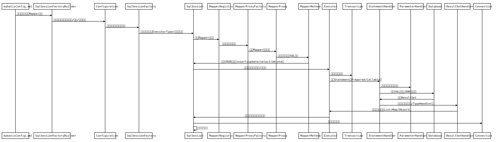

# MyBatis执行链路解析与组件功能详解

## 引言

## 

MyBatis 是一个优秀的半自动化 ORM（对象关系映射）框架，广泛应用于 Java 项目中。它通过简洁的配置和灵活的 SQL 管理，帮助开发者高效地与数据库交互。本文将深入剖析 MyBatis 的执行链路，逐一讲解核心组件的功能及其在整个流程中的作用，适合希望深入理解 MyBatis 工作原理的开发者阅读。

------

## MyBatis 执行链路概览

MyBatis 的执行链路可以概括为以下步骤：

1. **初始化阶段**：通过配置文件（通常是 `mybatis-config.xml`）创建 `SqlSessionFactory`。
2. **会话创建**：通过 `SqlSessionFactory` 打开一个 `SqlSession` 会话。
3. **Mapper 获取**：通过 `SqlSession` 获取 Mapper 接口的动态代理对象。
4. **SQL 执行**：通过 Mapper 接口调用方法，触发 SQL 执行，涉及 `Executor`、`StatementHandler`、`ParameterHandler` 和 `ResultSetHandler` 等组件。
5. **结果处理**：将数据库返回的结果映射为 Java 对象。

接下来，我们将详细梳理每个组件的功能，并模拟面试场景，回答面试官可能提出的“拷问”问题。

------

## 核心组件详解

### 1. SqlSessionFactory

**功能**：
`SqlSessionFactory` 是 MyBatis 的核心入口，负责创建 `SqlSession` 对象。它通常基于 `mybatis-config.xml` 或 Java 配置初始化，加载全局配置、数据源、Mapper 文件等信息。

**作用**：

- 解析配置文件，初始化 MyBatis 的 `Configuration` 对象。
- 管理数据源（`DataSource`）和事务工厂（`TransactionFactory`）。
- 缓存 Mapper 文件的解析结果（如 SQL 语句、映射规则）。

**执行链路中的位置**：
`SqlSessionFactory` 是 MyBatis 的起点，通常是单例模式，应用启动时创建一次，供全局使用。

**面试官拷问**：

- Q1: SqlSessionFactory

   是线程安全的吗？为什么？

  - **A**: 是的，`SqlSessionFactory` 是线程安全的。它在初始化时将配置信息加载到内存中（如 `Configuration` 对象），这些信息是只读的，且不涉及运行时状态修改。因此，多个线程可以安全地共享同一个 `SqlSessionFactory` 实例，通常在应用中以单例模式使用。

- Q2: 如果我要动态修改 MyBatis 配置（比如添加新的 Mapper），怎么办？

  - **A**: `SqlSessionFactory` 初始化后，其配置是不可变的。如果需要动态修改配置（如添加新的 Mapper），需要重新构建 `SqlSessionFactory`，但这会带来性能开销。实际场景中，可以通过插件机制（`Interceptor`）或在初始化时预加载所有 Mapper 文件来避免动态重建。

### 2. SqlSession

**功能**：
`SqlSession` 是 MyBatis 的会话接口，提供与数据库交互的方法，如 `selectOne`、`insert`、`update` 等。它是操作数据库的直接入口。

**作用**：

- 提供方法调用（如 `getMapper`）获取 Mapper 接口的代理对象。
- 管理事务（提交、回滚）。
- 提供一级缓存（默认开启，作用域为当前会话）。

**执行链路中的位置**：
`SqlSession` 是客户端与 MyBatis 核心执行层的桥梁，负责将用户的请求传递给底层的 `Executor`。

**面试官拷问**：

- Q1: SqlSession是线程安全的吗？
  - **A**: 不是，`SqlSession` 不是线程安全的。`SqlSession` 内部维护了**事务状态和一级缓存**，这些状态在**多线程环境下可能导致数据不一致**。因此，每个线程都应该创建自己的 `SqlSession` 实例，使用完后关闭。
- Q2: 如果我忘了关闭 SqlSession，会有什么后果？
  - **A**: 如果不关闭 `SqlSession`，可能导致数据库连接未释放，耗尽连接池资源，尤其在高并发场景下。此外，一级缓存中的数据可能占用内存，导致内存泄漏。在 Spring 环境中，MyBatis 通常通过 `SqlSessionTemplate` 自动管理 `SqlSession` 的生命周期，避免手动关闭的问题。

### 3. Mapper 接口与 XML 映射文件

**功能**：
Mapper 接口是一个 **Java 接口**，结合 **XML 映射文件**（或注解）定义 **SQL 语句及结果映射规则**。MyBatis 通过**动态代理技术**为 **Mapper** 接口生成实现类。

**作用**：

- Mapper **接口提供声明式 API**，开发者通过**调用接口方法执行 SQL**。
- XML 映射文件定义 SQL 语句、参数映射、结果映射等。
- 两者结合实现 Java 代码与 SQL 的解耦。

**执行链路中的位置**：
Mapper 接口的调用会触发 **MyBatis** 的动态代理机制，最终将请求交给 `SqlSession` 的底层执行器。

**面试官拷问**：

- Q1: Mapper 接口是如何实现动态代理的？
  - **A**: MyBatis 使用 JDK 动态代理生成 **Mapper** 接口的实现类。在 `SqlSession.getMapper` 方法中，MyBatis 通过 `MapperProxyFactory` 创建代理对象。代理对象拦截接口方法调用，根据**方法名**和**接口全限定名**在 `Configuration` 中查找对应的 `MappedStatement`（包含 SQL 信息），然后委托给 `SqlSession` 执行。
- Q2: 如果 **Mapper** 接口和 XML 文件中的 **SQL ID** 不匹配，会发生什么？
  - **A**: 如果 Mapper 接口的方法名与 XML 文件中的 SQL ID 不匹配，MyBatis 在初始化时会抛出 `BindingException`，提示**找不到对应的** `MappedStatement`。这是因为 MyBatis **依赖方法名和 SQL ID** 的映射关系来**定位 SQL** 语句。

### 4. Executor 执行器

**功能**：
`Executor` 是 MyBatis 的核心执行器，负责执行 SQL 语句并管理缓存。它有多种实现，包括：

- `SimpleExecutor`：每次执行都创建新的 `PreparedStatement`。
- `ReuseExecutor`：复用 `PreparedStatement`，提高性能。
- `BatchExecutor`：支持批量操作，减少数据库交互。
- `CachingExecutor`：封装其他 Executor，提供二级缓存支持。

**作用**：

- 负责 SQL 的执行逻辑，包括参数绑定、语句执行和结果处理。
- 管理一级缓存（会话级）和二级缓存（全局级）。
- 支持事务管理和批量操作。

**执行链路中的位置**：
`Executor` 接收 `SqlSession` 的请求，调用 `StatementHandler` 执行具体的 SQL 操作。

**面试官拷问**：

- Q1: MyBatis 的缓存机制是如何实现的？
  - **A**: MyBatis 提供一级缓存和二级缓存。一级缓存默认开启，作用域为 `SqlSession`，由 `BaseExecutor` 维护（基于 `PerpetualCache`，本质是 `HashMap`）。相同 SQL 在同一会话中只执行一次，结果缓存。二级缓存需手动开启，作用域为 Mapper 命名空间，由 `CachingExecutor` 管理，缓存到全局 `Configuration` 中。二级缓存支持跨会话，但需要注意事务隔离和缓存一致性问题。
- Q2: 如果我要自定义 Executor，如何实现？
  - **A**: 可以通过实现 `Executor` 接口或继承 `BaseExecutor` 创建自定义执行器。然后在 MyBatis 配置文件中通过 `<setting name="defaultExecutorType" value="CUSTOM"/>` 指定自定义 Executor 类型，或者通过插件（`Interceptor`）动态拦截 `Executor` 的方法。这种方式常用于扩展缓存策略或自定义 SQL 执行逻辑。

### 5. StatementHandler

**功能**：
`StatementHandler` 负责与 JDBC 交互，处理 `PreparedStatement` 或 `CallableStatement` 的创建和执行。

**作用**：

- 创建 JDBC 的 `Statement` 对象。
- 设置 SQL 参数（通过 `ParameterHandler`）。
- 执行 SQL 并获取结果（通过 `ResultSetHandler`）。

**执行链路中的位置**：
`StatementHandler` 是 `Executor` 的下游，负责具体的 SQL 执行。

**面试官拷问**：

- Q1

  : 

  ```
  StatementHandler
  ```

   和 

  ```
  PreparedStatementHandler
  ```

   有什么区别？

  - **A**: `StatementHandler` 是一个接口，定义了 SQL 执行的通用方法。`PreparedStatementHandler` 是其实现类之一，专门处理 `PreparedStatement` 类型的 SQL（预编译 SQL，支持参数占位符）。还有 `SimpleStatementHandler`（处理普通 `Statement`）和 `CallableStatementHandler`（处理存储过程）。MyBatis 根据 `MappedStatement` 的配置选择合适的实现。

- Q2

  : 如果 SQL 执行很慢，如何排查问题？

  - A

    : 慢 SQL 可能由多种原因引起：

    1. 检查 SQL 语句本身，是否缺少索引或查询范围过大。
    2. 查看 `StatementHandler` 的日志，确认参数绑定是否正确。
    3. 检查数据库连接池配置，确保连接获取时间正常。
    4. 使用 MyBatis 插件拦截 `StatementHandler` 的 `query` 方法，记录执行时间。
    5. 分析数据库性能（如慢查询日志）或网络延迟。

### 6. ParameterHandler

**功能**：
`ParameterHandler` 负责将 Java 参数绑定到 `PreparedStatement` 的占位符中。

**作用**：

- 根据参数类型和映射规则，设置 `PreparedStatement` 的参数值。
- 处理复杂参数（如对象、集合）到 SQL 参数的转换。

**执行链路中的位置**：
由 `StatementHandler` 调用，在执行 SQL 前完成参数绑定。

**面试官拷问**：

- Q1

  : 如果传入的参数是复杂对象，

  ```
  ParameterHandler
  ```

   如何处理？

  - **A**: `ParameterHandler` 使用 MyBatis 的 `TypeHandler` 系统处理复杂对象。MyBatis 会根据参数的 Java 类型和 JDBC 类型，调用对应的 `TypeHandler`（如 `BaseTypeHandler` 的子类）将 Java 对象转换为 JDBC 可识别的参数。例如，对于自定义对象，MyBatis 会解析对象的属性，结合 XML 中的 `#{}` 占位符进行映射。

- Q2

  : 如何自定义参数处理逻辑？

  - **A**: 可以通过实现 `TypeHandler` 接口自定义参数处理逻辑。在 `TypeHandler` 中实现 `setParameter` 方法，定义如何将 Java 对象转换为 JDBC 参数。然后在 MyBatis 配置文件中注册自定义 `TypeHandler`，或者在 XML 映射文件中通过 `typeHandler` 属性指定。

### 7. ResultSetHandler

**功能**：
`ResultSetHandler` 负责将 JDBC 的 `ResultSet` 转换为 Java 对象。

**作用**：

- 根据 XML 映射文件中的 `<resultMap>` 配置，将数据库查询结果映射为 Java 对象。
- 处理复杂映射，如嵌套对象、集合等。
- 支持自定义 `TypeHandler` 处理特殊类型。

**执行链路中的位置**：
由 `StatementHandler` 调用，在 SQL 执行后处理返回的 `ResultSet`。

**面试官拷问**：

- Q1

  : 如果查询结果与 Java 对象字段不匹配，

  ```
  ResultSetHandler
  ```

   如何处理？

  - **A**: `ResultSetHandler` 依赖 `<resultMap>` 或自动映射规则进行字段匹配。如果字段名不匹配，可以在 XML 中通过 `<result>` 标签指定 `column` 和 `property` 的映射关系，或者使用 `@Alias` 注解为字段定义别名。如果仍然不匹配，MyBatis 会忽略未映射的字段，或者抛出异常（视配置而定）。

- Q2

  : 如何优化复杂对象映射的性能？

  - A

    : 优化复杂对象映射可以从以下方面入手：

    1. 使用 `<resultMap>` 明确定义映射关系，避免自动映射的性能开销。
    2. 减少不必要的嵌套查询，使用 `<association>` 和 `<collection>` 延迟加载。
    3. 启用二级缓存，减少重复查询。
    4. 自定义高效的 `TypeHandler`，减少类型转换开销。

------

## MyBatis 执行链路总结

```java
mybatisConfig.xml->SqlSessionFactoryBuilder: 解析全局配置和Mapper映射  
SqlSessionFactoryBuilder->Configuration: 构建配置对象（含数据源/事务/插件等）  
Configuration->SqlSessionFactory: 初始化工厂（基于配置）  
SqlSessionFactory->SqlSession: 创建会话（指定ExecutorType/事务隔离）  
SqlSession->MapperRegistry: 获取Mapper接口类  
MapperRegistry->MapperProxyFactory: 创建动态代理工厂  
MapperProxyFactory->MapperProxy: 生成Mapper代理对象  
MapperProxy->MapperMethod: 解析方法签名和SQL命令  
MapperMethod->SqlSession: 触发CRUD操作（insert/update/select/delete）  
SqlSession->Executor: 委托执行（判断缓存/事务）  
Executor->Transaction: 获取数据库连接  
Executor->StatementHandler: 创建Statement（Prepared/Callable）  
StatementHandler->ParameterHandler: 绑定参数（类型转换）  
StatementHandler->Database: 执行SQL（通过JDBC驱动）  
Database->StatementHandler: 返回ResultSet  
StatementHandler->ResultSetHandler: 映射结果集（反射/TypeHandler）  
ResultSetHandler->Executor: 返回处理结果（List/Map/Object）  
Executor->SqlSession: 提交事务（若需手动提交）  
SqlSession->Connection: 关闭数据库连接  
SqlSession->SqlSession: 清空一级缓存  
```

以下是 MyBatis 的完整执行链路：

1. 应用通过 `SqlSessionFactory` 创建 `SqlSession`。
2. 通过 `SqlSession` 获取 Mapper 接口的动态代理对象。
3. 调用 Mapper 方法，触发 `SqlSession` 委托给 `Executor`。
4. `Executor` 调用 `StatementHandler` 准备 SQL。
5. `StatementHandler` 使用 `ParameterHandler` 绑定参数。
6. `StatementHandler` 执行 SQL，获取 `ResultSet`。
7. `ResultSetHandler` 将 `ResultSet` 映射为 Java 对象。
8. 返回结果，关闭 `SqlSession`（或由 Spring 管理）。

------

## 模拟面试场景：终极拷问

**面试官**: 假设一个查询性能很差，你会从 MyBatis 的哪个组件入手优化？
**回答**：
我会从以下几个方面入手：

1. **SQL 优化**：检查 XML 映射文件中的 SQL 语句，分析是否需要添加索引或优化查询条件。这与 `StatementHandler` 相关。
2. **缓存优化**：检查一级缓存（`Executor` 管理的会话级缓存）和二级缓存是否启用，是否命中率低。如果是重复查询，启用二级缓存（由 `CachingExecutor` 管理）。
3. **参数和结果映射**：检查 `ParameterHandler` 和 `ResultSetHandler` 是否处理复杂对象导致性能瓶颈。可以通过自定义 `TypeHandler` 或优化 `<resultMap>` 提高效率。
4. **Executor 选择**：确认是否使用了合适的 `Executor` 类型，例如批量操作是否使用了 `BatchExecutor`。
5. **日志分析**：启用 MyBatis 的日志，查看 `StatementHandler` 的 SQL 执行时间，定位瓶颈是否在数据库端。

**面试官**: 如果我要实现一个 MyBatis 插件来记录 SQL 执行时间，应该拦截哪个组件？
**回答**：
应该拦截 `StatementHandler` 的 `query` 和 `update` 方法。`StatementHandler` 是 SQL 执行的直接入口，拦截其方法可以精确记录 SQL 的准备、参数绑定和执行时间。插件实现示例如下：


```java
package com.example.mybatis.plugin;

import org.apache.ibatis.executor.statement.StatementHandler;
import org.apache.ibatis.plugin.*;

import java.sql.Statement;
import java.util.Properties;

@Intercepts({
    @Signature(type = StatementHandler.class, method = "query", args = {Statement.class}),
    @Signature(type = StatementHandler.class, method = "update", args = {Statement.class})
})
public class SqlExecutionTimePlugin implements Interceptor {
    @Override
    public Object intercept(Invocation invocation) throws Throwable {
        long startTime = System.currentTimeMillis();
        try {
            return invocation.proceed();
        } finally {
            long endTime = System.currentTimeMillis();
            System.out.println("SQL Execution Time: " + (endTime - startTime) + "ms");
        }
    }
@Override
public Object plugin(Object target) {
    return Plugin.wrap(target, this);
}

@Override
public void setProperties(Properties properties) {
    // 配置属性
}
    }
```

