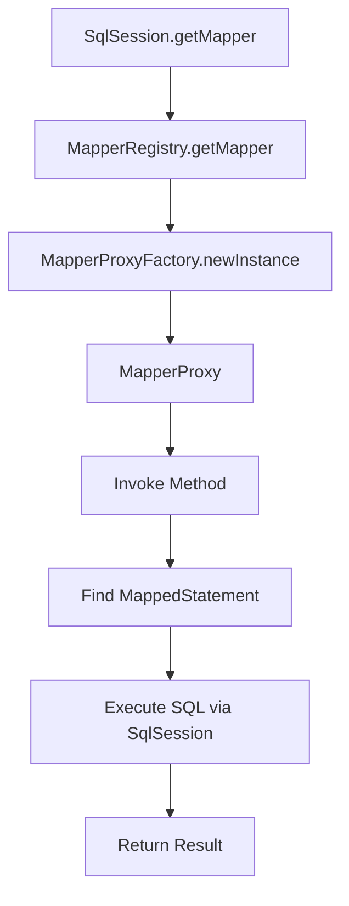

# MyBatis 中 Mapper.xml 与 Mapper 接口的关联机制详解

MyBatis 是一个优秀的 Java 持久层框架，以其灵活的 SQL 映射和简洁的开发方式受到广泛欢迎。在 MyBatis 中，`mapper.xml` 文件和 Mapper 接口的关联是其核心功能之一。本文将详细分析 `mapper.xml` 如何与 Mapper 接口关联，深入探讨底层实现原理，并通过模拟面试场景，进一步剖析相关知识点，帮助开发者更深入地理解 MyBatis 的工作机制。

## 一、MyBatis 概述

MyBatis 是一个支持动态 SQL、存储过程以及高级映射的持久层框架。与传统的 JDBC 相比，MyBatis 简化了数据库操作，通过 XML 或注解定义 SQL 语句，并将查询结果映射到 Java 对象。MyBatis 的核心组件包括：

- **SqlSessionFactory**：用于创建 SqlSession，管理数据库连接和配置。
- **SqlSession**：提供数据库操作的接口，类似于 JDBC 的 Connection。
- **Mapper 接口**：定义数据库操作的方法，开发者通过接口调用 SQL。
- **Mapper.xml**：定义 SQL 语句和映射规则，与 Mapper 接口对应。

在 MyBatis 的使用中，Mapper 接口和 `mapper.xml` 文件的关联是实现动态 SQL 执行的关键。接下来，我们将从实现机制、底层原理和面试场景三个方面进行详细分析。

## 二、Mapper.xml 与 Mapper 接口的关联机制

### 2.1 基本使用示例

为了直观理解 `mapper.xml` 和 Mapper 接口的关联，我们先来看一个简单的示例。

#### Mapper 接口

```java
package com.example.mapper;

public interface UserMapper {
    User selectUserById(Long id);
}
```

#### Mapper.xml

```xml
<?xml version="1.0" encoding="UTF-8" ?>
<!DOCTYPE mapper PUBLIC "-//mybatis.org//DTD Mapper 3.0//EN" "http://mybatis.org/dtd/mybatis-3-mapper.dtd">
<mapper namespace="com.example.mapper.UserMapper">
    <select id="selectUserById" resultType="com.example.model.User">
        SELECT id, username, email FROM user WHERE id = #{id}
    </select>
</mapper>
```

#### 配置 MyBatis

```java
String resource = "mybatis-config.xml";
InputStream inputStream = Resources.getResourceAsStream(resource);
SqlSessionFactory sqlSessionFactory = new SqlSessionFactoryBuilder().build(inputStream);
SqlSession sqlSession = sqlSessionFactory.openSession();
UserMapper userMapper = sqlSession.getMapper(UserMapper.class);
User user = userMapper.selectUserById(1L);
```

在这个示例中，`UserMapper` 接口中的 `selectUserById` 方法与 `mapper.xml` 中的 `<select>` 标签通过 `namespace` 和 `id` 关联起来。以下是关联机制的核心点：

1. **namespace**：`mapper.xml` 的 `namespace` 属性必须与 Mapper 接口的全限定名（Fully Qualified Name）一致，例如 `com.example.mapper.UserMapper`。
2. **方法名与 SQL ID**：`mapper.xml` 中 SQL 标签的 `id` 属性（如 `selectUserById`）必须与 Mapper 接口中的方法名一致。
3. **参数与结果映射**：方法的参数通过 `#{}` 占位符在 SQL 中使用，返回值通过 `resultType` 或 `resultMap` 映射到 Java 对象。

### 2.2 关联过程

MyBatis 的 Mapper 接口本质上是一个动态代理接口，其实现由 MyBatis 动态生成。以下是关联的详细过程：

1. **加载配置**：
   - MyBatis 通过 `mybatis-config.xml` 或 Java 配置加载 `mapper.xml` 文件。
   - 解析 `mapper.xml`，将 `namespace` 和 SQL 语句信息存储到 `Configuration` 对象的 `MappedStatement` 集合中。
   - `MappedStatement` 是 MyBatis 中表示 SQL 语句的核心对象，包含 SQL、参数映射、结果映射等信息。
2. **动态代理生成**：
   - 当调用 `sqlSession.getMapper(UserMapper.class)` 时，MyBatis 使用 JDK 动态代理为 `UserMapper` 接口生成代理对象。
   - 代理对象的实现类是 `MapperProxy`，它拦截接口方法的调用，并根据方法名和 `namespace` 查找对应的 `MappedStatement`。
3. **方法调用与 SQL 执行**：
   - 代理对象将方法调用转换为对 `MappedStatement` 的操作。
   - `SqlSession` 执行对应的 SQL 语句，处理参数绑定和结果映射，最终返回结果。

### 2.3 关键类与流程

以下是 MyBatis 中实现 Mapper 关联的核心类和流程：

- **Configuration**：MyBatis 的核心配置类，存储所有 `MappedStatement` 和 Mapper 信息。
- **MapperRegistry**：负责管理 Mapper 接口和代理对象的映射。
- **MapperProxyFactory**：为每个 Mapper 接口生成代理对象。
- **MapperProxy**：动态代理的 InvocationHandler，拦截方法调用并执行 SQL。
- **MappedStatement**：表示 `mapper.xml` 中的一条 SQL 语句，包含 SQL 文本、参数类型、结果类型等。

流程图如下：



## 三、底层原理分析

### 3.1 动态代理机制

MyBatis 的 Mapper 接口没有实现类，但可以通过 `sqlSession.getMapper()` 获取一个可调用的实例。这是因为 MyBatis 使用了 JDK 动态代理技术。以下是动态代理的实现细节：

#### MapperProxy 的核心代码

```java
public class MapperProxy<T> implements InvocationHandler, Serializable {
    private final SqlSession sqlSession;
    private final Class<T> mapperInterface;

    public MapperProxy(SqlSession sqlSession, Class<T> mapperInterface) {
        this.sqlSession = sqlSession;
        this.mapperInterface = mapperInterface;
    }

    @Override
    public Object invoke(Object proxy, Method method, Object[] args) throws Throwable {
        if (Object.class.equals(method.getDeclaringClass())) {
            return method.invoke(this, args);
        }
        // 获取 MappedStatement 并执行
        MapperMethod mapperMethod = cachedMapperMethod(method);
        return mapperMethod.execute(sqlSession, args);
    }
}
```

- **invoke 方法**：拦截 Mapper 接口的方法调用，判断是否为 Object 类的方法（如 `toString`），如果是，则直接调用；否则，构造 `MapperMethod` 并执行。
- **MapperMethod**：封装了方法签名和对应的 `MappedStatement`，负责参数绑定和 SQL 执行。

### 3.2 MappedStatement 的构建

`mapper.xml` 文件在 MyBatis 初始化时被解析为 `MappedStatement` 对象。解析过程如下：

1. **XML 解析**：
   - MyBatis 使用 `XMLConfigBuilder` 解析 `mybatis-config.xml`，加载所有 Mapper 文件。
   - `XMLMapperBuilder` 解析 `mapper.xml`，提取 `namespace`、SQL 语句、参数映射等信息。
   - 每个 `<select>`、`<insert>` 等标签对应一个 `MappedStatement`。
2. **存储到 Configuration**：
   - 解析后的 `MappedStatement` 以 `namespace + "." + id` 作为 key 存储在 `Configuration` 的 `mappedStatements` 集合中。
   - 例如，`com.example.mapper.UserMapper.selectUserById` 对应一个唯一的 `MappedStatement`。

### 3.3 参数与结果映射

- **参数映射**：
  - MyBatis 支持多种参数传递方式，如基本类型、POJO、Map 等。
  - 在 `mapper.xml` 中，通过 `#{}` 占位符引用参数，MyBatis 使用反射获取参数值。
  - 如果是多参数调用，MyBatis 使用 `ParamNameResolver` 解析参数名（如 `@Param` 注解或默认的 `arg0`、`arg1`）。
- **结果映射**：
  - `resultType` 指定返回的 Java 类型，MyBatis 自动将查询结果映射到对象。
  - `resultMap` 提供更复杂的映射规则，支持嵌套对象、关联查询等。
  - 结果映射通过 `ResultSetHandler` 完成，使用反射或 getter/setter 设置对象属性。

### 3.4 执行流程

当调用 Mapper 接口方法时，MyBatis 的执行流程如下：

1. **调用代理方法**：
   - 用户调用 `userMapper.selectUserById(1L)`，触发 `MapperProxy.invoke`。
   - 根据方法名和 `namespace`，查找 `Configuration` 中的 `MappedStatement`。
2. **参数处理**：
   - `MapperMethod` 使用 `ParamNameResolver` 解析参数，绑定到 SQL 语句的占位符。
3. **SQL 执行**：
   - `SqlSession` 调用底层的 `Executor`（如 `SimpleExecutor` 或 `CachingExecutor`）执行 SQL。
   - `Executor` 通过 `StatementHandler` 准备 SQL 语句，设置参数，执行查询。
4. **结果处理**：
   - `ResultSetHandler` 处理查询结果，根据 `resultType` 或 `resultMap` 映射到 Java 对象。
   - 返回结果给调用者。

## 四、模拟面试场景

以下是模拟面试官对 MyBatis Mapper 机制的提问，以及详细解答。假设面试官是一位经验丰富的技术专家，会从基础到深入逐步提问。

### 4.1 问题 1：Mapper 接口是如何工作的？为什么不需要实现类？

**面试官**：在 MyBatis 中，我们定义了一个 Mapper 接口，比如 `UserMapper`，但没有提供实现类，直接通过 `sqlSession.getMapper` 就能调用方法。这是如何实现的？

**回答**：
MyBatis 使用 JDK 动态代理为 Mapper 接口生成实现。核心步骤如下：

1. **动态代理**：
   - 调用 `sqlSession.getMapper(UserMapper.class)` 时，MyBatis 的 `MapperRegistry` 使用 `MapperProxyFactory` 创建一个代理对象。
   - 代理对象的 `InvocationHandler` 是 `MapperProxy`，它拦截接口方法调用。
2. **方法映射**：
   - `MapperProxy` 根据接口的全限定名和方法名，查找 `Configuration` 中的 `MappedStatement`。
   - `MappedStatement` 存储了 `mapper.xml` 中定义的 SQL 语句和映射规则。
3. **SQL 执行**：
   - `MapperProxy` 将方法调用委托给 `MapperMethod`，`MapperMethod` 使用 `SqlSession` 执行对应的 SQL。
   - 参数通过 `ParamNameResolver` 绑定到 SQL，查询结果通过 `ResultSetHandler` 映射到对象。

这种机制的优点是开发者只需定义接口和 XML，无需手动实现，MyBatis 自动完成 SQL 执行和结果映射。

### 4.2 问题 2：`mapper.xml` 的 namespace 和 id 是如何与接口关联的？

**面试官**：在 `mapper.xml` 中，我们定义了 `namespace` 和 `id`，它们是如何与 Mapper 接口的方法关联起来的？

**回答**：
`mapper.xml` 的 `namespace` 和 `id` 是 MyBatis 关联 Mapper 接口和 SQL 语句的关键：

- **namespace**：
  - `namespace` 必须与 Mapper 接口的全限定名一致，例如 `com.example.mapper.UserMapper`。
  - MyBatis 在解析 `mapper.xml` 时，将 `namespace` 作为前缀，构建 `MappedStatement` 的唯一标识。
- **id**：
  - `id` 对应 Mapper 接口中的方法名，例如 `<select id="selectUserById">` 对应 `selectUserById` 方法。
  - MyBatis 将 `namespace + "." + id`（如 `com.example.mapper.UserMapper.selectUserById`）作为 key，存储 `MappedStatement`。
- **关联过程**：
  - 在初始化时，MyBatis 解析 `mapper.xml`，将每个 SQL 语句封装为 `MappedStatement`，存储在 `Configuration` 的 `mappedStatements` 集合中。
  - 调用接口方法时，`MapperProxy` 根据方法签名查找对应的 `MappedStatement`，从而执行 SQL。

这种设计确保了接口方法与 SQL 语句的一一对应，提供了清晰的映射关系。

### 4.3 问题 3：如果方法名和 XML 的 id 不一致会怎样？

**面试官**：如果我在 `mapper.xml` 中定义了一个 `<select id="findUserById">`，但接口方法名是 `selectUserById`，会发生什么？

**回答**：
如果 `mapper.xml` 中的 `id` 与接口方法名不一致，MyBatis 在调用接口方法时会抛出异常，通常是 `BindingException`，提示找不到对应的 `MappedStatement`。

**原因**：

- MyBatis 使用 `namespace + "." + methodName` 作为 key 查找 `MappedStatement`。
- 如果方法名是 `selectUserById`，MyBatis 会尝试查找 `com.example.mapper.UserMapper.selectUserById`，但 `mapper.xml` 中只有 `findUserById`，导致找不到匹配的 SQL。

**解决方案**：

- 确保 `mapper.xml` 中的 `id` 与接口方法名一致。
- 如果需要不同的命名，可以使用注解（如 `@Select`）直接在接口方法上定义 SQL，避免 XML 配置。

### 4.4 问题 4：MyBatis 是如何处理多参数的？

**面试官**：如果 Mapper 接口方法有多个参数，比如 `selectUsersByNameAndAge(String name, int age)`，MyBatis 如何处理？

**回答**：
MyBatis 使用 `ParamNameResolver` 处理多参数情况，具体机制如下：

1. **默认参数名**：
   - 如果没有使用 `@Param` 注解，MyBatis 使用默认参数名 `arg0`、`arg1` 或 `param1`、`param2`。
   - 例如，`selectUsersByNameAndAge(String name, int age)` 的参数在 `mapper.xml` 中可以通过 `#{arg0}` 和 `#{arg1}` 访问。
2. **使用 @Param 注解**：
   - 如果方法签名是 `selectUsersByNameAndAge(@Param("name") String name, @Param("age") int age)`，可以在 `mapper.xml` 中使用 `#{name}` 和 `#{age}`。
   - `@Param` 注解明确指定了参数名，提高可读性。
3. **底层处理**：
   - `ParamNameResolver` 在运行时解析方法签名，生成参数映射。
   - 在执行 SQL 时，MyBatis 使用反射获取参数值，绑定到 SQL 的占位符。

**示例**：

```java
List<User> selectUsersByNameAndAge(@Param("name") String name, @Param("age") int age);
<select id="selectUsersByNameAndAge" resultType="com.example.model.User">
    SELECT * FROM user WHERE username = #{name} AND age = #{age}
</select>
```

这种机制支持灵活的参数传递，适用于复杂查询场景。

### 4.5 问题 5：MyBatis 的缓存机制如何影响 Mapper 执行？

**面试官**：MyBatis 的缓存机制会如何影响 Mapper 接口的执行？一级缓存和二级缓存的区别是什么？

**回答**：
MyBatis 提供了两级缓存机制，影响 Mapper 接口的执行效率和数据一致性。

1. **一级缓存（SqlSession 级缓存）**：

   - **作用范围**：同一个 `SqlSession` 内有效。

   - 工作原理

     ：

     - 一级缓存默认开启，存储在 `PerpetualCache` 中，以 `MappedStatement` 的 ID 和参数为 key，查询结果为 value。
     - 同一 `SqlSession` 内，重复执行相同 SQL（相同 `MappedStatement` 和参数）会直接从缓存返回结果。

   - 清除时机

     ：

     - `SqlSession` **执行增删改操作时，一级缓存会被清空**（防止脏读）。
     - `SqlSession` 关闭时，缓存失效。

   - **影响**：提高同一 `SqlSession` 内的查询效率，但不跨 `SqlSession` 共享。

2. **二级缓存（Mapper 级缓存）**：

   - **作用范围**：同一个 `namespace` 的 **Mapper** 共享，跨 `SqlSession` 有效。

   - 配置方式

     ：

     - 在 `mybatis-config.xml` 中启用 `<setting name="cacheEnabled" value="true"/>`。
     - 在 `mapper.xml` 中添加 `<cache/>` **标签或自定义缓存实现。**

   - 工作原理

     ：

     - 查询结果存储在 `Cache` 接口的实现中（如 `PerpetualCache`），以 `namespace` 为作用域。
     - 不同 `SqlSession` 执行相同 SQL 可共享缓存。

   - 清除时机

     ：

     - 同一 `namespace` 下的增删改操作会清空二级缓存。
     - 缓存的 LRU（最近最少使用）策略或其他策略可能移除旧数据。

   - **影响**：提高跨 `SqlSession` 的查询效率，但需要注意数据一致性问题。

**区别**：

- 一级缓存是 `SqlSession` 级别，默认开启，适合短生命周期查询。
- 二级缓存是 `namespace` 级别，需手动配置，适合共享数据场景，但可能引发脏数据问题。

**注意事项**：

- 在高并发场景下，二级缓存可能导致数据不一致，建议谨慎使用。
- 对于频繁更新的表，禁用缓存或设置短的缓存过期时间。

### 4.6 问题 6：MyBatis 如何处理动态 SQL？

**面试官**：MyBatis 的动态 SQL 是如何实现的？在 `mapper.xml` 中使用 `<if>`、`<foreach>` 等标签的底层原理是什么？

**回答**：
MyBatis 的动态 SQL 通过 XML 标签（如 `<if>`、`<where>`、`<foreach>`）实现，底层基于 OGNL（Object-Graph Navigation Language）表达式和动态 SQL 解析器。

1. **动态 SQL 标签**：
   - `<if>`：根据条件动态包含 SQL 片段。
   - `<where>`：自动处理 WHERE 条件，避免多余的 AND/OR。
   - `<foreach>`：遍历集合，生成批量 SQL。
   - 其他标签如 `<choose>`、`<set>` 等提供更灵活的 SQL 拼接。
2. **底层原理**：
   - **XML 解析**：`XMLMapperBuilder` 解析 `mapper.xml` 时，将动态 SQL 标签转换为 `SqlNode` 树。
   - **SqlNode 树**：每个标签（如 `<if>`、`<foreach>`）对应一个 `SqlNode` 实现，例如 `IfSqlNode`、`ForEachSqlNode`。
   - **OGNL 表达式**：动态条件（如 `<if test="name != null">`）使用 OGNL 表达式解析参数，判断是否包含 SQL 片段。
   - **SQL 拼接**：在执行时，MyBatis 遍历 `SqlNode` 树，根据参数值动态生成最终的 SQL 语句。
3. **执行流程**：
   - `DynamicSqlSource` 是动态 SQL 的入口，负责解析 `SqlNode` 树。
   - `BoundSql` 对象保存最终的 SQL 语句和参数映射。
   - `StatementHandler` 使用 `BoundSql` 执行 SQL。

**示例**：

```xml
<select id="selectUsersByCondition" resultType="com.example.model.User">
    SELECT * FROM user
    <where>
        <if test="name != null">
            AND username = #{name}
        </if>
        <if test="age != null">
            AND age = #{age}
        </if>
    </where>
</select>
```

**底层工作**：

- `<where>` 标签生成 `WhereSqlNode`，自动添加 WHERE 关键字并去除多余的 AND/OR。
- `<if>` 标签生成 `IfSqlNode`，根据 OGNL 表达式（如 `name != null`）决定是否包含 SQL 片段。
- 最终 SQL 可能是 `SELECT * FROM user WHERE username = ?` 或 `SELECT * FROM user WHERE username = ? AND age = ?`。

这种机制使 MyBatis 的动态 SQL 既灵活又安全，避免了 SQL 注入风险。

### 4.7 问题 7：MyBatis 的事务管理如何工作？

**面试官**：MyBatis 的事务管理是如何实现的？Mapper 接口调用时如何确保事务一致性？

**回答**：
MyBatis 的事务管理通过 `SqlSession` 和 `Transaction` 接口实现，支持手动和自动提交事务。

1. **事务管理核心组件**：
   - **SqlSession**：提供事务控制方法，如 `commit()`、`rollback()`、`close()`。
   - **Transaction**：抽象事务接口，常见实现包括 `JdbcTransaction`（基于 JDBC）和 `ManagedTransaction`（由容器管理）。
   - **Executor**：执行 SQL 的组件，受事务控制。
2. **事务模式**：
   - **自动提交**：创建 `SqlSession` 时设置 `autoCommit=true`（如 `sqlSessionFactory.openSession(true)`），执行 SQL 后立即提交。
   - **手动提交**：默认模式，需显式调用 `sqlSession.commit()` 提交事务，否则调用 `rollback()` 回滚。
3. **Mapper 接口与事务**：
   - Mapper 接口方法通过 `SqlSession` 执行，事务状态由 `SqlSession` 管理。
   - 在同一个 `SqlSession` 内，多次调用 Mapper 方法共享同一事务。
   - 如果使用 Spring 集成 MyBatis，Spring 的 `@Transactional` 注解管理事务，MyBatis 的 `SqlSession` 由 `SqlSessionTemplate` 代理。
4. **事务一致性**：
   - 在手动提交模式下，需确保 `commit()` 或 `rollback()` 被正确调用。
   - Spring 的事务管理通过 AOP 代理，确保方法执行成功后提交事务，异常时回滚。
   - 一级缓存与事务相关，`SqlSession` 关闭或提交时清空缓存，避免脏数据。

**示例**：

```java
SqlSession session = sqlSessionFactory.openSession();
try {
    UserMapper mapper = session.getMapper(UserMapper.class);
    mapper.insertUser(new User("Alice", 25));
    mapper.updateUser(new User("Bob", 30));
    session.commit();
} catch (Exception e) {
    session.rollback();
    throw e;
} finally {
    session.close();
}
```

**注意事项**：

- 避免长时间持有 `SqlSession`，可能导致连接池耗尽。
- 在 Spring 环境中，推荐使用 `@Transactional` 管理事务，简化代码。

### 4.8 问题 8：MyBatis 的性能优化有哪些？

**面试官**：在高并发场景下，如何优化 MyBatis 的性能？有哪些常见的性能问题？

**回答**：
MyBatis 的性能优化可以从以下几个方面入手：

1. **缓存优化**：
   - **一级缓存**：默认开启，适合短生命周期查询。避免在同一 `SqlSession` 内重复查询。
   - **二级缓存**：谨慎使用，适合读多写少的场景。配置合适的缓存策略（如 LRU），避免脏数据。
   - **自定义缓存**：集成 Redis 或 Ehcache 实现分布式缓存。
2. **SQL 优化**：
   - **索引**：为频繁查询的字段建立索引，减少全表扫描。
   - **批量操作**：使用 `<foreach>` 或 `ExecutorType.BATCH` 进行批量插入/更新，减少数据库交互。
   - **动态 SQL**：避免复杂的动态 SQL 导致性能下降，尽量简化条件判断。
3. **连接池管理**：
   - 配置合适的数据库连接池（如 HikariCP），调整最大连接数、超时时间等。
   - 避免长时间持有 `SqlSession`，及时释放连接。
4. **延迟加载**：
   - 配置 `lazyLoadingEnabled=true` 和 `aggressiveLazyLoading=false`，按需加载关联对象。
   - 使用 `resultMap` 的 `<association>` 和 `<collection>` 实现延迟加载。
5. **参数与结果优化**：
   - 减少不必要的列查询，避免 `SELECT *`。
   - 使用 `resultType` 而非 `resultMap` 简化映射，降低反射开销。
   - 避免传递大对象作为参数，减少序列化成本。
6. **Executor 选择**：
   - 默认使用 `SimpleExecutor`，每次执行 SQL 创建新 Statement。
   - 使用 `ReuseExecutor` 重用 Statement，减少 Statement 创建开销。
   - 使用 `BatchExecutor` 进行批量操作，适合批量插入/更新。

**常见性能问题**：

- **N+1 问题**：关联查询未优化，导致多次查询子表。解决方案是使用 `resultMap` 的 `<association>` 或 `<collection>` 合并查询。
- **二级缓存脏数据**：增删改操作未及时清空缓存。解决方案是合理配置缓存或禁用二级缓存。
- **SQL 注入**：动态 SQL 未正确使用 `#{}`，导致安全和性能问题。始终使用 `#{}` 而非 `${}`。

通过以上优化，MyBatis 可以在高并发场景下保持高效运行。

## 五、总结

MyBatis 的 `mapper.xml` 与 Mapper 接口的关联是其核心功能之一，依赖动态代理、`MappedStatement` 和 `Configuration` 的协同工作。底层通过 JDK 动态代理实现接口调用，`mapper.xml` 的 `namespace` 和 `id` 确保 SQL 与方法一一对应。动态 SQL、缓存机制、事务管理等进一步增强了 MyBatis 的灵活性和性能。

在面试场景中，理解 Mapper 机制的实现原理、常见问题和优化策略至关重要。开发者应熟悉动态代理、SQL 解析、参数映射等核心概念，同时关注性能优化和事务管理的最佳实践。

通过本文的分析和模拟面试，希望读者能更深入地理解 MyBatis 的工作机制，并在实际开发和面试中游刃有余。